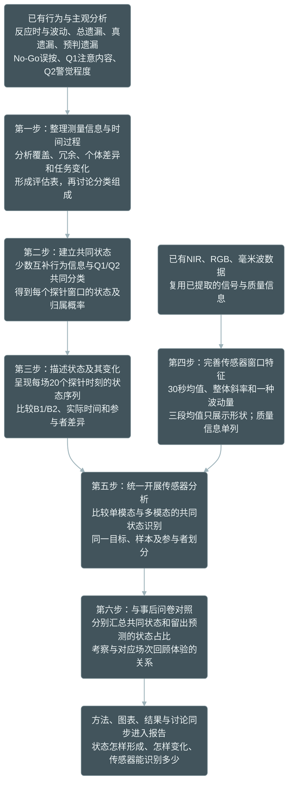

# 行为与探针共同状态及传感器分析配套实施计划

> 状态：已讨论的实施安排，新增分析尚未执行。本文配套[1.13总计划](1.13-未来四天分析与报告完善计划_20260909.md)，在已有分析代码上补充功能，不另建一套原始数据管线。
>
> 简要逻辑见[共同状态分析思路](1.14.1-共同状态分析思路_20260909.md)。具体状态组成与分类模型，在第一部分结果形成后集中讨论确定；不提前锁定五项指标、三类状态或某个软件。

## 一、整体研究逻辑

先理解行为与主观信息怎样随任务变化，确定哪些信息用于共同分类；再建立持续注意状态，研究状态的时间变化；最后检验NIR、RGB和毫米波能否识别这些状态，并与事后问卷对照。报告随分析同步更新。

## 二、第一部分：整理行为与探针，为分类提供依据

### 2.1 已有基础与本次补充

复用正式行为程序生成的场次、Block、cycle、探针前30秒表，以及B1/B2、时间进程、Q1/Q2关联、覆盖与冗余结果。先确认现有产物的版本和样本，已有结果符合当前定义时直接读取；仅补缺少的统计与集中汇总。

| 分析内容 | 研究问题 | 生成结果 |
|---|---|---|
| 覆盖、分布、机会数 | 指标能否计算，零值或缺失集中在哪里 | 指标可用性表 |
| 指标关系 | 哪些重复，哪些表达不同信息 | 冗余与互补信息表 |
| 参与者内外差异与重复场次 | 稳定个体差异和任务内变化各占多少 | 方差与稳定性结果 |
| B1/B2、cycle、探针顺序和实际时间 | 行为及主观信息怎样随任务发展 | 时间过程图 |
| 行为与Q1/Q2关联 | 主观与客观表现如何一致或分离 | 关联摘要 |

ICC用于描述差异组成，不直接等同于可靠性；重复场次稳定性另行说明时间间隔及有效重复观测数。不把低ICC直接解释为状态敏感性。

### 2.2 完整保留遗漏分类

评估阶段同时保留Go总遗漏、真遗漏、预判遗漏和No-Go误按。沿用当前时序分类与分母，检查总遗漏＝真遗漏＋预判遗漏。

真遗漏表示未检测到既定时序歧义，不直接等于注意脱落；预判遗漏不直接等于已证明的有意识预测。No-Go误按表示应抑制按键的试次发生按键，保留误按次数与有效No-Go机会数。

状态组成讨论时决定使用总遗漏还是两个组成部分，不把总量与其组成当作三份独立信息重复投入。d′与错误指标、SD与CV的关系也在这一阶段说明。

### 2.3 判断原则与讨论节点

现在确定判断原则，程序输出完整评估及建议，结果出来后集中确定分类组成。评估表逐项包含：含义、覆盖、分布、机会数、人内外差异、时间变化、指标关系、建议和理由。

以测量含义、可用性与互补性为依据；不要求指标必须与Q1/Q2显著相关、必须随时间显著变化或必须具有较大的参与者内方差。程序自动标记缺失、重复字段和冗余线索，不自动宣布最终心理指标名单。

本部分在Attention-Analysis现有行为模块基础上补充，读取已有表，生成`state_indicator_review.csv`及时间过程图。具体指标名单、变换、缺失处理和分类方法形成简短决定记录后，再进入第二部分代码实现。

## 三、第二部分：共同分类与20个探针时刻

### 3.1 分类单位与时间含义

每行对应一次探针前30秒行为及该次Q1/Q2。所有参与者使用共同的状态定义，再为各场次生成20个探针时刻的状态序列；同一人的重复场次保持关联，不单独建立个人类别。

20个窗口是局部状态观察，不是完整覆盖实验的20个连续区间。保留Block、探针顺序和实际时间，不给窗口之间的空白时间赋予已知状态。分类前分析各指标的时间变化，分类后分析整合状态的时间变化；首版不直接以早中晚位置定义类别。

### 3.2 新增功能

在Attention-Analysis增加独立共同状态入口，复用身份、配置读取和结果清单机制：读取已确定组成；采用适合类别、等级、连续值及重复观测的方法；比较少量候选类别；输出概率与类别；汇总状态特征与不确定性。

不将Q1编码当连续高低分，不将缺失补零，不根据传感器预测成绩选择类别。具体方法在组成讨论后确定，当前不指定PyMC或固定分布。类别先用中性编号，实际结果支持后再命名，不预设高、中、低。若分类缺乏可解释结构，交付实际结果，不强行命名。

### 3.3 主要输出

- `probe_state_probabilities.parquet`：参与者、场次、Block、探针、窗口时间、模型版本、各状态概率、最大概率类别及有效状态标记。
- `state_profiles.csv`与状态特征图：各类行为及Q1/Q2组合。
- `state_timecourse.csv`、每场状态序列图和群体时间图：20个观察时刻、B1/B2及实际任务进程。
- 状态参与者分布、重复场次差异、候选分类比较及模型不确定性结果。

用于分类的指标描述类别本身，不能再称为独立验证；问卷等未参与分类的信息提供额外支持。

## 四、第三部分：传感器特征与共同状态识别

### 4.1 新版主特征

复用已经提取的序列，尽量不重跑视频识别和雷达上游。新版连续信号主特征为均值、Theil–Sen整体斜率及一种波动量。首轮下表连续信号使用SD，不同时堆叠SD/CV/MAD/IQR。

| 模态 | 核心特征 | 条件说明 |
|---|---|---|
| NIR | 瞳孔几何直径均值、斜率、SD | 沿用左右眼、几何、可见性、插值和亮度处理；保留原单位 |
| RGB | 整体运动均值、斜率、SD；眨眼候选事件率 | 姿态方向作为辅助候选；事件信号不机械算连续波动；真实动作不任意当异常删除 |
| 毫米波 | 心率、呼吸率、体动均值；序列支持时计算斜率与SD | 单个窗口估计不能产生趋势；滑动估计记录时长与步长；心率估计SD不称HRV |

均值替换的是新版窗口水平统计，旧结果保留，不只改字段名，也不修改上游算法内部原有统计步骤。所有时间特征记录时间戳、有效覆盖与缺口；不跨长缺口拼接，不补零，不使用探针之后的数据。质量及混杂信息另列，保留各模态既有质量规则。

### 4.2 三段均值用于过程展示

同一30秒窗口分前、中、后三个10秒，分别计算均值。它们用于展示粗略形状，首版不进入主预测模型，不增加独立样本数，不自动贴U形或倒U形标签。

分类后按状态绘制三段变化，并同时记录每段覆盖。毫米波上游估计支持范围超过10秒时，不能伪装成独立10秒测量。整体斜率可能遗漏先升后降，SD也包含趋势造成的变化，报告按这一含义解释。不增加统一频谱分析。

### 4.3 新版传感器比较

在毫米波与多模态仓库新增独立任务入口，复用数据合并、参与者划分、训练预处理及绘图机制。新版以共同状态为目标，行为与Q1/Q2不再进入传感器预测输入。

比较训练集状态比例基线、三个单模态、三个两两组合与完整三模态，首轮采用L2正则化多项逻辑回归。状态概率如何进入训练与评分，在状态模型确定后同步写入接口说明，不静默改成确定标签。

各组合使用相同目标、可比较窗口及参与者划分；同人所有场次保持同折。对比核心信号与核心信号加质量信息。单模态最大可用样本结果可另报，不与不同样本的性能直接排序。

输出逐窗口测试预测、模型性能及参与者层面的不确定性、质量信息影响、混淆矩阵及集中性能图。记录状态建立使用的数据范围：若状态由全体行为与探针探索建立，只称对该探索性状态的参与者独立传感器识别，不称整套状态发现的独立验证。

### 4.4 新旧分析怎样比较

| 比较 | 安排 |
|---|---|
| 旧M0–M7之间 | 保留；相同Q1/Q2目标下比较行为基线与传感器增量 |
| 新版组合之间 | 开展；相同共同状态目标下比较单模态与多模态 |
| 旧Q1/Q2准确率与新状态准确率 | 不直接比较高低，目标与类别难度不同 |
| 旧汇总特征与新动态特征 | 如开展数值比较，使用同一预测目标、同一样本、同一划分和模型设置，只改变特征方案；列为补充任务 |

因此不是取消M0–M7内部比较。新旧研究问题可并列解释，不能因目标改变后的准确率提高就称新版更优。

### 4.5 问卷对照

问卷不参与状态分类。分别将行为与探针的状态概率、留出参与者的传感器预测概率按场次平均，得到两类状态占比，再与对应问卷条目分析。整场回答对应整场，阶段问题才对应阶段；处理重复参与者，不把一份问卷复制成20份独立样本。

比较回答两个问题：共同状态是否与回顾体验对应；传感器预测是否保留这种对应。问卷仍是额外主观支持，不称独立客观真值。预测错误与问卷的关系属于可选模型表现分析，不列首轮主任务。

## 五、仓库修改与执行安排

| 仓库 | 本次工作 |
|---|---|
| FocusWave / formaltest | 只核对事件与刺激定义，不修改历史实验 |
| Attention-Analysis / codex/formal-analysis-v2-portable | 行为评估汇总、共同状态模块、NIR/RGB窗口扩展 |
| focuswave-multimodal-attention-analysis | 毫米波窗口适配、新版共同状态识别任务与比较 |
| FocusWave-Formal-Analysis / codex/code-fix-ledger | 总计划、实施说明、报告方法结果、图注和证据索引 |

代码分两批：第一批完成行为评估和无需等待状态组成的传感器特征补充；集中讨论后，第二批实现分类与下游识别。不提前写大量依赖未定科学选择的模型代码。

修改前核对实际正式入口、函数和表字段，优先复用；本文件中的新增产物名是拟定接口，不表示已存在。旧行为计算、旧M0–M7及历史报告结果不覆盖。每轮代码执行记录实际仓库提交、配置和输入输出版本，各库入口里的不同样本与标签不混用。

新增行级表及模型写仓库外版本目录，Git只保存代码、配置与可公开聚合证据。计划新增的主要产物为指标评估表、时间过程图、状态概率表及特征图、传感器主特征与三段展示表、测试预测与性能表、问卷对照表、运行与报告索引。

检查随程序执行：主键与时间一致性、错误次数分母、缺失覆盖、状态概率有效性、同人不跨折、训练预处理不读测试数据、图表与数值一致性。不另设多轮审批。

四天按依赖推进：先整理评估及特征，讨论组成后分类和识别，随后完善问卷、图表与正文。报告从第一天同步。4/8 cycle、额外10/20秒主窗口比较、探针后反应性、统一频谱和复杂预测模型保留为后续补充；既有固定序列等材料继续用于方法说明，不为新增分类盲目重跑全部历史分析。
