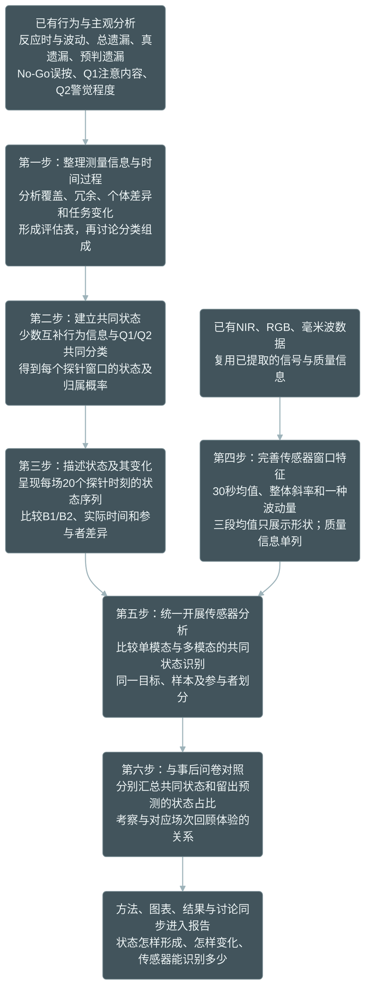

# 持续注意共同状态分析思路

研究目标：用任务行为与主观报告共同描述持续注意状态，观察状态随任务的变化，再检验传感器能否识别这些状态。



| 步骤 | 做什么 | 得到什么 |
|---|---|---|
| 1. 理解测量信息 | 分析反应稳定性、总遗漏、真遗漏、预判遗漏、误按和Q1/Q2；查看个体差异、任务时间变化和指标重复情况 | 指标评估表，随后确定分类组成 |
| 2. 建立共同状态 | 根据少数行为信息与Q1/Q2的组合分类；所有参与者使用共同定义 | 几种状态及每个窗口的归属概率 |
| 3. 描述状态变化 | 查看每场20个探针时刻、B1/B2和不同参与者的状态分布 | 状态特点与时间变化图 |
| 4. 完善传感器特征 | 复用序列计算均值、趋势和波动；三段均值用于展示，质量信息单列 | 主特征表与时间过程展示表 |
| 5. 识别状态 | 用NIR、RGB、毫米波分别预测，再比较组合模型；同一人不同时进入训练和测试 | 单模态和多模态识别结果 |
| 6. 问卷对照 | 分别汇总实际分类与留出预测的状态占比，对照相应场次问卷 | 状态及传感器结果与回顾体验的关系 |

分类指标在评估结果形成后确定，不以与Q1/Q2显著相关为硬条件。类别数和名称根据结果确定，不预设高、中、低专注。20个探针前30秒窗口是局部观察，不是连续覆盖整个实验。

传感器主特征保持简洁：连续信号使用均值、整体斜率和一种波动量，眨眼候选使用事件率。另用前、中、后三段均值展示粗略变化形状，首版不加入预测。质量信息单列，比较加入前后的结果。

## 模型比较的含义

```text
已有分析：行为及传感器 → Q1/Q2
          旧M0–M7在同一目标下比较

新增分析：行为＋Q1/Q2 → 共同状态 ← 传感器
          新版单模态及组合在同一状态目标下比较
```

两套分析内部都比较。新旧预测目标不同，不直接用准确率高低判断哪套更好；若比较旧汇总与新动态特征，则固定目标、样本和验证划分。

报告主线：**状态怎样形成 → 状态怎样变化 → 传感器能识别多少 → 是否与回顾体验对应。**

详细任务见[配套实施计划](1.14-行为与探针共同状态及传感器分析配套实施计划_20260909.md)，时间安排见[1.13总计划](1.13-未来四天分析与报告完善计划_20260909.md)。
