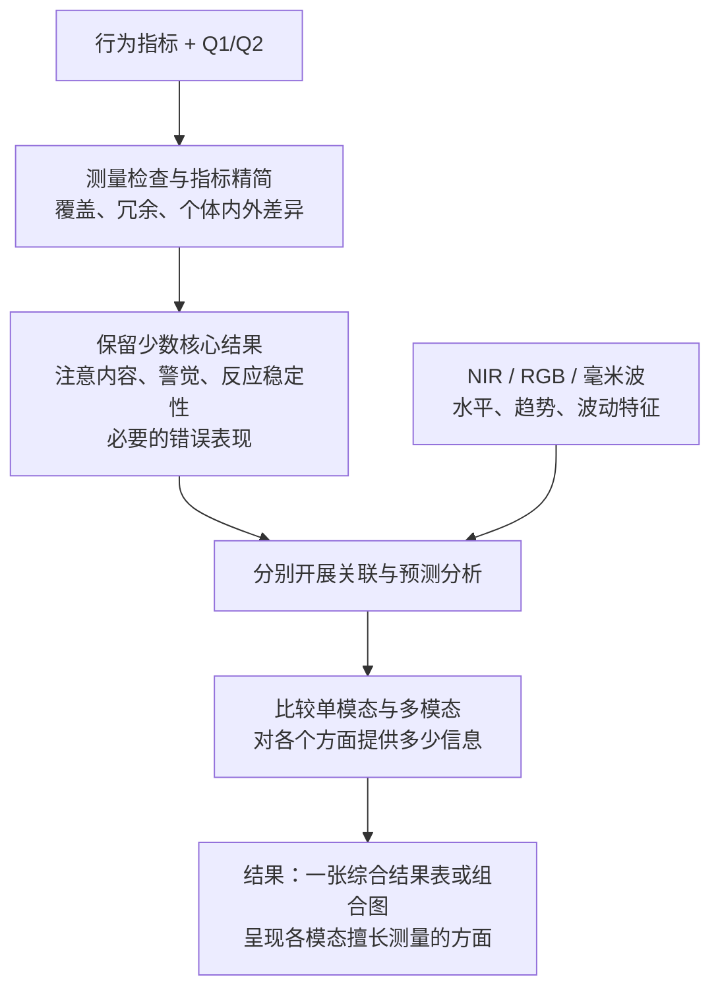
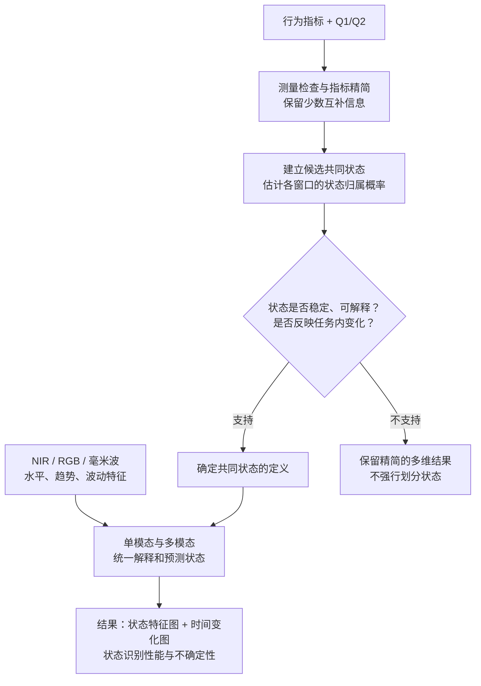
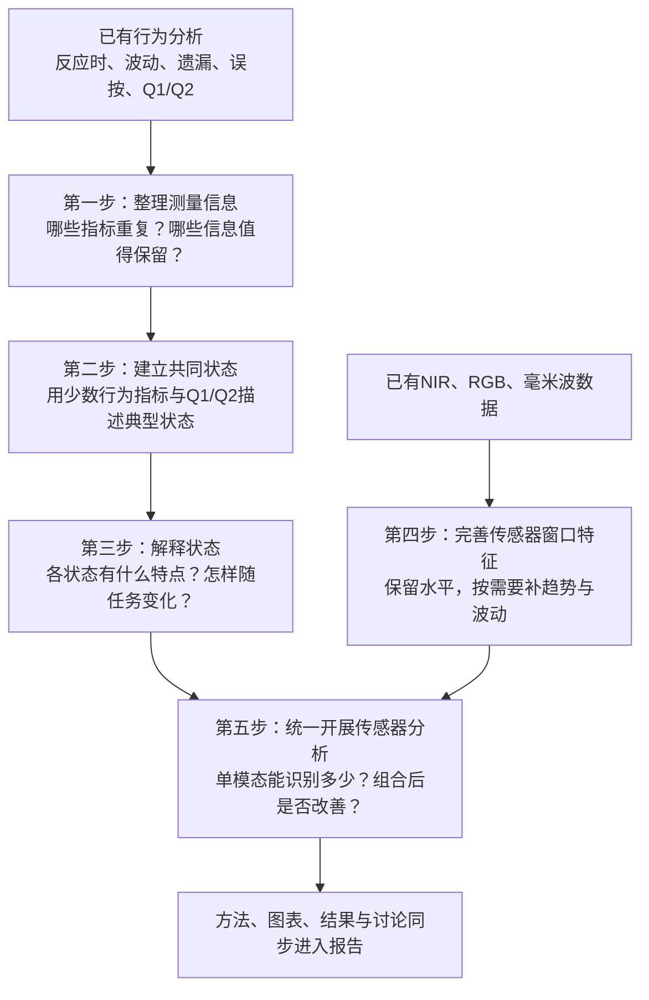
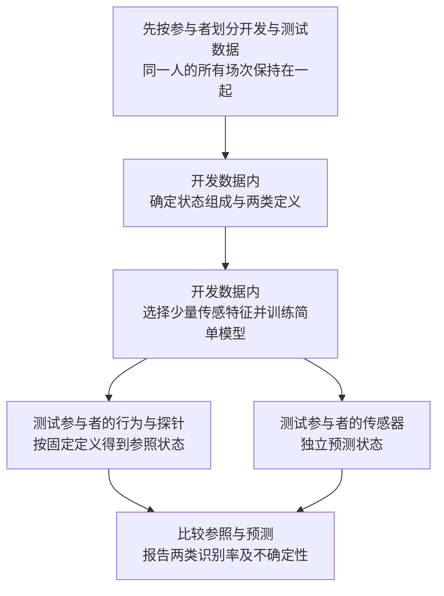
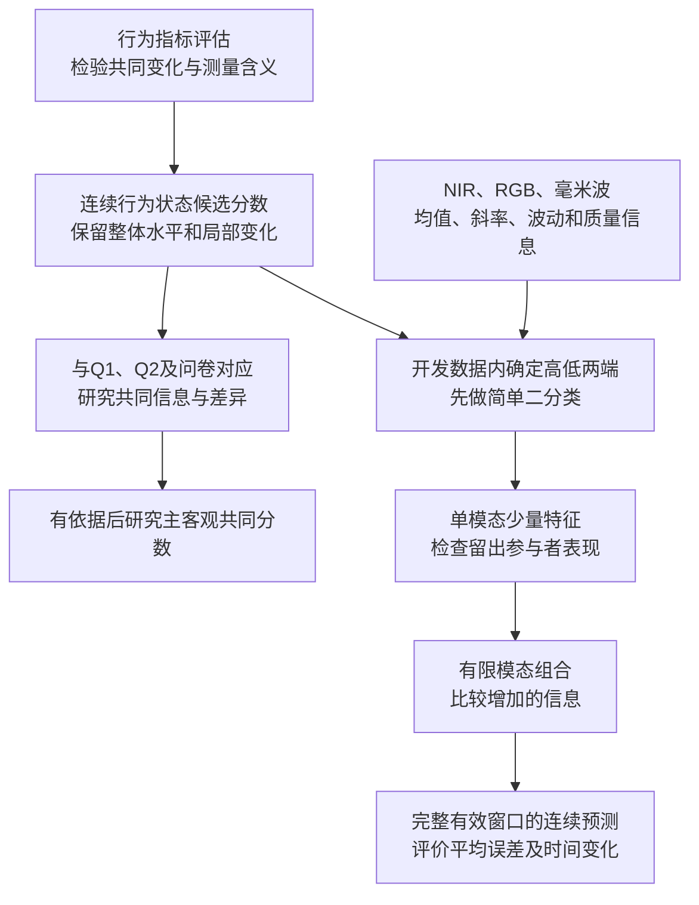
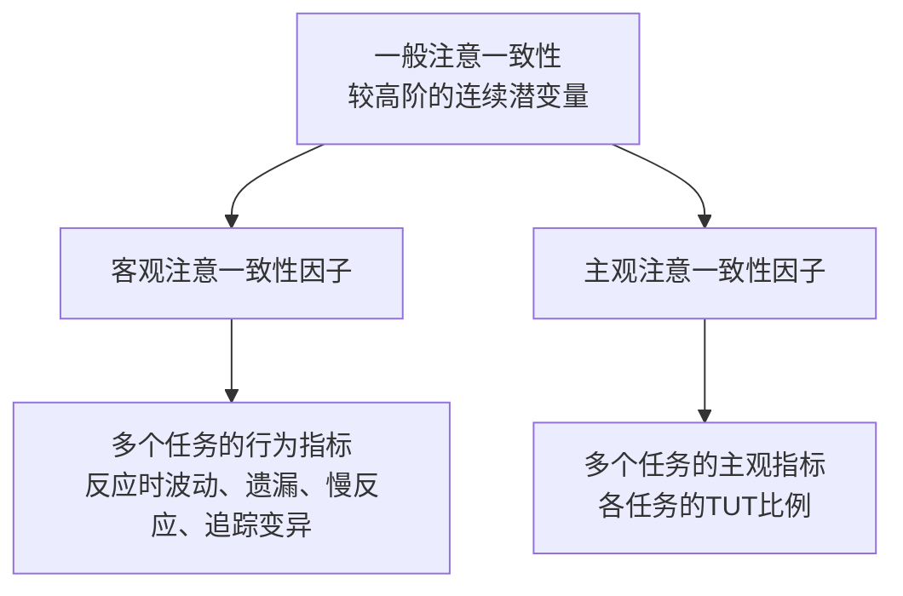
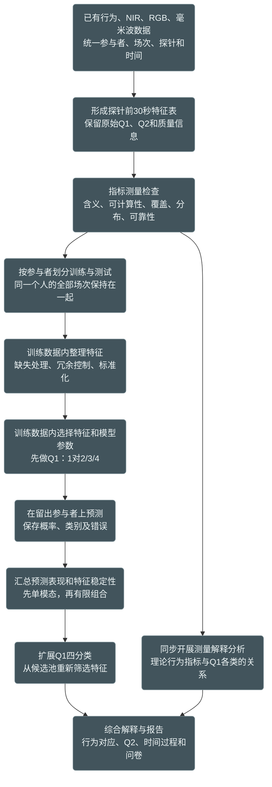

# 注意力文献阅读

> 结合数据、报告内容和分析思路，我们当前的计划合理吗？具体应该怎么实现？给出具体的实现方案设计（库里面改什么，会生成什么）
> [瞳孔图生成与结论](chatgpt-conversation://6a9fffac-aac8-83ee-9294-da5e6267e264)&#x20;
> [@GitHub](plugin://github@openai-curated-remote)&#x20;
> [分析逻辑讲解 योजना](chatgpt-conversation://6a9f8214-2850-83e8-875d-5068e631189e)

<details><summary>9 previous messages</summary>

> 我会先核对两段讨论、当前报告和数据产物，再确认各仓库的职责与现有实现。我会使用 focuswave-handoff 技能梳理证据边界，最后给出“计划是否合理、各库具体改什么、会生成什么、怎样验收”的实现方案。
>
> <details><summary>Ran 3 commands, called a tool</summary>
>
> - Ran `Get-Content -LiteralPath 'C:\Users\goven\.ai\paths.local.yaml'; Get-Content -LiteralPath 'C:\Users\goven\.agents\skills\focuswave-handoff\SKILL.md'; rg -n 'Formal-Analysis|正式分析|瞳孔|report|协作' 'C:\Users\goven\.codex\memories\MEMORY.md'`
>
> Tool call
>
> Tool: read_thread
> Status: completed
>
> Tool call
>
> Tool: read_thread
> Status: completed
>
> - Ran `Get-Content -LiteralPath 'D:\AAAWORK\_AI-Workspace\rules\global-core.md'; Get-Content -LiteralPath 'D:\AAAWORK\_AI-Workspace\rules\codex-addon.md'; Get-Content README.md; Get-Content AGENTS.md`
>
> Tool call
>
> Tool: read_thread
> Status: completed
>
> - Ran `Get-Content '运行记录与证据/1.2-协作角色、任务分工与Git治理.md'; Get-Content 'D:\AAAWORK\_AI-Workspace\projects\focuswave\PROJECT_CONTEXT.md'; Get-Content 'D:\AAAWORK\_AI-Workspace\projects\focuswave\REPOSITORIES.yaml'; git status --short --branch; git log -1 --format='%H %s'; git remote -v; git worktree list`
>
> Tool call
>
> Tool: read_thread
> Status: completed
>
> Tool call
>
> Tool: read_thread
> Status: completed
>
> MCP tool call
>
> codex_apps.github.get_repo
>
> ```json
> {
>   "repo_full_name": "kyandi233-dev/Attention-Analysis"
> }
> ```
>
> Error: InvalidActionArgumentsError: Invalid action arguments
>
> </details>
>
> 两段讨论中，研究目标已经发生了明确调整：行为与探针共同提供需要解释的状态信息，传感器用于解释或预测这些信息。现有“行为基线预测 Q1/Q2”的程序因此需要另建新版分析入口，不能只增加几列特征。
>
> 另外，本地报告库入口仍停留在较早阶段，且有不少未提交内容。我正在核对 GitHub 上的最新计划和实际数据产物，避免把旧入口中的进度当作当前状态。
>
> <details><summary>Ran 3 commands, called a tool</summary>
>
> MCP tool call
>
> codex_apps.github.fetch
>
> ```json
> {
>   "url": "https://github.com/kyandi233-dev/FocusWave-Formal-Analysis/blob/codex/code-fix-ledger/分析设计/1.13-未来四天分析与报告完善计划_20260909.md"
> }
> ```
>
> ```text
> Action completed.
> ```
>
> ```json
> {
>   "content": "# 未来四天分析与报告完善计划（2026-09-09）\n\n> 状态：工作计划。\n>\n> 本计划整合 `1.11-报告改进与测量效度补强决策记录_20260908.md`、`1.12-本次对话补充决策与风险归档_20260908.md` 及后续讨论，用于安排未来四天的分析与报告完善工作。分析、结果整理与正式报告同步推进；任何新增统计结果在进入正式报告前，均需核对当前正式代码、配置、实际输出和样本口径。\n\n## 一、完善工作的总体目标\n\n### 1.1 当前研究希望建立的测量关系\n\nFocusWave 的总体目标是建立一套能够描述持续注意状态及其时间变化，并检验连续传感信息测量价值的分析体系。现有研究已经包含 SART 行为、任务内 Q1 注意内容、Q2 警觉程度、事后问卷，以及 NIR（近红外）、RGB（可见光）和毫米波连续测量。后续完善工作的重点，是使这些信息在同一测量逻辑下形成可解释、可验证并能够推广到新参与者的证据链。\n\n行为与思维探针承担持续注意状态表征的核心任务。行为反映任务中的客观表现，Q1 和 Q2 分别提供注意内容和警觉程度的主观信息，两类信息不要求完全一致，也不以彼此高度相关作为使用前提。后续需要根据行为指标的测量属性、Q1/Q2 的信息结构以及二者之间的关系，确定适合本项目的持续注意状态表示方式。\n\nNIR、RGB 和毫米波的作用则是提供连续、非主观的过程信息。单模态分析用于评估各传感模态自身能够提供多少与持续注意状态相关的信息，多模态分析用于检验不同传感器组合是否能够提供更完整或更稳定的测量，并继续采用参与者独立的验证方式评价对新参与者的泛化能力。\n\n### 1.2 当前分析中需要重点完善的问题\n\n当前分析中有五类问题需要在本轮工作中优先解决。\n\n第一，现有大量分析仍以 Q1/Q2 作为主要状态参照，行为信息尚未与探针信息共同形成更完整的持续注意状态表征。后续需要系统评估行为指标的分布、重复测量特性、时间变化和相互关系，并据此确定行为与 Q1/Q2 在后续状态定义中的角色。\n\n第二，NIR、RGB 和毫米波的探针前窗口特征较多依赖中位数、比例或单一水平汇总，能够描述窗口总体水平，但对窗口内部的趋势和波动利用不足。后续需要以简洁、经典、可解释的方式补充时间动态信息。\n\n第三，各传感模态目前都包含一定的数据质量信息，但不同模态中质量指标的数量、含义和进入分析的方式并不完全一致。需要统一判断哪些质量指标只用于排除明显无效数据，哪些用于报告测量可信程度，哪些有必要作为模型中的辅助信息。\n\n第四，当前多模态 M0–M7 以行为作为预测基线，适合回答“传感器是否提供行为之外的增量信息”。若后续采用“行为 + 探针共同形成持续注意状态”的方案，新的单模态和多模态结构需要相应调整，同时保留原有 M0–M7 作为已有结果进行对照。\n\n第五，问卷、重复测量、时间过程、固定刺激序列等补充证据尚未充分整合进当前测量框架。上述内容不应脱离核心研究问题单独扩展，而应在前两天形成主要分析框架后，作为效度和稳健性证据补充。\n\n## 二、第一阶段：完善持续注意的测量框架与分析设计\n\n这一阶段主要在第一天完成。重点是明确后续分析所使用的变量、时间尺度及其测量角色，并同步完成直接影响分析设计的基础统计。第一天形成的方法定义同步更新至分析设计和正式报告方法部分。\n\n### 2.1 行为与思维探针的持续注意状态表征\n\n#### 2.1.1 行为指标的测量属性\n\n正式行为指标需要系统评估其分布和有效覆盖、参与者内与参与者间变异、ICC（intraclass correlation coefficient，组内相关系数）或相应重复测量稳定性、指标间相关与信息冗余，以及随任务时间的变化。\n\n优先关注 RT-CV（反应时变异系数）、RT-SD（反应时标准差）、Go omission（Go 遗漏）、No-Go commission（No-Go 误按）、d′ 及必要的反应时水平和趋势指标。错误率和信号检测论指标还需同时检查机会数不足、地板效应和天花板效应。\n\n这些分析用于描述各行为指标更偏稳定个体差异、短时状态变化，还是二者兼有，并帮助判断指标之间是否提供重复或互补信息。行为指标与 Q1/Q2 的一致程度只作为构念关系证据，不作为保留指标的硬性条件。\n\n#### 2.1.2 Q1、Q2 与行为信息的关系\n\nQ1 注意内容、Q2 警觉程度和行为表现分别保留其原有测量含义。后续分析需要整理三类信息之间的一致、互补和分离模式，重点判断它们是否反映持续注意的不同方面，以及哪些关系具有稳定、可解释的方向。\n\n这一部分需要同时报告主要关联及关键的不一致结果，避免只依据显著性筛选关系。Q1 和 Q2 原则上不直接合并为单一变量，而是先保留注意内容和警觉两个维度，再根据行为信息结构讨论后续状态表示方式。\n\n#### 2.1.3 后续状态变量的构建方案\n\n在行为测量属性和 Q1/Q2 关系明确后，比较适合当前研究的状态表示方式，包括联合状态、多个状态维度或概率式状态表征。方案选择需说明所使用的信息来源、变量尺度、重复测量处理方式，以及后续单模态和多模态分析实际需要解释或预测的对象。\n\n最终方案不以简单加权形成“专注总分”为默认做法，也不以主观和客观指标必须高度一致为前提。\n\n### 2.2 连续传感模态的时间窗口特征完善\n\n#### 2.2.1 特征设计原则\n\nNIR、RGB 和毫米波的窗口特征统一从三个方面描述核心连续信号：整体水平、时间趋势和一项经典波动指标。波动优先在 SD（standard deviation，标准差）和 CV（coefficient of variation，变异系数）中选择适合该信号尺度的一项，不同时堆叠多种高度近似的离散程度指标。\n\n必要时可增加临近探针的变化量，但只在其具有明确时间意义、且不与趋势指标高度重复时使用。所有新增特征需检查覆盖率、缺失、分布、异常值和指标间相关，避免仅因技术上可计算就全部进入模型。\n\n#### 2.2.2 NIR\n\n重新评估瞳孔指标在探针前窗口中的水平、变化趋势和波动信息，重点检查当前以窗口中位数为主的汇总是否遗漏与短时状态相关的动态变化。新增动态指标需要继续遵守现有瞳孔质量控制和左右眼处理规则。\n\n#### 2.2.3 RGB\n\n重新评估 blink candidate（眨眼候选）、body motion（身体运动）、pose（姿态）等连续信息的时间特征。不同变量的动态表达应与其实际信号性质匹配，不要求所有 RGB 指标机械使用完全相同的统计量。\n\n#### 2.2.4 毫米波\n\n重新评估 respiration（呼吸）、HR（heart rate，心率）、motion（运动）等信号的窗口水平和动态信息。由于不同毫米波指标的测量成熟度不同，新增动态特征应继续结合当前质量与生理效度等级解释。\n\n#### 2.2.5 时间窗口\n\n继续以当前 30 秒主窗口为主要参照，并在需要时比较 10 秒、20 秒和 30 秒等合理窗口。窗口比较用于检验结果是否依赖特定时间尺度，不依据单次显著性选择最有利窗口。\n\n### 2.3 传感器质量信息的统一处理\n\n#### 2.3.1 各模态现有质量指标整理\n\n分别整理 NIR、RGB 和毫米波当前已有的数据质量、有效覆盖、时间连续性、可信度和算法稳定性指标，确认每个指标对应的技术含义、计算层级和当前使用方式。\n\n#### 2.3.2 质量指标的统计角色\n\n质量指标分为三类处理：一类用于排除明显无效测量；一类用于描述该段信号的可信程度并进入质量报告；一类在具有明确科学理由时可作为模型辅助信息，用于帮助模型识别输入质量或技术混杂。\n\n进入模型的质量变量不能解释为持续注意特征，其作用需与核心状态候选变量分开报告。是否进入模型还需结合覆盖率、冗余、潜在泄漏和跨参与者泛化表现判断。\n\n#### 2.3.3 模态间一致原则\n\n若质量信息进入预测模型，应对 NIR、RGB 和毫米波采用一致的判断原则。不同模态不要求拥有完全相同数量的质量指标，但需要保证每个质量变量都有明确技术意义，且不会因某一模态记录了更多质量字段而人为获得更多模型信息。\n\n### 2.4 新的单模态与多模态分析结构\n\n在前述状态定义、动态特征和质量指标处理方式确定后，明确新的单模态和多模态分析结构。\n\n单模态分析主要评价各传感模态与持续注意状态不同维度之间的统计关系和参与者独立预测能力。多模态分析在相同状态定义、相同样本和相同参与者划分条件下比较不同传感器组合，评价不同模态之间是否存在稳定的信息互补。\n\n原有 M0–M7 继续作为既有分析结果保留，用于回答行为基线上的传感器增量问题；新的分析结构则对应“行为 + 探针形成需要解释的状态，传感器用于测量和预测该状态”的研究问题。两类分析的研究问题和变量角色需要在报告中明确区分。\n\n## 三、第二阶段：核心分析实现、运行与结果同步形成\n\n这一阶段主要在第二天完成。所有实现均依据第一阶段确定的方法进行，并在运行过程中同步更新报告，而不是等待全部结果完成后再集中整理。\n\n### 3.1 行为与探针分析实现\n\n按照第一阶段确定的方案生成后续使用的状态变量或状态维度，并保留能够追溯到原始 Q1、Q2 和行为指标的中间结果。同步完成样本量、缺失、重复参与者和状态分布检查。\n\n### 3.2 NIR、RGB、毫米波动态窗口特征实现\n\n分别生成新的窗口级水平、趋势、波动及必要质量信息，完成覆盖率、缺失、异常值、数值分布和指标冗余检查。新增特征应保留明确的计算定义和输出字段说明。\n\n### 3.3 单模态分析\n\n分别评价 NIR、RGB 和毫米波与持续注意状态各维度之间的关系。统计关联分析继续正确处理参与者内重复观测；预测分析继续采用参与者独立的数据划分，避免同一参与者同时进入训练和测试。\n\n需要报告的主要内容包括实际观察单位和样本量、核心效应估计或模型性能、95% CI（confidence interval，置信区间）、关键非显著结果，以及必要的参与者内和参与者间解释。\n\n### 3.4 多模态分析\n\n在相同样本、相同状态定义和相同参与者划分条件下比较不同传感器组合。主要评价单模态表现、多模态互补、参与者独立泛化，以及结果对质量变量是否进入模型的敏感性。\n\n### 3.5 新旧分析结果比较\n\n系统比较原有窗口汇总与新增动态特征、原有 M0–M7 与新状态分析结构之间的结果差异。重点判断改进是否来自更合理的状态定义、时间动态信息、质量处理，还是仅来源于特征数量增加。\n\n结果比较用于理解分析完善带来的实际影响，不按结果最好看的一套方法替换其他合理方案。\n\n### 3.6 报告同步更新\n\n每完成一项正式分析，同步更新对应的方法、结果表、图、正文结果描述和附录。结果段落按照“分析问题—统计方法—观察单位和样本量—统计结果—直接结果概括”的结构书写。\n\n涉及时间变化时，应保留相应时间过程；涉及多模态预测时，应同时报告主要性能指标及其不确定性；涉及关键阴性结果时，应按照预先定义的研究问题完整呈现。\n\n## 四、第三阶段：补充效度、稳健性分析与最终完善\n\n这一阶段主要安排在第三、四天。前两天完成核心测量和主要模型后，再补充能够提高测量解释可信度的效度和稳健性证据。第三、四天不以继续扩大指标或模型数量为主要目标。\n\n### 4.1 补充心理测量证据\n\n优先恢复并核验既有 `questionnaire_analysis_v1`，完成 participant/session 身份对应后，再开展问卷与行为、Q1/Q2 的正式桥接。\n\n重点利用走神、自评专注、疲劳、困倦、可持续专注时长等条目形成外部主观效标、收敛效度和区分效度证据。问卷不作为新的注意真值，也不替代 Q1/Q2。必要时再补充问卷与 NIR、RGB、毫米波的支持性关联。\n\n同时将行为、探针、问卷和传感器之间已获得的主要证据整理为构念效度证据矩阵，区分哪些关系支持相近构念、哪些关系体现注意内容与警觉的差异、哪些结果仍属于探索性证据。\n\n### 4.2 时间过程与实验设计稳健性\n\n根据前两天的结果和实际时间安排，选择性完成以下分析：不同 cycle 划分的敏感性、不同窗口长度的敏感性、质量阈值敏感性、probe reactivity（探针反应性）以及固定刺激序列和位置效应核验。\n\n6 cycle 继续作为已有主分析，4/8 cycle 仅用于检验主要 time-on-task（任务持续时间）结论是否依赖具体切分方式。探针反应性若执行，应优先以 task resume（任务恢复）后的行为或传感变化作为后窗口，避免将探针阅读和作答过程混入正常任务状态。\n\n固定序列核验需要在正式 trial 数据可用时比较不同 session 的实际刺激顺序、No-Go 位置和刺激大小，判断程序层面的固定序列是否也是实际采集事实，并据此评估 time-on-task 与 sequence-position（序列位置）效应的潜在混杂。\n\n### 4.3 正式报告持续完善\n\n第三天继续根据已经完成的分析同步补充方法、结果和讨论。能够直接回答核心研究问题的结果进入正文，稳健性和技术性检查优先进入附录，探索性结果按照其证据强度进行表述。\n\n报告叙事继续围绕持续注意测量证据链组织，不要求 NIR、RGB 和毫米波表现出相同的结果模式，也不将质量指标、外显运动或技术混杂变量与核心心理候选指标并列解释。\n\n### 4.4 第四天系统检查\n\n第四天主要完成分析与正式报告的一致性核验，不主动增加缺乏明确研究问题的新分析。\n\n系统检查包括：研究问题、方法和结果是否一一对应；参与者数、场次数、探针数及各模态有效样本是否一致；变量定义、单位、窗口和方向是否一致；行为、Q1/Q2、问卷、传感器状态特征和质量变量的角色是否清楚；图表、正文和结果表数值是否一致；统计方法是否与当前代码、配置和实际输出一致；主结果、补充结果和探索性结果是否按照证据强度表述；图题、表注、统计符号和整体格式是否符合正式报告规范。\n\n第四天同时形成最终结果索引和运行证据记录，使正式报告中的主要数字能够追溯到对应的当前输出。\n\n---\n\n本轮四天工作的总体顺序为：\n\n**研究目的与测量关系 → 行为与探针的状态表征 → 连续传感器动态特征与质量信息 → 单模态和多模态重新分析 → 心理测量与稳健性补充 → 报告同步完善与最终系统检查。**\n",
>   "title": "1.13-未来四天分析与报告完善计划_20260909.md",
>   "modified_date": "2026-09-08T22:21:08Z",
>   "url": "https://github.com/kyandi233-dev/FocusWave-Formal-Analysis/blob/codex/code-fix-ledger/%E5%88%86%E6%9E%90%E8%AE%BE%E8%AE%A1/1.13-%E6%9C%AA%E6%9D%A5%E5%9B%9B%E5%A4%A9%E5%88%86%E6%9E%90%E4%B8%8E%E6%8A%A5%E5%91%8A%E5%AE%8C%E5%96%84%E8%AE%A1%E5%88%92_20260909.md",
>   "display_url": "https://github.com/kyandi233-dev/FocusWave-Formal-Analysis/blob/codex/code-fix-ledger/%E5%88%86%E6%9E%90%E8%AE%BE%E8%AE%A1/1.13-%E6%9C%AA%E6%9D%A5%E5%9B%9B%E5%A4%A9%E5%88%86%E6%9E%90%E4%B8%8E%E6%8A%A5%E5%91%8A%E5%AE%8C%E5%96%84%E8%AE%A1%E5%88%92_20260909.md",
>   "display_title": "1.13-未来四天分析与报告完善计划_20260909.md",
>   "structuredContent": {
>     "title": "1.13-未来四天分析与报告完善计划_20260909.md",
>     "content": "# 未来四天分析与报告完善计划（2026-09-09）\n\n> 状态：工作计划。\n>\n> 本计划整合 `1.11-报告改进与测量效度补强决策记录_20260908.md`、`1.12-本次对话补充决策与风险归档_20260908.md` 及后续讨论，用于安排未来四天的分析与报告完善工作。分析、结果整理与正式报告同步推进；任何新增统计结果在进入正式报告前，均需核对当前正式代码、配置、实际输出和样本口径。\n\n## 一、完善工作的总体目标\n\n### 1.1 当前研究希望建立的测量关系\n\nFocusWave 的总体目标是建立一套能够描述持续注意状态及其时间变化，并检验连续传感信息测量价值的分析体系。现有研究已经包含 SART 行为、任务内 Q1 注意内容、Q2 警觉程度、事后问卷，以及 NIR（近红外）、RGB（可见光）和毫米波连续测量。后续完善工作的重点，是使这些信息在同一测量逻辑下形成可解释、可验证并能够推广到新参与者的证据链。\n\n行为与思维探针承担持续注意状态表征的核心任务。行为反映任务中的客观表现，Q1 和 Q2 分别提供注意内容和警觉程度的主观信息，两类信息不要求完全一致，也不以彼此高度相关作为使用前提。后续需要根据行为指标的测量属性、Q1/Q2 的信息结构以及二者之间的关系，确定适合本项目的持续注意状态表示方式。\n\nNIR、RGB 和毫米波的作用则是提供连续、非主观的过程信息。单模态分析用于评估各传感模态自身能够提供多少与持续注意状态相关的信息，多模态分析用于检验不同传感器组合是否能够提供更完整或更稳定的测量，并继续采用参与者独立的验证方式评价对新参与者的泛化能力。\n\n### 1.2 当前分析中需要重点完善的问题\n\n当前分析中有五类问题需要在本轮工作中优先解决。\n\n第一，现有大量分析仍以 Q1/Q2 作为主要状态参照，行为信息尚未与探针信息共同形成更完整的持续注意状态表征。后续需要系统评估行为指标的分布、重复测量特性、时间变化和相互关系，并据此确定行为与 Q1/Q2 在后续状态定义中的角色。\n\n第二，NIR、RGB 和毫米波的探针前窗口特征较多依赖中位数、比例或单一水平汇总，能够描述窗口总体水平，但对窗口内部的趋势和波动利用不足。后续需要以简洁、经典、可解释的方式补充时间动态信息。\n\n第三，各传感模态目前都包含一定的数据质量信息，但不同模态中质量指标的数量、含义和进入分析的方式并不完全一致。需要统一判断哪些质量指标只用于排除明显无效数据，哪些用于报告测量可信程度，哪些有必要作为模型中的辅助信息。\n\n第四，当前多模态 M0–M7 以行为作为预测基线，适合回答“传感器是否提供行为之外的增量信息”。若后续采用“行为 + 探针共同形成持续注意状态”的方案，新的单模态和多模态结构需要相应调整，同时保留原有 M0–M7 作为已有结果进行对照。\n\n第五，问卷、重复测量、时间过程、固定刺激序列等补充证据尚未充分整合进当前测量框架。上述内容不应脱离核心研究问题单独扩展，而应在前两天形成主要分析框架后，作为效度和稳健性证据补充。\n\n## 二、第一阶段：完善持续注意的测量框架与分析设计\n\n这一阶段主要在第一天完成。重点是明确后续分析所使用的变量、时间尺度及其测量角色，并同步完成直接影响分析设计的基础统计。第一天形成的方法定义同步更新至分析设计和正式报告方法部分。\n\n### 2.1 行为与思维探针的持续注意状态表征\n\n#### 2.1.1 行为指标的测量属性\n\n正式行为指标需要系统评估其分布和有效覆盖、参与者内与参与者间变异、ICC（intraclass correlation coefficient，组内相关系数）或相应重复测量稳定性、指标间相关与信息冗余，以及随任务时间的变化。\n\n优先关注 RT-CV（反应时变异系数）、RT-SD（反应时标准差）、Go omission（Go 遗漏）、No-Go commission（No-Go 误按）、d′ 及必要的反应时水平和趋势指标。错误率和信号检测论指标还需同时检查机会数不足、地板效应和天花板效应。\n\n这些分析用于描述各行为指标更偏稳定个体差异、短时状态变化，还是二者兼有，并帮助判断指标之间是否提供重复或互补信息。行为指标与 Q1/Q2 的一致程度只作为构念关系证据，不作为保留指标的硬性条件。\n\n#### 2.1.2 Q1、Q2 与行为信息的关系\n\nQ1 注意内容、Q2 警觉程度和行为表现分别保留其原有测量含义。后续分析需要整理三类信息之间的一致、互补和分离模式，重点判断它们是否反映持续注意的不同方面，以及哪些关系具有稳定、可解释的方向。\n\n这一部分需要同时报告主要关联及关键的不一致结果，避免只依据显著性筛选关系。Q1 和 Q2 原则上不直接合并为单一变量，而是先保留注意内容和警觉两个维度，再根据行为信息结构讨论后续状态表示方式。\n\n#### 2.1.3 后续状态变量的构建方案\n\n在行为测量属性和 Q1/Q2 关系明确后，比较适合当前研究的状态表示方式，包括联合状态、多个状态维度或概率式状态表征。方案选择需说明所使用的信息来源、变量尺度、重复测量处理方式，以及后续单模态和多模态分析实际需要解释或预测的对象。\n\n最终方案不以简单加权形成“专注总分”为默认做法，也不以主观和客观指标必须高度一致为前提。\n\n### 2.2 连续传感模态的时间窗口特征完善\n\n#### 2.2.1 特征设计原则\n\nNIR、RGB 和毫米波的窗口特征统一从三个方面描述核心连续信号：整体水平、时间趋势和一项经典波动指标。波动优先在 SD（standard deviation，标准差）和 CV（coefficient of variation，变异系数）中选择适合该信号尺度的一项，不同时堆叠多种高度近似的离散程度指标。\n\n必要时可增加临近探针的变化量，但只在其具有明确时间意义、且不与趋势指标高度重复时使用。所有新增特征需检查覆盖率、缺失、分布、异常值和指标间相关，避免仅因技术上可计算就全部进入模型。\n\n#### 2.2.2 NIR\n\n重新评估瞳孔指标在探针前窗口中的水平、变化趋势和波动信息，重点检查当前以窗口中位数为主的汇总是否遗漏与短时状态相关的动态变化。新增动态指标需要继续遵守现有瞳孔质量控制和左右眼处理规则。\n\n#### 2.2.3 RGB\n\n重新评估 blink candidate（眨眼候选）、body motion（身体运动）、pose（姿态）等连续信息的时间特征。不同变量的动态表达应与其实际信号性质匹配，不要求所有 RGB 指标机械使用完全相同的统计量。\n\n#### 2.2.4 毫米波\n\n重新评估 respiration（呼吸）、HR（heart rate，心率）、motion（运动）等信号的窗口水平和动态信息。由于不同毫米波指标的测量成熟度不同，新增动态特征应继续结合当前质量与生理效度等级解释。\n\n#### 2.2.5 时间窗口\n\n继续以当前 30 秒主窗口为主要参照，并在需要时比较 10 秒、20 秒和 30 秒等合理窗口。窗口比较用于检验结果是否依赖特定时间尺度，不依据单次显著性选择最有利窗口。\n\n### 2.3 传感器质量信息的统一处理\n\n#### 2.3.1 各模态现有质量指标整理\n\n分别整理 NIR、RGB 和毫米波当前已有的数据质量、有效覆盖、时间连续性、可信度和算法稳定性指标，确认每个指标对应的技术含义、计算层级和当前使用方式。\n\n#### 2.3.2 质量指标的统计角色\n\n质量指标分为三类处理：一类用于排除明显无效测量；一类用于描述该段信号的可信程度并进入质量报告；一类在具有明确科学理由时可作为模型辅助信息，用于帮助模型识别输入质量或技术混杂。\n\n进入模型的质量变量不能解释为持续注意特征，其作用需与核心状态候选变量分开报告。是否进入模型还需结合覆盖率、冗余、潜在泄漏和跨参与者泛化表现判断。\n\n#### 2.3.3 模态间一致原则\n\n若质量信息进入预测模型，应对 NIR、RGB 和毫米波采用一致的判断原则。不同模态不要求拥有完全相同数量的质量指标，但需要保证每个质量变量都有明确技术意义，且不会因某一模态记录了更多质量字段而人为获得更多模型信息。\n\n### 2.4 新的单模态与多模态分析结构\n\n在前述状态定义、动态特征和质量指标处理方式确定后，明确新的单模态和多模态分析结构。\n\n单模态分析主要评价各传感模态与持续注意状态不同维度之间的统计关系和参与者独立预测能力。多模态分析在相同状态定义、相同样本和相同参与者划分条件下比较不同传感器组合，评价不同模态之间是否存在稳定的信息互补。\n\n原有 M0–M7 继续作为既有分析结果保留，用于回答行为基线上的传感器增量问题；新的分析结构则对应“行为 + 探针形成需要解释的状态，传感器用于测量和预测该状态”的研究问题。两类分析的研究问题和变量角色需要在报告中明确区分。\n\n## 三、第二阶段：核心分析实现、运行与结果同步形成\n\n这一阶段主要在第二天完成。所有实现均依据第一阶段确定的方法进行，并在运行过程中同步更新报告，而不是等待全部结果完成后再集中整理。\n\n### 3.1 行为与探针分析实现\n\n按照第一阶段确定的方案生成后续使用的状态变量或状态维度，并保留能够追溯到原始 Q1、Q2 和行为指标的中间结果。同步完成样本量、缺失、重复参与者和状态分布检查。\n\n### 3.2 NIR、RGB、毫米波动态窗口特征实现\n\n分别生成新的窗口级水平、趋势、波动及必要质量信息，完成覆盖率、缺失、异常值、数值分布和指标冗余检查。新增特征应保留明确的计算定义和输出字段说明。\n\n### 3.3 单模态分析\n\n分别评价 NIR、RGB 和毫米波与持续注意状态各维度之间的关系。统计关联分析继续正确处理参与者内重复观测；预测分析继续采用参与者独立的数据划分，避免同一参与者同时进入训练和测试。\n\n需要报告的主要内容包括实际观察单位和样本量、核心效应估计或模型性能、95% CI（confidence interval，置信区间）、关键非显著结果，以及必要的参与者内和参与者间解释。\n\n### 3.4 多模态分析\n\n在相同样本、相同状态定义和相同参与者划分条件下比较不同传感器组合。主要评价单模态表现、多模态互补、参与者独立泛化，以及结果对质量变量是否进入模型的敏感性。\n\n### 3.5 新旧分析结果比较\n\n系统比较原有窗口汇总与新增动态特征、原有 M0–M7 与新状态分析结构之间的结果差异。重点判断改进是否来自更合理的状态定义、时间动态信息、质量处理，还是仅来源于特征数量增加。\n\n结果比较用于理解分析完善带来的实际影响，不按结果最好看的一套方法替换其他合理方案。\n\n### 3.6 报告同步更新\n\n每完成一项正式分析，同步更新对应的方法、结果表、图、正文结果描述和附录。结果段落按照“分析问题—统计方法—观察单位和样本量—统计结果—直接结果概括”的结构书写。\n\n涉及时间变化时，应保留相应时间过程；涉及多模态预测时，应同时报告主要性能指标及其不确定性；涉及关键阴性结果时，应按照预先定义的研究问题完整呈现。\n\n## 四、第三阶段：补充效度、稳健性分析与最终完善\n\n这一阶段主要安排在第三、四天。前两天完成核心测量和主要模型后，再补充能够提高测量解释可信度的效度和稳健性证据。第三、四天不以继续扩大指标或模型数量为主要目标。\n\n### 4.1 补充心理测量证据\n\n优先恢复并核验既有 `questionnaire_analysis_v1`，完成 participant/session 身份对应后，再开展问卷与行为、Q1/Q2 的正式桥接。\n\n重点利用走神、自评专注、疲劳、困倦、可持续专注时长等条目形成外部主观效标、收敛效度和区分效度证据。问卷不作为新的注意真值，也不替代 Q1/Q2。必要时再补充问卷与 NIR、RGB、毫米波的支持性关联。\n\n同时将行为、探针、问卷和传感器之间已获得的主要证据整理为构念效度证据矩阵，区分哪些关系支持相近构念、哪些关系体现注意内容与警觉的差异、哪些结果仍属于探索性证据。\n\n### 4.2 时间过程与实验设计稳健性\n\n根据前两天的结果和实际时间安排，选择性完成以下分析：不同 cycle 划分的敏感性、不同窗口长度的敏感性、质量阈值敏感性、probe reactivity（探针反应性）以及固定刺激序列和位置效应核验。\n\n6 cycle 继续作为已有主分析，4/8 cycle 仅用于检验主要 time-on-task（任务持续时间）结论是否依赖具体切分方式。探针反应性若执行，应优先以 task resume（任务恢复）后的行为或传感变化作为后窗口，避免将探针阅读和作答过程混入正常任务状态。\n\n固定序列核验需要在正式 trial 数据可用时比较不同 session 的实际刺激顺序、No-Go 位置和刺激大小，判断程序层面的固定序列是否也是实际采集事实，并据此评估 time-on-task 与 sequence-position（序列位置）效应的潜在混杂。\n\n### 4.3 正式报告持续完善\n\n第三天继续根据已经完成的分析同步补充方法、结果和讨论。能够直接回答核心研究问题的结果进入正文，稳健性和技术性检查优先进入附录，探索性结果按照其证据强度进行表述。\n\n报告叙事继续围绕持续注意测量证据链组织，不要求 NIR、RGB 和毫米波表现出相同的结果模式，也不将质量指标、外显运动或技术混杂变量与核心心理候选指标并列解释。\n\n### 4.4 第四天系统检查\n\n第四天主要完成分析与正式报告的一致性核验，不主动增加缺乏明确研究问题的新分析。\n\n系统检查包括：研究问题、方法和结果是否一一对应；参与者数、场次数、探针数及各模态有效样本是否一致；变量定义、单位、窗口和方向是否一致；行为、Q1/Q2、问卷、传感器状态特征和质量变量的角色是否清楚；图表、正文和结果表数值是否一致；统计方法是否与当前代码、配置和实际输出一致；主结果、补充结果和探索性结果是否按照证据强度表述；图题、表注、统计符号和整体格式是否符合正式报告规范。\n\n第四天同时形成最终结果索引和运行证据记录，使正式报告中的主要数字能够追溯到对应的当前输出。\n\n---\n\n本轮四天工作的总体顺序为：\n\n**研究目的与测量关系 → 行为与探针的状态表征 → 连续传感器动态特征与质量信息 → 单模态和多模态重新分析 → 心理测量与稳健性补充 → 报告同步完善与最终系统检查。**\n",
>     "display_url": "https://github.com/kyandi233-dev/FocusWave-Formal-Analysis/blob/codex/code-fix-ledger/%E5%88%86%E6%9E%90%E8%AE%BE%E8%AE%A1/1.13-%E6%9C%AA%E6%9D%A5%E5%9B%9B%E5%A4%A9%E5%88%86%E6%9E%90%E4%B8%8E%E6%8A%A5%E5%91%8A%E5%AE%8C%E5%96%84%E8%AE%A1%E5%88%92_20260909.md"
>   }
> }
> ```
>
> - Ran `Get-Content '分析设计/README.md'; Get-Content '正式报告/README.md'; Get-Content 'NIR分析/README.md'; Get-Content '跨模态融合/README.md'; Get-ChildItem -LiteralPath 'D:\_AttentionData\_Formal' -Directory | Select-Object Name; Get-ChildItem -LiteralPath 'D:\AAAWORK\T-Competitions\FocusWave\Analysis' -Directory | Select-Object Name; rg --files 'D:\AAAWORK\T-Competitions\FocusWave\Reports' | rg '1\.1[123]|写作与统计|章节草稿|\.docx$'`
> - Ran `Get-ChildItem -LiteralPath 'D:\_AttentionData\_Formal' -Directory | Select-Object Name; Get-ChildItem -LiteralPath 'D:\AAAWORK\T-Competitions\FocusWave\Analysis' -Directory | Select-Object Name; rg --files 'D:\AAAWORK\T-Competitions\FocusWave\Reports' | rg '1\.1[123]|写作与统计|章节草稿|\.docx$'`
> - Ran `Get-Content 'D:\AAAWORK\T-Competitions\FocusWave\Analysis\Attention-Analysis\README.md' -TotalCount 120; Get-Content 'D:\AAAWORK\T-Competitions\FocusWave\Analysis\focuswave-central\README.md' -TotalCount 100; git -C 'D:\AAAWORK\T-Competitions\FocusWave\Analysis\Attention-Analysis' status --short --branch; git -C 'D:\AAAWORK\T-Competitions\FocusWave\Analysis\Attention-Analysis' log -1 --format='%H %s'; git -C 'D:\AAAWORK\T-Competitions\FocusWave\Analysis\Attention-Analysis' remote -v; git -C 'D:\AAAWORK\T-Competitions\FocusWave\Analysis\Attention-Analysis' worktree list; git -C 'D:\AAAWORK\T-Competitions\FocusWave\Analysis\focuswave-central' status --short --branch; git -C 'D:\AAAWORK\T-Competitions\FocusWave\Analysis\focuswave-central' log -1 --format='%H %s'; git -C 'D:\AAAWORK\T-Competitions\FocusWave\Analysis\focuswave-central' remote -v; git -C 'D:\AAAWORK\T-Competitions\FocusWave\Analysis\focuswave-central' worktree list`
>
> </details>
>
> [https://github.com/kyandi233-dev/FocusWave-Formal-Analysis/blob/codex/code-fix-ledger/%E5%88%86%E6%9E%90%E8%AE%BE%E8%AE%A1/1.13-%E6%9C%AA%E6%9D%A5%E5%9B%9B%E5%A4%A9%E5%88%86%E6%9E%90%E4%B8%8E%E6%8A%A5%E5%91%8A%E5%AE%8C%E5%96%84%E8%AE%A1%E5%88%92\_20260909.md](https://github.com/kyandi233-dev/FocusWave-Formal-Analysis/blob/codex/code-fix-ledger/%E5%88%86%E6%9E%90%E8%AE%BE%E8%AE%A1/1.13-%E6%9C%AA%E6%9D%A5%E5%9B%9B%E5%A4%A9%E5%88%86%E6%9E%90%E4%B8%8E%E6%8A%A5%E5%91%8A%E5%AE%8C%E5%96%84%E8%AE%A1%E5%88%92_20260909.md)
> 这个库分支
>
> 明白，以你指定的 `FocusWave-Formal-Analysis / codex/code-fix-ledger` 分支为方案与报告依据，重点审查其中的 `1.13` 计划。其他代码仓库只用于确认这份计划应在哪里实现，以及哪些能力已经存在。
>
> <details><summary>Ran 2 commands, called 8 tools</summary>
>
> MCP tool call
>
> codex_apps.github.fetch
>
> ```json
> {
>   "url": "https://github.com/kyandi233-dev/FocusWave-Formal-Analysis/blob/codex/code-fix-ledger/分析设计/1.12-本次对话补充决策与风险归档_20260908.md"
> }
> ```
>
> ```text
> Action completed.
> ```
>
> ```json
> {
>   "content": "# 2026-09-08 本次对话补充决策与风险归档\n\n> 状态：决策与风险记录；补充分析尚未执行。\n>\n> 目的：补齐本次对话中已经形成、但此前未完整进入 `1.11-报告改进与测量效度补强决策记录_20260908.md` 的新决策、新风险点和补分析建议。\n>\n> 边界：本文件不改写当前正式 61 名参与者 / 116 场结论，不把未运行分析写成结果，不把推断当成已验证事实；任何实际重跑前仍须回到 canonical runner / config / manifest / identity contract 核验。\n\n## 一、持续注意构念与操作化：统一解释口径\n\n### 1.1 不是“没有操作化”，而是当前报告需要把操作化链写得更明确\n\n持续注意是潜在心理构念，不能直接观察。当前项目已经通过以下层级完成操作化：\n\n1. **任务行为层**：RT、RT-CV、Go omission、No-Go commission、d′ 等，用于描述持续注意任务表现；\n2. **任务内主观层**：Q1 注意内容、Q2 警觉程度，用于描述离散时点的主观状态；\n3. **连续候选过程层**：NIR pupil、RGB blink/motion/pose、mmWave HR/BR/motion 等，用于提供连续过程信息；\n4. **多模态模型层**：把同一探针前时间窗中的行为与传感特征拼接，检验其对 Q1/Q2 或相关行为结局的预测与增量。\n\n因此后续正文不能写“传感器直接测得真实专注”，而应写成：\n\n> 以标准化持续注意任务和思维探针建立认知参照，再检验连续传感指标是否与这些参照形成理论可解释、可重复、可区分且对新参与者可泛化的关系。\n\n### 1.2 当前不是统一的“专注总分”\n\n当前 M0–M7 属于多模态特征融合与增量预测，不是人工规定权重后形成 0–100 的专注总分。\n\n模型关系应解释为：\n\n- 行为 / NIR / RGB / mmWave 提供同一时间窗的不同观测；\n- Logistic / RF 学习这些特征组合与 Q1/Q2 等结局之间的统计关系；\n- M0 行为作为基准，M1–M7 检验传感信息是否提供行为之外的增量。\n\n在没有潜变量结构、评分规则、可靠性、常模与阈值证据前，不建立“FocusWave 总专注分”。\n\n## 二、事后问卷：必须重新回接正式心理测量主线\n\n### 2.1 已有资产不是空白\n\nGitHub 既有 issue 已明确规划 questionnaire 作为心理测量证据，并指向本地既有：\n\n`D:/Project/厚粲杯/11_数据/derived/questionnaire_analysis_v1/*`\n\n因此本轮不是从零发明问卷分析，而是优先恢复、核验并接回已有问卷资产。\n\n### 2.2 正式问卷的角色分层\n\n对当前正式事后问卷，优先分成四类：\n\n1. **构念 / 收敛效度候选**：整体走神比例、走神觉察、疲惫/维持不住、困倦变化、自评专注、可持续专注时长；\n2. **区分效度候选**：区分“走神/注意内容”与“困倦/警觉下降”，避免把所有传感变化统一称为专注；\n3. **背景与混杂**：睡眠、咖啡因等，用于解释或敏感性分析；\n4. **形成性/体验/策略**：任务策略、是否感觉刺激有规律、被打断感、任务理解等，用于解释范式行为与设计风险。\n\n### 2.3 正式分析优先级\n\n优先桥接：\n\n- 问卷走神 ↔ Q1 分布 ↔ RT-CV / omission / commission / d′；\n- 问卷困倦 ↔ Q2 ↔ RT-CV / blink candidate / 必要的生理候选；\n- 自评专注 / 可持续专注时长 ↔ participant-level 行为稳定性；\n- 睡眠 / 咖啡因 ↔ Q2 / 行为 / 生理变量，作为背景或敏感性分析。\n\n必须先解决 participant / session / repeated-participant identity 对齐，再做统计；不能把两份 Excel 简单拼接后当作独立样本。\n\n### 2.4 术语边界\n\n这些问卷条目若不是成熟、标准化、经过独立验证的量表，不得称“标准化量表”或“金标准”。应称：\n\n- 事后问卷；\n- 外部主观效标；\n- 收敛/区分证据来源；\n- 形成性体验证据。\n\n## 三、思维探针反应性：新增补充分析候选\n\n### 3.1 当前正式主分析主要是 probe 前窗口\n\n当前正式逻辑主要是：\n\n`probe 前近期行为/生理状态 → Q1/Q2 报告`\n\n这回答“被试报告的前一刻状态，是否能被前面的行为/传感信号支持”。\n\n### 3.2 新问题：probe 本身会不会改变后续状态\n\n思维探针可能中断任务、把注意重新拉回任务，产生 probe reactivity（探针反应性）。因此可新增事件锁定补充分析：\n\n- 以 probe onset / 回答完成 / task resume 为事件锚点；\n- 比较 probe 前窗口与 task resume 后窗口；\n- 行为优先：RT、RT-CV、omission、commission；\n- 传感器后接：pupil、blink、mmWave 等。\n\n### 3.3 推荐事件定义\n\n如果日志中存在精确事件时间，优先使用：\n\n- probe onset；\n- Q1 response；\n- Q2 response；\n- task resume。\n\n后效应最好从 `task resume` 或回答完成后开始，因为 probe 作答期间包含阅读、决策和按键动作，本身不是正常 SART 状态。\n\n### 3.4 immediate 与 later recovery 分开\n\n建议至少区分：\n\n- 第一批 1–2 个恢复 trial：可能主要反映重新进入任务的运动/切换效应；\n- 后续 3–10 个 trial 或稳定秒级窗口：更适合讨论状态恢复。\n\n### 3.5 统计与解释边界\n\n- probe 嵌套于 session / participant，需 participant-clustered GEE 或 mixed model；\n- 简单 pre/post 汇总可辅以 participant-level bootstrap；\n- Q1 class 3/4 较少，Q2 可能更有统计功效；\n- commission / d′ 在过短窗口内机会数不足，不应机械用 10 s 窗口；\n- 没有 no-probe / randomized-probe control 时，不能把 post-probe 改善直接写成因果“探针恢复了注意”；\n- 可能存在 regression to mean、trial composition、time-on-task 等替代解释。\n\n该分析定位为 theory-motivated supplementary，不替代当前 probe 前主效标分析。\n\n## 四、Block 内 6 cycle：解释、风险和敏感性分析\n\n### 4.1 当前 cycle 的意义\n\n当前每个正式 Block 被顺序划分为 6 个连续时间段，用于描述比单个错误事件更慢、又比 B1/B2 更细的 time-on-task 变化。\n\n三个时间尺度应统一解释为：\n\n- B1 vs B2：粗时间尺度；\n- 6 cycle：Block 内中等时间尺度；\n- error-locked / probe-locked：局部事件尺度。\n\n### 4.2 为什么是 6\n\n当前报告明确使用 6 段，但现有证据并没有证明“6”是心理学理论上的唯一最优切法。\n\n可采用的保守解释：\n\n> 6 段是时间分辨率与段内观测稳定性之间的分析折中。\n\n每个 Block 432 trial，6 段对应每段约 72 trial 的量级；但具体各类 Go/No-Go 机会仍以实际正式序列为准，不能凭平均数断言每段完全相同。\n\n不得写“6 cycle 已被理论验证为最优”。\n\n### 4.3 新增 cycle 数敏感性\n\n建议保留 6 cycle 为当前正式主分析，再增加：\n\n- 4 bins；\n- 6 bins；\n- 8 bins。\n\n使用同一 cohort、同一行为定义、同一重复测量处理，只检验核心 time-on-task 结论（优先 RT-CV / RT-SD 等）是否在合理切分下保持方向一致。\n\n这不是为了找最显著 p 值，必须：\n\n- 6 段保持主分析；\n- 4/8 段明确标记 sensitivity；\n- 全部合理备选一起报告；\n- 不按结果最好看选择最终切分。\n\n### 4.4 连续时间模型是后续更强替代，但不是当前必做\n\n未来可考虑以 trial index / elapsed time 连续建模，或 GAM / rolling window，减少人为分箱；但比赛当前不应为追求复杂度替换已有、可解释的主分析，除非时间充足且实现契约清晰。\n\n## 五、正式刺激序列：固定约束伪随机，而非每名参与者运行时重新随机\n\n### 5.1 已核到的程序事实\n\n对 `kyandi233-dev/FocusWave` 正式 tag `v3.1.3`（commit `321a22b56cd2865c39be5dea1c5402d32918762b`）的程序检查显示：\n\n- 正式为两个 B Block；\n- 程序直接读取预先生成的 `formal_B1.csv` / `formal_B2.csv`；\n- 序列表预先写入 trial 顺序、stimulus、No-Go 标记、刺激大小等字段；\n- `load_sequences()` 在运行时按 block_num 读取对应 CSV；\n- 没有看到根据 participant ID 在每位参与者开始时重新生成序列的逻辑。\n\n因此程序层面的准确说法是：\n\n> 正式实验采用预先生成的约束伪随机序列；随机性发生在序列生成阶段，而不是每名参与者运行时重新随机。\n\n### 5.2 报告措辞\n\n可写：\n\n> 水果以满足 No-Go 比例与分布等约束的预先生成伪随机序列呈现，两个正式 Block 使用独立序列。\n\n不可写：\n\n> 每名参与者均接受独立随机生成的刺激序列。\n\n### 5.3 科学风险\n\n如果所有正式参与者实际使用同一套 B1/B2 文件，则相同 cycle / trial position 对应相同刺激位置，因此：\n\n- time-on-task position 与 sequence-position effect 理论上可能混杂；\n- 某些固定位置若更难，可能被误读为时间效应的一部分。\n\n两套 B1/B2 独立约束序列以及序列分布约束可以降低风险，但不能完全等价于 participant-level randomization。\n\n### 5.4 必须再做“实际采集事实”核验\n\n当前结论首先是“committed program behavior”。不能仅凭代码断言实验期间没有人工重新生成 CSV 或现场替换文件。\n\n若正式 raw/current trial 数据可用，应进一步对实际 session 做 sequence fingerprint：\n\n- 按 session 提取 stimulus_name / is_no_go / stimulus_size 序列；\n- 对 B1/B2 分别计算 hash / exact-match；\n- 检查不同 participant/session 是否完全一致；\n- 若存在差异，追溯是否来自正式生成器、版本变化或现场文件替换。\n\n只有这一步通过，才能把“所有正式参与者用了同一固定序列”提升为实际采集事实。\n\n## 六、固定序列与问卷“感觉有规律”的联动风险\n\n事后问卷中存在“是否感觉苹果/刺激有规律”“任务策略”等题目。若参与者报告识别到规律，这一信息可以用于解释固定约束序列是否被部分学习。\n\n建议分析：\n\n- 规律感/策略 ↔ commission；\n- 规律感/策略 ↔ RT / RT-CV；\n- 规律感/策略 ↔ B1/B2 或 cycle time-on-task；\n- 必要时作为 sensitivity/分层解释，而不是直接作为主构念变量。\n\n该分析优先用于范式有效性和 sequence predictability 风险，而不是为了制造新的“专注指标”。\n\n## 七、当前“专注状态”测量关系：统一成四层证据网络\n\n正式报告建议统一画成以下逻辑：\n\n### 7.1 构念层\n\n持续注意：长时间维持目标指向加工和对偶发/低频事件的反应准备。\n\n### 7.2 认知参照层\n\n- 行为：任务表现；\n- Q1：注意内容；\n- Q2：警觉程度；\n- 事后问卷：全局/回顾性主观外部效标。\n\n### 7.3 连续候选过程层\n\n- NIR pupil；\n- RGB blink / motion / pose；\n- mmWave respiration / HR / motion；\n- 各模态质量/QC。\n\n### 7.4 验证层\n\n依次问：\n\n1. 与行为 / probe / questionnaire 是否有理论可解释的关系？\n2. 是 within-person 状态变化还是 between-person 稳定差异？\n3. 是否与疲劳、警觉、运动、光照等替代解释可以区分？\n4. 是否在行为基准之外提供增量？\n5. 是否在 participant-independent validation 中保持？\n\n因此“持续注意”不是由所有变量简单加权相加，而是通过多来源证据网络逐层获得解释资格。\n\n## 八、本轮新增执行优先级\n\n### P0：证据恢复与身份核验\n\n1. 恢复并核验 `questionnaire_analysis_v1`；\n2. 将当前正式问卷与 participant/session identity 对齐；\n3. 对正式 raw/current trial 做 B1/B2 sequence fingerprint，确认实际采集是否固定序列；\n4. 核验 probe onset / response / task resume timestamp 是否完整。\n\n### P1：心理测量补强\n\n1. questionnaire ↔ Q1/Q2/behavior bridge；\n2. questionnaire 支持的 convergent/discriminant validity matrix；\n3. repeated-session ICC / variance decomposition；\n4. Q1 注意内容 vs Q2 警觉的差异性关联。\n\n### P2：时间过程稳健性\n\n1. 6 cycle 主分析保持；\n2. 4/8 bins sensitivity；\n3. 若时间允许，检查 cycle 结果对 No-Go density / fixed-position 的敏感性；\n4. probe-reactivity event-locked supplementary。\n\n### P3：报告落地\n\n把以下内容纳入正式报告：\n\n- 构念 → 操作化 → 效度证据链；\n- questionnaire 作为外部主观效标，而非只作为预实验体验材料；\n- 固定约束伪随机的准确方法表述；\n- cycle 分箱作为分析选择而非心理定律；\n- probe 前主分析与 probe 后反应性补充分析的边界；\n- 不建立未经验证的统一“专注总分”。\n\n## 九、完成状态词汇\n\n本文件所有新增建议在未实际运行前统一为 `PLANNED_NOT_EXECUTED`。\n\n只有满足以下条件才可升级：\n\n- 输入身份和版本可追溯；\n- participant/session 口径明确；\n- 重复测量处理正确；\n- 输出包含效应估计与不确定性；\n- 有正式表/manifest/运行记录；\n- 报告措辞不越过证据边界。\n\n若缺关键原始数据、时间戳、身份映射或正式 runner，标 `BLOCKED`；只有部分证据时标 `PARTIAL`；全部完成且证据链闭合后标 `PASS`。\n",
>   "title": "1.12-本次对话补充决策与风险归档_20260908.md",
>   "modified_date": "2026-09-08T15:58:15Z",
>   "url": "https://github.com/kyandi233-dev/FocusWave-Formal-Analysis/blob/codex/code-fix-ledger/%E5%88%86%E6%9E%90%E8%AE%BE%E8%AE%A1/1.12-%E6%9C%AC%E6%AC%A1%E5%AF%B9%E8%AF%9D%E8%A1%A5%E5%85%85%E5%86%B3%E7%AD%96%E4%B8%8E%E9%A3%8E%E9%99%A9%E5%BD%92%E6%A1%A3_20260908.md",
>   "display_url": "https://github.com/kyandi233-dev/FocusWave-Formal-Analysis/blob/codex/code-fix-ledger/%E5%88%86%E6%9E%90%E8%AE%BE%E8%AE%A1/1.12-%E6%9C%AC%E6%AC%A1%E5%AF%B9%E8%AF%9D%E8%A1%A5%E5%85%85%E5%86%B3%E7%AD%96%E4%B8%8E%E9%A3%8E%E9%99%A9%E5%BD%92%E6%A1%A3_20260908.md",
>   "display_title": "1.12-本次对话补充决策与风险归档_20260908.md",
>   "structuredContent": {
>     "title": "1.12-本次对话补充决策与风险归档_20260908.md",
>     "content": "# 2026-09-08 本次对话补充决策与风险归档\n\n> 状态：决策与风险记录；补充分析尚未执行。\n>\n> 目的：补齐本次对话中已经形成、但此前未完整进入 `1.11-报告改进与测量效度补强决策记录_20260908.md` 的新决策、新风险点和补分析建议。\n>\n> 边界：本文件不改写当前正式 61 名参与者 / 116 场结论，不把未运行分析写成结果，不把推断当成已验证事实；任何实际重跑前仍须回到 canonical runner / config / manifest / identity contract 核验。\n\n## 一、持续注意构念与操作化：统一解释口径\n\n### 1.1 不是“没有操作化”，而是当前报告需要把操作化链写得更明确\n\n持续注意是潜在心理构念，不能直接观察。当前项目已经通过以下层级完成操作化：\n\n1. **任务行为层**：RT、RT-CV、Go omission、No-Go commission、d′ 等，用于描述持续注意任务表现；\n2. **任务内主观层**：Q1 注意内容、Q2 警觉程度，用于描述离散时点的主观状态；\n3. **连续候选过程层**：NIR pupil、RGB blink/motion/pose、mmWave HR/BR/motion 等，用于提供连续过程信息；\n4. **多模态模型层**：把同一探针前时间窗中的行为与传感特征拼接，检验其对 Q1/Q2 或相关行为结局的预测与增量。\n\n因此后续正文不能写“传感器直接测得真实专注”，而应写成：\n\n> 以标准化持续注意任务和思维探针建立认知参照，再检验连续传感指标是否与这些参照形成理论可解释、可重复、可区分且对新参与者可泛化的关系。\n\n### 1.2 当前不是统一的“专注总分”\n\n当前 M0–M7 属于多模态特征融合与增量预测，不是人工规定权重后形成 0–100 的专注总分。\n\n模型关系应解释为：\n\n- 行为 / NIR / RGB / mmWave 提供同一时间窗的不同观测；\n- Logistic / RF 学习这些特征组合与 Q1/Q2 等结局之间的统计关系；\n- M0 行为作为基准，M1–M7 检验传感信息是否提供行为之外的增量。\n\n在没有潜变量结构、评分规则、可靠性、常模与阈值证据前，不建立“FocusWave 总专注分”。\n\n## 二、事后问卷：必须重新回接正式心理测量主线\n\n### 2.1 已有资产不是空白\n\nGitHub 既有 issue 已明确规划 questionnaire 作为心理测量证据，并指向本地既有：\n\n`D:/Project/厚粲杯/11_数据/derived/questionnaire_analysis_v1/*`\n\n因此本轮不是从零发明问卷分析，而是优先恢复、核验并接回已有问卷资产。\n\n### 2.2 正式问卷的角色分层\n\n对当前正式事后问卷，优先分成四类：\n\n1. **构念 / 收敛效度候选**：整体走神比例、走神觉察、疲惫/维持不住、困倦变化、自评专注、可持续专注时长；\n2. **区分效度候选**：区分“走神/注意内容”与“困倦/警觉下降”，避免把所有传感变化统一称为专注；\n3. **背景与混杂**：睡眠、咖啡因等，用于解释或敏感性分析；\n4. **形成性/体验/策略**：任务策略、是否感觉刺激有规律、被打断感、任务理解等，用于解释范式行为与设计风险。\n\n### 2.3 正式分析优先级\n\n优先桥接：\n\n- 问卷走神 ↔ Q1 分布 ↔ RT-CV / omission / commission / d′；\n- 问卷困倦 ↔ Q2 ↔ RT-CV / blink candidate / 必要的生理候选；\n- 自评专注 / 可持续专注时长 ↔ participant-level 行为稳定性；\n- 睡眠 / 咖啡因 ↔ Q2 / 行为 / 生理变量，作为背景或敏感性分析。\n\n必须先解决 participant / session / repeated-participant identity 对齐，再做统计；不能把两份 Excel 简单拼接后当作独立样本。\n\n### 2.4 术语边界\n\n这些问卷条目若不是成熟、标准化、经过独立验证的量表，不得称“标准化量表”或“金标准”。应称：\n\n- 事后问卷；\n- 外部主观效标；\n- 收敛/区分证据来源；\n- 形成性体验证据。\n\n## 三、思维探针反应性：新增补充分析候选\n\n### 3.1 当前正式主分析主要是 probe 前窗口\n\n当前正式逻辑主要是：\n\n`probe 前近期行为/生理状态 → Q1/Q2 报告`\n\n这回答“被试报告的前一刻状态，是否能被前面的行为/传感信号支持”。\n\n### 3.2 新问题：probe 本身会不会改变后续状态\n\n思维探针可能中断任务、把注意重新拉回任务，产生 probe reactivity（探针反应性）。因此可新增事件锁定补充分析：\n\n- 以 probe onset / 回答完成 / task resume 为事件锚点；\n- 比较 probe 前窗口与 task resume 后窗口；\n- 行为优先：RT、RT-CV、omission、commission；\n- 传感器后接：pupil、blink、mmWave 等。\n\n### 3.3 推荐事件定义\n\n如果日志中存在精确事件时间，优先使用：\n\n- probe onset；\n- Q1 response；\n- Q2 response；\n- task resume。\n\n后效应最好从 `task resume` 或回答完成后开始，因为 probe 作答期间包含阅读、决策和按键动作，本身不是正常 SART 状态。\n\n### 3.4 immediate 与 later recovery 分开\n\n建议至少区分：\n\n- 第一批 1–2 个恢复 trial：可能主要反映重新进入任务的运动/切换效应；\n- 后续 3–10 个 trial 或稳定秒级窗口：更适合讨论状态恢复。\n\n### 3.5 统计与解释边界\n\n- probe 嵌套于 session / participant，需 participant-clustered GEE 或 mixed model；\n- 简单 pre/post 汇总可辅以 participant-level bootstrap；\n- Q1 class 3/4 较少，Q2 可能更有统计功效；\n- commission / d′ 在过短窗口内机会数不足，不应机械用 10 s 窗口；\n- 没有 no-probe / randomized-probe control 时，不能把 post-probe 改善直接写成因果“探针恢复了注意”；\n- 可能存在 regression to mean、trial composition、time-on-task 等替代解释。\n\n该分析定位为 theory-motivated supplementary，不替代当前 probe 前主效标分析。\n\n## 四、Block 内 6 cycle：解释、风险和敏感性分析\n\n### 4.1 当前 cycle 的意义\n\n当前每个正式 Block 被顺序划分为 6 个连续时间段，用于描述比单个错误事件更慢、又比 B1/B2 更细的 time-on-task 变化。\n\n三个时间尺度应统一解释为：\n\n- B1 vs B2：粗时间尺度；\n- 6 cycle：Block 内中等时间尺度；\n- error-locked / probe-locked：局部事件尺度。\n\n### 4.2 为什么是 6\n\n当前报告明确使用 6 段，但现有证据并没有证明“6”是心理学理论上的唯一最优切法。\n\n可采用的保守解释：\n\n> 6 段是时间分辨率与段内观测稳定性之间的分析折中。\n\n每个 Block 432 trial，6 段对应每段约 72 trial 的量级；但具体各类 Go/No-Go 机会仍以实际正式序列为准，不能凭平均数断言每段完全相同。\n\n不得写“6 cycle 已被理论验证为最优”。\n\n### 4.3 新增 cycle 数敏感性\n\n建议保留 6 cycle 为当前正式主分析，再增加：\n\n- 4 bins；\n- 6 bins；\n- 8 bins。\n\n使用同一 cohort、同一行为定义、同一重复测量处理，只检验核心 time-on-task 结论（优先 RT-CV / RT-SD 等）是否在合理切分下保持方向一致。\n\n这不是为了找最显著 p 值，必须：\n\n- 6 段保持主分析；\n- 4/8 段明确标记 sensitivity；\n- 全部合理备选一起报告；\n- 不按结果最好看选择最终切分。\n\n### 4.4 连续时间模型是后续更强替代，但不是当前必做\n\n未来可考虑以 trial index / elapsed time 连续建模，或 GAM / rolling window，减少人为分箱；但比赛当前不应为追求复杂度替换已有、可解释的主分析，除非时间充足且实现契约清晰。\n\n## 五、正式刺激序列：固定约束伪随机，而非每名参与者运行时重新随机\n\n### 5.1 已核到的程序事实\n\n对 `kyandi233-dev/FocusWave` 正式 tag `v3.1.3`（commit `321a22b56cd2865c39be5dea1c5402d32918762b`）的程序检查显示：\n\n- 正式为两个 B Block；\n- 程序直接读取预先生成的 `formal_B1.csv` / `formal_B2.csv`；\n- 序列表预先写入 trial 顺序、stimulus、No-Go 标记、刺激大小等字段；\n- `load_sequences()` 在运行时按 block_num 读取对应 CSV；\n- 没有看到根据 participant ID 在每位参与者开始时重新生成序列的逻辑。\n\n因此程序层面的准确说法是：\n\n> 正式实验采用预先生成的约束伪随机序列；随机性发生在序列生成阶段，而不是每名参与者运行时重新随机。\n\n### 5.2 报告措辞\n\n可写：\n\n> 水果以满足 No-Go 比例与分布等约束的预先生成伪随机序列呈现，两个正式 Block 使用独立序列。\n\n不可写：\n\n> 每名参与者均接受独立随机生成的刺激序列。\n\n### 5.3 科学风险\n\n如果所有正式参与者实际使用同一套 B1/B2 文件，则相同 cycle / trial position 对应相同刺激位置，因此：\n\n- time-on-task position 与 sequence-position effect 理论上可能混杂；\n- 某些固定位置若更难，可能被误读为时间效应的一部分。\n\n两套 B1/B2 独立约束序列以及序列分布约束可以降低风险，但不能完全等价于 participant-level randomization。\n\n### 5.4 必须再做“实际采集事实”核验\n\n当前结论首先是“committed program behavior”。不能仅凭代码断言实验期间没有人工重新生成 CSV 或现场替换文件。\n\n若正式 raw/current trial 数据可用，应进一步对实际 session 做 sequence fingerprint：\n\n- 按 session 提取 stimulus_name / is_no_go / stimulus_size 序列；\n- 对 B1/B2 分别计算 hash / exact-match；\n- 检查不同 participant/session 是否完全一致；\n- 若存在差异，追溯是否来自正式生成器、版本变化或现场文件替换。\n\n只有这一步通过，才能把“所有正式参与者用了同一固定序列”提升为实际采集事实。\n\n## 六、固定序列与问卷“感觉有规律”的联动风险\n\n事后问卷中存在“是否感觉苹果/刺激有规律”“任务策略”等题目。若参与者报告识别到规律，这一信息可以用于解释固定约束序列是否被部分学习。\n\n建议分析：\n\n- 规律感/策略 ↔ commission；\n- 规律感/策略 ↔ RT / RT-CV；\n- 规律感/策略 ↔ B1/B2 或 cycle time-on-task；\n- 必要时作为 sensitivity/分层解释，而不是直接作为主构念变量。\n\n该分析优先用于范式有效性和 sequence predictability 风险，而不是为了制造新的“专注指标”。\n\n## 七、当前“专注状态”测量关系：统一成四层证据网络\n\n正式报告建议统一画成以下逻辑：\n\n### 7.1 构念层\n\n持续注意：长时间维持目标指向加工和对偶发/低频事件的反应准备。\n\n### 7.2 认知参照层\n\n- 行为：任务表现；\n- Q1：注意内容；\n- Q2：警觉程度；\n- 事后问卷：全局/回顾性主观外部效标。\n\n### 7.3 连续候选过程层\n\n- NIR pupil；\n- RGB blink / motion / pose；\n- mmWave respiration / HR / motion；\n- 各模态质量/QC。\n\n### 7.4 验证层\n\n依次问：\n\n1. 与行为 / probe / questionnaire 是否有理论可解释的关系？\n2. 是 within-person 状态变化还是 between-person 稳定差异？\n3. 是否与疲劳、警觉、运动、光照等替代解释可以区分？\n4. 是否在行为基准之外提供增量？\n5. 是否在 participant-independent validation 中保持？\n\n因此“持续注意”不是由所有变量简单加权相加，而是通过多来源证据网络逐层获得解释资格。\n\n## 八、本轮新增执行优先级\n\n### P0：证据恢复与身份核验\n\n1. 恢复并核验 `questionnaire_analysis_v1`；\n2. 将当前正式问卷与 participant/session identity 对齐；\n3. 对正式 raw/current trial 做 B1/B2 sequence fingerprint，确认实际采集是否固定序列；\n4. 核验 probe onset / response / task resume timestamp 是否完整。\n\n### P1：心理测量补强\n\n1. questionnaire ↔ Q1/Q2/behavior bridge；\n2. questionnaire 支持的 convergent/discriminant validity matrix；\n3. repeated-session ICC / variance decomposition；\n4. Q1 注意内容 vs Q2 警觉的差异性关联。\n\n### P2：时间过程稳健性\n\n1. 6 cycle 主分析保持；\n2. 4/8 bins sensitivity；\n3. 若时间允许，检查 cycle 结果对 No-Go density / fixed-position 的敏感性；\n4. probe-reactivity event-locked supplementary。\n\n### P3：报告落地\n\n把以下内容纳入正式报告：\n\n- 构念 → 操作化 → 效度证据链；\n- questionnaire 作为外部主观效标，而非只作为预实验体验材料；\n- 固定约束伪随机的准确方法表述；\n- cycle 分箱作为分析选择而非心理定律；\n- probe 前主分析与 probe 后反应性补充分析的边界；\n- 不建立未经验证的统一“专注总分”。\n\n## 九、完成状态词汇\n\n本文件所有新增建议在未实际运行前统一为 `PLANNED_NOT_EXECUTED`。\n\n只有满足以下条件才可升级：\n\n- 输入身份和版本可追溯；\n- participant/session 口径明确；\n- 重复测量处理正确；\n- 输出包含效应估计与不确定性；\n- 有正式表/manifest/运行记录；\n- 报告措辞不越过证据边界。\n\n若缺关键原始数据、时间戳、身份映射或正式 runner，标 `BLOCKED`；只有部分证据时标 `PARTIAL`；全部完成且证据链闭合后标 `PASS`。\n",
>     "display_url": "https://github.com/kyandi233-dev/FocusWave-Formal-Analysis/blob/codex/code-fix-ledger/%E5%88%86%E6%9E%90%E8%AE%BE%E8%AE%A1/1.12-%E6%9C%AC%E6%AC%A1%E5%AF%B9%E8%AF%9D%E8%A1%A5%E5%85%85%E5%86%B3%E7%AD%96%E4%B8%8E%E9%A3%8E%E9%99%A9%E5%BD%92%E6%A1%A3_20260908.md"
>   }
> }
> ```
>
> MCP tool call
>
> codex_apps.github.fetch
>
> ```json
> {
>   "url": "https://github.com/kyandi233-dev/FocusWave-Formal-Analysis/blob/codex/code-fix-ledger/正式报告/README.md"
> }
> ```
>
> ```text
> Action completed.
> ```
>
> ```json
> {
>   "content": "# 正式报告\n\n本模块与完整过程分析严格分开。工程兴趣区、分割遮罩、失败例、诊断频谱、当前受阻结果和算法比较留在过程证据区；正式报告只使用能够回答研究问题、方法可解释、样本与重复结构正确、图表可复现且措辞与证据等级一致的内容。结果是否显著只是准入因素之一，不是唯一标准。源报告不在原位置改写；完成时在本目录生成带版本号的新文档并进行逐页渲染验收。\n\n**正式正文以高信息密度的论文写法为目标，而不是以最短文本为目标。删除聊天式、辩解式、教学式或防御性语言时，只删除不适合论文的表达方式；其中承载的科学事实、方法、样本量、统计量、关键非显著结果及必要的时间过程必须以论文语言保留。**\n\n## 强制前置阅读\n\n**任何正式报告正文、章节草稿、结果表述、图题图注、讨论或结论的新增、改写和润色，开始前必须首先完整读取 [0-正式报告写作与统计结果呈现规范](0-正式报告写作与统计结果呈现规范.md)。不得仅依据聊天记忆、旧稿或通用统计知识直接撰写。**\n\n涉及统计结果时，在读取上述写作规范后，还必须读取该结果对应的当前正式分析 runner、正式配置和实际结果表/运行证据，确认当前真正使用的分析方法、变量方向、样本单位和输出统计量。若仓库中同时存在历史实现和当前实现，以当前正式 runner 实际调用的代码和当前配置为准。无法从当前正式证据核实的数字、p 值、模型方向或样本量不得补造。\n\n随后读取 [2-章节融合工作要求](2-章节融合工作要求.md) 和将要修改的当前章节全文，再进行写作。以上步骤为正式报告写作的固定前置流程。\n\n## 当前入口\n\n- **[0-正式报告写作与统计结果呈现规范](0-正式报告写作与统计结果呈现规范.md)：所有正式报告写作任务的第一必读文件。**\n- [1-官方模板与评分标准约束](1-官方模板与评分标准约束.md)\n- [2-章节融合工作要求](2-章节融合工作要求.md)\n- [章节草稿](章节草稿/README.md)：正式报告逐章正文与章节级参考文献核对稿的唯一存放位置。\n- [附录草稿](附录草稿/README.md)：附录 A–D 草稿、附录与正文引用对应、各附录对应的本地证据路径与登记缺口。\n- [科研绘图](科研绘图/README.md)：科研流程图、实验范式图、采集示意图、方法框架图与 graphical abstract 的规划、规格和提示词工作区；统计结果图仍由正式分析代码生成。\n\n正式报告正文不得写入 `行为分析/`、`NIR分析/`、`RGB分析/`、`毫米波分析/` 或 `分析设计/`。这些目录负责保存能够支撑报告的分析证据、方法与质量记录；需要与报告关联时只建立索引或证据映射。",
>   "title": "README.md",
>   "modified_date": "2026-08-30T23:41:16Z",
>   "url": "https://github.com/kyandi233-dev/FocusWave-Formal-Analysis/blob/codex/code-fix-ledger/%E6%AD%A3%E5%BC%8F%E6%8A%A5%E5%91%8A/README.md",
>   "display_url": "https://github.com/kyandi233-dev/FocusWave-Formal-Analysis/blob/codex/code-fix-ledger/%E6%AD%A3%E5%BC%8F%E6%8A%A5%E5%91%8A/README.md",
>   "display_title": "README.md",
>   "structuredContent": {
>     "title": "README.md",
>     "content": "# 正式报告\n\n本模块与完整过程分析严格分开。工程兴趣区、分割遮罩、失败例、诊断频谱、当前受阻结果和算法比较留在过程证据区；正式报告只使用能够回答研究问题、方法可解释、样本与重复结构正确、图表可复现且措辞与证据等级一致的内容。结果是否显著只是准入因素之一，不是唯一标准。源报告不在原位置改写；完成时在本目录生成带版本号的新文档并进行逐页渲染验收。\n\n**正式正文以高信息密度的论文写法为目标，而不是以最短文本为目标。删除聊天式、辩解式、教学式或防御性语言时，只删除不适合论文的表达方式；其中承载的科学事实、方法、样本量、统计量、关键非显著结果及必要的时间过程必须以论文语言保留。**\n\n## 强制前置阅读\n\n**任何正式报告正文、章节草稿、结果表述、图题图注、讨论或结论的新增、改写和润色，开始前必须首先完整读取 [0-正式报告写作与统计结果呈现规范](0-正式报告写作与统计结果呈现规范.md)。不得仅依据聊天记忆、旧稿或通用统计知识直接撰写。**\n\n涉及统计结果时，在读取上述写作规范后，还必须读取该结果对应的当前正式分析 runner、正式配置和实际结果表/运行证据，确认当前真正使用的分析方法、变量方向、样本单位和输出统计量。若仓库中同时存在历史实现和当前实现，以当前正式 runner 实际调用的代码和当前配置为准。无法从当前正式证据核实的数字、p 值、模型方向或样本量不得补造。\n\n随后读取 [2-章节融合工作要求](2-章节融合工作要求.md) 和将要修改的当前章节全文，再进行写作。以上步骤为正式报告写作的固定前置流程。\n\n## 当前入口\n\n- **[0-正式报告写作与统计结果呈现规范](0-正式报告写作与统计结果呈现规范.md)：所有正式报告写作任务的第一必读文件。**\n- [1-官方模板与评分标准约束](1-官方模板与评分标准约束.md)\n- [2-章节融合工作要求](2-章节融合工作要求.md)\n- [章节草稿](章节草稿/README.md)：正式报告逐章正文与章节级参考文献核对稿的唯一存放位置。\n- [附录草稿](附录草稿/README.md)：附录 A–D 草稿、附录与正文引用对应、各附录对应的本地证据路径与登记缺口。\n- [科研绘图](科研绘图/README.md)：科研流程图、实验范式图、采集示意图、方法框架图与 graphical abstract 的规划、规格和提示词工作区；统计结果图仍由正式分析代码生成。\n\n正式报告正文不得写入 `行为分析/`、`NIR分析/`、`RGB分析/`、`毫米波分析/` 或 `分析设计/`。这些目录负责保存能够支撑报告的分析证据、方法与质量记录；需要与报告关联时只建立索引或证据映射。",
>     "display_url": "https://github.com/kyandi233-dev/FocusWave-Formal-Analysis/blob/codex/code-fix-ledger/%E6%AD%A3%E5%BC%8F%E6%8A%A5%E5%91%8A/README.md"
>   }
> }
> ```
>
> MCP tool call
>
> codex_apps.github.fetch
>
> ```json
> {
>   "url": "https://github.com/kyandi233-dev/FocusWave-Formal-Analysis/blob/codex/code-fix-ledger/分析设计/1.11-报告改进与测量效度补强决策记录_20260908.md"
> }
> ```
>
> ```text
> Action completed.
> ```
>
> ```json
> {
>   "content": "# 2026-09-08 报告改进与测量效度补强决策记录\n\n> 状态：规划已确认，分析未执行；本文件记录 2026-09-08 围绕正式报告、心理测量效度、重复测量统计、AI 方法表达、预实验复用和多模态特征选择形成的改进决策。\n>\n> 目的：把“为什么要改、改什么、怎么改、哪些不能改”固定成可执行计划，避免后续只凭聊天记忆临时调整分析或正文。\n>\n> 边界：本文件不把任何尚未执行的补充分析提升为正式结果；不覆盖当前 61 名参与者 / 116 场正式结果；不把第二阶段预实验并入正式 cohort；不改变当前已冻结的正式 M0–M7 结果，仅规划补充/敏感性分析和报告叙事优化。\n\n## 一、总体判断：当前项目不是“统计方法不可信”，而是需要把测量证据链讲得更清楚\n\n当前结果的核心价值不是“所有传感器都能稳定预测注意”，而是已经形成了一套相对完整的数字心理测量证据链：\n\n1. 以 SART 行为作为任务表现参照；\n2. 以 Q1 注意内容和 Q2 警觉程度作为任务内主观参照；\n3. 分别评价 NIR、毫米波和 RGB 的测量质量与候选指标；\n4. 处理重复参与者和任务内重复观测；\n5. 在共同时间窗和共同参与者条件下检验单模态关联；\n6. 以近期行为为 M0 基准检验传感模态增量；\n7. 用参与者独立 LOSO 评价对新参与者的泛化，而不是随机拆 probe 造成泄漏。\n\n因此，后续改进重点不是“为了好看再找更多显著结果”，而是：\n\n- 明确每个指标为什么进入分析；\n- 区分稳定个体差异与同一个人的短时状态变化；\n- 区分核心构念候选、辅助行为特征和质量/混杂变量；\n- 将现有分散证据组织成心理测量学意义上的聚合、区分、增量和泛化证据；\n- 对仍未完成测量验证的模态保持证据等级边界。\n\n## 二、信号检测论结果的解释与正文改进\n\n### 2.1 d′ 不能只用原始正确率替代\n\nSART 中至少要同时考虑：\n\n- Go 条件下是否按键：命中 / 遗漏；\n- No-Go 条件下是否误按：虚报 / 正确抑制。\n\nd′ 的作用是把“应该按时能不能按”和“不应该按时能不能忍住”同时纳入，避免把“总是按键”误解成高辨别能力。\n\n### 2.2 Hautus / loglinear 校正的解释固定\n\n在短窗口中，若观测到命中率恰好为 1 或虚报率恰好为 0，直接做 Z 变换会产生正负无穷。当前解释采用常见 loglinear 思路：\n\n- 校正命中率 = (命中数 + 0.5) / (Go 机会数 + 1)\n- 校正虚报率 = (虚报数 + 0.5) / (No-Go 机会数 + 1)\n\n例如 4 个 Go 全命中、2 个 No-Go 均未误按：\n\n- 原始 H = 1，F = 0；\n- 校正后 H = 4.5 / 5 = 0.90；\n- 校正后 F = 0.5 / 3 ≈ 0.167；\n- 再进行 Z 变换并计算 d′。\n\n这不是伪造半次错误，而是有限样本下避免把 0% / 100% 直接当成真实总体概率极限。\n\n### 2.3 最小机会数规则的报告方式\n\n当前窗口分析要求至少具备最低 Go / No-Go 机会数后才计算 SDT 指标。此阈值属于项目分析规则，不应在正文写成普适心理统计定律。正文只需说明：为避免极少事件造成不稳定比例，仅在机会数满足预设条件的窗口中估计 d′、c、β；详细门槛与校正规则进入方法附录。\n\n## 三、错误事件分析与时间过程：为什么需要保留\n\n当前行为结果不应只报告整段平均分，因为持续注意的核心是时间波动。\n\n错误事件分析把某次 Go omission 或 No-Go commission 设为事件 0，再观察其前后正确 Go RT。这样可以区分：\n\n- 整体任务做久后的缓慢变化；\n- 一次具体错误发生前几秒的局部轨迹。\n\n参与者内中心化 RT 的意义是：不直接比较天然反应较快和较慢的人，而比较“这个 trial 相对这个人自己的通常水平偏了多少”。这能更接近状态变化，而不是稳定个体速度差异。\n\n正式结果中 Go omission 前出现逐步 RT 延长，而 No-Go commission 前后平均 RT 偏移较小。报告应保留这一差异，因为它支持“遗漏与误按不是同一种行为过程”，但不能把 RT 延长直接写成“已经证明走神”。心理机制只能在讨论中谨慎提出。\n\n## 四、重复参与者：已有处理是合理的，但报告需要更直观说明\n\n### 4.1 当前已经做了什么\n\n正式数据包含重复参与者，因此 session 不是独立被试。当前处理包括：\n\n- B1/B2：每场先形成差值；同一参与者多个 session 的差值先在参与者内汇总，再按参与者做 bootstrap；\n- GEE：以参与者为 cluster，处理同一个人多个窗口 / trial / session 的相关性；\n- 多模态预测：按参与者划分训练和测试；LOSO 中一名参与者的全部记录只能出现在同一测试折，不能同人跨训练/测试。\n\n因此后续正文可准确表述为：重复参加形成参与者内重复测量，推断统计采用参与者聚类或参与者层级重抽样，预测评价按参与者隔离。\n\n### 4.2 GEE 的解释边界\n\nGEE 的作用不是“把重复被试删掉”，而是承认同一个人贡献的多条观测彼此相关，避免把 2,000 多个 probe 当成 2,000 多个独立个体。\n\n正文需要保留：模型类型、参与者聚类、B / SE / 95% CI / n 等核心统计量。更底层的 working correlation structure、link / family 若当前正式 runner 或配置没有明确证据，不补造；如后续要完善方法附录，应先从正式代码与配置核验。\n\n## 五、95% CI 的解释：不跨 0 只回答“方向是否稳定”，不回答“效应是否大”\n\n后续报告与答辩必须明确区分：\n\n- 统计确定性：主要看估计值的不确定范围，如 95% CI 是否跨 0；\n- 效应大小：看 B、均值差、OR 等在实际尺度上的大小；\n- 实际意义：看这个变化对任务、心理构念和预测性能是否有实质价值。\n\n例如 B1→B2 的 RT-CV 差值约 0.029，95% CI 为正，说明方向较稳定；但不能仅因 CI 不跨 0 就称为“大效应”。应结合 RT-CV 本身约 0.3 的量级和相对变化解释为中小幅、较稳定的反应稳定性下降。\n\n对于有序 Logistic / GEE 的标准化预测变量，原始 B 在 log-odds 尺度，不能直接与 RT-CV 均值差比较。必要时可在讨论或答辩材料中将 B 转换为 odds ratio 以便解释，但正式报告是否呈 OR 必须与当前写作规范和正式结果表一致。\n\n## 六、当前结果可信度分层\n\n### 6.1 较高可信度：行为时间过程\n\n支持理由：\n\n- 重复参与者已按 participant level 处理；\n- B1/B2 与 Block 内 cycle 指向一致；\n- 主要结果不是所有指标一起变差，而是 RT 变异 / RT-CV 更稳定地上升，符合数据实际。\n\n报告措辞：任务持续过程中主要行为变化表现为反应稳定性下降，而不是笼统写“所有表现全面恶化”。\n\n### 6.2 中高可信度：行为与 Q1 / Q2 的任务内效标关系\n\nQ2 较低警觉与更多 commission、真 omission、更高 RT-CV、更低 d′方向一致。可作为任务内效标关联证据，但 Q1/Q2 仍是主观报告，不是脑状态金标准。\n\n### 6.3 中等：NIR 瞳孔\n\n存在部分行为 / 主观关联，且已经做视觉刺激和质量控制；但部分结果主要体现参与者间平均差异，不等于同一个人某时刻瞳孔变大就代表注意变好或变差。\n\n改进重点：明确 within-person 与 between-person 解释，不使用“瞳孔越大 = 越专注”这种单方向总括。\n\n### 6.4 中等但受上游效度限制：RGB 眨眼候选\n\n统计关系较密集，但算法事件仍未经过独立人工事件标注效度验证。报告继续使用“眨眼候选事件”，不能直接提升为经过验证的真实眨眼指标。\n\n### 6.5 探索性：毫米波 HR / BR\n\n心率存在误差和系统性偏差，呼吸相对更稳定，但当前仍属于支持性 / 探索性测量。HRV 在逐搏门未通过前不进入正式解释。\n\n### 6.6 多模态预测：验证设计可信，但增量本身较弱\n\nLOSO 和参与者分组能够避免明显身份泄漏，因此“当前没有稳定、普遍的多模态优势”本身是可信结论。不能把少量某指标 CI 不跨 0 扩写成“完整多模态显著优于行为”。\n\n## 七、心理测量学证据：已有与待补的边界\n\n### 7.1 已有证据\n\n当前已经具备：\n\n- 任务行为效标；\n- Q1 / Q2 主观效标；\n- 时间进程证据；\n- 参与者内 / 间分解；\n- 跨模态关联；\n- 行为基线上的增量效度；\n- 参与者独立预测泛化。\n\n因此不应说“项目没有做心理测量效度”。更准确的表述是：已经形成较现代的数字心理测量效度框架，但还未完成标准化测验开发的全部证据链。\n\n### 7.2 优先补：重复测量稳定性 / ICC\n\n目的不是证明“注意很稳定”，而是回答每个指标的总差异中，有多少来自稳定的人际差异，有多少来自同一个人的状态波动。\n\n候选优先级：\n\n1. 行为：RT-CV、d′、commission、omission；\n2. NIR：有足够重复有效 session 时再考虑 participant-level pupil；\n3. RGB：有足够事件质量与重复有效 session 时再考虑 blink candidate rate。\n\n建议输出：ICC 点估计 + 95% CI + 每名参与者有效重复 session 数分布。\n\n重要边界：\n\n- 不把高 ICC 自动解释为“更好的状态指标”；\n- 状态测量本来需要保留个体内变化；\n- 若某指标 ICC 很高，可能更多反映稳定个体特征；若 ICC 很低，也可能来自真实状态波动、测量误差或两者共同作用，需要结合质量证据解释。\n\n执行前先核验重复 session 时间间隔、有效样本量和 ICC 模型类型，不能机械套公式。\n\n### 7.3 优先补：聚合效度证据矩阵\n\n目标：把当前散落在行为、Q1、Q2、NIR、毫米波、RGB 各章节的关系组织成一个构念效度网络。\n\n建议矩阵维度：\n\n- 行为稳定性：RT-CV / RT-SD；\n- 行为错误：omission / commission；\n- 辨别：d′；\n- 注意内容：Q1；\n- 警觉：Q2；\n- NIR pupil；\n- RGB blink / motion；\n- mmWave respiration / HR / motion。\n\n每格标记：\n\n- 方向一致；\n- 仅参与者内；\n- 仅参与者间；\n- 95% CI 含 0 / 证据不明确；\n- 探索性；\n- 上游测量未验证。\n\n用途：让评委看到“不同方法在理论上应一致的地方是否一致”，而不是面对几十个散乱相关系数。\n\n### 7.4 优先补：区分效度叙事\n\n核心问题：系统测到的是持续注意，还是只是疲劳、一般唤醒、光照、体动或稳定个体生理差异？\n\n现有可利用基础：\n\n- Q1 = 注意内容，Q2 = 警觉程度，两个结局本身可形成区分；\n- NIR 已控制视觉亮度、对比度、刺激大小等；\n- RGB 已将 motion 与 exposure 分开；\n- mmWave 将 motion / quality 单独保留并做高运动敏感性。\n\n报告改进方向：强调“注意内容”和“警觉”不是同一个标签，不把所有传感变化都统一命名为专注度。\n\n### 7.5 暂不优先：常模、诊断阈值、复杂潜变量模型\n\n61 人不足以建立代表性常模或诊断阈值。除非明确要开发统一 FocusWave 总分，否则不为比赛形式感强行加入因子分析 / SEM / IRT。若未来建立统一总分，再讨论潜变量结构与量表化。\n\n## 八、AI 与心理测量结合：需要重点讲，但不能写成“用了深度学习所以智能”\n\n### 8.1 NIR：深度学习负责自动视觉感知\n\n完整链条应在报告方法中讲清：\n\nNIR 视频 → YOLO26n 眼部目标检测 → RITnet 四分类语义分割 → 背景 / 巩膜 / 虹膜 / 瞳孔 → 几何拟合 → Dgeom 等瞳孔指标。\n\n解释：\n\n- 目标检测负责回答“眼睛在哪里”；\n- 语义分割负责回答“每个像素属于哪类组织”；\n- 几何拟合把像素区域转成可解释的连续测量指标。\n\nAI 在这里解决的是“从原始图像自动提取测量对象”，不是直接输出注意真值。\n\n### 8.2 RGB：预训练视觉模型 + 几何 / 时序规则\n\n建议表述：\n\n- BlazePose：从图像提取人体姿态关键点；\n- MediaPipe Face Mesh：提取面部 / 眼部关键点；\n- EAR：由眼部关键点计算眼睛纵横比，反映开合；\n- blink candidate：由 EAR 时序、双眼一致性、持续时间等规则识别候选事件；\n- motion energy / exposure：传统图像差分和图像统计，不包装成深度学习。\n\n“预训练视觉模型”指模型已在外部大量图像上学会人体 / 面部结构，本项目直接利用其表征能力，不是用当前 61 名参与者视频从零训练。\n\n### 8.3 毫米波：主要是信号处理，不应包装成深度学习\n\n毫米波主线是 Range-domain 复信号、滤波、VMD、频域 / 时域估计、质量与运动控制等数字信号处理。后续如果没有正式深度学习模型进入该链，不在报告中用“深度学习雷达”描述。\n\n### 8.4 融合：主模型不是深度学习\n\n当前主要融合模型是 L2 正则化多项 Logistic 回归，Random Forest 为非线性补充。\n\n解释固定：\n\n- 多项 Logistic：处理 Q1 / Q2 四分类预测；\n- L2 正则化：惩罚过大的模型系数，降低小样本 / 多特征条件下的过拟合风险；\n- Random Forest：多棵决策树集成，可补充非线性和复杂特征组合信息，但解释性较弱。\n\n项目 AI 总叙事建议固定为：\n\n原始传感数据 → AI / 信号处理自动感知 → 可解释行为 / 生理候选特征 → 心理统计检验效度 → 参与者独立机器学习检验预测增量。\n\n这比“端到端黑盒预测专注”更符合测验赛道。\n\n## 九、第二阶段三 Block 预实验：有分析价值，但绝不并入正式 cohort\n\n第二阶段三个 B Block 的前两阶段与正式方案主体高度接近，第三 Block 是额外时长。已有形成性结果已显示 RT-CV 和 Go omission 随 Block 进程变化。\n\n### 9.1 决策：作为形成性复现 / 测验长度优化证据\n\n不把预实验 19 份有效记录与正式 116 场合并推断。原因：\n\n- 预实验用于形成方案，正式实验用于确认；\n- 直接合并会模糊确认性与形成性证据边界；\n- 第三 Block 的存在意味着测验结构并不完全相同。\n\n### 9.2 可补分析 A：B1→B2 方向复现\n\n分别在：\n\n- 第二阶段预实验 B1 vs B2；\n- 正式实验 B1 vs B2；\n\n估计同一组核心行为指标的方向和 CI。目标不是把小样本预实验当作额外显著性来源，而是检验核心时间效应是否在两个独立阶段方向一致。\n\n### 9.3 可补分析 B：B1→B2→B3 的边际信息\n\n问题：第三 Block 是否继续增加有意义的状态区分，还是主要增加疲劳与参与负担？\n\n优先指标：RT-CV、RT-SD、Go omission、No-Go commission、d′；必要时保留事件轨迹，不机械扩展所有次要指标。\n\n如果 B3 只带来有限新增信息，可作为正式采用 2 Block 的“测验长度优化”依据：一个 Block 太短不利于观察缓慢变化，三个 Block 负担增加且边际信息有限，最终保留两个长 Block。\n\n## 十、多模态正式输入：总体有理由，但当前需要从“特征堆积”改为“理论分层”\n\n### 10.1 当前问题不是“指标全选错”，而是三类变量混在同一层\n\n建议把正式输入重新标注为：\n\n#### A. 核心构念候选特征\n\n直接与持续注意 / 警觉理论相关：\n\n- 行为：RT-CV、omission、commission、d′、必要的 RT 水平；\n- NIR：Dgeom；\n- mmWave：respiration，HR 当前保留探索性；\n- RGB：blink candidate rate。\n\n#### B. 外显行为 / 辅助状态特征\n\n- overall motion；\n- pose / direction candidates。\n\n这些可能包含状态信息，但不直接等于注意指标。\n\n#### C. 质量与混杂控制特征\n\n- RGB exposure / valid-frame coverage；\n- mmWave confidence / timestamp coverage / motion quality；\n- NIR segmentation / geometry / coverage quality。\n\n这些主要负责测量可靠性和混杂解释，不应在报告图中与核心心理候选特征等权呈现。\n\n### 10.2 正式特征进入模型的理由门\n\n一个变量进入“理论精简主模型 / 敏感性模型”至少满足一项：\n\n1. 有明确理论依据；\n2. 单模态效标分析有有意义的关联；\n3. 是必要质量 / 混杂控制变量。\n\n仅仅因为 producer 能算出来，不足以成为正式核心预测特征。\n\n### 10.3 当前 M0–M7 不回改，新增 theory-guided sensitivity\n\n现有 M0–M7 作为当前正式结果冻结，不删除变量、不重写历史结果。\n\n新增一条补充分析：\n\n- full feature set：保持当前正式输入；\n- theory-guided compact set：仅保留理论核心候选 + 必要质量控制；\n- 使用相同共同 cohort、相同 LOSO folds、相同 preprocessing-in-train、相同评价指标；\n- 比较 AUC、balanced accuracy、macro-F1、log loss，以及 participant-level bootstrap CI。\n\n若精简模型性能相近或更稳定，可支持“主要信息来自有限可解释指标，而非大量弱解释特征”；若明显下降，则说明辅助 / QC 特征确实提供预测信息，但仍需区分“预测贡献”和“心理构念意义”。\n\n## 十一、报告赛道定位：结果“够看”的正确理由\n\n项目不应把竞争力建立在“模型准确率最高”上，而应建立在：\n\n- 标准化持续注意任务；\n- 思维探针与行为共同形成认知参照；\n- 无感视觉 / 雷达自动感知；\n- 重复测量统计；\n- 参与者内 / 间区分；\n- 严格参与者独立泛化；\n- 测量质量—效标关联—增量验证的证据链；\n- 对阴性结果和上游验证不足保持明确边界。\n\n当前多模态增量较小并不等于项目失败。更有价值的结论是：在严格的新参与者验证下，传感器提供的是有限、结局依赖的补充信息，当前不能替代行为测量。这种结论比随机拆分得到高 AUC 更符合心理测量可信度要求。\n\n## 十二、下一阶段实际执行优先级\n\n### P0：不改科学结论，先做报告结构和证据分层\n\n1. 在 4.5 方法中补强“AI 自动感知 → 可解释指标 → 心理统计 → 融合预测”的层级；\n2. 在 5.6 / 6 中区分核心候选、辅助行为、质量 / 混杂变量；\n3. 在讨论中加入“方向稳定 ≠ 效应很大”的 CI / effect-size 解释原则；\n4. 在 7 特色创新中强调参与者独立验证与分层测量，而非单纯算法名词。\n\n### P1：补充心理测量分析\n\n1. 重复 session 的 ICC / 稳定性分解；\n2. 聚合 / 区分效度证据矩阵；\n3. Q1 注意内容 vs Q2 警觉差异性关联总结；\n4. 第二阶段预实验 B1/B2 方向复现与 B3 边际信息。\n\n### P2：补充多模态特征集敏感性\n\n1. 固定当前 full feature 正式结果；\n2. 建立 theory-guided compact feature set；\n3. 相同 LOSO / bootstrap 重新比较；\n4. 只将经过正式运行与证据核验的结果写入报告。\n\n### P3：仍不具备条件的项目继续保持边界\n\n- 不建立常模 / 诊断阈值；\n- 不把 HRV 提升为正式生理结论；\n- 不把 RGB blink candidate 改名为已验证 blink；\n- 不把毫米波 HR / BR 说成已经完成生理效度验证；\n- 不为“更 AI”强行加入端到端深度网络；\n- 不把预实验与正式样本合并来扩大 N。\n\n## 十三、完成判据\n\n本文件中的补充任务只有满足以下条件才能标记为完成：\n\n1. 明确正式输入与重复参与者身份；\n2. 使用当前权威 runner / config / result source；\n3. 输出 participant / session / trial / probe 分母；\n4. 处理 participant-level dependence；\n5. 结果包含 effect estimate 与 95% CI；\n6. 有可追溯表格 / manifest / 运行记录；\n7. 报告措辞按证据等级书写；\n8. 预实验结果继续与正式确认性结果分开；\n9. 新结果未通过正式运行前不得写成已经完成的发现。\n\n## 十四、事后问卷正式回接：从“形成性反馈”升级为外部效标 / 收敛与区分效度证据\n\n### 14.1 事实修正：问卷线并非不存在，已有明确主线资产与执行要求\n\n2026-09-08 重新核对 GitHub 后确认，`greenboo26/focuswave-multimodal-attention-analysis` 已经明确把 questionnaire 纳入正式心理测量主线：\n\n- Issue #13 `Mainline B: integrate psychometric validity and reliability` 明确要求复用已有 `questionnaire` 资产，并将事后问卷中的主观专注、疲劳、走神、可持续专注时间、整体体验等作为外部效标 / 收敛证据；同时要求形成正式 validity/reliability evidence matrix；\n- Issue #16 `Mainline E: finish formal mmWave task-dynamics and alertness analyses` 明确指向本地 `D:/Project/厚粲杯/11_数据/derived/questionnaire_analysis_v1/*`，并要求将 `probe/behavior/questionnaire bridge` 接入正式链路；边界是只做预先存在、可解释的关联 / 效标分析，不使用问卷去预测 probe；\n- 其他主线 issue 也把 questionnaire linkage / bridge 作为 session-level 或 physiology-level 对齐的一部分。\n\n因此当前问题不是“有没有问卷分析”，而是：已有问卷资产和分析规划没有充分收束进当前正式报告和统一构念效度叙事，需要先恢复、核验、再整合。\n\n### 14.2 当前新增可核验输入\n\n本轮收到两份正式实验事后问卷导出表：\n\n- `380824513_按文本_正式实验事后问卷_111_110.xlsx`\n- `380453812_按文本_正式实验事后问卷_24_24.xlsx`\n\n它们只作为待核验输入登记，当前不因为文件名中的 110 / 24 就直接声明有 134 个独立正式参与者。正式分析前必须核验：\n\n1. 被试编号字段与正式行为 subject / repeat_participant_id / session 的映射；\n2. 两份导出是否存在重复参与者、重复场次或不同问卷版本；\n3. 哪些记录属于正式 61 人 / 116 场，哪些属于预实验、重复 session 或不可匹配记录；\n4. 一人多场时问卷是一场一份、一次一份还是只在某次场次后填写；\n5. 缺失、异常文本、未完成作答及题目版本差异。\n\n只有完成 cohort / identity 对齐后才能给正式 n。\n\n### 14.3 问卷在测量链中的角色分层\n\n问卷不应被当成“新的专注真值标签”，也不直接替代 Q1 / Q2。其主要角色分为四类：\n\n#### A. 外部效标 / 收敛效度候选\n\n优先条目方向：\n\n- 整体走神时间占比；\n- 走神自我觉察；\n- 整体主观专注；\n- 维持专注是否吃力、何时开始吃力；\n- 平时可持续专注时间。\n\n这些变量用于检验：一个人在事后总体上报告“更容易走神 / 更难持续专注”时，是否同时表现出更高 RT-CV、更多 omission / commission、更低 d′、更多 Q1 任务脱离类别等理论一致关系。\n\n#### B. 警觉 / 疲劳维度与区分效度\n\n优先条目方向：\n\n- 明显疲惫 / 维持不住；\n- 困倦变化；\n- 最难集中发生在哪个任务阶段。\n\n这些变量优先与 Q2 警觉、time-on-task、后期 cycle、blink candidate 等关联。目的不是把困倦等同专注下降，而是检验“注意内容”和“警觉 / 疲劳”是否由不同指标反映。\n\n如果某个传感器只与困倦 / Q2 有关系、与走神 / Q1 不一致，应优先解释为警觉或疲劳相关候选，而不能笼统命名为“专注指标”。\n\n#### C. 背景 / 混杂与敏感性变量\n\n优先包括：\n\n- 前一晚睡眠时长；\n- 咖啡因摄入；\n- 其他会明显影响警觉或生理信号的背景信息。\n\n这些主要用于描述样本、协变量检查或敏感性分析，不与核心持续注意指标等权呈现，也不因一次显著相关就提升为核心模型特征。\n\n#### D. 测验形成与可接受性 / 策略证据\n\n包括：\n\n- 任务策略；\n- 是否感到 No-Go / 苹果存在规律；\n- 探针是否造成打断；\n- 整体体验与理解反馈。\n\n这类信息主要用于解释任务可接受性、策略形成和测验设计边界。例如若相当一部分参与者形成了固定序列预期，需要在 time-on-task / cycle 解释中考虑固定预设约束序列可能带来的位置 / 学习效应，而不是把所有后期变化都单一归因于注意衰退。\n\n### 14.4 正式优先分析顺序\n\n优先恢复并核验 `questionnaire_analysis_v1`，禁止未经核对就从两份 Excel 重新造一套不兼容的新口径。\n\n最短执行顺序：\n\n1. 读取 `questionnaire_analysis_v1` 的 manifest / schema / existing tables / runner 或生成逻辑；\n2. 建立问卷记录 → subject → repeat_participant_id → session 的正式身份映射表；\n3. 明确正式 cohort、重复 participant、一人多场、未匹配 / 结构性缺失；\n4. 先做 questionnaire ↔ behavior / probe 的桥接；\n5. 再做 questionnaire ↔ NIR / RGB / mmWave 的支持性桥接；\n6. 将结果汇总进统一 validity/reliability evidence matrix；\n7. 最后再决定哪些结果进入第 5 章正文、哪些放附录或 discussion supporting evidence。\n\n核心桥接优先级：\n\n- 走神自评 ↔ Q1 + RT-CV + omission + commission + d′；\n- 困倦 / 疲劳 ↔ Q2 + RT-CV + time-on-task + blink candidate；\n- 自评专注 / 可持续专注时间 ↔ participant-level 行为稳定性与总体 probe 分布；\n- 睡眠 / 咖啡因 ↔ Q2、行为以及必要的生理 / 眨眼敏感性；\n- 规律感 / 策略 ↔ commission、No-Go 位置 / cycle / Block 时间趋势的解释性检查。\n\n### 14.5 统计与解释边界\n\n问卷多为事后、自编或任务特异条目，不是经过标准化常模和独立心理测量验证的成熟量表，因此：\n\n- 不称“标准化量表”；\n- 不把单个条目当作真实持续注意金标准；\n- 不使用问卷去反向定义或训练 Q1 / Q2 标签；\n- 主要作为外部效标、收敛证据、区分效度、背景混杂和形成性证据；\n- participant-level 问卷不能复制到多个 session 后伪装成独立观测；若一名参与者多次填写，则采用与设计匹配的重复测量模型或先定义聚合规则；\n- 任何问卷—行为 / 传感关系都需报告 n、分析单位、效应量、95% CI 和必要的多重比较控制，不用单独 p<.05 作为“验证成功”的标准；\n- 若题目只在部分版本存在，则明确版本分母，不跨版本强行合并；\n- 问卷与 Q1 / Q2 的一致不等于构念已被完全证明，只是效度证据网络中的一条来源。\n\n### 14.6 对正式报告结构的落地\n\n完成分析后，报告应把问卷从当前较边缘的“预实验反馈”位置扩展为一条正式但有边界的测量学证据来源：\n\n- 第 4 章方法：说明事后问卷的用途、条目维度、对应时点、重复 participant / session 处理与分析角色；\n- 第 5 章结果：增加简洁的 questionnaire–behavior / probe 外部效标结果，并只呈现预先定义且解释清楚的核心条目；\n- 第 6 章讨论：利用走神 vs 困倦的差异支持“注意内容”和“警觉并非同一维度”的区分效度叙事；\n- 第 7 章创新：把 FocusWave 定位为“行为 + 任务内探针 + 事后总体自评 + 连续无感传感”的多层证据框架，而不是只靠单一生理信号输出专注分数。\n\n正式总链条建议更新为：\n\n持续注意构念 → SART 行为表现 + 任务内 Q1/Q2 → 事后问卷外部效标 / 收敛与区分证据 → NIR / RGB / mmWave 连续候选过程指标 → participant-level 重复测量与效度检验 → 行为基线上的多模态增量 → 新参与者泛化。\n\n### 14.7 完成判据\n\n问卷回接只有同时满足以下条件才能标记 PASS：\n\n1. `questionnaire_analysis_v1` 既有资产已被读取而非绕过；\n2. 两份问卷源与正式 subject / session identity 对齐完成；\n3. 重复参与者和多场次处理明确；\n4. 正式可用问卷条目及版本分母明确；\n5. 至少完成 questionnaire ↔ behavior / Q1 / Q2 的核心桥接；\n6. 走神与困倦 / 警觉维度分开解释；\n7. 输出 effect / CI / n / unit / multiplicity 说明；\n8. 形成 validity/reliability evidence matrix 中的 questionnaire 行 / 列；\n9. 只有经过正式核验的结果才进入正文，未完成项保持 PARTIAL / BLOCKED。",
>   "title": "1.11-报告改进与测量效度补强决策记录_20260908.md",
>   "modified_date": "2026-09-08T15:42:16Z",
>   "url": "https://github.com/kyandi233-dev/FocusWave-Formal-Analysis/blob/codex/code-fix-ledger/%E5%88%86%E6%9E%90%E8%AE%BE%E8%AE%A1/1.11-%E6%8A%A5%E5%91%8A%E6%94%B9%E8%BF%9B%E4%B8%8E%E6%B5%8B%E9%87%8F%E6%95%88%E5%BA%A6%E8%A1%A5%E5%BC%BA%E5%86%B3%E7%AD%96%E8%AE%B0%E5%BD%95_20260908.md",
>   "display_url": "https://github.com/kyandi233-dev/FocusWave-Formal-Analysis/blob/codex/code-fix-ledger/%E5%88%86%E6%9E%90%E8%AE%BE%E8%AE%A1/1.11-%E6%8A%A5%E5%91%8A%E6%94%B9%E8%BF%9B%E4%B8%8E%E6%B5%8B%E9%87%8F%E6%95%88%E5%BA%A6%E8%A1%A5%E5%BC%BA%E5%86%B3%E7%AD%96%E8%AE%B0%E5%BD%95_20260908.md",
>   "display_title": "1.11-报告改进与测量效度补强决策记录_20260908.md",
>   "structuredContent": {
>     "title": "1.11-报告改进与测量效度补强决策记录_20260908.md",
>     "content": "# 2026-09-08 报告改进与测量效度补强决策记录\n\n> 状态：规划已确认，分析未执行；本文件记录 2026-09-08 围绕正式报告、心理测量效度、重复测量统计、AI 方法表达、预实验复用和多模态特征选择形成的改进决策。\n>\n> 目的：把“为什么要改、改什么、怎么改、哪些不能改”固定成可执行计划，避免后续只凭聊天记忆临时调整分析或正文。\n>\n> 边界：本文件不把任何尚未执行的补充分析提升为正式结果；不覆盖当前 61 名参与者 / 116 场正式结果；不把第二阶段预实验并入正式 cohort；不改变当前已冻结的正式 M0–M7 结果，仅规划补充/敏感性分析和报告叙事优化。\n\n## 一、总体判断：当前项目不是“统计方法不可信”，而是需要把测量证据链讲得更清楚\n\n当前结果的核心价值不是“所有传感器都能稳定预测注意”，而是已经形成了一套相对完整的数字心理测量证据链：\n\n1. 以 SART 行为作为任务表现参照；\n2. 以 Q1 注意内容和 Q2 警觉程度作为任务内主观参照；\n3. 分别评价 NIR、毫米波和 RGB 的测量质量与候选指标；\n4. 处理重复参与者和任务内重复观测；\n5. 在共同时间窗和共同参与者条件下检验单模态关联；\n6. 以近期行为为 M0 基准检验传感模态增量；\n7. 用参与者独立 LOSO 评价对新参与者的泛化，而不是随机拆 probe 造成泄漏。\n\n因此，后续改进重点不是“为了好看再找更多显著结果”，而是：\n\n- 明确每个指标为什么进入分析；\n- 区分稳定个体差异与同一个人的短时状态变化；\n- 区分核心构念候选、辅助行为特征和质量/混杂变量；\n- 将现有分散证据组织成心理测量学意义上的聚合、区分、增量和泛化证据；\n- 对仍未完成测量验证的模态保持证据等级边界。\n\n## 二、信号检测论结果的解释与正文改进\n\n### 2.1 d′ 不能只用原始正确率替代\n\nSART 中至少要同时考虑：\n\n- Go 条件下是否按键：命中 / 遗漏；\n- No-Go 条件下是否误按：虚报 / 正确抑制。\n\nd′ 的作用是把“应该按时能不能按”和“不应该按时能不能忍住”同时纳入，避免把“总是按键”误解成高辨别能力。\n\n### 2.2 Hautus / loglinear 校正的解释固定\n\n在短窗口中，若观测到命中率恰好为 1 或虚报率恰好为 0，直接做 Z 变换会产生正负无穷。当前解释采用常见 loglinear 思路：\n\n- 校正命中率 = (命中数 + 0.5) / (Go 机会数 + 1)\n- 校正虚报率 = (虚报数 + 0.5) / (No-Go 机会数 + 1)\n\n例如 4 个 Go 全命中、2 个 No-Go 均未误按：\n\n- 原始 H = 1，F = 0；\n- 校正后 H = 4.5 / 5 = 0.90；\n- 校正后 F = 0.5 / 3 ≈ 0.167；\n- 再进行 Z 变换并计算 d′。\n\n这不是伪造半次错误，而是有限样本下避免把 0% / 100% 直接当成真实总体概率极限。\n\n### 2.3 最小机会数规则的报告方式\n\n当前窗口分析要求至少具备最低 Go / No-Go 机会数后才计算 SDT 指标。此阈值属于项目分析规则，不应在正文写成普适心理统计定律。正文只需说明：为避免极少事件造成不稳定比例，仅在机会数满足预设条件的窗口中估计 d′、c、β；详细门槛与校正规则进入方法附录。\n\n## 三、错误事件分析与时间过程：为什么需要保留\n\n当前行为结果不应只报告整段平均分，因为持续注意的核心是时间波动。\n\n错误事件分析把某次 Go omission 或 No-Go commission 设为事件 0，再观察其前后正确 Go RT。这样可以区分：\n\n- 整体任务做久后的缓慢变化；\n- 一次具体错误发生前几秒的局部轨迹。\n\n参与者内中心化 RT 的意义是：不直接比较天然反应较快和较慢的人，而比较“这个 trial 相对这个人自己的通常水平偏了多少”。这能更接近状态变化，而不是稳定个体速度差异。\n\n正式结果中 Go omission 前出现逐步 RT 延长，而 No-Go commission 前后平均 RT 偏移较小。报告应保留这一差异，因为它支持“遗漏与误按不是同一种行为过程”，但不能把 RT 延长直接写成“已经证明走神”。心理机制只能在讨论中谨慎提出。\n\n## 四、重复参与者：已有处理是合理的，但报告需要更直观说明\n\n### 4.1 当前已经做了什么\n\n正式数据包含重复参与者，因此 session 不是独立被试。当前处理包括：\n\n- B1/B2：每场先形成差值；同一参与者多个 session 的差值先在参与者内汇总，再按参与者做 bootstrap；\n- GEE：以参与者为 cluster，处理同一个人多个窗口 / trial / session 的相关性；\n- 多模态预测：按参与者划分训练和测试；LOSO 中一名参与者的全部记录只能出现在同一测试折，不能同人跨训练/测试。\n\n因此后续正文可准确表述为：重复参加形成参与者内重复测量，推断统计采用参与者聚类或参与者层级重抽样，预测评价按参与者隔离。\n\n### 4.2 GEE 的解释边界\n\nGEE 的作用不是“把重复被试删掉”，而是承认同一个人贡献的多条观测彼此相关，避免把 2,000 多个 probe 当成 2,000 多个独立个体。\n\n正文需要保留：模型类型、参与者聚类、B / SE / 95% CI / n 等核心统计量。更底层的 working correlation structure、link / family 若当前正式 runner 或配置没有明确证据，不补造；如后续要完善方法附录，应先从正式代码与配置核验。\n\n## 五、95% CI 的解释：不跨 0 只回答“方向是否稳定”，不回答“效应是否大”\n\n后续报告与答辩必须明确区分：\n\n- 统计确定性：主要看估计值的不确定范围，如 95% CI 是否跨 0；\n- 效应大小：看 B、均值差、OR 等在实际尺度上的大小；\n- 实际意义：看这个变化对任务、心理构念和预测性能是否有实质价值。\n\n例如 B1→B2 的 RT-CV 差值约 0.029，95% CI 为正，说明方向较稳定；但不能仅因 CI 不跨 0 就称为“大效应”。应结合 RT-CV 本身约 0.3 的量级和相对变化解释为中小幅、较稳定的反应稳定性下降。\n\n对于有序 Logistic / GEE 的标准化预测变量，原始 B 在 log-odds 尺度，不能直接与 RT-CV 均值差比较。必要时可在讨论或答辩材料中将 B 转换为 odds ratio 以便解释，但正式报告是否呈 OR 必须与当前写作规范和正式结果表一致。\n\n## 六、当前结果可信度分层\n\n### 6.1 较高可信度：行为时间过程\n\n支持理由：\n\n- 重复参与者已按 participant level 处理；\n- B1/B2 与 Block 内 cycle 指向一致；\n- 主要结果不是所有指标一起变差，而是 RT 变异 / RT-CV 更稳定地上升，符合数据实际。\n\n报告措辞：任务持续过程中主要行为变化表现为反应稳定性下降，而不是笼统写“所有表现全面恶化”。\n\n### 6.2 中高可信度：行为与 Q1 / Q2 的任务内效标关系\n\nQ2 较低警觉与更多 commission、真 omission、更高 RT-CV、更低 d′方向一致。可作为任务内效标关联证据，但 Q1/Q2 仍是主观报告，不是脑状态金标准。\n\n### 6.3 中等：NIR 瞳孔\n\n存在部分行为 / 主观关联，且已经做视觉刺激和质量控制；但部分结果主要体现参与者间平均差异，不等于同一个人某时刻瞳孔变大就代表注意变好或变差。\n\n改进重点：明确 within-person 与 between-person 解释，不使用“瞳孔越大 = 越专注”这种单方向总括。\n\n### 6.4 中等但受上游效度限制：RGB 眨眼候选\n\n统计关系较密集，但算法事件仍未经过独立人工事件标注效度验证。报告继续使用“眨眼候选事件”，不能直接提升为经过验证的真实眨眼指标。\n\n### 6.5 探索性：毫米波 HR / BR\n\n心率存在误差和系统性偏差，呼吸相对更稳定，但当前仍属于支持性 / 探索性测量。HRV 在逐搏门未通过前不进入正式解释。\n\n### 6.6 多模态预测：验证设计可信，但增量本身较弱\n\nLOSO 和参与者分组能够避免明显身份泄漏，因此“当前没有稳定、普遍的多模态优势”本身是可信结论。不能把少量某指标 CI 不跨 0 扩写成“完整多模态显著优于行为”。\n\n## 七、心理测量学证据：已有与待补的边界\n\n### 7.1 已有证据\n\n当前已经具备：\n\n- 任务行为效标；\n- Q1 / Q2 主观效标；\n- 时间进程证据；\n- 参与者内 / 间分解；\n- 跨模态关联；\n- 行为基线上的增量效度；\n- 参与者独立预测泛化。\n\n因此不应说“项目没有做心理测量效度”。更准确的表述是：已经形成较现代的数字心理测量效度框架，但还未完成标准化测验开发的全部证据链。\n\n### 7.2 优先补：重复测量稳定性 / ICC\n\n目的不是证明“注意很稳定”，而是回答每个指标的总差异中，有多少来自稳定的人际差异，有多少来自同一个人的状态波动。\n\n候选优先级：\n\n1. 行为：RT-CV、d′、commission、omission；\n2. NIR：有足够重复有效 session 时再考虑 participant-level pupil；\n3. RGB：有足够事件质量与重复有效 session 时再考虑 blink candidate rate。\n\n建议输出：ICC 点估计 + 95% CI + 每名参与者有效重复 session 数分布。\n\n重要边界：\n\n- 不把高 ICC 自动解释为“更好的状态指标”；\n- 状态测量本来需要保留个体内变化；\n- 若某指标 ICC 很高，可能更多反映稳定个体特征；若 ICC 很低，也可能来自真实状态波动、测量误差或两者共同作用，需要结合质量证据解释。\n\n执行前先核验重复 session 时间间隔、有效样本量和 ICC 模型类型，不能机械套公式。\n\n### 7.3 优先补：聚合效度证据矩阵\n\n目标：把当前散落在行为、Q1、Q2、NIR、毫米波、RGB 各章节的关系组织成一个构念效度网络。\n\n建议矩阵维度：\n\n- 行为稳定性：RT-CV / RT-SD；\n- 行为错误：omission / commission；\n- 辨别：d′；\n- 注意内容：Q1；\n- 警觉：Q2；\n- NIR pupil；\n- RGB blink / motion；\n- mmWave respiration / HR / motion。\n\n每格标记：\n\n- 方向一致；\n- 仅参与者内；\n- 仅参与者间；\n- 95% CI 含 0 / 证据不明确；\n- 探索性；\n- 上游测量未验证。\n\n用途：让评委看到“不同方法在理论上应一致的地方是否一致”，而不是面对几十个散乱相关系数。\n\n### 7.4 优先补：区分效度叙事\n\n核心问题：系统测到的是持续注意，还是只是疲劳、一般唤醒、光照、体动或稳定个体生理差异？\n\n现有可利用基础：\n\n- Q1 = 注意内容，Q2 = 警觉程度，两个结局本身可形成区分；\n- NIR 已控制视觉亮度、对比度、刺激大小等；\n- RGB 已将 motion 与 exposure 分开；\n- mmWave 将 motion / quality 单独保留并做高运动敏感性。\n\n报告改进方向：强调“注意内容”和“警觉”不是同一个标签，不把所有传感变化都统一命名为专注度。\n\n### 7.5 暂不优先：常模、诊断阈值、复杂潜变量模型\n\n61 人不足以建立代表性常模或诊断阈值。除非明确要开发统一 FocusWave 总分，否则不为比赛形式感强行加入因子分析 / SEM / IRT。若未来建立统一总分，再讨论潜变量结构与量表化。\n\n## 八、AI 与心理测量结合：需要重点讲，但不能写成“用了深度学习所以智能”\n\n### 8.1 NIR：深度学习负责自动视觉感知\n\n完整链条应在报告方法中讲清：\n\nNIR 视频 → YOLO26n 眼部目标检测 → RITnet 四分类语义分割 → 背景 / 巩膜 / 虹膜 / 瞳孔 → 几何拟合 → Dgeom 等瞳孔指标。\n\n解释：\n\n- 目标检测负责回答“眼睛在哪里”；\n- 语义分割负责回答“每个像素属于哪类组织”；\n- 几何拟合把像素区域转成可解释的连续测量指标。\n\nAI 在这里解决的是“从原始图像自动提取测量对象”，不是直接输出注意真值。\n\n### 8.2 RGB：预训练视觉模型 + 几何 / 时序规则\n\n建议表述：\n\n- BlazePose：从图像提取人体姿态关键点；\n- MediaPipe Face Mesh：提取面部 / 眼部关键点；\n- EAR：由眼部关键点计算眼睛纵横比，反映开合；\n- blink candidate：由 EAR 时序、双眼一致性、持续时间等规则识别候选事件；\n- motion energy / exposure：传统图像差分和图像统计，不包装成深度学习。\n\n“预训练视觉模型”指模型已在外部大量图像上学会人体 / 面部结构，本项目直接利用其表征能力，不是用当前 61 名参与者视频从零训练。\n\n### 8.3 毫米波：主要是信号处理，不应包装成深度学习\n\n毫米波主线是 Range-domain 复信号、滤波、VMD、频域 / 时域估计、质量与运动控制等数字信号处理。后续如果没有正式深度学习模型进入该链，不在报告中用“深度学习雷达”描述。\n\n### 8.4 融合：主模型不是深度学习\n\n当前主要融合模型是 L2 正则化多项 Logistic 回归，Random Forest 为非线性补充。\n\n解释固定：\n\n- 多项 Logistic：处理 Q1 / Q2 四分类预测；\n- L2 正则化：惩罚过大的模型系数，降低小样本 / 多特征条件下的过拟合风险；\n- Random Forest：多棵决策树集成，可补充非线性和复杂特征组合信息，但解释性较弱。\n\n项目 AI 总叙事建议固定为：\n\n原始传感数据 → AI / 信号处理自动感知 → 可解释行为 / 生理候选特征 → 心理统计检验效度 → 参与者独立机器学习检验预测增量。\n\n这比“端到端黑盒预测专注”更符合测验赛道。\n\n## 九、第二阶段三 Block 预实验：有分析价值，但绝不并入正式 cohort\n\n第二阶段三个 B Block 的前两阶段与正式方案主体高度接近，第三 Block 是额外时长。已有形成性结果已显示 RT-CV 和 Go omission 随 Block 进程变化。\n\n### 9.1 决策：作为形成性复现 / 测验长度优化证据\n\n不把预实验 19 份有效记录与正式 116 场合并推断。原因：\n\n- 预实验用于形成方案，正式实验用于确认；\n- 直接合并会模糊确认性与形成性证据边界；\n- 第三 Block 的存在意味着测验结构并不完全相同。\n\n### 9.2 可补分析 A：B1→B2 方向复现\n\n分别在：\n\n- 第二阶段预实验 B1 vs B2；\n- 正式实验 B1 vs B2；\n\n估计同一组核心行为指标的方向和 CI。目标不是把小样本预实验当作额外显著性来源，而是检验核心时间效应是否在两个独立阶段方向一致。\n\n### 9.3 可补分析 B：B1→B2→B3 的边际信息\n\n问题：第三 Block 是否继续增加有意义的状态区分，还是主要增加疲劳与参与负担？\n\n优先指标：RT-CV、RT-SD、Go omission、No-Go commission、d′；必要时保留事件轨迹，不机械扩展所有次要指标。\n\n如果 B3 只带来有限新增信息，可作为正式采用 2 Block 的“测验长度优化”依据：一个 Block 太短不利于观察缓慢变化，三个 Block 负担增加且边际信息有限，最终保留两个长 Block。\n\n## 十、多模态正式输入：总体有理由，但当前需要从“特征堆积”改为“理论分层”\n\n### 10.1 当前问题不是“指标全选错”，而是三类变量混在同一层\n\n建议把正式输入重新标注为：\n\n#### A. 核心构念候选特征\n\n直接与持续注意 / 警觉理论相关：\n\n- 行为：RT-CV、omission、commission、d′、必要的 RT 水平；\n- NIR：Dgeom；\n- mmWave：respiration，HR 当前保留探索性；\n- RGB：blink candidate rate。\n\n#### B. 外显行为 / 辅助状态特征\n\n- overall motion；\n- pose / direction candidates。\n\n这些可能包含状态信息，但不直接等于注意指标。\n\n#### C. 质量与混杂控制特征\n\n- RGB exposure / valid-frame coverage；\n- mmWave confidence / timestamp coverage / motion quality；\n- NIR segmentation / geometry / coverage quality。\n\n这些主要负责测量可靠性和混杂解释，不应在报告图中与核心心理候选特征等权呈现。\n\n### 10.2 正式特征进入模型的理由门\n\n一个变量进入“理论精简主模型 / 敏感性模型”至少满足一项：\n\n1. 有明确理论依据；\n2. 单模态效标分析有有意义的关联；\n3. 是必要质量 / 混杂控制变量。\n\n仅仅因为 producer 能算出来，不足以成为正式核心预测特征。\n\n### 10.3 当前 M0–M7 不回改，新增 theory-guided sensitivity\n\n现有 M0–M7 作为当前正式结果冻结，不删除变量、不重写历史结果。\n\n新增一条补充分析：\n\n- full feature set：保持当前正式输入；\n- theory-guided compact set：仅保留理论核心候选 + 必要质量控制；\n- 使用相同共同 cohort、相同 LOSO folds、相同 preprocessing-in-train、相同评价指标；\n- 比较 AUC、balanced accuracy、macro-F1、log loss，以及 participant-level bootstrap CI。\n\n若精简模型性能相近或更稳定，可支持“主要信息来自有限可解释指标，而非大量弱解释特征”；若明显下降，则说明辅助 / QC 特征确实提供预测信息，但仍需区分“预测贡献”和“心理构念意义”。\n\n## 十一、报告赛道定位：结果“够看”的正确理由\n\n项目不应把竞争力建立在“模型准确率最高”上，而应建立在：\n\n- 标准化持续注意任务；\n- 思维探针与行为共同形成认知参照；\n- 无感视觉 / 雷达自动感知；\n- 重复测量统计；\n- 参与者内 / 间区分；\n- 严格参与者独立泛化；\n- 测量质量—效标关联—增量验证的证据链；\n- 对阴性结果和上游验证不足保持明确边界。\n\n当前多模态增量较小并不等于项目失败。更有价值的结论是：在严格的新参与者验证下，传感器提供的是有限、结局依赖的补充信息，当前不能替代行为测量。这种结论比随机拆分得到高 AUC 更符合心理测量可信度要求。\n\n## 十二、下一阶段实际执行优先级\n\n### P0：不改科学结论，先做报告结构和证据分层\n\n1. 在 4.5 方法中补强“AI 自动感知 → 可解释指标 → 心理统计 → 融合预测”的层级；\n2. 在 5.6 / 6 中区分核心候选、辅助行为、质量 / 混杂变量；\n3. 在讨论中加入“方向稳定 ≠ 效应很大”的 CI / effect-size 解释原则；\n4. 在 7 特色创新中强调参与者独立验证与分层测量，而非单纯算法名词。\n\n### P1：补充心理测量分析\n\n1. 重复 session 的 ICC / 稳定性分解；\n2. 聚合 / 区分效度证据矩阵；\n3. Q1 注意内容 vs Q2 警觉差异性关联总结；\n4. 第二阶段预实验 B1/B2 方向复现与 B3 边际信息。\n\n### P2：补充多模态特征集敏感性\n\n1. 固定当前 full feature 正式结果；\n2. 建立 theory-guided compact feature set；\n3. 相同 LOSO / bootstrap 重新比较；\n4. 只将经过正式运行与证据核验的结果写入报告。\n\n### P3：仍不具备条件的项目继续保持边界\n\n- 不建立常模 / 诊断阈值；\n- 不把 HRV 提升为正式生理结论；\n- 不把 RGB blink candidate 改名为已验证 blink；\n- 不把毫米波 HR / BR 说成已经完成生理效度验证；\n- 不为“更 AI”强行加入端到端深度网络；\n- 不把预实验与正式样本合并来扩大 N。\n\n## 十三、完成判据\n\n本文件中的补充任务只有满足以下条件才能标记为完成：\n\n1. 明确正式输入与重复参与者身份；\n2. 使用当前权威 runner / config / result source；\n3. 输出 participant / session / trial / probe 分母；\n4. 处理 participant-level dependence；\n5. 结果包含 effect estimate 与 95% CI；\n6. 有可追溯表格 / manifest / 运行记录；\n7. 报告措辞按证据等级书写；\n8. 预实验结果继续与正式确认性结果分开；\n9. 新结果未通过正式运行前不得写成已经完成的发现。\n\n## 十四、事后问卷正式回接：从“形成性反馈”升级为外部效标 / 收敛与区分效度证据\n\n### 14.1 事实修正：问卷线并非不存在，已有明确主线资产与执行要求\n\n2026-09-08 重新核对 GitHub 后确认，`greenboo26/focuswave-multimodal-attention-analysis` 已经明确把 questionnaire 纳入正式心理测量主线：\n\n- Issue #13 `Mainline B: integrate psychometric validity and reliability` 明确要求复用已有 `questionnaire` 资产，并将事后问卷中的主观专注、疲劳、走神、可持续专注时间、整体体验等作为外部效标 / 收敛证据；同时要求形成正式 validity/reliability evidence matrix；\n- Issue #16 `Mainline E: finish formal mmWave task-dynamics and alertness analyses` 明确指向本地 `D:/Project/厚粲杯/11_数据/derived/questionnaire_analysis_v1/*`，并要求将 `probe/behavior/questionnaire bridge` 接入正式链路；边界是只做预先存在、可解释的关联 / 效标分析，不使用问卷去预测 probe；\n- 其他主线 issue 也把 questionnaire linkage / bridge 作为 session-level 或 physiology-level 对齐的一部分。\n\n因此当前问题不是“有没有问卷分析”，而是：已有问卷资产和分析规划没有充分收束进当前正式报告和统一构念效度叙事，需要先恢复、核验、再整合。\n\n### 14.2 当前新增可核验输入\n\n本轮收到两份正式实验事后问卷导出表：\n\n- `380824513_按文本_正式实验事后问卷_111_110.xlsx`\n- `380453812_按文本_正式实验事后问卷_24_24.xlsx`\n\n它们只作为待核验输入登记，当前不因为文件名中的 110 / 24 就直接声明有 134 个独立正式参与者。正式分析前必须核验：\n\n1. 被试编号字段与正式行为 subject / repeat_participant_id / session 的映射；\n2. 两份导出是否存在重复参与者、重复场次或不同问卷版本；\n3. 哪些记录属于正式 61 人 / 116 场，哪些属于预实验、重复 session 或不可匹配记录；\n4. 一人多场时问卷是一场一份、一次一份还是只在某次场次后填写；\n5. 缺失、异常文本、未完成作答及题目版本差异。\n\n只有完成 cohort / identity 对齐后才能给正式 n。\n\n### 14.3 问卷在测量链中的角色分层\n\n问卷不应被当成“新的专注真值标签”，也不直接替代 Q1 / Q2。其主要角色分为四类：\n\n#### A. 外部效标 / 收敛效度候选\n\n优先条目方向：\n\n- 整体走神时间占比；\n- 走神自我觉察；\n- 整体主观专注；\n- 维持专注是否吃力、何时开始吃力；\n- 平时可持续专注时间。\n\n这些变量用于检验：一个人在事后总体上报告“更容易走神 / 更难持续专注”时，是否同时表现出更高 RT-CV、更多 omission / commission、更低 d′、更多 Q1 任务脱离类别等理论一致关系。\n\n#### B. 警觉 / 疲劳维度与区分效度\n\n优先条目方向：\n\n- 明显疲惫 / 维持不住；\n- 困倦变化；\n- 最难集中发生在哪个任务阶段。\n\n这些变量优先与 Q2 警觉、time-on-task、后期 cycle、blink candidate 等关联。目的不是把困倦等同专注下降，而是检验“注意内容”和“警觉 / 疲劳”是否由不同指标反映。\n\n如果某个传感器只与困倦 / Q2 有关系、与走神 / Q1 不一致，应优先解释为警觉或疲劳相关候选，而不能笼统命名为“专注指标”。\n\n#### C. 背景 / 混杂与敏感性变量\n\n优先包括：\n\n- 前一晚睡眠时长；\n- 咖啡因摄入；\n- 其他会明显影响警觉或生理信号的背景信息。\n\n这些主要用于描述样本、协变量检查或敏感性分析，不与核心持续注意指标等权呈现，也不因一次显著相关就提升为核心模型特征。\n\n#### D. 测验形成与可接受性 / 策略证据\n\n包括：\n\n- 任务策略；\n- 是否感到 No-Go / 苹果存在规律；\n- 探针是否造成打断；\n- 整体体验与理解反馈。\n\n这类信息主要用于解释任务可接受性、策略形成和测验设计边界。例如若相当一部分参与者形成了固定序列预期，需要在 time-on-task / cycle 解释中考虑固定预设约束序列可能带来的位置 / 学习效应，而不是把所有后期变化都单一归因于注意衰退。\n\n### 14.4 正式优先分析顺序\n\n优先恢复并核验 `questionnaire_analysis_v1`，禁止未经核对就从两份 Excel 重新造一套不兼容的新口径。\n\n最短执行顺序：\n\n1. 读取 `questionnaire_analysis_v1` 的 manifest / schema / existing tables / runner 或生成逻辑；\n2. 建立问卷记录 → subject → repeat_participant_id → session 的正式身份映射表；\n3. 明确正式 cohort、重复 participant、一人多场、未匹配 / 结构性缺失；\n4. 先做 questionnaire ↔ behavior / probe 的桥接；\n5. 再做 questionnaire ↔ NIR / RGB / mmWave 的支持性桥接；\n6. 将结果汇总进统一 validity/reliability evidence matrix；\n7. 最后再决定哪些结果进入第 5 章正文、哪些放附录或 discussion supporting evidence。\n\n核心桥接优先级：\n\n- 走神自评 ↔ Q1 + RT-CV + omission + commission + d′；\n- 困倦 / 疲劳 ↔ Q2 + RT-CV + time-on-task + blink candidate；\n- 自评专注 / 可持续专注时间 ↔ participant-level 行为稳定性与总体 probe 分布；\n- 睡眠 / 咖啡因 ↔ Q2、行为以及必要的生理 / 眨眼敏感性；\n- 规律感 / 策略 ↔ commission、No-Go 位置 / cycle / Block 时间趋势的解释性检查。\n\n### 14.5 统计与解释边界\n\n问卷多为事后、自编或任务特异条目，不是经过标准化常模和独立心理测量验证的成熟量表，因此：\n\n- 不称“标准化量表”；\n- 不把单个条目当作真实持续注意金标准；\n- 不使用问卷去反向定义或训练 Q1 / Q2 标签；\n- 主要作为外部效标、收敛证据、区分效度、背景混杂和形成性证据；\n- participant-level 问卷不能复制到多个 session 后伪装成独立观测；若一名参与者多次填写，则采用与设计匹配的重复测量模型或先定义聚合规则；\n- 任何问卷—行为 / 传感关系都需报告 n、分析单位、效应量、95% CI 和必要的多重比较控制，不用单独 p<.05 作为“验证成功”的标准；\n- 若题目只在部分版本存在，则明确版本分母，不跨版本强行合并；\n- 问卷与 Q1 / Q2 的一致不等于构念已被完全证明，只是效度证据网络中的一条来源。\n\n### 14.6 对正式报告结构的落地\n\n完成分析后，报告应把问卷从当前较边缘的“预实验反馈”位置扩展为一条正式但有边界的测量学证据来源：\n\n- 第 4 章方法：说明事后问卷的用途、条目维度、对应时点、重复 participant / session 处理与分析角色；\n- 第 5 章结果：增加简洁的 questionnaire–behavior / probe 外部效标结果，并只呈现预先定义且解释清楚的核心条目；\n- 第 6 章讨论：利用走神 vs 困倦的差异支持“注意内容”和“警觉并非同一维度”的区分效度叙事；\n- 第 7 章创新：把 FocusWave 定位为“行为 + 任务内探针 + 事后总体自评 + 连续无感传感”的多层证据框架，而不是只靠单一生理信号输出专注分数。\n\n正式总链条建议更新为：\n\n持续注意构念 → SART 行为表现 + 任务内 Q1/Q2 → 事后问卷外部效标 / 收敛与区分证据 → NIR / RGB / mmWave 连续候选过程指标 → participant-level 重复测量与效度检验 → 行为基线上的多模态增量 → 新参与者泛化。\n\n### 14.7 完成判据\n\n问卷回接只有同时满足以下条件才能标记 PASS：\n\n1. `questionnaire_analysis_v1` 既有资产已被读取而非绕过；\n2. 两份问卷源与正式 subject / session identity 对齐完成；\n3. 重复参与者和多场次处理明确；\n4. 正式可用问卷条目及版本分母明确；\n5. 至少完成 questionnaire ↔ behavior / Q1 / Q2 的核心桥接；\n6. 走神与困倦 / 警觉维度分开解释；\n7. 输出 effect / CI / n / unit / multiplicity 说明；\n8. 形成 validity/reliability evidence matrix 中的 questionnaire 行 / 列；\n9. 只有经过正式核验的结果才进入正文，未完成项保持 PARTIAL / BLOCKED。",
>     "display_url": "https://github.com/kyandi233-dev/FocusWave-Formal-Analysis/blob/codex/code-fix-ledger/%E5%88%86%E6%9E%90%E8%AE%BE%E8%AE%A1/1.11-%E6%8A%A5%E5%91%8A%E6%94%B9%E8%BF%9B%E4%B8%8E%E6%B5%8B%E9%87%8F%E6%95%88%E5%BA%A6%E8%A1%A5%E5%BC%BA%E5%86%B3%E7%AD%96%E8%AE%B0%E5%BD%95_20260908.md"
>   }
> }
> ```
>
> MCP tool call
>
> codex_apps.github.fetch
>
> ```json
> {
>   "url": "https://github.com/kyandi233-dev/FocusWave-Formal-Analysis/blob/codex/code-fix-ledger/分析设计/README.md"
> }
> ```
>
> ```text
> Action completed.
> ```
>
> ```json
> {
>   "content": "# 分析设计\n\n本模块是正式分析的方法总入口。先处理样本结构、重复参与者、设计因素、视觉亮度和数据质量等潜在混淆，再验证持续注意相关候选指标，随后依次开展行为、NIR、毫米波、RGB、单模态关联和跨模态增量分析。复杂分析不是所有候选指标的机械全排列，而是依据测量含义、覆盖程度、冗余和科学解释进行分层组织。\n\n当前文件按本目录内的阅读顺序编号：[1-修订执行计划](1-修订执行计划.md)、[1.1-指标与结局候选验证方案](1.1-指标与结局候选验证方案.md)、[1.2-文献证据矩阵](1.2-文献证据矩阵.md)、[1.3-图表与分析问题台账](1.3-图表与分析问题台账.md)、[1.4-正式报告证据映射](1.4-正式报告证据映射.md)、[1.5-第3章研究问题与分析映射](1.5-第3章研究问题与分析映射.md)、[1.6-第4章方法事实与来源映射](1.6-第4章方法事实与来源映射.md)、[1.7-第5章结果结构与证据准入映射](1.7-第5章结果结构与证据准入映射.md)、[1.8-正式分析最新权威来源与报告口径](1.8-正式分析最新权威来源与报告口径_20260830.md)、[1.9-毫米波报告部分审阅与引用清单](1.9-毫米波报告部分审阅与引用清单_20260831.md)、[1.10-多模态融合分析设计规格](1.10-多模态融合分析设计规格_20260831.md)和 [1.11-报告改进与测量效度补强决策记录](1.11-报告改进与测量效度补强决策记录_20260908.md)。另有 [1.4-中文出图字体思路参考](1.4-中文出图字体思路参考.md) 作为 1.4 的字体副文件。\n\n`1.11` 记录 2026-09-08 围绕信号检测论解释、错误事件分析、重复参与者、GEE / bootstrap / CI 解释、结果可信度分层、心理测量效度补强、AI 方法叙事、第二阶段三 Block 预实验复用和多模态特征理论分层形成的改进决策。该文件属于规划与决策记录；其中 ICC、构念效度矩阵、预实验复现和 theory-guided compact feature set 等补充分析在正式运行前不得写成已完成结果。\n\n## 正式报告入口\n\n本目录负责“分析怎么做、哪些证据可以进入报告”，但不保存正式报告正文。正式报告逐章融合稿统一维护在 [`正式报告/章节草稿`](../正式报告/章节草稿/README.md)，写作要求见 [`正式报告/2-章节融合工作要求`](../正式报告/2-章节融合工作要求.md)。2026-09-08 的对应正式报告改进蓝本见 [`正式报告/章节草稿/0-报告改进总蓝本_20260908.md`](../正式报告/章节草稿/0-报告改进总蓝本_20260908.md)。\n\n`1.4` 维护章节与证据来源的总体对应关系，`1.5` 把第 3 章研究问题映射到后续统计，`1.6` 固定第 4 章研究结构、实验程序、设备与方法来源，`1.7` 固定第 5 章结果顺序、最低必报分母、图表和证据准入条件，`1.8` 则记录当前两个自有仓库的职责、外部只读毫米波/多模态来源，以及 Behavior、NIR、RGB、毫米波和多模态方法的最新报告口径。\n\n正式报告与本项目分析说明只写入 `kyandi233-dev/FocusWave-Formal-Analysis` 和 `kyandi233-dev/Attention-Analysis`。外部 `greenboo26/focuswave-multimodal-attention-analysis` 仅作为毫米波与多模态方法证据来源，不作为本项目报告或治理文件的写入位置。\n",
>   "title": "README.md",
>   "modified_date": "2026-09-08T08:20:55Z",
>   "url": "https://github.com/kyandi233-dev/FocusWave-Formal-Analysis/blob/codex/code-fix-ledger/%E5%88%86%E6%9E%90%E8%AE%BE%E8%AE%A1/README.md",
>   "display_url": "https://github.com/kyandi233-dev/FocusWave-Formal-Analysis/blob/codex/code-fix-ledger/%E5%88%86%E6%9E%90%E8%AE%BE%E8%AE%A1/README.md",
>   "display_title": "README.md",
>   "structuredContent": {
>     "title": "README.md",
>     "content": "# 分析设计\n\n本模块是正式分析的方法总入口。先处理样本结构、重复参与者、设计因素、视觉亮度和数据质量等潜在混淆，再验证持续注意相关候选指标，随后依次开展行为、NIR、毫米波、RGB、单模态关联和跨模态增量分析。复杂分析不是所有候选指标的机械全排列，而是依据测量含义、覆盖程度、冗余和科学解释进行分层组织。\n\n当前文件按本目录内的阅读顺序编号：[1-修订执行计划](1-修订执行计划.md)、[1.1-指标与结局候选验证方案](1.1-指标与结局候选验证方案.md)、[1.2-文献证据矩阵](1.2-文献证据矩阵.md)、[1.3-图表与分析问题台账](1.3-图表与分析问题台账.md)、[1.4-正式报告证据映射](1.4-正式报告证据映射.md)、[1.5-第3章研究问题与分析映射](1.5-第3章研究问题与分析映射.md)、[1.6-第4章方法事实与来源映射](1.6-第4章方法事实与来源映射.md)、[1.7-第5章结果结构与证据准入映射](1.7-第5章结果结构与证据准入映射.md)、[1.8-正式分析最新权威来源与报告口径](1.8-正式分析最新权威来源与报告口径_20260830.md)、[1.9-毫米波报告部分审阅与引用清单](1.9-毫米波报告部分审阅与引用清单_20260831.md)、[1.10-多模态融合分析设计规格](1.10-多模态融合分析设计规格_20260831.md)和 [1.11-报告改进与测量效度补强决策记录](1.11-报告改进与测量效度补强决策记录_20260908.md)。另有 [1.4-中文出图字体思路参考](1.4-中文出图字体思路参考.md) 作为 1.4 的字体副文件。\n\n`1.11` 记录 2026-09-08 围绕信号检测论解释、错误事件分析、重复参与者、GEE / bootstrap / CI 解释、结果可信度分层、心理测量效度补强、AI 方法叙事、第二阶段三 Block 预实验复用和多模态特征理论分层形成的改进决策。该文件属于规划与决策记录；其中 ICC、构念效度矩阵、预实验复现和 theory-guided compact feature set 等补充分析在正式运行前不得写成已完成结果。\n\n## 正式报告入口\n\n本目录负责“分析怎么做、哪些证据可以进入报告”，但不保存正式报告正文。正式报告逐章融合稿统一维护在 [`正式报告/章节草稿`](../正式报告/章节草稿/README.md)，写作要求见 [`正式报告/2-章节融合工作要求`](../正式报告/2-章节融合工作要求.md)。2026-09-08 的对应正式报告改进蓝本见 [`正式报告/章节草稿/0-报告改进总蓝本_20260908.md`](../正式报告/章节草稿/0-报告改进总蓝本_20260908.md)。\n\n`1.4` 维护章节与证据来源的总体对应关系，`1.5` 把第 3 章研究问题映射到后续统计，`1.6` 固定第 4 章研究结构、实验程序、设备与方法来源，`1.7` 固定第 5 章结果顺序、最低必报分母、图表和证据准入条件，`1.8` 则记录当前两个自有仓库的职责、外部只读毫米波/多模态来源，以及 Behavior、NIR、RGB、毫米波和多模态方法的最新报告口径。\n\n正式报告与本项目分析说明只写入 `kyandi233-dev/FocusWave-Formal-Analysis` 和 `kyandi233-dev/Attention-Analysis`。外部 `greenboo26/focuswave-multimodal-attention-analysis` 仅作为毫米波与多模态方法证据来源，不作为本项目报告或治理文件的写入位置。\n",
>     "display_url": "https://github.com/kyandi233-dev/FocusWave-Formal-Analysis/blob/codex/code-fix-ledger/%E5%88%86%E6%9E%90%E8%AE%BE%E8%AE%A1/README.md"
>   }
> }
> ```
>
> - Ran `Get-ChildItem -LiteralPath 'D:\_AttentionData\_Formal\formal_v3' -Directory | Select-Object Name; rg --files 'D:\_AttentionData\_Formal\formal_v3' | rg '(manifest|summary|candidate|fusion|icc|report).*\.(json|yaml|md|csv)$' | Select-Object -First 100; git ls-remote 'https://github.com/kyandi233-dev/FocusWave-Formal-Analysis.git' refs/heads/codex/code-fix-ledger; git ls-remote 'https://github.com/kyandi233-dev/Attention-Analysis.git' refs/heads/analysis/multimodal-integration`
>
> MCP tool call
>
> codex_apps.github.fetch
>
> ```json
> {
>   "url": "https://github.com/kyandi233-dev/FocusWave-Formal-Analysis/blob/codex/code-fix-ledger/分析设计/1.8-正式分析最新权威来源与报告口径_20260830.md"
> }
> ```
>
> ```text
> Action completed.
> ```
>
> ```json
> {
>   "content": "# 正式分析最新权威来源与报告口径（2026-08-30）\n\n> 用途：固定正式报告第 4.5 与第 5 章后续写作所依据的最新分析来源、用户裁决和证据边界。本文属于本项目内部分析设计；正式报告正文仍只写入 `正式报告/章节草稿/`。\n\n## 1. 本项目两个自有仓库的职责\n\n### 分析代码仓库\n\n`kyandi233-dev/Attention-Analysis`\n\n唯一继续维护分支：`codex/formal-analysis-v2-portable`\n\n本轮重新核验后，该分支已经从早先的 `ac0996f...` 推进并完成 RGB 轻量范围收缩、报告来源说明和正式分析文档索引。当前用于本记录的最新 HEAD 为：\n\n`600f128820de750ac71bc28bd97410a02a3f3af5`\n\nBehavior、NIR、RGB 的正式分析逻辑以该分支为权威。当前推荐先读取：\n\n- `docs/060-formal-analysis/README.md`；\n- `docs/060-formal-analysis/001-正式多模态V2路径与分析契约.md`；\n- `docs/060-formal-analysis/006-正式报告方法与结果权威来源_20260830.md`；\n- `configs/rgb_formal.yaml` 及相应 Behavior/NIR 正式配置。\n\n### 报告、设计与证据仓库\n\n`kyandi233-dev/FocusWave-Formal-Analysis`\n\n唯一继续维护分支：`codex/code-fix-ledger`\n\n本记录更新前，该分支已经推进到第 4.5 节和第 5 章结构的第二遍复核；本轮继续在该分支更新正式报告正文和分析说明。正式报告正文、分析设计、资产导航与治理记录全部继续写在本仓库。\n\n### 写入边界\n\n本项目的正式报告和分析说明只写入上述两个 `kyandi233-dev` 自有仓库。外部 `greenboo26/focuswave-multimodal-attention-analysis` 只用于读取毫米波和多模态方法证据，不向其中写入本报告正文、写作规则、分析设计或治理记录。\n\n## 2. 外部只读证据来源\n\n`greenboo26/focuswave-multimodal-attention-analysis@main` 是毫米波信号处理和多模态增量/互补方法的只读权威来源。本轮写作核验时其 `main` HEAD 为：\n\n`426576e0809252656b79729ac077e91a6bfca80d` — `audit(mmwave): repair DLL frame-time semantics`\n\n后续报告写作重点读取：\n\n- `docs/research/MMWAVE_FORMAL_PIPELINE_LINE_BY_LINE_AUDIT_2026-08-29.md`；\n- `docs/research/MMWAVE_FRAME_TIME_CONTRACT_2026-08-30.md`；\n- `docs/research/MMWAVE_MULTIMODAL_FUSION_LITERATURE_ADDENDUM_2026-08-30.md`；\n- `docs/research/MULTIMODAL_COMPLEMENTARITY_ANALYSIS_DESIGN_2026-08-30.md`；\n- `docs/research/MULTIMODAL_AI_INTEGRATION_DESIGN_2026-08-30.md`；\n- `docs/results/2026-08-30_FORMAL_MODEL_READY_V1/`。\n\n这些文件分别提供毫米波上游数据语义、逐帧时间语义、融合文献依据、增量贡献分析设计、次级 AI 融合设计以及当前 Behavior+NIR+RGB 共同样本的建模准备证据。它们是方法与边界来源，不自动等同于本研究最终结果。\n\n## 3. 用户已确认的报告口径\n\n### 3.1 行为遗漏名称\n\n正式正文采用简洁名称：\n\n- `Go 遗漏率`；\n- `真遗漏率`；\n- `预判遗漏率`。\n\n第一次出现时说明后二者依据按键时序特征对 Go 遗漏进一步区分。不得把“真遗漏”直接命名为“注意遗漏”。更细的抢按、跨试次延续、迟发反应等用于解释时序构成，不作为并列核心心理结局。\n\n### 3.2 RGB 最终范围\n\n正式报告按已经确定的轻量范围书写，而不是按历史大而全 RGB 管线书写。当前正式范围为：\n\n1. 整体运动；\n2. 曝光/亮度变化控制；\n3. 必要的姿态确认和方向性运动候选；\n4. 眨眼候选事件。\n\nAU、情绪、rPPG、PERCLOS、完整头姿分析、复杂 RGB 独立预测退出当前正式报告主线。Pose 前后方向只是辅助方向候选，不解释为真实物理位移。Blink 在独立事件效度建立之前统一称为眨眼候选事件。\n\n### 3.3 NIR 基线表述\n\n正式报告不使用“session 中心化”“baseline contract”“fallback”等工程语言。分析逻辑写为：\n\n- 以每次实验中稳定的典型瞳孔水平描述个体内相对变化；\n- 事件相关分析以事件发生前的短时瞳孔水平作为参照；\n- 任务开始前 3 min 静息阶段仅在眼部具有足够可观测数据时用于探索性比较。\n\n主分析不依赖静息瞳孔基线，也不把闭眼或不可观测时间补值后解释为静息瞳孔水平。\n\n### 3.4 毫米波来源和边界\n\n毫米波分析方法以 greenboo 最新 `main` 为权威。正式数据不是 raw ADC：正式存储结果为 2T4R、8 通道、256 距离单元的复数距离域数据，Range FFT 已在上游完成，因此报告不再描述“下游首先进行 256 点距离 FFT”。\n\n逐帧时间使用当前核验后的采集时间信息与任务事件对齐。旧 Python `time.time()` 形成的窗口与当前逐帧时间口径已证明不可互换，因此旧窗口统计不直接作为当前正式结果。\n\n毫米波中的心率和呼吸频率首先按心搏相关、呼吸相关估计解释，并同时报告信号质量和身体运动影响。IBI/HRV 只有在逐搏识别及外部参考验证满足要求后才作为正式生理指标。\n\n### 3.5 多模态方法\n\n多模态科学问题不是比较不同样本上的单模态准确率，而是在相同参与者、相同探针窗口和相同测试划分下检验每种模态在任务背景和近期行为之外提供的增量信息。\n\n当前方法设计包括：\n\n- 以探针前共同时间窗作为主要跨模态比较单位；\n- 外层验证按参与者完全独立，重复实验始终随同一参与者进入同一划分；\n- 先采用可解释的特征级融合；\n- 在完整共同样本上比较任务背景/行为基线、分别加入毫米波/NIR/RGB、三个双模态组合以及完整三模态组合共八种模型；\n- 主要比较相同测试参与者上的性能增量，并进一步评价不同模态之间的信息重复和互补；\n- 规则化逻辑回归作为主要可解释模型，Random Forest 作为预设非线性稳健性比较；\n- 更复杂的 MLP、根据模态质量调整权重的融合模型或小型跨模态模型只作为次级预测分析，只有在相同参与者独立验证下获得稳定增益时才进入最终报告主结果。\n\n`docs/results/2026-08-30_FORMAL_MODEL_READY_V1/` 已形成 Behavior+NIR+RGB 的共同探针级建模前提和留一参与者验证划分证据，但毫米波尚未进入这份共同特征集合，也没有在该证据包中训练正式融合模型。其中 1,295 个共同探针、65 次实验、46 名参与者属于阶段性已整理分析子集，不能替代正式实验总体 63 名参与者、119 次实验的研究样本口径。\n\n## 4. 报告语体转换\n\n内部分析文件可保留 `gate`、`contract`、`model-ready`、`not_estimable`、`fallback`、`runner` 等词，但正式正文只写其科学含义，例如数据是否满足分析质量要求、某种测量在多少观测中可获得、某项统计是否能够估计、某个参照是否真正来自静息阶段，以及模型是否在独立参与者上获得稳定增量。\n\n正文不复述仓库、分支、SHA、代码测试、生产状态、放行状态或数据管线治理。正式方法只说明研究实际采用的测量、时间对齐、质量评价和统计逻辑。\n\n## 5. 当前报告状态\n\n依据上述来源已经完成对 `正式报告/章节草稿/4.5-数据处理与统计分析.md` 的重新修订：\n\n- 行为部分采用 Go 遗漏率、真遗漏率和预判遗漏率的简洁命名；\n- NIR 使用 pupil-only 直接几何，并以实验内典型水平、事件前短时水平和条件式静息参考分别承担不同分析作用；\n- RGB 已收缩为 Motion/曝光、姿态确认/方向候选和 Blink 候选；\n- 毫米波改为直接从设备已输出的复数距离域数据开始，不再重复距离 FFT，并按当前时间语义和体动敏感性设计书写；\n- 多模态改为共同样本上的参与者独立增量比较，使用八种组合和留一参与者交叉验证，复杂 AI 融合作为次级分析。\n\n第 5 章结构也已同步调整为：分析样本与有效观测 → 行为/探针 → NIR → 毫米波 → RGB → 多模态增量与互补信息。尚未获得真实正式结果的部分只保留结果位置和最低必报信息，不填入代码测试、单场试跑或阶段性数据整理数字作为科学结论。\n",
>   "title": "1.8-正式分析最新权威来源与报告口径_20260830.md",
>   "modified_date": "2026-08-30T19:33:49Z",
>   "url": "https://github.com/kyandi233-dev/FocusWave-Formal-Analysis/blob/codex/code-fix-ledger/%E5%88%86%E6%9E%90%E8%AE%BE%E8%AE%A1/1.8-%E6%AD%A3%E5%BC%8F%E5%88%86%E6%9E%90%E6%9C%80%E6%96%B0%E6%9D%83%E5%A8%81%E6%9D%A5%E6%BA%90%E4%B8%8E%E6%8A%A5%E5%91%8A%E5%8F%A3%E5%BE%84_20260830.md",
>   "display_url": "https://github.com/kyandi233-dev/FocusWave-Formal-Analysis/blob/codex/code-fix-ledger/%E5%88%86%E6%9E%90%E8%AE%BE%E8%AE%A1/1.8-%E6%AD%A3%E5%BC%8F%E5%88%86%E6%9E%90%E6%9C%80%E6%96%B0%E6%9D%83%E5%A8%81%E6%9D%A5%E6%BA%90%E4%B8%8E%E6%8A%A5%E5%91%8A%E5%8F%A3%E5%BE%84_20260830.md",
>   "display_title": "1.8-正式分析最新权威来源与报告口径_20260830.md",
>   "structuredContent": {
>     "title": "1.8-正式分析最新权威来源与报告口径_20260830.md",
>     "content": "# 正式分析最新权威来源与报告口径（2026-08-30）\n\n> 用途：固定正式报告第 4.5 与第 5 章后续写作所依据的最新分析来源、用户裁决和证据边界。本文属于本项目内部分析设计；正式报告正文仍只写入 `正式报告/章节草稿/`。\n\n## 1. 本项目两个自有仓库的职责\n\n### 分析代码仓库\n\n`kyandi233-dev/Attention-Analysis`\n\n唯一继续维护分支：`codex/formal-analysis-v2-portable`\n\n本轮重新核验后，该分支已经从早先的 `ac0996f...` 推进并完成 RGB 轻量范围收缩、报告来源说明和正式分析文档索引。当前用于本记录的最新 HEAD 为：\n\n`600f128820de750ac71bc28bd97410a02a3f3af5`\n\nBehavior、NIR、RGB 的正式分析逻辑以该分支为权威。当前推荐先读取：\n\n- `docs/060-formal-analysis/README.md`；\n- `docs/060-formal-analysis/001-正式多模态V2路径与分析契约.md`；\n- `docs/060-formal-analysis/006-正式报告方法与结果权威来源_20260830.md`；\n- `configs/rgb_formal.yaml` 及相应 Behavior/NIR 正式配置。\n\n### 报告、设计与证据仓库\n\n`kyandi233-dev/FocusWave-Formal-Analysis`\n\n唯一继续维护分支：`codex/code-fix-ledger`\n\n本记录更新前，该分支已经推进到第 4.5 节和第 5 章结构的第二遍复核；本轮继续在该分支更新正式报告正文和分析说明。正式报告正文、分析设计、资产导航与治理记录全部继续写在本仓库。\n\n### 写入边界\n\n本项目的正式报告和分析说明只写入上述两个 `kyandi233-dev` 自有仓库。外部 `greenboo26/focuswave-multimodal-attention-analysis` 只用于读取毫米波和多模态方法证据，不向其中写入本报告正文、写作规则、分析设计或治理记录。\n\n## 2. 外部只读证据来源\n\n`greenboo26/focuswave-multimodal-attention-analysis@main` 是毫米波信号处理和多模态增量/互补方法的只读权威来源。本轮写作核验时其 `main` HEAD 为：\n\n`426576e0809252656b79729ac077e91a6bfca80d` — `audit(mmwave): repair DLL frame-time semantics`\n\n后续报告写作重点读取：\n\n- `docs/research/MMWAVE_FORMAL_PIPELINE_LINE_BY_LINE_AUDIT_2026-08-29.md`；\n- `docs/research/MMWAVE_FRAME_TIME_CONTRACT_2026-08-30.md`；\n- `docs/research/MMWAVE_MULTIMODAL_FUSION_LITERATURE_ADDENDUM_2026-08-30.md`；\n- `docs/research/MULTIMODAL_COMPLEMENTARITY_ANALYSIS_DESIGN_2026-08-30.md`；\n- `docs/research/MULTIMODAL_AI_INTEGRATION_DESIGN_2026-08-30.md`；\n- `docs/results/2026-08-30_FORMAL_MODEL_READY_V1/`。\n\n这些文件分别提供毫米波上游数据语义、逐帧时间语义、融合文献依据、增量贡献分析设计、次级 AI 融合设计以及当前 Behavior+NIR+RGB 共同样本的建模准备证据。它们是方法与边界来源，不自动等同于本研究最终结果。\n\n## 3. 用户已确认的报告口径\n\n### 3.1 行为遗漏名称\n\n正式正文采用简洁名称：\n\n- `Go 遗漏率`；\n- `真遗漏率`；\n- `预判遗漏率`。\n\n第一次出现时说明后二者依据按键时序特征对 Go 遗漏进一步区分。不得把“真遗漏”直接命名为“注意遗漏”。更细的抢按、跨试次延续、迟发反应等用于解释时序构成，不作为并列核心心理结局。\n\n### 3.2 RGB 最终范围\n\n正式报告按已经确定的轻量范围书写，而不是按历史大而全 RGB 管线书写。当前正式范围为：\n\n1. 整体运动；\n2. 曝光/亮度变化控制；\n3. 必要的姿态确认和方向性运动候选；\n4. 眨眼候选事件。\n\nAU、情绪、rPPG、PERCLOS、完整头姿分析、复杂 RGB 独立预测退出当前正式报告主线。Pose 前后方向只是辅助方向候选，不解释为真实物理位移。Blink 在独立事件效度建立之前统一称为眨眼候选事件。\n\n### 3.3 NIR 基线表述\n\n正式报告不使用“session 中心化”“baseline contract”“fallback”等工程语言。分析逻辑写为：\n\n- 以每次实验中稳定的典型瞳孔水平描述个体内相对变化；\n- 事件相关分析以事件发生前的短时瞳孔水平作为参照；\n- 任务开始前 3 min 静息阶段仅在眼部具有足够可观测数据时用于探索性比较。\n\n主分析不依赖静息瞳孔基线，也不把闭眼或不可观测时间补值后解释为静息瞳孔水平。\n\n### 3.4 毫米波来源和边界\n\n毫米波分析方法以 greenboo 最新 `main` 为权威。正式数据不是 raw ADC：正式存储结果为 2T4R、8 通道、256 距离单元的复数距离域数据，Range FFT 已在上游完成，因此报告不再描述“下游首先进行 256 点距离 FFT”。\n\n逐帧时间使用当前核验后的采集时间信息与任务事件对齐。旧 Python `time.time()` 形成的窗口与当前逐帧时间口径已证明不可互换，因此旧窗口统计不直接作为当前正式结果。\n\n毫米波中的心率和呼吸频率首先按心搏相关、呼吸相关估计解释，并同时报告信号质量和身体运动影响。IBI/HRV 只有在逐搏识别及外部参考验证满足要求后才作为正式生理指标。\n\n### 3.5 多模态方法\n\n多模态科学问题不是比较不同样本上的单模态准确率，而是在相同参与者、相同探针窗口和相同测试划分下检验每种模态在任务背景和近期行为之外提供的增量信息。\n\n当前方法设计包括：\n\n- 以探针前共同时间窗作为主要跨模态比较单位；\n- 外层验证按参与者完全独立，重复实验始终随同一参与者进入同一划分；\n- 先采用可解释的特征级融合；\n- 在完整共同样本上比较任务背景/行为基线、分别加入毫米波/NIR/RGB、三个双模态组合以及完整三模态组合共八种模型；\n- 主要比较相同测试参与者上的性能增量，并进一步评价不同模态之间的信息重复和互补；\n- 规则化逻辑回归作为主要可解释模型，Random Forest 作为预设非线性稳健性比较；\n- 更复杂的 MLP、根据模态质量调整权重的融合模型或小型跨模态模型只作为次级预测分析，只有在相同参与者独立验证下获得稳定增益时才进入最终报告主结果。\n\n`docs/results/2026-08-30_FORMAL_MODEL_READY_V1/` 已形成 Behavior+NIR+RGB 的共同探针级建模前提和留一参与者验证划分证据，但毫米波尚未进入这份共同特征集合，也没有在该证据包中训练正式融合模型。其中 1,295 个共同探针、65 次实验、46 名参与者属于阶段性已整理分析子集，不能替代正式实验总体 63 名参与者、119 次实验的研究样本口径。\n\n## 4. 报告语体转换\n\n内部分析文件可保留 `gate`、`contract`、`model-ready`、`not_estimable`、`fallback`、`runner` 等词，但正式正文只写其科学含义，例如数据是否满足分析质量要求、某种测量在多少观测中可获得、某项统计是否能够估计、某个参照是否真正来自静息阶段，以及模型是否在独立参与者上获得稳定增量。\n\n正文不复述仓库、分支、SHA、代码测试、生产状态、放行状态或数据管线治理。正式方法只说明研究实际采用的测量、时间对齐、质量评价和统计逻辑。\n\n## 5. 当前报告状态\n\n依据上述来源已经完成对 `正式报告/章节草稿/4.5-数据处理与统计分析.md` 的重新修订：\n\n- 行为部分采用 Go 遗漏率、真遗漏率和预判遗漏率的简洁命名；\n- NIR 使用 pupil-only 直接几何，并以实验内典型水平、事件前短时水平和条件式静息参考分别承担不同分析作用；\n- RGB 已收缩为 Motion/曝光、姿态确认/方向候选和 Blink 候选；\n- 毫米波改为直接从设备已输出的复数距离域数据开始，不再重复距离 FFT，并按当前时间语义和体动敏感性设计书写；\n- 多模态改为共同样本上的参与者独立增量比较，使用八种组合和留一参与者交叉验证，复杂 AI 融合作为次级分析。\n\n第 5 章结构也已同步调整为：分析样本与有效观测 → 行为/探针 → NIR → 毫米波 → RGB → 多模态增量与互补信息。尚未获得真实正式结果的部分只保留结果位置和最低必报信息，不填入代码测试、单场试跑或阶段性数据整理数字作为科学结论。\n",
>     "display_url": "https://github.com/kyandi233-dev/FocusWave-Formal-Analysis/blob/codex/code-fix-ledger/%E5%88%86%E6%9E%90%E8%AE%BE%E8%AE%A1/1.8-%E6%AD%A3%E5%BC%8F%E5%88%86%E6%9E%90%E6%9C%80%E6%96%B0%E6%9D%83%E5%A8%81%E6%9D%A5%E6%BA%90%E4%B8%8E%E6%8A%A5%E5%91%8A%E5%8F%A3%E5%BE%84_20260830.md"
>   }
> }
> ```
>
> MCP tool call
>
> codex_apps.github.fetch
>
> ```json
> {
>   "url": "https://github.com/kyandi233-dev/FocusWave-Formal-Analysis/blob/codex/code-fix-ledger/跨模态融合/README.md"
> }
> ```
>
> ```text
> Action completed.
> ```
>
> ```json
> {
>   "content": "# 跨模态融合\n\n本模块不重新复制各模态生产器。它只接收各模态冻结的可合并数据包，在统一参与者/场次/探针/窗口键、统一样本冻结和参与者互斥分组折下，比较设计基线、行为上下文基线、单模态增量、两两融合和全模态融合。因变量是经验证的试次、探针窗口或区块/场次行为结局，以及 Q1/Q2 状态；各传感器指标是预测变量块。解释性模型与预测模型分轨，交互项数量预先限制，缺失模式不得成为泄漏参与者或场次身份的捷径。\n\n正式融合 full-20260831 结果（八组合、61 折）、逐折明细与关键数字见 [结果索引](结果索引.md)。\n",
>   "title": "README.md",
>   "modified_date": "2026-08-30T23:41:16Z",
>   "url": "https://github.com/kyandi233-dev/FocusWave-Formal-Analysis/blob/codex/code-fix-ledger/%E8%B7%A8%E6%A8%A1%E6%80%81%E8%9E%8D%E5%90%88/README.md",
>   "display_url": "https://github.com/kyandi233-dev/FocusWave-Formal-Analysis/blob/codex/code-fix-ledger/%E8%B7%A8%E6%A8%A1%E6%80%81%E8%9E%8D%E5%90%88/README.md",
>   "display_title": "README.md",
>   "structuredContent": {
>     "title": "README.md",
>     "content": "# 跨模态融合\n\n本模块不重新复制各模态生产器。它只接收各模态冻结的可合并数据包，在统一参与者/场次/探针/窗口键、统一样本冻结和参与者互斥分组折下，比较设计基线、行为上下文基线、单模态增量、两两融合和全模态融合。因变量是经验证的试次、探针窗口或区块/场次行为结局，以及 Q1/Q2 状态；各传感器指标是预测变量块。解释性模型与预测模型分轨，交互项数量预先限制，缺失模式不得成为泄漏参与者或场次身份的捷径。\n\n正式融合 full-20260831 结果（八组合、61 折）、逐折明细与关键数字见 [结果索引](结果索引.md)。\n",
>     "display_url": "https://github.com/kyandi233-dev/FocusWave-Formal-Analysis/blob/codex/code-fix-ledger/%E8%B7%A8%E6%A8%A1%E6%80%81%E8%9E%8D%E5%90%88/README.md"
>   }
> }
> ```
>
> MCP tool call
>
> codex_apps.github.fetch
>
> ```json
> {
>   "url": "https://github.com/kyandi233-dev/FocusWave-Formal-Analysis/blob/codex/code-fix-ledger/正式报告/0-正式报告写作与统计结果呈现规范.md"
> }
> ```
>
> ```text
> Action completed.
> ```
>
> ```json
> {
>   "content": "# 正式报告写作与统计结果呈现规范\n\n> 状态：强制前置规则\n> 适用范围：正式报告正文、章节草稿、结果表述、图题图注、讨论与结论\n> 目的：固定正式报告的学术语体、证据核验顺序和统计结果呈现方式，避免把聊天解释、代码治理、分析防御性说明或未经核验的统计方法写入正文。\n\n## 1. 强制前置阅读与核验顺序\n\n任何人或任何 AI 在新增、改写、润色正式报告正文前，必须先完成以下步骤；不得只凭聊天记忆、旧稿或经验直接写。\n\n1. 读取本文件《正式报告写作与统计结果呈现规范》。\n2. 读取《正式报告/2-章节融合工作要求.md》，确认当前章节结构、术语和报告边界。\n3. 读取将要修改章节的当前稿件，先理解上下文，再决定是否修改。\n4. 若涉及统计结果，必须读取该结果对应的**当前正式分析代码、正式配置和实际结果表/运行证据**。不得根据旧版代码、历史脚本、预实验脚本或聊天总结推断当前使用的方法。\n5. 若同一仓库中同时存在历史方法与当前方法，以当前正式 runner 实际调用的函数和当前配置为准；历史文件只作方法来源或对照，不得混写。\n6. 只有完成以上核验后才能写正文。无法核实的统计量、样本量、模型方向或变量定义必须留空或标记待核验，禁止补造。\n\n对行为结果，当前正式代码核验至少应覆盖：\n\n- `Attention-Analysis/scripts/sart_formal_analysis.py`：science-v3 正式 runner，确认本次运行实际调用哪些统计模块；\n- `src/attention_pipeline/behavior_formal/science_v3.py`：行为指标、30 s 探针窗口、Q1/Q2 模型；\n- `src/attention_pipeline/behavior_formal/science_v3_extensions.py`：B1/B2 参与者聚类自助法、Block×cycle GEE、错误事件轨迹；\n- `src/attention_pipeline/behavior_formal/behavior_error_taxonomy.py` 与 `omission_endpoints.py`：Go 遗漏分类与分母；\n- `configs/behavior_formal_v2.yaml`：正式样本队列、阈值、重抽样次数和统计配置；\n- `formal_v3` 实际输出中的结果 CSV/manifest：最终报告数值的唯一直接来源。\n\n`src/attention_pipeline/behavior_formal/stats.py` 中仍保留 Wilcoxon、Holm 校正、重复测量 ANOVA、MixedLM 等历史实现；当前 science-v3 runner 并不以这些历史 session-level 方法作为正式主推断，配置也明确禁止 legacy session-level stats。因此，除非当前正式 runner 或结果表明确重新调用这些方法，不得把它们写成当前正式统计方法。\n\n## 2. 写作风格基准\n\n正式报告采用心理学论文和科研竞赛报告的结果写作方式。风格参考此前团队报告中的成熟写法，包括《亲社会谎言的情境与人格因素：同情操纵与 HEXACO 人格的实验研究》《当 AI 成为“话痨”：大语言模型交互中的认知疲劳检测》《数字囤积行为倾向量表（DHBT）分析报告》。这些文本共同特点是：研究对象明确、方法名称明确、统计量直接、结论克制，不使用聊天式解释和防御性辩护。\n\n正式正文应当像论文，不像研究者与读者对话。正文只保留回答研究问题所必需的信息，不写作者在分析过程中担心什么、为什么防止某种误解、后续准备怎么做、代码如何保证不出错等内部信息。\n\n### 2.1 结果段落的基本结构\n\n结果段落原则上采用以下顺序：\n\n**分析对象/问题 → 统计方法 → 样本或观察单位 → 统计结果 → 一句直接结果概括。**\n\n例如：\n\n> 为考察任务持续时间对行为表现的影响，对 B1 与 B2 的场次内差值进行参与者聚类自助重采样，共进行 20,000 次重抽样。结果显示，B2 的 RT-CV 高于 B1，Δ = …，95% CI […]；RT 标准差亦增加，Δ = …，95% CI […]。其余指标的 95% CI 均包含 0。任务后期主要表现为反应时变异增大。\n\n这种写法不再额外加入“为什么不用总正确率”“为什么这个指标适合后续多模态”“不要把它理解为什么”等解释。\n\n### 2.2 结果节禁止的文体\n\n以下语言原则上不得出现在结果正文中：\n\n- “需要强调的是……”后接内部防御性说明；\n- “不能简单……” “并不代表……” “不应机械……”等针对并不存在争议对象的辩解；\n- “这一模式也构成后续……的重要参照”之类提前讨论后续章节用途的句子；\n- “行为结果首先从……出发” “为了让读者理解……”等教学式或小学生式元话语；\n- “专注真值”“单一综合分数”之类并非当前研究问题、但为了反驳假想方案而引入的概念；\n- “后续将……” “下一节……” “将在多模态分析中……”等章节导航；\n- `gate`、`contract`、`runner`、`not_estimable`、`fallback`、`manifest` 等工程治理术语。\n\n这些内容若确有必要，只能放在方法、附录、分析设计、质量控制记录或讨论中，并改写为科研语言。\n\n### 2.3 删除聊天式语言不等于压缩正文\n\n正式报告追求的是**高信息密度的论文写法**，不是最短文本。删除聊天式、辩解式、教学式或防御性语言，只删除其表达方式，不得顺带删除其中承载的科学事实、分析方法、样本信息、统计量或结果结构。\n\n每删除或重写一句话，都必须先判断其中是否包含可进入报告的实质信息。如果原句同时包含“聊天表达”和“科学信息”，应将科学信息改写成论文语言保留，而不是整句删除。例如，原句若同时说明了 Go 遗漏的分母、分类依据和解释边界，应把分母与分类依据保留在方法或结果的适当位置，只删除面向读者的辩解性说明。\n\n结果章节不得因追求“精炼”而变成结果提纲。对一项进入正文的核心分析，通常应根据实际分析层级完整交代以下信息：\n\n- 必要的描述统计或总体水平，如 *M*、*SD*、中位数、比例或其他与分布相适应的统计量；\n- 能够识别该推断的统计方法名称，不重复实现细节，但不能只写“结果显著”；\n- 实际观察单位和样本量，包括参与者数、场次数、试次数、窗口数或探针数中与该分析有关的层级；\n- 效应量、均值差或回归系数，以及正式输出实际提供的 *SE*、95% CI、*p* 值等不确定性信息；\n- 预先定义且与研究问题直接相关的关键非显著结果，不能只保留显著项；\n- 若研究问题涉及任务时间、事件前后过程或状态变化，应在实际结果支持时报告相应的时间过程、Block×cycle 或错误事件轨迹，而不是只留下一个区块均值差。\n\n上述信息是否进入正文由研究问题和正式结果决定，不要求机械罗列所有管线变量。β、MAD、IQR、RT slope 等补充指标即使已经计算，也只有在提供核心指标无法替代的信息时才进入正文或附录。\n\n章节结构可以简洁，但每个小节必须内容完整。例如行为结果可以保留“描述统计与任务时间效应—反应错误及其时序特征—思维探针与行为表现”三个三级标题；减少标题数量的目的在于形成连续叙事，不是减少应报告的分析内容。若重写后篇幅显著缩短，必须进行一次“信息量复核”，检查是否误删了描述统计、方法、样本量、统计量、关键非显著结果、时间过程或事件轨迹。\n\n## 3. 方法、结果与讨论的内容边界\n\n### 3.1 方法章写什么\n\n方法章负责说明：\n\n- 指标如何定义；\n- 数据如何筛选或形成有效观测；\n- 使用什么统计模型；\n- 重复测量如何处理；\n- 置信区间、重抽样、标准化等推断方式；\n- 重要的变量口径和分析窗口。\n\n因此，像“Go omission 如何分为无时序歧义和时序歧义”“Q1 为四分类、Q2 为有序四级”“探针前主窗口为 30 s”等定义，应在方法中完整说明。结果部分只需使用已经定义好的变量名称，并在首次必要处用一句话提醒。\n\n### 3.2 结果章写什么\n\n结果章只回答：\n\n- 数据总体是什么水平；\n- 哪个分析使用了什么方法；\n- 效应方向和大小是什么；\n- 不确定性范围是什么；\n- 是否达到预先采用的统计判据。\n\n结果章不负责解释心理机制，不负责评价某一指标是否“更适合作为多模态锚点”，也不负责解释为什么研究没有使用某个未被提出的替代方案。\n\n### 3.3 讨论章写什么\n\n讨论章再处理：\n\n- 与理论和既有文献是否一致；\n- 可能的心理机制；\n- 不同指标为何出现不同模式；\n- 多模态之间可能的互补关系；\n- 结果边界、局限和替代解释。\n\n不得把讨论语言提前塞进结果段落。\n\n## 4. 小标题组织规则\n\n小标题应该概括研究问题或结果层面，不应直接把复杂变量定义当作标题。\n\n推荐：\n\n- “描述统计与任务时间效应”\n- “反应错误及其时序特征”\n- “思维探针与行为表现”\n\n不推荐：\n\n- “clean omission 与 timing-ambiguous omission”\n- “Go 遗漏时序机制分解”\n- “RT-CV、commission 与 d′分析”\n\n变量定义放在正文或方法中；标题承担章节组织功能。\n\n三级标题不宜过密。若两个分析属于同一科学问题，可在同一小节内分段呈现。例如 Q1 与 Q2 均属于“思维探针与行为表现”，没有必要仅因统计模型不同拆成两个三级标题。\n\n## 5. 描述统计的写法\n\n任何效应分析前，应先给读者提供基本行为水平。描述统计不是为了罗列全部管线指标，而是建立结果坐标系。\n\n行为部分正文优先报告：\n\n- 正确 Go RT 的均值和中位数；\n- RT-SD 与 RT-CV；\n- 总 Go 遗漏率；\n- 真遗漏率；\n- 预判遗漏率；\n- No-Go commission rate；\n- d′。\n\nβ、MAD、IQR、RT slope 等指标已经存在于正式分析中，但不因“计算过”就必须进入正文。只有当它们提供其他核心指标无法替代的信息时再纳入结果或附录。\n\n描述统计优先用表格集中呈现 M、SD 或其他适当分布统计量，正文只概括最重要的水平。不要为每个指标单独放一张分布图。\n\n## 6. 统计方法与统计量必须一一对应\n\n统计方法名称、统计量和结论必须完全来自当前正式实现和实际输出。\n\n### 6.1 B1/B2 任务时间效应\n\n当前 science-v3 正式实现：\n\n1. 每个 session 内先形成 B1 与 B2 的配对差值 `B2 − B1`；\n2. 同一参与者若有多个 session，先对其多个 session 差值取参与者内平均；\n3. 以参与者为重抽样单位进行 bootstrap；\n4. 默认 20,000 次重抽样；\n5. 输出参与者层面的平均差、bootstrap SE 和 95% percentile CI。\n\n因此正文应写“参与者聚类自助法/参与者聚类 bootstrap”，报告 `Δ`、95% CI，必要时报告 bootstrap SE。**该 science-v3 主结果表本身不输出 Wilcoxon p 值，也不输出 Holm 校正 p 值。** 旧 `stats.py` 的 Wilcoxon + Holm 是历史模块，不能混入当前正式结果。\n\n当 95% CI 不包含 0，可写“差异明确”或“95% CI 不包含 0”；如使用“显著”一词，应明确这里的统计判断依据是 bootstrap CI，而不是虚构一个 p 值。\n\n### 6.2 Block × cycle 时间过程\n\n当前 science-v3 使用按参与者聚类的广义估计方程（GEE）：\n\n`metric ~ block2 * cycle_bin`\n\n工作相关结构为 exchangeable，Gaussian family；输出参数估计、SE 和 95% CI。正文只有在实际采用该分析回答研究问题时才报告 Block、cycle 及交互项，不应仅因为代码计算了 GEE 就全部写进正文。\n\n### 6.3 Q1 注意内容\n\n当前正式模型中，**Q1 四分类是因变量，行为指标是预测变量**，不是“以行为为因变量做四组比较”。模型为多项 logistic 回归，Q1 类别 1 为参照类别；行为预测变量在建模前标准化，协方差采用参与者聚类稳健估计。\n\n因此正式结果应忠实于模型方向，例如：\n\n> No-Go 误按率每增加 1 个标准差，Q1 类别 2 相对于类别 1 的回归系数为 B = …，95% CI […]。\n\n可以在段末做不带因果方向的简洁概括，例如“较高的 No-Go 误按率与 Q1 类别 2、3 相对于类别 1 的更高出现优势相关”。不得把该系数写成“Q1 类别 2 导致 commission 增加”，也不得把它冒充为四组均值差模型。\n\n当前结果表输出 `B`、SE 和 95% CI，不直接输出 p 值。若最终报告需要 p 值，必须从正式模型对象或经批准的结果生产器增加该字段后再写，不能由报告阶段自行补造。\n\n### 6.4 Q2 警觉程度\n\n当前正式模型中，**Q2 四级警觉程度是有序因变量，行为指标是预测变量**。模型为 Ordinal GEE，按参与者聚类；行为预测变量在建模前标准化，输出 `B`、SE 和 95% CI。\n\n正系数表示较高的行为预测变量与更高的 Q2 等级相关；负系数表示与较低的 Q2 等级相关。正文可以据此概括方向，但不得把相关关系写成因果。\n\n与 Q1 一样，当前结果表没有直接输出 p 值；以 95% CI 是否包含 0 判断当前证据即可。\n\n### 6.5 重复参与者\n\n正式分析队列的统计相关性按参与者处理，不把重复 session 当独立自然人。报告中使用普通科研语言写“以参与者为聚类单位”“重复测量按参与者相关结构处理”，不要写身份映射、participant key、registry、cluster contract 等内部治理语言。\n\n## 7. Go 遗漏的正式写法\n\n### 7.1 当前正式分类\n\n程序原始 Go omission 是在规定试次反应窗内未捕获到有效 Go 反应的原始记分。science-v3 在不修改原始记分的前提下，根据刺激前按键和 carry-over 候选进一步划分：\n\n- **真遗漏**：原始 Go omission 中未检测到刺激前按键或跨试次按键延续候选的遗漏；\n- **预判遗漏**：原始 Go omission 中检测到刺激前按键或跨试次按键延续候选的遗漏，提示按键时机相对任务要求发生偏移。\n\n两类共享全部有效 Go 机会作为分母，并满足：\n\n`总 Go 遗漏率 = 真遗漏率 + 预判遗漏率`。\n\n### 7.2 报告语言\n\n正文第一次出现时，用一句完整、正常中文说明即可。例如：\n\n> 根据按键时序，将 Go 遗漏进一步分为真遗漏和预判遗漏，后者包括伴随刺激前按键或跨试次按键延续的遗漏记录。\n\n不要使用代码字段串联成句，不要大段解释“这不是注意失败”“这不是独立心理机制”。这些边界在方法或讨论中说明一次即可。\n\n同时，不能把“真遗漏”改名为“真正遗漏”或“注意遗漏”，因为当前代码只证明未检测到指定的时序歧义，并未直接测量遗漏发生时的心理状态。\n\nNo-Go commission 与 Go omission 始终分开报告，因为二者试次类型、分母和行为要求不同。\n\n## 8. 样本量与数据可用性的写法\n\n当前正式实验样本统一按 **61 名参与者、116 个实验场次** 书写。场次是采集与任务时间轴单位；同一参与者的重复实验场次属于参与者内重复测量。**旧稿中的 63 人/119 场口径已废止，不得继续引用，也不得再写成“正式总体 63/119、当前分析 61/116”的两层结构。**\n\n结果和方法中仍需区分以下层级：\n\n- **正式实验样本**：61 名参与者、116 个实验场次；\n- **某模态可用样本**：在 116 个正式实验场次中具有该模态可用数据的场次及对应参与者；\n- **某一具体模型的实际样本**：该模型中具有完整所需变量并满足相应分析条件的参与者、场次、试次、窗口或探针数。\n\n样本数量以当前正式实验资料、正式配置和实际结果表共同核验。若旧报告、旧聊天、历史配置或阶段性分析记录与当前 61 人/116 场口径冲突，不能为了“兼容历史”把旧数字并列写入正式正文；应先核实来源，并以当前确认口径更新报告和规范。\n\n数据缺失或排除只需要客观报告数量与原因。表格可呈现各模态可用场次数；具体模型再报告其实际样本量。未经核实的缺失原因不写入正文。\n\n## 9. 显著性、效应量和置信区间\n\n优先报告效应估计和 95% CI。是否报告 p 值取决于正式模型实际是否输出并经过核验。\n\n不得出现以下情况：\n\n- 方法只输出 bootstrap CI，却凭经验补写 p 值；\n- 当前模型使用聚类稳健标准误，却写成普通独立样本检验；\n- Q1 模型方向为 `Q1 ~ behavior`，正文却写成 `behavior ~ Q1` 的回归系数；\n- 把图上的均值差当成正式推断结果；\n- 只写“显著/不显著”而不报告效应方向与不确定性；\n- 因为结果不显著就删除预先定义的核心结果。\n\n统计符号遵循常规论文格式，如 *M*、*SD*、*B*、*SE*、*p*、*t*、*F*、*r*、95% CI、d′。首次出现陌生英文方法时给中文名称，之后可使用常用缩写。\n\n## 10. 结果解释的尺度\n\n结果段落最后可以有一句概括，但只概括数据本身。例如：\n\n- “任务后期的主要变化表现为 RT 变异增大。”\n- “较高的警觉等级与较低的误按率和 RT-CV、较高的 d′相关。”\n\n不要在结果中继续推演：\n\n- “说明认知资源耗竭”；\n- “可作为后续多模态锚点”；\n- “证明某指标更能代表专注”；\n- “说明生理信号应如何融合”。\n\n这些属于讨论或后续分析。\n\n## 11. 图表使用规则\n\n正文图只服务于主要研究问题，不按“代码生成了多少图”决定篇幅。\n\n行为结果优先结构：\n\n1. 表：行为核心指标描述统计；\n2. 图：主要任务时间效应；\n3. 图：Go 遗漏两类时序特征（若该结果值得正文呈现）；\n4. 图：Q1/Q2 与行为的核心关系，可合并为多面板图。\n\n分布直方图、MAD/IQR/β 等补充指标图、候选 QC 图、冗余矩阵和模型诊断优先放附录或分析证据，不机械塞入正文。\n\n图注写清：指标、比较条件、误差线或 CI 含义、分析单位。图注不讨论心理机制。\n\n## 12. 两遍审查制度\n\n每次正文修改必须至少经过两遍审查。\n\n### 第一遍：科学与统计一致性\n\n逐句核对：\n\n- 数值是否来自当前正式结果表；\n- 方法是否来自当前 runner 实际调用；\n- 模型因变量/预测变量方向是否写对；\n- 样本量单位是否写对；\n- CI、p、效应量是否与模型输出一致；\n- Go omission、commission、d′等定义是否与正式代码一致；\n- 是否误用了旧代码或预实验数字。\n\n### 第二遍：论文语言与信息量复核\n\n逐段删除或改写：\n\n- 聊天式解释；\n- 虚空辩护；\n- 防御性语言；\n- 章节导航；\n- 工程治理术语；\n- 不必要的“为什么不用另一个方法”；\n- 把讨论写进结果的句子；\n- 重复定义变量的句子。\n\n完成语言清理后，必须再检查一次信息量：删除的内容是否同时带走了描述统计、统计方法、观察单位、样本量、效应估计、不确定性、关键非显著结果、时间过程或事件轨迹。若有，必须以论文语言补回，不能以“精炼”为理由保留缺口。\n\n完成后应能直接作为论文/竞赛报告正文阅读，而不是像分析日志、代码说明或答辩口头解释；同时也不能只剩几句结论式摘要或结果提纲。\n\n## 13. 当前行为 science-v3 方法核验摘要（2026-08-31）\n\n本节用于防止未来误把历史方法写入当前行为结果；若正式代码更新，必须重新核验并更新本节。\n\n| 分析问题 | 当前正式实现 | 聚类/重复结构 | 当前主要输出 |\n|---|---|---|---|\n| 场次/Block/cycle 描述指标 | 多尺度聚合 | 保留参与者与 session 标识 | RT、RT-SD、RT-CV、Go omission、commission、d′、c、β 等 |\n| B1→B2 | session 内配对后参与者聚类 bootstrap，20,000 次 | 同一参与者多个 session 差值先取参与者均值，再按参与者重抽样 | Δ、bootstrap SE、95% CI |\n| Block×cycle | Gaussian GEE：`metric ~ block2 * cycle_bin` | participant-clustered，exchangeable | B、SE、95% CI |\n| Q1 | 多项 logistic：`Q1 category ~ standardized behavior metric` | 参与者聚类稳健协方差；类别 1 为参照 | B、SE、95% CI |\n| Q2 | Ordinal GEE：`Q2 level ~ standardized behavior metric` | 参与者聚类；GlobalOddsRatio ordinal 相关结构 | B、SE、95% CI |\n| Go omission 分解 | raw = clean + timing-ambiguous | 三者同一 Go 分母 | 分子、分母、率及分区审计 |\n| 错误事件轨迹 | 以 omission/commission 事件为中心构造相邻试次 RT | 先做参与者内基线中心化；描述汇总参与者优先 | 事件轨迹描述统计 |\n| 旧 session-level stats | Wilcoxon + Holm、AnovaRM、MixedLM 等仍保存在历史模块 | 当前正式配置禁止作为 legacy stats 直接运行 | 不作为 science-v3 当前正式主推断 |\n\n## 14. 更新规则\n\n本文件不是一次性提示词，而是正式报告写作的长期前置规则。\n\n- 任何统计管线、样本口径、变量定义或报告结构发生变化时，应同步更新本文件。\n- 每次开始新的正式报告写作任务，都必须重新读取本文件，而不是只依赖对话记忆。\n- 如果本文件与当前正式代码冲突，以当前代码和实际结果为科学事实源，同时先更新本文件，再继续写正文。\n- 如果本文件与用户当轮明确要求冲突，以用户最新明确要求为准，并同步修订本文件，避免下一轮再次复发。\n",
>   "title": "0-正式报告写作与统计结果呈现规范.md",
>   "modified_date": "2026-08-30T19:33:49Z",
>   "url": "https://github.com/kyandi233-dev/FocusWave-Formal-Analysis/blob/codex/code-fix-ledger/%E6%AD%A3%E5%BC%8F%E6%8A%A5%E5%91%8A/0-%E6%AD%A3%E5%BC%8F%E6%8A%A5%E5%91%8A%E5%86%99%E4%BD%9C%E4%B8%8E%E7%BB%9F%E8%AE%A1%E7%BB%93%E6%9E%9C%E5%91%88%E7%8E%B0%E8%A7%84%E8%8C%83.md",
>   "display_url": "https://github.com/kyandi233-dev/FocusWave-Formal-Analysis/blob/codex/code-fix-ledger/%E6%AD%A3%E5%BC%8F%E6%8A%A5%E5%91%8A/0-%E6%AD%A3%E5%BC%8F%E6%8A%A5%E5%91%8A%E5%86%99%E4%BD%9C%E4%B8%8E%E7%BB%9F%E8%AE%A1%E7%BB%93%E6%9E%9C%E5%91%88%E7%8E%B0%E8%A7%84%E8%8C%83.md",
>   "display_title": "0-正式报告写作与统计结果呈现规范.md",
>   "structuredContent": {
>     "title": "0-正式报告写作与统计结果呈现规范.md",
>     "content": "# 正式报告写作与统计结果呈现规范\n\n> 状态：强制前置规则\n> 适用范围：正式报告正文、章节草稿、结果表述、图题图注、讨论与结论\n> 目的：固定正式报告的学术语体、证据核验顺序和统计结果呈现方式，避免把聊天解释、代码治理、分析防御性说明或未经核验的统计方法写入正文。\n\n## 1. 强制前置阅读与核验顺序\n\n任何人或任何 AI 在新增、改写、润色正式报告正文前，必须先完成以下步骤；不得只凭聊天记忆、旧稿或经验直接写。\n\n1. 读取本文件《正式报告写作与统计结果呈现规范》。\n2. 读取《正式报告/2-章节融合工作要求.md》，确认当前章节结构、术语和报告边界。\n3. 读取将要修改章节的当前稿件，先理解上下文，再决定是否修改。\n4. 若涉及统计结果，必须读取该结果对应的**当前正式分析代码、正式配置和实际结果表/运行证据**。不得根据旧版代码、历史脚本、预实验脚本或聊天总结推断当前使用的方法。\n5. 若同一仓库中同时存在历史方法与当前方法，以当前正式 runner 实际调用的函数和当前配置为准；历史文件只作方法来源或对照，不得混写。\n6. 只有完成以上核验后才能写正文。无法核实的统计量、样本量、模型方向或变量定义必须留空或标记待核验，禁止补造。\n\n对行为结果，当前正式代码核验至少应覆盖：\n\n- `Attention-Analysis/scripts/sart_formal_analysis.py`：science-v3 正式 runner，确认本次运行实际调用哪些统计模块；\n- `src/attention_pipeline/behavior_formal/science_v3.py`：行为指标、30 s 探针窗口、Q1/Q2 模型；\n- `src/attention_pipeline/behavior_formal/science_v3_extensions.py`：B1/B2 参与者聚类自助法、Block×cycle GEE、错误事件轨迹；\n- `src/attention_pipeline/behavior_formal/behavior_error_taxonomy.py` 与 `omission_endpoints.py`：Go 遗漏分类与分母；\n- `configs/behavior_formal_v2.yaml`：正式样本队列、阈值、重抽样次数和统计配置；\n- `formal_v3` 实际输出中的结果 CSV/manifest：最终报告数值的唯一直接来源。\n\n`src/attention_pipeline/behavior_formal/stats.py` 中仍保留 Wilcoxon、Holm 校正、重复测量 ANOVA、MixedLM 等历史实现；当前 science-v3 runner 并不以这些历史 session-level 方法作为正式主推断，配置也明确禁止 legacy session-level stats。因此，除非当前正式 runner 或结果表明确重新调用这些方法，不得把它们写成当前正式统计方法。\n\n## 2. 写作风格基准\n\n正式报告采用心理学论文和科研竞赛报告的结果写作方式。风格参考此前团队报告中的成熟写法，包括《亲社会谎言的情境与人格因素：同情操纵与 HEXACO 人格的实验研究》《当 AI 成为“话痨”：大语言模型交互中的认知疲劳检测》《数字囤积行为倾向量表（DHBT）分析报告》。这些文本共同特点是：研究对象明确、方法名称明确、统计量直接、结论克制，不使用聊天式解释和防御性辩护。\n\n正式正文应当像论文，不像研究者与读者对话。正文只保留回答研究问题所必需的信息，不写作者在分析过程中担心什么、为什么防止某种误解、后续准备怎么做、代码如何保证不出错等内部信息。\n\n### 2.1 结果段落的基本结构\n\n结果段落原则上采用以下顺序：\n\n**分析对象/问题 → 统计方法 → 样本或观察单位 → 统计结果 → 一句直接结果概括。**\n\n例如：\n\n> 为考察任务持续时间对行为表现的影响，对 B1 与 B2 的场次内差值进行参与者聚类自助重采样，共进行 20,000 次重抽样。结果显示，B2 的 RT-CV 高于 B1，Δ = …，95% CI […]；RT 标准差亦增加，Δ = …，95% CI […]。其余指标的 95% CI 均包含 0。任务后期主要表现为反应时变异增大。\n\n这种写法不再额外加入“为什么不用总正确率”“为什么这个指标适合后续多模态”“不要把它理解为什么”等解释。\n\n### 2.2 结果节禁止的文体\n\n以下语言原则上不得出现在结果正文中：\n\n- “需要强调的是……”后接内部防御性说明；\n- “不能简单……” “并不代表……” “不应机械……”等针对并不存在争议对象的辩解；\n- “这一模式也构成后续……的重要参照”之类提前讨论后续章节用途的句子；\n- “行为结果首先从……出发” “为了让读者理解……”等教学式或小学生式元话语；\n- “专注真值”“单一综合分数”之类并非当前研究问题、但为了反驳假想方案而引入的概念；\n- “后续将……” “下一节……” “将在多模态分析中……”等章节导航；\n- `gate`、`contract`、`runner`、`not_estimable`、`fallback`、`manifest` 等工程治理术语。\n\n这些内容若确有必要，只能放在方法、附录、分析设计、质量控制记录或讨论中，并改写为科研语言。\n\n### 2.3 删除聊天式语言不等于压缩正文\n\n正式报告追求的是**高信息密度的论文写法**，不是最短文本。删除聊天式、辩解式、教学式或防御性语言，只删除其表达方式，不得顺带删除其中承载的科学事实、分析方法、样本信息、统计量或结果结构。\n\n每删除或重写一句话，都必须先判断其中是否包含可进入报告的实质信息。如果原句同时包含“聊天表达”和“科学信息”，应将科学信息改写成论文语言保留，而不是整句删除。例如，原句若同时说明了 Go 遗漏的分母、分类依据和解释边界，应把分母与分类依据保留在方法或结果的适当位置，只删除面向读者的辩解性说明。\n\n结果章节不得因追求“精炼”而变成结果提纲。对一项进入正文的核心分析，通常应根据实际分析层级完整交代以下信息：\n\n- 必要的描述统计或总体水平，如 *M*、*SD*、中位数、比例或其他与分布相适应的统计量；\n- 能够识别该推断的统计方法名称，不重复实现细节，但不能只写“结果显著”；\n- 实际观察单位和样本量，包括参与者数、场次数、试次数、窗口数或探针数中与该分析有关的层级；\n- 效应量、均值差或回归系数，以及正式输出实际提供的 *SE*、95% CI、*p* 值等不确定性信息；\n- 预先定义且与研究问题直接相关的关键非显著结果，不能只保留显著项；\n- 若研究问题涉及任务时间、事件前后过程或状态变化，应在实际结果支持时报告相应的时间过程、Block×cycle 或错误事件轨迹，而不是只留下一个区块均值差。\n\n上述信息是否进入正文由研究问题和正式结果决定，不要求机械罗列所有管线变量。β、MAD、IQR、RT slope 等补充指标即使已经计算，也只有在提供核心指标无法替代的信息时才进入正文或附录。\n\n章节结构可以简洁，但每个小节必须内容完整。例如行为结果可以保留“描述统计与任务时间效应—反应错误及其时序特征—思维探针与行为表现”三个三级标题；减少标题数量的目的在于形成连续叙事，不是减少应报告的分析内容。若重写后篇幅显著缩短，必须进行一次“信息量复核”，检查是否误删了描述统计、方法、样本量、统计量、关键非显著结果、时间过程或事件轨迹。\n\n## 3. 方法、结果与讨论的内容边界\n\n### 3.1 方法章写什么\n\n方法章负责说明：\n\n- 指标如何定义；\n- 数据如何筛选或形成有效观测；\n- 使用什么统计模型；\n- 重复测量如何处理；\n- 置信区间、重抽样、标准化等推断方式；\n- 重要的变量口径和分析窗口。\n\n因此，像“Go omission 如何分为无时序歧义和时序歧义”“Q1 为四分类、Q2 为有序四级”“探针前主窗口为 30 s”等定义，应在方法中完整说明。结果部分只需使用已经定义好的变量名称，并在首次必要处用一句话提醒。\n\n### 3.2 结果章写什么\n\n结果章只回答：\n\n- 数据总体是什么水平；\n- 哪个分析使用了什么方法；\n- 效应方向和大小是什么；\n- 不确定性范围是什么；\n- 是否达到预先采用的统计判据。\n\n结果章不负责解释心理机制，不负责评价某一指标是否“更适合作为多模态锚点”，也不负责解释为什么研究没有使用某个未被提出的替代方案。\n\n### 3.3 讨论章写什么\n\n讨论章再处理：\n\n- 与理论和既有文献是否一致；\n- 可能的心理机制；\n- 不同指标为何出现不同模式；\n- 多模态之间可能的互补关系；\n- 结果边界、局限和替代解释。\n\n不得把讨论语言提前塞进结果段落。\n\n## 4. 小标题组织规则\n\n小标题应该概括研究问题或结果层面，不应直接把复杂变量定义当作标题。\n\n推荐：\n\n- “描述统计与任务时间效应”\n- “反应错误及其时序特征”\n- “思维探针与行为表现”\n\n不推荐：\n\n- “clean omission 与 timing-ambiguous omission”\n- “Go 遗漏时序机制分解”\n- “RT-CV、commission 与 d′分析”\n\n变量定义放在正文或方法中；标题承担章节组织功能。\n\n三级标题不宜过密。若两个分析属于同一科学问题，可在同一小节内分段呈现。例如 Q1 与 Q2 均属于“思维探针与行为表现”，没有必要仅因统计模型不同拆成两个三级标题。\n\n## 5. 描述统计的写法\n\n任何效应分析前，应先给读者提供基本行为水平。描述统计不是为了罗列全部管线指标，而是建立结果坐标系。\n\n行为部分正文优先报告：\n\n- 正确 Go RT 的均值和中位数；\n- RT-SD 与 RT-CV；\n- 总 Go 遗漏率；\n- 真遗漏率；\n- 预判遗漏率；\n- No-Go commission rate；\n- d′。\n\nβ、MAD、IQR、RT slope 等指标已经存在于正式分析中，但不因“计算过”就必须进入正文。只有当它们提供其他核心指标无法替代的信息时再纳入结果或附录。\n\n描述统计优先用表格集中呈现 M、SD 或其他适当分布统计量，正文只概括最重要的水平。不要为每个指标单独放一张分布图。\n\n## 6. 统计方法与统计量必须一一对应\n\n统计方法名称、统计量和结论必须完全来自当前正式实现和实际输出。\n\n### 6.1 B1/B2 任务时间效应\n\n当前 science-v3 正式实现：\n\n1. 每个 session 内先形成 B1 与 B2 的配对差值 `B2 − B1`；\n2. 同一参与者若有多个 session，先对其多个 session 差值取参与者内平均；\n3. 以参与者为重抽样单位进行 bootstrap；\n4. 默认 20,000 次重抽样；\n5. 输出参与者层面的平均差、bootstrap SE 和 95% percentile CI。\n\n因此正文应写“参与者聚类自助法/参与者聚类 bootstrap”，报告 `Δ`、95% CI，必要时报告 bootstrap SE。**该 science-v3 主结果表本身不输出 Wilcoxon p 值，也不输出 Holm 校正 p 值。** 旧 `stats.py` 的 Wilcoxon + Holm 是历史模块，不能混入当前正式结果。\n\n当 95% CI 不包含 0，可写“差异明确”或“95% CI 不包含 0”；如使用“显著”一词，应明确这里的统计判断依据是 bootstrap CI，而不是虚构一个 p 值。\n\n### 6.2 Block × cycle 时间过程\n\n当前 science-v3 使用按参与者聚类的广义估计方程（GEE）：\n\n`metric ~ block2 * cycle_bin`\n\n工作相关结构为 exchangeable，Gaussian family；输出参数估计、SE 和 95% CI。正文只有在实际采用该分析回答研究问题时才报告 Block、cycle 及交互项，不应仅因为代码计算了 GEE 就全部写进正文。\n\n### 6.3 Q1 注意内容\n\n当前正式模型中，**Q1 四分类是因变量，行为指标是预测变量**，不是“以行为为因变量做四组比较”。模型为多项 logistic 回归，Q1 类别 1 为参照类别；行为预测变量在建模前标准化，协方差采用参与者聚类稳健估计。\n\n因此正式结果应忠实于模型方向，例如：\n\n> No-Go 误按率每增加 1 个标准差，Q1 类别 2 相对于类别 1 的回归系数为 B = …，95% CI […]。\n\n可以在段末做不带因果方向的简洁概括，例如“较高的 No-Go 误按率与 Q1 类别 2、3 相对于类别 1 的更高出现优势相关”。不得把该系数写成“Q1 类别 2 导致 commission 增加”，也不得把它冒充为四组均值差模型。\n\n当前结果表输出 `B`、SE 和 95% CI，不直接输出 p 值。若最终报告需要 p 值，必须从正式模型对象或经批准的结果生产器增加该字段后再写，不能由报告阶段自行补造。\n\n### 6.4 Q2 警觉程度\n\n当前正式模型中，**Q2 四级警觉程度是有序因变量，行为指标是预测变量**。模型为 Ordinal GEE，按参与者聚类；行为预测变量在建模前标准化，输出 `B`、SE 和 95% CI。\n\n正系数表示较高的行为预测变量与更高的 Q2 等级相关；负系数表示与较低的 Q2 等级相关。正文可以据此概括方向，但不得把相关关系写成因果。\n\n与 Q1 一样，当前结果表没有直接输出 p 值；以 95% CI 是否包含 0 判断当前证据即可。\n\n### 6.5 重复参与者\n\n正式分析队列的统计相关性按参与者处理，不把重复 session 当独立自然人。报告中使用普通科研语言写“以参与者为聚类单位”“重复测量按参与者相关结构处理”，不要写身份映射、participant key、registry、cluster contract 等内部治理语言。\n\n## 7. Go 遗漏的正式写法\n\n### 7.1 当前正式分类\n\n程序原始 Go omission 是在规定试次反应窗内未捕获到有效 Go 反应的原始记分。science-v3 在不修改原始记分的前提下，根据刺激前按键和 carry-over 候选进一步划分：\n\n- **真遗漏**：原始 Go omission 中未检测到刺激前按键或跨试次按键延续候选的遗漏；\n- **预判遗漏**：原始 Go omission 中检测到刺激前按键或跨试次按键延续候选的遗漏，提示按键时机相对任务要求发生偏移。\n\n两类共享全部有效 Go 机会作为分母，并满足：\n\n`总 Go 遗漏率 = 真遗漏率 + 预判遗漏率`。\n\n### 7.2 报告语言\n\n正文第一次出现时，用一句完整、正常中文说明即可。例如：\n\n> 根据按键时序，将 Go 遗漏进一步分为真遗漏和预判遗漏，后者包括伴随刺激前按键或跨试次按键延续的遗漏记录。\n\n不要使用代码字段串联成句，不要大段解释“这不是注意失败”“这不是独立心理机制”。这些边界在方法或讨论中说明一次即可。\n\n同时，不能把“真遗漏”改名为“真正遗漏”或“注意遗漏”，因为当前代码只证明未检测到指定的时序歧义，并未直接测量遗漏发生时的心理状态。\n\nNo-Go commission 与 Go omission 始终分开报告，因为二者试次类型、分母和行为要求不同。\n\n## 8. 样本量与数据可用性的写法\n\n当前正式实验样本统一按 **61 名参与者、116 个实验场次** 书写。场次是采集与任务时间轴单位；同一参与者的重复实验场次属于参与者内重复测量。**旧稿中的 63 人/119 场口径已废止，不得继续引用，也不得再写成“正式总体 63/119、当前分析 61/116”的两层结构。**\n\n结果和方法中仍需区分以下层级：\n\n- **正式实验样本**：61 名参与者、116 个实验场次；\n- **某模态可用样本**：在 116 个正式实验场次中具有该模态可用数据的场次及对应参与者；\n- **某一具体模型的实际样本**：该模型中具有完整所需变量并满足相应分析条件的参与者、场次、试次、窗口或探针数。\n\n样本数量以当前正式实验资料、正式配置和实际结果表共同核验。若旧报告、旧聊天、历史配置或阶段性分析记录与当前 61 人/116 场口径冲突，不能为了“兼容历史”把旧数字并列写入正式正文；应先核实来源，并以当前确认口径更新报告和规范。\n\n数据缺失或排除只需要客观报告数量与原因。表格可呈现各模态可用场次数；具体模型再报告其实际样本量。未经核实的缺失原因不写入正文。\n\n## 9. 显著性、效应量和置信区间\n\n优先报告效应估计和 95% CI。是否报告 p 值取决于正式模型实际是否输出并经过核验。\n\n不得出现以下情况：\n\n- 方法只输出 bootstrap CI，却凭经验补写 p 值；\n- 当前模型使用聚类稳健标准误，却写成普通独立样本检验；\n- Q1 模型方向为 `Q1 ~ behavior`，正文却写成 `behavior ~ Q1` 的回归系数；\n- 把图上的均值差当成正式推断结果；\n- 只写“显著/不显著”而不报告效应方向与不确定性；\n- 因为结果不显著就删除预先定义的核心结果。\n\n统计符号遵循常规论文格式，如 *M*、*SD*、*B*、*SE*、*p*、*t*、*F*、*r*、95% CI、d′。首次出现陌生英文方法时给中文名称，之后可使用常用缩写。\n\n## 10. 结果解释的尺度\n\n结果段落最后可以有一句概括，但只概括数据本身。例如：\n\n- “任务后期的主要变化表现为 RT 变异增大。”\n- “较高的警觉等级与较低的误按率和 RT-CV、较高的 d′相关。”\n\n不要在结果中继续推演：\n\n- “说明认知资源耗竭”；\n- “可作为后续多模态锚点”；\n- “证明某指标更能代表专注”；\n- “说明生理信号应如何融合”。\n\n这些属于讨论或后续分析。\n\n## 11. 图表使用规则\n\n正文图只服务于主要研究问题，不按“代码生成了多少图”决定篇幅。\n\n行为结果优先结构：\n\n1. 表：行为核心指标描述统计；\n2. 图：主要任务时间效应；\n3. 图：Go 遗漏两类时序特征（若该结果值得正文呈现）；\n4. 图：Q1/Q2 与行为的核心关系，可合并为多面板图。\n\n分布直方图、MAD/IQR/β 等补充指标图、候选 QC 图、冗余矩阵和模型诊断优先放附录或分析证据，不机械塞入正文。\n\n图注写清：指标、比较条件、误差线或 CI 含义、分析单位。图注不讨论心理机制。\n\n## 12. 两遍审查制度\n\n每次正文修改必须至少经过两遍审查。\n\n### 第一遍：科学与统计一致性\n\n逐句核对：\n\n- 数值是否来自当前正式结果表；\n- 方法是否来自当前 runner 实际调用；\n- 模型因变量/预测变量方向是否写对；\n- 样本量单位是否写对；\n- CI、p、效应量是否与模型输出一致；\n- Go omission、commission、d′等定义是否与正式代码一致；\n- 是否误用了旧代码或预实验数字。\n\n### 第二遍：论文语言与信息量复核\n\n逐段删除或改写：\n\n- 聊天式解释；\n- 虚空辩护；\n- 防御性语言；\n- 章节导航；\n- 工程治理术语；\n- 不必要的“为什么不用另一个方法”；\n- 把讨论写进结果的句子；\n- 重复定义变量的句子。\n\n完成语言清理后，必须再检查一次信息量：删除的内容是否同时带走了描述统计、统计方法、观察单位、样本量、效应估计、不确定性、关键非显著结果、时间过程或事件轨迹。若有，必须以论文语言补回，不能以“精炼”为理由保留缺口。\n\n完成后应能直接作为论文/竞赛报告正文阅读，而不是像分析日志、代码说明或答辩口头解释；同时也不能只剩几句结论式摘要或结果提纲。\n\n## 13. 当前行为 science-v3 方法核验摘要（2026-08-31）\n\n本节用于防止未来误把历史方法写入当前行为结果；若正式代码更新，必须重新核验并更新本节。\n\n| 分析问题 | 当前正式实现 | 聚类/重复结构 | 当前主要输出 |\n|---|---|---|---|\n| 场次/Block/cycle 描述指标 | 多尺度聚合 | 保留参与者与 session 标识 | RT、RT-SD、RT-CV、Go omission、commission、d′、c、β 等 |\n| B1→B2 | session 内配对后参与者聚类 bootstrap，20,000 次 | 同一参与者多个 session 差值先取参与者均值，再按参与者重抽样 | Δ、bootstrap SE、95% CI |\n| Block×cycle | Gaussian GEE：`metric ~ block2 * cycle_bin` | participant-clustered，exchangeable | B、SE、95% CI |\n| Q1 | 多项 logistic：`Q1 category ~ standardized behavior metric` | 参与者聚类稳健协方差；类别 1 为参照 | B、SE、95% CI |\n| Q2 | Ordinal GEE：`Q2 level ~ standardized behavior metric` | 参与者聚类；GlobalOddsRatio ordinal 相关结构 | B、SE、95% CI |\n| Go omission 分解 | raw = clean + timing-ambiguous | 三者同一 Go 分母 | 分子、分母、率及分区审计 |\n| 错误事件轨迹 | 以 omission/commission 事件为中心构造相邻试次 RT | 先做参与者内基线中心化；描述汇总参与者优先 | 事件轨迹描述统计 |\n| 旧 session-level stats | Wilcoxon + Holm、AnovaRM、MixedLM 等仍保存在历史模块 | 当前正式配置禁止作为 legacy stats 直接运行 | 不作为 science-v3 当前正式主推断 |\n\n## 14. 更新规则\n\n本文件不是一次性提示词，而是正式报告写作的长期前置规则。\n\n- 任何统计管线、样本口径、变量定义或报告结构发生变化时，应同步更新本文件。\n- 每次开始新的正式报告写作任务，都必须重新读取本文件，而不是只依赖对话记忆。\n- 如果本文件与当前正式代码冲突，以当前代码和实际结果为科学事实源，同时先更新本文件，再继续写正文。\n- 如果本文件与用户当轮明确要求冲突，以用户最新明确要求为准，并同步修订本文件，避免下一轮再次复发。\n",
>     "display_url": "https://github.com/kyandi233-dev/FocusWave-Formal-Analysis/blob/codex/code-fix-ledger/%E6%AD%A3%E5%BC%8F%E6%8A%A5%E5%91%8A/0-%E6%AD%A3%E5%BC%8F%E6%8A%A5%E5%91%8A%E5%86%99%E4%BD%9C%E4%B8%8E%E7%BB%9F%E8%AE%A1%E7%BB%93%E6%9E%9C%E5%91%88%E7%8E%B0%E8%A7%84%E8%8C%83.md"
>   }
> }
> ```
>
> MCP tool call
>
> codex_apps.github.fetch
>
> ```json
> {
>   "url": "https://github.com/kyandi233-dev/FocusWave-Formal-Analysis/blob/codex/code-fix-ledger/正式报告/章节草稿/README.md"
> }
> ```
>
> ```text
> Action completed.
> ```
>
> ```json
> {
>   "content": "# 正式报告章节草稿\n\n> **强制前置：任何章节的新增、改写或润色，必须先完整读取 [`../0-正式报告写作与统计结果呈现规范.md`](../0-正式报告写作与统计结果呈现规范.md)，再读取 [`../2-章节融合工作要求.md`](../2-章节融合工作要求.md) 和当前待修改章节全文。涉及统计结果时，还必须核对对应的当前正式 runner、配置与实际结果表；不得仅依据聊天记忆、旧代码或历史分析脚本写入统计方法和数值。**\n\n本目录是正式报告逐章融合稿的唯一正文草稿区。章节按 `0827报告v1.docx` 的既有结构维护，题目、摘要和关键词不编号，正文从“1 引言”开始。\n\n2026-09-08 新增 [0-报告改进总蓝本](0-报告改进总蓝本_20260908.md)，用于记录本轮围绕心理测量效度、AI 方法叙事、重复测量统计、预实验复用、多模态特征分层和后续补分析形成的整体改进决策。该文件是写作与分析规划，不替代各章节正文，也不把尚未运行的 ICC、效度矩阵、预实验复现或理论精简特征集敏感性分析写成正式结果。\n\n当前已完成：\n\n- [1-引言融合稿](1-引言融合稿.md)\n- [2.1-持续注意的行为表现与主观体验](2.1-持续注意的行为表现与主观体验.md)\n- [2.2-瞳孔动态唤醒与任务投入](2.2-瞳孔动态唤醒与任务投入.md)\n- [2.3-心肺活动与身体微动](2.3-心肺活动与身体微动.md)\n- [2.4-现有测评技术与毫米波感知](2.4-现有测评技术与毫米波感知.md)\n- [2.5-多模态持续注意测量与测评学问题](2.5-多模态持续注意测量与测评学问题.md)\n- [3-研究目标与研究问题融合稿](3-研究目标与研究问题融合稿.md)\n- [4.1-研究设计与样本结构](4.1-研究设计与样本结构.md)\n- [4.2-SART任务思维探针与实验流程](4.2-SART任务思维探针与实验流程.md)\n- [4.3-两阶段预实验与正式方案形成](4.3-两阶段预实验与正式方案形成.md)\n- [4.4-正式实验程序与多模态采集](4.4-正式实验程序与多模态采集.md)\n- [4.5-数据处理与统计分析](4.5-数据处理与统计分析.md)\n- [5-结果章节骨架](5-结果章节骨架.md)\n- [5.3-近红外瞳孔结果](5.3-近红外瞳孔结果.md)\n- [5.4-毫米波胸部微动结果](5.4-毫米波胸部微动结果.md)\n- [5.5-RGB可见行为结果](5.5-RGB可见行为结果.md)\n- [5.6-多模态增量与互补信息](5.6-多模态增量与互补信息.md)\n- [6-分析与讨论](6-分析与讨论.md)\n- [7-特色与创新](7-特色与创新.md)\n\n第 4 章继续使用“参与者与研究结构 → 共同任务范式 → 预实验形成正式方案 → 正式程序与采集 → 数据处理与统计”的原报告逻辑。2026-08-30 的整章复核进一步压缩了跨节重复：4.2 首次定义“任务区块（Block）”并只保留共同 SART 规则；4.3 将预实验结果压缩为支持设计决策的关键方向和少量代表数字；4.4 集中呈现正式实验结构、探针、伪随机规则、实验流程和多模态采集，并新增“表 4-1 正式实验设备与采集参数”；4.5 则集中说明各模态算法、分析变量和统计推断。\n\n4.5 的技术颗粒度按“正文保留科学解释、附录承载实现参数”组织。正文保留 YOLO26n、RITnet、Motion Energy、EAR、VMD、主要生理频段、行为阈值、探针窗口和留一参与者交叉验证等会影响测量或统计解释的内容；网络训练规模、ROI 与模型输入尺寸、滤波器阶数、VMD 参数和内部候选窗口等复现性实现细节集中到 [`../附录草稿/A-分析算法与关键实现参数.md`](../附录草稿/A-分析算法与关键实现参数.md)。毫米波实现参数在最终报告冻结前仍需按照权威生产代码再次核对。\n\n4.3 删除的详细预实验统计没有丢失。两阶段预实验的完整方向性结果和第二阶段主要描述统计、检验结果、错误前轨迹及跨 Block 一致性集中记录在 [`../附录草稿/B-两阶段预实验补充结果.md`](../附录草稿/B-两阶段预实验补充结果.md)，正文仅保留能够解释正式方案形成的必要证据。\n\n正式行为分析中从正文压缩掉的完整 Block×cycle GEE 参数、错误事件轨迹、Q1/Q2 类别分布、模型样本量、窗口敏感性结果和补充图统一放入 [`../附录草稿/C-正式行为分析补充结果.md`](../附录草稿/C-正式行为分析补充结果.md)。\n\n**正文篇幅采用“完整但不过载”的原则。** “不要写太短”只意味着不能把一个结果小节压成几句结论或提纲，不意味着把完整分析管线、全部模型参数、所有样本审计和次要结果都搬进正文。每个章节正文保留回答该研究问题所需的描述统计、核心方法、主要效应及必要的关键非显著结果；完整模型表、次要参数、敏感性分析、逐 lag/逐窗口细节、QC 和补充图优先进入附录。后续 NIR、毫米波、RGB 和多模态章节同样执行这一分工，避免在“过短”和“过长”之间来回摆动。\n\n图表也采用同一原则：正文优先使用能够同时回答一个科学问题的多面板组合图，而不是为每个指标分别放图。若多个结果可组成统一叙事，可优先做 2×2 或 2×3 多面板图；完整单图和次要指标图进入附录。不同面板应统一字体、字号、误差线、图例和面板字母，避免直接拼接视觉风格不一致的图片。\n\n当前正式实验样本统一按 **61 名参与者、116 个实验场次** 书写。场次是采集与任务时间轴单位；同一参与者的重复实验记录按重复测量处理。各单模态和具体统计模型在此基础上根据实际数据可用性报告相应的参与者数、场次数以及试次、时间窗或探针数。不得再沿用旧稿中的 63 人/119 场口径。\n\n第 5 章已建立结果结构和证据边界。结果顺序为：5.1 分析样本与各模态有效观测 → 5.2 行为表现与思维探针 → 5.3 近红外瞳孔 → 5.4 毫米波胸部微动 → 5.5 RGB 可见行为 → 5.6 多模态增量与互补信息。正式结果采用论文式写法：先报告必要的描述统计，再说明具体统计方法、观察单位、效应估计及 95% 置信区间，最后给出一句限于数据本身的结果概括；心理机制、跨模态用途和替代解释留到讨论。\n\n正文继续执行《竞赛与学术报告撰写规则》及 `正式报告/2-章节融合工作要求.md`。固定要求包括：不写具体实验地点和内部身份管理语言；不使用 BB/BBB 等内部简称；不使用“下一节将说明”等章节导航式元话语；采用肯定式研究方法陈述；整章先检查信息递进、段落功能、跨节重复和方法—结果对应关系，再进行句子级润色。\n\n现有资料支持参与者签署知情同意并获得实验报酬，但没有伦理审批编号、伦理委员会名称或伦理豁免文件，因此正文不补写伦理审批声明。\n",
>   "title": "README.md",
>   "modified_date": "2026-09-08T08:21:21Z",
>   "url": "https://github.com/kyandi233-dev/FocusWave-Formal-Analysis/blob/codex/code-fix-ledger/%E6%AD%A3%E5%BC%8F%E6%8A%A5%E5%91%8A/%E7%AB%A0%E8%8A%82%E8%8D%89%E7%A8%BF/README.md",
>   "display_url": "https://github.com/kyandi233-dev/FocusWave-Formal-Analysis/blob/codex/code-fix-ledger/%E6%AD%A3%E5%BC%8F%E6%8A%A5%E5%91%8A/%E7%AB%A0%E8%8A%82%E8%8D%89%E7%A8%BF/README.md",
>   "display_title": "README.md",
>   "structuredContent": {
>     "title": "README.md",
>     "content": "# 正式报告章节草稿\n\n> **强制前置：任何章节的新增、改写或润色，必须先完整读取 [`../0-正式报告写作与统计结果呈现规范.md`](../0-正式报告写作与统计结果呈现规范.md)，再读取 [`../2-章节融合工作要求.md`](../2-章节融合工作要求.md) 和当前待修改章节全文。涉及统计结果时，还必须核对对应的当前正式 runner、配置与实际结果表；不得仅依据聊天记忆、旧代码或历史分析脚本写入统计方法和数值。**\n\n本目录是正式报告逐章融合稿的唯一正文草稿区。章节按 `0827报告v1.docx` 的既有结构维护，题目、摘要和关键词不编号，正文从“1 引言”开始。\n\n2026-09-08 新增 [0-报告改进总蓝本](0-报告改进总蓝本_20260908.md)，用于记录本轮围绕心理测量效度、AI 方法叙事、重复测量统计、预实验复用、多模态特征分层和后续补分析形成的整体改进决策。该文件是写作与分析规划，不替代各章节正文，也不把尚未运行的 ICC、效度矩阵、预实验复现或理论精简特征集敏感性分析写成正式结果。\n\n当前已完成：\n\n- [1-引言融合稿](1-引言融合稿.md)\n- [2.1-持续注意的行为表现与主观体验](2.1-持续注意的行为表现与主观体验.md)\n- [2.2-瞳孔动态唤醒与任务投入](2.2-瞳孔动态唤醒与任务投入.md)\n- [2.3-心肺活动与身体微动](2.3-心肺活动与身体微动.md)\n- [2.4-现有测评技术与毫米波感知](2.4-现有测评技术与毫米波感知.md)\n- [2.5-多模态持续注意测量与测评学问题](2.5-多模态持续注意测量与测评学问题.md)\n- [3-研究目标与研究问题融合稿](3-研究目标与研究问题融合稿.md)\n- [4.1-研究设计与样本结构](4.1-研究设计与样本结构.md)\n- [4.2-SART任务思维探针与实验流程](4.2-SART任务思维探针与实验流程.md)\n- [4.3-两阶段预实验与正式方案形成](4.3-两阶段预实验与正式方案形成.md)\n- [4.4-正式实验程序与多模态采集](4.4-正式实验程序与多模态采集.md)\n- [4.5-数据处理与统计分析](4.5-数据处理与统计分析.md)\n- [5-结果章节骨架](5-结果章节骨架.md)\n- [5.3-近红外瞳孔结果](5.3-近红外瞳孔结果.md)\n- [5.4-毫米波胸部微动结果](5.4-毫米波胸部微动结果.md)\n- [5.5-RGB可见行为结果](5.5-RGB可见行为结果.md)\n- [5.6-多模态增量与互补信息](5.6-多模态增量与互补信息.md)\n- [6-分析与讨论](6-分析与讨论.md)\n- [7-特色与创新](7-特色与创新.md)\n\n第 4 章继续使用“参与者与研究结构 → 共同任务范式 → 预实验形成正式方案 → 正式程序与采集 → 数据处理与统计”的原报告逻辑。2026-08-30 的整章复核进一步压缩了跨节重复：4.2 首次定义“任务区块（Block）”并只保留共同 SART 规则；4.3 将预实验结果压缩为支持设计决策的关键方向和少量代表数字；4.4 集中呈现正式实验结构、探针、伪随机规则、实验流程和多模态采集，并新增“表 4-1 正式实验设备与采集参数”；4.5 则集中说明各模态算法、分析变量和统计推断。\n\n4.5 的技术颗粒度按“正文保留科学解释、附录承载实现参数”组织。正文保留 YOLO26n、RITnet、Motion Energy、EAR、VMD、主要生理频段、行为阈值、探针窗口和留一参与者交叉验证等会影响测量或统计解释的内容；网络训练规模、ROI 与模型输入尺寸、滤波器阶数、VMD 参数和内部候选窗口等复现性实现细节集中到 [`../附录草稿/A-分析算法与关键实现参数.md`](../附录草稿/A-分析算法与关键实现参数.md)。毫米波实现参数在最终报告冻结前仍需按照权威生产代码再次核对。\n\n4.3 删除的详细预实验统计没有丢失。两阶段预实验的完整方向性结果和第二阶段主要描述统计、检验结果、错误前轨迹及跨 Block 一致性集中记录在 [`../附录草稿/B-两阶段预实验补充结果.md`](../附录草稿/B-两阶段预实验补充结果.md)，正文仅保留能够解释正式方案形成的必要证据。\n\n正式行为分析中从正文压缩掉的完整 Block×cycle GEE 参数、错误事件轨迹、Q1/Q2 类别分布、模型样本量、窗口敏感性结果和补充图统一放入 [`../附录草稿/C-正式行为分析补充结果.md`](../附录草稿/C-正式行为分析补充结果.md)。\n\n**正文篇幅采用“完整但不过载”的原则。** “不要写太短”只意味着不能把一个结果小节压成几句结论或提纲，不意味着把完整分析管线、全部模型参数、所有样本审计和次要结果都搬进正文。每个章节正文保留回答该研究问题所需的描述统计、核心方法、主要效应及必要的关键非显著结果；完整模型表、次要参数、敏感性分析、逐 lag/逐窗口细节、QC 和补充图优先进入附录。后续 NIR、毫米波、RGB 和多模态章节同样执行这一分工，避免在“过短”和“过长”之间来回摆动。\n\n图表也采用同一原则：正文优先使用能够同时回答一个科学问题的多面板组合图，而不是为每个指标分别放图。若多个结果可组成统一叙事，可优先做 2×2 或 2×3 多面板图；完整单图和次要指标图进入附录。不同面板应统一字体、字号、误差线、图例和面板字母，避免直接拼接视觉风格不一致的图片。\n\n当前正式实验样本统一按 **61 名参与者、116 个实验场次** 书写。场次是采集与任务时间轴单位；同一参与者的重复实验记录按重复测量处理。各单模态和具体统计模型在此基础上根据实际数据可用性报告相应的参与者数、场次数以及试次、时间窗或探针数。不得再沿用旧稿中的 63 人/119 场口径。\n\n第 5 章已建立结果结构和证据边界。结果顺序为：5.1 分析样本与各模态有效观测 → 5.2 行为表现与思维探针 → 5.3 近红外瞳孔 → 5.4 毫米波胸部微动 → 5.5 RGB 可见行为 → 5.6 多模态增量与互补信息。正式结果采用论文式写法：先报告必要的描述统计，再说明具体统计方法、观察单位、效应估计及 95% 置信区间，最后给出一句限于数据本身的结果概括；心理机制、跨模态用途和替代解释留到讨论。\n\n正文继续执行《竞赛与学术报告撰写规则》及 `正式报告/2-章节融合工作要求.md`。固定要求包括：不写具体实验地点和内部身份管理语言；不使用 BB/BBB 等内部简称；不使用“下一节将说明”等章节导航式元话语；采用肯定式研究方法陈述；整章先检查信息递进、段落功能、跨节重复和方法—结果对应关系，再进行句子级润色。\n\n现有资料支持参与者签署知情同意并获得实验报酬，但没有伦理审批编号、伦理委员会名称或伦理豁免文件，因此正文不补写伦理审批声明。\n",
>     "display_url": "https://github.com/kyandi233-dev/FocusWave-Formal-Analysis/blob/codex/code-fix-ledger/%E6%AD%A3%E5%BC%8F%E6%8A%A5%E5%91%8A/%E7%AB%A0%E8%8A%82%E8%8D%89%E7%A8%BF/README.md"
>   }
> }
> ```
>
> - Ran `Get-Content 'D:\_AttentionData\_Formal\formal_v3\run_manifest.json'; Get-Content 'D:\_AttentionData\_Formal\formal_v3\execution_manifest.json'; Get-ChildItem -LiteralPath 'D:\_AttentionData' -Directory | Select-Object Name; git -C 'D:\AAAWORK\T-Competitions\FocusWave\Analysis\Attention-Analysis' branch -a`
>
> </details>
>
> 补充：
>
> 主要仓库及职责：
>
> | 仓库                                                                                                                                          | 职责                                              |
> | --------------------------------------------------------------------------------------------------------------------------------------------- | ------------------------------------------------- |
> | [https://github.com/kyandi233-dev/FocusWave/tree/formaltest](https://github.com/kyandi233-dev/FocusWave/tree/formaltest)                       | 正式实验程序                                      |
> | [https://github.com/kyandi233-dev/FocusWave-Formal-Analysis](https://github.com/kyandi233-dev/FocusWave-Formal-Analysis)                       | 分析计划、研究决策、报告规范和部分结果            |
> | [https://github.com/kyandi233-dev/Attention-Analysis](https://github.com/kyandi233-dev/Attention-Analysis)                                     | 行为、NIR（近红外）和 RGB（可见光视频）单模态分析 |
> | [https://github.com/greenboo26/focuswave-multimodal-attention-analysis](https://github.com/greenboo26/focuswave-multimodal-attention-analysis) | 毫米波和多模态分析                                |
>
> 收到，方案按这四个仓库分工：实验程序负责事件与刺激定义，报告库保存设计与报告证据，Attention-Analysis 实现行为/NIR/RGB，多模态仓库实现毫米波与融合。
>
> 已核实一个关键更新：当前计划对应的是 **116 场、61 个参与者组、2,320 个探针**；本机可读的行为结果也支持这一口径，不能继续沿用早期的 44 场。接下来需要确定的是“行为与探针共同表征状态”的具体输出形式，这会直接决定要新增哪些模型和结果表。

</details>

这里需要确定的是：**后面传感器模型最终要输出怎样的“注意状态结果”。** 前面的三个选项说得太抽象了。

你已经明确希望把行为和探针共同作为状态信息。具体实现有两种主要方式：

| 方式                           | 一个探针时刻最终得到什么                                            | 传感器需要预测什么                   |
| ------------------------------ | ------------------------------------------------------------------- | ------------------------------------ |
| **保留几个不同方面**     | 注意内容（Q1）、警觉程度（Q2）、反应稳定性（RT-CV）、遗漏与误按表现 | 分别预测这几个方面，最后放在一起呈现 |
| **进一步归纳成共同状态** | 将 Q1、Q2 和行为共同输入一个状态模型，得到若干状态及其概率          | 预测这个由行为与探针共同建立的状态   |

例如，某个探针时刻的实际记录是：**自报正在专注，警觉程度较低，反应波动较大，但没有误按。**

第一种方式会完整保留这组信息，把它描述为这个时刻的状态特征。它允许“主观专注，但客观反应不稳定”同时存在，分析各传感器能否识别其中的不同方面。这里的“共同表征”体现在同一时刻的多项测量共同呈现，**不会额外生成一个综合类别或分数**。

第二种方式会进一步研究：类似这样的组合，是否在数据中反复出现，能够形成一种相对稳定的状态类型。状态类型需要从数据中估计，再检查其稳定性和心理含义，不能预先给它贴上“真正专注”“假专注”等标签。

**我建议本轮以第一种为主要实现，同时把第二种作为单独的可行性分析。** 这样能够先完成你要求的变化：行为与 Q1/Q2 一起成为需要解释的结果，NIR、RGB 和毫米波作为预测信息；同时保留进一步研究共同状态的空间。现有计划本身也将状态表示方式列为第一阶段需要研究的问题，因此不必现在由你选择具体统计模型。

接下来的实现方案，我会据此写清两部分：**四天内必须生成的多维状态结果，以及共同状态模型需要做的可行性检查和对应产物**，并说明每一部分分别在哪个仓库实现。

> 没懂，有那么多行为指标，每一个都用不同模态特征进行预测？？我们应该怎么描述专注状态水平呢？？感觉第一种方式讨论和报告起来太复杂了吧？
> 是不是第二种在做完行为和主观分析之后定义好不同的专注状态，后面都统一进行分析更好？还是说这样有什么风险？
> 如果是第一种，具体过程和结果可能长什么样，应该怎么解释？

<details><summary>2 previous messages</summary>

> 你的疑问很关键：第一种若把所有行为指标逐一拿去预测，确实会让分析和报告过于分散。我会把“精简的多维表征”和“统一状态分类”分别说明，并核对第二种方案在你们这种重复测量数据中的主要风险。
>
> <details><summary>Searched the web</summary>
>
> Searched the web for `latent profile analysis repeated measures within between person classes continuous variation spurious classes methodological ...`
>
> </details>

</details>

**第一种不应该把所有行为指标逐一交给各模态预测。你对报告复杂度的担心成立，我上一条没有把“指标筛选”和“最终状态表达”说清楚。**

你提出的第二种——先研究行为与主观报告的关系，建立共同状态，再统一开展传感器分析——**可以作为优先研究的方案，报告也更容易形成主线。** 但需要区分两个问题：数据能否支持几种稳定的“状态类型”，以及这些类型能否进一步排成“专注水平高低”。前者成立，并不自动保证后者成立。

下面先把第二种讲清楚，再说明第一种实际会是什么样。

**一、第二种可以怎样做：先建立状态，再用传感器识别状态**

整个过程可以组织为：

**行为与探针的基础分析 → 精简状态组成指标 → 建立候选状态 → 检查状态是否稳定、可解释 → 单模态与多模态识别这些状态。**

其中，基础分析仍然可以计算较完整的行为指标，但进入状态模型的指标应明显减少。例如：

| 信息方面     | 候选代表信息        | 处理思路                                           |
| ------------ | ------------------- | -------------------------------------------------- |
| 主观注意内容 | Q1                  | 保留类别含义，不当作从低到高的连续分数             |
| 主观警觉程度 | Q2                  | 保留等级顺序                                       |
| 反应稳定性   | RT-CV               | SD、MAD、IQR 等用于比较和补充，不全部重复投入      |
| 行为错误     | Go 遗漏、No-Go 误按 | 分开检查；短窗口中必须考虑实际机会数               |
| 反应水平     | RT 中位数           | 检查它是否提供额外信息，再决定是否作为状态组成     |
| 综合辨别表现 | d′                 | 与遗漏、误按存在计算联系，不默认与它们全部并列投入 |

**这里的目标是保留少数不同的信息方面，而不是把所有已有指标一起聚类。** 具体使用哪些，需要根据当前数据的覆盖、分布、冗余和测量含义决定；不以是否与 Q1/Q2 显著相关作为硬性条件。

假设后续数据支持三种状态，结果可能呈现为：

| 假想状态，仅用于说明 | 主观报告特征               | 行为特征             | 可以怎样描述               |
| -------------------- | -------------------------- | -------------------- | -------------------------- |
| A                    | 多报告任务聚焦，警觉较高   | 反应较稳定、错误较少 | 任务聚焦且表现稳定         |
| B                    | 仍多报告任务聚焦，警觉较低 | 反应波动增大         | 主观聚焦但警觉与稳定性下降 |
| C                    | 非任务聚焦报告较多         | 错误增多或反应不稳定 | 注意偏离伴表现受损         |

**这些名称和类别数量都不能提前当作实际结果。** 它们只是展示你希望得到的成果形态：少数几种有行为和主观依据的状态，后面的 NIR、RGB、毫米波统一围绕这些状态开展分析。

报告主线便可以写成：

> 首先基于任务行为与思维探针建立状态表征，描述各状态的测量特征及任务内变化；随后检验各传感模态对状态的区分与识别能力，并比较多模态组合的增益。

这个组织方式确实比几十个指标分别预测更集中。

**二、第二种最需要解决的风险，不是“不能做”，而是状态究竟代表什么**

**1. 几种状态未必能够排成高、中、低。**

例如“自报走神但任务表现保持良好”和“自报专注但警觉低、反应不稳定”，哪一种专注水平更高？仅凭这组数据，没有自然且唯一的答案。

因此，建议先研究**持续注意状态类型**。只有当各类在多个核心方面呈现清楚、稳定的同向变化时，才讨论较高、居中、较低的水平解释。

若你们最终明确需要一个连续的“专注水平”，那是另一个需要检验的假设：这些不同测量是否主要反映同一个共同维度。不能仅把状态 A、B、C 编码成 1、2、3 就获得水平分数。

**2. 算法能够分组，不等于数据中存在真实、稳定的几类状态。**

分类结果可能受少数异常窗口、错误率大量为零、变量尺度或分布形状影响。必须比较不同类别数量，并检查换一批参与者后，是否仍能得到相似的状态特征。方法研究也强调，类别数量与解释不能仅依赖拟合优度，更复杂的分类可能只是吸收共同误差或方法差异。[潜在剖面分析方法指南](https://journals.sagepub.com/doi/10.1177/0165025419881721)

**3. 要避免分出来的是“不同的人”，而不是“同一个人的不同状态”。**

你们一个人贡献多个场次和多个探针。有的人一直反应较慢，有的人一直更容易自报困倦。若忽略这种结构，某个类别可能主要集中在少数参与者身上。

所以，状态分析必须处理参与者和场次的重复观测，并检查：

- 同一个人是否会在任务中出现不同状态；
- 各状态是否由足够多的参与者贡献；
- 状态差异有多少来自稳定个体差异，有多少来自任务内变化。

不能把所有探针当作彼此独立的人，也不能简单认为“做了个人中心化”就解决了全部问题。

**4. 状态的定义依据，不能同时被当作独立验证证据。**

如果用 RT-CV 和 Q2 定义状态，随后发现各状态的 RT-CV 和 Q2 不同，这是**状态特征的描述**，不是额外证明状态有效。

补充验证应利用没有参与状态建立的信息，例如事后问卷、其他保留行为指标、任务过程中的变化，以及新参与者上的可重复性。它们分别提供支持，不能单靠一个漂亮的分类图完成验证。

**5. 状态归属本身有不确定性，预测评价需要把它算进去。**

某个窗口可能有 55% 概率属于 A、45% 属于 B，不能与 99% 属于 A 的窗口同等视为确定标签。直接“先分到一类，再把类别当作无误差真值”会影响后续推断，这也是潜在类别方法专门处理分类不确定性的原因。[分类不确定性与后续分析](https://pmc.ncbi.nlm.nih.gov/articles/PMC4240499/)

如果还要声称能推广到新参与者，严格的预测评价应当把**状态模型的建立也放在训练参与者中**，再用固定的状态定义给测试参与者的行为与探针计算参照状态。传感器模型始终不能读取这些测试参照作为输入。各折的状态含义能否对应，也需要检查。

因此，第二种的报告更集中，但前期建模与验证工作确实更多。

**三、第一种实际怎样做：精简为几个核心结果，而不是所有指标逐一预测**

第一种也需要先完成行为测量分析，再选定少数核心结果。例如可以形成：

| 最终保留的方面 | 示例结果变量                 | 要回答的问题               |
| -------------- | ---------------------------- | -------------------------- |
| 注意内容       | Q1                           | 能否识别主观注意内容？     |
| 警觉程度       | Q2                           | 能否识别警觉变化？         |
| 行为稳定性     | RT-CV                        | 能否估计反应稳定性的变化？ |
| 必要的错误表现 | 一个有足够观测支持的错误指标 | 能否估计任务失误风险？     |

这里的“四个方面”只是一个精简示例，**不是现在已经决定四个都必须进入最终模型**。d′、遗漏和误按如何取舍，要看短窗口数据；也不应为了减少数量，把不同错误机制强行合成一个分数。

实施上确实是几个不同的预测任务，但报告可以集中呈现为一张表或一幅组合图：

| 传感器组合 | 注意内容识别   | 警觉估计       | 反应稳定性估计 |
| ---------- | -------------- | -------------- | -------------- |
| NIR        | 性能及置信区间 | 性能及置信区间 | 误差及置信区间 |
| RGB        | 同上           | 同上           | 同上           |
| 毫米波     | 同上           | 同上           | 同上           |
| 多模态     | 同上           | 同上           | 同上           |

不同结果使用适合其尺度的评价指标，不能将分类准确率和连续变量预测误差直接比较大小。

**假想的解释可能是：**

> 传感信息对警觉程度与反应稳定性提供了较多信息，对注意内容的识别较弱；多模态组合的改善主要出现在反应稳定性方面。

这样能说明系统测到了持续注意的哪些方面。它的不足也很明确：**最终得到的是几个方面的测量表现，不能直接给出统一的“当前属于哪种注意状态”。** 如果统一状态是你们本轮的主要研究目标，第一种单独使用确实不够。

**四、结合你的目标，我建议调整为“优先研究共同状态，保留精简指标作为支持证据”**

你希望统一后续分析和报告，这个目标合理。我建议把原计划中的第一阶段进一步明确为：

1. **先用完整行为分析了解测量属性，再选少数互补信息建立状态。** 完整指标表留作依据，不全部进入后续预测。
2. **优先检验行为与 Q1/Q2 能否形成稳定、可解释的共同状态。** 先称状态类型，是否能解释成专注水平由实际结构决定。
3. **状态方案通过检查后，作为后续单模态与多模态分析的共同对象。** 少数原始指标用于解释状态特征和补充验证。
4. **若分类不稳定，不强行交付高、中、低状态。** 此时采用精简的多维结果，并明确共同状态尚未得到支持。

因此，我会修正之前“第一种为主”的建议：**按你现在明确的研究目标，应优先设计和检验第二种；第一种承担支持分析以及分类不成立时的替代方案。** 四天计划可以承诺完成共同状态的可行性判断，能否进一步完成统一状态下的全套传感器分析，则取决于第一阶段的结果。

> 你可以给出两种路线的分析图吗，两种分别可能需要考虑什么，我们需要衡量。
> 不用太长，说明要求风险优点过程结果之类的就行了

两条路线的区别是：**路线一直接解释持续注意的几个核心方面；路线二先建立共同状态，再解释和预测这个状态。** 两条路线都先精简行为指标，不把所有指标全部投入模型。

**路线一：几个核心方面分别分析，集中呈现**



| 衡量内容                 | 路线一                                                                             |
| ------------------------ | ---------------------------------------------------------------------------------- |
| **主要要求**       | 将完整行为指标精简成少数有明确含义的结果；每个结果采用合适的统计方法。             |
| **优点**           | 含义直接、较容易实现；能保留主观与客观不一致的信息；不依赖额外的状态分类是否成立。 |
| **风险与代价**     | 有多个分析结果，需要控制多重检验；无法直接输出统一的专注类别或水平。               |
| **报告怎样组织**   | 围绕少数测量方面集中报告，不为每个指标单独开一节。                                 |
| **可能得到的结论** | *例如：传感器对警觉和反应稳定性有一定预测力，对注意内容识别较弱。*               |

**路线二：先建立共同状态，后续统一分析**



| 衡量内容                 | 路线二                                                                                                      |
| ------------------------ | ----------------------------------------------------------------------------------------------------------- |
| **主要要求**       | 方法能处理 Q1 类别、Q2 等级和连续行为指标；处理重复观测；验证状态稳定性，并保留分类不确定性。               |
| **优点**           | 后续分析对象统一，报告主线集中；能呈现行为与主观报告共同形成的典型组合。                                    |
| **风险与代价**     | 算法可能分出不稳定类别，或主要把不同参与者分开；前期建模与验证工作更多。                                    |
| **特别注意**       | 状态类型不一定能排成“高—中—低”；定义状态用过的指标，只能描述状态特征，不能再当作独立验证。              |
| **可能得到的结论** | *例如：识别出若干可重复的状态组合，传感器能以一定准确度识别它们。* 也可能得到“现有数据不支持稳定分类”。 |

**共同需要做到的事情**

- **同一时间窗口、同一比较样本、参与者独立验证**，重复参加者不能跨训练与测试。
- 质量指标与状态特征分开记录，比较加入质量信息前后的结果。
- 路线二若评价新参与者泛化，**状态构建也需纳入训练与测试隔离**，避免先用全体数据定义类别再报告完全独立验证。

**你们可以这样权衡：** 若优先保证四天内形成可解释的完整结果，路线一更稳妥；若优先形成统一状态与集中报告，路线二更符合目标，但应把“能否得到可靠状态”作为第一阶段的实际检验结果。**建议先验证路线二是否成立，同时保留路线一所需的少数核心指标表，避免分类不成立后重新开始。**

> 按照第二点的思路，现在的计划还有什么要完善的地方？具体代码应该怎么实现？

<details><summary>4 previous messages</summary>

> 我会按“先建立共同状态，再统一分析传感器”的路线检查现有计划，并核对当前代码入口。重点补齐状态构建、状态可靠性检查，以及新参与者验证时如何避免信息泄漏。
>
> <details><summary>Ran 3 commands, called 9 tools, searched the web</summary>
>
> MCP tool call
>
> codex_apps.github.fetch
>
> ```json
> {
>   "url": "https://github.com/kyandi233-dev/Attention-Analysis/blob/codex/formal-analysis-v2-portable/docs/060-formal-analysis/README.md"
> }
> ```
>
> ```text
> Action completed.
> ```
>
> ```json
> {
>   "content": "# 060 正式分析\n\n本目录维护 `codex/formal-analysis-v2-portable` 的正式下游分析说明。这里记录分析入口、数据与身份合同、模态 availability、NIR pupil-only 适配、RGB 轻量范围、跨模态合并条件、新电脑迁移和正式报告所依据的代码来源；正式竞赛报告正文不保存在本仓库。\n\n## 当前阅读顺序\n\n1. [`001-正式多模态V2路径与分析契约.md`](001-正式多模态V2路径与分析契约.md)：V2 的路径、样本、行为、NIR、RGB、毫米波接入和合并总入口。\n2. [`002-NIR适配器provenance与merge-key契约.md`](002-NIR适配器provenance与merge-key契约.md)：NIR pupil-only 来源、字段与合并主键。\n3. [`003-正式分析V2分支收口与历史分支处置_20260829.md`](003-正式分析V2分支收口与历史分支处置_20260829.md)：历史分支与当前正式分支的关系。\n4. [`004-code-fix-ledger放行矩阵_20260829.md`](004-code-fix-ledger放行矩阵_20260829.md)：代码修复与证据仓库之间的内部验收映射。\n5. [`005-当前分支角色与资产保全说明_20260829.md`](005-当前分支角色与资产保全说明_20260829.md)：当前分支职责及历史资产保全。\n6. [`006-正式报告方法与结果权威来源_20260830.md`](006-正式报告方法与结果权威来源_20260830.md)：正式报告第 4.5 节和第 5 章采用的来源、术语转换和证据边界。\n7. [`007-身份键与正式管线连续性联合审计_20260830.md`](007-身份键与正式管线连续性联合审计_20260830.md)：前一轮参与者身份接口和 Behavior、NIR、RGB、merge 连续性审计；保留为修复前/修复中 provenance。\n8. [`008-正式报告方法章叙事与颗粒度约束_20260830.md`](008-正式报告方法章叙事与颗粒度约束_20260830.md)：规定代码事实转写为报告时的整章逻辑、预实验结果压缩、Block 术语、设备参数表、算法名称与实现参数分层，以及伦理信息边界。\n9. [`009-正式管线修复后完整复审_20260830.md`](009-正式管线修复后完整复审_20260830.md)：**当前修复后复审主文档**；覆盖 Behavior、NIR、RGB、mmWave 接口、模态缺失、legacy/deferred、路径与环境。若 007 与当前实现冲突，以 009 + 当前代码为准。\n10. [`010-新电脑迁移与常见报错检查表_20260830.md`](010-新电脑迁移与常见报错检查表_20260830.md)：换电脑/硬盘/Conda 环境时的执行型 preflight、常见路径/接口/Parquet/manifest/Windows 报错清单。\n11. [`011-当前116场输入输出与分析流程整理_20260830.md`](011-当前116场输入输出与分析流程整理_20260830.md)：当前机器的 149 场登记、116 场身份映射、61 个匿名参与者组、109 场 current-compatible NIR 与 115 场 RGB availability、配置使用边界、输入输出路径和全流程执行顺序。\n\n仓库根目录的 `ANALYSIS_SETUP_FIRST.md` 是新电脑或新终端的第一入口；010 是其更细的检查表。\n\n## 当前分析职责\n\n本仓库是 Behavior、NIR 和 RGB 正式下游分析的代码权威。RGB 当前范围已经收缩为整体运动与曝光变化分轨、必要的姿态确认/方向候选以及独立眨眼候选事件；AU、情绪、rPPG、PERCLOS、复杂 RGB 预测和正式多模态融合不属于当前 RGB 主线。\n\n身份方面，`session_id` 是实验/采集场次键，`participant_key` 是当前已核验的重复参与者来源，`participant_group_id` 是正式推断与参与者独立预测的内部统一接口；旧 `repeat_participant_id` 与 NIR `analysis_group_token` 只保留兼容边界。\n\n**模态 availability 与 participant identity 是正交的。** 某个已知 session/participant 可能没有录到 RGB、mmWave 或 NIR；这种情况只在对应模态记录 `source_missing` / `structurally_invalid` / `not_estimable`，不能因此从 Behavior 或其他模态删除该 session，也不能改变 participant 分组。未来显式 paired 多模态分析可以建立 common-available subset，但必须同时报告原 governed cohort 和各模态覆盖率。\n\nNIR 当前主线只把 pupil geometry 作为正式生理信号；历史 PIR/iris geometry 不进入正式 endpoint。producer 已保存的 `fullclass_ocular_aperture_ratio_median/p90` 可作为 eye-opening QC candidate 保留，但不是 EAR、blink 或 PERCLOS，也不自动成为正式 endpoint。\n\n毫米波信号处理与正式生产逻辑以 `greenboo26/focuswave-multimodal-attention-analysis` 的当前正式路线作为外部权威，不在本仓库复制 producer engine。报告、分析设计和证据整理统一维护在 `kyandi233-dev/FocusWave-Formal-Analysis@codex/code-fix-ledger`。\n\n正式研究总体样本、当前 governed queue、某单一模态可用子集和显式 common-available paired subset 必须分别报告。具体科学结果只在真实分析产物形成后报告相应参与者数、实验记录数和有效试次/窗口数；代码通过、CI 通过和数据满足建模前提均不能替代科学结果。\n",
>   "title": "README.md",
>   "modified_date": "2026-08-30T10:51:46Z",
>   "url": "https://github.com/kyandi233-dev/Attention-Analysis/blob/codex/formal-analysis-v2-portable/docs/060-formal-analysis/README.md",
>   "display_url": "https://github.com/kyandi233-dev/Attention-Analysis/blob/codex/formal-analysis-v2-portable/docs/060-formal-analysis/README.md",
>   "display_title": "README.md",
>   "structuredContent": {
>     "title": "README.md",
>     "content": "# 060 正式分析\n\n本目录维护 `codex/formal-analysis-v2-portable` 的正式下游分析说明。这里记录分析入口、数据与身份合同、模态 availability、NIR pupil-only 适配、RGB 轻量范围、跨模态合并条件、新电脑迁移和正式报告所依据的代码来源；正式竞赛报告正文不保存在本仓库。\n\n## 当前阅读顺序\n\n1. [`001-正式多模态V2路径与分析契约.md`](001-正式多模态V2路径与分析契约.md)：V2 的路径、样本、行为、NIR、RGB、毫米波接入和合并总入口。\n2. [`002-NIR适配器provenance与merge-key契约.md`](002-NIR适配器provenance与merge-key契约.md)：NIR pupil-only 来源、字段与合并主键。\n3. [`003-正式分析V2分支收口与历史分支处置_20260829.md`](003-正式分析V2分支收口与历史分支处置_20260829.md)：历史分支与当前正式分支的关系。\n4. [`004-code-fix-ledger放行矩阵_20260829.md`](004-code-fix-ledger放行矩阵_20260829.md)：代码修复与证据仓库之间的内部验收映射。\n5. [`005-当前分支角色与资产保全说明_20260829.md`](005-当前分支角色与资产保全说明_20260829.md)：当前分支职责及历史资产保全。\n6. [`006-正式报告方法与结果权威来源_20260830.md`](006-正式报告方法与结果权威来源_20260830.md)：正式报告第 4.5 节和第 5 章采用的来源、术语转换和证据边界。\n7. [`007-身份键与正式管线连续性联合审计_20260830.md`](007-身份键与正式管线连续性联合审计_20260830.md)：前一轮参与者身份接口和 Behavior、NIR、RGB、merge 连续性审计；保留为修复前/修复中 provenance。\n8. [`008-正式报告方法章叙事与颗粒度约束_20260830.md`](008-正式报告方法章叙事与颗粒度约束_20260830.md)：规定代码事实转写为报告时的整章逻辑、预实验结果压缩、Block 术语、设备参数表、算法名称与实现参数分层，以及伦理信息边界。\n9. [`009-正式管线修复后完整复审_20260830.md`](009-正式管线修复后完整复审_20260830.md)：**当前修复后复审主文档**；覆盖 Behavior、NIR、RGB、mmWave 接口、模态缺失、legacy/deferred、路径与环境。若 007 与当前实现冲突，以 009 + 当前代码为准。\n10. [`010-新电脑迁移与常见报错检查表_20260830.md`](010-新电脑迁移与常见报错检查表_20260830.md)：换电脑/硬盘/Conda 环境时的执行型 preflight、常见路径/接口/Parquet/manifest/Windows 报错清单。\n11. [`011-当前116场输入输出与分析流程整理_20260830.md`](011-当前116场输入输出与分析流程整理_20260830.md)：当前机器的 149 场登记、116 场身份映射、61 个匿名参与者组、109 场 current-compatible NIR 与 115 场 RGB availability、配置使用边界、输入输出路径和全流程执行顺序。\n\n仓库根目录的 `ANALYSIS_SETUP_FIRST.md` 是新电脑或新终端的第一入口；010 是其更细的检查表。\n\n## 当前分析职责\n\n本仓库是 Behavior、NIR 和 RGB 正式下游分析的代码权威。RGB 当前范围已经收缩为整体运动与曝光变化分轨、必要的姿态确认/方向候选以及独立眨眼候选事件；AU、情绪、rPPG、PERCLOS、复杂 RGB 预测和正式多模态融合不属于当前 RGB 主线。\n\n身份方面，`session_id` 是实验/采集场次键，`participant_key` 是当前已核验的重复参与者来源，`participant_group_id` 是正式推断与参与者独立预测的内部统一接口；旧 `repeat_participant_id` 与 NIR `analysis_group_token` 只保留兼容边界。\n\n**模态 availability 与 participant identity 是正交的。** 某个已知 session/participant 可能没有录到 RGB、mmWave 或 NIR；这种情况只在对应模态记录 `source_missing` / `structurally_invalid` / `not_estimable`，不能因此从 Behavior 或其他模态删除该 session，也不能改变 participant 分组。未来显式 paired 多模态分析可以建立 common-available subset，但必须同时报告原 governed cohort 和各模态覆盖率。\n\nNIR 当前主线只把 pupil geometry 作为正式生理信号；历史 PIR/iris geometry 不进入正式 endpoint。producer 已保存的 `fullclass_ocular_aperture_ratio_median/p90` 可作为 eye-opening QC candidate 保留，但不是 EAR、blink 或 PERCLOS，也不自动成为正式 endpoint。\n\n毫米波信号处理与正式生产逻辑以 `greenboo26/focuswave-multimodal-attention-analysis` 的当前正式路线作为外部权威，不在本仓库复制 producer engine。报告、分析设计和证据整理统一维护在 `kyandi233-dev/FocusWave-Formal-Analysis@codex/code-fix-ledger`。\n\n正式研究总体样本、当前 governed queue、某单一模态可用子集和显式 common-available paired subset 必须分别报告。具体科学结果只在真实分析产物形成后报告相应参与者数、实验记录数和有效试次/窗口数；代码通过、CI 通过和数据满足建模前提均不能替代科学结果。\n",
>     "display_url": "https://github.com/kyandi233-dev/Attention-Analysis/blob/codex/formal-analysis-v2-portable/docs/060-formal-analysis/README.md"
>   }
> }
> ```
>
> MCP tool call
>
> codex_apps.github.fetch
>
> ```json
> {
>   "url": "https://github.com/kyandi233-dev/Attention-Analysis/blob/codex/formal-analysis-v2-portable/configs/multimodal_fusion.yaml"
> }
> ```
>
> ```text
> Action completed.
> ```
>
> ```json
> {
>   "content": "# FocusWave 正式多模态融合分析科学配置\n#\n# 本文件只保存科学合同（特征块、组合阶梯、模型、LOSO、指标、bootstrap、\n# 边际贡献定义），不保存任何机器盘符；机器路径在 configs/paths.local.yaml。\n# 依据：分析设计/1.10-多模态融合分析设计规格_20260831.md（项目负责人已确认）。\n#\n# 边界：fusion 状态解锁（formal_multimodal_v2.yaml fusion.status 由\n# disabled_deferred 改为 frozen_and_implemented）由项目负责人在规格确认、\n# 测试全绿、全量结果可复现后执行；本配置与 runner 不执行该解锁。\n\npipeline:\n  name: focuswave-formal-multimodal-fusion\n  version: 1.0.0\n  schema_version: 1\n  evidence_repo: \"kyandi233-dev/FocusWave-Formal-Analysis\"\n  timezone: Asia/Shanghai\n  specification_source: \"分析设计/1.10-多模态融合分析设计规格_20260831.md\"\n  fusion_unlock_by_runner: false\n\npaths:\n  data_root: \"@path:multimodal_fusion_data_root\"\n  output_root: \"@path:multimodal_fusion_output_root\"\n\n# ---- 输入表（相对 data_root 的子路径，不含盘符） ----\ninputs:\n  behavior_probe: \"Behavior/formal_v3/probe_primary_30s.csv\"\n  nir_probe_model_table: \"NIR/11_analysis_tables/probe_pupil_models/probe_pupil_model_table.csv\"\n  mmwave_probe_merge_ready: \"mmWave/mmwave_probe_merge_ready.csv\"\n  mmwave_probe_merge_ready_e: \"mmWave/mmwave_probe_merge_ready_E.csv\"\n  rgb_probe_pre30s: \"RGB/11_analysis_tables_116cohort/rgb_probe_pre30s_features.csv\"\n  mmwave_identity_bridge: \"mapping/mmwave_identity_bridge.csv\"\n\n# ---- 键名别名（各模态表 -> 标准 probe 融合键） ----\nkey_aliases:\n  session_id: session_id\n  block_id:\n    behavior: block_id        # B1/B2\n    nir: block_num            # 1/2\n    mmwave: block_id          # block-1/block-2\n    rgb: block_id             # B1/B2\n  probe_index_in_block:\n    behavior: probe_order_in_block\n    nir: probe_index_in_block\n    mmwave: probe_index_in_block\n    rgb: probe_order_in_block\n  window_name: pre_30s        # 三模态唯一共面窗口；RGB 表即 pre_30s 口径\n  label_q1:\n    behavior: q1_nominal_4class\n    nir: probe_response\n    mmwave: label_probe_response\n    rgb: q1_nominal_4class\n  label_q2:\n    behavior: q2_ordinal_4level\n    nir: probe_vigilance\n    mmwave: label_probe_vigilance\n    rgb: q2_ordinal_4level\n\n# ---- 特征块（规格第 3 节主分析特征） ----\nfeature_blocks:\n  behavior:\n    - go_correct_rt_median_ms     # 近期正确 Go RT 中位数\n    - go_correct_rt_cv            # RT-CV（RT 数低于门槛时缺失，语义 QC 缺失）\n    - omission_rate               # Go 遗漏率（主）\n    - raw_go_omission_rate        # 真遗漏率\n    - timing_ambiguous_go_omission_rate  # 预判/时序模糊遗漏率\n    - commission_rate             # No-Go 误按率\n    - dprime_loglinear            # d'（loglinear 校正，机会数不足时不失效）\n  nir_primary:\n    # 冻结主指标 pupil_geom_mean_diameter / hard_pupil_fraction 的\n    # within/between 两项：训练折内按 participant_group_id 组均值分解。\n    metrics: [pupil_geom_mean_diameter, hard_pupil_fraction]\n    decomposition: within_between\n  mmwave:\n    - mmwave_hr_fused_bpm_median                    # HR（融合版，pre_30s 完整链核验）\n    - mmwave_breath_rate_breaths_per_min_median     # BR\n    - mmwave_motion_proxy_median                    # 体动\n    - mmwave_hr_usable_window_fraction              # 窗口可用比例（质量）\n    - mmwave_hr_mean_confidence                     # HR 置信度（质量）\n    - mmwave_phase_stability_median                 # 相位稳定性（质量）\n    - mmwave_timestamp_coverage_fraction            # 时间戳覆盖率（质量）\n  rgb:\n    - body_motion_energy_median                     # 运动能量\n    - exposure_change_abs_median                    # 亮度变化（与运动分轨）\n    - pose_lateral_right_per_sec_median             # 姿态方向候选\n    - pose_vertical_up_per_sec_median               # 姿态方向候选\n    - pose_radial_proximity_direction_score_median  # 姿态方向候选\n    - blink_event_rate_per_min                      # 眨眼候选\n    - blink_frame_ratio                             # 眨眼候选\n    - win_valid_frame_ratio                         # 窗口有效帧比例（质量）\n\n# ---- 八组合阶梯（规格第 4 节） ----\ncombinations:\n  M0: [behavior]                       # 任务背景/行为基准\n  M1: [behavior, nir]                  # +NIR\n  M2: [behavior, mmwave]               # +毫米波\n  M3: [behavior, rgb]                  # +RGB\n  M4: [behavior, nir, mmwave]          # NIR+毫米波\n  M5: [behavior, nir, rgb]             # NIR+RGB\n  M6: [behavior, mmwave, rgb]          # 毫米波+RGB\n  M7: [behavior, nir, mmwave, rgb]     # 完整三模态\n\n# ---- 结局（规格第 5 节） ----\noutcomes:\n  q1:\n    column: q1_nominal_4class\n    kind: nominal_4class            # 完全专注/在任务上没想目标/走神/大脑空白\n    reference_category: 1\n  q2:\n    column: q2_ordinal_4level\n    kind: ordinal_4level\n    note: \"主分析不引入有序模型新依赖（sklearn 内有序累积链接需额外依赖且无规则化）；与行为正式模型口径一致用规则化多项逻辑回归\"\n\n# ---- 模型（规格第 5 节） ----\nmodels:\n  logistic:\n    kind: multinomial_logistic_l2\n    solver: lbfgs\n    max_iter: 2000\n    class_weight: null\n    C_candidates: [0.01, 0.1, 1.0, 10.0]\n    inner_cv:\n      scheme: group_k_fold\n      group: participant_group_id\n      n_splits: 5\n      scoring: neg_log_loss\n      fallback_C: 1.0\n    note: \"C 只在训练折内按参与者 GroupKFold 选择；内层 CV 失败时回退 C=1.0 并记录\"\n  random_forest:\n    kind: random_forest_classifier\n    n_estimators: 300\n    max_features: sqrt\n    min_samples_leaf: 5\n    random_state: 0\n    class_weight: null\n    note: \"固定超参，声明于配置；无折外参数选择\"\n\n# ---- 验证与预处理（规格第 6 节） ----\nvalidation:\n  scheme: loso_by_participant_group\n  outer_group_column: participant_group_id\n  fold_parallel_backend: loky\npreprocessing:\n  within_fold_only: [standardization, median_imputation, feature_drop, parameter_selection]\n  imputation: median\n  drop_all_nan_columns: true          # 训练折内全缺失列（如毫米波 probe 层全 NaN 列）\n  drop_zero_variance_columns: true\n  nir_within_between:\n    fit_in: training_fold\n    test_between: training_group_mean_prior\n    note: \"测试参与者 between 分量 = 训练折组均值的均值（先验），within = x - 先验；测试折不使用自身统计量，与 preprocessing_inside_training_folds 契约一致\"\n\n# ---- 指标与比较（规格第 6 节） ----\nmetrics: [roc_auc_ovr_macro, balanced_accuracy, macro_f1, log_loss]\ncomparison:\n  baseline: M0\n  paired_by: fold                     # 同一测试参与者集合上的逐折配对差异\n  bootstrap:\n    n: 2000\n    resample_unit: participant        # 按参与者（=LOSO 折）重抽样，与折结构一致\n    seed: 42\n    ci_percentiles: [2.5, 97.5]\n\n# ---- 边际贡献（规格第 7 节） ----\nmarginal_contribution:\n  kind: shapley_average_over_permutations\n  modalities: [nir, mmwave, rgb]\n  base: behavior                       # M0 为基值\n  permutations: 6                      # 3! 种加入顺序平均\n  note: \"仅描述不作因果；解释与预测分轨报告\"\n",
>   "title": "multimodal_fusion.yaml",
>   "modified_date": "2026-08-30T21:15:44Z",
>   "url": "https://github.com/kyandi233-dev/Attention-Analysis/blob/codex/formal-analysis-v2-portable/configs/multimodal_fusion.yaml",
>   "display_url": "https://github.com/kyandi233-dev/Attention-Analysis/blob/codex/formal-analysis-v2-portable/configs/multimodal_fusion.yaml",
>   "display_title": "multimodal_fusion.yaml",
>   "structuredContent": {
>     "title": "multimodal_fusion.yaml",
>     "content": "# FocusWave 正式多模态融合分析科学配置\n#\n# 本文件只保存科学合同（特征块、组合阶梯、模型、LOSO、指标、bootstrap、\n# 边际贡献定义），不保存任何机器盘符；机器路径在 configs/paths.local.yaml。\n# 依据：分析设计/1.10-多模态融合分析设计规格_20260831.md（项目负责人已确认）。\n#\n# 边界：fusion 状态解锁（formal_multimodal_v2.yaml fusion.status 由\n# disabled_deferred 改为 frozen_and_implemented）由项目负责人在规格确认、\n# 测试全绿、全量结果可复现后执行；本配置与 runner 不执行该解锁。\n\npipeline:\n  name: focuswave-formal-multimodal-fusion\n  version: 1.0.0\n  schema_version: 1\n  evidence_repo: \"kyandi233-dev/FocusWave-Formal-Analysis\"\n  timezone: Asia/Shanghai\n  specification_source: \"分析设计/1.10-多模态融合分析设计规格_20260831.md\"\n  fusion_unlock_by_runner: false\n\npaths:\n  data_root: \"@path:multimodal_fusion_data_root\"\n  output_root: \"@path:multimodal_fusion_output_root\"\n\n# ---- 输入表（相对 data_root 的子路径，不含盘符） ----\ninputs:\n  behavior_probe: \"Behavior/formal_v3/probe_primary_30s.csv\"\n  nir_probe_model_table: \"NIR/11_analysis_tables/probe_pupil_models/probe_pupil_model_table.csv\"\n  mmwave_probe_merge_ready: \"mmWave/mmwave_probe_merge_ready.csv\"\n  mmwave_probe_merge_ready_e: \"mmWave/mmwave_probe_merge_ready_E.csv\"\n  rgb_probe_pre30s: \"RGB/11_analysis_tables_116cohort/rgb_probe_pre30s_features.csv\"\n  mmwave_identity_bridge: \"mapping/mmwave_identity_bridge.csv\"\n\n# ---- 键名别名（各模态表 -> 标准 probe 融合键） ----\nkey_aliases:\n  session_id: session_id\n  block_id:\n    behavior: block_id        # B1/B2\n    nir: block_num            # 1/2\n    mmwave: block_id          # block-1/block-2\n    rgb: block_id             # B1/B2\n  probe_index_in_block:\n    behavior: probe_order_in_block\n    nir: probe_index_in_block\n    mmwave: probe_index_in_block\n    rgb: probe_order_in_block\n  window_name: pre_30s        # 三模态唯一共面窗口；RGB 表即 pre_30s 口径\n  label_q1:\n    behavior: q1_nominal_4class\n    nir: probe_response\n    mmwave: label_probe_response\n    rgb: q1_nominal_4class\n  label_q2:\n    behavior: q2_ordinal_4level\n    nir: probe_vigilance\n    mmwave: label_probe_vigilance\n    rgb: q2_ordinal_4level\n\n# ---- 特征块（规格第 3 节主分析特征） ----\nfeature_blocks:\n  behavior:\n    - go_correct_rt_median_ms     # 近期正确 Go RT 中位数\n    - go_correct_rt_cv            # RT-CV（RT 数低于门槛时缺失，语义 QC 缺失）\n    - omission_rate               # Go 遗漏率（主）\n    - raw_go_omission_rate        # 真遗漏率\n    - timing_ambiguous_go_omission_rate  # 预判/时序模糊遗漏率\n    - commission_rate             # No-Go 误按率\n    - dprime_loglinear            # d'（loglinear 校正，机会数不足时不失效）\n  nir_primary:\n    # 冻结主指标 pupil_geom_mean_diameter / hard_pupil_fraction 的\n    # within/between 两项：训练折内按 participant_group_id 组均值分解。\n    metrics: [pupil_geom_mean_diameter, hard_pupil_fraction]\n    decomposition: within_between\n  mmwave:\n    - mmwave_hr_fused_bpm_median                    # HR（融合版，pre_30s 完整链核验）\n    - mmwave_breath_rate_breaths_per_min_median     # BR\n    - mmwave_motion_proxy_median                    # 体动\n    - mmwave_hr_usable_window_fraction              # 窗口可用比例（质量）\n    - mmwave_hr_mean_confidence                     # HR 置信度（质量）\n    - mmwave_phase_stability_median                 # 相位稳定性（质量）\n    - mmwave_timestamp_coverage_fraction            # 时间戳覆盖率（质量）\n  rgb:\n    - body_motion_energy_median                     # 运动能量\n    - exposure_change_abs_median                    # 亮度变化（与运动分轨）\n    - pose_lateral_right_per_sec_median             # 姿态方向候选\n    - pose_vertical_up_per_sec_median               # 姿态方向候选\n    - pose_radial_proximity_direction_score_median  # 姿态方向候选\n    - blink_event_rate_per_min                      # 眨眼候选\n    - blink_frame_ratio                             # 眨眼候选\n    - win_valid_frame_ratio                         # 窗口有效帧比例（质量）\n\n# ---- 八组合阶梯（规格第 4 节） ----\ncombinations:\n  M0: [behavior]                       # 任务背景/行为基准\n  M1: [behavior, nir]                  # +NIR\n  M2: [behavior, mmwave]               # +毫米波\n  M3: [behavior, rgb]                  # +RGB\n  M4: [behavior, nir, mmwave]          # NIR+毫米波\n  M5: [behavior, nir, rgb]             # NIR+RGB\n  M6: [behavior, mmwave, rgb]          # 毫米波+RGB\n  M7: [behavior, nir, mmwave, rgb]     # 完整三模态\n\n# ---- 结局（规格第 5 节） ----\noutcomes:\n  q1:\n    column: q1_nominal_4class\n    kind: nominal_4class            # 完全专注/在任务上没想目标/走神/大脑空白\n    reference_category: 1\n  q2:\n    column: q2_ordinal_4level\n    kind: ordinal_4level\n    note: \"主分析不引入有序模型新依赖（sklearn 内有序累积链接需额外依赖且无规则化）；与行为正式模型口径一致用规则化多项逻辑回归\"\n\n# ---- 模型（规格第 5 节） ----\nmodels:\n  logistic:\n    kind: multinomial_logistic_l2\n    solver: lbfgs\n    max_iter: 2000\n    class_weight: null\n    C_candidates: [0.01, 0.1, 1.0, 10.0]\n    inner_cv:\n      scheme: group_k_fold\n      group: participant_group_id\n      n_splits: 5\n      scoring: neg_log_loss\n      fallback_C: 1.0\n    note: \"C 只在训练折内按参与者 GroupKFold 选择；内层 CV 失败时回退 C=1.0 并记录\"\n  random_forest:\n    kind: random_forest_classifier\n    n_estimators: 300\n    max_features: sqrt\n    min_samples_leaf: 5\n    random_state: 0\n    class_weight: null\n    note: \"固定超参，声明于配置；无折外参数选择\"\n\n# ---- 验证与预处理（规格第 6 节） ----\nvalidation:\n  scheme: loso_by_participant_group\n  outer_group_column: participant_group_id\n  fold_parallel_backend: loky\npreprocessing:\n  within_fold_only: [standardization, median_imputation, feature_drop, parameter_selection]\n  imputation: median\n  drop_all_nan_columns: true          # 训练折内全缺失列（如毫米波 probe 层全 NaN 列）\n  drop_zero_variance_columns: true\n  nir_within_between:\n    fit_in: training_fold\n    test_between: training_group_mean_prior\n    note: \"测试参与者 between 分量 = 训练折组均值的均值（先验），within = x - 先验；测试折不使用自身统计量，与 preprocessing_inside_training_folds 契约一致\"\n\n# ---- 指标与比较（规格第 6 节） ----\nmetrics: [roc_auc_ovr_macro, balanced_accuracy, macro_f1, log_loss]\ncomparison:\n  baseline: M0\n  paired_by: fold                     # 同一测试参与者集合上的逐折配对差异\n  bootstrap:\n    n: 2000\n    resample_unit: participant        # 按参与者（=LOSO 折）重抽样，与折结构一致\n    seed: 42\n    ci_percentiles: [2.5, 97.5]\n\n# ---- 边际贡献（规格第 7 节） ----\nmarginal_contribution:\n  kind: shapley_average_over_permutations\n  modalities: [nir, mmwave, rgb]\n  base: behavior                       # M0 为基值\n  permutations: 6                      # 3! 种加入顺序平均\n  note: \"仅描述不作因果；解释与预测分轨报告\"\n",
>     "display_url": "https://github.com/kyandi233-dev/Attention-Analysis/blob/codex/formal-analysis-v2-portable/configs/multimodal_fusion.yaml"
>   }
> }
> ```
>
> MCP tool call
>
> codex_apps.github.fetch
>
> ```json
> {
>   "url": "https://github.com/kyandi233-dev/Attention-Analysis/blob/codex/formal-analysis-v2-portable/configs/behavior_formal_v2.yaml"
> }
> ```
>
> ```text
> Action completed.
> ```
>
> ```json
> {
>   "content": "pipeline:\n  name: attention-analysis-behavior-formal-v3\n  version: 3.3.0\n  schema_version: 7\n  # v3.1.3/v3.1.4 share the same final BB scientific task structure; the\n  # internal application version is provenance, not a required report label.\n  focuswave_science_structure: \"formaltest_BB_v3.1.0_plus\"\n  focuswave_release_provenance: \"v3.1.3-v3.1.4_science_equivalent\"\n  timezone: Asia/Shanghai\n  random_seed: 20260829\n\ndata:\n  roots_path_key: formal_raw_roots\n  behavior_dir: \"beh\"\n\ncohort:\n  # This is the CURRENT analysis cohort, not the total formal-study sample.\n  # The cohort manifest alone decides which sessions are in this execution queue.\n  # Questionnaire rows never create/delete cohort sessions.\n  manifest_path_key: cohort_manifest\n  session_column: session_id\n  include_column: include\n  repeat_group_column: repeat_participant_id\n  identity_registry_path_key: repeat_registry\n  questionnaire_path_key: questionnaire_derived_data\n  legacy_identity_status_column: identity_status\n  allowed_legacy_identity_statuses:\n    - temporary_confirmed\n    - confirmed\n    - verified\n    - validated\n    - governed\n  formal_cluster_key: participant_group_id\n  legacy_repeat_group_is_source_not_canonical_statistical_key: true\n  expected_session_count: 116\n  expected_group_count: 61\n  # Participant visit counts may be 1..N. Group-size counts are descriptive, never release gates.\n  current_queue_is_full_study_sample: false\n\npaths:\n  output_root:\n    path_key: behavior_output_root\n\nformal:\n  expected_blocks: 2\n  blocks:\n    - number: 1\n      condition: \"B\"\n    - number: 2\n      condition: \"B\"\n\nvalidation:\n  expected_trials_per_block: null\n  expected_nogo_per_block: null\n  expected_probes_per_block: null\n  require_cross_subject_count_consistency: true\n  require_probe_position_consistency: false\n  timestamp_tolerance_ms: 25\n\nbehavior:\n  cycle_bins: 6\n  rt_cv_min_n: 20\n  rt_slope_min_n: 5\n  rt_valid_min_ms: 100\n  rt_valid_max_ms: null\n  # Motor-timing ambiguity screen; this is a prespecified sensitivity/QC rule,\n  # not an outcome-tuned exclusion threshold.\n  carryover_candidate_ms: 200\n  rt_qc_ms:\n    very_early: 100\n    early: 150\n    long: 1000\n    beyond_nominal: 1150\n  primary_probe_window_seconds: 30\n  probe_windows_seconds: [10, 20, 30]\n  probe_preceding_go_trials: 8\n  omission_endpoints:\n    raw: raw_go_omission_rate\n    clean: clean_go_omission_rate\n    timing_ambiguous: timing_ambiguous_go_omission_rate\n    shared_denominator: valid_go_opportunities\n    partition_contract: \"raw_go_omission_rate = clean_go_omission_rate + timing_ambiguous_go_omission_rate\"\n    clean_interpretation: \"no detected prestimulus/carry-over motor-timing ambiguity; not proven attentional lapse\"\n    finer_prestimulus_carryover_subtypes_role: qc_descriptive_only\n    late_gt_1150_role: timing_diagnostic_only\n\nstats:\n  bootstrap_iterations: 20000\n  seed: 20260829\n  q1_reference_category: 1\n  minimum_model_rows: 24\n  minimum_participant_groups: 6\n  prediction_folds: 5\n  sdt_min_go_opportunities: 4\n  sdt_min_nogo_opportunities: 2\n  main_metrics:\n    - go_correct_rt_mean_ms\n    - go_correct_rt_median_ms\n    - go_correct_rt_sd_ms\n    - go_correct_rt_mad_ms\n    - go_correct_rt_iqr_ms\n    - go_correct_rt_cv\n    - go_correct_rt_theilsen_slope_ms_per_s\n    - raw_go_omission_rate\n    - clean_go_omission_rate\n    - timing_ambiguous_go_omission_rate\n    - commission_rate\n    - dprime_loglinear\n    - criterion_c\n    - beta\n  compatibility_aliases:\n    omission_rate: raw_go_omission_rate\n    omission_no_detected_motor_timing_ambiguity_rate: clean_go_omission_rate\n    omission_motor_timing_ambiguous_rate: timing_ambiguous_go_omission_rate\n\nexecution:\n  record_step_timing: true\n  execution_steps_csv_required: true\n  execution_manifest_json_required: true\n  skipped_optional_step_marks_partial_run: true\n  structural_steps_cannot_be_skipped: true\n  subset_subjects_write_isolated_smoke_output: true\n\nfigures:\n  internal_title_allowed: false\n  caption_is_external: true\n  require_metric_scale_coverage_audit: true\n  in_image_language: English\n  font_family: Times New Roman\n  legend_frame: false\n  require_participant_and_session_n_where_relevant: true\n\nanalysis_policy:\n  require_participant_group_id_for_inference: true\n  repeat_participant_id_compatibility_alias_only: true\n  require_participant_group_identity_source: true\n  participant_identity_unresolved_blocks_inference_not_session_qc: true\n  forbid_session_id_participant_fallback: true\n  cohort_manifest_defines_session_membership: true\n  current_116_61_is_analysis_subset_not_study_total: true\n  participant_group_size_may_be_any_positive_integer: true\n  repeated_measure_dependence_uses_participant_group_id: true\n  questionnaire_must_left_join_sessions: true\n  questionnaire_missing_does_not_drop_session: true\n  preserve_raw_omission_scoring: true\n  raw_clean_timing_ambiguous_omission_are_prespecified_formal_endpoints: true\n  clean_plus_timing_ambiguous_must_equal_raw_omission: true\n  finer_prestimulus_carryover_subtypes_are_qc_only: true\n  late_response_candidate_is_timing_diagnostic_only: true\n  allow_legacy_session_level_stats: false\n  old_bbb_results_are_historical_only: true\n  no_hardcoded_cohort_size: false\n  cohort_counts_are_governed_config_not_inferred_participant_count: true\n  go_omission_and_nogo_commission_are_separate_outcomes: true\n  q1_is_nominal_four_class: true\n  q2_is_ordinal_four_level_clustered: true\n  probe_anchor_trial_excluded: true\n  probe_window_sensitivity_does_not_increase_primary_n: true\n  failed_models_must_be_written: true\n  participant_disjoint_prediction: true\n  inference_and_prediction_outputs_are_separate: true\n",
>   "title": "behavior_formal_v2.yaml",
>   "modified_date": "2026-08-30T12:46:36Z",
>   "url": "https://github.com/kyandi233-dev/Attention-Analysis/blob/codex/formal-analysis-v2-portable/configs/behavior_formal_v2.yaml",
>   "display_url": "https://github.com/kyandi233-dev/Attention-Analysis/blob/codex/formal-analysis-v2-portable/configs/behavior_formal_v2.yaml",
>   "display_title": "behavior_formal_v2.yaml",
>   "structuredContent": {
>     "title": "behavior_formal_v2.yaml",
>     "content": "pipeline:\n  name: attention-analysis-behavior-formal-v3\n  version: 3.3.0\n  schema_version: 7\n  # v3.1.3/v3.1.4 share the same final BB scientific task structure; the\n  # internal application version is provenance, not a required report label.\n  focuswave_science_structure: \"formaltest_BB_v3.1.0_plus\"\n  focuswave_release_provenance: \"v3.1.3-v3.1.4_science_equivalent\"\n  timezone: Asia/Shanghai\n  random_seed: 20260829\n\ndata:\n  roots_path_key: formal_raw_roots\n  behavior_dir: \"beh\"\n\ncohort:\n  # This is the CURRENT analysis cohort, not the total formal-study sample.\n  # The cohort manifest alone decides which sessions are in this execution queue.\n  # Questionnaire rows never create/delete cohort sessions.\n  manifest_path_key: cohort_manifest\n  session_column: session_id\n  include_column: include\n  repeat_group_column: repeat_participant_id\n  identity_registry_path_key: repeat_registry\n  questionnaire_path_key: questionnaire_derived_data\n  legacy_identity_status_column: identity_status\n  allowed_legacy_identity_statuses:\n    - temporary_confirmed\n    - confirmed\n    - verified\n    - validated\n    - governed\n  formal_cluster_key: participant_group_id\n  legacy_repeat_group_is_source_not_canonical_statistical_key: true\n  expected_session_count: 116\n  expected_group_count: 61\n  # Participant visit counts may be 1..N. Group-size counts are descriptive, never release gates.\n  current_queue_is_full_study_sample: false\n\npaths:\n  output_root:\n    path_key: behavior_output_root\n\nformal:\n  expected_blocks: 2\n  blocks:\n    - number: 1\n      condition: \"B\"\n    - number: 2\n      condition: \"B\"\n\nvalidation:\n  expected_trials_per_block: null\n  expected_nogo_per_block: null\n  expected_probes_per_block: null\n  require_cross_subject_count_consistency: true\n  require_probe_position_consistency: false\n  timestamp_tolerance_ms: 25\n\nbehavior:\n  cycle_bins: 6\n  rt_cv_min_n: 20\n  rt_slope_min_n: 5\n  rt_valid_min_ms: 100\n  rt_valid_max_ms: null\n  # Motor-timing ambiguity screen; this is a prespecified sensitivity/QC rule,\n  # not an outcome-tuned exclusion threshold.\n  carryover_candidate_ms: 200\n  rt_qc_ms:\n    very_early: 100\n    early: 150\n    long: 1000\n    beyond_nominal: 1150\n  primary_probe_window_seconds: 30\n  probe_windows_seconds: [10, 20, 30]\n  probe_preceding_go_trials: 8\n  omission_endpoints:\n    raw: raw_go_omission_rate\n    clean: clean_go_omission_rate\n    timing_ambiguous: timing_ambiguous_go_omission_rate\n    shared_denominator: valid_go_opportunities\n    partition_contract: \"raw_go_omission_rate = clean_go_omission_rate + timing_ambiguous_go_omission_rate\"\n    clean_interpretation: \"no detected prestimulus/carry-over motor-timing ambiguity; not proven attentional lapse\"\n    finer_prestimulus_carryover_subtypes_role: qc_descriptive_only\n    late_gt_1150_role: timing_diagnostic_only\n\nstats:\n  bootstrap_iterations: 20000\n  seed: 20260829\n  q1_reference_category: 1\n  minimum_model_rows: 24\n  minimum_participant_groups: 6\n  prediction_folds: 5\n  sdt_min_go_opportunities: 4\n  sdt_min_nogo_opportunities: 2\n  main_metrics:\n    - go_correct_rt_mean_ms\n    - go_correct_rt_median_ms\n    - go_correct_rt_sd_ms\n    - go_correct_rt_mad_ms\n    - go_correct_rt_iqr_ms\n    - go_correct_rt_cv\n    - go_correct_rt_theilsen_slope_ms_per_s\n    - raw_go_omission_rate\n    - clean_go_omission_rate\n    - timing_ambiguous_go_omission_rate\n    - commission_rate\n    - dprime_loglinear\n    - criterion_c\n    - beta\n  compatibility_aliases:\n    omission_rate: raw_go_omission_rate\n    omission_no_detected_motor_timing_ambiguity_rate: clean_go_omission_rate\n    omission_motor_timing_ambiguous_rate: timing_ambiguous_go_omission_rate\n\nexecution:\n  record_step_timing: true\n  execution_steps_csv_required: true\n  execution_manifest_json_required: true\n  skipped_optional_step_marks_partial_run: true\n  structural_steps_cannot_be_skipped: true\n  subset_subjects_write_isolated_smoke_output: true\n\nfigures:\n  internal_title_allowed: false\n  caption_is_external: true\n  require_metric_scale_coverage_audit: true\n  in_image_language: English\n  font_family: Times New Roman\n  legend_frame: false\n  require_participant_and_session_n_where_relevant: true\n\nanalysis_policy:\n  require_participant_group_id_for_inference: true\n  repeat_participant_id_compatibility_alias_only: true\n  require_participant_group_identity_source: true\n  participant_identity_unresolved_blocks_inference_not_session_qc: true\n  forbid_session_id_participant_fallback: true\n  cohort_manifest_defines_session_membership: true\n  current_116_61_is_analysis_subset_not_study_total: true\n  participant_group_size_may_be_any_positive_integer: true\n  repeated_measure_dependence_uses_participant_group_id: true\n  questionnaire_must_left_join_sessions: true\n  questionnaire_missing_does_not_drop_session: true\n  preserve_raw_omission_scoring: true\n  raw_clean_timing_ambiguous_omission_are_prespecified_formal_endpoints: true\n  clean_plus_timing_ambiguous_must_equal_raw_omission: true\n  finer_prestimulus_carryover_subtypes_are_qc_only: true\n  late_response_candidate_is_timing_diagnostic_only: true\n  allow_legacy_session_level_stats: false\n  old_bbb_results_are_historical_only: true\n  no_hardcoded_cohort_size: false\n  cohort_counts_are_governed_config_not_inferred_participant_count: true\n  go_omission_and_nogo_commission_are_separate_outcomes: true\n  q1_is_nominal_four_class: true\n  q2_is_ordinal_four_level_clustered: true\n  probe_anchor_trial_excluded: true\n  probe_window_sensitivity_does_not_increase_primary_n: true\n  failed_models_must_be_written: true\n  participant_disjoint_prediction: true\n  inference_and_prediction_outputs_are_separate: true\n",
>     "display_url": "https://github.com/kyandi233-dev/Attention-Analysis/blob/codex/formal-analysis-v2-portable/configs/behavior_formal_v2.yaml"
>   }
> }
> ```
>
> - Ran `git ls-remote 'https://github.com/kyandi233-dev/Attention-Analysis.git' refs/heads/codex/formal-analysis-v2-portable; git ls-remote 'https://github.com/greenboo26/focuswave-multimodal-attention-analysis.git' refs/heads/main`
> - Ran `$taskRows = Import-Csv 'D:\_AttentionData\_Formal\formal_v3\behavior_candidate_metric_validation.csv'; $taskRows | Select-Object -First 1 | ConvertTo-Json; Get-Content 'D:\_AttentionData\_Formal\formal_v3\probe_primary_30s.csv' -TotalCount 1; Get-ChildItem 'D:\_AttentionData\_Formal\formal_v3' -File | Select-Object -ExpandProperty Name`
>
> MCP tool call
>
> codex_apps.github.fetch
>
> ```json
> {
>   "url": "https://github.com/greenboo26/focuswave-multimodal-attention-analysis/blob/6d76785bb39d50b7ea69ef207f2eb20dc38b5b21/README.md"
> }
> ```
>
> ```text
> Action completed.
> ```
>
> ````json
> {
>   "content": "# FocusWave Multimodal Analysis\n\n这是 FocusWave 多模态注意力分析的正式中央仓库：`FocusWave Multimodal Attention Analysis`。仓库主体不定义为 HR、BR 或 HRV 算法项目。毫米波是当前已审计的一个传感器验证边界，NIR 与 RGB 的生产代码位于外部 `kyandi233-dev/Attention-Analysis` 的受控 ref，最终结果和跨站点推断在本仓库中央收口。\n\n> **任何新算法、新特征、新 producer 改动或高成本重跑之前，先读根目录 [`ANALYSIS_HISTORY_LEDGER.md`](ANALYSIS_HISTORY_LEDGER.md)。** 该账本汇总中央分析、FocusWave 采集、Attention-Analysis producer 与历史 workspace 中已经做过、采用、回退、被后续证据替代和仍缺证据的路线，用于避免重复花费计算/API预算。\n\n## 当前科学状态\n\n- 北京报告 cohort：70 sessions、46 natural participants、1,400 probes；label 1 对 labels 2/3/4；C+B 主窗口 30 s，10/20 s 为行为敏感性；participant-disjoint 5-fold；这是当前北京 C+B 锚点，不是未来 Beijing+Zhuhai global folds。\n- Probe 四类语义固定为：1 完全任务聚焦，2 关注实验但未聚焦分拣，3 任务无关思维，4 思维空白。2/3/4 不得统称 mind-wandering。\n- NIR producer 已完成 2026-08-26 timestamp mapping 修复：`sub-100`、`sub-178` 经 sequential AVI-frame mapping 恢复，当前 source/formal fullclass 成功数为 **71/72**；matched cohort 为 **71 sessions / 1,420 unique probes**，其中 primary coverage `>=0.80` 为 1,174 probes。`sub-099` 仍因缺失有效 `master_timeline.csv` 阻塞。旧 68-session/1,360-probe NIR v1 科学分析在 cohort 扩大后没有自动重跑，因此旧增量结果只能作为 historical/pre-recompute evidence，不能冒充最终 NIR increment。\n- RGB 当前主线为 **Face + Pose + Motion** 连续行为测量，不直接输出 Attention Score，rPPG/HR/HRV 不在正式 RGB 主链。NVIDIA 侧共享科学层已进入 `nvidia-cuda`，但 `sub-130` native CPU ↔ CUDA parity、gap stress、primary-face/blink/PERCLOS gate、direct full-video runner 与统一正式 schema 尚未全部完成；在这些 Gate 完成前不进行 NVIDIA RGB 正式全量，局部 parquet/pilot 不得当作正式统计结果。\n- mmWave C1 HRV 线已停止扩展，不能解释为硬件失败；C2B/C2C 没有稳定超越 C+B 的正增量，M1 作为 supporting person-effect audit，主线定位为 validation boundary/ablation。AgeBalanced reanalysis 已确认旧约 27–38 BPM 断层主要来自把内部 `ecg_reference_v1` 错当官方 benchmark ground truth；按官方 AgeBalanced ECG FFT 重算，现有 project route 30 s development pooled MAE 为 **10.361 BPM**。该结果只修正外部 HR benchmark 口径，不等于 HRV 已验证，也没有打开 held-out 80。\n- 北京 B1+B2 与珠海 B1+B2 是 shared primary，珠海 B3 是 extension。`DEFERRED_EXTERNAL_STORAGE_NOT_AVAILABLE` 表示外部存储暂不可用，不表示数据不存在。\n\n## 科学方法终审\n\n现有比赛分析已经完成交付前方法终审，正式结论见：\n\n`docs/canonical/SCIENTIFIC_METHOD_REVIEW_V1.md`\n\n终审状态：`PASS WITH ROLE BOUNDARIES`。当前行为主分析、问卷单题效标支持和毫米波增量检验的总体统计设计可以继续使用，不需要推翻重做；但 C1、M1、repeat-session、C2C 和 legacy sensor increment 等必须保持其 supporting/diagnostic 角色，不能被升级成主证据。任何同事或 AI agent 在运行前都必须遵守该文件的标签命名、重复被试、grouped-CV、窗口、FDR、bootstrap 和解释边界。\n\n## 双机中央流程\n\n```text\nlocal raw data\n  -> local standardized derived/QC package + linkage evidence\n  -> central identity reconciliation\n  -> authoritative global_repeat_participant_id\n  -> global cohort and participant-disjoint folds\n  -> final pooled / site-held-out inference\n```\n\nNIR/RGB 外部仓库只负责受控的本机派生生产。AMD 或 NVIDIA 均不得独立冻结 global participant ID、global folds、跨站点 p-values/AUCs，也不得将两台机器的最终推断结果平均。完整约束见 `contracts/multimodal/DUAL_MACHINE_ANALYSIS_CONTRACT_V1.md`。\n\n## 目录入口\n\n```text\nconfigs/       cohort、window、model 配置\ncontracts/     identity、behavior、questionnaire、sensor、fusion contract\nschemas/       local derived、QC、central merge 的字段约定\npipelines/     各 modality 的 canonical entrypoint/adaptor 索引\nresults/       canonical、supporting、engineering reference、superseded index\ndocs/          methods、decisions、provenance、reports、repository governance\ntests/         schema/path/contract smoke checks\n```\n\n原始数据、participant-level rows、NPZ/MAT/BIN/AVI、缓存、模型私有路径和大型输出均禁止进入 Git。\n\n## 从哪里开始\n\n### 同事、新机器或新 AI agent\n\n第一份读：`ANALYSIS_HISTORY_LEDGER.md`。\n\n第二份读：`docs/canonical/TEAMMATE_ONBOARDING_V1.md`。\n\n第三份读：`docs/canonical/SCIENTIFIC_METHOD_REVIEW_V1.md`。\n\n然后再进入 `docs/canonical/COMPETITION_DUAL_MACHINE_RUNBOOK_V1.md` 和具体 contract。这个顺序用于同时避免“环境装对了但科学协议跑错了”和“历史上已经做过却再次重跑”。\n\n`TEAMMATE_ONBOARDING_V1.md` 明确说明：\n\n- 中央仓库与 `kyandi233-dev/Attention-Analysis` 各自负责什么；\n- Windows / Git / Conda / Python 环境怎么准备；\n- AMD NIR 为什么使用外部 `runtime/nir-formal` 的 DirectML 安装/运行文档；\n- `configs/paths.local.json` 怎么配置且为什么不能提交；\n- site/protocol 为什么必须先核验，而不是直接套北京 cohort；\n- 标准机器包怎么输出、怎么交回、哪些科学规则不得修改。\n\n中央仓库推荐 Python 3.11 作为新机器共同基线，运行依赖在 `requirements.txt`，测试依赖在 `requirements-dev.txt`。\n\n### 已完成 onboarding 后\n\n1. 读 `docs/canonical/COMPETITION_DUAL_MACHINE_RUNBOOK_V1.md` 和相关 analysis/contract；不要在其他 site 数据上盲目运行北京专用 stage。\n2. 读 `docs/repository/REPOSITORY_ARCHITECTURE_V1.md`、`docs/provenance/CROSS_REPO_PROVENANCE_V1.md` 和双机 contract。\n3. 只使用 `results/canonical/README.md` 作为当前正式结果入口；`results/supporting/` 与 `results/engineering_reference/` 不得升级为最终科学结论。\n4. 本地派生前执行 runbook/contract 的 preflight；中央身份、cohort、fold 和最终 inference 需要中央整合权限。\n5. 旧 `master`、legacy tag 与 archive tags 只作为 rollback/provenance surface 保留，不作为同事分析入口。\n\n## 复现和数据边界\n\n所有可运行模块必须记录 `machine_role`、`runtime_backend`、`pipeline_version`、`git_commit`、`model_hash`、`config_hash`、`schema_version`、`source_manifest_hash`。缺少这些字段的历史结果只可作为 supporting/reference，并在报告中显式写出不可复现限制。\n\n正式治理入口：`docs/repository/CANONICAL_ENTRYPOINTS_V1.md`、`docs/repository/FINAL_REPOSITORY_TREE_V1.md` 和 `docs/repository/REPOSITORY_CUTOVER_PLAN_V1.md`。本仓库不上传原始数据、participant-level rows、NPZ/MAT/BIN/AVI、缓存或机器私有路径。",
>   "title": "README.md",
>   "modified_date": "2026-08-27T16:55:21Z",
>   "url": "https://github.com/greenboo26/focuswave-multimodal-attention-analysis/blob/6d76785bb39d50b7ea69ef207f2eb20dc38b5b21/README.md",
>   "display_url": "https://github.com/greenboo26/focuswave-multimodal-attention-analysis/blob/6d76785bb39d50b7ea69ef207f2eb20dc38b5b21/README.md",
>   "display_title": "README.md",
>   "structuredContent": {
>     "title": "README.md",
>     "content": "# FocusWave Multimodal Analysis\n\n这是 FocusWave 多模态注意力分析的正式中央仓库：`FocusWave Multimodal Attention Analysis`。仓库主体不定义为 HR、BR 或 HRV 算法项目。毫米波是当前已审计的一个传感器验证边界，NIR 与 RGB 的生产代码位于外部 `kyandi233-dev/Attention-Analysis` 的受控 ref，最终结果和跨站点推断在本仓库中央收口。\n\n> **任何新算法、新特征、新 producer 改动或高成本重跑之前，先读根目录 [`ANALYSIS_HISTORY_LEDGER.md`](ANALYSIS_HISTORY_LEDGER.md)。** 该账本汇总中央分析、FocusWave 采集、Attention-Analysis producer 与历史 workspace 中已经做过、采用、回退、被后续证据替代和仍缺证据的路线，用于避免重复花费计算/API预算。\n\n## 当前科学状态\n\n- 北京报告 cohort：70 sessions、46 natural participants、1,400 probes；label 1 对 labels 2/3/4；C+B 主窗口 30 s，10/20 s 为行为敏感性；participant-disjoint 5-fold；这是当前北京 C+B 锚点，不是未来 Beijing+Zhuhai global folds。\n- Probe 四类语义固定为：1 完全任务聚焦，2 关注实验但未聚焦分拣，3 任务无关思维，4 思维空白。2/3/4 不得统称 mind-wandering。\n- NIR producer 已完成 2026-08-26 timestamp mapping 修复：`sub-100`、`sub-178` 经 sequential AVI-frame mapping 恢复，当前 source/formal fullclass 成功数为 **71/72**；matched cohort 为 **71 sessions / 1,420 unique probes**，其中 primary coverage `>=0.80` 为 1,174 probes。`sub-099` 仍因缺失有效 `master_timeline.csv` 阻塞。旧 68-session/1,360-probe NIR v1 科学分析在 cohort 扩大后没有自动重跑，因此旧增量结果只能作为 historical/pre-recompute evidence，不能冒充最终 NIR increment。\n- RGB 当前主线为 **Face + Pose + Motion** 连续行为测量，不直接输出 Attention Score，rPPG/HR/HRV 不在正式 RGB 主链。NVIDIA 侧共享科学层已进入 `nvidia-cuda`，但 `sub-130` native CPU ↔ CUDA parity、gap stress、primary-face/blink/PERCLOS gate、direct full-video runner 与统一正式 schema 尚未全部完成；在这些 Gate 完成前不进行 NVIDIA RGB 正式全量，局部 parquet/pilot 不得当作正式统计结果。\n- mmWave C1 HRV 线已停止扩展，不能解释为硬件失败；C2B/C2C 没有稳定超越 C+B 的正增量，M1 作为 supporting person-effect audit，主线定位为 validation boundary/ablation。AgeBalanced reanalysis 已确认旧约 27–38 BPM 断层主要来自把内部 `ecg_reference_v1` 错当官方 benchmark ground truth；按官方 AgeBalanced ECG FFT 重算，现有 project route 30 s development pooled MAE 为 **10.361 BPM**。该结果只修正外部 HR benchmark 口径，不等于 HRV 已验证，也没有打开 held-out 80。\n- 北京 B1+B2 与珠海 B1+B2 是 shared primary，珠海 B3 是 extension。`DEFERRED_EXTERNAL_STORAGE_NOT_AVAILABLE` 表示外部存储暂不可用，不表示数据不存在。\n\n## 科学方法终审\n\n现有比赛分析已经完成交付前方法终审，正式结论见：\n\n`docs/canonical/SCIENTIFIC_METHOD_REVIEW_V1.md`\n\n终审状态：`PASS WITH ROLE BOUNDARIES`。当前行为主分析、问卷单题效标支持和毫米波增量检验的总体统计设计可以继续使用，不需要推翻重做；但 C1、M1、repeat-session、C2C 和 legacy sensor increment 等必须保持其 supporting/diagnostic 角色，不能被升级成主证据。任何同事或 AI agent 在运行前都必须遵守该文件的标签命名、重复被试、grouped-CV、窗口、FDR、bootstrap 和解释边界。\n\n## 双机中央流程\n\n```text\nlocal raw data\n  -> local standardized derived/QC package + linkage evidence\n  -> central identity reconciliation\n  -> authoritative global_repeat_participant_id\n  -> global cohort and participant-disjoint folds\n  -> final pooled / site-held-out inference\n```\n\nNIR/RGB 外部仓库只负责受控的本机派生生产。AMD 或 NVIDIA 均不得独立冻结 global participant ID、global folds、跨站点 p-values/AUCs，也不得将两台机器的最终推断结果平均。完整约束见 `contracts/multimodal/DUAL_MACHINE_ANALYSIS_CONTRACT_V1.md`。\n\n## 目录入口\n\n```text\nconfigs/       cohort、window、model 配置\ncontracts/     identity、behavior、questionnaire、sensor、fusion contract\nschemas/       local derived、QC、central merge 的字段约定\npipelines/     各 modality 的 canonical entrypoint/adaptor 索引\nresults/       canonical、supporting、engineering reference、superseded index\ndocs/          methods、decisions、provenance、reports、repository governance\ntests/         schema/path/contract smoke checks\n```\n\n原始数据、participant-level rows、NPZ/MAT/BIN/AVI、缓存、模型私有路径和大型输出均禁止进入 Git。\n\n## 从哪里开始\n\n### 同事、新机器或新 AI agent\n\n第一份读：`ANALYSIS_HISTORY_LEDGER.md`。\n\n第二份读：`docs/canonical/TEAMMATE_ONBOARDING_V1.md`。\n\n第三份读：`docs/canonical/SCIENTIFIC_METHOD_REVIEW_V1.md`。\n\n然后再进入 `docs/canonical/COMPETITION_DUAL_MACHINE_RUNBOOK_V1.md` 和具体 contract。这个顺序用于同时避免“环境装对了但科学协议跑错了”和“历史上已经做过却再次重跑”。\n\n`TEAMMATE_ONBOARDING_V1.md` 明确说明：\n\n- 中央仓库与 `kyandi233-dev/Attention-Analysis` 各自负责什么；\n- Windows / Git / Conda / Python 环境怎么准备；\n- AMD NIR 为什么使用外部 `runtime/nir-formal` 的 DirectML 安装/运行文档；\n- `configs/paths.local.json` 怎么配置且为什么不能提交；\n- site/protocol 为什么必须先核验，而不是直接套北京 cohort；\n- 标准机器包怎么输出、怎么交回、哪些科学规则不得修改。\n\n中央仓库推荐 Python 3.11 作为新机器共同基线，运行依赖在 `requirements.txt`，测试依赖在 `requirements-dev.txt`。\n\n### 已完成 onboarding 后\n\n1. 读 `docs/canonical/COMPETITION_DUAL_MACHINE_RUNBOOK_V1.md` 和相关 analysis/contract；不要在其他 site 数据上盲目运行北京专用 stage。\n2. 读 `docs/repository/REPOSITORY_ARCHITECTURE_V1.md`、`docs/provenance/CROSS_REPO_PROVENANCE_V1.md` 和双机 contract。\n3. 只使用 `results/canonical/README.md` 作为当前正式结果入口；`results/supporting/` 与 `results/engineering_reference/` 不得升级为最终科学结论。\n4. 本地派生前执行 runbook/contract 的 preflight；中央身份、cohort、fold 和最终 inference 需要中央整合权限。\n5. 旧 `master`、legacy tag 与 archive tags 只作为 rollback/provenance surface 保留，不作为同事分析入口。\n\n## 复现和数据边界\n\n所有可运行模块必须记录 `machine_role`、`runtime_backend`、`pipeline_version`、`git_commit`、`model_hash`、`config_hash`、`schema_version`、`source_manifest_hash`。缺少这些字段的历史结果只可作为 supporting/reference，并在报告中显式写出不可复现限制。\n\n正式治理入口：`docs/repository/CANONICAL_ENTRYPOINTS_V1.md`、`docs/repository/FINAL_REPOSITORY_TREE_V1.md` 和 `docs/repository/REPOSITORY_CUTOVER_PLAN_V1.md`。本仓库不上传原始数据、participant-level rows、NPZ/MAT/BIN/AVI、缓存或机器私有路径。",
>     "display_url": "https://github.com/greenboo26/focuswave-multimodal-attention-analysis/blob/6d76785bb39d50b7ea69ef207f2eb20dc38b5b21/README.md"
>   }
> }
> ````
>
> MCP tool call
>
> codex_apps.github.fetch
>
> ```json
> {
>   "url": "https://github.com/kyandi233-dev/Attention-Analysis/blob/8336510a9dd331191bae2c35dc2ea54c4da56166/src/attention_pipeline/behavior_formal/science_v3.py"
> }
> ```
>
> ```text
> Action completed.
> ```
>
> ```json
> {
>   "content": "\"\"\"Behavior science v3 contract for the formal FocusWave analysis line.\n\nThis module is the formal replacement for the historical session-as-participant\nstatistics. It keeps Go omission and No-Go commission separate, produces the\nsame canonical metrics at probe/block/session/cycle scales, preserves governed\nparticipant clustering, and fail-closes model failures. The governed formal cohort\nis 116 sessions across 61 participant groups. Participant visit counts may be 1..N.\nThe 149-session registration universe is provenance and does not define the downstream cohort.\n\"\"\"\nfrom __future__ import annotations\n\nfrom dataclasses import dataclass\nimport math\nfrom pathlib import Path\nfrom typing import Any, Iterable, Sequence\n\nimport numpy as np\nimport pandas as pd\nfrom scipy.stats import norm, theilslopes\n\n\nCANONICAL_METRICS = (\n    \"go_correct_rt_mean_ms\",\n    \"go_correct_rt_median_ms\",\n    \"go_correct_rt_sd_ms\",\n    \"go_correct_rt_mad_ms\",\n    \"go_correct_rt_iqr_ms\",\n    \"go_correct_rt_cv\",\n    \"go_correct_rt_theilsen_slope_ms_per_s\",\n    \"omission_rate\",\n    \"commission_rate\",\n    \"dprime_loglinear\",\n    \"criterion_c\",\n    \"beta\",\n)\n# Probe models should report the explicit formal omission names rather than the\n# historical ``omission_rate`` compatibility alias.  The latter is the same raw\n# program omission and would otherwise duplicate ``raw_go_omission_rate``.\nPROBE_MODEL_METRICS = tuple(\n    [m for m in CANONICAL_METRICS if m != \"omission_rate\"]\n    + [\n        \"raw_go_omission_rate\",\n        \"clean_go_omission_rate\",\n        \"timing_ambiguous_go_omission_rate\",\n    ]\n)\nEXPECTED_TOPOLOGY = {\n    \"sessions\": 116,\n    \"analysis_groups\": 61,\n}\nMODEL_FAILURE_COLUMNS = (\n    \"model_name\", \"model_family\", \"outcome\", \"predictor\", \"status\",\n    \"n_rows\", \"participant_group_n\", \"session_n\", \"reason\",\n)\n\n\n@dataclass(frozen=True)\nclass BehaviorScienceConfig:\n    primary_probe_window_seconds: int = 30\n    sensitivity_probe_windows_seconds: tuple[int, ...] = (10, 20, 30)\n    q1_reference_category: int = 1\n    min_model_rows: int = 24\n    min_participant_groups: int = 6\n    rt_min_ms: float = 100.0\n    rt_max_ms: float | None = None\n    sdt_min_go: int = 4\n    sdt_min_nogo: int = 2\n\n\nclass BehaviorContractError(ValueError):\n    pass\n\n\ndef _numeric(frame: pd.DataFrame, name: str) -> pd.Series:\n    if name not in frame:\n        return pd.Series(np.nan, index=frame.index, dtype=float)\n    return pd.to_numeric(frame[name], errors=\"coerce\")\n\n\ndef _mad(values: pd.Series) -> float:\n    x = pd.to_numeric(values, errors=\"coerce\").dropna()\n    if x.empty:\n        return math.nan\n    med = float(x.median())\n    return float(np.median(np.abs(x.to_numpy(dtype=float) - med)))\n\n\ndef _safe_rate(n: int, d: int) -> float:\n    return float(n / d) if d else math.nan\n\n\ndef _sdt(go_hits: int, go_n: int, commissions: int, nogo_n: int, cfg: BehaviorScienceConfig) -> dict[str, Any]:\n    if go_n < cfg.sdt_min_go or nogo_n < cfg.sdt_min_nogo:\n        return {\"dprime_loglinear\": math.nan, \"criterion_c\": math.nan, \"beta\": math.nan,\n                \"sdt_status\": \"not_estimable_low_opportunity\"}\n    hit = (go_hits + 0.5) / (go_n + 1.0)\n    fa = (commissions + 0.5) / (nogo_n + 1.0)\n    zh, zf = float(norm.ppf(hit)), float(norm.ppf(fa))\n    exponent = float(np.clip((zf * zf - zh * zh) / 2.0, -700, 700))\n    return {\"dprime_loglinear\": zh - zf, \"criterion_c\": -(zh + zf) / 2.0,\n            \"beta\": float(math.exp(exponent)), \"sdt_status\": \"estimable\"}\n\n\ndef aggregate_behavior_metrics(frame: pd.DataFrame, cfg: BehaviorScienceConfig | None = None) -> dict[str, Any]:\n    \"\"\"Canonical metrics with separate Go and No-Go denominators.\"\"\"\n    cfg = cfg or BehaviorScienceConfig()\n    d = frame.copy()\n    is_nogo = _numeric(d, \"is_no_go\")\n    correct = _numeric(d, \"correct\")\n    omission = _numeric(d, \"omission\")\n    commission = _numeric(d, \"commission\")\n    rt_all = _numeric(d, \"rt\")\n    if \"time_in_block_sec\" in d:\n        rt_time_all = _numeric(d, \"time_in_block_sec\")\n    elif \"trial_time_s\" in d:\n        rt_time_all = _numeric(d, \"trial_time_s\")\n    else:\n        onset = _numeric(d, \"absolute_onset_time\")\n        rt_time_all = (onset - onset.min()) / 1000.0\n\n    go = is_nogo.eq(0)\n    nogo = is_nogo.eq(1)\n    valid_rt = go & correct.eq(1) & rt_all.notna() & rt_all.ge(cfg.rt_min_ms)\n    if cfg.rt_max_ms is not None:\n        valid_rt &= rt_all.le(cfg.rt_max_ms)\n    rt = rt_all.loc[valid_rt].astype(float)\n    rt_time = rt_time_all.loc[valid_rt].astype(float)\n    n_rt = int(len(rt))\n    mean = float(rt.mean()) if n_rt else math.nan\n    median = float(rt.median()) if n_rt else math.nan\n    sd = float(rt.std(ddof=1)) if n_rt >= 2 else math.nan\n    mad = _mad(rt)\n    iqr = float(rt.quantile(.75) - rt.quantile(.25)) if n_rt else math.nan\n    cv = float(sd / mean) if np.isfinite(sd) and np.isfinite(mean) and mean > 0 else math.nan\n    slope = math.nan\n    if n_rt >= 2 and rt_time.nunique() >= 2:\n        x = rt_time - float(rt_time.min())\n        slope = float(theilslopes(rt.to_numpy(dtype=float), x.to_numpy(dtype=float)).slope)\n\n    go_n, nogo_n = int(go.sum()), int(nogo.sum())\n    omission_n = int((go & omission.eq(1)).sum())\n    commission_n = int((nogo & commission.eq(1)).sum())\n    go_hits = int((go & correct.eq(1)).sum())\n    out: dict[str, Any] = {\n        \"trial_opportunities\": int(len(d)),\n        \"go_opportunities\": go_n,\n        \"nogo_opportunities\": nogo_n,\n        \"correct_go_rt_opportunities\": n_rt,\n        \"go_correct_rt_mean_ms\": mean,\n        \"go_correct_rt_median_ms\": median,\n        \"go_correct_rt_sd_ms\": sd,\n        \"go_correct_rt_mad_ms\": mad,\n        \"go_correct_rt_iqr_ms\": iqr,\n        \"go_correct_rt_cv\": cv,\n        \"go_correct_rt_theilsen_slope_ms_per_s\": slope,\n        \"omission_numerator\": omission_n,\n        \"omission_denominator\": go_n,\n        \"omission_rate\": _safe_rate(omission_n, go_n),\n        \"commission_numerator\": commission_n,\n        \"commission_denominator\": nogo_n,\n        \"commission_rate\": _safe_rate(commission_n, nogo_n),\n        \"metric_units\": \"RT=ms; RT slope=ms/s; error rates=proportion; SDT=dimensionless\",\n    }\n    out.update(_sdt(go_hits, go_n, commission_n, nogo_n, cfg))\n    return out\n\n\ndef _canonical_ids(trials: pd.DataFrame) -> pd.DataFrame:\n    d = trials.copy()\n    if \"session_id\" not in d:\n        if \"subject\" not in d:\n            raise BehaviorContractError(\"trial rows require session_id or subject\")\n        d[\"session_id\"] = d[\"subject\"].astype(str)\n    if \"repeat_participant_id\" not in d:\n        raise BehaviorContractError(\"formal behavior rows require repeat_participant_id\")\n    if d[\"repeat_participant_id\"].isna().any():\n        raise BehaviorContractError(\"repeat_participant_id contains missing values\")\n    if \"block_id\" not in d:\n        if \"block_num\" not in d:\n            raise BehaviorContractError(\"trial rows require block_id or block_num\")\n        d[\"block_id\"] = \"B\" + pd.to_numeric(d[\"block_num\"], errors=\"coerce\").astype(\"Int64\").astype(str)\n    return d\n\n\ndef _aggregate_groups(d: pd.DataFrame, group_cols: Sequence[str], unit: str,\n                      cfg: BehaviorScienceConfig) -> pd.DataFrame:\n    rows: list[dict[str, Any]] = []\n    for key, g in d.groupby(list(group_cols), sort=True, dropna=False):\n        if not isinstance(key, tuple):\n            key = (key,)\n        record = dict(zip(group_cols, key))\n        record[\"observation_unit\"] = unit\n        record.update(aggregate_behavior_metrics(g, cfg))\n        rows.append(record)\n    return pd.DataFrame(rows)\n\n\ndef build_multiscale_tables(trials: pd.DataFrame, cfg: BehaviorScienceConfig | None = None) -> dict[str, pd.DataFrame]:\n    cfg = cfg or BehaviorScienceConfig()\n    d = _canonical_ids(trials)\n    base = [\"repeat_participant_id\", \"session_id\"]\n    tables = {\n        \"session\": _aggregate_groups(d, base, \"session\", cfg),\n        \"block\": _aggregate_groups(d, [*base, \"block_id\"], \"block\", cfg),\n    }\n    if \"cycle_bin\" in d and _numeric(d, \"cycle_bin\").notna().any():\n        tables[\"cycle\"] = _aggregate_groups(\n            d.dropna(subset=[\"cycle_bin\"]), [*base, \"block_id\", \"cycle_bin\"], \"cycle_bin\", cfg\n        )\n    else:\n        tables[\"cycle\"] = pd.DataFrame()\n    return tables\n\n\ndef build_probe_windows(trials: pd.DataFrame, cfg: BehaviorScienceConfig | None = None) -> tuple[pd.DataFrame, pd.DataFrame]:\n    \"\"\"Build strictly pre-probe windows; the anchoring trial is always excluded.\"\"\"\n    cfg = cfg or BehaviorScienceConfig()\n    d = _canonical_ids(trials)\n    if \"is_probe\" not in d:\n        raise BehaviorContractError(\"probe windows require is_probe\")\n    if \"trial_num\" not in d or \"absolute_onset_time\" not in d:\n        raise BehaviorContractError(\"probe windows require trial_num and absolute_onset_time\")\n    d[\"absolute_onset_time\"] = _numeric(d, \"absolute_onset_time\")\n    rows: list[dict[str, Any]] = []\n    windows = tuple(sorted(set(cfg.sensitivity_probe_windows_seconds)))\n    for (participant, session, block), b in d.groupby(\n        [\"repeat_participant_id\", \"session_id\", \"block_id\"], sort=True, dropna=False\n    ):\n        b = b.sort_values([\"trial_num\", \"absolute_onset_time\"], kind=\"stable\").copy()\n        probes = b[b[\"is_probe\"].fillna(0).astype(float).eq(1)]\n        for probe_order, (_, p) in enumerate(probes.iterrows(), start=1):\n            anchor_trial = float(p[\"trial_num\"])\n            anchor_time = float(p[\"absolute_onset_time\"])\n            probe_time_raw = pd.to_numeric(pd.Series([p.get(\"probe_onset_time\")]), errors=\"coerce\").iloc[0]\n            probe_time = float(probe_time_raw) if np.isfinite(probe_time_raw) else anchor_time\n            # Both constraints are intentional: trial_num < anchor excludes the anchoring\n            # trial even when probe_onset_time occurs after that trial response.\n            prior = b[(pd.to_numeric(b[\"trial_num\"], errors=\"coerce\") < anchor_trial)\n                      & (_numeric(b, \"absolute_onset_time\") < probe_time)].copy()\n            event_id = f\"{session}|{block}|probe|{probe_order}\"\n            for seconds in windows:\n                lower = probe_time - float(seconds) * 1000.0\n                w = prior[_numeric(prior, \"absolute_onset_time\").ge(lower)].copy()\n                record: dict[str, Any] = {\n                    \"repeat_participant_id\": str(participant),\n                    \"session_id\": str(session),\n                    \"block_id\": str(block),\n                    \"probe_event_id\": event_id,\n                    \"probe_order_in_block\": probe_order,\n                    \"anchor_trial_num\": int(anchor_trial),\n                    \"probe_time_ms\": probe_time,\n                    \"window_seconds_nominal\": int(seconds),\n                    \"anchor_trial_excluded\": True,\n                    \"window_crosses_block\": False,\n                    \"q1_nominal_4class\": p.get(\"probe_response\"),\n                    \"q2_ordinal_4level\": p.get(\"probe_vigilance\"),\n                }\n                record.update(aggregate_behavior_metrics(w, cfg))\n                rows.append(record)\n    sensitivity = pd.DataFrame(rows)\n    if sensitivity.empty:\n        return sensitivity.copy(), sensitivity\n    key = [\"probe_event_id\", \"window_seconds_nominal\"]\n    if sensitivity.duplicated(key).any():\n        raise BehaviorContractError(\"duplicate probe/window key\")\n    sensitivity[\"analysis_role\"] = \"window_sensitivity_only\"\n    sensitivity[\"formal_independent_sample\"] = False\n    primary = sensitivity[\n        sensitivity[\"window_seconds_nominal\"].eq(cfg.primary_probe_window_seconds)\n    ].copy()\n    if primary[\"probe_event_id\"].duplicated().any():\n        raise BehaviorContractError(\"primary probe table must have one row per probe\")\n    primary[\"analysis_role\"] = \"primary_probe\"\n    primary[\"formal_independent_sample\"] = True\n    return primary.reset_index(drop=True), sensitivity.reset_index(drop=True)\n\n\ndef build_b1_b2_pairs(block_metrics: pd.DataFrame) -> tuple[pd.DataFrame, pd.DataFrame]:\n    rows: list[dict[str, Any]] = []\n    failures: list[dict[str, Any]] = []\n    required = {\"repeat_participant_id\", \"session_id\", \"block_id\"}\n    if not required.issubset(block_metrics.columns):\n        raise BehaviorContractError(f\"block metrics missing {sorted(required - set(block_metrics.columns))}\")\n    for session, s in block_metrics.groupby(\"session_id\", sort=True):\n        groups = s[\"repeat_participant_id\"].dropna().astype(str).unique()\n        if len(groups) != 1:\n            failures.append({\"analysis\": \"B1_B2\", \"session_id\": session, \"status\": \"not_estimable\",\n                             \"reason\": \"session maps to multiple participant groups\"})\n            continue\n        b1, b2 = s[s[\"block_id\"].astype(str).eq(\"B1\")], s[s[\"block_id\"].astype(str).eq(\"B2\")]\n        if len(b1) != 1 or len(b2) != 1:\n            failures.append({\"analysis\": \"B1_B2\", \"session_id\": session, \"status\": \"not_estimable\",\n                             \"reason\": f\"expected one B1/B2 row; got {len(b1)}/{len(b2)}\"})\n            continue\n        for metric in CANONICAL_METRICS:\n            if metric not in s:\n                continue\n            a = pd.to_numeric(pd.Series([b1.iloc[0][metric]]), errors=\"coerce\").iloc[0]\n            b = pd.to_numeric(pd.Series([b2.iloc[0][metric]]), errors=\"coerce\").iloc[0]\n            rows.append({\"repeat_participant_id\": groups[0], \"session_id\": session,\n                         \"metric\": metric, \"b1_value\": a, \"b2_value\": b,\n                         \"b2_minus_b1\": b - a if np.isfinite(a) and np.isfinite(b) else math.nan,\n                         \"pairing_unit\": \"within_session\"})\n    return pd.DataFrame(rows), pd.DataFrame(failures)\n\n\ndef validate_topology(session_metrics: pd.DataFrame,\n                      expected: dict[str, int] | None = None) -> dict[str, Any]:\n    \"\"\"Validate cohort membership without prescribing participant visit counts.\"\"\"\n    expected = expected or EXPECTED_TOPOLOGY\n    sessions = int(session_metrics[\"session_id\"].astype(str).nunique())\n    groups = session_metrics[[\"repeat_participant_id\", \"session_id\"]].drop_duplicates()\n    group_n = int(groups[\"repeat_participant_id\"].astype(str).nunique())\n    sizes = groups.groupby(\"repeat_participant_id\")[\"session_id\"].nunique().astype(int)\n    if sizes.empty or sizes.lt(1).any():\n        raise BehaviorContractError(\"each participant group must contain at least one session\")\n    distribution = {str(size): int(sizes.eq(size).sum()) for size in sorted(sizes.unique())}\n    observed = {\n        \"sessions\": sessions,\n        \"analysis_groups\": group_n,\n        \"repeated_participant_groups\": int(sizes.gt(1).sum()),\n        \"max_sessions_per_participant\": int(sizes.max()),\n        \"group_size_distribution\": distribution,\n    }\n    required = {key: int(expected[key]) for key in (\"sessions\", \"analysis_groups\") if key in expected}\n    actual = {key: int(observed[key]) for key in required}\n    if actual != required:\n        raise BehaviorContractError(f\"cohort topology mismatch: observed={actual}, expected={required}\")\n    return observed\n\n\ndef participant_disjoint_folds(frame: pd.DataFrame, n_splits: int = 5) -> pd.DataFrame:\n    \"\"\"Deterministic participant-exclusive folds without an sklearn dependency.\"\"\"\n    if \"repeat_participant_id\" not in frame:\n        raise BehaviorContractError(\"repeat_participant_id is required for prediction folds\")\n    groups = frame.groupby(\"repeat_participant_id\", as_index=False).size().rename(columns={\"size\": \"n\"})\n    if len(groups) < 2:\n        raise BehaviorContractError(\"at least two participant groups are required\")\n    k = min(max(2, int(n_splits)), len(groups))\n    load = np.zeros(k, dtype=int)\n    assignments: list[dict[str, Any]] = []\n    for row in groups.sort_values([\"n\", \"repeat_participant_id\"], ascending=[False, True]).itertuples(index=False):\n        fold = int(np.argmin(load))\n        load[fold] += int(row.n)\n        assignments.append({\"repeat_participant_id\": str(row.repeat_participant_id), \"fold_id\": fold})\n    out = frame.merge(pd.DataFrame(assignments), on=\"repeat_participant_id\", how=\"left\", validate=\"many_to_one\")\n    if out.groupby(\"repeat_participant_id\")[\"fold_id\"].nunique().gt(1).any():\n        raise AssertionError(\"participant leakage across folds\")\n    return out\n\n\ndef _failure(name: str, family: str, outcome: str, predictor: str, d: pd.DataFrame,\n             reason: str) -> dict[str, Any]:\n    return {\"model_name\": name, \"model_family\": family, \"outcome\": outcome,\n            \"predictor\": predictor, \"status\": \"not_estimable\", \"n_rows\": int(len(d)),\n            \"participant_group_n\": int(d.get(\"repeat_participant_id\", pd.Series(dtype=str)).nunique()),\n            \"session_n\": int(d.get(\"session_id\", pd.Series(dtype=str)).nunique()), \"reason\": reason}\n\n\ndef _fit_gate(result: Any) -> str | None:\n    if result is None:\n        return \"empty result\"\n    if getattr(result, \"converged\", True) is False:\n        return \"model did not converge\"\n    try:\n        params = np.asarray(result.params, dtype=float)\n        bse = np.asarray(result.bse, dtype=float)\n    except Exception as exc:\n        return f\"invalid result arrays: {type(exc).__name__}: {exc}\"\n    if params.size == 0 or not np.isfinite(params).all() or not np.isfinite(bse).all():\n        return \"non-finite or empty parameter/SE table\"\n    return None\n\n\ndef fit_q1_nominal(primary_probe: pd.DataFrame, cfg: BehaviorScienceConfig | None = None) -> tuple[pd.DataFrame, pd.DataFrame]:\n    \"\"\"Q1 is a four-class nominal outcome; participant clustering is mandatory.\"\"\"\n    cfg = cfg or BehaviorScienceConfig()\n    results: list[dict[str, Any]] = []\n    failures: list[dict[str, Any]] = []\n    for predictor in PROBE_MODEL_METRICS:\n        if predictor not in primary_probe:\n            continue\n        d = primary_probe[[\"q1_nominal_4class\", predictor, \"repeat_participant_id\", \"session_id\"]].copy()\n        d[\"q1_nominal_4class\"] = pd.to_numeric(d[\"q1_nominal_4class\"], errors=\"coerce\")\n        d[predictor] = pd.to_numeric(d[predictor], errors=\"coerce\")\n        d = d.dropna()\n        levels = sorted(set(d[\"q1_nominal_4class\"].astype(int)))\n        if len(d) < cfg.min_model_rows or d[\"repeat_participant_id\"].nunique() < cfg.min_participant_groups:\n            failures.append(_failure(f\"Q1_{predictor}\", \"MNLogit_cluster_robust\", \"Q1\", predictor, d,\n                                     \"insufficient rows or participant groups\")); continue\n        if set(levels) != {1, 2, 3, 4} or cfg.q1_reference_category not in levels:\n            failures.append(_failure(f\"Q1_{predictor}\", \"MNLogit_cluster_robust\", \"Q1\", predictor, d,\n                                     f\"all Q1 categories 1-4 and reference {cfg.q1_reference_category} are required\")); continue\n        try:\n            import statsmodels.api as sm\n            ordered = [cfg.q1_reference_category] + [x for x in levels if x != cfg.q1_reference_category]\n            mapping = {level: idx for idx, level in enumerate(ordered)}\n            y = d[\"q1_nominal_4class\"].astype(int).map(mapping).astype(int)\n            x = d[[predictor]].astype(float)\n            scale = float(x[predictor].std(ddof=0))\n            if not np.isfinite(scale) or scale <= 0:\n                raise ValueError(\"predictor has zero/nonfinite variance\")\n            x[predictor] = (x[predictor] - float(x[predictor].mean())) / scale\n            x = sm.add_constant(x, has_constant=\"add\")\n            model = sm.MNLogit(y, x)\n            fit = model.fit(method=\"newton\", maxiter=300, disp=False, cov_type=\"cluster\",\n                            cov_kwds={\"groups\": d[\"repeat_participant_id\"].astype(str)})\n            reason = _fit_gate(fit)\n            if reason:\n                failures.append(_failure(f\"Q1_{predictor}\", \"MNLogit_cluster_robust\", \"Q1\", predictor, d, reason)); continue\n            params = pd.DataFrame(fit.params)\n            bse = pd.DataFrame(fit.bse)\n            for equation_index, category in enumerate(ordered[1:]):\n                if equation_index not in params.columns:\n                    continue\n                estimate = float(params.loc[predictor, equation_index])\n                se = float(bse.loc[predictor, equation_index])\n                results.append({\"model_name\": f\"Q1_{predictor}\", \"model_family\": \"MNLogit_cluster_robust\",\n                                \"outcome\": \"q1_nominal_4class\", \"predictor\": predictor,\n                                \"contrast_category\": int(category), \"reference_category\": cfg.q1_reference_category,\n                                \"estimate_per_predictor_sd\": estimate, \"se\": se,\n                                \"ci_low\": estimate - 1.96 * se, \"ci_high\": estimate + 1.96 * se,\n                                \"status\": \"estimable\", \"observation_unit\": \"probe\",\n                                \"participant_group_n\": int(d[\"repeat_participant_id\"].nunique()),\n                                \"session_n\": int(d[\"session_id\"].nunique()), \"n_rows\": int(len(d))})\n        except Exception as exc:\n            failures.append(_failure(f\"Q1_{predictor}\", \"MNLogit_cluster_robust\", \"Q1\", predictor, d,\n                                     f\"{type(exc).__name__}: {exc}\"))\n    return pd.DataFrame(results), pd.DataFrame(failures, columns=MODEL_FAILURE_COLUMNS)\n\n\ndef fit_q2_ordinal(primary_probe: pd.DataFrame, cfg: BehaviorScienceConfig | None = None) -> tuple[pd.DataFrame, pd.DataFrame]:\n    \"\"\"Q2 ordinal repeated-measure model using participant-clustered OrdinalGEE.\"\"\"\n    cfg = cfg or BehaviorScienceConfig()\n    results: list[dict[str, Any]] = []\n    failures: list[dict[str, Any]] = []\n    for predictor in PROBE_MODEL_METRICS:\n        if predictor not in primary_probe:\n            continue\n        d = primary_probe[[\"q2_ordinal_4level\", predictor, \"repeat_participant_id\", \"session_id\"]].copy()\n        d[\"q2_ordinal_4level\"] = pd.to_numeric(d[\"q2_ordinal_4level\"], errors=\"coerce\")\n        d[predictor] = pd.to_numeric(d[predictor], errors=\"coerce\")\n        d = d.dropna()\n        if len(d) < cfg.min_model_rows or d[\"repeat_participant_id\"].nunique() < cfg.min_participant_groups:\n            failures.append(_failure(f\"Q2_{predictor}\", \"OrdinalGEE\", \"Q2\", predictor, d,\n                                     \"insufficient rows or participant groups\")); continue\n        if not set(d[\"q2_ordinal_4level\"].astype(int).unique()).issubset({1, 2, 3, 4}) or d[\"q2_ordinal_4level\"].nunique() < 3:\n            failures.append(_failure(f\"Q2_{predictor}\", \"OrdinalGEE\", \"Q2\", predictor, d,\n                                     \"Q2 requires at least three observed ordered levels within 1-4\")); continue\n        try:\n            import statsmodels.api as sm\n            x = d[[predictor]].astype(float)\n            scale = float(x[predictor].std(ddof=0))\n            if not np.isfinite(scale) or scale <= 0:\n                raise ValueError(\"predictor has zero/nonfinite variance\")\n            x[predictor] = (x[predictor] - float(x[predictor].mean())) / scale\n            gor = sm.cov_struct.GlobalOddsRatio(\"ordinal\")\n            model = sm.OrdinalGEE(d[\"q2_ordinal_4level\"].astype(int), x,\n                                  d[\"repeat_participant_id\"].astype(str), cov_struct=gor)\n            fit = model.fit(maxiter=100)\n            reason = _fit_gate(fit)\n            if reason:\n                failures.append(_failure(f\"Q2_{predictor}\", \"OrdinalGEE\", \"Q2\", predictor, d, reason)); continue\n            estimate = float(pd.Series(fit.params)[predictor])\n            se = float(pd.Series(fit.bse)[predictor])\n            results.append({\"model_name\": f\"Q2_{predictor}\", \"model_family\": \"OrdinalGEE\",\n                            \"outcome\": \"q2_ordinal_4level\", \"predictor\": predictor,\n                            \"estimate_per_predictor_sd\": estimate, \"se\": se,\n                            \"ci_low\": estimate - 1.96 * se, \"ci_high\": estimate + 1.96 * se,\n                            \"status\": \"estimable\", \"observation_unit\": \"probe\",\n                            \"participant_group_n\": int(d[\"repeat_participant_id\"].nunique()),\n                            \"session_n\": int(d[\"session_id\"].nunique()), \"n_rows\": int(len(d))})\n        except Exception as exc:\n            failures.append(_failure(f\"Q2_{predictor}\", \"OrdinalGEE\", \"Q2\", predictor, d,\n                                     f\"{type(exc).__name__}: {exc}\"))\n    return pd.DataFrame(results), pd.DataFrame(failures, columns=MODEL_FAILURE_COLUMNS)\n\n\ndef qc_denominators(trials: pd.DataFrame, primary_probe: pd.DataFrame,\n                    tables: dict[str, pd.DataFrame]) -> pd.DataFrame:\n    d = _canonical_ids(trials)\n    return pd.DataFrame([\n        {\"layer\": \"session\", \"count\": d[\"session_id\"].nunique(), \"unit_zh\": \"场次\"},\n        {\"layer\": \"participant_group\", \"count\": d[\"repeat_participant_id\"].nunique(), \"unit_zh\": \"匿名参与者分析组\"},\n        {\"layer\": \"block\", \"count\": len(tables[\"block\"]), \"unit_zh\": \"区块\"},\n        {\"layer\": \"cycle\", \"count\": len(tables.get(\"cycle\", pd.DataFrame())), \"unit_zh\": \"区块内时间段\"},\n        {\"layer\": \"probe\", \"count\": len(primary_probe), \"unit_zh\": \"主探针事件\"},\n        {\"layer\": \"trial\", \"count\": len(d), \"unit_zh\": \"试次机会\"},\n    ])\n\n\ndef write_chinese_result_summary(output: Path, topology: dict[str, Any],\n                                 q1_results: pd.DataFrame, q2_results: pd.DataFrame,\n                                 failures: pd.DataFrame) -> None:\n    lines = [\"# FocusWave 行为正式分析结果说明\", \"\",\n             \"本文件由行为科学 v3 正式合同生成。所有样本量均标明观察单位，重复参加场次不会被当作独立参与者。\", \"\",\n             f\"当前分析队列：{topology['sessions']} 场，{topology['analysis_groups']} 个匿名参与者分析组；其中 {topology.get('repeated_participant_groups', 'unknown')} 组包含多次参加，最多 {topology.get('max_sessions_per_participant', 'unknown')} 场。参与次数分布只作描述，不作为分析放行门。\", \"\",\n             \"## 指标口径\", \"\",\n             \"Go 遗漏与 No-Go 误按使用不同机会数作为分母；RT 仅汇总正确 Go 反应。RT 输出均值、中位数、SD、MAD、IQR、CV 与 Theil–Sen 时间斜率；同时输出 d′、c 与 β。\", \"\",\n             \"原始 Go omission、clean Go omission 与 timing-ambiguous Go omission 均为预先定义结局，并共享 Go 分母；clean + timing-ambiguous 必须等于 raw。clean 仅表示未检出当前定义的运动时序歧义，不等同于已证明的注意失败。\", \"\",\n             \"探针主分析每个 probe 只占一行，默认 30 秒窗；10/20 秒仅用于窗口敏感性，不增加主分析样本量。探针锚定试次被严格排除。\", \"\",\n             \"## Q1 / Q2\", \"\",\n             f\"Q1 名义四分类模型可估计结果行数：{len(q1_results)}；Q2 有序重复测量 GEE 可估计结果行数：{len(q2_results)}。\", \"\",\n             \"任何样本不足、类别缺失、未收敛或非有限参数均写入 model_failures.csv，状态为 not_estimable，不会以空表冒充成功。\", \"\",\n             f\"本次失败/不可估计记录：{len(failures)}。\", \"\"]\n    output.write_text(\"\\n\".join(lines), encoding=\"utf-8\")\n",
>   "title": "science_v3.py",
>   "modified_date": "2026-08-30T12:14:41Z",
>   "url": "https://github.com/kyandi233-dev/Attention-Analysis/blob/8336510a9dd331191bae2c35dc2ea54c4da56166/src/attention_pipeline/behavior_formal/science_v3.py",
>   "display_url": "https://github.com/kyandi233-dev/Attention-Analysis/blob/8336510a9dd331191bae2c35dc2ea54c4da56166/src/attention_pipeline/behavior_formal/science_v3.py",
>   "display_title": "science_v3.py",
>   "structuredContent": {
>     "title": "science_v3.py",
>     "content": "\"\"\"Behavior science v3 contract for the formal FocusWave analysis line.\n\nThis module is the formal replacement for the historical session-as-participant\nstatistics. It keeps Go omission and No-Go commission separate, produces the\nsame canonical metrics at probe/block/session/cycle scales, preserves governed\nparticipant clustering, and fail-closes model failures. The governed formal cohort\nis 116 sessions across 61 participant groups. Participant visit counts may be 1..N.\nThe 149-session registration universe is provenance and does not define the downstream cohort.\n\"\"\"\nfrom __future__ import annotations\n\nfrom dataclasses import dataclass\nimport math\nfrom pathlib import Path\nfrom typing import Any, Iterable, Sequence\n\nimport numpy as np\nimport pandas as pd\nfrom scipy.stats import norm, theilslopes\n\n\nCANONICAL_METRICS = (\n    \"go_correct_rt_mean_ms\",\n    \"go_correct_rt_median_ms\",\n    \"go_correct_rt_sd_ms\",\n    \"go_correct_rt_mad_ms\",\n    \"go_correct_rt_iqr_ms\",\n    \"go_correct_rt_cv\",\n    \"go_correct_rt_theilsen_slope_ms_per_s\",\n    \"omission_rate\",\n    \"commission_rate\",\n    \"dprime_loglinear\",\n    \"criterion_c\",\n    \"beta\",\n)\n# Probe models should report the explicit formal omission names rather than the\n# historical ``omission_rate`` compatibility alias.  The latter is the same raw\n# program omission and would otherwise duplicate ``raw_go_omission_rate``.\nPROBE_MODEL_METRICS = tuple(\n    [m for m in CANONICAL_METRICS if m != \"omission_rate\"]\n    + [\n        \"raw_go_omission_rate\",\n        \"clean_go_omission_rate\",\n        \"timing_ambiguous_go_omission_rate\",\n    ]\n)\nEXPECTED_TOPOLOGY = {\n    \"sessions\": 116,\n    \"analysis_groups\": 61,\n}\nMODEL_FAILURE_COLUMNS = (\n    \"model_name\", \"model_family\", \"outcome\", \"predictor\", \"status\",\n    \"n_rows\", \"participant_group_n\", \"session_n\", \"reason\",\n)\n\n\n@dataclass(frozen=True)\nclass BehaviorScienceConfig:\n    primary_probe_window_seconds: int = 30\n    sensitivity_probe_windows_seconds: tuple[int, ...] = (10, 20, 30)\n    q1_reference_category: int = 1\n    min_model_rows: int = 24\n    min_participant_groups: int = 6\n    rt_min_ms: float = 100.0\n    rt_max_ms: float | None = None\n    sdt_min_go: int = 4\n    sdt_min_nogo: int = 2\n\n\nclass BehaviorContractError(ValueError):\n    pass\n\n\ndef _numeric(frame: pd.DataFrame, name: str) -> pd.Series:\n    if name not in frame:\n        return pd.Series(np.nan, index=frame.index, dtype=float)\n    return pd.to_numeric(frame[name], errors=\"coerce\")\n\n\ndef _mad(values: pd.Series) -> float:\n    x = pd.to_numeric(values, errors=\"coerce\").dropna()\n    if x.empty:\n        return math.nan\n    med = float(x.median())\n    return float(np.median(np.abs(x.to_numpy(dtype=float) - med)))\n\n\ndef _safe_rate(n: int, d: int) -> float:\n    return float(n / d) if d else math.nan\n\n\ndef _sdt(go_hits: int, go_n: int, commissions: int, nogo_n: int, cfg: BehaviorScienceConfig) -> dict[str, Any]:\n    if go_n < cfg.sdt_min_go or nogo_n < cfg.sdt_min_nogo:\n        return {\"dprime_loglinear\": math.nan, \"criterion_c\": math.nan, \"beta\": math.nan,\n                \"sdt_status\": \"not_estimable_low_opportunity\"}\n    hit = (go_hits + 0.5) / (go_n + 1.0)\n    fa = (commissions + 0.5) / (nogo_n + 1.0)\n    zh, zf = float(norm.ppf(hit)), float(norm.ppf(fa))\n    exponent = float(np.clip((zf * zf - zh * zh) / 2.0, -700, 700))\n    return {\"dprime_loglinear\": zh - zf, \"criterion_c\": -(zh + zf) / 2.0,\n            \"beta\": float(math.exp(exponent)), \"sdt_status\": \"estimable\"}\n\n\ndef aggregate_behavior_metrics(frame: pd.DataFrame, cfg: BehaviorScienceConfig | None = None) -> dict[str, Any]:\n    \"\"\"Canonical metrics with separate Go and No-Go denominators.\"\"\"\n    cfg = cfg or BehaviorScienceConfig()\n    d = frame.copy()\n    is_nogo = _numeric(d, \"is_no_go\")\n    correct = _numeric(d, \"correct\")\n    omission = _numeric(d, \"omission\")\n    commission = _numeric(d, \"commission\")\n    rt_all = _numeric(d, \"rt\")\n    if \"time_in_block_sec\" in d:\n        rt_time_all = _numeric(d, \"time_in_block_sec\")\n    elif \"trial_time_s\" in d:\n        rt_time_all = _numeric(d, \"trial_time_s\")\n    else:\n        onset = _numeric(d, \"absolute_onset_time\")\n        rt_time_all = (onset - onset.min()) / 1000.0\n\n    go = is_nogo.eq(0)\n    nogo = is_nogo.eq(1)\n    valid_rt = go & correct.eq(1) & rt_all.notna() & rt_all.ge(cfg.rt_min_ms)\n    if cfg.rt_max_ms is not None:\n        valid_rt &= rt_all.le(cfg.rt_max_ms)\n    rt = rt_all.loc[valid_rt].astype(float)\n    rt_time = rt_time_all.loc[valid_rt].astype(float)\n    n_rt = int(len(rt))\n    mean = float(rt.mean()) if n_rt else math.nan\n    median = float(rt.median()) if n_rt else math.nan\n    sd = float(rt.std(ddof=1)) if n_rt >= 2 else math.nan\n    mad = _mad(rt)\n    iqr = float(rt.quantile(.75) - rt.quantile(.25)) if n_rt else math.nan\n    cv = float(sd / mean) if np.isfinite(sd) and np.isfinite(mean) and mean > 0 else math.nan\n    slope = math.nan\n    if n_rt >= 2 and rt_time.nunique() >= 2:\n        x = rt_time - float(rt_time.min())\n        slope = float(theilslopes(rt.to_numpy(dtype=float), x.to_numpy(dtype=float)).slope)\n\n    go_n, nogo_n = int(go.sum()), int(nogo.sum())\n    omission_n = int((go & omission.eq(1)).sum())\n    commission_n = int((nogo & commission.eq(1)).sum())\n    go_hits = int((go & correct.eq(1)).sum())\n    out: dict[str, Any] = {\n        \"trial_opportunities\": int(len(d)),\n        \"go_opportunities\": go_n,\n        \"nogo_opportunities\": nogo_n,\n        \"correct_go_rt_opportunities\": n_rt,\n        \"go_correct_rt_mean_ms\": mean,\n        \"go_correct_rt_median_ms\": median,\n        \"go_correct_rt_sd_ms\": sd,\n        \"go_correct_rt_mad_ms\": mad,\n        \"go_correct_rt_iqr_ms\": iqr,\n        \"go_correct_rt_cv\": cv,\n        \"go_correct_rt_theilsen_slope_ms_per_s\": slope,\n        \"omission_numerator\": omission_n,\n        \"omission_denominator\": go_n,\n        \"omission_rate\": _safe_rate(omission_n, go_n),\n        \"commission_numerator\": commission_n,\n        \"commission_denominator\": nogo_n,\n        \"commission_rate\": _safe_rate(commission_n, nogo_n),\n        \"metric_units\": \"RT=ms; RT slope=ms/s; error rates=proportion; SDT=dimensionless\",\n    }\n    out.update(_sdt(go_hits, go_n, commission_n, nogo_n, cfg))\n    return out\n\n\ndef _canonical_ids(trials: pd.DataFrame) -> pd.DataFrame:\n    d = trials.copy()\n    if \"session_id\" not in d:\n        if \"subject\" not in d:\n            raise BehaviorContractError(\"trial rows require session_id or subject\")\n        d[\"session_id\"] = d[\"subject\"].astype(str)\n    if \"repeat_participant_id\" not in d:\n        raise BehaviorContractError(\"formal behavior rows require repeat_participant_id\")\n    if d[\"repeat_participant_id\"].isna().any():\n        raise BehaviorContractError(\"repeat_participant_id contains missing values\")\n    if \"block_id\" not in d:\n        if \"block_num\" not in d:\n            raise BehaviorContractError(\"trial rows require block_id or block_num\")\n        d[\"block_id\"] = \"B\" + pd.to_numeric(d[\"block_num\"], errors=\"coerce\").astype(\"Int64\").astype(str)\n    return d\n\n\ndef _aggregate_groups(d: pd.DataFrame, group_cols: Sequence[str], unit: str,\n                      cfg: BehaviorScienceConfig) -> pd.DataFrame:\n    rows: list[dict[str, Any]] = []\n    for key, g in d.groupby(list(group_cols), sort=True, dropna=False):\n        if not isinstance(key, tuple):\n            key = (key,)\n        record = dict(zip(group_cols, key))\n        record[\"observation_unit\"] = unit\n        record.update(aggregate_behavior_metrics(g, cfg))\n        rows.append(record)\n    return pd.DataFrame(rows)\n\n\ndef build_multiscale_tables(trials: pd.DataFrame, cfg: BehaviorScienceConfig | None = None) -> dict[str, pd.DataFrame]:\n    cfg = cfg or BehaviorScienceConfig()\n    d = _canonical_ids(trials)\n    base = [\"repeat_participant_id\", \"session_id\"]\n    tables = {\n        \"session\": _aggregate_groups(d, base, \"session\", cfg),\n        \"block\": _aggregate_groups(d, [*base, \"block_id\"], \"block\", cfg),\n    }\n    if \"cycle_bin\" in d and _numeric(d, \"cycle_bin\").notna().any():\n        tables[\"cycle\"] = _aggregate_groups(\n            d.dropna(subset=[\"cycle_bin\"]), [*base, \"block_id\", \"cycle_bin\"], \"cycle_bin\", cfg\n        )\n    else:\n        tables[\"cycle\"] = pd.DataFrame()\n    return tables\n\n\ndef build_probe_windows(trials: pd.DataFrame, cfg: BehaviorScienceConfig | None = None) -> tuple[pd.DataFrame, pd.DataFrame]:\n    \"\"\"Build strictly pre-probe windows; the anchoring trial is always excluded.\"\"\"\n    cfg = cfg or BehaviorScienceConfig()\n    d = _canonical_ids(trials)\n    if \"is_probe\" not in d:\n        raise BehaviorContractError(\"probe windows require is_probe\")\n    if \"trial_num\" not in d or \"absolute_onset_time\" not in d:\n        raise BehaviorContractError(\"probe windows require trial_num and absolute_onset_time\")\n    d[\"absolute_onset_time\"] = _numeric(d, \"absolute_onset_time\")\n    rows: list[dict[str, Any]] = []\n    windows = tuple(sorted(set(cfg.sensitivity_probe_windows_seconds)))\n    for (participant, session, block), b in d.groupby(\n        [\"repeat_participant_id\", \"session_id\", \"block_id\"], sort=True, dropna=False\n    ):\n        b = b.sort_values([\"trial_num\", \"absolute_onset_time\"], kind=\"stable\").copy()\n        probes = b[b[\"is_probe\"].fillna(0).astype(float).eq(1)]\n        for probe_order, (_, p) in enumerate(probes.iterrows(), start=1):\n            anchor_trial = float(p[\"trial_num\"])\n            anchor_time = float(p[\"absolute_onset_time\"])\n            probe_time_raw = pd.to_numeric(pd.Series([p.get(\"probe_onset_time\")]), errors=\"coerce\").iloc[0]\n            probe_time = float(probe_time_raw) if np.isfinite(probe_time_raw) else anchor_time\n            # Both constraints are intentional: trial_num < anchor excludes the anchoring\n            # trial even when probe_onset_time occurs after that trial response.\n            prior = b[(pd.to_numeric(b[\"trial_num\"], errors=\"coerce\") < anchor_trial)\n                      & (_numeric(b, \"absolute_onset_time\") < probe_time)].copy()\n            event_id = f\"{session}|{block}|probe|{probe_order}\"\n            for seconds in windows:\n                lower = probe_time - float(seconds) * 1000.0\n                w = prior[_numeric(prior, \"absolute_onset_time\").ge(lower)].copy()\n                record: dict[str, Any] = {\n                    \"repeat_participant_id\": str(participant),\n                    \"session_id\": str(session),\n                    \"block_id\": str(block),\n                    \"probe_event_id\": event_id,\n                    \"probe_order_in_block\": probe_order,\n                    \"anchor_trial_num\": int(anchor_trial),\n                    \"probe_time_ms\": probe_time,\n                    \"window_seconds_nominal\": int(seconds),\n                    \"anchor_trial_excluded\": True,\n                    \"window_crosses_block\": False,\n                    \"q1_nominal_4class\": p.get(\"probe_response\"),\n                    \"q2_ordinal_4level\": p.get(\"probe_vigilance\"),\n                }\n                record.update(aggregate_behavior_metrics(w, cfg))\n                rows.append(record)\n    sensitivity = pd.DataFrame(rows)\n    if sensitivity.empty:\n        return sensitivity.copy(), sensitivity\n    key = [\"probe_event_id\", \"window_seconds_nominal\"]\n    if sensitivity.duplicated(key).any():\n        raise BehaviorContractError(\"duplicate probe/window key\")\n    sensitivity[\"analysis_role\"] = \"window_sensitivity_only\"\n    sensitivity[\"formal_independent_sample\"] = False\n    primary = sensitivity[\n        sensitivity[\"window_seconds_nominal\"].eq(cfg.primary_probe_window_seconds)\n    ].copy()\n    if primary[\"probe_event_id\"].duplicated().any():\n        raise BehaviorContractError(\"primary probe table must have one row per probe\")\n    primary[\"analysis_role\"] = \"primary_probe\"\n    primary[\"formal_independent_sample\"] = True\n    return primary.reset_index(drop=True), sensitivity.reset_index(drop=True)\n\n\ndef build_b1_b2_pairs(block_metrics: pd.DataFrame) -> tuple[pd.DataFrame, pd.DataFrame]:\n    rows: list[dict[str, Any]] = []\n    failures: list[dict[str, Any]] = []\n    required = {\"repeat_participant_id\", \"session_id\", \"block_id\"}\n    if not required.issubset(block_metrics.columns):\n        raise BehaviorContractError(f\"block metrics missing {sorted(required - set(block_metrics.columns))}\")\n    for session, s in block_metrics.groupby(\"session_id\", sort=True):\n        groups = s[\"repeat_participant_id\"].dropna().astype(str).unique()\n        if len(groups) != 1:\n            failures.append({\"analysis\": \"B1_B2\", \"session_id\": session, \"status\": \"not_estimable\",\n                             \"reason\": \"session maps to multiple participant groups\"})\n            continue\n        b1, b2 = s[s[\"block_id\"].astype(str).eq(\"B1\")], s[s[\"block_id\"].astype(str).eq(\"B2\")]\n        if len(b1) != 1 or len(b2) != 1:\n            failures.append({\"analysis\": \"B1_B2\", \"session_id\": session, \"status\": \"not_estimable\",\n                             \"reason\": f\"expected one B1/B2 row; got {len(b1)}/{len(b2)}\"})\n            continue\n        for metric in CANONICAL_METRICS:\n            if metric not in s:\n                continue\n            a = pd.to_numeric(pd.Series([b1.iloc[0][metric]]), errors=\"coerce\").iloc[0]\n            b = pd.to_numeric(pd.Series([b2.iloc[0][metric]]), errors=\"coerce\").iloc[0]\n            rows.append({\"repeat_participant_id\": groups[0], \"session_id\": session,\n                         \"metric\": metric, \"b1_value\": a, \"b2_value\": b,\n                         \"b2_minus_b1\": b - a if np.isfinite(a) and np.isfinite(b) else math.nan,\n                         \"pairing_unit\": \"within_session\"})\n    return pd.DataFrame(rows), pd.DataFrame(failures)\n\n\ndef validate_topology(session_metrics: pd.DataFrame,\n                      expected: dict[str, int] | None = None) -> dict[str, Any]:\n    \"\"\"Validate cohort membership without prescribing participant visit counts.\"\"\"\n    expected = expected or EXPECTED_TOPOLOGY\n    sessions = int(session_metrics[\"session_id\"].astype(str).nunique())\n    groups = session_metrics[[\"repeat_participant_id\", \"session_id\"]].drop_duplicates()\n    group_n = int(groups[\"repeat_participant_id\"].astype(str).nunique())\n    sizes = groups.groupby(\"repeat_participant_id\")[\"session_id\"].nunique().astype(int)\n    if sizes.empty or sizes.lt(1).any():\n        raise BehaviorContractError(\"each participant group must contain at least one session\")\n    distribution = {str(size): int(sizes.eq(size).sum()) for size in sorted(sizes.unique())}\n    observed = {\n        \"sessions\": sessions,\n        \"analysis_groups\": group_n,\n        \"repeated_participant_groups\": int(sizes.gt(1).sum()),\n        \"max_sessions_per_participant\": int(sizes.max()),\n        \"group_size_distribution\": distribution,\n    }\n    required = {key: int(expected[key]) for key in (\"sessions\", \"analysis_groups\") if key in expected}\n    actual = {key: int(observed[key]) for key in required}\n    if actual != required:\n        raise BehaviorContractError(f\"cohort topology mismatch: observed={actual}, expected={required}\")\n    return observed\n\n\ndef participant_disjoint_folds(frame: pd.DataFrame, n_splits: int = 5) -> pd.DataFrame:\n    \"\"\"Deterministic participant-exclusive folds without an sklearn dependency.\"\"\"\n    if \"repeat_participant_id\" not in frame:\n        raise BehaviorContractError(\"repeat_participant_id is required for prediction folds\")\n    groups = frame.groupby(\"repeat_participant_id\", as_index=False).size().rename(columns={\"size\": \"n\"})\n    if len(groups) < 2:\n        raise BehaviorContractError(\"at least two participant groups are required\")\n    k = min(max(2, int(n_splits)), len(groups))\n    load = np.zeros(k, dtype=int)\n    assignments: list[dict[str, Any]] = []\n    for row in groups.sort_values([\"n\", \"repeat_participant_id\"], ascending=[False, True]).itertuples(index=False):\n        fold = int(np.argmin(load))\n        load[fold] += int(row.n)\n        assignments.append({\"repeat_participant_id\": str(row.repeat_participant_id), \"fold_id\": fold})\n    out = frame.merge(pd.DataFrame(assignments), on=\"repeat_participant_id\", how=\"left\", validate=\"many_to_one\")\n    if out.groupby(\"repeat_participant_id\")[\"fold_id\"].nunique().gt(1).any():\n        raise AssertionError(\"participant leakage across folds\")\n    return out\n\n\ndef _failure(name: str, family: str, outcome: str, predictor: str, d: pd.DataFrame,\n             reason: str) -> dict[str, Any]:\n    return {\"model_name\": name, \"model_family\": family, \"outcome\": outcome,\n            \"predictor\": predictor, \"status\": \"not_estimable\", \"n_rows\": int(len(d)),\n            \"participant_group_n\": int(d.get(\"repeat_participant_id\", pd.Series(dtype=str)).nunique()),\n            \"session_n\": int(d.get(\"session_id\", pd.Series(dtype=str)).nunique()), \"reason\": reason}\n\n\ndef _fit_gate(result: Any) -> str | None:\n    if result is None:\n        return \"empty result\"\n    if getattr(result, \"converged\", True) is False:\n        return \"model did not converge\"\n    try:\n        params = np.asarray(result.params, dtype=float)\n        bse = np.asarray(result.bse, dtype=float)\n    except Exception as exc:\n        return f\"invalid result arrays: {type(exc).__name__}: {exc}\"\n    if params.size == 0 or not np.isfinite(params).all() or not np.isfinite(bse).all():\n        return \"non-finite or empty parameter/SE table\"\n    return None\n\n\ndef fit_q1_nominal(primary_probe: pd.DataFrame, cfg: BehaviorScienceConfig | None = None) -> tuple[pd.DataFrame, pd.DataFrame]:\n    \"\"\"Q1 is a four-class nominal outcome; participant clustering is mandatory.\"\"\"\n    cfg = cfg or BehaviorScienceConfig()\n    results: list[dict[str, Any]] = []\n    failures: list[dict[str, Any]] = []\n    for predictor in PROBE_MODEL_METRICS:\n        if predictor not in primary_probe:\n            continue\n        d = primary_probe[[\"q1_nominal_4class\", predictor, \"repeat_participant_id\", \"session_id\"]].copy()\n        d[\"q1_nominal_4class\"] = pd.to_numeric(d[\"q1_nominal_4class\"], errors=\"coerce\")\n        d[predictor] = pd.to_numeric(d[predictor], errors=\"coerce\")\n        d = d.dropna()\n        levels = sorted(set(d[\"q1_nominal_4class\"].astype(int)))\n        if len(d) < cfg.min_model_rows or d[\"repeat_participant_id\"].nunique() < cfg.min_participant_groups:\n            failures.append(_failure(f\"Q1_{predictor}\", \"MNLogit_cluster_robust\", \"Q1\", predictor, d,\n                                     \"insufficient rows or participant groups\")); continue\n        if set(levels) != {1, 2, 3, 4} or cfg.q1_reference_category not in levels:\n            failures.append(_failure(f\"Q1_{predictor}\", \"MNLogit_cluster_robust\", \"Q1\", predictor, d,\n                                     f\"all Q1 categories 1-4 and reference {cfg.q1_reference_category} are required\")); continue\n        try:\n            import statsmodels.api as sm\n            ordered = [cfg.q1_reference_category] + [x for x in levels if x != cfg.q1_reference_category]\n            mapping = {level: idx for idx, level in enumerate(ordered)}\n            y = d[\"q1_nominal_4class\"].astype(int).map(mapping).astype(int)\n            x = d[[predictor]].astype(float)\n            scale = float(x[predictor].std(ddof=0))\n            if not np.isfinite(scale) or scale <= 0:\n                raise ValueError(\"predictor has zero/nonfinite variance\")\n            x[predictor] = (x[predictor] - float(x[predictor].mean())) / scale\n            x = sm.add_constant(x, has_constant=\"add\")\n            model = sm.MNLogit(y, x)\n            fit = model.fit(method=\"newton\", maxiter=300, disp=False, cov_type=\"cluster\",\n                            cov_kwds={\"groups\": d[\"repeat_participant_id\"].astype(str)})\n            reason = _fit_gate(fit)\n            if reason:\n                failures.append(_failure(f\"Q1_{predictor}\", \"MNLogit_cluster_robust\", \"Q1\", predictor, d, reason)); continue\n            params = pd.DataFrame(fit.params)\n            bse = pd.DataFrame(fit.bse)\n            for equation_index, category in enumerate(ordered[1:]):\n                if equation_index not in params.columns:\n                    continue\n                estimate = float(params.loc[predictor, equation_index])\n                se = float(bse.loc[predictor, equation_index])\n                results.append({\"model_name\": f\"Q1_{predictor}\", \"model_family\": \"MNLogit_cluster_robust\",\n                                \"outcome\": \"q1_nominal_4class\", \"predictor\": predictor,\n                                \"contrast_category\": int(category), \"reference_category\": cfg.q1_reference_category,\n                                \"estimate_per_predictor_sd\": estimate, \"se\": se,\n                                \"ci_low\": estimate - 1.96 * se, \"ci_high\": estimate + 1.96 * se,\n                                \"status\": \"estimable\", \"observation_unit\": \"probe\",\n                                \"participant_group_n\": int(d[\"repeat_participant_id\"].nunique()),\n                                \"session_n\": int(d[\"session_id\"].nunique()), \"n_rows\": int(len(d))})\n        except Exception as exc:\n            failures.append(_failure(f\"Q1_{predictor}\", \"MNLogit_cluster_robust\", \"Q1\", predictor, d,\n                                     f\"{type(exc).__name__}: {exc}\"))\n    return pd.DataFrame(results), pd.DataFrame(failures, columns=MODEL_FAILURE_COLUMNS)\n\n\ndef fit_q2_ordinal(primary_probe: pd.DataFrame, cfg: BehaviorScienceConfig | None = None) -> tuple[pd.DataFrame, pd.DataFrame]:\n    \"\"\"Q2 ordinal repeated-measure model using participant-clustered OrdinalGEE.\"\"\"\n    cfg = cfg or BehaviorScienceConfig()\n    results: list[dict[str, Any]] = []\n    failures: list[dict[str, Any]] = []\n    for predictor in PROBE_MODEL_METRICS:\n        if predictor not in primary_probe:\n            continue\n        d = primary_probe[[\"q2_ordinal_4level\", predictor, \"repeat_participant_id\", \"session_id\"]].copy()\n        d[\"q2_ordinal_4level\"] = pd.to_numeric(d[\"q2_ordinal_4level\"], errors=\"coerce\")\n        d[predictor] = pd.to_numeric(d[predictor], errors=\"coerce\")\n        d = d.dropna()\n        if len(d) < cfg.min_model_rows or d[\"repeat_participant_id\"].nunique() < cfg.min_participant_groups:\n            failures.append(_failure(f\"Q2_{predictor}\", \"OrdinalGEE\", \"Q2\", predictor, d,\n                                     \"insufficient rows or participant groups\")); continue\n        if not set(d[\"q2_ordinal_4level\"].astype(int).unique()).issubset({1, 2, 3, 4}) or d[\"q2_ordinal_4level\"].nunique() < 3:\n            failures.append(_failure(f\"Q2_{predictor}\", \"OrdinalGEE\", \"Q2\", predictor, d,\n                                     \"Q2 requires at least three observed ordered levels within 1-4\")); continue\n        try:\n            import statsmodels.api as sm\n            x = d[[predictor]].astype(float)\n            scale = float(x[predictor].std(ddof=0))\n            if not np.isfinite(scale) or scale <= 0:\n                raise ValueError(\"predictor has zero/nonfinite variance\")\n            x[predictor] = (x[predictor] - float(x[predictor].mean())) / scale\n            gor = sm.cov_struct.GlobalOddsRatio(\"ordinal\")\n            model = sm.OrdinalGEE(d[\"q2_ordinal_4level\"].astype(int), x,\n                                  d[\"repeat_participant_id\"].astype(str), cov_struct=gor)\n            fit = model.fit(maxiter=100)\n            reason = _fit_gate(fit)\n            if reason:\n                failures.append(_failure(f\"Q2_{predictor}\", \"OrdinalGEE\", \"Q2\", predictor, d, reason)); continue\n            estimate = float(pd.Series(fit.params)[predictor])\n            se = float(pd.Series(fit.bse)[predictor])\n            results.append({\"model_name\": f\"Q2_{predictor}\", \"model_family\": \"OrdinalGEE\",\n                            \"outcome\": \"q2_ordinal_4level\", \"predictor\": predictor,\n                            \"estimate_per_predictor_sd\": estimate, \"se\": se,\n                            \"ci_low\": estimate - 1.96 * se, \"ci_high\": estimate + 1.96 * se,\n                            \"status\": \"estimable\", \"observation_unit\": \"probe\",\n                            \"participant_group_n\": int(d[\"repeat_participant_id\"].nunique()),\n                            \"session_n\": int(d[\"session_id\"].nunique()), \"n_rows\": int(len(d))})\n        except Exception as exc:\n            failures.append(_failure(f\"Q2_{predictor}\", \"OrdinalGEE\", \"Q2\", predictor, d,\n                                     f\"{type(exc).__name__}: {exc}\"))\n    return pd.DataFrame(results), pd.DataFrame(failures, columns=MODEL_FAILURE_COLUMNS)\n\n\ndef qc_denominators(trials: pd.DataFrame, primary_probe: pd.DataFrame,\n                    tables: dict[str, pd.DataFrame]) -> pd.DataFrame:\n    d = _canonical_ids(trials)\n    return pd.DataFrame([\n        {\"layer\": \"session\", \"count\": d[\"session_id\"].nunique(), \"unit_zh\": \"场次\"},\n        {\"layer\": \"participant_group\", \"count\": d[\"repeat_participant_id\"].nunique(), \"unit_zh\": \"匿名参与者分析组\"},\n        {\"layer\": \"block\", \"count\": len(tables[\"block\"]), \"unit_zh\": \"区块\"},\n        {\"layer\": \"cycle\", \"count\": len(tables.get(\"cycle\", pd.DataFrame())), \"unit_zh\": \"区块内时间段\"},\n        {\"layer\": \"probe\", \"count\": len(primary_probe), \"unit_zh\": \"主探针事件\"},\n        {\"layer\": \"trial\", \"count\": len(d), \"unit_zh\": \"试次机会\"},\n    ])\n\n\ndef write_chinese_result_summary(output: Path, topology: dict[str, Any],\n                                 q1_results: pd.DataFrame, q2_results: pd.DataFrame,\n                                 failures: pd.DataFrame) -> None:\n    lines = [\"# FocusWave 行为正式分析结果说明\", \"\",\n             \"本文件由行为科学 v3 正式合同生成。所有样本量均标明观察单位，重复参加场次不会被当作独立参与者。\", \"\",\n             f\"当前分析队列：{topology['sessions']} 场，{topology['analysis_groups']} 个匿名参与者分析组；其中 {topology.get('repeated_participant_groups', 'unknown')} 组包含多次参加，最多 {topology.get('max_sessions_per_participant', 'unknown')} 场。参与次数分布只作描述，不作为分析放行门。\", \"\",\n             \"## 指标口径\", \"\",\n             \"Go 遗漏与 No-Go 误按使用不同机会数作为分母；RT 仅汇总正确 Go 反应。RT 输出均值、中位数、SD、MAD、IQR、CV 与 Theil–Sen 时间斜率；同时输出 d′、c 与 β。\", \"\",\n             \"原始 Go omission、clean Go omission 与 timing-ambiguous Go omission 均为预先定义结局，并共享 Go 分母；clean + timing-ambiguous 必须等于 raw。clean 仅表示未检出当前定义的运动时序歧义，不等同于已证明的注意失败。\", \"\",\n             \"探针主分析每个 probe 只占一行，默认 30 秒窗；10/20 秒仅用于窗口敏感性，不增加主分析样本量。探针锚定试次被严格排除。\", \"\",\n             \"## Q1 / Q2\", \"\",\n             f\"Q1 名义四分类模型可估计结果行数：{len(q1_results)}；Q2 有序重复测量 GEE 可估计结果行数：{len(q2_results)}。\", \"\",\n             \"任何样本不足、类别缺失、未收敛或非有限参数均写入 model_failures.csv，状态为 not_estimable，不会以空表冒充成功。\", \"\",\n             f\"本次失败/不可估计记录：{len(failures)}。\", \"\"]\n    output.write_text(\"\\n\".join(lines), encoding=\"utf-8\")\n",
>     "display_url": "https://github.com/kyandi233-dev/Attention-Analysis/blob/8336510a9dd331191bae2c35dc2ea54c4da56166/src/attention_pipeline/behavior_formal/science_v3.py"
>   }
> }
> ```
>
> MCP tool call
>
> codex_apps.github.fetch
>
> ```json
> {
>   "url": "https://github.com/greenboo26/focuswave-multimodal-attention-analysis/blob/6d76785bb39d50b7ea69ef207f2eb20dc38b5b21/docs/repository/CANONICAL_ENTRYPOINTS_V1.md"
> }
> ```
>
> ```text
> Action completed.
> ```
>
> ```json
> {
>   "content": "# Canonical entrypoints V1\n\n## Competition execution surface\n\nThe canonical executable surface for analyses already completed locally is now:\n\n- single stage: `python scripts/canonical/run_local_analysis.py <analysis_id> --paths configs/paths.local.json`\n- competition chain: `python scripts/canonical/run_competition_pipeline.py --paths configs/paths.local.json --profile competition_core`\n- machine-package collection: `python scripts/canonical/collect_machine_packages.py --paths configs/paths.local.json`\n- historical-result check: `python scripts/canonical/compare_reproduction.py <analysis_id> --expected <accepted> --actual <rerun>`\n\nThe stage graph, frozen parameters, aggregate artifacts and merge-ready artifacts are defined in `configs/canonical/competition_pipeline_v1.json` and `configs/canonical/local_analysis_registry_v1.json`. Output/package naming is defined by `contracts/multimodal/MACHINE_PACKAGE_CONTRACT_V1.md` and `docs/canonical/COMPETITION_DUAL_MACHINE_RUNBOOK_V1.md`.\n\n| entrypoint | source ref/commit | role | status |\n|---|---|---|---|\n| report cohort, four-class, vigilance, Probe-vigilance | `archive/20260826/report-cohort-label-vigilance` | Beijing validity family | executable canonicalization candidate |\n| C+B baseline | `archive/20260826/final-report-cohort-baseline-v2` | Beijing report anchor | executable canonicalization candidate |\n| questionnaire Q1 | `archive/20260826/q1-questionnaire-criterion-validity` | convergent validity | executable supporting |\n| repeat-session robustness | `archive/20260826/report-repeat-session-effects` | supporting control | executable supporting |\n| pre-Probe/longitudinal behavior | `archive/20260826/c1-alignment-protocol-repair` | behavior validity supplement | executable supporting |\n| mmWave M1 | `archive/20260826/m1-mmwave-person-effect-audit` | raw-signal/limitation evidence | executable supporting |\n| mmWave C2B-v2 | `archive/20260826/c2b-v2-canonical` | main mmWave increment test | executable canonicalization candidate |\n| mmWave C2C | `archive/20260826/c2c-within-subject-normalization` | within-subject calibration | executable supporting |\n| NIR local producer | external `Attention-Analysis` NVIDIA/AMD refs | standardized local NIR derived/QC | external producer; not moved into this local-analysis chain |\n| RGB local producer | external rgb-nvidia/rgb-amd family | engineering derived/QC | formal analysis pending |\n| fusion/cross-site | machine-package collector then central stage | combined inputs and final inference | input interface implemented; final merged inference follows combined data |\n\nHistorical scripts and task branches not listed above remain recoverable through immutable archive tags. They are not separate current execution entrypoints unless registered in `local_analysis_registry_v1.json`.\n",
>   "title": "CANONICAL_ENTRYPOINTS_V1.md",
>   "modified_date": "2026-08-26T14:15:48Z",
>   "url": "https://github.com/greenboo26/focuswave-multimodal-attention-analysis/blob/6d76785bb39d50b7ea69ef207f2eb20dc38b5b21/docs/repository/CANONICAL_ENTRYPOINTS_V1.md",
>   "display_url": "https://github.com/greenboo26/focuswave-multimodal-attention-analysis/blob/6d76785bb39d50b7ea69ef207f2eb20dc38b5b21/docs/repository/CANONICAL_ENTRYPOINTS_V1.md",
>   "display_title": "CANONICAL_ENTRYPOINTS_V1.md",
>   "structuredContent": {
>     "title": "CANONICAL_ENTRYPOINTS_V1.md",
>     "content": "# Canonical entrypoints V1\n\n## Competition execution surface\n\nThe canonical executable surface for analyses already completed locally is now:\n\n- single stage: `python scripts/canonical/run_local_analysis.py <analysis_id> --paths configs/paths.local.json`\n- competition chain: `python scripts/canonical/run_competition_pipeline.py --paths configs/paths.local.json --profile competition_core`\n- machine-package collection: `python scripts/canonical/collect_machine_packages.py --paths configs/paths.local.json`\n- historical-result check: `python scripts/canonical/compare_reproduction.py <analysis_id> --expected <accepted> --actual <rerun>`\n\nThe stage graph, frozen parameters, aggregate artifacts and merge-ready artifacts are defined in `configs/canonical/competition_pipeline_v1.json` and `configs/canonical/local_analysis_registry_v1.json`. Output/package naming is defined by `contracts/multimodal/MACHINE_PACKAGE_CONTRACT_V1.md` and `docs/canonical/COMPETITION_DUAL_MACHINE_RUNBOOK_V1.md`.\n\n| entrypoint | source ref/commit | role | status |\n|---|---|---|---|\n| report cohort, four-class, vigilance, Probe-vigilance | `archive/20260826/report-cohort-label-vigilance` | Beijing validity family | executable canonicalization candidate |\n| C+B baseline | `archive/20260826/final-report-cohort-baseline-v2` | Beijing report anchor | executable canonicalization candidate |\n| questionnaire Q1 | `archive/20260826/q1-questionnaire-criterion-validity` | convergent validity | executable supporting |\n| repeat-session robustness | `archive/20260826/report-repeat-session-effects` | supporting control | executable supporting |\n| pre-Probe/longitudinal behavior | `archive/20260826/c1-alignment-protocol-repair` | behavior validity supplement | executable supporting |\n| mmWave M1 | `archive/20260826/m1-mmwave-person-effect-audit` | raw-signal/limitation evidence | executable supporting |\n| mmWave C2B-v2 | `archive/20260826/c2b-v2-canonical` | main mmWave increment test | executable canonicalization candidate |\n| mmWave C2C | `archive/20260826/c2c-within-subject-normalization` | within-subject calibration | executable supporting |\n| NIR local producer | external `Attention-Analysis` NVIDIA/AMD refs | standardized local NIR derived/QC | external producer; not moved into this local-analysis chain |\n| RGB local producer | external rgb-nvidia/rgb-amd family | engineering derived/QC | formal analysis pending |\n| fusion/cross-site | machine-package collector then central stage | combined inputs and final inference | input interface implemented; final merged inference follows combined data |\n\nHistorical scripts and task branches not listed above remain recoverable through immutable archive tags. They are not separate current execution entrypoints unless registered in `local_analysis_registry_v1.json`.\n",
>     "display_url": "https://github.com/greenboo26/focuswave-multimodal-attention-analysis/blob/6d76785bb39d50b7ea69ef207f2eb20dc38b5b21/docs/repository/CANONICAL_ENTRYPOINTS_V1.md"
>   }
> }
> ```
>
> MCP tool call
>
> codex_apps.github.fetch
>
> ```json
> {
>   "url": "https://github.com/kyandi233-dev/Attention-Analysis/blob/8336510a9dd331191bae2c35dc2ea54c4da56166/scripts/multimodal_fusion.py"
> }
> ```
>
> Error: GitHub API error 404: {"message":"Not Found","documentation_url":"https://docs.github.com/rest/repos/contents#get-repository-content","status":"404"}
>
> MCP tool call
>
> codex_apps.github.fetch
>
> ```json
> {
>   "url": "https://github.com/greenboo26/focuswave-multimodal-attention-analysis/blob/6d76785bb39d50b7ea69ef207f2eb20dc38b5b21/requirements.txt"
> }
> ```
>
> ```text
> Action completed.
> ```
>
> ```json
> {
>   "content": "numpy>=1.24\npandas>=2.1\nscipy>=1.10\nscikit-learn>=1.7\nmatplotlib>=3.7\nstatsmodels>=0.14\nsktime==1.1.0\nbioread>=2025.5.2\n",
>   "title": "requirements.txt",
>   "modified_date": "2026-08-30T11:01:21Z",
>   "url": "https://github.com/greenboo26/focuswave-multimodal-attention-analysis/blob/6d76785bb39d50b7ea69ef207f2eb20dc38b5b21/requirements.txt",
>   "display_url": "https://github.com/greenboo26/focuswave-multimodal-attention-analysis/blob/6d76785bb39d50b7ea69ef207f2eb20dc38b5b21/requirements.txt",
>   "display_title": "requirements.txt",
>   "structuredContent": {
>     "title": "requirements.txt",
>     "content": "numpy>=1.24\npandas>=2.1\nscipy>=1.10\nscikit-learn>=1.7\nmatplotlib>=3.7\nstatsmodels>=0.14\nsktime==1.1.0\nbioread>=2025.5.2\n",
>     "display_url": "https://github.com/greenboo26/focuswave-multimodal-attention-analysis/blob/6d76785bb39d50b7ea69ef207f2eb20dc38b5b21/requirements.txt"
>   }
> }
> ```
>
> MCP tool call
>
> codex_apps.github.fetch
>
> ```json
> {
>   "url": "https://github.com/greenboo26/focuswave-multimodal-attention-analysis/blob/6d76785bb39d50b7ea69ef207f2eb20dc38b5b21/ANALYSIS_HISTORY_LEDGER.md"
> }
> ```
>
> ```text
> Action completed.
> ```
>
> ```json
> {
>   "content": "# FocusWave 程序、分析与结果历史账本\n\n> **任何新算法、新特征、新 producer 改动、新数据重跑或新的“可以试试”建议之前，先读本文件。**\n>\n> 目的不是替代当前科学结论，而是回答四个问题：**以前做过什么、什么时候做的、结果怎样、为什么采用/放弃。** 只有能够说明“新证据、新输入语义、新参考标准或新研究问题与旧实验有什么实质差别”时，才允许重复已有路线。\n\n更新时间：2026-08-31（Asia/Shanghai）\n\n---\n\n### 2026-08-31：pre_30s 协议窗口 + 完整 selector 链 HR/BR 重跑 — PARTIAL / SUPPORTING\n\n**Reuse Gate**：复用 producer 既有完整链（`select_separate_channels_bins` 自动选 bin/channel + `detect_peaks_heart_lo`/`_robust_time_bpm`/`_fold_harmonic`/`_select_spectral_bpm` + fusion）与 targeted_validation 既有 block-local ECG affine 对齐、`gold_standard_qa` 冻结参数；没有新 estimator、新参数或 ECG-informed 选 target。`REUSE_REJECTION_REASON`：既有 335-window 是 20 s sliding diagnostic，没有 probe 对齐的 pre_30s 逐窗完整链输出，因此只新增窄 adapter `run_mmwave_pre30s_selector_hr_20260831.py`。\n\n**结果（3 subject / 60 probe 窗口）**：HR 25s fused MAE=`9.02`、30s fused=`11.40` bpm，锁半频 `0–2%`（97793=`7.56`、9779=`6.47`、97795=`17.92`；9779 25s medianAE=`1.13`）。BR MAE=`2.44` breaths/min、medianAE=`0.87`、锁半频 `8%`。spectral 单独 MAE=`12.7–16.1`，fusion 是纠错核心；`_fold_harmonic` 60 窗 0 次触发。97795 劣化=frame 空洞（#28 continuity）+ mechanical block 锁频残留，focus block 正常。\n\n**决策与边界**：证明 08-16「呼吸谐波半频锁定」被 fusion 解决，且 #24 冻结的 19–26 bpm 确为 20s targeted path 劣化配置污染。但 HR/BR 仍 `HOLD / SUPPORTING_ONLY`；pre_30s 是对齐窗口，估计器时长（25s/30s）仍待 T4；仅 3 subject，负 bias 约 -4~-6 bpm 需更大样本确认。证据 `docs/results/2026-08-31_MMWAVE_PRE30S_SELECTOR_HR/`；逐窗结果 local-only `D:\\Project\\厚粲杯\\11_数据\\derived\\mmwave_pre30s_selector_hr_20260831\\`。\n\n---\n\n### 2026-08-31：T0 VMD backend 软件收口 — PASS / CANONICAL_CLOSED\n\n**Reuse Gate**：复用 `_load_vmd()` 既有结构做最小 patch；不需要新 pipeline。前因：08-30 `7513dbe9`（kyandi233-dev）只改了 `requirements.txt`（vmdpy>=0.2 → sktime==1.1.0），源码 `_load_vmd()` 的 try/except fallback 未改，且任何本机环境此前均未装 sktime/vmdpy。\n\n**执行**：`_load_vmd()` 只 import `sktime.libs.vmdpy.VMD`，`importlib.metadata.version(\"sktime\")` 严格 `1.1.0`，失败显式 `ImportError`，无 standalone fallback；backend + version 记录进结果。回归测试 4 个全过；parity audit 实锤 vmdpy==0.2 odd-length 截断（101→100）vs sktime 保留（101→101）；smoke test 产出 `vmd_heart_only` 并正确识别 1.2 Hz。隔离 venv `08_算法/.venv_t0`。\n\n**历史澄清**：VMD 08-27 曾用 vmdpy 跑过（`6e5cda0` SSA+VMD，MAE 28.12 BPM，结论 DOWNGRADE_PHYSIOLOGY），但那是 vmdpy 版且可能受 odd-length bug 影响；sktime 版 VMD 在正式数据上的表现为新验证项。canonical main HEAD=`758ce7a`。\n\n---\n\n### 2026-08-30：near-side structure / pre-selection clutter A/B — PARTIAL / KEEP CURRENT SELECTOR\n\n**Reuse Gate**：复用 B2 的 71-session corrected-distance / range-map / channel-grid audit、冻结的 335 个 DLL-time formal-block diagnostic windows（`97793/9779/97795`）及 v3.1.1 原样 candidate scoring/channel selection/block-local continuity。既有资产只有 display-only temporal-mean subtraction，没有 selector-integrated 同窗 A/B aggregate；因此记录 `REUSE_REJECTION_REASON` 后只增加 maintenance adapter，没有改 producer、raw、Range FFT、HR/BR estimator、ECG、QC 或 distance gate。\n\n**A/B（ECG-independent）**：A 为现有 raw mean-power profile；B 仅在已 Range-FFT 的 complex DataCube 上做 slow-time complex-mean subtraction，再运行完全相同 selector。335 窗均有候选（A/B HR/BR coverage=`100%`）。HR `<0.30m` selected-bin rate=`36.1194%→24.1791%`，但 HR bin/channel switch=`50.1529%/48.3180%→58.4098%/55.6575%`；BR `<0.30m`=`7.1642%→7.4627%`，BR channel switch=`59.9388%→67.8899%`。未出现近端减少且稳定性不损伤的共同证据，决策为 `KEEP_CURRENT_SELECTOR / DO_NOT_ADD_PRESELECTION_PREPROCESSING`。\n\n**近场与距离决策**：near-side bright structure=`OBSERVED`；被 B 部分压低的慢变成分=`LIKELY_STATIC_COMPONENT`，不等同于结构来源；人体、direct leakage、fixed environment reflection=`AMBIGUOUS`。B2 的 16 near / 18 far / 9 reference 也未给出 likely leakage/reflection session label。正式 NPZ 是 8-channel complex range-domain DataCube；FFT 前 window/DC/clutter 的实际运行状态不能离线伪造，SDK source 的 ReportDataCube1D config 为 clutter removal `NONE`，exact formal runtime receipt 仍缺。无 session-level measured physical truth；不冻结数值 current engineering ROI，历史 `0.30–1.50m` 仅 `HISTORICAL_GATE_SENSITIVITY`，不得升级 formal 或按 HR MAE 选门。\n\n**证据与状态**：Git-safe package=`docs/results/2026-08-30_MMWAVE_NEARFIELD_PRESELECTION_AB/`；入口=`scripts/maintenance/run_mmwave_preselection_clutter_ab_20260830.py`。全项目=`PARTIAL`；HR/BR=`HOLD`、HRV=`BLOCKED` 不变。\n\n---\n\n### 2026-08-30：formal runner BR summary schema repair and role-state synchronization — PASS / NO_SCIENCE_CHANGE\n\n**Reuse Gate**：复用 `process_vital_signs_v3_1_1.py` 已有 public result schema 和既有 BR code trace；没有新 pipeline、estimator、参数、gate 或 A/B 选择。发现 `run_timeline_gated_mmwave_quality.py` 读取不存在的 `breathing_rate`，而 producer 写入 `breath_rate`，会使 runner 复制到 `segment_analysis_summary.json` 的 BR object 为空。\n\n**最小修复与边界**：runner summary key 改为 `breath_rate`，并增加静态 schema regression test。历史 producer JSON/NPZ 本身的 BR 字段未被改写或重跑；修复只影响未来 diagnostic-runner summary 的字段保留，不是 BR 生理有效性验证。HR/BR 继续 `HOLD`，HRV 继续 `BLOCKED`。\n\n**状态同步**：legacy README、root-resident script inventory、2026-08-25 historical status snapshot 及 2026-08-28 progress map 已标明 historical/current boundary。v2/v3/v5/v9 与 `analyze_mmwave_hrv.py` 是 `HISTORICAL_REFERENCE`；v3.1.1 是 `HISTORICAL_CORRECTED_PRODUCER`；timeline/targeted adapters 是 `DIAGNOSTIC_ONLY`。未变更 #24 frozen ECG validity、科学分母、AoA/beamforming 或 distance gate。\n\n---\n\n### 2026-08-30：mmWave beat-level reuse audit and ECG matching gate — PARTIAL / HRV BLOCKED\n\n**Reuse Gate 与输入**：先核对现有 v3.1.1 producer 和 full-record JSON/NPZ。existing NPZ 已保存 `heart_peaks` frame indices 与 `heartbeat` waveform，因此没有 `REUSE_REJECTION_REASON`，没有新 beat detector、peak export adapter、selector、gate 或 raw/producer 修改。旧 `_selection_60s` 输出实际是 raw frame 0–5999，早于 formal block，不能作为 ECG 对齐窗；本轮改用 existing full-record output 的 complete formal block 内子窗。\n\n**验证合同**：subjects=`97793/9779/97795`；8 个 complete blocks 各取 1 个固定 60 s 窗，block start 后 30 s 开始、距 block end 30 s 结束；radar frame index 经 authoritative DLL timestamp 映射；ECG 使用既有 block-local affine mapping 与 `gold_standard_qa.py` 固定 0.5–40 Hz、0.30 s、prominence 0.25 R-peak 参数。主匹配容差为既有合同的 ±75 ms，一对一 nearest matching，不在每个窗口搜索 lag；±50/100/150 ms 只作敏感性。\n\n**结果**：±75 ms 下 radar peaks=`565`、raw ECG R-peaks=`699`、matched=`119`，pooled sensitivity=`0.170243`、precision=`0.210619`；±150 ms sensitivity/precision 仍为 `0.359084/0.444248`。matched subset 的 per-window median paired-IBI MAE=`46.258 ms`，但 match rate 太低，不能作为 HRV 资格证据。由同一 matched beat sequence 得到的 beat-derived mean HR 与同一 60 s existing periodogram HR 的 median absolute difference=`49.114 bpm`。本轮明确没有计算正式 RMSSD、SDNN、LF/HF。\n\n**决策与边界**：`BEAT_LEVEL_GATE=NOT_PASSED_FOR_PROMOTION`；HRV 继续 `BLOCKED`，HR/BR 继续 `HOLD`，#25 继续 `WAIT_ON_SELECTOR_VALIDITY`。BR 只保留 full-record `breath_rate` supporting metadata，没有新增 BR/harmonic 算法。高相关的少量 paired IBI 不能脱离低匹配率单独解释为通过。证据包为 `docs/results/2026-08-30_MMWAVE_HRV_BEAT_LEVEL_GATE/`，代码映射为 `docs/research/MMWAVE_HR_BR_HRV_PROJECT_PIPELINE_MAP_2026-08-30.md`，逐窗表 local-only 位于 `D:\\Project\\厚粲杯\\11_数据\\derived\\mmwave_beat_level_validation_20260830\\`。入口为 `scripts/maintenance/run_mmwave_beat_level_validation_20260830.py`。\n\n---\n\n### 2026-08-30：#27 historical producer lineage + fixed-contract stage audit — PARTIAL\n\n**控制口径与复用**：沿用现有 timestamp-only coverage contract，335 windows 中 `COMPLETE=333`、`SEVERELY_INCOMPLETE=2`；排除 `97795/block4/w027,w028`，不 padding/backfill/reconstruct，tail gap 仅作 provenance。复用既有 selector replay、target ablation、same-window estimator comparison、historical lineage 与 #24 ECG oracle，新增的 maintenance adapter 只做 join、固定分母 metrics、stage evidence 和失败定位，不改 producer/raw/ECG/target/参数，不造新 selector。\n\n**历史 lineage**：HR≈`3.7772146 bpm` 已绑定到 `scripts/maintenance/run_hr_course_99_corrected.py → scripts/process_vital_signs_v3_1_1.py`，commit=`64634159d226ee1ed892d53e56fcf3697fbff9b8`；8-channel complex range-domain DataCube，前 6000 frames 固定 target，`0.037 m/bin`、`0.30–1.50 m = bins 9–40`、`bp_heart`、phase unwrap、segment correction/consensus/time-course，历史 60 s probe / 5 sessions / 99 valid。该 lineage 是当前最完整的既有证据链，但 current 20 s formal validity 尚未证明等价。\n\n**323-window controlled replay**：固定 target 的 raw periodogram / existing previous-anchor selector / selector plus time-frequency fusion MAE 分别为 `24.902438 / 13.276285 / 8.319342 bpm`；old targeted block-local=`26.161212`；historical fixed target + full existing downstream 20 s adaptation=`13.916131`。这证明 targeted path 漏接了已有 selector/continuity/final chain，属于 supporting/bundled effect，不能写成单阶段因果效果或 HR validity。\n\n**f01 provenance refresh 与 stage attribution**：在 canonical `main=f01c582e623025e091252d38ff52d276b323b830` 的隔离工作树原样重放既有 stage adapter，`COMPLETE=333`、`COMPLETE∩ECG_VALID=323`，stage metrics 数值逐项保持一致。previous-anchor（`24.902438→13.276285`）与 time/frequency fusion（`13.276285→8.319342`）是同窗可直接比较的已有开关；historical gate/target 仅作 bounded contract replay。harmonic folding、VMD、segment correction/consensus、final QC-only effect 没有可安全切换的同窗中间输出，已在 manifest 记录 `REUSE_REJECTION_REASON`，保持 `UNPROVEN` 或 `BUNDLED_ONLY`。#25 仍为 `WAIT_ON_SELECTOR_VALIDITY`，#29 为执行证据已补齐但 scientific gate `PARTIAL`。\n\n**102/182 回看与 near-field 结论**：102 wrong 中 `37 exact + 10 nearby` 恢复、55 未恢复；182 nearby 中 `17 exact + 45 nearby` 恢复、120 未恢复。nearby path subtype 为 `6/11/164/1`（neighbor-bin/channel/target-channel-switch/no-alternative），仍无独立 physical target truth；candidate persistence 因 continuity 表不对齐仍 unavailable。三条 audited path 的 target selection 都以 raw mean-power profile 为输入，没有证实 pre-selection DC/static/clutter suppression；图上的减均值只是 display diagnostic。故 static removal=`UNPROVEN`，不在本轮新增算法；#25 继续 `WAIT_ON_SELECTOR_VALIDITY`。\n\n**决策与证据**：`KEEP` complex input、phase、bandpass、periodogram/peak、ECG oracle-only；`RESTORE_EXISTING` historical gate/target、previous selector、segment correction/consensus、final QC/output；`UNPROVEN` static suppression 独立效果、VMD/harmonic guard 独立效果、candidate persistence；`DROP` new selector、ECG-informed tuning、tail repair、按 20 s/60 s MAE 直接推广。证据位于 `docs/results/2026-08-30_MMWAVE_SELECTOR_PATH_RECONCILIATION/` 的 `MMWAVE_PIPELINE_STEP_BY_STEP_MAP_2026-08-30.md`、stage evidence/metrics/pairwise/failure-locus/lineage 文件。\n\n---\n\n### 2026-08-30：#27 selector-path reconciliation / #25 contract decision — PARTIAL\n\n**Reuse Gate 与执行**：既有 ECG_VALID spectral audit 只有固定 `local_hr_bin/local_hr_channel` 的 candidate/truth 表，未持久化 canonical `_select_spectral_bpm()` 的 335-window previous-anchor replay；既有 continuity diagnostic 也只有 15 条早期 rows，缺少逐窗 candidate→bin/channel provenance。记录 `REUSE_REJECTION_REASON` 后，只增加 downstream replay adapter、aggregate 与报告，复用既有 `PartReader`、DLL-time 335-window contract、producer bandpass/peak/selector/folding/fusion；不改 producer/raw/target/QC/gate/ECG、NIR/RGB 或 C2B/C2C。\n\n**A1 结果**：冻结 #24 分母为 `325/10/0`，其中 ECG_VALID 可评估=`323`、coverage-limited=`2`。既有 fixed path 在 102 wrong-selection 中 exact=`0`；sequential previous-anchor selector exact=`37`、nearby=`10`。在 182 nearby 中，sequential selector exact=`17`、nearby=`45`。无-anchor ablation 作为描述性对照保存；不将 selector replay 当 HR 性能提升。\n\n**A2 与窗口决策**：将既有 335 行 target-ablation 的 selected bin/channel 与 replay/truth 按 `(subject, window_id)` 窄 join 后，182 nearby 的路径级子类为 neighbor-bin=`6`、neighbor-channel=`11`、target/channel switch=`164`、无替代 target 改变=`1`；同一 fixed target 上 selector candidate 改变=`182`。这不是独立 physical target truth；15 行 continuity 未与 335 窗对齐，candidate persistence/instability 仍 `NOT_AVAILABLE_FROM_EXISTING_ALIGNED_OUTPUTS`。既有 283 paired window diagnostic 的 20 s/60 s MAE=`14.703129/5.608574` bpm 与固定 path 不等同于 selector contract，故 #25 保持 `WAIT_ON_SELECTOR_VALIDITY`，不按 MAE 选择 60 s。\n\n**证据**：aggregate、A2 subtype 表和 manifest/report 位于 `docs/results/2026-08-30_MMWAVE_SELECTOR_PATH_RECONCILIATION/`；335-row replay 表与 182-row localization 表为 `D:\\Project\\厚粲杯\\11_数据\\derived\\mmwave_selector_path_reconciliation_20260830\\` 下的 local-only 文件。#26 独立物理真值检查未找到 session-level placement receipt，保持 `HARD_EXTERNAL_BLOCKER / PHYSICAL_GATE_UNRESOLVED`。HR/BR=`HOLD`，HRV=`BLOCKED`。\n\n### 2026-08-30：#28 acquisition lifecycle future-prevention patch — ENGINEERING_PATCH_READY\n\n复用现有 FocusWave `formaltest` 分支的 `stop()`/`disconnect()` 生命周期，仅将 worker join 放到最终 flush/close 前，避免队列变空但 in-flight callback 仍与文件化并发；不回写历史 raw，不改变采集参数或 producer 分析语义。验证范围为 `py_compile`、diff/order review；真实硬件采集未执行，故不声称 runtime hardware PASS。\n\n---\n\n### 2026-08-30：Issue #29 execution-evidence supervisor — REUSE_GATE=PASS / SCIENTIFIC_GATE=PARTIAL\n\n**审查范围**：Supervisor 读取并核验 #24–#28 的实际脚本、aggregate 结果、manifest、复用说明、分母边界和本地提交；不把会话文字当作科学证据。统一确认：#24 仅闭合 ECG reference eligibility；#25 为 283-pair bounded diagnostic；#26 的 distance/error 描述性证据通过但 physical gate unresolved；#27 仅 supporting retrospective truth；#28 为历史 acquisition tail 不可恢复。\n\n**统一门控**：`REUSE_GATE=PASS`、`SCIENTIFIC_GATE=PARTIAL`；HR/BR 继续 `HOLD`，HRV 继续 `BLOCKED`。没有 producer/raw/firmware/portable V2/NIR/RGB 修改、C2B/C2C 重跑、新 HR 算法族或 MAE 调参。证据包为 `docs/results/2026-08-30_MMWAVE_ISSUE29_SUPERVISOR/`，含执行矩阵与 manifest；`7629952520b0f237b67b6db5d54c8d30ced8a6f8` 明确标为 `LOCAL_EXECUTION`，集成后的 canonical commit 为 `c2150c9bb5bb4509b09b9b7be0ada956c3e222cc`。\n\n### 2026-08-30：Issue #28 97795/block4 acquisition tail audit — PARTIAL / HISTORICAL_TAIL_IRRECOVERABLE\n\n**复用与执行**：复用既有 `c0f1717` coverage audit、`426576e` DLL contract、原始 coverage manifest 与 FocusWave `ecg` 生命周期源码；RUN_ID=`issue28-tail-20260830-r1`。11 个 session/block 目录中 6 个可审计、5 个缺少必需日志，未重建缺失记录。\n\n**结果与边界**：`97795/block4` marker→last DLL frame gap=`24,809 ms`；w027/w028 end gap=`9,536/19,536 ms`。长尾候选为 `97795/97796/97994`，frame continuity=`true/false/false`，后两者分别含 `82/314` 个 gap，原因不能泛化。历史尾部不可恢复；不做 padding、backfill、synthetic frame，不改变 #24–#27 的 335-window primary 分母。未来修复位置仅为 producer stop/drain/order 与 queue/drop/timeout instrumentation，本轮不改 producer/raw/firmware/portable V2，且不阻塞 #24–#27。\n\n**证据与决策**：证据包为 `docs/results/2026-08-30_MMWAVE_TARGETED_VALIDATION/MMWAVE_ACQUISITION_TAIL_AUDIT_*`，入口为 `scripts/maintenance/run_mmwave_acquisition_tail_audit_20260830.py`。HR/BR 继续 `HOLD`，HRV `BLOCKED`；本条为 acquisition coverage 层的 `PARTIAL`，不是生理有效性结论。\n\n### 2026-08-30：Issue #24 ECG reference eligibility on 335 DLL-time windows — PARTIAL / ECG_REFERENCE_ELIGIBILITY_COMPLETE\n\n**Reuse Gate 与适配原因**：已有 `scripts/gold_standard_qa.py` 已包含历史 gold-standard ECG 的滤波、R-peak、IBI plausibility、相邻 IBI artifact rejection 和 ≥80% 有效 beat coverage；已有 `scripts/maintenance/run_mmwave_targeted_validation_20260830.py` 已包含 block start/end marker 与 Biopac digital marker 的 block-local affine mapping；已有 `MMWAVE_HR_GATE_TARGET_ABLATION_2026-08-30.csv` 已固定 ARM0/ARM1/ARM2 estimator rows。旧入口不能直接输出当前 DLL-time window 的 `ECG_VALID/ECG_INVALID/UNRESOLVED`、逐窗 reject reason 并按新分母重算，因此只新增窄 adapter `scripts/maintenance/run_ecg_eligibility_dll_windows_20260830.py`；没有否决已有算法。`REUSE_REJECTION_REASON=existing scripts expose cleaning/mapping components but no combined 335-window eligibility output or valid-denominator ARM metrics`。\n\n**运行与输入**：RUN_ID=`ecg_eligibility_dll_20260829T220533Z`；执行时使用 `PRE_INTEGRATION_BASELINE` `805db1d3f2d701d46f678b7cd911990f779a4966`，证据随后集成到 canonical `main` `c2150c9bb5bb4509b09b9b7be0ada956c3e222cc`；输入为 `MMWAVE_DLL_TIME_WINDOWS_2026-08-30.csv`（335 rows）和既有 `MMWAVE_HR_GATE_TARGET_ABLATION_2026-08-30.csv`（335 rows），读取三场 `.acq`/`events.csv` 及 block marker 证据。ECG 参数沿用 gold-standard 入口：0.5–40 Hz、prominence 0.25、最小峰距 0.30 s、IBI 300–2000 ms、相邻 IBI 变化 >20% 记 artifact、coverage ≥80%。Rest、坐姿调整、block 边界和非 complete block 由冻结 DLL-time block window contract 结构性排除。\n\n**结果与 reason 边界**：335 个窗口为 `ECG_VALID=325`、`ECG_INVALID=10`、`UNRESOLVED=0`。10 个 invalid 的 primary reason 全部是 `abnormal_adjacent_ibi_fluctuation_gt20pct`；`marker_sequence_not_exact_but_block_affine_fit_available` 只写入 `ecg_qc_warning`，不混入 primary invalid reason。`97793/block1` 的 57 个窗口均有该 warning，但 marker affine mapping 可用，不能把 marker mismatch 误读成 57 个 invalid。\n\n**ARM 重算与决策**：固定既有毫米波 ARM rows，只在 ECG_VALID 分母得到 ARM0/ARM1/ARM2 MAE=`25.005/21.906332/18.904008 bpm`，valid n=`325/304/325`；all-window `24.847938/21.774620/19.040268 bpm` 仅作 diagnostic。该结果闭合 ECG reference eligibility 层，但不闭合 20 s window justification、distance gate、spectral truth 或 formal HR validity；HR 继续 `HOLD`，HRV 继续 `BLOCKED`，#16 继续 `PAUSED`。\n\n**证据**：`docs/results/2026-08-30_MMWAVE_TARGETED_VALIDATION/ECG_REFERENCE_ELIGIBILITY_REPORT_2026-08-30.md`、`ECG_ELIGIBILITY_REASON_DISTRIBUTION.csv`、`ECG_ELIGIBILITY_BLOCK_SUMMARY.csv`、`ECG_ARM_METRICS_VALID_DENOMINATOR.csv`、`ECG_ELIGIBILITY_MANIFEST.json`；逐窗含 reject reason 的 CSV 仅在 `work/ecg_eligibility_dll_windows_20260830/` local-only，不入 Git。全套 pytest 在仓库根目录收集到既有 legacy `_cal_segment_test.py` 的模块路径错误；相关 ECG 测试文件在当前 HEAD 不存在，已改以 Python compile、脚本实际运行、CSV/JSON/hash/diff 校验完成验证。\n\n### 2026-08-30：Issue #26 distance-error 与 physical gate audit — PASS / PHYSICAL_GATE_UNRESOLVED\n\n**复用与执行**：复用 `selected_bin × 0.037 m`、B2 极端距离前端审计、早期 5 participant/99-window ECG-valid HR 与 99-row RSP-valid BR paired evidence；RUN_ID=`MMWAVE_DISTANCE_ERROR_PHYSICAL_GATE_20260829T220501Z`。只新增下游聚合入口 `scripts/maintenance/run_mmwave_distance_error_physical_gate_audit_20260830.py`，未重选 target、重跑 estimator、修改 QC 或运行 C2B/C2C；`REUSE_REJECTION_REASON` 为既有结构审计与 paired 表没有同时覆盖连续 distance-error、预定义分层、coverage 和 target-stability 的聚合入口。\n\n**结果与边界**：formal 71-session distance 分布为 `4/12/32/5/18`；早期 HR N=99、MAE=`3.777215` bpm，BR N=99、MAE=`3.327631` breaths/min，仅作参考描述。B2 near-side bright structure=`OBSERVED`，labels=`LIKELY_HUMAN=4`、`AMBIGUOUS=82`、direct leakage=`0`、fixed reflection=`0`；0 不是机制不存在证明。历史 `0.30–1.50 m` 仅 `HISTORICAL_GATE_SENSITIVITY`，near-field cause/current physical gate 保持 `UNRESOLVED`，未授权 exclusion gate；结果包为 `docs/results/2026-08-30_MMWAVE_DISTANCE_ERROR_PHYSICAL_GATE/`。\n\n### 2026-08-30：Issue #27 ECG_VALID retrospective spectral truth audit — PARTIAL / SUPPORTING_ONLY\n\n**复用与结果**：复用既有 335-window fixed target/peak/ARM0/1/2 输出、targeted validation window contract、producer bandpass/periodogram/peak/harmonic 实现及 #24 ECG eligibility；ECG/RSP 仅作 oracle。新增下游 audit 的原因是既有表没有统一记录 top candidates、prominence、ECG-nearest rank 与 selection classification，`REUSE_REJECTION_REASON` 写入 manifest/report。\n\n**分母与决策**：全窗口 diagnostic/supporting=`335`；#24 ECG_VALID primary=`325`、ECG_INVALID=`10`、UNRESOLVED=`0`；truth class 为 nearby=`182`、wrong-selection=`102`、selected-ECG-bin=`22`、absent/weak=`17`、coverage/reference=`2`。ARM0/1/2 primary MAE=`25.005/21.906332/18.904008` bpm；internal harmonic guard 未在 fixed targeted path 调用，external RSP guard 仅 diagnostic。结果为 `SUPPORTING_ONLY`，HR=`HOLD`、HRV=`BLOCKED`，逐窗 truth table local-only。\n\n---\n\n### 2026-08-30：mmWave timestamp semantics repair、DLL-time window reconstruction 与 unchanged HR sensitivity — PARTIAL\n\n**为什么需要 repair**：此前 335 个窗口按同一 CSV 的 Python `time.time()` 列定义，旧结果无法证明它们对应 acquisition frame 的真实时间语义。FocusWave source `ecg` `8e6fe5c5d08f386661bc05aaf9d5c5715a43b317` 已确认 DLL `receive_data.timeStamp` 在 consumer 侧写入 timestamps CSV，且与 `frameIndex` 同行；本轮只修复 frame-time/window membership 口径，不重写 producer。\n\n**输入与合同**：canonical `main` baseline `ab39ad272462c54208b56e0b302b5d9ff1e95b4c`；subjects `97793/9779/97795`；既有 `ecg_alignment_audit.csv`、`beh/events.csv` block markers（12/22、13/23、14/24、16/26）和 101–110 tick；20 s window、10 s step、5 s guard、complete-block-only。每个 block 独立 reset target/bin/channel tracking，跨 rest、姿势调整和 block boundary transition 排除。新 contract 以 DLL DateTime 转换出的绝对 Unix ms 为 authoritative clock，Python 列只作 provenance；DateTime 的 device/firmware/SDK/host origin 未被源代码独立说明。\n\n**Mapping 与窗口结果**：三场 timestamp rows 与 NPZ frames 均为 `162924/155557/140648`，frame index 均连续、通道长度一致、DLL timestamp 单调，mapping=`OK`。335 个窗口的 exact/partial/obvious=`25/156/154`，changed=`310`，mean/median/min Jaccard=`0.736410/0.923114/0.000000`。旧 Python-time 窗口与新 DLL-time 窗口因此不可互换。\n\n**HR sensitivity 与决策**：只重放既有 ARM0 current block-local、ARM1 historical gate + current block-local、ARM2 historical fixed target + current 20 s estimator，未改变 target/gate/filter/ECG/FS。new DLL-time MAE=`25.791632/22.189492/19.189060` bpm，old Python-time historical provenance=`24.884913/21.804185/19.068931` bpm；mean absolute HR value delta=`6.126641/6.845548/6.444105` bpm。`97795/block4` 的程序 end marker 比最后 DLL frame 晚 `24,809 ms`，最终 guarded window 仅 46 帧，未填补。分类 A cosmetic=`不支持`，B material window change=`支持`，C unresolved=`DLL timestamp generator origin + acquisition tail coverage`；旧 20 s 结果 retain as historical provenance、supersede for current DLL contract。HR/BR=`HOLD`，HRV=`BLOCKED`，Issue #16=`PAUSED`。允许以后重复的唯一入口是两个 maintenance scripts 与本次冻结 contract；不修改 portable V2、producer、raw、firmware，不运行 C2B/C2C、HRV 新算法或全量 batch。\n\n**证据路径**：`docs/research/MMWAVE_FRAME_TIME_CONTRACT_2026-08-30.md`；`docs/results/2026-08-30_MMWAVE_TARGETED_VALIDATION/MMWAVE_DLL_TIME_WINDOWS_2026-08-30.csv`、`MMWAVE_DLL_TIME_WINDOW_RECONSTRUCTION_REPORT_2026-08-30.md`、`MMWAVE_DLL_TIME_WINDOW_RECONSTRUCTION_MANIFEST.json`、`MMWAVE_TIME_SEMANTICS_HR_COMPARISON.csv`、`MMWAVE_TIME_SEMANTICS_HR_METRICS.csv`、`MMWAVE_TIME_SEMANTICS_HR_COMPARISON_REPORT_2026-08-30.md`、对应 manifest；row-level mapping 保留在本地 derived 目录，不上传 Git。\n\n### 2026-08-30：mmWave DLL-time coverage contract 与 fixed-denominator sensitivity — PARTIAL\n\n**为什么需要这次审计**：DLL-time 修复已确认 335 个窗口的 frame membership 发生实质变化，但 `97795/block4` 末尾仍有 24,809 ms program-end-to-last-DLL tail。需要先用 acquisition completeness 定义窗口是否完整，再判断少数缺尾窗是否解释 HR 高误差；coverage threshold 不得由 HR 结果反推。\n\n**冻结输入与阈值**：canonical `main` `426576e0809252656b79729ac077e91a6bfca80d`；输入为 `MMWAVE_DLL_TIME_WINDOWS_2026-08-30.csv` 与已完成的 DLL-time HR comparison；窗口仍为 20 s/10 s step/5 s guard/block-local。每个 subject/block 从 DLL timestamp 估计 median/p5/p95 interval 和 effective Hz；expected count=`20,000/median_interval+1`。`COMPLETE`：coverage≥0.95、边界 gap≤max(3×median,50 ms)、internal gap≤1,000 ms；`SEVERELY_INCOMPLETE`：coverage<0.50 或 boundary gap>max(1,000,5×median) 或 internal gap>1,000 ms；否则 `PARTIAL`。这些规则只使用 DLL timestamps 和窗口边界。\n\n**Coverage 结果**：335 窗中 `COMPLETE=333`、`PARTIAL=0`、`SEVERELY_INCOMPLETE=2`。严重窗均在 `97795/block4`：`w027` 为 1,035 frames、coverage `0.517241`、end gap `9,536 ms`；`w028` 为 46 frames、coverage `0.022989`、end gap `19,536 ms`。primary 335-window outputs 不删除、不覆盖。\n\n**预注册 sensitivity**：S0 all=`335`、S1 exclude severe=`333`、S2 complete-only=`333`。S0/S1/S2 的 ARM0 MAE=`25.791632/25.812760/25.812760`，ARM1=`22.189492/22.128143/22.128143`，ARM2=`19.189060/19.225180/19.225180` bpm；S0→S2 ΔMAE=`+0.021128/-0.061349/+0.036120` bpm。完整窗口中的 HR 仍明显偏高误差，因此 coverage 结论为 `SEVERE_COVERAGE_FAILURE_LOCALIZED_ONLY` 与 `COVERAGE_NOT_PRIMARY_HR_EXPLANATION`，不是算法提升、不是删除依据。\n\n**决策与可重复性**：HR/BR=`HOLD`，HRV=`BLOCKED`，Issue #16=`PAUSED`。允许以后重复的入口为 `scripts/maintenance/run_mmwave_dll_window_coverage_audit_20260830.py` 与 `run_mmwave_dll_window_coverage_sensitivity_20260830.py`；未修改 estimator/target/gate/filter/ECG/producer/raw/firmware/portable V2，未运行 C2B/C2C 或 full batch。证据包位于 `docs/results/2026-08-30_MMWAVE_TARGETED_VALIDATION/`，包含 coverage table、by-block n、reports 和 manifests。\n\n## 1. 本账本的证据规则\n\n### 2026-08-30：正式多模态母表 attach 与 V2 merge-ready 结构审计\n\n**来源**：`docs/results/2026-08-30_FORMAL_MULTIMODAL_ATTACH/`\n\n- 复用当前身份母表，不重跑 NIR/RGB producer，不建模；以显式 `j_source_folder` 证据将 72 个当前 J 会话映射到母表，保留 `single_experiment_id` 与 `session_id` 两个字段。\n- 从当前正式行为事件恢复 1,440 个 probe，冻结 `pre_30s` 真实 `unix_ms` 窗口和五列 probe key；行为/NIR/RGB 三表均通过 portable V2 非空/唯一键审计，结构性 outer/inner merge 均为 1,440 行。\n- 这不是科学特征完整性或模型就绪 PASS：NIR 有 145 行缺失窗口观测，RGB 有 20 行缺失 raw 观测；RGB PERCLOS 未生成，mmWave 仍为 reserve interface。\n\n本文件重建自 GitHub 上四个与采集、producer、行为/生理分析、正式结果直接相关的仓库：\n\n1. **中央科学与最终解释**：`greenboo26/focuswave-multimodal-attention-analysis@main`\n2. **实验/采集程序**：`kyandi233-dev/FocusWave@stable-msmf`；ECG/RSP 校准和 marker 历史同时读取 `@ecg`\n3. **NIR/RGB/Behavior producer**：`kyandi233-dev/Attention-Analysis@nvidia-cuda`，并读取其历史说明、结果目录和提交演变\n4. **workspace / 历史过程日志**：`greenboo26/project@august`\n\n`greenboo26/project@august/PROJECT_INDEX.md` 只负责 workspace 注册和历史佐证，不覆盖中央科学仓的当前结论。`mmwave-hrv-analysis` 是中央仓旧身份/旧名，不作为第五个独立科学仓处理。\n\n### 证据优先级\n\n同一结论冲突时，按下面顺序处理：\n\n1. 当前中央 canonical contract / result / issue execution evidence\n2. 当前 producer/acquisition 的固定 ref、正式 runtime、manifest、测试\n3. 带 commit、脚本、结果路径的历史报告/决策记录\n4. `project@august` 的日期型 work-log，用于恢复过程、日期和当时判断\n5. 只有聊天转述、但找不到原始 GitHub 产物的数字：标记 `MISSING_EVIDENCE`，不得当作事实继续传播\n\n### 状态词\n\n- `ADOPTED`：当时采用，且没有被后续证据推翻\n- `SUPPORTING`：可用于工程、机制、敏感性或历史解释，不能自动升级成主结论\n- `REVERTED / NOT ADOPTED`：已经试过并放弃；没有新证据不得重复\n- `SUPERSEDED`：历史结果真实存在，但参考、方法或数据口径已被后续结果替代\n- `BLOCKED`：缺关键证据/输入，不应强行补数\n- `MISSING_EVIDENCE`：能找到转述但不能绑定原始脚本、日期、commit 或结果表\n\n---\n\n## 2. 四个仓库分别负责什么\n\n| 仓库 | 角色 | 本次重点读取的历史入口 |\n|---|---|---|\n| `focuswave-multimodal-attention-analysis` | 当前科学真相、跨模态模型、正式解释、mmWave reanalysis | 根 `CHANGELOG.md`、`PROJECT_STATUS.md`、`docs/canonical/*`、`docs/mmwave_reanalysis_v2/*`、Issues #9/#12/#15/#16/#17/#18 |\n| `FocusWave` | SART/实验程序、mmWave/NIR/RGB采集、时间戳、marker、硬件语义 | `01-MainProgram/core/mmwave_capture.py`、`04-docs/CHANGELOG.md`、`02-tools/11-calibrate-mmwave-ecg.py`、`ecg` branch commits |\n| `Attention-Analysis` | NIR/RGB producer、Behavior 历史分析、QC、模型运行和输出 schema | `docs/010-overview/*`、`020-nir/*`、`030-behavior/*`、`040-rgb/*`、结果目录、`nvidia-cuda` commits |\n| `project@august` | 2026-07 起的工作日志、旧算法库过程、J_Data 脚本/结果索引、迁移前历史 | `.claude/work-logs/*`、`01_管理/01_项目管理/分析记录.md`、`PROJECT_INDEX.md` |\n\n设计系统、AI 配置、UI-only 版本不进入本科学历史账本，除非它们改变实验输入、标签、时间轴或正式数据语义。\n\n---\n\n## 3. 跨仓库主时间线\n\n### 2026-07-20：mmWave 采集链建立\n\n**来源**：`project@august/.claude/work-logs/2026-07-20_mmWave采集脚本.md`\n\n- 从 RS6240 官方 HIF/DLL 示例建立 Python 采集，不再使用手写 HIF 解析。\n- 输出逐步确定为 `.npz + .datacube.bin + timestamps + meta`。\n- 实测约 99 fps、8 通道（2T4R）、256 range bins、帧号连续、无明显丢帧。\n- 这一天确定了“保留 raw + timestamp，生理指标离线反复重算”的基本原则。\n\n**当前意义**：`2T4R / raw IQ / 约100 fps` 从项目最早期就存在，不是 8 月末才发现的新资产。\n\n### 2026-07-21：采集参数纠错\n\n**来源**：`2026-07-21_毫米波数据采集与算法基线审查.md`\n\n- 发现旧 v1 文档/代码硬编码 `tx_ant=1, rx_ant=3`，修正为 `2T4R`；默认 UART 修正为实际 SPI。\n- 明确只采 raw 与时间戳，实验结束后批处理。\n\n### 2026-07-23：v3 采集修复 + VMD 已经进入历史主线\n\n**来源**：`2026-07-23_v3采集脚本修复_算法VMD集成.md`\n\n- v3 采集：0.5 s flush、1000-frame chunk、stop 顺序修复、双时间戳、DLL 时区修正；30 s 2965 帧、97 fps、无跳帧。\n- VMD 已经系统测试 `K=3~6, alpha=1000~5000`，当时选择 `K=4, alpha=1000`。\n- 历史 v2 数据上“时域/频域 HR 差距”从约 30 BPM 降到约 5 BPM，但这是**内部自洽性改善，不是 ECG 准确率证明**。\n\n**防重复**：以后不得把“试 VMD / 调 K 和 alpha”描述为新方向。\n\n### 2026-07-24：37 mm 固件 + 50 分钟压力测试\n\n**来源**：`2026-07-24_厚粲杯_固件编译_50分钟测试_数据分析_问卷设计.md`\n\n- 固件 range resolution 从 80 mm 改到 37 mm，对应带宽约 4.05 GHz。\n- 50 min：298,472 帧、99.5 fps、3000.27 s、零报错。\n- 当时得到 BR 12.9 BPM、频域 HR 66.9 BPM，动作时域 HR 84.2 BPM；**没有 ECG，因此不能作为准确率证据**。\n- 当时曾设想“最终产品只用 mmWave、其他模态只训练/验证”，这个产品定位后来已经被当前多模态 FocusWave 方案替代，属于 `SUPERSEDED` 的历史假设。\n\n### 2026-08-07：multi-bin、谐波抑制、时间连续性、测角/Doppler 都已经实际探索\n\n**来源**：`2026-08-07_毫米波算法迭代与四被试分析.md`\n\n当时 v1.3 管线已经包含或测试：\n\n- 窗级自适应选 bin\n- `bin 8-45` 距离门，修复曾选到 `bin253 ≈ 9.4m` 的远端杂波\n- 呼吸谐波陷波\n- **multi-bin 交叉验证**；历史日志记载 007 的倍频伪影曾由此修正\n- MIN_PEAKS 随窗长调整\n- 段参考/邻窗连续性修正\n- 角度 FFT / 官方 A43 复刻 / Doppler 活体特征探索\n\n四被试 158 个 probe 窗最重要的统计教训是：原始跨人合并曾出现 `p=.007`，做被试内标准化后变为 `p=.34`，说明个体基线可以伪装成组效应。\n\n角度/Doppler 当时不能可靠区分人和环境源；1D datacube 不具备完整角度链需要的信息。**因此 generic AoA / beamforming / multi-channel 融合不是“从来没做过”。**\n\n### 2026-08-07 晚：深慢呼吸自对照\n\n**来源**：`2026-08-07_深慢呼吸验证实验.md`\n\n- 511 s、50,487 帧、98.7 fps。\n- 深慢呼吸时 HR 下降、SDNN/RMSSD 上升的方向符合 RSA 生理预期。\n- 但提示音失败，呼吸节拍和屏息段操作与协议错位；且无 ECG 金标准。\n\n**当前定性**：可作为 `SUPPORTING mechanism/sensitivity`，不能再写成“mmWave HRV 已验证”。后续 ECG/IBI 证据已经把 HRV 正式资格重新设为未闭合。\n\n### 2026-08-09~10：信号质量问题从“摆位”继续追到近场反射、range selection 和调制内容\n\n**来源**：\n- `2026-08-09_预实验诊断与人体验证工具.md`\n- `2026-08-10_毫米波预实验信号质量排查_0810重测对比.md`\n\n重要演变：\n\n- 8/9 曾初判预实验弱信号来自波束覆盖/摆位。\n- 8/10 进一步对照后修正：异常强近场反射可压制人体带；近场峰本身所有数据都有，关键是强度/几何和人体带是否消失。\n- 发现“反射幅度强”与“生理调制内容清晰”是两个维度，不能用单个 SNR/幅度给生理有效性盖章。\n- 弱信号 60 s 窗可以“算出数字”但 HR 跳变、HRV 异常，因此再次证明“有值 ≠ 有效”。\n\n### 2026-08-11 凌晨：7 类外部方法 A/B 已经集中试过\n\n**中央 commit**：`ac2e512be33b2538f9b50a014f388ff40df8bfec`  \nGit 时间：2026-08-10 18:35 UTC = 2026-08-11 02:35 北京时间  \n**决策记录**：历史 `docs/优化决策记录.md` / 后来的 `docs/决策/优化决策记录.md`\n\n其中 SPC 实验明确记录 `2026-08-11 00:40`。\n\n| 方法 | 历史结果 | 决策 |\n|---|---|---|\n| SPC 相邻 bin 相位相干定位 | sub-003 46%→48%，+1.8%；001/002无改善 | 边际；可选，不进主线 |\n| Hampel IBI 清洗 | HR几乎不变；后来 SDNN 004 -37%、007 -28% | **回退**；不能用统计离群法压正常 RSA |\n| phase difference | 003/006/007无变化 | 不采用 |\n| 1D CA-CFAR | 003 46→37%、006 100→91%、007 100→99% | 不采用 |\n| SSA | trusted windows 无变化 | 不采用为常规修复 |\n| envelope normalization | 无变化，HR差异中位约0.1 bpm | 不采用 |\n| CEEMDAN | 判定近似但 SNR 平均低4–5 dB，计算贵 | 不采用 |\n\n**硬规则**：这些方法不允许因为新智能体“想到”就再跑一轮。若要重试，必须先写清新的数据语义/失败模式/参考标准与旧 A/B 有何不同。\n\n### 2026-08-12~13：ADC/测角路线实际做过，并且多轮推翻过早判断\n\n**来源**：\n- `2026-08-12_ADC固件实测与测角方案排查.md`\n- `2026-08-13_测角校准与正式实验设计.md`\n\n- ADC 固件实测底噪比 1D 高约 7–12 倍，整体质量明显更差。\n- 官方手册要求速度补偿 + 软件天线校准；项目实际开发过固件传校准数据、PC 端 `analyze_angle.py`。\n- 8/13 又推翻“chirp 相位不连续”的过早结论：泄漏 bin 相位稳定，人体 bin 跳变来自微动。\n- 校准链最终能取到 `dec_fcw + ant_calib[8]`，但 1D 数据缺完整 Doppler 维度，用户决定回到主线。\n\n**防重复**：不能再用“你们是 2T4R，所以试测角/beamforming”作为无历史依据的新方案。只有输入链、固件或数据维度发生了明确变化，才值得重新讨论。\n\n### 2026-08-14：AgeBalanced 外部 ECG 参考验证 + multi-bin 再次 A/B\n\n**commit**：`f4a8c74d89ec28e005c537cbd5280a15dcb584e1`  \nGit 时间：2026-08-13 18:41 UTC = 2026-08-14 02:41 北京时间\n\n历史 220 Rest sessions 口径下：\n\n- project route session-MAE median 约 9.5 BPM\n- high / medium / low ≈ 1.6 / 3.4 / 10.1 BPM\n- HPS：约 10.6→9.7，2× locks 32→4，保留\n- 时间连续性：9.7→9.5，小幅改善，保留\n- **固定呼吸谐波陷波：9.5→10.4，净负，回退**\n- **top3 multi-bin consensus：9.5→9.3，改善仅约0.2 BPM；high窗口增加，但 2× locks 4→6**\n- VMD 自适应网格：固定参数 median 22.5、adaptive 25.4、bandpass 32.1；adaptive 更差，不采用\n\n这一天已经回答了“multi-bin 有没有用”：**有小的质量/覆盖收益，但不是解决 HR 错频的突破，而且会选错共识组。**\n\n### 2026-08-15：ECG 双机校准首次暴露严重错频；当天根因判断后来被修正\n\n**来源**：`2026-08-15_毫米波ECG双机校准.md`\n\n- mmWave 与 Biopac marker 残差约 0.7–1.2 ms，时间同步链良好。\n- ECG 数据质量可用，mmWave frame/range signal 也很强。\n- 当天看到 mmWave ≈55 BPM、ECG ≈106 BPM，**最初判断成“VMD 丢失心跳基频/半频锁定”**。\n\n这个“VMD 丢基频”解释第二天被推翻，因此只保留为历史诊断过程，不能引用成当前根因。\n\n### 2026-08-16：金标准清洗 + “强而错”呼吸谐波根因形成\n\n**来源**：\n- `2026-08-16_毫米波ECG校准诊断与生理多导程序开发.md`\n- `2026-08-16_毫米波金标准对称清洗与锁半频根因定位.md`\n- `2026-08-16_正式实验第一批数据分析与毫米波方法学重构.md`\n\n关键纠正：\n\n1. D:\\acq_mmwave_results 的校准记录是**同一个人多次测量**，不是多个独立被试。\n2. 自创 MAD ECG 清洗被废弃，改用文献支持的 IBI/正常 RR 规则；RSP 也按自身生理范围处理。\n3. 97795/97796 实证：呼吸 2/3 次谐波可落入 HR band；**SNR 10–11dB、相位稳定、时频一致都能全绿，但 HR 仍然锁错。**\n4. 8/15 的“VMD 丢基频”解释被修正为呼吸谐波覆盖/误锁。\n5. 扩大固定陷波又会伤到真实低 HR，因此简单“把所有谐波 notch 掉”不能作为通用修复。\n6. 心跳选 bin 曾选到远端 `bin 247/252`，加入合理距离门后恢复近距候选，再次说明前处理/target selection 是实际风险。\n\n这一天还发生方法学重构：连续 30 s HRV × probe 的粗暴框架被降级，改为 probe-centered、event-related、block-level 三层；正式批当时生理×行为没有稳定跨人效应。\n\n### 2026-08-23~24：J:\\Data 正式 70 场分析进入 report-level 模型\n\n**来源**：`project@august/01_管理/01_项目管理/分析记录.md`\n\n- 行为资产：72 sessions；mmWave 主输出：70 sessions。\n- 70/70 最终有 mmWave group output；约 1,297 个可信 probe windows。\n- task-dynamics：2,237 个可信窗口；LMM 为主、GEE 为敏感性。\n- alertness event：1,400 events，1,056 个 HR 前后均可信。\n- adaptive-bin 主分析 HR post effect 后续汇总约 `-0.542 bpm`，FDR 后不显著。\n- fixed-bin sensitivity 的 post effect显著，但它改变测量路径并筛掉失败事件，因此只能 sensitivity，不可替代主模型。\n- BR 保持次要/探索；SDNN/RMSSD 不作正式生理推断。\n\n### 2026-08-25：J 盘 8 通道空间一致性是 target-lock 证据，不是 HR 正确性证明\n\n**commit**：`98dc319e650cbe0702bb1d1907d3907a50b55a87`  \n时间：2026-08-25 07:39 UTC = 15:39 北京时间\n\n- 26 个全场候选 × 首/中/末 = 78 个分片记录。\n- sub-078/sub-091 的 8 通道共同近距离功率峰较稳定。\n- 与 RGB motion gate 组合后选出 HR/BR 复核候选。\n\n**边界**：只能叫 `human-target-lock candidate / spatial consistency evidence`，不能叫 chest-lock confirmed，更不能据此声称 HR/BR/HRV accurate。\n\n### 2026-08-27：正式 reanalysis 解释 9→27–38 BPM 巨大断层\n\n**中央 branch 历史证据**：`codex/mmwave-formal-reanalysis-v2/docs/mmwave_reanalysis_v2/*`\n\n- Phase 2A 建立 30-development / 80-heldout participant split；80 仍未打开。\n- Task2R：adapted SSA+VMD，仅小幅变化，不能代表 Lei 2025 正式方法。\n- Task2S：Lei SSA core adapted，没有稳定 rescue。\n- Issue #9 后确认：27–38 BPM 的巨大恶化主要来自 AgeBalanced ECG benchmark/reference 定义改变，而不是 project route 突然崩坏。\n- 用 AgeBalanced 官方 ECG FFT 参考重算已有路线：30 s project pooled MAE 约 **10.361 BPM**；50 s project 9.292 vs adapted SSA+VMD 9.012，优势很小且不跨指标稳定。\n\n**当前边界**：旧 `ecg_reference_v1` 的 27–38 BPM 不再作为 AgeBalanced HR 性能结论；但这也不等于 HRV 已经获得验证。\n\n---\n\n## 4. mmWave 已经试过、不能无理由重复的路线\n\n| 路线 | 最早/关键日期 | 已知结果 | 以后规则 |\n|---|---|---|---|\n| VMD / K-alpha 扫描 | 2026-07-23；2026-08-14 adaptive grid | 已集成；adaptive grid反而更差 | 不得泛泛“试VMD” |\n| multi-bin | 2026-08-07 已用于主线；2026-08-14 AgeBalanced A/B | AgeBalanced 9.5→9.3，小收益；2× lock 4→6 | 不得重新包装成新方向 |\n| adjacent-bin SPC | 2026-08-11 00:40 | +1.8%，弱信号无帮助 | 仅作为历史/可选排序 |\n| phase difference | 2026-08-11 | 无增量 | 不采用 |\n| CFAR | 2026-08-11 | 漏检增多 | 不采用，除非场景/输入完全不同 |\n| SSA | 2026-08-11；2026-08-27 Lei adapted | 预实验无增量；后续无稳定 rescue | 不再盲试 |\n| CEEMDAN | 2026-08-11 | SNR更低、计算贵 | 不采用 |\n| envelope norm | 2026-08-11 | 无增量 | 不采用 |\n| Hampel on IBI | 2026-08-11 | 压平正常RSA，SDNN显著下降 | **禁止照搬到IBI** |\n| fixed respiratory notch | 2026-08-14 | 9.5→10.4 | 已回退 |\n| temporal continuity | 2026-08-07/14 | 小幅帮助，不能证明生理正确 | 只能辅助，不是gold evidence |\n| 8-channel spatial consistency | 2026-08-25 | target-lock候选有效 | 不等于HR有效 |\n| AoA / A43 / ADC angle | 2026-08-07、08-12~13 | 实际开发/校准过；1D链不支持完整角度主线 | 只有输入/固件改变才重开 |\n| adapted SSA+VMD / Lei SSA | 2026-08-27 | 无稳定大幅优势 | 不继续算法海选 |\n\n---\n\n## 5. FocusWave 采集程序的演变\n\n### `kyandi233-dev/FocusWave@stable-msmf`\n\n当前 `01-MainProgram/core/mmwave_capture.py` 自身保留了 v1→v4 语义：\n\n- v1/v2：从官方 DLL 采 2T4R complex IQ；建立 BIDS-like 输出、bin/npz/timestamp/meta\n- v3（2026-07-23）：dual timestamp、chunked NPZ、flush、stop 顺序、时区修复\n- v4（2026-07-24）：与 37 mm 固件/PSIC header 对齐；57 GHz、2T4R、range FFT 256、Doppler header 32、约100 fps\n- 2026-08-09/10：修复空 NPZ chunk 导致分析阶段 crash；采集端不再写空 chunk，分析端也防御空 chunk\n\n### `@ecg` 分支的采集/marker历史\n\n- 2026-08-15~16：`02-tools/11-calibrate-mmwave-ecg.py` 建立 mmWave × Biopac 双机校准，rest/deep-breath/breath-hold/rest，多级 marker + 每秒 tick。\n- commit `e6dea96...`（2026-08-16）：正式实验接入生理多导 marker、`events.csv`、camera 开关。\n- commit `550c30e...`：禁用中文输入法，修复字母/空格被 IME 截获；这会影响 SART 行为数据完整性，因此属于数据语义历史，不是普通 UI 修复。\n- commit `8e6fe5c...`：呼吸专注测试程序。\n\n**边界**：ECG/RSP calibration 是工程/机制/reference evidence。历史校准记录主要是同一人反复测量，绝不能写成“11个独立被试验证”。\n\n---\n\n## 6. NIR producer 的演变\n\n### 2026-08-16：旧多算法环境被停止门拦住\n\n`Attention-Analysis/docs/010-overview/014-2026-08-23项目总览与架构历史快照.md` 记录：\n\n- 当时 PuRe/PuReST/RITnet/DeepVOG、MediaPipe/YuNet/YOLO-face 等路线均有历史环境。\n- 正式双眼近景下 MediaPipe、YuNet、当时 YOLO-face 的 ROI 身份门不通过，生产停止。\n- 后来由自训练 YOLO26n eye ROI + RITnet 路线突破。\n\n因此以后不能说“换 MediaPipe/YuNet/YOLO-face 看看”而不先说明为什么历史身份失败条件已消失。\n\n### 2026-08-23~26：正式 NIR runtime 与时间戳语义修复\n\n正式链：\n\n`video → sequential AVI frame/unix_ms → YOLO26n eye ROI → RITnet → pupil/fullclass + phase → QC/alignment`\n\n2026-08-26 的关键 bug 修复：timestamp CSV 第一列是 **capture counter**，可能跳号；它不是 AVI frame index。正确做法是用有效 timestamp 行的顺序作为 AVI frame index，同时保留 capture counter provenance。\n\n恢复结果：\n\n- sub-100：capture gaps存在，但 AVI frames = valid timestamp rows，修复后 RECOVERED\n- sub-178：同样 RECOVERED\n- 两场完成 full video recovery、fullclass、probe alignment\n- cohort 从 69/72 formal complete 进展到 **71/72**；matched cohort 71 sessions / 1,420 probes\n- sub-099 仍因 `master_timeline.csv` 缺失阻塞，不是 NIR AVI gap 问题\n\n### NIR V1 scientific-fix / incremental 的历史边界\n\n已有 producer 报告曾得到：\n\n- 71 sessions / 1,420 probes 的 quality-tiered matrix\n- 1,174 probes primary coverage >=0.80；38 sensitivity-only；208 excluded\n- 旧 incremental report：Behavior AUC约 .566、Behavior+NIR约 .599，Δ≈+.033，但 CI 跨0；属于历史结果\n\n中央 Issue #12 后又在 pre-recovery 68-session/1,360-probe artifact 上读到 `C+B .672 → C+B+NIR .598`、Δ约 -.074。\n\n**当前工作决定（2026-08-28）**：NIR 已明确需要重算，#12/#14 暂停。因此上述正/负增量都不能被拿来包装成最终 NIR 科学结论；它们必须保留为 `HISTORICAL / PRE-RECOMPUTE`。\n\n---\n\n## 7. RGB producer 的正式边界\n\n`Attention-Analysis/docs/040-rgb/041-RGB分析目标与数据流.md` 与 `044-RGB输出Schema与信息保留原则.md` 已经把 RGB 定义得很清楚：\n\n- RGB 的第一阶段不是“直接预测专注”，而是保存可审计的 **Face + Pose + Motion** 连续行为测量。\n- 所有对齐依赖真实 Unix ms，不允许 nominal fps 推时间。\n- 昂贵模型的 raw output 先完整保存，再加 QC flag，最后才派生/筛选；不能为了某次模型随便丢字段。\n- rPPG / RGB HR/HRV / 单一 attention score 不属于当前正式 RGB 主链。\n- Pose 要保留完整 landmarks；Face 要保留模型能够稳定给出的完整 AU/expression/gaze/head outputs；Motion 要保留 gap/time identity/QC。\n- probe-level 统计必须建立在正式 producer/QC/alignment manifest 上。\n\n**防重复/防粗暴使用**：不得再拿 3 个 session 的 motion pilot、legacy `dark_fraction`、Hough proxy 或随便几个动作特征直接塞进 multimodal ladder 当“RGB 已完成”。\n\n---\n\n## 8. Behavior 分析的历史演变\n\n`Attention-Analysis/docs/030-behavior/history/BBB-v3.0/001-正式SART行为分析报告.md` 在 2026-08-16 的 19 人早期样本已经显示：\n\n- vigilance 随 block 恶化（omission、RT-CV）\n- pre-error RT 有加速模式\n- 多个指标 B1↔B3 个体排序相关较高（commission .849、omission .896、d' .917、RT-CV .853 等）\n\n这类结果说明“稳定个体差异”并非完全没有证据，但它是**同一 session 的跨 block 排名稳定**，不能自动等于跨天 retest reliability。\n\n后续中央分析必须继续区分：\n\n1. probe/window 的动态状态效度\n2. session-level person indicators\n3. repeat-session/participant 的跨 session 稳定性\n4. 与“自评专注水平 / 平时可持续专注多久”等长期自评的外部效标关系\n\n因此“稳定特质全部 BLOCKED”过于粗暴；正确说法是：**状态证据更成熟，person-level 稳定性有现成数据路线但尚需按重复被试/问卷正式闭合。**\n\n---\n\n## 9. 当前 J_Data / mmWave 主线状态（2026-08-27~28）\n\n### Issue #15 — physiology\n\n当前 `PARTIAL`：\n\n- HR：70/70 sessions 有值；1,297/1,400 probe-quality windows；1,056/1,400 paired pre/post HR；42/70 sessions 达到历史 >=80% paired coverage。定位为 **quality-gated primary candidate + sensitivity**。\n- BR：50/70 sessions 同时达到 window/probe >=80% historical coverage；定位为 **supporting sensitivity**。\n- HRV：70/70 有字段，但 ECG/beat/IBI validation 未闭合，继续 `exploratory-blocked`。\n- 067：无 mmWave raw，`BLOCKED`。\n- 099：有 raw 和 supplemental output，42 full windows、20/20 probe windows，但 timeline/meta/provenance 未闭合，不能并进原 70 场主模型。\n\n最终 HR/BR quality gate 还需要按覆盖、gap/motion/keypress、BR/2BR/3BR 冲突、邻窗连续性、channel/bin evidence、reference status 联合确定；SNR 单字段不能判 PASS。\n\n### Issue #16 — task dynamics / alertness\n\n- 原 70 sessions 主分母不变。\n- task dynamics / alertness 主模型已经完成；fixed-bin 只做 sensitivity。\n- 等 #15 的最终 HR/BR strata 后，只补一次 predefined quality sensitivity。\n- questionnaire bridge 的 68/67 分母要明确缺失对象和原因，不能静默换样本。\n\n### Issue #17 — report-ready matrix\n\n- 已生成唯一 **72-row session matrix**。\n- 067 明确无 raw，不再浪费时间补跑。\n- 099 只追 timeline/meta/provenance，不重新调 producer。\n- #15/#16 后续都应读取同一 session matrix，禁止自己长出不同分母。\n\n### C2B/C2C\n\nBehavior+mmWave 增量已经做过，不重跑：\n\n- C2B-v2 30 s strict matched：C+B AUC约 .686，C+B+W约 .646，Δ约 -.040\n- C2C within-subject：C+B约 .670，C+B+W约 .640，Δ约 -.030，CI跨0\n\n这些是“mmWave 是否在 Behavior 基础上增加 probe prediction”的问题，与“HR/BR 是否是可信生理指标”是两条不同证据链。\n\n---\n\n## 10. 明确的 `MISSING_EVIDENCE` 项\n\n以下数字曾在后续总结中出现，但本轮逐仓库追溯仍未找到能把它们与**原始脚本 + 结果表 + 执行日期/commit**同时绑定的 durable GitHub 证据：\n\n- “8 个窗口 multi-channel/multi-range 原型 HR MAE ≈45 BPM”\n- “phase-domain fusion 400/400”\n- “同 Tx coherence ≈0.458、跨 Tx ≈0.476”\n- “自动 range-bin 244–248 vs 主功率峰 8–13”\n\n因此这些数字现在统一记为 `MISSING_EVIDENCE / UNLINKED HISTORICAL NOTE`。以后若在本地旧输出或历史 commit 中找到原始产物，再补日期和证据；找到前不得用它们支撑新科学判断。\n\n另有中央 EVIDENCE_LEDGER 已明确：早期 v1-v9、七类 A/B 的部分 exact method-level n/parameter/output 仍不完整，也必须保留 `MISSING_EVIDENCE`，不能从叙述反推精确数值。\n\n---\n\n## 11. 任何新计算前的 Reuse Gate\n\n新的 Codex / ChatGPT / 人工分析在花费 GPU/CPU/API 预算前，必须先回答：\n\n1. 本问题在本账本里有没有已经做过的同类方法？\n2. 原脚本、结果、commit、数据范围在哪里？\n3. 这次输入语义是否真的不同（例如 RS6240 raw vs AgeBalanced derived；30s vs 50s；ECG official reference vs旧 scorer）？\n4. 这次研究问题是否不同（例如 probe prediction vs HR physiology validation）？\n5. 新实验如果失败/成功，能否改变当前决策？若不能，就不运行。\n6. 是否会重复 C2B/C2C、旧 NIR ladder、七类 mmWave A/B、multi-bin、VMD、angle/A43、fixed notch 等已做路线？\n7. 如果必须重复，必须在任务开头写出“**为什么旧证据不足以回答这次问题**”。\n\n如果第 7 点写不出来，默认停止重复计算。\n\n---\n\n### 2026-08-30：mmWave block-reset + ECG marker-aligned targeted validation rerun — PARTIAL\n\n**为什么旧证据不足**：旧版 12 个 transition 只来自每场起始后的前 6000 frames，没有按正式程序 block marker 切段，也没有按 block 重建 mmWave↔ECG 同窗映射；因此不能回答“block 内 target continuity 是否稳定”或“marker-aligned HR/BR 是否改善”。\n\n**输入与来源**：`greenboo26/focuswave-multimodal-attention-analysis@main` at `6ca449020039b6eabe0f0665024bead6c706a1a0`；`kyandi233-dev/FocusWave@ecg` at `8e6fe5c5d08f386661bc05aaf9d5c5715a43b317`；sessions `97793`、`9779`、`97795`；contract `docs/research/MMWAVE_BLOCK_RESET_AND_ECG_ALIGNMENT_CONTRACT_2026-08-30.md`。\n\n**执行与结果**：每个完整 block 重新初始化 target/bin/channel，20 s window / 10 s step / 5 s boundary guard；8 个完整 block、335 个窗口、327 个同 block transitions。Local candidate 将 HR bin hops `243/327 → 164/327`、HR channel switches `246/327 → 158/327`，但 HR MAE `25.958 → 24.885 bpm`，BR MAE `3.723 → 4.237 breaths/min`，不支持 producer promotion。ECG 使用 `events.csv` start/end marker 与 Biopac digital pulse 的 block-local affine fit；ECG residual p95 median `2.296 ms`。7/8 marker sequences exact；`97793/block1` index 73 为 event `103` vs physical `102`。mmWave tick 有 730 个超过 100 ms 的 timestamp gap；gap 排除后 affine residual p95 median `6.133 ms`，仍标为 alignment limitation。\n\n**决策**：旧 12/12 不再作为 continuity failure 证据；当前 block-local continuity 只能作诊断性证据。HR、BR/RR 保持 `HOLD`，HRV 保持 `BLOCKED`；Issue #16、C2B/C2C、VMD/新 HRV 和全量 formal batch 不运行。以后若重做，必须先解决 tick gap 的来源/语义和单点 marker mismatch，并继续使用 block-local reset + marker-aligned contract。\n\n**证据包**：`docs/results/2026-08-30_MMWAVE_TARGETED_VALIDATION/` 的 `MMWAVE_TARGETED_VALIDATION_REPORT_2026-08-30.md`、`target_continuity_block_local.csv`、`mmwave_ecg_block_window_comparison.csv`、`ecg_alignment_audit.csv`、`legacy_12_transition_audit.csv`、`target_continuity_summary.json`、`ecg_alignment_summary.json`、`run_manifest.json`；脚本 `scripts/maintenance/run_mmwave_targeted_validation_20260830.py`。\n\n---\n\n### 2026-08-30：历史 ECG 参考链审计与固定毫米波重放 — PARTIAL\n\n**为什么需要补审计**：targeted rerun 得到的 `24.885 bpm` 与历史 `3.777/4.590 bpm` 使用了不同 cohort、window 和毫米波端口径；在没有把旧 ECG 脚本、marker/offset、R-peak 规则和结果 provenance 分开之前，不能判断差异来自 ECG 参考还是毫米波/窗口变化。因此在审计完成前，当前 targeted 数值暂标为 `PROVISIONAL / REFERENCE_PIPELINE_AUDIT_PENDING`。\n\n**输入与来源**：canonical `main` 已核验为 `472735b6b6af5f98e92ab7815718e81863cb6098`；历史 `master` 为 `96525b19422b34291e4d87747fef214d1fec60d7`；FocusWave `ecg` 为 `8e6fe5c5d08f386661bc05aaf9d5c5715a43b317`；mmWave reanalysis reference 为 `d87229afe071f23450728a6d617ec82317e6c9df`。已盘点 `analyze_acq_reference.py`、`gold_standard_qa.py`、`validate_gold_anchor.py`、旧 calibration 脚本、`ecg_reference_v1.py` 和 FocusWave marker 源；`Attention-Analysis@nvidia-cuda` 未找到相关 ECG/BIOPAC/mmWave reference script。\n\n**历史结果**：`4.5901918 bpm` 是 5 sessions / 100 rows / 99 valid HR-course windows 的旧 `0.08 m/bin` gate reproduction；`3.7772146 bpm` 是相同 99 valid windows、同一历史 ECG 参考链下，仅将毫米波距离口径改为 `0.037 m/bin` 的 corrected-gate estimate。另有 goldclean re-pair `5.023715 bpm`。这些结果均为 60 s calibration/probe 口径，不能直接替代当前 3-session、20 s block-local targeted comparison。\n\n**固定重放**：对 `97793`、`9779`、`97795` 的 335 个当前 block windows 固定既有 `local_hr_freq_bpm` 毫米波值，分别使用 historical metadata-zero ECG、current per-block marker-affine ECG 和 minimal-difference arm。结果为 `24.912767`、`24.880549`、`24.912767 bpm`；255/335 个窗口 ECG HR 有数值变化，但中位绝对变化 `0.15 bpm`、最大 `3.30 bpm`。因此当前约 24.9 bpm 误差不能归因于 ECG alignment；主要差异仍在当前毫米波估计器、cohort/window 和历史距离门不等价。\n\n**决策**：历史 ECG 链已达到脚本/commit/参数/结果层面的可追溯；当前 targeted comparison 从 provisional 提升为 `QUALIFIED_FOR_THIS_FIXED_COMPARISON`，但整体状态仍 `PARTIAL`。HR/BR/RR 继续 `HOLD`，HRV 继续 `BLOCKED`。`97795` 的 `97995.acq` 文件名差异保留为 provenance limitation；mmWave timestamp gaps 与历史/当前毫米波估计器差异仍阻止统一 cross-era MAE 和 PASS。\n\n**证据包**：同一结果目录新增 `ECG_SCRIPT_LINEAGE.csv`、`ECG_HISTORICAL_RESULT_PROVENANCE.csv`、`ECG_REFERENCE_PIPELINE_COMPARISON.csv`、`ECG_REFERENCE_PIPELINE_SUMMARY.csv`、`ECG_REFERENCE_AUDIT_REPORT_2026-08-30.md`、`ECG_REFERENCE_AUDIT_MANIFEST.json`；执行入口为 `scripts/maintenance/audit_historical_ecg_reference_chain_20260830.py`。原始 `.acq`/NPZ、实验程序、producer、portable V2 和 Attention-Analysis portable V2 均未改动。\n\n---\n\n## 12. 新智能体最小阅读顺序\n\n1. `ANALYSIS_HISTORY_LEDGER.md`（本文件）\n2. `README.md`\n3. `docs/canonical/SCIENTIFIC_METHOD_REVIEW_V1.md`\n4. 当前具体 analysis card / contract / issue\n5. 若涉及 mmWave：`docs/mmwave_reanalysis_v2/EVIDENCE_LEDGER.md` + `FAILURE_MODE_REGISTRY.md` + 当前 #15/#16/#17\n6. 若涉及 NIR/RGB：到 `kyandi233-dev/Attention-Analysis` 读取对应 producer 当前 README / result / schema，不从中央旧 proxy 猜字段\n7. 若要追历史过程：再查 `greenboo26/project@august/.claude/work-logs/`\n\n禁止仅根据聊天记忆或单条 README 提议高成本重跑。\n\n---\n\n## 13. 关键证据索引\n\n### 中央科学仓\n\n- `README.md`\n- `PROJECT_STATUS.md`\n- `docs/provenance/CROSS_REPO_PROVENANCE_V1.md`\n- `docs/canonical/SCIENTIFIC_METHOD_REVIEW_V1.md`\n- `docs/canonical/analysis_cards/c2b_v2.md`\n- `docs/canonical/analysis_cards/c2c.md`\n- `docs/mmwave_reanalysis_v2/EVIDENCE_LEDGER.md`\n- `docs/mmwave_reanalysis_v2/ISSUE_7_ROOT_CAUSE_B_AUDIT.md`\n- `docs/mmwave_reanalysis_v2/OFFICIAL_REFERENCE_EXISTING_ROUTES_RESULT.md`\n- Issues #9, #12, #15, #16, #17, #18\n\n### Acquisition `FocusWave`\n\n- `01-MainProgram/core/mmwave_capture.py`\n- `02-tools/11-calibrate-mmwave-ecg.py` (`ecg` branch)\n- `04-docs/CHANGELOG.md`\n- commits `e6dea96...`, `550c30e...`, `8e6fe5c...`\n\n### `Attention-Analysis`\n\n- `docs/010-overview/014-2026-08-23项目总览与架构历史快照.md`\n- `docs/020-nir/08-16-03-NIR历史多算法环境与迁移说明.md`\n- `docs/020-nir/029-NIR时间戳映射修复与sub100_sub178恢复任务.md`\n- `docs/020-nir/results/nir_timestamp_mapping_recovery_v1/NIR_TIMESTAMP_MAPPING_RECOVERY_RESULT.md`\n- `docs/020-nir/results/nir_matched_cohort_regeneration_v1/NIR_MATCHED_COHORT_DIFF.md`\n- `docs/020-nir/results/nir_v1_scientific_fix/NIR_V1_MINIMAL_SCIENTIFIC_FIX_REPORT.md`\n- `docs/020-nir/results/nir_incremental_value_v1/NIR_INCREMENTAL_VALUE_REPORT.md`\n- `docs/030-behavior/history/BBB-v3.0/001-正式SART行为分析报告.md`\n- `docs/040-rgb/041-RGB分析目标与数据流.md`\n- `docs/040-rgb/044-RGB输出Schema与信息保留原则.md`\n\n### Workspace / 历史过程\n\n- `greenboo26/project@august/PROJECT_INDEX.md`\n- `.claude/work-logs/2026-07-20_mmWave采集脚本.md`\n- `.claude/work-logs/2026-07-23_v3采集脚本修复_算法VMD集成.md`\n- `.claude/work-logs/2026-07-24_厚粲杯_固件编译_50分钟测试_数据分析_问卷设计.md`\n- `.claude/work-logs/2026-08-07_毫米波算法迭代与四被试分析.md`\n- `.claude/work-logs/2026-08-07_深慢呼吸验证实验.md`\n- `.claude/work-logs/2026-08-09_预实验诊断与人体验证工具.md`\n- `.claude/work-logs/2026-08-10_毫米波预实验信号质量排查_0810重测对比.md`\n- `.claude/work-logs/2026-08-12_ADC固件实测与测角方案排查.md`\n- `.claude/work-logs/2026-08-13_测角校准与正式实验设计.md`\n- `.claude/work-logs/2026-08-15_毫米波ECG双机校准.md`\n- `.claude/work-logs/2026-08-16_毫米波ECG校准诊断与生理多导程序开发.md`\n- `.claude/work-logs/2026-08-16_毫米波金标准对称清洗与锁半频根因定位.md`\n- `.claude/work-logs/2026-08-16_正式实验第一批数据分析与毫米波方法学重构.md`\n- `01_管理/01_项目管理/分析记录.md`\n\n---\n\n### 2026-08-30：mmWave estimator lineage、same-window replay 与 timestamp semantics audit — PARTIAL\n\n**输入与历史链**：canonical `main` `64634159d226ee1ed892d53e56fcf3697fbff9b8`；固定输入为 335 个 complete formal-block、20 s 窗口及既有 block-affine ECG HR。历史 `3.7772146 bpm` 已绑定到 `run_hr_course_99_corrected.py → process_vital_signs_v3_1_1.py`：6000-frame fixed target selection、`0.037 m/bin`、`0.30–1.50 m` bins 9–40、`bp_heart`、0.8–2.0 Hz、60 s historical probe、5 sessions/99 valid windows。master legacy、calibration 和 reanalysis utilities 已加入 lineage inventory，并标注不是该数值的 producer。\n\n**同窗结果**：strict 60 s historical arm 对当前 20 s rows 为 `NOT_APPLICABLE_TO_20S`；20 s minimal adaptation MAE `14.748328`，current independent `25.958119`，current block-local `24.884913`，均 335/335；current 两个重算 arm 与冻结旧行 335/335 exact、最大差 0。Pairwise 同分母中 adaptation 相对 independent 在 242/335 窗口更好、相对 block-local 在 231/335 更好；independent 与 block-local 的绝对误差平均差为 `1.073206 bpm`，163/335 tie。历史 adaptation 不能回溯等价成历史原始 60 s 结果，故不判定 current regression 或 historical pipeline 已在当前窗口成立。\n\n**target 与时间结论**：历史 9–40 gate 与当前 selector 不等价；bin+channel exact 仅 4/335（independent）和 4/335（block-local），落在历史 gate 外分别 186/335、154/335。A 类 event tick→nearest mmWave residual 为 3491 条、>100 ms 为 730；B 类相邻 frame interval 共 459126 条，median/p95/p99/max 为 7/20/31/6495 ms，>20/>50/>100/>500 ms 为 20682/840/457/457。730 不得再称为 frame gap；B 的 457 条才是实际 >100 ms 相邻间隔证据。\n\n**决策与证据**：整体状态 `PARTIAL / TIMESTAMP_SEMANTICS_CLASSIFIED`；HR 保持 `HOLD`，不运行 HRV 新算法、#16、C2B/C2C 或全量 formal batch，不修改 producer、firmware、raw、FocusWave acquisition 或 portable V2。证据文件为 `docs/results/2026-08-30_MMWAVE_TARGETED_VALIDATION/MMWAVE_HR_ESTIMATOR_LINEAGE.csv`、`MMWAVE_HR_ESTIMATOR_SAME_WINDOW_COMPARISON.csv`、`MMWAVE_HR_ESTIMATOR_SUMMARY.csv`、`MMWAVE_HR_ESTIMATOR_PAIRWISE_COMPARISON.csv`、两个 markdown report、manifest 和 `scripts/maintenance/run_mmwave_estimator_same_window_audit_20260830.py`；完整 timestamp CSV 位于 `D:\\Project\\厚粲杯\\11_数据\\derived\\mmwave_timestamp_semantics_audit_20260830\\`，manifest 记录 hash。\n\n---\n\n### 2026-08-30：mmWave gate/target ablation — PARTIAL / GATE_AND_TARGET_BOTH_MATTER\n\n**输入与 arm**：沿用 canonical `main` `21be8b22e4c6460b819f82cc97fe9fb0a4e25bed` 的 335 个 complete formal-block 20 s windows、同一 block-affine ECG 和同一当前 HR estimator。ARM0 为 current block-local；ARM1 为其加历史 bins 9–40 gate；ARM2 为历史 6000-frame fixed target；ARM3 为 gate + current block-local。按文字定义 ARM1/ARM3 逐窗完全相同，未把它们当作独立 block-local 对照。\n\n**结果与决策**：ARM0 MAE `24.884913`（335/335）；ARM1/ARM3 `21.804185`（314/335）；ARM2 `19.068931`（335/335）。ARM1 vs ARM0 mean ΔAE `-2.638525`（common n=314），ARM2 vs ARM0 mean ΔAE `-5.815982`（common n=335）；三名被试及四个 block 的 participant/block MAE 均同方向改善。ARM0 gate 内 MAE `21.902392`，gate 外 `28.390344`。因此选择 `GATE_AND_TARGET_BOTH_MATTER`，但不升级为 producer change candidate，HR 继续 `HOLD`。\n\n**长间隔限制**：457 个真实 >100 ms adjacent frame intervals 全部 overlap 到 335/335 HR windows，无法形成无 gap comparator；`TIMESTAMP_LONG_INTERVAL_EFFECT=UNRESOLVED`，不删除窗口。证据为 `MMWAVE_HR_GATE_TARGET_ABLATION_2026-08-30.csv`、summary/paired/participant/block/stability/gate-split/gap-split、report、manifest 与 `scripts/maintenance/run_mmwave_gate_target_ablation_20260830.py`。\n\n---\n\n### 2026-08-30：mmWave long-frame interval source/impact audit — PARTIAL / TIMESTAMP_RECORDING_ARTIFACT\n\n**为什么需要这次审计**：上一版只能确认 457 个 Python timestamp column-3 相邻间隔超过 100 ms，且 335/335 个 HR 窗口都被覆盖，无法区分真实采集帧丢失、consumer/write 暂停、NPZ 分块边界或时间戳语义问题。因此本次不继续调 HR estimator，而是只追溯采集源、时间戳阶段、分块周期与窗口 burden。\n\n**输入与冻结口径**：canonical `main` `42167d3a112215701fad09ec21999a78a977baad`；`97793`、`9779`、`97795`；335 个既有 complete formal-block 20 s windows；同一 window start/end、同一 frozen block-affine ECG HR、同一现有 HR frequency estimator。FocusWave source 为 `ecg` commit `8e6fe5c5d08f386661bc05aaf9d5c5715a43b317`，历史 acquisition source 为 `817a7fccb969bcc6e1e0071b387f88e3b3494481`。ECG/BIOPAC mapping 继续使用 `beh/events.csv` 的 block markers（baseline 11/21、block1 12/22、block2 13/23、block3 14/24、rest 15/25、block4 16/26 if used）和 101–110 ticks；既有 alignment audit 为 8 complete blocks、7/8 exact marker sequences。\n\n**来源证据与结果**：`mmwave_capture.py` 的 SDK/DLL callback 先进入 bounded queue；consumer 线程在 `_process_datacube` 中生成 DLL timestamp 与 Python `time.time()` timestamp 并写 CSV；每 1000 个 processed frames 同一 consumer 线程执行 `np.savez_compressed` chunk rotation。457/457 个 Python 长间隔同时 >500 ms，0 个在 100–500 ms；457/457 个跨 NPZ 文件边界，frame index modulo 1000 对每名被试恒定。DLL timestamp 没有任何 >100 ms 或 >500 ms interval，DLL event periodicity 和 frame spacing 均约 10 s / 1000 frames。Python 列另有 6,203 个同毫秒重复、0 个负间隔，故无 timestamp reset。\n\n**Window burden 与关联**：335/335 个窗口保留 burden 行；每窗 n_gap_gt100 为 1–2，平均 `1.755`，sum gap 平均 `4143.660 ms`，max gap 平均 `2544.337 ms`。以 DLL 约 10 ms 估算 expected frame count，实际 frame count/estimated loss fraction 仅作为窗口索引密度诊断，不等同真实 sensor frame loss。Spearman 为描述性：overall n_gap 与 absolute error 的 ARM0/ARM1/ARM2 分别 `-0.058547/0.004575/-0.065296`；sum-gap 分别 `0.040775/0.027823/-0.046619`；完整 participant/block 分层结果在 correlation CSV 中。所有窗口均有 artifact burden、没有 clean no-gap comparator，因此不作因果结论。\n\n**决策**：`GAP_SOURCE_CLASSIFICATION=TIMESTAMP_RECORDING_ARTIFACT`；`GAP_EFFECT_ON_HR=UNRESOLVED`；`FIXED_FS_WITH_GAPS=QUESTIONABLE`。当前 estimator 的固定 `FS=100.0`、bandpass、periodogram、peak 均未修改，也未运行 timestamp-aware resampling（对 writer-artifact 列重采样不安全）。HR/BR 继续 `HOLD`，HRV `BLOCKED`，Issue #16 `PAUSED`；没有修改 producer、firmware、raw、FocusWave、portable V2、C2B/C2C 或全量 batch。\n\n**证据包**：`docs/results/2026-08-30_MMWAVE_TARGETED_VALIDATION/MMWAVE_LONG_FRAME_INTERVAL_EVENTS.csv`、`MMWAVE_WINDOW_GAP_BURDEN.csv`、`MMWAVE_GAP_BURDEN_CORRELATION.csv`、`MMWAVE_ACQUISITION_TIMESTAMP_SOURCE_AUDIT.md`、`MMWAVE_LONG_INTERVAL_AUDIT_REPORT_2026-08-30.md`、`MMWAVE_LONG_INTERVAL_AUDIT_MANIFEST.json`、`ecg_alignment_audit.csv`；脚本 `scripts/maintenance/run_mmwave_long_interval_source_audit_20260830.py`。允许的下一步仅是基于 DLL/帧序列重新定义 timestamp/window contract 后再做只读复核，不是继续调 HR estimator。\n\n### 2026-08-30：formal multimodal model-ready v1 — PASS_MODEL_READY\n\n**输入与分母**：沿用 current mother-table attach 的 1,440-probe canonical timeline、72 current sessions、46 repeat participants和 `pre_30s` 五列 probe key。以 Behavior observed AND NIR observed AND RGB observed 冻结 primary matched cohort：1,295 probes、65 sessions、46 repeat participants；未使用 label-dependent filtering。\n\n**缺失与 QC**：NIR 明确分为 `OBSERVED=1,294`、`STRUCTURAL_MISSING=140`、`OBSERVATION_MISSING=5`、`QC_FAIL=1`；RGB 为 `OBSERVED=1,420`、`STRUCTURAL_MISSING=20`。sub-099 的 20 行归因为 processed session/raw parquet/subject manifest absent，现有证据另显示 `master_timeline.csv` 缺失；不把它升级为 postprocessing、probe-overlap 或 QC failure。NIR QC_FAIL row 保留在 observation-defined denominator，geometry 保持 NaN。\n\n**合同与决策**：冻结 Behavior=5、NIR=4、RGB=6 primary predictors；NIR 只用 fullclass pupil geometry，不启用 PIR；blink 仍为 provisional，PERCLOS absent/not validated，mmWave HOLD/EXCLUDE 字段不进入 primary predictor。46 个 participant-disjoint LOSO folds、participant/session/probe leakage audit、Behavior pre-onset temporal audit、source-hash/readiness gate 均 PASS。最终允许进入下一阶段 formal baseline modeling，但本轮不训练模型；下游必须先声明 NaN handling，不得静默改变 1,295 分母。\n\n**证据与边界**：Git-safe package 为 `docs/results/2026-08-30_FORMAL_MODEL_READY_V1/`；完整 probe-level missingness audits、expanded folds 和 model-ready candidate 保留本地，不上传 canonical。生成器为 `scripts/maintenance/build_formal_model_ready_v1.py`，通过显式参数读取既有本地 package 和 producer roots，不启动 producer。\n\n---\n\n### 2026-08-30：Issue #25 20 s 来源与历史 60 s 受控比较 — PARTIAL / DIAGNOSTIC_ONLY\n\n**输入与来源**：执行时的 `PRE_INTEGRATION_BASELINE` 为 `805db1d3f2d701d46f678b7cd911990f779a4966`，结果已集成到 canonical `main` `4986ca32716fe415c01b518587b031da55d481c1` + `65b8e6547394be9c5bddba823ca7c72ce8e7ab38`；20 s 来源绑定 `472735b6b6af5f98e92ab7815718e81863cb6098` 的 `scripts/maintenance/run_mmwave_targeted_validation_20260830.py`，历史 60 s 语义绑定 `64634159d226ee1ed892d53e56fcf3697fbff9b8` 的 `run_hr_course_99_corrected.py` / `build_hr_course_99_audit.py`（25 s internal course、5 s step、60 s trailing probe median）。\n\n**#24 依赖与口径**：复用 #24 commit `d2d09f8ac502600d3a1241e33c429bd53756fa45`，manifest repo-relative path 为 `docs/results/2026-08-30_MMWAVE_TARGETED_VALIDATION/ECG_ELIGIBILITY_MANIFEST.json`，commit 内容 SHA-256=`0806cb4f0e477788ee7cd604e3d04c811654fb692f2840767249982ebc5ba258`；其 ECG_VALID/ECG_INVALID/UNRESOLVED=`325/10/0`。当前两种时长均调用同源 `gold_standard_qa.py::ecg_qa` eligibility adapter：0.5–40 Hz、固定 R-peak、300–2000 ms IBI、相邻 IBI >20% artifact、valid coverage ≥80%、至少 3 个 valid IBI；marker mismatch 仅 warning。\n\n**实际运行与结果**：RUN_ID=`issue25_window_length_20260830`，固定 10 s endpoint grid、8 complete blocks、303 paired endpoints、283 ECG_VALID pair。20 s nominal resolution=`0.05 Hz/3 bpm`，coverage mean/median=`0.655511/0.691708`，n=`283`，MAE/median AE/bias/Pearson/Spearman=`14.703129/14.514286/-12.598120/0.278024/0.268721`；60 s nominal resolution=`0.016666667 Hz/1 bpm`，coverage=`0.656046/0.691986`，n=`283`，对应=`5.608574/4.083467/-3.630629/0.379439/0.399861`。同窗 AE 差（20 s−60 s）mean/median=`9.094555/7.4`，20 s better/tie/60 s better=`74/1/208`，仅作 diagnostic。\n\n**复用门与决策**：`REUSE_REJECTION_REASON` 为既有 same-window audit 仅有 20 s denominator、strict 60 s=`NOT_APPLICABLE_TO_20S`，缺少 paired 60 s DLL-time window 与 paired ECG_VALID reference，故增加最小 wrapper；未按结果选长度，未新造 estimator。结论为 `PARTIAL / DIAGNOSTIC_ONLY`，formal window validity=`UNRESOLVED`，HR=`HOLD`；允许以后复用入口为 `scripts/maintenance/run_mmwave_window_length_comparison_20260830.py`，证据位于 `docs/results/2026-08-30_MMWAVE_TARGETED_VALIDATION/MMWAVE_WINDOW_LENGTH_*`，raw/row-level/large outputs 不入 Git。\n\n## 14. 维护规则\n\n以后任何实际运行的新分析，只要产生“采用 / 放弃 / 结果无效 / 参考被替代 / 数据语义修复”之一，就必须在同一次交付中更新本账本，至少写：\n\n`日期 → repo/ref/commit → 输入范围 → 脚本/配置 → 核心结果 → 决策 → 是否允许以后重复 → 被什么证据替代（如有）`\n\n**不允许再出现“其实两周前做过，但后来智能体因为没看到记录又花钱重跑”的情况。**\n",
>   "title": "ANALYSIS_HISTORY_LEDGER.md",
>   "modified_date": "2026-08-30T16:43:34Z",
>   "url": "https://github.com/greenboo26/focuswave-multimodal-attention-analysis/blob/6d76785bb39d50b7ea69ef207f2eb20dc38b5b21/ANALYSIS_HISTORY_LEDGER.md",
>   "display_url": "https://github.com/greenboo26/focuswave-multimodal-attention-analysis/blob/6d76785bb39d50b7ea69ef207f2eb20dc38b5b21/ANALYSIS_HISTORY_LEDGER.md",
>   "display_title": "ANALYSIS_HISTORY_LEDGER.md",
>   "structuredContent": {
>     "title": "ANALYSIS_HISTORY_LEDGER.md",
>     "content": "# FocusWave 程序、分析与结果历史账本\n\n> **任何新算法、新特征、新 producer 改动、新数据重跑或新的“可以试试”建议之前，先读本文件。**\n>\n> 目的不是替代当前科学结论，而是回答四个问题：**以前做过什么、什么时候做的、结果怎样、为什么采用/放弃。** 只有能够说明“新证据、新输入语义、新参考标准或新研究问题与旧实验有什么实质差别”时，才允许重复已有路线。\n\n更新时间：2026-08-31（Asia/Shanghai）\n\n---\n\n### 2026-08-31：pre_30s 协议窗口 + 完整 selector 链 HR/BR 重跑 — PARTIAL / SUPPORTING\n\n**Reuse Gate**：复用 producer 既有完整链（`select_separate_channels_bins` 自动选 bin/channel + `detect_peaks_heart_lo`/`_robust_time_bpm`/`_fold_harmonic`/`_select_spectral_bpm` + fusion）与 targeted_validation 既有 block-local ECG affine 对齐、`gold_standard_qa` 冻结参数；没有新 estimator、新参数或 ECG-informed 选 target。`REUSE_REJECTION_REASON`：既有 335-window 是 20 s sliding diagnostic，没有 probe 对齐的 pre_30s 逐窗完整链输出，因此只新增窄 adapter `run_mmwave_pre30s_selector_hr_20260831.py`。\n\n**结果（3 subject / 60 probe 窗口）**：HR 25s fused MAE=`9.02`、30s fused=`11.40` bpm，锁半频 `0–2%`（97793=`7.56`、9779=`6.47`、97795=`17.92`；9779 25s medianAE=`1.13`）。BR MAE=`2.44` breaths/min、medianAE=`0.87`、锁半频 `8%`。spectral 单独 MAE=`12.7–16.1`，fusion 是纠错核心；`_fold_harmonic` 60 窗 0 次触发。97795 劣化=frame 空洞（#28 continuity）+ mechanical block 锁频残留，focus block 正常。\n\n**决策与边界**：证明 08-16「呼吸谐波半频锁定」被 fusion 解决，且 #24 冻结的 19–26 bpm 确为 20s targeted path 劣化配置污染。但 HR/BR 仍 `HOLD / SUPPORTING_ONLY`；pre_30s 是对齐窗口，估计器时长（25s/30s）仍待 T4；仅 3 subject，负 bias 约 -4~-6 bpm 需更大样本确认。证据 `docs/results/2026-08-31_MMWAVE_PRE30S_SELECTOR_HR/`；逐窗结果 local-only `D:\\Project\\厚粲杯\\11_数据\\derived\\mmwave_pre30s_selector_hr_20260831\\`。\n\n---\n\n### 2026-08-31：T0 VMD backend 软件收口 — PASS / CANONICAL_CLOSED\n\n**Reuse Gate**：复用 `_load_vmd()` 既有结构做最小 patch；不需要新 pipeline。前因：08-30 `7513dbe9`（kyandi233-dev）只改了 `requirements.txt`（vmdpy>=0.2 → sktime==1.1.0），源码 `_load_vmd()` 的 try/except fallback 未改，且任何本机环境此前均未装 sktime/vmdpy。\n\n**执行**：`_load_vmd()` 只 import `sktime.libs.vmdpy.VMD`，`importlib.metadata.version(\"sktime\")` 严格 `1.1.0`，失败显式 `ImportError`，无 standalone fallback；backend + version 记录进结果。回归测试 4 个全过；parity audit 实锤 vmdpy==0.2 odd-length 截断（101→100）vs sktime 保留（101→101）；smoke test 产出 `vmd_heart_only` 并正确识别 1.2 Hz。隔离 venv `08_算法/.venv_t0`。\n\n**历史澄清**：VMD 08-27 曾用 vmdpy 跑过（`6e5cda0` SSA+VMD，MAE 28.12 BPM，结论 DOWNGRADE_PHYSIOLOGY），但那是 vmdpy 版且可能受 odd-length bug 影响；sktime 版 VMD 在正式数据上的表现为新验证项。canonical main HEAD=`758ce7a`。\n\n---\n\n### 2026-08-30：near-side structure / pre-selection clutter A/B — PARTIAL / KEEP CURRENT SELECTOR\n\n**Reuse Gate**：复用 B2 的 71-session corrected-distance / range-map / channel-grid audit、冻结的 335 个 DLL-time formal-block diagnostic windows（`97793/9779/97795`）及 v3.1.1 原样 candidate scoring/channel selection/block-local continuity。既有资产只有 display-only temporal-mean subtraction，没有 selector-integrated 同窗 A/B aggregate；因此记录 `REUSE_REJECTION_REASON` 后只增加 maintenance adapter，没有改 producer、raw、Range FFT、HR/BR estimator、ECG、QC 或 distance gate。\n\n**A/B（ECG-independent）**：A 为现有 raw mean-power profile；B 仅在已 Range-FFT 的 complex DataCube 上做 slow-time complex-mean subtraction，再运行完全相同 selector。335 窗均有候选（A/B HR/BR coverage=`100%`）。HR `<0.30m` selected-bin rate=`36.1194%→24.1791%`，但 HR bin/channel switch=`50.1529%/48.3180%→58.4098%/55.6575%`；BR `<0.30m`=`7.1642%→7.4627%`，BR channel switch=`59.9388%→67.8899%`。未出现近端减少且稳定性不损伤的共同证据，决策为 `KEEP_CURRENT_SELECTOR / DO_NOT_ADD_PRESELECTION_PREPROCESSING`。\n\n**近场与距离决策**：near-side bright structure=`OBSERVED`；被 B 部分压低的慢变成分=`LIKELY_STATIC_COMPONENT`，不等同于结构来源；人体、direct leakage、fixed environment reflection=`AMBIGUOUS`。B2 的 16 near / 18 far / 9 reference 也未给出 likely leakage/reflection session label。正式 NPZ 是 8-channel complex range-domain DataCube；FFT 前 window/DC/clutter 的实际运行状态不能离线伪造，SDK source 的 ReportDataCube1D config 为 clutter removal `NONE`，exact formal runtime receipt 仍缺。无 session-level measured physical truth；不冻结数值 current engineering ROI，历史 `0.30–1.50m` 仅 `HISTORICAL_GATE_SENSITIVITY`，不得升级 formal 或按 HR MAE 选门。\n\n**证据与状态**：Git-safe package=`docs/results/2026-08-30_MMWAVE_NEARFIELD_PRESELECTION_AB/`；入口=`scripts/maintenance/run_mmwave_preselection_clutter_ab_20260830.py`。全项目=`PARTIAL`；HR/BR=`HOLD`、HRV=`BLOCKED` 不变。\n\n---\n\n### 2026-08-30：formal runner BR summary schema repair and role-state synchronization — PASS / NO_SCIENCE_CHANGE\n\n**Reuse Gate**：复用 `process_vital_signs_v3_1_1.py` 已有 public result schema 和既有 BR code trace；没有新 pipeline、estimator、参数、gate 或 A/B 选择。发现 `run_timeline_gated_mmwave_quality.py` 读取不存在的 `breathing_rate`，而 producer 写入 `breath_rate`，会使 runner 复制到 `segment_analysis_summary.json` 的 BR object 为空。\n\n**最小修复与边界**：runner summary key 改为 `breath_rate`，并增加静态 schema regression test。历史 producer JSON/NPZ 本身的 BR 字段未被改写或重跑；修复只影响未来 diagnostic-runner summary 的字段保留，不是 BR 生理有效性验证。HR/BR 继续 `HOLD`，HRV 继续 `BLOCKED`。\n\n**状态同步**：legacy README、root-resident script inventory、2026-08-25 historical status snapshot 及 2026-08-28 progress map 已标明 historical/current boundary。v2/v3/v5/v9 与 `analyze_mmwave_hrv.py` 是 `HISTORICAL_REFERENCE`；v3.1.1 是 `HISTORICAL_CORRECTED_PRODUCER`；timeline/targeted adapters 是 `DIAGNOSTIC_ONLY`。未变更 #24 frozen ECG validity、科学分母、AoA/beamforming 或 distance gate。\n\n---\n\n### 2026-08-30：mmWave beat-level reuse audit and ECG matching gate — PARTIAL / HRV BLOCKED\n\n**Reuse Gate 与输入**：先核对现有 v3.1.1 producer 和 full-record JSON/NPZ。existing NPZ 已保存 `heart_peaks` frame indices 与 `heartbeat` waveform，因此没有 `REUSE_REJECTION_REASON`，没有新 beat detector、peak export adapter、selector、gate 或 raw/producer 修改。旧 `_selection_60s` 输出实际是 raw frame 0–5999，早于 formal block，不能作为 ECG 对齐窗；本轮改用 existing full-record output 的 complete formal block 内子窗。\n\n**验证合同**：subjects=`97793/9779/97795`；8 个 complete blocks 各取 1 个固定 60 s 窗，block start 后 30 s 开始、距 block end 30 s 结束；radar frame index 经 authoritative DLL timestamp 映射；ECG 使用既有 block-local affine mapping 与 `gold_standard_qa.py` 固定 0.5–40 Hz、0.30 s、prominence 0.25 R-peak 参数。主匹配容差为既有合同的 ±75 ms，一对一 nearest matching，不在每个窗口搜索 lag；±50/100/150 ms 只作敏感性。\n\n**结果**：±75 ms 下 radar peaks=`565`、raw ECG R-peaks=`699`、matched=`119`，pooled sensitivity=`0.170243`、precision=`0.210619`；±150 ms sensitivity/precision 仍为 `0.359084/0.444248`。matched subset 的 per-window median paired-IBI MAE=`46.258 ms`，但 match rate 太低，不能作为 HRV 资格证据。由同一 matched beat sequence 得到的 beat-derived mean HR 与同一 60 s existing periodogram HR 的 median absolute difference=`49.114 bpm`。本轮明确没有计算正式 RMSSD、SDNN、LF/HF。\n\n**决策与边界**：`BEAT_LEVEL_GATE=NOT_PASSED_FOR_PROMOTION`；HRV 继续 `BLOCKED`，HR/BR 继续 `HOLD`，#25 继续 `WAIT_ON_SELECTOR_VALIDITY`。BR 只保留 full-record `breath_rate` supporting metadata，没有新增 BR/harmonic 算法。高相关的少量 paired IBI 不能脱离低匹配率单独解释为通过。证据包为 `docs/results/2026-08-30_MMWAVE_HRV_BEAT_LEVEL_GATE/`，代码映射为 `docs/research/MMWAVE_HR_BR_HRV_PROJECT_PIPELINE_MAP_2026-08-30.md`，逐窗表 local-only 位于 `D:\\Project\\厚粲杯\\11_数据\\derived\\mmwave_beat_level_validation_20260830\\`。入口为 `scripts/maintenance/run_mmwave_beat_level_validation_20260830.py`。\n\n---\n\n### 2026-08-30：#27 historical producer lineage + fixed-contract stage audit — PARTIAL\n\n**控制口径与复用**：沿用现有 timestamp-only coverage contract，335 windows 中 `COMPLETE=333`、`SEVERELY_INCOMPLETE=2`；排除 `97795/block4/w027,w028`，不 padding/backfill/reconstruct，tail gap 仅作 provenance。复用既有 selector replay、target ablation、same-window estimator comparison、historical lineage 与 #24 ECG oracle，新增的 maintenance adapter 只做 join、固定分母 metrics、stage evidence 和失败定位，不改 producer/raw/ECG/target/参数，不造新 selector。\n\n**历史 lineage**：HR≈`3.7772146 bpm` 已绑定到 `scripts/maintenance/run_hr_course_99_corrected.py → scripts/process_vital_signs_v3_1_1.py`，commit=`64634159d226ee1ed892d53e56fcf3697fbff9b8`；8-channel complex range-domain DataCube，前 6000 frames 固定 target，`0.037 m/bin`、`0.30–1.50 m = bins 9–40`、`bp_heart`、phase unwrap、segment correction/consensus/time-course，历史 60 s probe / 5 sessions / 99 valid。该 lineage 是当前最完整的既有证据链，但 current 20 s formal validity 尚未证明等价。\n\n**323-window controlled replay**：固定 target 的 raw periodogram / existing previous-anchor selector / selector plus time-frequency fusion MAE 分别为 `24.902438 / 13.276285 / 8.319342 bpm`；old targeted block-local=`26.161212`；historical fixed target + full existing downstream 20 s adaptation=`13.916131`。这证明 targeted path 漏接了已有 selector/continuity/final chain，属于 supporting/bundled effect，不能写成单阶段因果效果或 HR validity。\n\n**f01 provenance refresh 与 stage attribution**：在 canonical `main=f01c582e623025e091252d38ff52d276b323b830` 的隔离工作树原样重放既有 stage adapter，`COMPLETE=333`、`COMPLETE∩ECG_VALID=323`，stage metrics 数值逐项保持一致。previous-anchor（`24.902438→13.276285`）与 time/frequency fusion（`13.276285→8.319342`）是同窗可直接比较的已有开关；historical gate/target 仅作 bounded contract replay。harmonic folding、VMD、segment correction/consensus、final QC-only effect 没有可安全切换的同窗中间输出，已在 manifest 记录 `REUSE_REJECTION_REASON`，保持 `UNPROVEN` 或 `BUNDLED_ONLY`。#25 仍为 `WAIT_ON_SELECTOR_VALIDITY`，#29 为执行证据已补齐但 scientific gate `PARTIAL`。\n\n**102/182 回看与 near-field 结论**：102 wrong 中 `37 exact + 10 nearby` 恢复、55 未恢复；182 nearby 中 `17 exact + 45 nearby` 恢复、120 未恢复。nearby path subtype 为 `6/11/164/1`（neighbor-bin/channel/target-channel-switch/no-alternative），仍无独立 physical target truth；candidate persistence 因 continuity 表不对齐仍 unavailable。三条 audited path 的 target selection 都以 raw mean-power profile 为输入，没有证实 pre-selection DC/static/clutter suppression；图上的减均值只是 display diagnostic。故 static removal=`UNPROVEN`，不在本轮新增算法；#25 继续 `WAIT_ON_SELECTOR_VALIDITY`。\n\n**决策与证据**：`KEEP` complex input、phase、bandpass、periodogram/peak、ECG oracle-only；`RESTORE_EXISTING` historical gate/target、previous selector、segment correction/consensus、final QC/output；`UNPROVEN` static suppression 独立效果、VMD/harmonic guard 独立效果、candidate persistence；`DROP` new selector、ECG-informed tuning、tail repair、按 20 s/60 s MAE 直接推广。证据位于 `docs/results/2026-08-30_MMWAVE_SELECTOR_PATH_RECONCILIATION/` 的 `MMWAVE_PIPELINE_STEP_BY_STEP_MAP_2026-08-30.md`、stage evidence/metrics/pairwise/failure-locus/lineage 文件。\n\n---\n\n### 2026-08-30：#27 selector-path reconciliation / #25 contract decision — PARTIAL\n\n**Reuse Gate 与执行**：既有 ECG_VALID spectral audit 只有固定 `local_hr_bin/local_hr_channel` 的 candidate/truth 表，未持久化 canonical `_select_spectral_bpm()` 的 335-window previous-anchor replay；既有 continuity diagnostic 也只有 15 条早期 rows，缺少逐窗 candidate→bin/channel provenance。记录 `REUSE_REJECTION_REASON` 后，只增加 downstream replay adapter、aggregate 与报告，复用既有 `PartReader`、DLL-time 335-window contract、producer bandpass/peak/selector/folding/fusion；不改 producer/raw/target/QC/gate/ECG、NIR/RGB 或 C2B/C2C。\n\n**A1 结果**：冻结 #24 分母为 `325/10/0`，其中 ECG_VALID 可评估=`323`、coverage-limited=`2`。既有 fixed path 在 102 wrong-selection 中 exact=`0`；sequential previous-anchor selector exact=`37`、nearby=`10`。在 182 nearby 中，sequential selector exact=`17`、nearby=`45`。无-anchor ablation 作为描述性对照保存；不将 selector replay 当 HR 性能提升。\n\n**A2 与窗口决策**：将既有 335 行 target-ablation 的 selected bin/channel 与 replay/truth 按 `(subject, window_id)` 窄 join 后，182 nearby 的路径级子类为 neighbor-bin=`6`、neighbor-channel=`11`、target/channel switch=`164`、无替代 target 改变=`1`；同一 fixed target 上 selector candidate 改变=`182`。这不是独立 physical target truth；15 行 continuity 未与 335 窗对齐，candidate persistence/instability 仍 `NOT_AVAILABLE_FROM_EXISTING_ALIGNED_OUTPUTS`。既有 283 paired window diagnostic 的 20 s/60 s MAE=`14.703129/5.608574` bpm 与固定 path 不等同于 selector contract，故 #25 保持 `WAIT_ON_SELECTOR_VALIDITY`，不按 MAE 选择 60 s。\n\n**证据**：aggregate、A2 subtype 表和 manifest/report 位于 `docs/results/2026-08-30_MMWAVE_SELECTOR_PATH_RECONCILIATION/`；335-row replay 表与 182-row localization 表为 `D:\\Project\\厚粲杯\\11_数据\\derived\\mmwave_selector_path_reconciliation_20260830\\` 下的 local-only 文件。#26 独立物理真值检查未找到 session-level placement receipt，保持 `HARD_EXTERNAL_BLOCKER / PHYSICAL_GATE_UNRESOLVED`。HR/BR=`HOLD`，HRV=`BLOCKED`。\n\n### 2026-08-30：#28 acquisition lifecycle future-prevention patch — ENGINEERING_PATCH_READY\n\n复用现有 FocusWave `formaltest` 分支的 `stop()`/`disconnect()` 生命周期，仅将 worker join 放到最终 flush/close 前，避免队列变空但 in-flight callback 仍与文件化并发；不回写历史 raw，不改变采集参数或 producer 分析语义。验证范围为 `py_compile`、diff/order review；真实硬件采集未执行，故不声称 runtime hardware PASS。\n\n---\n\n### 2026-08-30：Issue #29 execution-evidence supervisor — REUSE_GATE=PASS / SCIENTIFIC_GATE=PARTIAL\n\n**审查范围**：Supervisor 读取并核验 #24–#28 的实际脚本、aggregate 结果、manifest、复用说明、分母边界和本地提交；不把会话文字当作科学证据。统一确认：#24 仅闭合 ECG reference eligibility；#25 为 283-pair bounded diagnostic；#26 的 distance/error 描述性证据通过但 physical gate unresolved；#27 仅 supporting retrospective truth；#28 为历史 acquisition tail 不可恢复。\n\n**统一门控**：`REUSE_GATE=PASS`、`SCIENTIFIC_GATE=PARTIAL`；HR/BR 继续 `HOLD`，HRV 继续 `BLOCKED`。没有 producer/raw/firmware/portable V2/NIR/RGB 修改、C2B/C2C 重跑、新 HR 算法族或 MAE 调参。证据包为 `docs/results/2026-08-30_MMWAVE_ISSUE29_SUPERVISOR/`，含执行矩阵与 manifest；`7629952520b0f237b67b6db5d54c8d30ced8a6f8` 明确标为 `LOCAL_EXECUTION`，集成后的 canonical commit 为 `c2150c9bb5bb4509b09b9b7be0ada956c3e222cc`。\n\n### 2026-08-30：Issue #28 97795/block4 acquisition tail audit — PARTIAL / HISTORICAL_TAIL_IRRECOVERABLE\n\n**复用与执行**：复用既有 `c0f1717` coverage audit、`426576e` DLL contract、原始 coverage manifest 与 FocusWave `ecg` 生命周期源码；RUN_ID=`issue28-tail-20260830-r1`。11 个 session/block 目录中 6 个可审计、5 个缺少必需日志，未重建缺失记录。\n\n**结果与边界**：`97795/block4` marker→last DLL frame gap=`24,809 ms`；w027/w028 end gap=`9,536/19,536 ms`。长尾候选为 `97795/97796/97994`，frame continuity=`true/false/false`，后两者分别含 `82/314` 个 gap，原因不能泛化。历史尾部不可恢复；不做 padding、backfill、synthetic frame，不改变 #24–#27 的 335-window primary 分母。未来修复位置仅为 producer stop/drain/order 与 queue/drop/timeout instrumentation，本轮不改 producer/raw/firmware/portable V2，且不阻塞 #24–#27。\n\n**证据与决策**：证据包为 `docs/results/2026-08-30_MMWAVE_TARGETED_VALIDATION/MMWAVE_ACQUISITION_TAIL_AUDIT_*`，入口为 `scripts/maintenance/run_mmwave_acquisition_tail_audit_20260830.py`。HR/BR 继续 `HOLD`，HRV `BLOCKED`；本条为 acquisition coverage 层的 `PARTIAL`，不是生理有效性结论。\n\n### 2026-08-30：Issue #24 ECG reference eligibility on 335 DLL-time windows — PARTIAL / ECG_REFERENCE_ELIGIBILITY_COMPLETE\n\n**Reuse Gate 与适配原因**：已有 `scripts/gold_standard_qa.py` 已包含历史 gold-standard ECG 的滤波、R-peak、IBI plausibility、相邻 IBI artifact rejection 和 ≥80% 有效 beat coverage；已有 `scripts/maintenance/run_mmwave_targeted_validation_20260830.py` 已包含 block start/end marker 与 Biopac digital marker 的 block-local affine mapping；已有 `MMWAVE_HR_GATE_TARGET_ABLATION_2026-08-30.csv` 已固定 ARM0/ARM1/ARM2 estimator rows。旧入口不能直接输出当前 DLL-time window 的 `ECG_VALID/ECG_INVALID/UNRESOLVED`、逐窗 reject reason 并按新分母重算，因此只新增窄 adapter `scripts/maintenance/run_ecg_eligibility_dll_windows_20260830.py`；没有否决已有算法。`REUSE_REJECTION_REASON=existing scripts expose cleaning/mapping components but no combined 335-window eligibility output or valid-denominator ARM metrics`。\n\n**运行与输入**：RUN_ID=`ecg_eligibility_dll_20260829T220533Z`；执行时使用 `PRE_INTEGRATION_BASELINE` `805db1d3f2d701d46f678b7cd911990f779a4966`，证据随后集成到 canonical `main` `c2150c9bb5bb4509b09b9b7be0ada956c3e222cc`；输入为 `MMWAVE_DLL_TIME_WINDOWS_2026-08-30.csv`（335 rows）和既有 `MMWAVE_HR_GATE_TARGET_ABLATION_2026-08-30.csv`（335 rows），读取三场 `.acq`/`events.csv` 及 block marker 证据。ECG 参数沿用 gold-standard 入口：0.5–40 Hz、prominence 0.25、最小峰距 0.30 s、IBI 300–2000 ms、相邻 IBI 变化 >20% 记 artifact、coverage ≥80%。Rest、坐姿调整、block 边界和非 complete block 由冻结 DLL-time block window contract 结构性排除。\n\n**结果与 reason 边界**：335 个窗口为 `ECG_VALID=325`、`ECG_INVALID=10`、`UNRESOLVED=0`。10 个 invalid 的 primary reason 全部是 `abnormal_adjacent_ibi_fluctuation_gt20pct`；`marker_sequence_not_exact_but_block_affine_fit_available` 只写入 `ecg_qc_warning`，不混入 primary invalid reason。`97793/block1` 的 57 个窗口均有该 warning，但 marker affine mapping 可用，不能把 marker mismatch 误读成 57 个 invalid。\n\n**ARM 重算与决策**：固定既有毫米波 ARM rows，只在 ECG_VALID 分母得到 ARM0/ARM1/ARM2 MAE=`25.005/21.906332/18.904008 bpm`，valid n=`325/304/325`；all-window `24.847938/21.774620/19.040268 bpm` 仅作 diagnostic。该结果闭合 ECG reference eligibility 层，但不闭合 20 s window justification、distance gate、spectral truth 或 formal HR validity；HR 继续 `HOLD`，HRV 继续 `BLOCKED`，#16 继续 `PAUSED`。\n\n**证据**：`docs/results/2026-08-30_MMWAVE_TARGETED_VALIDATION/ECG_REFERENCE_ELIGIBILITY_REPORT_2026-08-30.md`、`ECG_ELIGIBILITY_REASON_DISTRIBUTION.csv`、`ECG_ELIGIBILITY_BLOCK_SUMMARY.csv`、`ECG_ARM_METRICS_VALID_DENOMINATOR.csv`、`ECG_ELIGIBILITY_MANIFEST.json`；逐窗含 reject reason 的 CSV 仅在 `work/ecg_eligibility_dll_windows_20260830/` local-only，不入 Git。全套 pytest 在仓库根目录收集到既有 legacy `_cal_segment_test.py` 的模块路径错误；相关 ECG 测试文件在当前 HEAD 不存在，已改以 Python compile、脚本实际运行、CSV/JSON/hash/diff 校验完成验证。\n\n### 2026-08-30：Issue #26 distance-error 与 physical gate audit — PASS / PHYSICAL_GATE_UNRESOLVED\n\n**复用与执行**：复用 `selected_bin × 0.037 m`、B2 极端距离前端审计、早期 5 participant/99-window ECG-valid HR 与 99-row RSP-valid BR paired evidence；RUN_ID=`MMWAVE_DISTANCE_ERROR_PHYSICAL_GATE_20260829T220501Z`。只新增下游聚合入口 `scripts/maintenance/run_mmwave_distance_error_physical_gate_audit_20260830.py`，未重选 target、重跑 estimator、修改 QC 或运行 C2B/C2C；`REUSE_REJECTION_REASON` 为既有结构审计与 paired 表没有同时覆盖连续 distance-error、预定义分层、coverage 和 target-stability 的聚合入口。\n\n**结果与边界**：formal 71-session distance 分布为 `4/12/32/5/18`；早期 HR N=99、MAE=`3.777215` bpm，BR N=99、MAE=`3.327631` breaths/min，仅作参考描述。B2 near-side bright structure=`OBSERVED`，labels=`LIKELY_HUMAN=4`、`AMBIGUOUS=82`、direct leakage=`0`、fixed reflection=`0`；0 不是机制不存在证明。历史 `0.30–1.50 m` 仅 `HISTORICAL_GATE_SENSITIVITY`，near-field cause/current physical gate 保持 `UNRESOLVED`，未授权 exclusion gate；结果包为 `docs/results/2026-08-30_MMWAVE_DISTANCE_ERROR_PHYSICAL_GATE/`。\n\n### 2026-08-30：Issue #27 ECG_VALID retrospective spectral truth audit — PARTIAL / SUPPORTING_ONLY\n\n**复用与结果**：复用既有 335-window fixed target/peak/ARM0/1/2 输出、targeted validation window contract、producer bandpass/periodogram/peak/harmonic 实现及 #24 ECG eligibility；ECG/RSP 仅作 oracle。新增下游 audit 的原因是既有表没有统一记录 top candidates、prominence、ECG-nearest rank 与 selection classification，`REUSE_REJECTION_REASON` 写入 manifest/report。\n\n**分母与决策**：全窗口 diagnostic/supporting=`335`；#24 ECG_VALID primary=`325`、ECG_INVALID=`10`、UNRESOLVED=`0`；truth class 为 nearby=`182`、wrong-selection=`102`、selected-ECG-bin=`22`、absent/weak=`17`、coverage/reference=`2`。ARM0/1/2 primary MAE=`25.005/21.906332/18.904008` bpm；internal harmonic guard 未在 fixed targeted path 调用，external RSP guard 仅 diagnostic。结果为 `SUPPORTING_ONLY`，HR=`HOLD`、HRV=`BLOCKED`，逐窗 truth table local-only。\n\n---\n\n### 2026-08-30：mmWave timestamp semantics repair、DLL-time window reconstruction 与 unchanged HR sensitivity — PARTIAL\n\n**为什么需要 repair**：此前 335 个窗口按同一 CSV 的 Python `time.time()` 列定义，旧结果无法证明它们对应 acquisition frame 的真实时间语义。FocusWave source `ecg` `8e6fe5c5d08f386661bc05aaf9d5c5715a43b317` 已确认 DLL `receive_data.timeStamp` 在 consumer 侧写入 timestamps CSV，且与 `frameIndex` 同行；本轮只修复 frame-time/window membership 口径，不重写 producer。\n\n**输入与合同**：canonical `main` baseline `ab39ad272462c54208b56e0b302b5d9ff1e95b4c`；subjects `97793/9779/97795`；既有 `ecg_alignment_audit.csv`、`beh/events.csv` block markers（12/22、13/23、14/24、16/26）和 101–110 tick；20 s window、10 s step、5 s guard、complete-block-only。每个 block 独立 reset target/bin/channel tracking，跨 rest、姿势调整和 block boundary transition 排除。新 contract 以 DLL DateTime 转换出的绝对 Unix ms 为 authoritative clock，Python 列只作 provenance；DateTime 的 device/firmware/SDK/host origin 未被源代码独立说明。\n\n**Mapping 与窗口结果**：三场 timestamp rows 与 NPZ frames 均为 `162924/155557/140648`，frame index 均连续、通道长度一致、DLL timestamp 单调，mapping=`OK`。335 个窗口的 exact/partial/obvious=`25/156/154`，changed=`310`，mean/median/min Jaccard=`0.736410/0.923114/0.000000`。旧 Python-time 窗口与新 DLL-time 窗口因此不可互换。\n\n**HR sensitivity 与决策**：只重放既有 ARM0 current block-local、ARM1 historical gate + current block-local、ARM2 historical fixed target + current 20 s estimator，未改变 target/gate/filter/ECG/FS。new DLL-time MAE=`25.791632/22.189492/19.189060` bpm，old Python-time historical provenance=`24.884913/21.804185/19.068931` bpm；mean absolute HR value delta=`6.126641/6.845548/6.444105` bpm。`97795/block4` 的程序 end marker 比最后 DLL frame 晚 `24,809 ms`，最终 guarded window 仅 46 帧，未填补。分类 A cosmetic=`不支持`，B material window change=`支持`，C unresolved=`DLL timestamp generator origin + acquisition tail coverage`；旧 20 s 结果 retain as historical provenance、supersede for current DLL contract。HR/BR=`HOLD`，HRV=`BLOCKED`，Issue #16=`PAUSED`。允许以后重复的唯一入口是两个 maintenance scripts 与本次冻结 contract；不修改 portable V2、producer、raw、firmware，不运行 C2B/C2C、HRV 新算法或全量 batch。\n\n**证据路径**：`docs/research/MMWAVE_FRAME_TIME_CONTRACT_2026-08-30.md`；`docs/results/2026-08-30_MMWAVE_TARGETED_VALIDATION/MMWAVE_DLL_TIME_WINDOWS_2026-08-30.csv`、`MMWAVE_DLL_TIME_WINDOW_RECONSTRUCTION_REPORT_2026-08-30.md`、`MMWAVE_DLL_TIME_WINDOW_RECONSTRUCTION_MANIFEST.json`、`MMWAVE_TIME_SEMANTICS_HR_COMPARISON.csv`、`MMWAVE_TIME_SEMANTICS_HR_METRICS.csv`、`MMWAVE_TIME_SEMANTICS_HR_COMPARISON_REPORT_2026-08-30.md`、对应 manifest；row-level mapping 保留在本地 derived 目录，不上传 Git。\n\n### 2026-08-30：mmWave DLL-time coverage contract 与 fixed-denominator sensitivity — PARTIAL\n\n**为什么需要这次审计**：DLL-time 修复已确认 335 个窗口的 frame membership 发生实质变化，但 `97795/block4` 末尾仍有 24,809 ms program-end-to-last-DLL tail。需要先用 acquisition completeness 定义窗口是否完整，再判断少数缺尾窗是否解释 HR 高误差；coverage threshold 不得由 HR 结果反推。\n\n**冻结输入与阈值**：canonical `main` `426576e0809252656b79729ac077e91a6bfca80d`；输入为 `MMWAVE_DLL_TIME_WINDOWS_2026-08-30.csv` 与已完成的 DLL-time HR comparison；窗口仍为 20 s/10 s step/5 s guard/block-local。每个 subject/block 从 DLL timestamp 估计 median/p5/p95 interval 和 effective Hz；expected count=`20,000/median_interval+1`。`COMPLETE`：coverage≥0.95、边界 gap≤max(3×median,50 ms)、internal gap≤1,000 ms；`SEVERELY_INCOMPLETE`：coverage<0.50 或 boundary gap>max(1,000,5×median) 或 internal gap>1,000 ms；否则 `PARTIAL`。这些规则只使用 DLL timestamps 和窗口边界。\n\n**Coverage 结果**：335 窗中 `COMPLETE=333`、`PARTIAL=0`、`SEVERELY_INCOMPLETE=2`。严重窗均在 `97795/block4`：`w027` 为 1,035 frames、coverage `0.517241`、end gap `9,536 ms`；`w028` 为 46 frames、coverage `0.022989`、end gap `19,536 ms`。primary 335-window outputs 不删除、不覆盖。\n\n**预注册 sensitivity**：S0 all=`335`、S1 exclude severe=`333`、S2 complete-only=`333`。S0/S1/S2 的 ARM0 MAE=`25.791632/25.812760/25.812760`，ARM1=`22.189492/22.128143/22.128143`，ARM2=`19.189060/19.225180/19.225180` bpm；S0→S2 ΔMAE=`+0.021128/-0.061349/+0.036120` bpm。完整窗口中的 HR 仍明显偏高误差，因此 coverage 结论为 `SEVERE_COVERAGE_FAILURE_LOCALIZED_ONLY` 与 `COVERAGE_NOT_PRIMARY_HR_EXPLANATION`，不是算法提升、不是删除依据。\n\n**决策与可重复性**：HR/BR=`HOLD`，HRV=`BLOCKED`，Issue #16=`PAUSED`。允许以后重复的入口为 `scripts/maintenance/run_mmwave_dll_window_coverage_audit_20260830.py` 与 `run_mmwave_dll_window_coverage_sensitivity_20260830.py`；未修改 estimator/target/gate/filter/ECG/producer/raw/firmware/portable V2，未运行 C2B/C2C 或 full batch。证据包位于 `docs/results/2026-08-30_MMWAVE_TARGETED_VALIDATION/`，包含 coverage table、by-block n、reports 和 manifests。\n\n## 1. 本账本的证据规则\n\n### 2026-08-30：正式多模态母表 attach 与 V2 merge-ready 结构审计\n\n**来源**：`docs/results/2026-08-30_FORMAL_MULTIMODAL_ATTACH/`\n\n- 复用当前身份母表，不重跑 NIR/RGB producer，不建模；以显式 `j_source_folder` 证据将 72 个当前 J 会话映射到母表，保留 `single_experiment_id` 与 `session_id` 两个字段。\n- 从当前正式行为事件恢复 1,440 个 probe，冻结 `pre_30s` 真实 `unix_ms` 窗口和五列 probe key；行为/NIR/RGB 三表均通过 portable V2 非空/唯一键审计，结构性 outer/inner merge 均为 1,440 行。\n- 这不是科学特征完整性或模型就绪 PASS：NIR 有 145 行缺失窗口观测，RGB 有 20 行缺失 raw 观测；RGB PERCLOS 未生成，mmWave 仍为 reserve interface。\n\n本文件重建自 GitHub 上四个与采集、producer、行为/生理分析、正式结果直接相关的仓库：\n\n1. **中央科学与最终解释**：`greenboo26/focuswave-multimodal-attention-analysis@main`\n2. **实验/采集程序**：`kyandi233-dev/FocusWave@stable-msmf`；ECG/RSP 校准和 marker 历史同时读取 `@ecg`\n3. **NIR/RGB/Behavior producer**：`kyandi233-dev/Attention-Analysis@nvidia-cuda`，并读取其历史说明、结果目录和提交演变\n4. **workspace / 历史过程日志**：`greenboo26/project@august`\n\n`greenboo26/project@august/PROJECT_INDEX.md` 只负责 workspace 注册和历史佐证，不覆盖中央科学仓的当前结论。`mmwave-hrv-analysis` 是中央仓旧身份/旧名，不作为第五个独立科学仓处理。\n\n### 证据优先级\n\n同一结论冲突时，按下面顺序处理：\n\n1. 当前中央 canonical contract / result / issue execution evidence\n2. 当前 producer/acquisition 的固定 ref、正式 runtime、manifest、测试\n3. 带 commit、脚本、结果路径的历史报告/决策记录\n4. `project@august` 的日期型 work-log，用于恢复过程、日期和当时判断\n5. 只有聊天转述、但找不到原始 GitHub 产物的数字：标记 `MISSING_EVIDENCE`，不得当作事实继续传播\n\n### 状态词\n\n- `ADOPTED`：当时采用，且没有被后续证据推翻\n- `SUPPORTING`：可用于工程、机制、敏感性或历史解释，不能自动升级成主结论\n- `REVERTED / NOT ADOPTED`：已经试过并放弃；没有新证据不得重复\n- `SUPERSEDED`：历史结果真实存在，但参考、方法或数据口径已被后续结果替代\n- `BLOCKED`：缺关键证据/输入，不应强行补数\n- `MISSING_EVIDENCE`：能找到转述但不能绑定原始脚本、日期、commit 或结果表\n\n---\n\n## 2. 四个仓库分别负责什么\n\n| 仓库 | 角色 | 本次重点读取的历史入口 |\n|---|---|---|\n| `focuswave-multimodal-attention-analysis` | 当前科学真相、跨模态模型、正式解释、mmWave reanalysis | 根 `CHANGELOG.md`、`PROJECT_STATUS.md`、`docs/canonical/*`、`docs/mmwave_reanalysis_v2/*`、Issues #9/#12/#15/#16/#17/#18 |\n| `FocusWave` | SART/实验程序、mmWave/NIR/RGB采集、时间戳、marker、硬件语义 | `01-MainProgram/core/mmwave_capture.py`、`04-docs/CHANGELOG.md`、`02-tools/11-calibrate-mmwave-ecg.py`、`ecg` branch commits |\n| `Attention-Analysis` | NIR/RGB producer、Behavior 历史分析、QC、模型运行和输出 schema | `docs/010-overview/*`、`020-nir/*`、`030-behavior/*`、`040-rgb/*`、结果目录、`nvidia-cuda` commits |\n| `project@august` | 2026-07 起的工作日志、旧算法库过程、J_Data 脚本/结果索引、迁移前历史 | `.claude/work-logs/*`、`01_管理/01_项目管理/分析记录.md`、`PROJECT_INDEX.md` |\n\n设计系统、AI 配置、UI-only 版本不进入本科学历史账本，除非它们改变实验输入、标签、时间轴或正式数据语义。\n\n---\n\n## 3. 跨仓库主时间线\n\n### 2026-07-20：mmWave 采集链建立\n\n**来源**：`project@august/.claude/work-logs/2026-07-20_mmWave采集脚本.md`\n\n- 从 RS6240 官方 HIF/DLL 示例建立 Python 采集，不再使用手写 HIF 解析。\n- 输出逐步确定为 `.npz + .datacube.bin + timestamps + meta`。\n- 实测约 99 fps、8 通道（2T4R）、256 range bins、帧号连续、无明显丢帧。\n- 这一天确定了“保留 raw + timestamp，生理指标离线反复重算”的基本原则。\n\n**当前意义**：`2T4R / raw IQ / 约100 fps` 从项目最早期就存在，不是 8 月末才发现的新资产。\n\n### 2026-07-21：采集参数纠错\n\n**来源**：`2026-07-21_毫米波数据采集与算法基线审查.md`\n\n- 发现旧 v1 文档/代码硬编码 `tx_ant=1, rx_ant=3`，修正为 `2T4R`；默认 UART 修正为实际 SPI。\n- 明确只采 raw 与时间戳，实验结束后批处理。\n\n### 2026-07-23：v3 采集修复 + VMD 已经进入历史主线\n\n**来源**：`2026-07-23_v3采集脚本修复_算法VMD集成.md`\n\n- v3 采集：0.5 s flush、1000-frame chunk、stop 顺序修复、双时间戳、DLL 时区修正；30 s 2965 帧、97 fps、无跳帧。\n- VMD 已经系统测试 `K=3~6, alpha=1000~5000`，当时选择 `K=4, alpha=1000`。\n- 历史 v2 数据上“时域/频域 HR 差距”从约 30 BPM 降到约 5 BPM，但这是**内部自洽性改善，不是 ECG 准确率证明**。\n\n**防重复**：以后不得把“试 VMD / 调 K 和 alpha”描述为新方向。\n\n### 2026-07-24：37 mm 固件 + 50 分钟压力测试\n\n**来源**：`2026-07-24_厚粲杯_固件编译_50分钟测试_数据分析_问卷设计.md`\n\n- 固件 range resolution 从 80 mm 改到 37 mm，对应带宽约 4.05 GHz。\n- 50 min：298,472 帧、99.5 fps、3000.27 s、零报错。\n- 当时得到 BR 12.9 BPM、频域 HR 66.9 BPM，动作时域 HR 84.2 BPM；**没有 ECG，因此不能作为准确率证据**。\n- 当时曾设想“最终产品只用 mmWave、其他模态只训练/验证”，这个产品定位后来已经被当前多模态 FocusWave 方案替代，属于 `SUPERSEDED` 的历史假设。\n\n### 2026-08-07：multi-bin、谐波抑制、时间连续性、测角/Doppler 都已经实际探索\n\n**来源**：`2026-08-07_毫米波算法迭代与四被试分析.md`\n\n当时 v1.3 管线已经包含或测试：\n\n- 窗级自适应选 bin\n- `bin 8-45` 距离门，修复曾选到 `bin253 ≈ 9.4m` 的远端杂波\n- 呼吸谐波陷波\n- **multi-bin 交叉验证**；历史日志记载 007 的倍频伪影曾由此修正\n- MIN_PEAKS 随窗长调整\n- 段参考/邻窗连续性修正\n- 角度 FFT / 官方 A43 复刻 / Doppler 活体特征探索\n\n四被试 158 个 probe 窗最重要的统计教训是：原始跨人合并曾出现 `p=.007`，做被试内标准化后变为 `p=.34`，说明个体基线可以伪装成组效应。\n\n角度/Doppler 当时不能可靠区分人和环境源；1D datacube 不具备完整角度链需要的信息。**因此 generic AoA / beamforming / multi-channel 融合不是“从来没做过”。**\n\n### 2026-08-07 晚：深慢呼吸自对照\n\n**来源**：`2026-08-07_深慢呼吸验证实验.md`\n\n- 511 s、50,487 帧、98.7 fps。\n- 深慢呼吸时 HR 下降、SDNN/RMSSD 上升的方向符合 RSA 生理预期。\n- 但提示音失败，呼吸节拍和屏息段操作与协议错位；且无 ECG 金标准。\n\n**当前定性**：可作为 `SUPPORTING mechanism/sensitivity`，不能再写成“mmWave HRV 已验证”。后续 ECG/IBI 证据已经把 HRV 正式资格重新设为未闭合。\n\n### 2026-08-09~10：信号质量问题从“摆位”继续追到近场反射、range selection 和调制内容\n\n**来源**：\n- `2026-08-09_预实验诊断与人体验证工具.md`\n- `2026-08-10_毫米波预实验信号质量排查_0810重测对比.md`\n\n重要演变：\n\n- 8/9 曾初判预实验弱信号来自波束覆盖/摆位。\n- 8/10 进一步对照后修正：异常强近场反射可压制人体带；近场峰本身所有数据都有，关键是强度/几何和人体带是否消失。\n- 发现“反射幅度强”与“生理调制内容清晰”是两个维度，不能用单个 SNR/幅度给生理有效性盖章。\n- 弱信号 60 s 窗可以“算出数字”但 HR 跳变、HRV 异常，因此再次证明“有值 ≠ 有效”。\n\n### 2026-08-11 凌晨：7 类外部方法 A/B 已经集中试过\n\n**中央 commit**：`ac2e512be33b2538f9b50a014f388ff40df8bfec`  \nGit 时间：2026-08-10 18:35 UTC = 2026-08-11 02:35 北京时间  \n**决策记录**：历史 `docs/优化决策记录.md` / 后来的 `docs/决策/优化决策记录.md`\n\n其中 SPC 实验明确记录 `2026-08-11 00:40`。\n\n| 方法 | 历史结果 | 决策 |\n|---|---|---|\n| SPC 相邻 bin 相位相干定位 | sub-003 46%→48%，+1.8%；001/002无改善 | 边际；可选，不进主线 |\n| Hampel IBI 清洗 | HR几乎不变；后来 SDNN 004 -37%、007 -28% | **回退**；不能用统计离群法压正常 RSA |\n| phase difference | 003/006/007无变化 | 不采用 |\n| 1D CA-CFAR | 003 46→37%、006 100→91%、007 100→99% | 不采用 |\n| SSA | trusted windows 无变化 | 不采用为常规修复 |\n| envelope normalization | 无变化，HR差异中位约0.1 bpm | 不采用 |\n| CEEMDAN | 判定近似但 SNR 平均低4–5 dB，计算贵 | 不采用 |\n\n**硬规则**：这些方法不允许因为新智能体“想到”就再跑一轮。若要重试，必须先写清新的数据语义/失败模式/参考标准与旧 A/B 有何不同。\n\n### 2026-08-12~13：ADC/测角路线实际做过，并且多轮推翻过早判断\n\n**来源**：\n- `2026-08-12_ADC固件实测与测角方案排查.md`\n- `2026-08-13_测角校准与正式实验设计.md`\n\n- ADC 固件实测底噪比 1D 高约 7–12 倍，整体质量明显更差。\n- 官方手册要求速度补偿 + 软件天线校准；项目实际开发过固件传校准数据、PC 端 `analyze_angle.py`。\n- 8/13 又推翻“chirp 相位不连续”的过早结论：泄漏 bin 相位稳定，人体 bin 跳变来自微动。\n- 校准链最终能取到 `dec_fcw + ant_calib[8]`，但 1D 数据缺完整 Doppler 维度，用户决定回到主线。\n\n**防重复**：不能再用“你们是 2T4R，所以试测角/beamforming”作为无历史依据的新方案。只有输入链、固件或数据维度发生了明确变化，才值得重新讨论。\n\n### 2026-08-14：AgeBalanced 外部 ECG 参考验证 + multi-bin 再次 A/B\n\n**commit**：`f4a8c74d89ec28e005c537cbd5280a15dcb584e1`  \nGit 时间：2026-08-13 18:41 UTC = 2026-08-14 02:41 北京时间\n\n历史 220 Rest sessions 口径下：\n\n- project route session-MAE median 约 9.5 BPM\n- high / medium / low ≈ 1.6 / 3.4 / 10.1 BPM\n- HPS：约 10.6→9.7，2× locks 32→4，保留\n- 时间连续性：9.7→9.5，小幅改善，保留\n- **固定呼吸谐波陷波：9.5→10.4，净负，回退**\n- **top3 multi-bin consensus：9.5→9.3，改善仅约0.2 BPM；high窗口增加，但 2× locks 4→6**\n- VMD 自适应网格：固定参数 median 22.5、adaptive 25.4、bandpass 32.1；adaptive 更差，不采用\n\n这一天已经回答了“multi-bin 有没有用”：**有小的质量/覆盖收益，但不是解决 HR 错频的突破，而且会选错共识组。**\n\n### 2026-08-15：ECG 双机校准首次暴露严重错频；当天根因判断后来被修正\n\n**来源**：`2026-08-15_毫米波ECG双机校准.md`\n\n- mmWave 与 Biopac marker 残差约 0.7–1.2 ms，时间同步链良好。\n- ECG 数据质量可用，mmWave frame/range signal 也很强。\n- 当天看到 mmWave ≈55 BPM、ECG ≈106 BPM，**最初判断成“VMD 丢失心跳基频/半频锁定”**。\n\n这个“VMD 丢基频”解释第二天被推翻，因此只保留为历史诊断过程，不能引用成当前根因。\n\n### 2026-08-16：金标准清洗 + “强而错”呼吸谐波根因形成\n\n**来源**：\n- `2026-08-16_毫米波ECG校准诊断与生理多导程序开发.md`\n- `2026-08-16_毫米波金标准对称清洗与锁半频根因定位.md`\n- `2026-08-16_正式实验第一批数据分析与毫米波方法学重构.md`\n\n关键纠正：\n\n1. D:\\acq_mmwave_results 的校准记录是**同一个人多次测量**，不是多个独立被试。\n2. 自创 MAD ECG 清洗被废弃，改用文献支持的 IBI/正常 RR 规则；RSP 也按自身生理范围处理。\n3. 97795/97796 实证：呼吸 2/3 次谐波可落入 HR band；**SNR 10–11dB、相位稳定、时频一致都能全绿，但 HR 仍然锁错。**\n4. 8/15 的“VMD 丢基频”解释被修正为呼吸谐波覆盖/误锁。\n5. 扩大固定陷波又会伤到真实低 HR，因此简单“把所有谐波 notch 掉”不能作为通用修复。\n6. 心跳选 bin 曾选到远端 `bin 247/252`，加入合理距离门后恢复近距候选，再次说明前处理/target selection 是实际风险。\n\n这一天还发生方法学重构：连续 30 s HRV × probe 的粗暴框架被降级，改为 probe-centered、event-related、block-level 三层；正式批当时生理×行为没有稳定跨人效应。\n\n### 2026-08-23~24：J:\\Data 正式 70 场分析进入 report-level 模型\n\n**来源**：`project@august/01_管理/01_项目管理/分析记录.md`\n\n- 行为资产：72 sessions；mmWave 主输出：70 sessions。\n- 70/70 最终有 mmWave group output；约 1,297 个可信 probe windows。\n- task-dynamics：2,237 个可信窗口；LMM 为主、GEE 为敏感性。\n- alertness event：1,400 events，1,056 个 HR 前后均可信。\n- adaptive-bin 主分析 HR post effect 后续汇总约 `-0.542 bpm`，FDR 后不显著。\n- fixed-bin sensitivity 的 post effect显著，但它改变测量路径并筛掉失败事件，因此只能 sensitivity，不可替代主模型。\n- BR 保持次要/探索；SDNN/RMSSD 不作正式生理推断。\n\n### 2026-08-25：J 盘 8 通道空间一致性是 target-lock 证据，不是 HR 正确性证明\n\n**commit**：`98dc319e650cbe0702bb1d1907d3907a50b55a87`  \n时间：2026-08-25 07:39 UTC = 15:39 北京时间\n\n- 26 个全场候选 × 首/中/末 = 78 个分片记录。\n- sub-078/sub-091 的 8 通道共同近距离功率峰较稳定。\n- 与 RGB motion gate 组合后选出 HR/BR 复核候选。\n\n**边界**：只能叫 `human-target-lock candidate / spatial consistency evidence`，不能叫 chest-lock confirmed，更不能据此声称 HR/BR/HRV accurate。\n\n### 2026-08-27：正式 reanalysis 解释 9→27–38 BPM 巨大断层\n\n**中央 branch 历史证据**：`codex/mmwave-formal-reanalysis-v2/docs/mmwave_reanalysis_v2/*`\n\n- Phase 2A 建立 30-development / 80-heldout participant split；80 仍未打开。\n- Task2R：adapted SSA+VMD，仅小幅变化，不能代表 Lei 2025 正式方法。\n- Task2S：Lei SSA core adapted，没有稳定 rescue。\n- Issue #9 后确认：27–38 BPM 的巨大恶化主要来自 AgeBalanced ECG benchmark/reference 定义改变，而不是 project route 突然崩坏。\n- 用 AgeBalanced 官方 ECG FFT 参考重算已有路线：30 s project pooled MAE 约 **10.361 BPM**；50 s project 9.292 vs adapted SSA+VMD 9.012，优势很小且不跨指标稳定。\n\n**当前边界**：旧 `ecg_reference_v1` 的 27–38 BPM 不再作为 AgeBalanced HR 性能结论；但这也不等于 HRV 已经获得验证。\n\n---\n\n## 4. mmWave 已经试过、不能无理由重复的路线\n\n| 路线 | 最早/关键日期 | 已知结果 | 以后规则 |\n|---|---|---|---|\n| VMD / K-alpha 扫描 | 2026-07-23；2026-08-14 adaptive grid | 已集成；adaptive grid反而更差 | 不得泛泛“试VMD” |\n| multi-bin | 2026-08-07 已用于主线；2026-08-14 AgeBalanced A/B | AgeBalanced 9.5→9.3，小收益；2× lock 4→6 | 不得重新包装成新方向 |\n| adjacent-bin SPC | 2026-08-11 00:40 | +1.8%，弱信号无帮助 | 仅作为历史/可选排序 |\n| phase difference | 2026-08-11 | 无增量 | 不采用 |\n| CFAR | 2026-08-11 | 漏检增多 | 不采用，除非场景/输入完全不同 |\n| SSA | 2026-08-11；2026-08-27 Lei adapted | 预实验无增量；后续无稳定 rescue | 不再盲试 |\n| CEEMDAN | 2026-08-11 | SNR更低、计算贵 | 不采用 |\n| envelope norm | 2026-08-11 | 无增量 | 不采用 |\n| Hampel on IBI | 2026-08-11 | 压平正常RSA，SDNN显著下降 | **禁止照搬到IBI** |\n| fixed respiratory notch | 2026-08-14 | 9.5→10.4 | 已回退 |\n| temporal continuity | 2026-08-07/14 | 小幅帮助，不能证明生理正确 | 只能辅助，不是gold evidence |\n| 8-channel spatial consistency | 2026-08-25 | target-lock候选有效 | 不等于HR有效 |\n| AoA / A43 / ADC angle | 2026-08-07、08-12~13 | 实际开发/校准过；1D链不支持完整角度主线 | 只有输入/固件改变才重开 |\n| adapted SSA+VMD / Lei SSA | 2026-08-27 | 无稳定大幅优势 | 不继续算法海选 |\n\n---\n\n## 5. FocusWave 采集程序的演变\n\n### `kyandi233-dev/FocusWave@stable-msmf`\n\n当前 `01-MainProgram/core/mmwave_capture.py` 自身保留了 v1→v4 语义：\n\n- v1/v2：从官方 DLL 采 2T4R complex IQ；建立 BIDS-like 输出、bin/npz/timestamp/meta\n- v3（2026-07-23）：dual timestamp、chunked NPZ、flush、stop 顺序、时区修复\n- v4（2026-07-24）：与 37 mm 固件/PSIC header 对齐；57 GHz、2T4R、range FFT 256、Doppler header 32、约100 fps\n- 2026-08-09/10：修复空 NPZ chunk 导致分析阶段 crash；采集端不再写空 chunk，分析端也防御空 chunk\n\n### `@ecg` 分支的采集/marker历史\n\n- 2026-08-15~16：`02-tools/11-calibrate-mmwave-ecg.py` 建立 mmWave × Biopac 双机校准，rest/deep-breath/breath-hold/rest，多级 marker + 每秒 tick。\n- commit `e6dea96...`（2026-08-16）：正式实验接入生理多导 marker、`events.csv`、camera 开关。\n- commit `550c30e...`：禁用中文输入法，修复字母/空格被 IME 截获；这会影响 SART 行为数据完整性，因此属于数据语义历史，不是普通 UI 修复。\n- commit `8e6fe5c...`：呼吸专注测试程序。\n\n**边界**：ECG/RSP calibration 是工程/机制/reference evidence。历史校准记录主要是同一人反复测量，绝不能写成“11个独立被试验证”。\n\n---\n\n## 6. NIR producer 的演变\n\n### 2026-08-16：旧多算法环境被停止门拦住\n\n`Attention-Analysis/docs/010-overview/014-2026-08-23项目总览与架构历史快照.md` 记录：\n\n- 当时 PuRe/PuReST/RITnet/DeepVOG、MediaPipe/YuNet/YOLO-face 等路线均有历史环境。\n- 正式双眼近景下 MediaPipe、YuNet、当时 YOLO-face 的 ROI 身份门不通过，生产停止。\n- 后来由自训练 YOLO26n eye ROI + RITnet 路线突破。\n\n因此以后不能说“换 MediaPipe/YuNet/YOLO-face 看看”而不先说明为什么历史身份失败条件已消失。\n\n### 2026-08-23~26：正式 NIR runtime 与时间戳语义修复\n\n正式链：\n\n`video → sequential AVI frame/unix_ms → YOLO26n eye ROI → RITnet → pupil/fullclass + phase → QC/alignment`\n\n2026-08-26 的关键 bug 修复：timestamp CSV 第一列是 **capture counter**，可能跳号；它不是 AVI frame index。正确做法是用有效 timestamp 行的顺序作为 AVI frame index，同时保留 capture counter provenance。\n\n恢复结果：\n\n- sub-100：capture gaps存在，但 AVI frames = valid timestamp rows，修复后 RECOVERED\n- sub-178：同样 RECOVERED\n- 两场完成 full video recovery、fullclass、probe alignment\n- cohort 从 69/72 formal complete 进展到 **71/72**；matched cohort 71 sessions / 1,420 probes\n- sub-099 仍因 `master_timeline.csv` 缺失阻塞，不是 NIR AVI gap 问题\n\n### NIR V1 scientific-fix / incremental 的历史边界\n\n已有 producer 报告曾得到：\n\n- 71 sessions / 1,420 probes 的 quality-tiered matrix\n- 1,174 probes primary coverage >=0.80；38 sensitivity-only；208 excluded\n- 旧 incremental report：Behavior AUC约 .566、Behavior+NIR约 .599，Δ≈+.033，但 CI 跨0；属于历史结果\n\n中央 Issue #12 后又在 pre-recovery 68-session/1,360-probe artifact 上读到 `C+B .672 → C+B+NIR .598`、Δ约 -.074。\n\n**当前工作决定（2026-08-28）**：NIR 已明确需要重算，#12/#14 暂停。因此上述正/负增量都不能被拿来包装成最终 NIR 科学结论；它们必须保留为 `HISTORICAL / PRE-RECOMPUTE`。\n\n---\n\n## 7. RGB producer 的正式边界\n\n`Attention-Analysis/docs/040-rgb/041-RGB分析目标与数据流.md` 与 `044-RGB输出Schema与信息保留原则.md` 已经把 RGB 定义得很清楚：\n\n- RGB 的第一阶段不是“直接预测专注”，而是保存可审计的 **Face + Pose + Motion** 连续行为测量。\n- 所有对齐依赖真实 Unix ms，不允许 nominal fps 推时间。\n- 昂贵模型的 raw output 先完整保存，再加 QC flag，最后才派生/筛选；不能为了某次模型随便丢字段。\n- rPPG / RGB HR/HRV / 单一 attention score 不属于当前正式 RGB 主链。\n- Pose 要保留完整 landmarks；Face 要保留模型能够稳定给出的完整 AU/expression/gaze/head outputs；Motion 要保留 gap/time identity/QC。\n- probe-level 统计必须建立在正式 producer/QC/alignment manifest 上。\n\n**防重复/防粗暴使用**：不得再拿 3 个 session 的 motion pilot、legacy `dark_fraction`、Hough proxy 或随便几个动作特征直接塞进 multimodal ladder 当“RGB 已完成”。\n\n---\n\n## 8. Behavior 分析的历史演变\n\n`Attention-Analysis/docs/030-behavior/history/BBB-v3.0/001-正式SART行为分析报告.md` 在 2026-08-16 的 19 人早期样本已经显示：\n\n- vigilance 随 block 恶化（omission、RT-CV）\n- pre-error RT 有加速模式\n- 多个指标 B1↔B3 个体排序相关较高（commission .849、omission .896、d' .917、RT-CV .853 等）\n\n这类结果说明“稳定个体差异”并非完全没有证据，但它是**同一 session 的跨 block 排名稳定**，不能自动等于跨天 retest reliability。\n\n后续中央分析必须继续区分：\n\n1. probe/window 的动态状态效度\n2. session-level person indicators\n3. repeat-session/participant 的跨 session 稳定性\n4. 与“自评专注水平 / 平时可持续专注多久”等长期自评的外部效标关系\n\n因此“稳定特质全部 BLOCKED”过于粗暴；正确说法是：**状态证据更成熟，person-level 稳定性有现成数据路线但尚需按重复被试/问卷正式闭合。**\n\n---\n\n## 9. 当前 J_Data / mmWave 主线状态（2026-08-27~28）\n\n### Issue #15 — physiology\n\n当前 `PARTIAL`：\n\n- HR：70/70 sessions 有值；1,297/1,400 probe-quality windows；1,056/1,400 paired pre/post HR；42/70 sessions 达到历史 >=80% paired coverage。定位为 **quality-gated primary candidate + sensitivity**。\n- BR：50/70 sessions 同时达到 window/probe >=80% historical coverage；定位为 **supporting sensitivity**。\n- HRV：70/70 有字段，但 ECG/beat/IBI validation 未闭合，继续 `exploratory-blocked`。\n- 067：无 mmWave raw，`BLOCKED`。\n- 099：有 raw 和 supplemental output，42 full windows、20/20 probe windows，但 timeline/meta/provenance 未闭合，不能并进原 70 场主模型。\n\n最终 HR/BR quality gate 还需要按覆盖、gap/motion/keypress、BR/2BR/3BR 冲突、邻窗连续性、channel/bin evidence、reference status 联合确定；SNR 单字段不能判 PASS。\n\n### Issue #16 — task dynamics / alertness\n\n- 原 70 sessions 主分母不变。\n- task dynamics / alertness 主模型已经完成；fixed-bin 只做 sensitivity。\n- 等 #15 的最终 HR/BR strata 后，只补一次 predefined quality sensitivity。\n- questionnaire bridge 的 68/67 分母要明确缺失对象和原因，不能静默换样本。\n\n### Issue #17 — report-ready matrix\n\n- 已生成唯一 **72-row session matrix**。\n- 067 明确无 raw，不再浪费时间补跑。\n- 099 只追 timeline/meta/provenance，不重新调 producer。\n- #15/#16 后续都应读取同一 session matrix，禁止自己长出不同分母。\n\n### C2B/C2C\n\nBehavior+mmWave 增量已经做过，不重跑：\n\n- C2B-v2 30 s strict matched：C+B AUC约 .686，C+B+W约 .646，Δ约 -.040\n- C2C within-subject：C+B约 .670，C+B+W约 .640，Δ约 -.030，CI跨0\n\n这些是“mmWave 是否在 Behavior 基础上增加 probe prediction”的问题，与“HR/BR 是否是可信生理指标”是两条不同证据链。\n\n---\n\n## 10. 明确的 `MISSING_EVIDENCE` 项\n\n以下数字曾在后续总结中出现，但本轮逐仓库追溯仍未找到能把它们与**原始脚本 + 结果表 + 执行日期/commit**同时绑定的 durable GitHub 证据：\n\n- “8 个窗口 multi-channel/multi-range 原型 HR MAE ≈45 BPM”\n- “phase-domain fusion 400/400”\n- “同 Tx coherence ≈0.458、跨 Tx ≈0.476”\n- “自动 range-bin 244–248 vs 主功率峰 8–13”\n\n因此这些数字现在统一记为 `MISSING_EVIDENCE / UNLINKED HISTORICAL NOTE`。以后若在本地旧输出或历史 commit 中找到原始产物，再补日期和证据；找到前不得用它们支撑新科学判断。\n\n另有中央 EVIDENCE_LEDGER 已明确：早期 v1-v9、七类 A/B 的部分 exact method-level n/parameter/output 仍不完整，也必须保留 `MISSING_EVIDENCE`，不能从叙述反推精确数值。\n\n---\n\n## 11. 任何新计算前的 Reuse Gate\n\n新的 Codex / ChatGPT / 人工分析在花费 GPU/CPU/API 预算前，必须先回答：\n\n1. 本问题在本账本里有没有已经做过的同类方法？\n2. 原脚本、结果、commit、数据范围在哪里？\n3. 这次输入语义是否真的不同（例如 RS6240 raw vs AgeBalanced derived；30s vs 50s；ECG official reference vs旧 scorer）？\n4. 这次研究问题是否不同（例如 probe prediction vs HR physiology validation）？\n5. 新实验如果失败/成功，能否改变当前决策？若不能，就不运行。\n6. 是否会重复 C2B/C2C、旧 NIR ladder、七类 mmWave A/B、multi-bin、VMD、angle/A43、fixed notch 等已做路线？\n7. 如果必须重复，必须在任务开头写出“**为什么旧证据不足以回答这次问题**”。\n\n如果第 7 点写不出来，默认停止重复计算。\n\n---\n\n### 2026-08-30：mmWave block-reset + ECG marker-aligned targeted validation rerun — PARTIAL\n\n**为什么旧证据不足**：旧版 12 个 transition 只来自每场起始后的前 6000 frames，没有按正式程序 block marker 切段，也没有按 block 重建 mmWave↔ECG 同窗映射；因此不能回答“block 内 target continuity 是否稳定”或“marker-aligned HR/BR 是否改善”。\n\n**输入与来源**：`greenboo26/focuswave-multimodal-attention-analysis@main` at `6ca449020039b6eabe0f0665024bead6c706a1a0`；`kyandi233-dev/FocusWave@ecg` at `8e6fe5c5d08f386661bc05aaf9d5c5715a43b317`；sessions `97793`、`9779`、`97795`；contract `docs/research/MMWAVE_BLOCK_RESET_AND_ECG_ALIGNMENT_CONTRACT_2026-08-30.md`。\n\n**执行与结果**：每个完整 block 重新初始化 target/bin/channel，20 s window / 10 s step / 5 s boundary guard；8 个完整 block、335 个窗口、327 个同 block transitions。Local candidate 将 HR bin hops `243/327 → 164/327`、HR channel switches `246/327 → 158/327`，但 HR MAE `25.958 → 24.885 bpm`，BR MAE `3.723 → 4.237 breaths/min`，不支持 producer promotion。ECG 使用 `events.csv` start/end marker 与 Biopac digital pulse 的 block-local affine fit；ECG residual p95 median `2.296 ms`。7/8 marker sequences exact；`97793/block1` index 73 为 event `103` vs physical `102`。mmWave tick 有 730 个超过 100 ms 的 timestamp gap；gap 排除后 affine residual p95 median `6.133 ms`，仍标为 alignment limitation。\n\n**决策**：旧 12/12 不再作为 continuity failure 证据；当前 block-local continuity 只能作诊断性证据。HR、BR/RR 保持 `HOLD`，HRV 保持 `BLOCKED`；Issue #16、C2B/C2C、VMD/新 HRV 和全量 formal batch 不运行。以后若重做，必须先解决 tick gap 的来源/语义和单点 marker mismatch，并继续使用 block-local reset + marker-aligned contract。\n\n**证据包**：`docs/results/2026-08-30_MMWAVE_TARGETED_VALIDATION/` 的 `MMWAVE_TARGETED_VALIDATION_REPORT_2026-08-30.md`、`target_continuity_block_local.csv`、`mmwave_ecg_block_window_comparison.csv`、`ecg_alignment_audit.csv`、`legacy_12_transition_audit.csv`、`target_continuity_summary.json`、`ecg_alignment_summary.json`、`run_manifest.json`；脚本 `scripts/maintenance/run_mmwave_targeted_validation_20260830.py`。\n\n---\n\n### 2026-08-30：历史 ECG 参考链审计与固定毫米波重放 — PARTIAL\n\n**为什么需要补审计**：targeted rerun 得到的 `24.885 bpm` 与历史 `3.777/4.590 bpm` 使用了不同 cohort、window 和毫米波端口径；在没有把旧 ECG 脚本、marker/offset、R-peak 规则和结果 provenance 分开之前，不能判断差异来自 ECG 参考还是毫米波/窗口变化。因此在审计完成前，当前 targeted 数值暂标为 `PROVISIONAL / REFERENCE_PIPELINE_AUDIT_PENDING`。\n\n**输入与来源**：canonical `main` 已核验为 `472735b6b6af5f98e92ab7815718e81863cb6098`；历史 `master` 为 `96525b19422b34291e4d87747fef214d1fec60d7`；FocusWave `ecg` 为 `8e6fe5c5d08f386661bc05aaf9d5c5715a43b317`；mmWave reanalysis reference 为 `d87229afe071f23450728a6d617ec82317e6c9df`。已盘点 `analyze_acq_reference.py`、`gold_standard_qa.py`、`validate_gold_anchor.py`、旧 calibration 脚本、`ecg_reference_v1.py` 和 FocusWave marker 源；`Attention-Analysis@nvidia-cuda` 未找到相关 ECG/BIOPAC/mmWave reference script。\n\n**历史结果**：`4.5901918 bpm` 是 5 sessions / 100 rows / 99 valid HR-course windows 的旧 `0.08 m/bin` gate reproduction；`3.7772146 bpm` 是相同 99 valid windows、同一历史 ECG 参考链下，仅将毫米波距离口径改为 `0.037 m/bin` 的 corrected-gate estimate。另有 goldclean re-pair `5.023715 bpm`。这些结果均为 60 s calibration/probe 口径，不能直接替代当前 3-session、20 s block-local targeted comparison。\n\n**固定重放**：对 `97793`、`9779`、`97795` 的 335 个当前 block windows 固定既有 `local_hr_freq_bpm` 毫米波值，分别使用 historical metadata-zero ECG、current per-block marker-affine ECG 和 minimal-difference arm。结果为 `24.912767`、`24.880549`、`24.912767 bpm`；255/335 个窗口 ECG HR 有数值变化，但中位绝对变化 `0.15 bpm`、最大 `3.30 bpm`。因此当前约 24.9 bpm 误差不能归因于 ECG alignment；主要差异仍在当前毫米波估计器、cohort/window 和历史距离门不等价。\n\n**决策**：历史 ECG 链已达到脚本/commit/参数/结果层面的可追溯；当前 targeted comparison 从 provisional 提升为 `QUALIFIED_FOR_THIS_FIXED_COMPARISON`，但整体状态仍 `PARTIAL`。HR/BR/RR 继续 `HOLD`，HRV 继续 `BLOCKED`。`97795` 的 `97995.acq` 文件名差异保留为 provenance limitation；mmWave timestamp gaps 与历史/当前毫米波估计器差异仍阻止统一 cross-era MAE 和 PASS。\n\n**证据包**：同一结果目录新增 `ECG_SCRIPT_LINEAGE.csv`、`ECG_HISTORICAL_RESULT_PROVENANCE.csv`、`ECG_REFERENCE_PIPELINE_COMPARISON.csv`、`ECG_REFERENCE_PIPELINE_SUMMARY.csv`、`ECG_REFERENCE_AUDIT_REPORT_2026-08-30.md`、`ECG_REFERENCE_AUDIT_MANIFEST.json`；执行入口为 `scripts/maintenance/audit_historical_ecg_reference_chain_20260830.py`。原始 `.acq`/NPZ、实验程序、producer、portable V2 和 Attention-Analysis portable V2 均未改动。\n\n---\n\n## 12. 新智能体最小阅读顺序\n\n1. `ANALYSIS_HISTORY_LEDGER.md`（本文件）\n2. `README.md`\n3. `docs/canonical/SCIENTIFIC_METHOD_REVIEW_V1.md`\n4. 当前具体 analysis card / contract / issue\n5. 若涉及 mmWave：`docs/mmwave_reanalysis_v2/EVIDENCE_LEDGER.md` + `FAILURE_MODE_REGISTRY.md` + 当前 #15/#16/#17\n6. 若涉及 NIR/RGB：到 `kyandi233-dev/Attention-Analysis` 读取对应 producer 当前 README / result / schema，不从中央旧 proxy 猜字段\n7. 若要追历史过程：再查 `greenboo26/project@august/.claude/work-logs/`\n\n禁止仅根据聊天记忆或单条 README 提议高成本重跑。\n\n---\n\n## 13. 关键证据索引\n\n### 中央科学仓\n\n- `README.md`\n- `PROJECT_STATUS.md`\n- `docs/provenance/CROSS_REPO_PROVENANCE_V1.md`\n- `docs/canonical/SCIENTIFIC_METHOD_REVIEW_V1.md`\n- `docs/canonical/analysis_cards/c2b_v2.md`\n- `docs/canonical/analysis_cards/c2c.md`\n- `docs/mmwave_reanalysis_v2/EVIDENCE_LEDGER.md`\n- `docs/mmwave_reanalysis_v2/ISSUE_7_ROOT_CAUSE_B_AUDIT.md`\n- `docs/mmwave_reanalysis_v2/OFFICIAL_REFERENCE_EXISTING_ROUTES_RESULT.md`\n- Issues #9, #12, #15, #16, #17, #18\n\n### Acquisition `FocusWave`\n\n- `01-MainProgram/core/mmwave_capture.py`\n- `02-tools/11-calibrate-mmwave-ecg.py` (`ecg` branch)\n- `04-docs/CHANGELOG.md`\n- commits `e6dea96...`, `550c30e...`, `8e6fe5c...`\n\n### `Attention-Analysis`\n\n- `docs/010-overview/014-2026-08-23项目总览与架构历史快照.md`\n- `docs/020-nir/08-16-03-NIR历史多算法环境与迁移说明.md`\n- `docs/020-nir/029-NIR时间戳映射修复与sub100_sub178恢复任务.md`\n- `docs/020-nir/results/nir_timestamp_mapping_recovery_v1/NIR_TIMESTAMP_MAPPING_RECOVERY_RESULT.md`\n- `docs/020-nir/results/nir_matched_cohort_regeneration_v1/NIR_MATCHED_COHORT_DIFF.md`\n- `docs/020-nir/results/nir_v1_scientific_fix/NIR_V1_MINIMAL_SCIENTIFIC_FIX_REPORT.md`\n- `docs/020-nir/results/nir_incremental_value_v1/NIR_INCREMENTAL_VALUE_REPORT.md`\n- `docs/030-behavior/history/BBB-v3.0/001-正式SART行为分析报告.md`\n- `docs/040-rgb/041-RGB分析目标与数据流.md`\n- `docs/040-rgb/044-RGB输出Schema与信息保留原则.md`\n\n### Workspace / 历史过程\n\n- `greenboo26/project@august/PROJECT_INDEX.md`\n- `.claude/work-logs/2026-07-20_mmWave采集脚本.md`\n- `.claude/work-logs/2026-07-23_v3采集脚本修复_算法VMD集成.md`\n- `.claude/work-logs/2026-07-24_厚粲杯_固件编译_50分钟测试_数据分析_问卷设计.md`\n- `.claude/work-logs/2026-08-07_毫米波算法迭代与四被试分析.md`\n- `.claude/work-logs/2026-08-07_深慢呼吸验证实验.md`\n- `.claude/work-logs/2026-08-09_预实验诊断与人体验证工具.md`\n- `.claude/work-logs/2026-08-10_毫米波预实验信号质量排查_0810重测对比.md`\n- `.claude/work-logs/2026-08-12_ADC固件实测与测角方案排查.md`\n- `.claude/work-logs/2026-08-13_测角校准与正式实验设计.md`\n- `.claude/work-logs/2026-08-15_毫米波ECG双机校准.md`\n- `.claude/work-logs/2026-08-16_毫米波ECG校准诊断与生理多导程序开发.md`\n- `.claude/work-logs/2026-08-16_毫米波金标准对称清洗与锁半频根因定位.md`\n- `.claude/work-logs/2026-08-16_正式实验第一批数据分析与毫米波方法学重构.md`\n- `01_管理/01_项目管理/分析记录.md`\n\n---\n\n### 2026-08-30：mmWave estimator lineage、same-window replay 与 timestamp semantics audit — PARTIAL\n\n**输入与历史链**：canonical `main` `64634159d226ee1ed892d53e56fcf3697fbff9b8`；固定输入为 335 个 complete formal-block、20 s 窗口及既有 block-affine ECG HR。历史 `3.7772146 bpm` 已绑定到 `run_hr_course_99_corrected.py → process_vital_signs_v3_1_1.py`：6000-frame fixed target selection、`0.037 m/bin`、`0.30–1.50 m` bins 9–40、`bp_heart`、0.8–2.0 Hz、60 s historical probe、5 sessions/99 valid windows。master legacy、calibration 和 reanalysis utilities 已加入 lineage inventory，并标注不是该数值的 producer。\n\n**同窗结果**：strict 60 s historical arm 对当前 20 s rows 为 `NOT_APPLICABLE_TO_20S`；20 s minimal adaptation MAE `14.748328`，current independent `25.958119`，current block-local `24.884913`，均 335/335；current 两个重算 arm 与冻结旧行 335/335 exact、最大差 0。Pairwise 同分母中 adaptation 相对 independent 在 242/335 窗口更好、相对 block-local 在 231/335 更好；independent 与 block-local 的绝对误差平均差为 `1.073206 bpm`，163/335 tie。历史 adaptation 不能回溯等价成历史原始 60 s 结果，故不判定 current regression 或 historical pipeline 已在当前窗口成立。\n\n**target 与时间结论**：历史 9–40 gate 与当前 selector 不等价；bin+channel exact 仅 4/335（independent）和 4/335（block-local），落在历史 gate 外分别 186/335、154/335。A 类 event tick→nearest mmWave residual 为 3491 条、>100 ms 为 730；B 类相邻 frame interval 共 459126 条，median/p95/p99/max 为 7/20/31/6495 ms，>20/>50/>100/>500 ms 为 20682/840/457/457。730 不得再称为 frame gap；B 的 457 条才是实际 >100 ms 相邻间隔证据。\n\n**决策与证据**：整体状态 `PARTIAL / TIMESTAMP_SEMANTICS_CLASSIFIED`；HR 保持 `HOLD`，不运行 HRV 新算法、#16、C2B/C2C 或全量 formal batch，不修改 producer、firmware、raw、FocusWave acquisition 或 portable V2。证据文件为 `docs/results/2026-08-30_MMWAVE_TARGETED_VALIDATION/MMWAVE_HR_ESTIMATOR_LINEAGE.csv`、`MMWAVE_HR_ESTIMATOR_SAME_WINDOW_COMPARISON.csv`、`MMWAVE_HR_ESTIMATOR_SUMMARY.csv`、`MMWAVE_HR_ESTIMATOR_PAIRWISE_COMPARISON.csv`、两个 markdown report、manifest 和 `scripts/maintenance/run_mmwave_estimator_same_window_audit_20260830.py`；完整 timestamp CSV 位于 `D:\\Project\\厚粲杯\\11_数据\\derived\\mmwave_timestamp_semantics_audit_20260830\\`，manifest 记录 hash。\n\n---\n\n### 2026-08-30：mmWave gate/target ablation — PARTIAL / GATE_AND_TARGET_BOTH_MATTER\n\n**输入与 arm**：沿用 canonical `main` `21be8b22e4c6460b819f82cc97fe9fb0a4e25bed` 的 335 个 complete formal-block 20 s windows、同一 block-affine ECG 和同一当前 HR estimator。ARM0 为 current block-local；ARM1 为其加历史 bins 9–40 gate；ARM2 为历史 6000-frame fixed target；ARM3 为 gate + current block-local。按文字定义 ARM1/ARM3 逐窗完全相同，未把它们当作独立 block-local 对照。\n\n**结果与决策**：ARM0 MAE `24.884913`（335/335）；ARM1/ARM3 `21.804185`（314/335）；ARM2 `19.068931`（335/335）。ARM1 vs ARM0 mean ΔAE `-2.638525`（common n=314），ARM2 vs ARM0 mean ΔAE `-5.815982`（common n=335）；三名被试及四个 block 的 participant/block MAE 均同方向改善。ARM0 gate 内 MAE `21.902392`，gate 外 `28.390344`。因此选择 `GATE_AND_TARGET_BOTH_MATTER`，但不升级为 producer change candidate，HR 继续 `HOLD`。\n\n**长间隔限制**：457 个真实 >100 ms adjacent frame intervals 全部 overlap 到 335/335 HR windows，无法形成无 gap comparator；`TIMESTAMP_LONG_INTERVAL_EFFECT=UNRESOLVED`，不删除窗口。证据为 `MMWAVE_HR_GATE_TARGET_ABLATION_2026-08-30.csv`、summary/paired/participant/block/stability/gate-split/gap-split、report、manifest 与 `scripts/maintenance/run_mmwave_gate_target_ablation_20260830.py`。\n\n---\n\n### 2026-08-30：mmWave long-frame interval source/impact audit — PARTIAL / TIMESTAMP_RECORDING_ARTIFACT\n\n**为什么需要这次审计**：上一版只能确认 457 个 Python timestamp column-3 相邻间隔超过 100 ms，且 335/335 个 HR 窗口都被覆盖，无法区分真实采集帧丢失、consumer/write 暂停、NPZ 分块边界或时间戳语义问题。因此本次不继续调 HR estimator，而是只追溯采集源、时间戳阶段、分块周期与窗口 burden。\n\n**输入与冻结口径**：canonical `main` `42167d3a112215701fad09ec21999a78a977baad`；`97793`、`9779`、`97795`；335 个既有 complete formal-block 20 s windows；同一 window start/end、同一 frozen block-affine ECG HR、同一现有 HR frequency estimator。FocusWave source 为 `ecg` commit `8e6fe5c5d08f386661bc05aaf9d5c5715a43b317`，历史 acquisition source 为 `817a7fccb969bcc6e1e0071b387f88e3b3494481`。ECG/BIOPAC mapping 继续使用 `beh/events.csv` 的 block markers（baseline 11/21、block1 12/22、block2 13/23、block3 14/24、rest 15/25、block4 16/26 if used）和 101–110 ticks；既有 alignment audit 为 8 complete blocks、7/8 exact marker sequences。\n\n**来源证据与结果**：`mmwave_capture.py` 的 SDK/DLL callback 先进入 bounded queue；consumer 线程在 `_process_datacube` 中生成 DLL timestamp 与 Python `time.time()` timestamp 并写 CSV；每 1000 个 processed frames 同一 consumer 线程执行 `np.savez_compressed` chunk rotation。457/457 个 Python 长间隔同时 >500 ms，0 个在 100–500 ms；457/457 个跨 NPZ 文件边界，frame index modulo 1000 对每名被试恒定。DLL timestamp 没有任何 >100 ms 或 >500 ms interval，DLL event periodicity 和 frame spacing 均约 10 s / 1000 frames。Python 列另有 6,203 个同毫秒重复、0 个负间隔，故无 timestamp reset。\n\n**Window burden 与关联**：335/335 个窗口保留 burden 行；每窗 n_gap_gt100 为 1–2，平均 `1.755`，sum gap 平均 `4143.660 ms`，max gap 平均 `2544.337 ms`。以 DLL 约 10 ms 估算 expected frame count，实际 frame count/estimated loss fraction 仅作为窗口索引密度诊断，不等同真实 sensor frame loss。Spearman 为描述性：overall n_gap 与 absolute error 的 ARM0/ARM1/ARM2 分别 `-0.058547/0.004575/-0.065296`；sum-gap 分别 `0.040775/0.027823/-0.046619`；完整 participant/block 分层结果在 correlation CSV 中。所有窗口均有 artifact burden、没有 clean no-gap comparator，因此不作因果结论。\n\n**决策**：`GAP_SOURCE_CLASSIFICATION=TIMESTAMP_RECORDING_ARTIFACT`；`GAP_EFFECT_ON_HR=UNRESOLVED`；`FIXED_FS_WITH_GAPS=QUESTIONABLE`。当前 estimator 的固定 `FS=100.0`、bandpass、periodogram、peak 均未修改，也未运行 timestamp-aware resampling（对 writer-artifact 列重采样不安全）。HR/BR 继续 `HOLD`，HRV `BLOCKED`，Issue #16 `PAUSED`；没有修改 producer、firmware、raw、FocusWave、portable V2、C2B/C2C 或全量 batch。\n\n**证据包**：`docs/results/2026-08-30_MMWAVE_TARGETED_VALIDATION/MMWAVE_LONG_FRAME_INTERVAL_EVENTS.csv`、`MMWAVE_WINDOW_GAP_BURDEN.csv`、`MMWAVE_GAP_BURDEN_CORRELATION.csv`、`MMWAVE_ACQUISITION_TIMESTAMP_SOURCE_AUDIT.md`、`MMWAVE_LONG_INTERVAL_AUDIT_REPORT_2026-08-30.md`、`MMWAVE_LONG_INTERVAL_AUDIT_MANIFEST.json`、`ecg_alignment_audit.csv`；脚本 `scripts/maintenance/run_mmwave_long_interval_source_audit_20260830.py`。允许的下一步仅是基于 DLL/帧序列重新定义 timestamp/window contract 后再做只读复核，不是继续调 HR estimator。\n\n### 2026-08-30：formal multimodal model-ready v1 — PASS_MODEL_READY\n\n**输入与分母**：沿用 current mother-table attach 的 1,440-probe canonical timeline、72 current sessions、46 repeat participants和 `pre_30s` 五列 probe key。以 Behavior observed AND NIR observed AND RGB observed 冻结 primary matched cohort：1,295 probes、65 sessions、46 repeat participants；未使用 label-dependent filtering。\n\n**缺失与 QC**：NIR 明确分为 `OBSERVED=1,294`、`STRUCTURAL_MISSING=140`、`OBSERVATION_MISSING=5`、`QC_FAIL=1`；RGB 为 `OBSERVED=1,420`、`STRUCTURAL_MISSING=20`。sub-099 的 20 行归因为 processed session/raw parquet/subject manifest absent，现有证据另显示 `master_timeline.csv` 缺失；不把它升级为 postprocessing、probe-overlap 或 QC failure。NIR QC_FAIL row 保留在 observation-defined denominator，geometry 保持 NaN。\n\n**合同与决策**：冻结 Behavior=5、NIR=4、RGB=6 primary predictors；NIR 只用 fullclass pupil geometry，不启用 PIR；blink 仍为 provisional，PERCLOS absent/not validated，mmWave HOLD/EXCLUDE 字段不进入 primary predictor。46 个 participant-disjoint LOSO folds、participant/session/probe leakage audit、Behavior pre-onset temporal audit、source-hash/readiness gate 均 PASS。最终允许进入下一阶段 formal baseline modeling，但本轮不训练模型；下游必须先声明 NaN handling，不得静默改变 1,295 分母。\n\n**证据与边界**：Git-safe package 为 `docs/results/2026-08-30_FORMAL_MODEL_READY_V1/`；完整 probe-level missingness audits、expanded folds 和 model-ready candidate 保留本地，不上传 canonical。生成器为 `scripts/maintenance/build_formal_model_ready_v1.py`，通过显式参数读取既有本地 package 和 producer roots，不启动 producer。\n\n---\n\n### 2026-08-30：Issue #25 20 s 来源与历史 60 s 受控比较 — PARTIAL / DIAGNOSTIC_ONLY\n\n**输入与来源**：执行时的 `PRE_INTEGRATION_BASELINE` 为 `805db1d3f2d701d46f678b7cd911990f779a4966`，结果已集成到 canonical `main` `4986ca32716fe415c01b518587b031da55d481c1` + `65b8e6547394be9c5bddba823ca7c72ce8e7ab38`；20 s 来源绑定 `472735b6b6af5f98e92ab7815718e81863cb6098` 的 `scripts/maintenance/run_mmwave_targeted_validation_20260830.py`，历史 60 s 语义绑定 `64634159d226ee1ed892d53e56fcf3697fbff9b8` 的 `run_hr_course_99_corrected.py` / `build_hr_course_99_audit.py`（25 s internal course、5 s step、60 s trailing probe median）。\n\n**#24 依赖与口径**：复用 #24 commit `d2d09f8ac502600d3a1241e33c429bd53756fa45`，manifest repo-relative path 为 `docs/results/2026-08-30_MMWAVE_TARGETED_VALIDATION/ECG_ELIGIBILITY_MANIFEST.json`，commit 内容 SHA-256=`0806cb4f0e477788ee7cd604e3d04c811654fb692f2840767249982ebc5ba258`；其 ECG_VALID/ECG_INVALID/UNRESOLVED=`325/10/0`。当前两种时长均调用同源 `gold_standard_qa.py::ecg_qa` eligibility adapter：0.5–40 Hz、固定 R-peak、300–2000 ms IBI、相邻 IBI >20% artifact、valid coverage ≥80%、至少 3 个 valid IBI；marker mismatch 仅 warning。\n\n**实际运行与结果**：RUN_ID=`issue25_window_length_20260830`，固定 10 s endpoint grid、8 complete blocks、303 paired endpoints、283 ECG_VALID pair。20 s nominal resolution=`0.05 Hz/3 bpm`，coverage mean/median=`0.655511/0.691708`，n=`283`，MAE/median AE/bias/Pearson/Spearman=`14.703129/14.514286/-12.598120/0.278024/0.268721`；60 s nominal resolution=`0.016666667 Hz/1 bpm`，coverage=`0.656046/0.691986`，n=`283`，对应=`5.608574/4.083467/-3.630629/0.379439/0.399861`。同窗 AE 差（20 s−60 s）mean/median=`9.094555/7.4`，20 s better/tie/60 s better=`74/1/208`，仅作 diagnostic。\n\n**复用门与决策**：`REUSE_REJECTION_REASON` 为既有 same-window audit 仅有 20 s denominator、strict 60 s=`NOT_APPLICABLE_TO_20S`，缺少 paired 60 s DLL-time window 与 paired ECG_VALID reference，故增加最小 wrapper；未按结果选长度，未新造 estimator。结论为 `PARTIAL / DIAGNOSTIC_ONLY`，formal window validity=`UNRESOLVED`，HR=`HOLD`；允许以后复用入口为 `scripts/maintenance/run_mmwave_window_length_comparison_20260830.py`，证据位于 `docs/results/2026-08-30_MMWAVE_TARGETED_VALIDATION/MMWAVE_WINDOW_LENGTH_*`，raw/row-level/large outputs 不入 Git。\n\n## 14. 维护规则\n\n以后任何实际运行的新分析，只要产生“采用 / 放弃 / 结果无效 / 参考被替代 / 数据语义修复”之一，就必须在同一次交付中更新本账本，至少写：\n\n`日期 → repo/ref/commit → 输入范围 → 脚本/配置 → 核心结果 → 决策 → 是否允许以后重复 → 被什么证据替代（如有）`\n\n**不允许再出现“其实两周前做过，但后来智能体因为没看到记录又花钱重跑”的情况。**\n",
>     "display_url": "https://github.com/greenboo26/focuswave-multimodal-attention-analysis/blob/6d76785bb39d50b7ea69ef207f2eb20dc38b5b21/ANALYSIS_HISTORY_LEDGER.md"
>   }
> }
> ```
>
> Searched the web for `site.pymc.io Mixture logp marginalize discrete latent mixture ordered logistic ...`
>
> - Ran `$taskProbe = Import-Csv 'D:\_AttentionData\_Formal\formal_v3\probe_primary_30s.csv'; $taskProbe | Group-Object q1_nominal_4class | Select-Object Name,Count; $taskProbe | Group-Object q2_ordinal_4level | Select-Object Name,Count; $taskProbe | Group-Object participant_group_id | Group-Object Count | Select-Object Name,Count; $taskVal=Import-Csv 'D:\_AttentionData\_Formal\formal_v3\behavior_candidate_metric_validation.csv'; $taskVal | Where-Object { $_.scale -match 'probe' -and $_.metric -match 'cv|omission|commission|dprime' } | Select-Object scale,metric,n_valid,coverage,floor_fraction,admission_status | ConvertTo-Json`
>
> </details>
>
> 实际数据提示，状态模型不能直接把几列数值拿去聚类：30 秒 RT-CV 只有 1,814/2,320 个窗口可估计，约 80% 的窗口 Go 遗漏率接近零，Q1/Q2 的类别分布也明显不均衡。方案需要专门处理缺失、错误次数对应的机会数，以及同一个人的重复观测。
>
> 还发现一处代码分工差异：现有八组合融合配置已经放在 Attention-Analysis，而你指定的长期职责是由多模态仓库负责融合。新版应在多模态仓库独立注册入口，保留现有结果，不直接改写旧分析。
>
> Plan
>
> # 行为—探针共同状态与多模态分析实现方案
>
> ## 1. 对现有计划的具体调整
>
> 保留 `1.13` 的总体结构，将其中“比较状态表示方式”改成明确实现任务：
>
> **行为与探针整理 → 共同状态建模 → 状态特征及时间变化 → 传感器动态特征 → 单模态与多模态比较 → 报告同步更新。**
>
> 需要补齐五点：
>
> | 当前计划还不够具体的地方         | 本轮落实方式                                                                              |
> | -------------------------------- | ----------------------------------------------------------------------------------------- |
> | 状态使用哪些指标尚未明确         | 首版使用 Q1、Q2、RT-CV、Go 遗漏次数及机会数、No-Go 误按次数及机会数                       |
> | 状态怎么建立尚未明确             | 使用能同时处理类别、等级、连续值和错误次数的多层潜在类别模型                              |
> | 缺失与重复观测没有落实到状态模型 | 缺失指标不补零；模型纳入参与者差异，同一人的所有场次保持关联                              |
> | 新状态如何接入传感器分析尚未明确 | 输出标准状态概率表，下游统一读取；行为与 Q1/Q2 不再进入新版传感器预测输入                 |
> | 四天内的分析范围偏大             | 首轮完成 30 秒窗口和核心模型；问卷同步接入，4/8 cycle、探针后反应性不作为本轮必须重跑项目 |
>
> **本轮定位：用现有数据探索共同状态，并评价传感器对这些状态的识别能力。** 不预先承诺一定得到三类，也不提前将类别命名为高、中、低专注。
>
> ## 2. 行为与探针：新增共同状态模块
>
> ### 输入与指标
>
> 复用现有 `probe_primary_30s.csv`，不重新计算整套行为指标。当前本机结果有 2,320 个探针窗口，其中 RT-CV 可估计窗口为 1,814 个，覆盖率约 78.2%；因此不能简单删除所有 RT-CV 缺失的窗口。
>
> 首版输入如下：
>
> | 状态组成信息 | 使用字段或数据                                       | 模型中的处理                                 |
> | ------------ | ---------------------------------------------------- | -------------------------------------------- |
> | 注意内容     | `q1_nominal_4class`                                | 四分类变量，不能将 1–4 当作连续高低分       |
> | 警觉程度     | `q2_ordinal_4level`                                | 有序分类变量，方向沿用正式问卷定义           |
> | 反应稳定性   | `go_correct_rt_cv`                                 | 对有效正值取对数，保留缺失标记               |
> | Go 遗漏      | `raw_go_omission_n` 与正式 Go 机会数               | 用次数及分母建模，区分 1/5 和 10/50 的信息量 |
> | No-Go 误按   | `commission_numerator`、`commission_denominator` | 同样使用次数及分母                           |
>
> RT 中位数、SD、d′和遗漏时序分解仍保留在行为结果中，用于补充描述。首版不把 SD 与 CV、d′与其组成错误指标全部重复投入状态模型。
>
> 使用原始 Go 遗漏构建首版状态；真遗漏、预判遗漏用于解释状态中的错误组成，不将原始遗漏直接解释为注意脱落。
>
> ### 代码组织
>
> 在 **Attention-Analysis** 新增 `attention_state` 模块，复用既有身份处理、行为表、配置读取与输出清单机制。
>
> | 子模块             | 实际职责                                                           |
> | ------------------ | ------------------------------------------------------------------ |
> | `inputs.py`      | 读取行为探针表，检查主键、指标类型、错误次数与分母，生成状态输入表 |
> | `measurement.py` | 汇总指标覆盖、分布、参与者内外变异及重复场次情况                   |
> | `model.py`       | 拟合共同状态模型，计算每个窗口属于各状态的概率                     |
> | `profiles.py`    | 生成状态特征、参与者分布、B1/B2 与任务时间变化                     |
> | `export.py`      | 输出下游接口、聚合表、图和运行说明                                 |
>
> 新增配置 `attention_state_v1.yaml`，集中保存指标、候选类别数、模型设置、随机种子及输出位置。
>
> **模型首版采用 Python＋PyMC 的多层混合模型。** Q1 使用分类分布，Q2 使用有序逻辑模型，log RT-CV 使用正态分布，错误次数使用二项分布；参与者随机效应用于表达稳定的反应或报告倾向。首版不增加状态转移模型、深度网络或复杂交互。
>
> 候选类别数设为 **1、2、3、4**：1 类用于判断是否有必要分类。依据参与者层面的留出预测拟合表现比较候选模型，表现相近时采用较少类别；该比较使用行为与探针，不使用传感器识别准确率选类别。模型报告同时保留全部候选结果。
>
> 缺失指标在对应窗口的似然计算中省略，不使用总体均值补成“已观测行为”；这依赖条件可忽略缺失假设，因此另输出 RT-CV 缺失窗口的状态分布。所有状态组成信息均缺失的窗口不生成有效状态。
>
> ### 生成什么
>
> | 产物                                  | 内容及用途                                       |
> | ------------------------------------- | ------------------------------------------------ |
> | `state_measurement_summary.csv`     | 指标覆盖、分布、重复测量与方差组成               |
> | `state_model_comparison.csv`        | 各候选类别数的拟合表现与计算诊断                 |
> | `state_profiles.csv`                | 各状态的 Q1/Q2 概率、RT-CV 水平、遗漏与误按概率  |
> | `probe_state_probabilities.parquet` | 每个探针的各状态概率、最大概率类别及归属不确定性 |
> | `state_timecourse.csv`              | B1/B2、任务时间与状态占比变化                    |
> | `state_model.nc`                    | 模型参数与后验样本，供复现和下游使用             |
> | 状态特征图、状态时间变化图            | 直接支撑报告中的状态定义与任务过程描述           |
>
> 状态接口至少包含：`session_id`、`participant_group_id`、`block_id`、探针序号、窗口起止时间、`state_model_id`、各状态概率、最大概率类别及有效状态标记。
>
> 类别先使用 S1、S2 等中性编号。根据实际特征在报告中命名；不会在程序中自动生成“高专注”“低专注”等心理解释。
>
> ## 3. 传感器与融合：围绕同一状态重新组织
>
> ### 各模态补充少量动态特征
>
> 复用已经提取的时间序列，从探针前 30 秒重新汇总，尽量不重跑视频识别或雷达上游算法。
>
> | 模态   | 首版核心特征                                                    | 质量与条件信息                             |
> | ------ | --------------------------------------------------------------- | ------------------------------------------ |
> | NIR    | 瞳孔几何直径的中位数、时间斜率、SD                              | 有效覆盖、插值比例、已有亮度与几何质量信息 |
> | RGB    | 整体运动的中位数、斜率、SD；眨眼候选事件率                      | 有效帧比例、曝光变化、面部可见性           |
> | 毫米波 | 呼吸率、心率估计的水平；具备足够时间点时计算斜率与 SD；体动水平 | 有效覆盖、置信度、时间连续性               |
>
> 具体实现约定：
>
> - 斜率使用真实时间戳，单位明确为每秒变化量；SD 使用窗口内有效观测。
> - 眨眼是事件数据，保留事件率，不机械计算“眨眼率的 SD”。
> - 毫米波若只有一个 30 秒估计值，就只输出该水平值，趋势和 SD 标记不可估计，不能复制数值伪造时间序列。
> - 毫米波动态统计若来自滑动估计，记录估计窗口长度与步长；不将 HR 估计值的 SD 命名为 HRV。
> - 所有特征的实际数据支持范围必须位于探针之前；滤波、平滑和滑动估计也检查是否使用了探针之后的数据。
> - 各模态沿用当前质量规则，新增特征逐项记录覆盖与缺失原因。
>
> ### 新版融合结构
>
> 在 **毫米波与多模态仓库**新增独立分析入口，通过其现有分析注册表调用，不覆盖旧 M0–M7。
>
> 新版比较：
>
> | 模型         | 输入                       |
> | ------------ | -------------------------- |
> | S0           | 训练集状态比例基线         |
> | S1 / S2 / S3 | NIR / RGB / 毫米波各自单独 |
> | S4 / S5 / S6 | 三种两两组合               |
> | S7           | 三种传感器全部组合         |
>
> 八种模型使用相同目标状态、相同测试参与者及相同可比较窗口。另报告各单模态的最大可用样本结果，但不拿不同样本的性能直接排序。
>
> **首版主模型使用 L2 正则化多项逻辑回归。** 接收状态概率作为软标签：每个窗口按其状态概率分配训练权重，避免将模糊窗口硬当作确定类别。类别数、特征标准化、缺失处理和正则化参数均有明确记录；传感器预处理和参数选择只使用训练参与者。
>
> 每种组合生成两套结果：
>
> - 核心信号特征；
> - 核心信号＋该模态的质量信息。
>
> 再增加一套“全部质量信息单独预测”的对照，判断预测信息主要来自生理/行为信号还是测量条件。首轮不新增随机森林、Shapley 或全部交互项。
>
> ### 预测与解释的范围
>
> 采用留一参与者验证，同一人的所有场次进入同一折。主指标为对参照状态概率的交叉熵及相对 S0 的改善；最大概率类别对应的 balanced accuracy、macro-F1 和混淆矩阵作为辅助结果。
>
> 为控制实现量，**本轮用于传感器分析的参照状态由全体行为与探针数据探索建立**，不在每个外层传感器折中重建整套状态模型。因此报告准确表述为“对探索性共同状态的参与者独立传感器识别”，不称为整套状态发现与识别系统的完全独立验证。
>
> 生成：
>
> - `sensor_state_predictions.parquet`：逐窗口测试预测概率；
> - `sensor_state_performance.csv`：各组合性能与参与者重抽样置信区间；
> - `sensor_state_quality_comparison.csv`：质量信息加入前后的变化；
> - `sensor_state_profiles.csv`：各状态的传感器特征描述；
> - 传感器状态特征图、模型性能图、混淆矩阵。
>
> 不同状态的传感特征汇总使用状态概率加权，区间按参与者重抽样；先完成这组集中结果，不另铺开所有特征的逐项预测模型。
>
> ## 4. 四个仓库分别改什么
>
> | 仓库                                                             | 本轮代码或文档改动                                                                                                 |
> | ---------------------------------------------------------------- | ------------------------------------------------------------------------------------------------------------------ |
> | **FocusWave / formaltest**                                 | 只核对刺激、探针、任务恢复等事件含义。本轮不修改已采集实验的程序和日志。                                           |
> | **Attention-Analysis / codex/formal-analysis-v2-portable** | 新增共同状态模块与配置；扩展 NIR、RGB 窗口特征；输出标准状态表和特征表。现有行为计算与旧融合结果继续保留。         |
> | **focuswave-multimodal-attention-analysis**                | 增加毫米波动态窗口适配；新增状态识别入口、数据合并、模型比较和图表；在现有分析注册表登记为独立任务。               |
> | **FocusWave-Formal-Analysis / codex/code-fix-ledger**      | 更新`1.13` 的任务与顺序；新增 `1.14-行为探针共同状态与多模态实现方案.md`；同步方法、结果、图表索引及报告章节。 |
>
> 实施时以核验的当前提交建立独立开发分支：本次读到的报告分支为 `a086215`，Attention-Analysis 为 `8336510`，多模态仓库 main 为 `6d76785`。各仓库入口中的历史样本、标签与折数不能直接混用；新版以本研究明确传入的队列和状态表为准。
>
> 所有行级数据、模型文件和图表完整包写入仓库外的版本化目录 `attention_state_v1/<run_id>/`。Git 保存代码、配置、聚合证据和产物索引。
>
> 报告围绕三组结果组织：**共同状态及其特征 → 状态随任务进程的变化 → 传感器识别与多模态比较。** 问卷作为未参与状态构建的支持性信息，在场次或参与者层面接入，不重复复制到探针行后当作独立样本。
>
> ## 5. 执行顺序与随程序完成的检查
>
> 1. **先完成状态模块和状态图。** 同时更新方法与状态结果描述。
> 2. **接着补传感器动态特征并运行八组合。** 先用少量参与者检查读写和模型调用，随后全量运行。
> 3. **最后补问卷关联、整理图表并核对报告数字。** 10/20 秒、4/8 cycle 和探针后反应性另列补充任务。
>
> 测试集中覆盖四类实际问题：
>
> - 重复主键、标签错位、次数大于分母、窗口跨 Block；
> - 缺失 RT-CV、零错误和稀有类别能够正确处理；
> - 模拟数据中可以恢复已知状态差异，并输出归属不确定性；
> - 同一参与者不会跨训练/测试，软标签权重正确，测试数据不参与传感器预处理。
>
> 不把计算诊断另设成多轮审批。程序将失败、状态过小、主要由少数人贡献、缺失相关等情况集中输出，报告据此说明结果。若候选结果支持单一状态或类别不可辨认，仍交付全部分析产物，但不强行继续生成有心理含义的多类别结论。

</details>

可以。**按第二条路线，现有计划最需要补上的，是一个真正可运行的“行为＋探针状态模型”，以及下游统一使用这个状态的接口。** 不再增加多轮审批或单独的验证阶段，把必要检查放进程序输出，和分析一起完成。

建议本轮直接实现一版**探索性的共同状态分析**：先形成少数状态及其归属概率，再完成传感器比较。状态是否清晰、是否主要集中在少数参与者、分类有多少不确定性，都随结果一起报告。

> 没看懂这个计划，感觉没有整体逻辑，也不知道为什么要增加这些指标，输入和输出又是什么意思，是按照现在的1.13，在原有代码基础上新补充的东西的意思吗？还是什么意思呢？
> 怎么让这个计划变成详细的，我能看得懂的，能指导分析库代码修改的计划？？

**是的，你理解的方向是对的：应该以现在的 `1.13` 为总计划，在原有分析代码基础上补充必要能力，再生成新的分析结果。** 不是另起一套项目，也不是把原来的行为、NIR、RGB、毫米波分析全部重做。

上一版的问题是，我过早列了代码模块、文件名和模型，跳过了最关键的解释：**原来已经做了什么，现在为什么还不够，这次补上哪一步，补完以后研究问题如何得到回答。** 而且，我直接指定了部分指标和模型，这些本来应当结合现有行为分析来论证。

这份计划应当按下面的方式重新组织。

**一、先把整件事讲成一条完整的分析逻辑**

你们现在想回答的是：

> **行为表现和主观报告共同反映出哪些持续注意状态？这些状态如何随任务过程变化？NIR、RGB和毫米波能否识别这些状态，多模态组合是否更有效？**

据此，新的整体流程应该是：



**其中真正新增的核心是第二步“共同状态构建”。** 第一步主要整理和补充现有行为分析；第四步是在已有传感器特征中补足时间变化；第五步调整现有融合模型的预测对象和比较方式。

---

**二、每一步都要先解释“为什么做”，再写代码改动**

下面这张表才应该是详细计划的骨架。

| 工作                                | 原来已经有什么                                       | 这次为什么要补                                             | 代码实际要做什么                                                         | 最后能看到什么                                             |
| ----------------------------------- | ---------------------------------------------------- | ---------------------------------------------------------- | ------------------------------------------------------------------------ | ---------------------------------------------------------- |
| **1. 整理行为与探针信息**     | 已有多尺度行为指标、Q1/Q2 关联、覆盖和冗余分析       | 指标很多，需要明确哪些提供不同信息，哪些只是重复表达       | 汇总现有结果，补充必要的重复测量与稳定性分析，形成状态候选指标说明       | 一张精简表，说明各指标的含义、可用程度、相互关系及保留理由 |
| **2. 建立行为＋探针共同状态** | 目前主要分别分析行为与 Q1/Q2，没有共同状态结果       | 需要把后续传感器分析统一到明确的状态对象                   | 新增状态构建模块，用第一步确定的少数行为指标与 Q1/Q2 建模                | 每个探针时刻对应什么状态、归属有多确定；各状态的特征图     |
| **3. 描述和解释共同状态**     | 已有 B1/B2、cycle 和探针时间信息                     | 有了类别，还需要知道它们是否具有可解释的任务表现和时间变化 | 按状态汇总行为、主观报告、参与者分布和任务进程；接入问卷支持信息         | 状态特征表、状态比例随时间变化图，以及相应结果文字         |
| **4. 完善传感器时间特征**     | 已有瞳孔、运动、眨眼候选、心率和呼吸等指标及质量信息 | 单个窗口水平值可能没有表达窗口内部的变化                   | 从已有时间序列补算少量趋势、波动特征，整理质量变量                       | 每个探针前30秒的传感器特征表及字段说明                     |
| **5. 统一单模态与多模态分析** | 已有以行为为基线、预测 Q1/Q2 的分析                  | 行为现在参与状态定义，新问题变成“传感器能否识别共同状态” | 新增分析配置和调用入口，复用既有数据合并、参与者划分、模型训练与结果绘图 | 单模态和组合模型的状态识别结果，以及组合是否改善的比较     |
| **6. 同步更新报告**           | 已有方法、结果、图表和讨论框架                       | 新状态改变了部分研究问题及解释对象                         | 更新对应章节和证据索引，不改写旧结果的历史记录                           | 一条连贯的“状态建立—任务变化—传感器识别”报告主线       |

这里的“原来已有”，指已经核对到的现有代码或产物能力；**不是说这些内容都不需要重新运行，而是优先复用，避免重复开发。**

---

**三、“为什么增加这些指标”需要分成两件完全不同的事**

上一版把两类指标混在一起讲，所以显得像在不断增加分析内容。

**第一类是建立状态时使用的行为指标：总体应该做减法。**

已有行为分析计算 RT 均值、中位数、SD、CV、MAD、IQR、遗漏、误按、d′等，是为了比较它们的测量特点。**不意味着共同状态模型需要全部使用。**

这一部分应先回答：

- 反应稳定性选什么代表指标？
- 遗漏与误按分别提供什么信息？
- d′与错误指标同时使用是否重复？
- 某指标在30秒内能否可靠计算？
- Q1、Q2与行为哪些地方一致，哪些地方不同？

回答后再确定状态组成。上一版直接选定“五项输入”，应该改成**候选方案及其选择理由**，不能把推荐直接写成已经确定的科学结论。

**第二类是传感器特征：补的是原来没有充分表达的时间信息。**

例如两个30秒窗口的瞳孔中位数可能相近，但一个基本平稳，另一个持续增大。只看中位数就难以区分。

| 特征                | 表达什么                 | 增加它的理由                   |
| ------------------- | ------------------------ | ------------------------------ |
| 水平，例如中位数    | 这段时间大致处于什么水平 | 延续当前已有分析               |
| 趋势，例如斜率      | 这段时间在上升还是下降   | 补充变化方向                   |
| 波动，例如 SD 或 CV | 这段时间是否稳定         | 补充变化幅度                   |
| 质量信息            | 这段测量有多完整、可信   | 帮助判断结果是否受测量条件影响 |

**不是每个信号都机械增加这四类。** 眨眼候选是事件，通常表达为事件率；毫米波若只有一个窗口估计值，就没有足够信息计算窗口内部趋势。详细计划必须针对各模态现有数据逐项说明“已有、补算、暂不采用”。

---

**四、“输入和输出”只是程序前后用到的东西，不是额外的研究任务**

以共同状态构建为例：

- **输入**：程序读取的现有行为探针表。一行是一次探针，包含此前30秒的行为表现，以及这次 Q1/Q2 回答。
- **处理**：状态模型寻找这些行为与主观信息中反复出现的组合。
- **输出**：新增一张状态结果表，记录每次探针对应的状态及归属概率，并生成各状态的特征图。

然后，传感器分析读取这张状态表，再与同一探针前的瞳孔、RGB和毫米波特征对应。

也就是：

**已有行为表 → 新增状态表 → 与已有及补充的传感器特征对应 → 新版分析结果。**

因此，状态表是两个分析步骤之间的衔接材料。它不会代替或删除原来的行为数据。

---

**五、能指导代码修改的详细计划，应当怎样写**

建议保留 `1.13` 作为总安排，另写一份**《1.13配套实施说明：行为与探针共同状态及传感器分析》**。它逐节对应 `1.13`，每项工作固定写清六件事：

| 必须写清的内容               | 要达到的具体程度                                                                     |
| ---------------------------- | ------------------------------------------------------------------------------------ |
| **研究问题与目的**     | 这一步回答什么问题，为什么现有结果还不能直接回答                                     |
| **现有基础**           | 当前哪段代码、哪张表已经实现了什么，哪些直接复用                                     |
| **本次增加或调整**     | 明确是补一个统计、加几列特征、新增模型，还是仅改图表与报告                           |
| **分析方法与理由**     | 使用哪些变量、为何选它们、如何处理重复观测和缺失；尚需根据数据确定的事项给出选择办法 |
| **代码修改说明**       | 指定所属仓库、现有调用位置、新增功能、读取哪些字段、写出哪些结果                     |
| **预期结果与报告位置** | 生成哪些表图、能支持什么解释、对应方法和结果的哪个部分                               |

例如，“共同状态构建”不能只写“新增 `model.py`”。应当写成：

> **目的：** 将近期行为与主观报告组织成少数可解释的状态，作为后续传感器分析的共同对象。
> **现有基础：** 复用正式行为程序生成的30秒探针表，以及已经核验的参与者、场次和探针对应关系。
> **新增内容：** 状态建模及状态结果导出，不修改原有行为指标公式。
> **方法说明：** 先确定互补的状态组成指标，再说明如何处理其不同数据类型、缺失与重复观测；比较少量候选状态数量，不提前规定必须三类。
> **代码要求：** 在 Attention-Analysis 增加独立调用入口；输出状态概率表，供多模态仓库读取。
> **报告成果：** 状态特征图、各状态的行为和主观描述，以及任务过程中的状态变化。若各类不能排成高低，则报告状态类型。

**现在应先重写这份配套说明，而不是继续加代码文件名。** 它需要同时让你看懂“研究怎么往前走”，让修改代码的人看懂“已有程序哪里复用、哪里补充、补完会生成什么”。上一版还没有达到这个程度，尤其是状态指标选择和模型选择的依据，需要重新展开。

> 这个就是我前面也提到的，有不同的omission类型，这里没考虑到吧？
> 然后这个commission的指标是什么意思？
> 这三个模态，为什么还是要加入中位数而不是平均数？时间斜率具体是什么意思？

<details><summary>2 previous messages</summary>

> 我会把遗漏分类、commission、均值/中位数和斜率一起说明，并核对20个探针窗口与实际任务时间的关系。这次先厘清分析顺序和待讨论的选择，不提前定死状态组成。
>
> <details><summary>Ran a command, searched the web</summary>
>
> - Ran `$taskProbe = Import-Csv 'D:\_AttentionData\_Formal\formal_v3\probe_primary_30s.csv'; $taskGaps = foreach($taskGroup in ($taskProbe | Group-Object session_id,block_id)){ $taskOrdered = @($taskGroup.Group | Sort-Object {[double]$_.probe_time_ms}); for($taskIndex=1;$taskIndex -lt $taskOrdered.Count;$taskIndex++){ ([double]$taskOrdered[$taskIndex].probe_time_ms-[double]$taskOrdered[$taskIndex-1].probe_time_ms)/1000 } }; $taskGaps | Measure-Object -Minimum -Maximum -Average; $taskProbe | Group-Object session_id | Group-Object Count | Select-Object Name,Count; Get-Content -LiteralPath 'C:\Users\goven\.codex\plans\01a08333-ff94-7310-83d4-b04e1a712a7a\01a08380-ff51-7a30-98ea-f9c70e95585f\PLAN.md' -TotalCount 45`
>
> Searched the web for `site.scipy.org scipy stats theilslopes median all slopes ...`
>
> </details>

</details>

**你指出的几个问题需要一起修正：先把行为及主观信息随时间的变化分析清楚，再讨论哪些信息用于共同分类；遗漏必须保留不同类型；传感器也不能一律规定使用中位数。** 目前计划中已经写死的“五项状态输入”和“三模态统一中位数”，都应改成待这轮分析支持的具体选择。

下面逐项说明。

**1. 筛选标准应该现在写，还是看完结果再讨论？** :codex-annotation{index="1"} :codex-annotation{index="5"}

建议采用：**现在写清判断原则，程序生成完整评估表，结果出来后集中确定状态组成。**

程序可以自动识别缺失、重复字段、低机会数和高度相关，但不宜直接凭几个阈值决定“哪些指标代表专注”。

| 现在先写清的判断原则                       | 结果出来后需要决定什么                               |
| ------------------------------------------ | ---------------------------------------------------- |
| 是否有明确且不同的测量含义                 | 哪些信息共同进入状态分类                             |
| 在探针窗口中有多少有效数据，缺失集中在哪里 | 覆盖不足的指标如何处理，而不是直接删除               |
| 是否几乎重复，例如 SD、CV 等               | 保留哪一个代表，是否需要补充另一个                   |
| 是否主要反映人与人的差异，或同一个人的变化 | 怎样在状态模型中处理个体差异                         |
| 随 B1/B2、任务时间和探针位置怎样变化       | 哪些变化具有可解释性，哪些可能只是误差或任务结构影响 |

**不把“必须随时间显著变化”“必须与 Q1/Q2 显著相关”作为入选要求。** 有些指标反映的是不同类型的注意表现，不能因为与主观报告不一致就淘汰。

最终先生成一张“指标评估与建议表”，包含保留建议及理由；我们根据这张表讨论一次，再确定分类模型使用的组成。现在就自动输出最终筛选名单，确实过早。

**2. 为什么共同分类还要谈少数指标？并没有改回分别预测。** :codex-annotation{index="2"}

分类之前，需要明确**用哪些信息来分**。这些指标是分类的依据，分类结果才是后续传感器共同预测的对象：


例如，一个探针窗口同时具有“反应波动、真遗漏、预判遗漏、误按、Q1、Q2”等信息。分类模型根据这些信息的**组合**判断状态，不是后续再为每个指标分别建立一套传感器预测。

所以我们仍然沿着你选择的第二条路线走。需要讨论的是分类依据，而不是是否改回分散预测。

**3. 时间进程分析应该前置；分类之后还需要另一种时间分析。** :codex-annotation{index="3"}

我上一版把这两件事混在一起了：

| 分类前                                           | 分类后                                     |
| ------------------------------------------------ | ------------------------------------------ |
| 看 RT-CV、不同遗漏、误按、Q1/Q2 等如何随任务变化 | 看整合后的不同状态如何随任务变化           |
| 帮助理解指标、确定分类组成                       | 回答何时较多出现哪种状态、不同人有什么差异 |

因此，正确顺序是：

**先看各项测量的时间过程 → 确定组成并分类 → 再看共同状态的时间过程。**

不过，不建议直接把“任务早期、中期、后期”放进分类依据。否则分类容易直接分成时间段，再发现类别随时间变化，就没有增加多少认识。时间信息首先用于理解指标，分类后用于描述状态分布。

**4. 你提出的“20个 probe 对应20个状态观察点”很适合作为主要组织方式。** :codex-annotation{index="6"}

我刚核对了本机行为表：**116场实验每场都有20个探针。** 可以将每场整理为：

> 20个探针前窗口 → 每个窗口一组行为＋主观信息 → 使用共同分类规则 → 得到该场20个时刻的状态序列。

这里是**把所有参与者的窗口放在同一套模型中分类**，然后查看每个人的20个状态；不是每个人单独分一套类别。这样不同参与者的状态才可以比较。

最后可以画成：

```text
                  B1 的探针时刻          B2 的探针时刻
场次 A            A A B A C …            B B C A C …
场次 B            A B B A A …            A C C B C …
场次 C            B A A B B …            B A C C B …
```

*字母仅示意分类后的状态，不是真实结果。重复参加者的不同场次分行显示，并保留参与者归属。*

这张图既能展示个人变化，也能汇总哪些位置较常出现哪种状态。

**但“20个探针前30秒窗口”不等于把整个实验完整切成20块。** 本机表中，同一 Block 内相邻探针时间间隔约为51–107秒，因此这些30秒窗口之间存在没有被窗口覆盖的时间。它们是20次局部状态观察。

若改用“前一次探针结束到本次探针之前的整段”，就是另一种窗口定义：长度不同，而且本次 Q1/Q2 是否代表整段状态也需要依据题目措辞判断。当前更适合先使用已有30秒窗口，图中保留实际任务时间，不把未观察到的间隔涂成已知状态。

问卷中的回顾性回答可以帮助解释这些轨迹；只有问卷明确问到了某个阶段，才适合对应具体阶段，不能将整场回顾回答直接赋给每个探针。

**5. omission 确实需要分类型；上一版不该提前只选总遗漏。** :codex-annotation{index="4"}

按目前正式行为定义：

| 指标                | 表示什么                                                   |
| ------------------- | ---------------------------------------------------------- |
| **Go 总遗漏** | 应该按键的 Go 试次中，任务记录为未按键的情况               |
| **真遗漏**    | 总遗漏中，没有检测到既定提前按键或跨试次按键时序歧义的部分 |
| **预判遗漏**  | 总遗漏中，带有提前按键或跨试次按键等时序歧义的部分         |

在当前共同分母下：

**总遗漏＝真遗漏＋预判遗漏。**

“真遗漏”是项目采用的名称，它表示未检测到上述时序歧义，仍不能直接等同于已证明的注意脱落。“预判遗漏”也不是已经证明参与者有意识地预测刺激。

**第一轮行为与时间分析应同时保留三者。** 分类组成确定时，再讨论使用总遗漏，还是使用真遗漏与预判遗漏这两个部分。不能将总量与两个组成部分当作三份独立信息重复加入。

**commission 就是 No-Go 误按。**

- Go：应该按，却没有按，是 omission。
- No-Go：应该不按，却按了，是 commission。

例如一个窗口有5次 No-Go，误按2次：

\[
\text{No-Go误按率}=2/5=40\%
\]

`commission_numerator` 是误按次数2，`commission_denominator` 是有效 No-Go 机会数5。保留次数和机会数，是为了让模型知道比例有多少实际观测支持，不是在增加两个心理指标。

**6. 为什么中位数而不是平均数？没有理由要求三个模态统一使用中位数。**

上一版主要沿用了旧分析的汇总方式，但这不足以成为新版的完整理由。

| 汇总方式         | 表达什么               | 需要注意什么                                 |
| ---------------- | ---------------------- | -------------------------------------------- |
| **平均数** | 窗口的平均水平         | 会受到少数大值影响，但这些大值有时是真实活动 |
| **中位数** | 窗口中间位置的典型水平 | 对极端值较不敏感，但可能淡化短暂、真实的变化 |

例如 RGB 运动信号大部分时间接近零，偶尔有几次真实动作，中位数可能仍接近零，平均数则能表达这些动作对整段活动水平的贡献。因此不能仅因为中位数较稳健就认定它更合适。均值与中位数对极端值的不同敏感性可参考 [NIST 的位置统计量说明](https://www.itl.nist.gov/div898/handbook/eda/section3/eda351.htm)。

**计划应改成：先在同一质量处理后的信号上同时汇总均值和中位数，检查差异来源，再按信号含义确定主要水平指标。** 不依据哪个更显著或预测更高来选，也不默认两者全部进模型。

**7. 时间斜率就是“这个窗口内，指标总体往哪个方向、以多快的速度变化”。**

以瞳孔直径为例，假设30秒内大致从40像素逐渐上升到43像素：

\[
\text{斜率约为} (43-40)/30=0.1\text{像素/秒}
\]

- 正斜率：总体增大；
- 负斜率：总体减小；
- 接近零：没有明显的整体上升或下降。

正式计算会使用窗口中的有效时间点，不只看首尾两个值。例如 Theil–Sen 斜率取不同时间点之间变化率的中位数，以减少个别异常点的影响。[SciPy 方法说明](https://docs.scipy.org/doc/scipy/reference/generated/scipy.stats.theilslopes.html)

**斜率与波动是不同的信息。** 一个信号先升后降，整体斜率可能接近零，但 SD 可以很大。因此：

- 均值或中位数：总体水平；
- 斜率：总体变化方向；
- SD 或 CV：变化幅度。

斜率也不是越大就越专注。它只是传感信号的变化描述，心理含义要通过与共同状态的关系来解释。

接下来的计划应据此改成：**先交付包含时间进程和完整遗漏分类的指标评估结果；集中讨论状态组成后，再实施共同分类；各传感器的水平、趋势和波动选择另列依据。** 当前不应继续把状态组成和统一中位数写成已经确定的方案。

<details><summary>2 previous messages</summary>

> 我会把问卷对照区分为“状态是否对应”和“传感器能否重现这种对应”，并将新版传感器的水平指标按你的选择统一为均值。均值、中位数和动态指标的不同用途也一起说明。
>
> <details><summary>Searched the web</summary>
>
> Searched the web for `site.scipy.org scipy signal welch power spectral density frequency ...`
>
> </details>

</details>

**可以用问卷对照最终状态，也可以对照传感器预测出的状态。新版传感器的水平指标则按你的选择统一使用均值，不再增加“均值还是中位数”的比较任务。** 下面把这几件事的关系说清楚。

**1. 问卷可以作为最终成果的对照，而不只是解释前期行为。** :codex-annotation{index="1"}

建议安排两种主要对照：

| 对照对象                             | 具体怎么做                                                               | 回答什么问题                                         |
| ------------------------------------ | ------------------------------------------------------------------------ | ---------------------------------------------------- |
| **行为＋探针建立的状态与问卷** | 将每场20个探针的状态汇总为各状态占比，再与该场问卷回答对应               | 建立的状态是否与参与者对整场实验的回顾相符？         |
| **传感器预测的状态与问卷**     | 使用参与者未参加训练时得到的预测结果，汇总各状态的预测占比，再与问卷对应 | 仅靠传感器得到的状态描述，能否保留这种主观对应关系？ |

例如，**假设**分类后出现一种“低警觉、反应不稳定”的状态，可以检查：

> 这种状态占比较高的场次，参与者是否也报告更困倦、更难维持注意？传感器预测出的该状态占比，是否呈现类似关系？

这里最好汇总**状态概率**：将20个窗口属于某状态的概率取平均，而不是把每个模糊窗口都强行判为一种状态。

你提到的“预测能力与问卷对照”还可以有另一种含义：检查自报更困倦的人，模型是否更容易预测错误。这回答的是**模型在哪些人或条件下表现较差**，属于模型表现分析，不直接证明状态有效。可以作为补充，不必列为主要任务。

问卷若没有参与状态构建，就能提供额外的主观支持证据。但它与探针仍同属自我报告，不能称为完全独立的客观验证。整场问卷对应整场汇总；明确询问阶段的条目，才对应阶段结果。

**2. 新版水平指标统一用均值，这个决定可以直接写进计划。** :codex-annotation{index="2"}

具体写为：

> 对通过既定质量处理的连续传感信号，使用探针前窗口内的均值描述平均水平；不额外增加均值与中位数的择优比较。

这适用于瞳孔直径、运动量，以及具有多个有效时间点的心率、呼吸率估计。眨眼候选仍使用事件率，因为它是事件计数，不是连续水平。

不过，“本来就不太可能用中位数”并不准确。中位数是合理、常用的统计量，只是**你们这次选择统一描述平均水平，使用均值即可**。已有分析中的中位数结果保留，新版特征明确标记为均值，不能只改字段名称而不重新计算。

**3. 什么时候看均值，什么时候看中位数？斜率中的中位数又是另一回事。** :codex-annotation{index="3"}

| 情况                                                 | 更符合目的的选择                             |
| ---------------------------------------------------- | -------------------------------------------- |
| 想描述这段时间的平均水平，并让真实的大幅变化参与汇总 | **均值**                               |
| 想描述典型水平，减少少量极端观测的影响               | **中位数**                             |
| 想描述随时间总体上升还是下降                         | **斜率**，这不是均值和中位数能够替代的 |

例如运动量为 `0、0、0、0、10`，均值为2，中位数为0。若最后一次是真实动作，均值能保留它对整段活动的贡献；若它是测量错误，应先按质量规则处理，而不是指望任何一个汇总统计量自动解决。

之前说的 **Theil–Sen 斜率**，是在估计变化趋势时，对许多“两点之间的变化速度”取中位数。它与“用中位数表示窗口水平”不是同一项选择。因此，**窗口水平用均值，趋势用 Theil–Sen 斜率，并不矛盾。**

**4. 有能同时描述频率、方向和幅度的方法，但通常不是一个简单指标。** :codex-annotation{index="3"}

先把三个概念分开：

| 你想知道的变化 | 示例               | 对应描述         |
| -------------- | ------------------ | ---------------- |
| **方向** | 瞳孔总体逐渐增大   | 斜率             |
| **幅度** | 瞳孔起伏有多大     | SD 等波动量      |
| **频率** | 每秒上下起伏多少次 | 频谱中的频率成分 |

频谱可以描述“哪些频率上的波动较强”；时频图还能展示这些频率成分怎样随时间变化。但普通功率谱不会直接告诉你整段信号是总体上升还是下降，也不能用一个数完整保留上述信息。[频谱估计说明](https://docs.scipy.org/doc/scipy/reference/generated/scipy.signal.welch.html)、[时频分析说明](https://docs.scipy.org/doc/scipy/reference/generated/scipy.signal.ShortTimeFFT.html)

对当前这轮状态分析，**我建议先保留“均值＋斜率＋一种波动量”，暂不增加各模态统一的频谱特征。** 原因是我们当前主要要检验水平、变化方向和稳定性是否与共同状态有关，尚未提出明确的“哪种振荡频率代表什么状态”的研究假设。

还要注意两点：

- **SD 包含总体趋势造成的变化。** 持续上升也会使 SD 增大，因此不能把 SD 全部解释成无规律抖动。
- **毫米波的心率、呼吸率本身已经是频率估计。** 对心率序列再做频谱，研究的是“心率怎样周期性变化”，已经是另一层问题，不是单纯把原来的心率算得更详细。

这轮计划可以据此确定三项调整：**增加“共同状态—问卷”和“传感器预测状态—问卷”的对照；新版连续信号水平统一用均值；动态描述先采用斜率与一种波动量，不扩展频谱分析。**

**对，Theil–Sen 斜率只概括30秒内的总体上升或下降，不能完整表达先升后降、先降后升或多次起伏。** 换成普通线性斜率也有同样的问题，这是用一个斜率概括整段信号的局限。:codex-annotation{index="1"}

例如：

| 30秒内的变化         | 整体斜率可能怎样 | SD能补充什么                 |
| -------------------- | ---------------- | ---------------------------- |
| 持续上升             | 为正             | 表明窗口内存在变化           |
| 基本平稳             | 接近零           | 通常较小                     |
| 先升后降，回到原水平 | 可能接近零       | 可以较大，提示并非平稳       |
| 多次上下起伏         | 可能接近零       | 可以较大，但不能说明起伏顺序 |

因此，**“斜率接近零＋SD较大”可以识别“变化明显但没有单一方向”，却不能区分具体形状。** 例如先升后降和先降后升，可能具有相同的均值、斜率和SD。

如果希望保留一点形状信息，又不增加复杂模型，最直观的补充是：**将30秒分成前、中、后三个10秒，分别计算均值。**

```text
前10秒均值 → 中10秒均值 → 后10秒均值

    低     →     高     →     低       先升后降
    高     →     低     →     高       先降后升
    低     →     中     →     高       持续上升
```

它仍然会遗漏10秒内部的快速变化，但能表达较粗的时间形状。三个小段属于同一个探针窗口，不能当成三个独立样本；也不应仅凭这三个值就给每个窗口硬贴上“倒U形”等标签。

**你已经同意的主方案保持为“均值＋整体斜率＋一种波动量”，暂不增加统一的频谱特征。** :codex-annotation{index="2"} 我建议把三段均值作为**时间过程展示用的补充输出，先不加入主预测模型**：在共同状态形成后，查看不同状态的传感信号是否呈现不同的前—中—后变化。

这样，主模型仍然简洁，报告中也能展示“同样的总体水平背后，是否存在不同的变化过程”。需要明确的是，这是一种简洁的时间概括，不是对所有波形的完整识别。

> 可以，继续修缮这个计划

<details><summary>1 previous message</summary>

> Plan
>
> # `1.13` 配套实施计划：行为与探针共同状态、传感器识别及问卷对照
>
> ## 一、总体目标与实施逻辑
>
> 本计划是在现有 `1.13-未来四天分析与报告完善计划` 和已有分析代码基础上的补充，不重新建立整套分析管线。
>
> 研究主线调整为：
>
> **先理解行为与主观信息怎样随任务变化 → 确定用于共同分类的信息 → 建立持续注意状态 → 研究状态的时间变化 → 检验传感器能否识别状态 → 与事后问卷对照。**
>
> ```mermaid
> flowchart TD
>     A["已有行为与主观分析<br/>反应时、不同遗漏、误按、Q1/Q2"] --> B["补齐测量属性与时间过程<br/>形成指标评估与建议表"]
>     B --> C["集中讨论并确定状态组成"]
>     C --> D["行为＋探针共同分类<br/>为每个探针窗口生成状态及概率"]
>     D --> E["状态特征、时间变化<br/>参与者差异与问卷对应"]
>
>     F["已有NIR、RGB、毫米波时间序列"] --> G["完善30秒窗口特征<br/>均值＋斜率＋一种波动量"]
>     G --> H["单模态与多模态<br/>统一识别共同状态"]
>     D --> H
>     H --> I["预测结果与问卷对照<br/>方法、图表、正文同步更新"]
>     E --> I
> ```
>
> **先完成指标评估，再讨论分类组成，是本计划中保留的一次科学选择。** 程序不会根据几个阈值自动确定“哪些指标代表专注”，也不预先规定必须分成三类或高、中、低三个水平。
>
> ## 二、第一部分：整理行为与探针，为共同分类提供依据
>
> ### 2.1 复用什么，补充什么
>
> 复用现有正式行为程序生成的场次、Block、cycle、探针前30秒指标，以及已有的 B1/B2、时间进程、Q1/Q2关联、覆盖和冗余结果。
>
> 本次补充工作的重点，是把这些结果整理成同一份评估材料，而不是逐项重新开发。
>
> | 分析内容                         | 需要回答的问题                             | 产物                 |
> | -------------------------------- | ------------------------------------------ | -------------------- |
> | 指标覆盖、分布与机会数           | 能否计算？零值或极端值是否集中？           | 指标可用性表         |
> | 指标之间的关系                   | 哪些重复，哪些具有不同含义？               | 冗余与互补信息表     |
> | 参与者内外差异、重复场次情况     | 主要反映人与人的差异，还是同一个人的变化？ | 方差与稳定性结果     |
> | B1/B2、cycle、探针位置及实际时间 | 指标怎样随任务发展？                       | 行为与探针时间过程图 |
> | 行为与Q1/Q2关系                  | 主观和客观表现怎样一致或分离？             | 关联结果与解释摘要   |
>
> ICC用于描述差异组成，不直接等同于测量可靠性；重复场次稳定性另行说明场次间隔和可用重复观测数。
>
> ### 2.2 遗漏和误按完整保留
>
> 这一阶段同时分析：
>
> - Go 总遗漏；
> - 真遗漏；
> - 预判遗漏；
> - No-Go 误按。
>
> 沿用当前行为代码的时序分类和共同分母定义，保留“总遗漏＝真遗漏＋预判遗漏”的关系。真遗漏不直接命名为注意脱落，预判遗漏也不直接解释为有意识预测。
>
> 分类组成确定时，再决定使用总遗漏，还是使用两个组成部分；不将总量与其组成部分作为三份独立信息重复加入。误按保留次数和有效 No-Go 机会数。
>
> ### 2.3 现在确定判断原则，结果出来后确定组成
>
> 程序输出完整的**指标评估与建议表**，每行对应一个候选指标，包含：
>
>> 测量含义、覆盖、分布、机会数、个体内外差异、时间变化、与其他指标的关系、建议及理由。
>>
>
> 判断原则是测量含义、数据可用性和信息互补性。以下情况不作为自动淘汰条件：
>
> - 与Q1/Q2关联不显著；
> - 随时间变化不显著；
> - 参与者内变化不够大；
> - ICC较高或较低。
>
> 完成后集中讨论一次，确定用于状态分类的少数行为信息及其处理方式。原计划直接指定“五项状态输入”的内容撤回，具体模型也随组成确定，不提前锁定软件或分布假设。
>
> ## 三、第二部分：共同分类与20个探针时刻的状态变化
>
> ### 3.1 分类对象
>
> 每一行是**一次探针前30秒的行为信息＋该次Q1/Q2**。
>
> 使用所有参与者共同的一套状态定义，再为各场次生成20个探针时刻的状态结果。同一参与者的重复场次保留关联，不分别建立个人专属类别。
>
> 20个窗口是局部状态观察，不是覆盖整个实验的20个连续区间。分析与绘图保留实际时间、Block和探针顺序，不将窗口之间的空白时间当作已知状态。
>
> ### 3.2 分类组成确定后实施什么
>
> 新增共同状态模块，完成：
>
> 1. 读取已确定的行为指标、Q1/Q2和身份时间信息。
> 2. 使用适合这些变量类型、能处理重复观测的分类方法。
> 3. 比较少量候选类别数量，不根据传感器预测成绩选择类别。
> 4. 输出每个窗口的状态归属概率和最大概率类别。
> 5. 汇总状态特征、参与者贡献及分类不确定性。
>
> 不把Q1的类别编码当作连续高低分；不把缺失行为补零；不预先将类别解释为专注水平高低。
>
> ### 3.3 分类后回答什么
>
> 分类前研究的是**各指标怎样变化**；分类后研究的是**整合后的状态怎样变化**。
>
> | 结果           | 呈现内容                           |
> | -------------- | ---------------------------------- |
> | 状态特征图     | 各状态的行为和Q1/Q2组合特点        |
> | 每场状态序列图 | 20个探针时刻的状态或状态概率       |
> | 群体时间变化图 | B1/B2及任务进程中的状态比例        |
> | 参与者差异表   | 不同人及重复场次的状态分布差异     |
> | 问卷对照结果   | 状态占比与对应场次回顾性回答的关系 |
>
> 时间位置用于前期理解和后期描述，首版不直接用“任务早、中、晚”定义类别。分类用过的指标用于描述类别，未参与分类的问卷等信息提供额外支持证据。
>
> ## 四、第三部分：补充传感器特征并统一识别状态
>
> ### 4.1 主特征保持简洁
>
> 复用已有时间序列及质量处理。新版连续信号采用：
>
> **均值描述水平＋Theil–Sen斜率描述总体趋势＋一种波动量描述变化幅度。**
>
> | 模态   | 首轮处理                                           | 保留的限制                                             |
> | ------ | -------------------------------------------------- | ------------------------------------------------------ |
> | NIR    | 瞳孔几何直径的均值、斜率、SD                       | 沿用几何、可见性、插值及亮度处理；保持原单位           |
> | RGB    | 整体运动的均值、斜率、SD；眨眼候选事件率           | 真实动作不作为异常值任意删除；姿态方向候选作为辅助信息 |
> | 毫米波 | 心率、呼吸率和体动的均值；时间点足够时计算斜率、SD | 单个窗口估计值不能构成趋势；心率估计SD不称为HRV        |
>
> 质量信息与核心信号分开记录。均值替代的是新版窗口水平统计，不改变上游算法内部的汇总步骤，也不改写旧中位数结果。
>
> 趋势及波动计算保留真实时间戳、有效覆盖和缺口。缺失不补零，跨长缺口不拼接制造连续变化；进入预测的特征不得使用探针之后的数据。
>
> ### 4.2 增加三段均值，用于展示粗略形状
>
> 将同一个30秒窗口划分为前、中、后三个10秒，分别计算均值。
>
> 这三个值用于展示先升后降、先降后升等粗略过程，**首版不加入主预测模型**。共同状态形成后，按状态绘制前—中—后的传感信号变化。
>
> 三个小段不是三个独立样本；不机械生成“U形”“倒U形”标签。某段测量不足时保留缺失。毫米波上游估计时间范围超过10秒时，不将该估计伪装成独立的10秒测量。
>
> ### 4.3 新版传感器分析
>
> 新版以共同状态为预测对象，行为和Q1/Q2不再作为传感器预测输入。
>
> 比较状态比例基线、三个单模态、三个两两组合和完整三模态。复用现有合并、参与者划分、预处理、模型训练和绘图能力，采用正则化多项逻辑回归作为首轮模型。
>
> 在相同参与者和窗口上比较：
>
> - 核心信号；
> - 核心信号＋相应质量信息。
>
> 输出状态预测概率、性能及不确定性，并集中展示组合是否改善。保留旧M0–M7作为不同研究问题的既有结果，不直接用不同预测对象的准确率作新旧优劣比较。
>
> 共同状态的建立范围与传感器训练范围分别记录。如果状态由全体行为与探针探索建立，结果表述为对该探索性状态的参与者独立识别，不称为整套状态发现流程的独立验证。
>
> ### 4.4 问卷对照
>
> 在问卷未参与状态定义的前提下，完成两组主要对照：
>
> 1. 行为＋探针建立的状态占比，与场次问卷对照。
> 2. 留出参与者的传感器预测状态占比，与同一问卷对照。
>
> 占比优先由窗口状态概率平均得到。整场问卷对应整场汇总；阶段条目才对应阶段结果。分析处理重复参与者，不将一份问卷复制到20个探针后当作20份独立回答。
>
> ## 五、代码修改、产物与实施安排
>
> ### 5.1 各仓库分工
>
> | 仓库                                                             | 修改任务                                                                |
> | ---------------------------------------------------------------- | ----------------------------------------------------------------------- |
> | **FocusWave / formaltest**                                 | 核对刺激、探针与任务时间定义；本轮不修改历史采集数据或实验流程          |
> | **Attention-Analysis / codex/formal-analysis-v2-portable** | 复用行为结果并补充测量与时间评估；新增共同状态模块；扩展NIR/RGB窗口特征 |
> | **focuswave-multimodal-attention-analysis**                | 补充毫米波窗口特征；新增共同状态识别任务，复用融合分析基础设施          |
> | **FocusWave-Formal-Analysis / codex/code-fix-ledger**      | 更新1.13的依赖顺序，保存配套实施说明，同步方法、结果、图注和证据索引    |
>
> 代码分为两批实施：**第一批完成无需等待状态组成的评估与特征补充；第二批根据讨论确定的组成实现分类和下游识别。** 不提前编写大量依赖未定科学选择的模型代码。
>
> ### 5.2 主要新增产物
>
> | 产物                       | 用途                           |
> | -------------------------- | ------------------------------ |
> | 指标评估与建议表           | 支持确定状态组成               |
> | 行为与Q1/Q2时间过程图      | 理解任务内变化                 |
> | 状态概率表、状态特征表     | 连接共同分类与传感器分析       |
> | 状态序列图、状态时间变化图 | 描述每场及群体状态变化         |
> | 传感器主特征表、三段均值表 | 分别用于预测和过程展示         |
> | 传感器预测与性能表         | 比较单模态和组合               |
> | 状态及预测结果—问卷对照表 | 支持回顾性主观对应关系         |
> | 运行清单与报告证据索引     | 记录版本、样本、定义和结果来源 |
>
> 程序接口统一保留参与者、场次、Block、探针、窗口时间与版本信息。主特征和三段展示特征明确分开，避免被自动全部投入模型。行级数据与模型保存在仓库外的版本化结果目录，Git保存代码、配置和适合公开的聚合证据。
>
> ### 5.3 随分析完成的检查
>
> 检查嵌入程序运行，不另设多轮审批：
>
> - 主键、时间对应、错误次数及机会数是否正确；
> - 缺失、窗口覆盖和三段样本数是否准确；
> - 同一参与者是否跨训练与测试；
> - 状态概率、样本数量和模型输出是否一致；
> - 图表、正文与结果表是否对应。
>
> 四天安排按依赖推进：先完成指标评估及可并行的传感器特征补充，讨论状态组成后开展分类与识别，随后补问卷、图表和报告。4/8 cycle、探针后反应性、统一频谱特征及复杂预测模型不纳入首轮核心交付。

</details>

> 可以的，把这个计划也留档到github分析设计内，然后再完善一下1.13的内容，让它跟你现在的这版匹配，并做一个简要思路说明的版本给我拿去问导师这个思路是否合适。

<details><summary>2 previous messages</summary>

> 我会先核对 GitHub 上 `分析设计` 的最新内容，确定详细计划的归档位置和 `1.13` 需要调整的段落，再整理一版可直接发给导师的简要说明。
>
> 当前仍处于计划模式，不能实际修改或提交 GitHub 文件；这一轮会把待写入内容和修改安排准备好，明确区分哪些已完成、哪些尚未写入。
>
> <details><summary>Ran a command, called 2 tools</summary>
>
> MCP tool call
>
> codex_apps.github.fetch
>
> ```json
> {
>   "url": "https://github.com/kyandi233-dev/FocusWave-Formal-Analysis/blob/codex/code-fix-ledger/分析设计/README.md"
> }
> ```
>
> ```text
> Action completed.
> ```
>
> ```json
> {
>   "content": "# 分析设计\n\n本模块是正式分析的方法总入口。先处理样本结构、重复参与者、设计因素、视觉亮度和数据质量等潜在混淆，再验证持续注意相关候选指标，随后依次开展行为、NIR、毫米波、RGB、单模态关联和跨模态增量分析。复杂分析不是所有候选指标的机械全排列，而是依据测量含义、覆盖程度、冗余和科学解释进行分层组织。\n\n当前文件按本目录内的阅读顺序编号：[1-修订执行计划](1-修订执行计划.md)、[1.1-指标与结局候选验证方案](1.1-指标与结局候选验证方案.md)、[1.2-文献证据矩阵](1.2-文献证据矩阵.md)、[1.3-图表与分析问题台账](1.3-图表与分析问题台账.md)、[1.4-正式报告证据映射](1.4-正式报告证据映射.md)、[1.5-第3章研究问题与分析映射](1.5-第3章研究问题与分析映射.md)、[1.6-第4章方法事实与来源映射](1.6-第4章方法事实与来源映射.md)、[1.7-第5章结果结构与证据准入映射](1.7-第5章结果结构与证据准入映射.md)、[1.8-正式分析最新权威来源与报告口径](1.8-正式分析最新权威来源与报告口径_20260830.md)、[1.9-毫米波报告部分审阅与引用清单](1.9-毫米波报告部分审阅与引用清单_20260831.md)、[1.10-多模态融合分析设计规格](1.10-多模态融合分析设计规格_20260831.md)和 [1.11-报告改进与测量效度补强决策记录](1.11-报告改进与测量效度补强决策记录_20260908.md)。另有 [1.4-中文出图字体思路参考](1.4-中文出图字体思路参考.md) 作为 1.4 的字体副文件。\n\n`1.11` 记录 2026-09-08 围绕信号检测论解释、错误事件分析、重复参与者、GEE / bootstrap / CI 解释、结果可信度分层、心理测量效度补强、AI 方法叙事、第二阶段三 Block 预实验复用和多模态特征理论分层形成的改进决策。该文件属于规划与决策记录；其中 ICC、构念效度矩阵、预实验复现和 theory-guided compact feature set 等补充分析在正式运行前不得写成已完成结果。\n\n## 正式报告入口\n\n本目录负责“分析怎么做、哪些证据可以进入报告”，但不保存正式报告正文。正式报告逐章融合稿统一维护在 [`正式报告/章节草稿`](../正式报告/章节草稿/README.md)，写作要求见 [`正式报告/2-章节融合工作要求`](../正式报告/2-章节融合工作要求.md)。2026-09-08 的对应正式报告改进蓝本见 [`正式报告/章节草稿/0-报告改进总蓝本_20260908.md`](../正式报告/章节草稿/0-报告改进总蓝本_20260908.md)。\n\n`1.4` 维护章节与证据来源的总体对应关系，`1.5` 把第 3 章研究问题映射到后续统计，`1.6` 固定第 4 章研究结构、实验程序、设备与方法来源，`1.7` 固定第 5 章结果顺序、最低必报分母、图表和证据准入条件，`1.8` 则记录当前两个自有仓库的职责、外部只读毫米波/多模态来源，以及 Behavior、NIR、RGB、毫米波和多模态方法的最新报告口径。\n\n正式报告与本项目分析说明只写入 `kyandi233-dev/FocusWave-Formal-Analysis` 和 `kyandi233-dev/Attention-Analysis`。外部 `greenboo26/focuswave-multimodal-attention-analysis` 仅作为毫米波与多模态方法证据来源，不作为本项目报告或治理文件的写入位置。\n",
>   "title": "README.md",
>   "modified_date": "2026-09-08T08:20:55Z",
>   "url": "https://github.com/kyandi233-dev/FocusWave-Formal-Analysis/blob/codex/code-fix-ledger/%E5%88%86%E6%9E%90%E8%AE%BE%E8%AE%A1/README.md",
>   "display_url": "https://github.com/kyandi233-dev/FocusWave-Formal-Analysis/blob/codex/code-fix-ledger/%E5%88%86%E6%9E%90%E8%AE%BE%E8%AE%A1/README.md",
>   "display_title": "README.md",
>   "structuredContent": {
>     "title": "README.md",
>     "content": "# 分析设计\n\n本模块是正式分析的方法总入口。先处理样本结构、重复参与者、设计因素、视觉亮度和数据质量等潜在混淆，再验证持续注意相关候选指标，随后依次开展行为、NIR、毫米波、RGB、单模态关联和跨模态增量分析。复杂分析不是所有候选指标的机械全排列，而是依据测量含义、覆盖程度、冗余和科学解释进行分层组织。\n\n当前文件按本目录内的阅读顺序编号：[1-修订执行计划](1-修订执行计划.md)、[1.1-指标与结局候选验证方案](1.1-指标与结局候选验证方案.md)、[1.2-文献证据矩阵](1.2-文献证据矩阵.md)、[1.3-图表与分析问题台账](1.3-图表与分析问题台账.md)、[1.4-正式报告证据映射](1.4-正式报告证据映射.md)、[1.5-第3章研究问题与分析映射](1.5-第3章研究问题与分析映射.md)、[1.6-第4章方法事实与来源映射](1.6-第4章方法事实与来源映射.md)、[1.7-第5章结果结构与证据准入映射](1.7-第5章结果结构与证据准入映射.md)、[1.8-正式分析最新权威来源与报告口径](1.8-正式分析最新权威来源与报告口径_20260830.md)、[1.9-毫米波报告部分审阅与引用清单](1.9-毫米波报告部分审阅与引用清单_20260831.md)、[1.10-多模态融合分析设计规格](1.10-多模态融合分析设计规格_20260831.md)和 [1.11-报告改进与测量效度补强决策记录](1.11-报告改进与测量效度补强决策记录_20260908.md)。另有 [1.4-中文出图字体思路参考](1.4-中文出图字体思路参考.md) 作为 1.4 的字体副文件。\n\n`1.11` 记录 2026-09-08 围绕信号检测论解释、错误事件分析、重复参与者、GEE / bootstrap / CI 解释、结果可信度分层、心理测量效度补强、AI 方法叙事、第二阶段三 Block 预实验复用和多模态特征理论分层形成的改进决策。该文件属于规划与决策记录；其中 ICC、构念效度矩阵、预实验复现和 theory-guided compact feature set 等补充分析在正式运行前不得写成已完成结果。\n\n## 正式报告入口\n\n本目录负责“分析怎么做、哪些证据可以进入报告”，但不保存正式报告正文。正式报告逐章融合稿统一维护在 [`正式报告/章节草稿`](../正式报告/章节草稿/README.md)，写作要求见 [`正式报告/2-章节融合工作要求`](../正式报告/2-章节融合工作要求.md)。2026-09-08 的对应正式报告改进蓝本见 [`正式报告/章节草稿/0-报告改进总蓝本_20260908.md`](../正式报告/章节草稿/0-报告改进总蓝本_20260908.md)。\n\n`1.4` 维护章节与证据来源的总体对应关系，`1.5` 把第 3 章研究问题映射到后续统计，`1.6` 固定第 4 章研究结构、实验程序、设备与方法来源，`1.7` 固定第 5 章结果顺序、最低必报分母、图表和证据准入条件，`1.8` 则记录当前两个自有仓库的职责、外部只读毫米波/多模态来源，以及 Behavior、NIR、RGB、毫米波和多模态方法的最新报告口径。\n\n正式报告与本项目分析说明只写入 `kyandi233-dev/FocusWave-Formal-Analysis` 和 `kyandi233-dev/Attention-Analysis`。外部 `greenboo26/focuswave-multimodal-attention-analysis` 仅作为毫米波与多模态方法证据来源，不作为本项目报告或治理文件的写入位置。\n",
>     "display_url": "https://github.com/kyandi233-dev/FocusWave-Formal-Analysis/blob/codex/code-fix-ledger/%E5%88%86%E6%9E%90%E8%AE%BE%E8%AE%A1/README.md"
>   }
> }
> ```
>
> MCP tool call
>
> codex_apps.github.fetch
>
> ```json
> {
>   "url": "https://github.com/kyandi233-dev/FocusWave-Formal-Analysis/blob/codex/code-fix-ledger/分析设计/1.13-未来四天分析与报告完善计划_20260909.md"
> }
> ```
>
> ```text
> Action completed.
> ```
>
> ```json
> {
>   "content": "# 未来四天分析与报告完善计划（2026-09-09）\n\n> 状态：工作计划。\n>\n> 本计划整合 `1.11-报告改进与测量效度补强决策记录_20260908.md`、`1.12-本次对话补充决策与风险归档_20260908.md` 及后续讨论，用于安排未来四天的分析与报告完善工作。分析、结果整理与正式报告同步推进；任何新增统计结果在进入正式报告前，均需核对当前正式代码、配置、实际输出和样本口径。\n\n## 一、完善工作的总体目标\n\n### 1.1 当前研究希望建立的测量关系\n\nFocusWave 的总体目标是建立一套能够描述持续注意状态及其时间变化，并检验连续传感信息测量价值的分析体系。现有研究已经包含 SART 行为、任务内 Q1 注意内容、Q2 警觉程度、事后问卷，以及 NIR（近红外）、RGB（可见光）和毫米波连续测量。后续完善工作的重点，是使这些信息在同一测量逻辑下形成可解释、可验证并能够推广到新参与者的证据链。\n\n行为与思维探针承担持续注意状态表征的核心任务。行为反映任务中的客观表现，Q1 和 Q2 分别提供注意内容和警觉程度的主观信息，两类信息不要求完全一致，也不以彼此高度相关作为使用前提。后续需要根据行为指标的测量属性、Q1/Q2 的信息结构以及二者之间的关系，确定适合本项目的持续注意状态表示方式。\n\nNIR、RGB 和毫米波的作用则是提供连续、非主观的过程信息。单模态分析用于评估各传感模态自身能够提供多少与持续注意状态相关的信息，多模态分析用于检验不同传感器组合是否能够提供更完整或更稳定的测量，并继续采用参与者独立的验证方式评价对新参与者的泛化能力。\n\n### 1.2 当前分析中需要重点完善的问题\n\n当前分析中有五类问题需要在本轮工作中优先解决。\n\n第一，现有大量分析仍以 Q1/Q2 作为主要状态参照，行为信息尚未与探针信息共同形成更完整的持续注意状态表征。后续需要系统评估行为指标的分布、重复测量特性、时间变化和相互关系，并据此确定行为与 Q1/Q2 在后续状态定义中的角色。\n\n第二，NIR、RGB 和毫米波的探针前窗口特征较多依赖中位数、比例或单一水平汇总，能够描述窗口总体水平，但对窗口内部的趋势和波动利用不足。后续需要以简洁、经典、可解释的方式补充时间动态信息。\n\n第三，各传感模态目前都包含一定的数据质量信息，但不同模态中质量指标的数量、含义和进入分析的方式并不完全一致。需要统一判断哪些质量指标只用于排除明显无效数据，哪些用于报告测量可信程度，哪些有必要作为模型中的辅助信息。\n\n第四，当前多模态 M0–M7 以行为作为预测基线，适合回答“传感器是否提供行为之外的增量信息”。若后续采用“行为 + 探针共同形成持续注意状态”的方案，新的单模态和多模态结构需要相应调整，同时保留原有 M0–M7 作为已有结果进行对照。\n\n第五，问卷、重复测量、时间过程、固定刺激序列等补充证据尚未充分整合进当前测量框架。上述内容不应脱离核心研究问题单独扩展，而应在前两天形成主要分析框架后，作为效度和稳健性证据补充。\n\n## 二、第一阶段：完善持续注意的测量框架与分析设计\n\n这一阶段主要在第一天完成。重点是明确后续分析所使用的变量、时间尺度及其测量角色，并同步完成直接影响分析设计的基础统计。第一天形成的方法定义同步更新至分析设计和正式报告方法部分。\n\n### 2.1 行为与思维探针的持续注意状态表征\n\n#### 2.1.1 行为指标的测量属性\n\n正式行为指标需要系统评估其分布和有效覆盖、参与者内与参与者间变异、ICC（intraclass correlation coefficient，组内相关系数）或相应重复测量稳定性、指标间相关与信息冗余，以及随任务时间的变化。\n\n优先关注 RT-CV（反应时变异系数）、RT-SD（反应时标准差）、Go omission（Go 遗漏）、No-Go commission（No-Go 误按）、d′ 及必要的反应时水平和趋势指标。错误率和信号检测论指标还需同时检查机会数不足、地板效应和天花板效应。\n\n这些分析用于描述各行为指标更偏稳定个体差异、短时状态变化，还是二者兼有，并帮助判断指标之间是否提供重复或互补信息。行为指标与 Q1/Q2 的一致程度只作为构念关系证据，不作为保留指标的硬性条件。\n\n#### 2.1.2 Q1、Q2 与行为信息的关系\n\nQ1 注意内容、Q2 警觉程度和行为表现分别保留其原有测量含义。后续分析需要整理三类信息之间的一致、互补和分离模式，重点判断它们是否反映持续注意的不同方面，以及哪些关系具有稳定、可解释的方向。\n\n这一部分需要同时报告主要关联及关键的不一致结果，避免只依据显著性筛选关系。Q1 和 Q2 原则上不直接合并为单一变量，而是先保留注意内容和警觉两个维度，再根据行为信息结构讨论后续状态表示方式。\n\n#### 2.1.3 后续状态变量的构建方案\n\n在行为测量属性和 Q1/Q2 关系明确后，比较适合当前研究的状态表示方式，包括联合状态、多个状态维度或概率式状态表征。方案选择需说明所使用的信息来源、变量尺度、重复测量处理方式，以及后续单模态和多模态分析实际需要解释或预测的对象。\n\n最终方案不以简单加权形成“专注总分”为默认做法，也不以主观和客观指标必须高度一致为前提。\n\n### 2.2 连续传感模态的时间窗口特征完善\n\n#### 2.2.1 特征设计原则\n\nNIR、RGB 和毫米波的窗口特征统一从三个方面描述核心连续信号：整体水平、时间趋势和一项经典波动指标。波动优先在 SD（standard deviation，标准差）和 CV（coefficient of variation，变异系数）中选择适合该信号尺度的一项，不同时堆叠多种高度近似的离散程度指标。\n\n必要时可增加临近探针的变化量，但只在其具有明确时间意义、且不与趋势指标高度重复时使用。所有新增特征需检查覆盖率、缺失、分布、异常值和指标间相关，避免仅因技术上可计算就全部进入模型。\n\n#### 2.2.2 NIR\n\n重新评估瞳孔指标在探针前窗口中的水平、变化趋势和波动信息，重点检查当前以窗口中位数为主的汇总是否遗漏与短时状态相关的动态变化。新增动态指标需要继续遵守现有瞳孔质量控制和左右眼处理规则。\n\n#### 2.2.3 RGB\n\n重新评估 blink candidate（眨眼候选）、body motion（身体运动）、pose（姿态）等连续信息的时间特征。不同变量的动态表达应与其实际信号性质匹配，不要求所有 RGB 指标机械使用完全相同的统计量。\n\n#### 2.2.4 毫米波\n\n重新评估 respiration（呼吸）、HR（heart rate，心率）、motion（运动）等信号的窗口水平和动态信息。由于不同毫米波指标的测量成熟度不同，新增动态特征应继续结合当前质量与生理效度等级解释。\n\n#### 2.2.5 时间窗口\n\n继续以当前 30 秒主窗口为主要参照，并在需要时比较 10 秒、20 秒和 30 秒等合理窗口。窗口比较用于检验结果是否依赖特定时间尺度，不依据单次显著性选择最有利窗口。\n\n### 2.3 传感器质量信息的统一处理\n\n#### 2.3.1 各模态现有质量指标整理\n\n分别整理 NIR、RGB 和毫米波当前已有的数据质量、有效覆盖、时间连续性、可信度和算法稳定性指标，确认每个指标对应的技术含义、计算层级和当前使用方式。\n\n#### 2.3.2 质量指标的统计角色\n\n质量指标分为三类处理：一类用于排除明显无效测量；一类用于描述该段信号的可信程度并进入质量报告；一类在具有明确科学理由时可作为模型辅助信息，用于帮助模型识别输入质量或技术混杂。\n\n进入模型的质量变量不能解释为持续注意特征，其作用需与核心状态候选变量分开报告。是否进入模型还需结合覆盖率、冗余、潜在泄漏和跨参与者泛化表现判断。\n\n#### 2.3.3 模态间一致原则\n\n若质量信息进入预测模型，应对 NIR、RGB 和毫米波采用一致的判断原则。不同模态不要求拥有完全相同数量的质量指标，但需要保证每个质量变量都有明确技术意义，且不会因某一模态记录了更多质量字段而人为获得更多模型信息。\n\n### 2.4 新的单模态与多模态分析结构\n\n在前述状态定义、动态特征和质量指标处理方式确定后，明确新的单模态和多模态分析结构。\n\n单模态分析主要评价各传感模态与持续注意状态不同维度之间的统计关系和参与者独立预测能力。多模态分析在相同状态定义、相同样本和相同参与者划分条件下比较不同传感器组合，评价不同模态之间是否存在稳定的信息互补。\n\n原有 M0–M7 继续作为既有分析结果保留，用于回答行为基线上的传感器增量问题；新的分析结构则对应“行为 + 探针形成需要解释的状态，传感器用于测量和预测该状态”的研究问题。两类分析的研究问题和变量角色需要在报告中明确区分。\n\n## 三、第二阶段：核心分析实现、运行与结果同步形成\n\n这一阶段主要在第二天完成。所有实现均依据第一阶段确定的方法进行，并在运行过程中同步更新报告，而不是等待全部结果完成后再集中整理。\n\n### 3.1 行为与探针分析实现\n\n按照第一阶段确定的方案生成后续使用的状态变量或状态维度，并保留能够追溯到原始 Q1、Q2 和行为指标的中间结果。同步完成样本量、缺失、重复参与者和状态分布检查。\n\n### 3.2 NIR、RGB、毫米波动态窗口特征实现\n\n分别生成新的窗口级水平、趋势、波动及必要质量信息，完成覆盖率、缺失、异常值、数值分布和指标冗余检查。新增特征应保留明确的计算定义和输出字段说明。\n\n### 3.3 单模态分析\n\n分别评价 NIR、RGB 和毫米波与持续注意状态各维度之间的关系。统计关联分析继续正确处理参与者内重复观测；预测分析继续采用参与者独立的数据划分，避免同一参与者同时进入训练和测试。\n\n需要报告的主要内容包括实际观察单位和样本量、核心效应估计或模型性能、95% CI（confidence interval，置信区间）、关键非显著结果，以及必要的参与者内和参与者间解释。\n\n### 3.4 多模态分析\n\n在相同样本、相同状态定义和相同参与者划分条件下比较不同传感器组合。主要评价单模态表现、多模态互补、参与者独立泛化，以及结果对质量变量是否进入模型的敏感性。\n\n### 3.5 新旧分析结果比较\n\n系统比较原有窗口汇总与新增动态特征、原有 M0–M7 与新状态分析结构之间的结果差异。重点判断改进是否来自更合理的状态定义、时间动态信息、质量处理，还是仅来源于特征数量增加。\n\n结果比较用于理解分析完善带来的实际影响，不按结果最好看的一套方法替换其他合理方案。\n\n### 3.6 报告同步更新\n\n每完成一项正式分析，同步更新对应的方法、结果表、图、正文结果描述和附录。结果段落按照“分析问题—统计方法—观察单位和样本量—统计结果—直接结果概括”的结构书写。\n\n涉及时间变化时，应保留相应时间过程；涉及多模态预测时，应同时报告主要性能指标及其不确定性；涉及关键阴性结果时，应按照预先定义的研究问题完整呈现。\n\n## 四、第三阶段：补充效度、稳健性分析与最终完善\n\n这一阶段主要安排在第三、四天。前两天完成核心测量和主要模型后，再补充能够提高测量解释可信度的效度和稳健性证据。第三、四天不以继续扩大指标或模型数量为主要目标。\n\n### 4.1 补充心理测量证据\n\n优先恢复并核验既有 `questionnaire_analysis_v1`，完成 participant/session 身份对应后，再开展问卷与行为、Q1/Q2 的正式桥接。\n\n重点利用走神、自评专注、疲劳、困倦、可持续专注时长等条目形成外部主观效标、收敛效度和区分效度证据。问卷不作为新的注意真值，也不替代 Q1/Q2。必要时再补充问卷与 NIR、RGB、毫米波的支持性关联。\n\n同时将行为、探针、问卷和传感器之间已获得的主要证据整理为构念效度证据矩阵，区分哪些关系支持相近构念、哪些关系体现注意内容与警觉的差异、哪些结果仍属于探索性证据。\n\n### 4.2 时间过程与实验设计稳健性\n\n根据前两天的结果和实际时间安排，选择性完成以下分析：不同 cycle 划分的敏感性、不同窗口长度的敏感性、质量阈值敏感性、probe reactivity（探针反应性）以及固定刺激序列和位置效应核验。\n\n6 cycle 继续作为已有主分析，4/8 cycle 仅用于检验主要 time-on-task（任务持续时间）结论是否依赖具体切分方式。探针反应性若执行，应优先以 task resume（任务恢复）后的行为或传感变化作为后窗口，避免将探针阅读和作答过程混入正常任务状态。\n\n固定序列核验需要在正式 trial 数据可用时比较不同 session 的实际刺激顺序、No-Go 位置和刺激大小，判断程序层面的固定序列是否也是实际采集事实，并据此评估 time-on-task 与 sequence-position（序列位置）效应的潜在混杂。\n\n### 4.3 正式报告持续完善\n\n第三天继续根据已经完成的分析同步补充方法、结果和讨论。能够直接回答核心研究问题的结果进入正文，稳健性和技术性检查优先进入附录，探索性结果按照其证据强度进行表述。\n\n报告叙事继续围绕持续注意测量证据链组织，不要求 NIR、RGB 和毫米波表现出相同的结果模式，也不将质量指标、外显运动或技术混杂变量与核心心理候选指标并列解释。\n\n### 4.4 第四天系统检查\n\n第四天主要完成分析与正式报告的一致性核验，不主动增加缺乏明确研究问题的新分析。\n\n系统检查包括：研究问题、方法和结果是否一一对应；参与者数、场次数、探针数及各模态有效样本是否一致；变量定义、单位、窗口和方向是否一致；行为、Q1/Q2、问卷、传感器状态特征和质量变量的角色是否清楚；图表、正文和结果表数值是否一致；统计方法是否与当前代码、配置和实际输出一致；主结果、补充结果和探索性结果是否按照证据强度表述；图题、表注、统计符号和整体格式是否符合正式报告规范。\n\n第四天同时形成最终结果索引和运行证据记录，使正式报告中的主要数字能够追溯到对应的当前输出。\n\n---\n\n本轮四天工作的总体顺序为：\n\n**研究目的与测量关系 → 行为与探针的状态表征 → 连续传感器动态特征与质量信息 → 单模态和多模态重新分析 → 心理测量与稳健性补充 → 报告同步完善与最终系统检查。**\n",
>   "title": "1.13-未来四天分析与报告完善计划_20260909.md",
>   "modified_date": "2026-09-08T22:21:08Z",
>   "url": "https://github.com/kyandi233-dev/FocusWave-Formal-Analysis/blob/codex/code-fix-ledger/%E5%88%86%E6%9E%90%E8%AE%BE%E8%AE%A1/1.13-%E6%9C%AA%E6%9D%A5%E5%9B%9B%E5%A4%A9%E5%88%86%E6%9E%90%E4%B8%8E%E6%8A%A5%E5%91%8A%E5%AE%8C%E5%96%84%E8%AE%A1%E5%88%92_20260909.md",
>   "display_url": "https://github.com/kyandi233-dev/FocusWave-Formal-Analysis/blob/codex/code-fix-ledger/%E5%88%86%E6%9E%90%E8%AE%BE%E8%AE%A1/1.13-%E6%9C%AA%E6%9D%A5%E5%9B%9B%E5%A4%A9%E5%88%86%E6%9E%90%E4%B8%8E%E6%8A%A5%E5%91%8A%E5%AE%8C%E5%96%84%E8%AE%A1%E5%88%92_20260909.md",
>   "display_title": "1.13-未来四天分析与报告完善计划_20260909.md",
>   "structuredContent": {
>     "title": "1.13-未来四天分析与报告完善计划_20260909.md",
>     "content": "# 未来四天分析与报告完善计划（2026-09-09）\n\n> 状态：工作计划。\n>\n> 本计划整合 `1.11-报告改进与测量效度补强决策记录_20260908.md`、`1.12-本次对话补充决策与风险归档_20260908.md` 及后续讨论，用于安排未来四天的分析与报告完善工作。分析、结果整理与正式报告同步推进；任何新增统计结果在进入正式报告前，均需核对当前正式代码、配置、实际输出和样本口径。\n\n## 一、完善工作的总体目标\n\n### 1.1 当前研究希望建立的测量关系\n\nFocusWave 的总体目标是建立一套能够描述持续注意状态及其时间变化，并检验连续传感信息测量价值的分析体系。现有研究已经包含 SART 行为、任务内 Q1 注意内容、Q2 警觉程度、事后问卷，以及 NIR（近红外）、RGB（可见光）和毫米波连续测量。后续完善工作的重点，是使这些信息在同一测量逻辑下形成可解释、可验证并能够推广到新参与者的证据链。\n\n行为与思维探针承担持续注意状态表征的核心任务。行为反映任务中的客观表现，Q1 和 Q2 分别提供注意内容和警觉程度的主观信息，两类信息不要求完全一致，也不以彼此高度相关作为使用前提。后续需要根据行为指标的测量属性、Q1/Q2 的信息结构以及二者之间的关系，确定适合本项目的持续注意状态表示方式。\n\nNIR、RGB 和毫米波的作用则是提供连续、非主观的过程信息。单模态分析用于评估各传感模态自身能够提供多少与持续注意状态相关的信息，多模态分析用于检验不同传感器组合是否能够提供更完整或更稳定的测量，并继续采用参与者独立的验证方式评价对新参与者的泛化能力。\n\n### 1.2 当前分析中需要重点完善的问题\n\n当前分析中有五类问题需要在本轮工作中优先解决。\n\n第一，现有大量分析仍以 Q1/Q2 作为主要状态参照，行为信息尚未与探针信息共同形成更完整的持续注意状态表征。后续需要系统评估行为指标的分布、重复测量特性、时间变化和相互关系，并据此确定行为与 Q1/Q2 在后续状态定义中的角色。\n\n第二，NIR、RGB 和毫米波的探针前窗口特征较多依赖中位数、比例或单一水平汇总，能够描述窗口总体水平，但对窗口内部的趋势和波动利用不足。后续需要以简洁、经典、可解释的方式补充时间动态信息。\n\n第三，各传感模态目前都包含一定的数据质量信息，但不同模态中质量指标的数量、含义和进入分析的方式并不完全一致。需要统一判断哪些质量指标只用于排除明显无效数据，哪些用于报告测量可信程度，哪些有必要作为模型中的辅助信息。\n\n第四，当前多模态 M0–M7 以行为作为预测基线，适合回答“传感器是否提供行为之外的增量信息”。若后续采用“行为 + 探针共同形成持续注意状态”的方案，新的单模态和多模态结构需要相应调整，同时保留原有 M0–M7 作为已有结果进行对照。\n\n第五，问卷、重复测量、时间过程、固定刺激序列等补充证据尚未充分整合进当前测量框架。上述内容不应脱离核心研究问题单独扩展，而应在前两天形成主要分析框架后，作为效度和稳健性证据补充。\n\n## 二、第一阶段：完善持续注意的测量框架与分析设计\n\n这一阶段主要在第一天完成。重点是明确后续分析所使用的变量、时间尺度及其测量角色，并同步完成直接影响分析设计的基础统计。第一天形成的方法定义同步更新至分析设计和正式报告方法部分。\n\n### 2.1 行为与思维探针的持续注意状态表征\n\n#### 2.1.1 行为指标的测量属性\n\n正式行为指标需要系统评估其分布和有效覆盖、参与者内与参与者间变异、ICC（intraclass correlation coefficient，组内相关系数）或相应重复测量稳定性、指标间相关与信息冗余，以及随任务时间的变化。\n\n优先关注 RT-CV（反应时变异系数）、RT-SD（反应时标准差）、Go omission（Go 遗漏）、No-Go commission（No-Go 误按）、d′ 及必要的反应时水平和趋势指标。错误率和信号检测论指标还需同时检查机会数不足、地板效应和天花板效应。\n\n这些分析用于描述各行为指标更偏稳定个体差异、短时状态变化，还是二者兼有，并帮助判断指标之间是否提供重复或互补信息。行为指标与 Q1/Q2 的一致程度只作为构念关系证据，不作为保留指标的硬性条件。\n\n#### 2.1.2 Q1、Q2 与行为信息的关系\n\nQ1 注意内容、Q2 警觉程度和行为表现分别保留其原有测量含义。后续分析需要整理三类信息之间的一致、互补和分离模式，重点判断它们是否反映持续注意的不同方面，以及哪些关系具有稳定、可解释的方向。\n\n这一部分需要同时报告主要关联及关键的不一致结果，避免只依据显著性筛选关系。Q1 和 Q2 原则上不直接合并为单一变量，而是先保留注意内容和警觉两个维度，再根据行为信息结构讨论后续状态表示方式。\n\n#### 2.1.3 后续状态变量的构建方案\n\n在行为测量属性和 Q1/Q2 关系明确后，比较适合当前研究的状态表示方式，包括联合状态、多个状态维度或概率式状态表征。方案选择需说明所使用的信息来源、变量尺度、重复测量处理方式，以及后续单模态和多模态分析实际需要解释或预测的对象。\n\n最终方案不以简单加权形成“专注总分”为默认做法，也不以主观和客观指标必须高度一致为前提。\n\n### 2.2 连续传感模态的时间窗口特征完善\n\n#### 2.2.1 特征设计原则\n\nNIR、RGB 和毫米波的窗口特征统一从三个方面描述核心连续信号：整体水平、时间趋势和一项经典波动指标。波动优先在 SD（standard deviation，标准差）和 CV（coefficient of variation，变异系数）中选择适合该信号尺度的一项，不同时堆叠多种高度近似的离散程度指标。\n\n必要时可增加临近探针的变化量，但只在其具有明确时间意义、且不与趋势指标高度重复时使用。所有新增特征需检查覆盖率、缺失、分布、异常值和指标间相关，避免仅因技术上可计算就全部进入模型。\n\n#### 2.2.2 NIR\n\n重新评估瞳孔指标在探针前窗口中的水平、变化趋势和波动信息，重点检查当前以窗口中位数为主的汇总是否遗漏与短时状态相关的动态变化。新增动态指标需要继续遵守现有瞳孔质量控制和左右眼处理规则。\n\n#### 2.2.3 RGB\n\n重新评估 blink candidate（眨眼候选）、body motion（身体运动）、pose（姿态）等连续信息的时间特征。不同变量的动态表达应与其实际信号性质匹配，不要求所有 RGB 指标机械使用完全相同的统计量。\n\n#### 2.2.4 毫米波\n\n重新评估 respiration（呼吸）、HR（heart rate，心率）、motion（运动）等信号的窗口水平和动态信息。由于不同毫米波指标的测量成熟度不同，新增动态特征应继续结合当前质量与生理效度等级解释。\n\n#### 2.2.5 时间窗口\n\n继续以当前 30 秒主窗口为主要参照，并在需要时比较 10 秒、20 秒和 30 秒等合理窗口。窗口比较用于检验结果是否依赖特定时间尺度，不依据单次显著性选择最有利窗口。\n\n### 2.3 传感器质量信息的统一处理\n\n#### 2.3.1 各模态现有质量指标整理\n\n分别整理 NIR、RGB 和毫米波当前已有的数据质量、有效覆盖、时间连续性、可信度和算法稳定性指标，确认每个指标对应的技术含义、计算层级和当前使用方式。\n\n#### 2.3.2 质量指标的统计角色\n\n质量指标分为三类处理：一类用于排除明显无效测量；一类用于描述该段信号的可信程度并进入质量报告；一类在具有明确科学理由时可作为模型辅助信息，用于帮助模型识别输入质量或技术混杂。\n\n进入模型的质量变量不能解释为持续注意特征，其作用需与核心状态候选变量分开报告。是否进入模型还需结合覆盖率、冗余、潜在泄漏和跨参与者泛化表现判断。\n\n#### 2.3.3 模态间一致原则\n\n若质量信息进入预测模型，应对 NIR、RGB 和毫米波采用一致的判断原则。不同模态不要求拥有完全相同数量的质量指标，但需要保证每个质量变量都有明确技术意义，且不会因某一模态记录了更多质量字段而人为获得更多模型信息。\n\n### 2.4 新的单模态与多模态分析结构\n\n在前述状态定义、动态特征和质量指标处理方式确定后，明确新的单模态和多模态分析结构。\n\n单模态分析主要评价各传感模态与持续注意状态不同维度之间的统计关系和参与者独立预测能力。多模态分析在相同状态定义、相同样本和相同参与者划分条件下比较不同传感器组合，评价不同模态之间是否存在稳定的信息互补。\n\n原有 M0–M7 继续作为既有分析结果保留，用于回答行为基线上的传感器增量问题；新的分析结构则对应“行为 + 探针形成需要解释的状态，传感器用于测量和预测该状态”的研究问题。两类分析的研究问题和变量角色需要在报告中明确区分。\n\n## 三、第二阶段：核心分析实现、运行与结果同步形成\n\n这一阶段主要在第二天完成。所有实现均依据第一阶段确定的方法进行，并在运行过程中同步更新报告，而不是等待全部结果完成后再集中整理。\n\n### 3.1 行为与探针分析实现\n\n按照第一阶段确定的方案生成后续使用的状态变量或状态维度，并保留能够追溯到原始 Q1、Q2 和行为指标的中间结果。同步完成样本量、缺失、重复参与者和状态分布检查。\n\n### 3.2 NIR、RGB、毫米波动态窗口特征实现\n\n分别生成新的窗口级水平、趋势、波动及必要质量信息，完成覆盖率、缺失、异常值、数值分布和指标冗余检查。新增特征应保留明确的计算定义和输出字段说明。\n\n### 3.3 单模态分析\n\n分别评价 NIR、RGB 和毫米波与持续注意状态各维度之间的关系。统计关联分析继续正确处理参与者内重复观测；预测分析继续采用参与者独立的数据划分，避免同一参与者同时进入训练和测试。\n\n需要报告的主要内容包括实际观察单位和样本量、核心效应估计或模型性能、95% CI（confidence interval，置信区间）、关键非显著结果，以及必要的参与者内和参与者间解释。\n\n### 3.4 多模态分析\n\n在相同样本、相同状态定义和相同参与者划分条件下比较不同传感器组合。主要评价单模态表现、多模态互补、参与者独立泛化，以及结果对质量变量是否进入模型的敏感性。\n\n### 3.5 新旧分析结果比较\n\n系统比较原有窗口汇总与新增动态特征、原有 M0–M7 与新状态分析结构之间的结果差异。重点判断改进是否来自更合理的状态定义、时间动态信息、质量处理，还是仅来源于特征数量增加。\n\n结果比较用于理解分析完善带来的实际影响，不按结果最好看的一套方法替换其他合理方案。\n\n### 3.6 报告同步更新\n\n每完成一项正式分析，同步更新对应的方法、结果表、图、正文结果描述和附录。结果段落按照“分析问题—统计方法—观察单位和样本量—统计结果—直接结果概括”的结构书写。\n\n涉及时间变化时，应保留相应时间过程；涉及多模态预测时，应同时报告主要性能指标及其不确定性；涉及关键阴性结果时，应按照预先定义的研究问题完整呈现。\n\n## 四、第三阶段：补充效度、稳健性分析与最终完善\n\n这一阶段主要安排在第三、四天。前两天完成核心测量和主要模型后，再补充能够提高测量解释可信度的效度和稳健性证据。第三、四天不以继续扩大指标或模型数量为主要目标。\n\n### 4.1 补充心理测量证据\n\n优先恢复并核验既有 `questionnaire_analysis_v1`，完成 participant/session 身份对应后，再开展问卷与行为、Q1/Q2 的正式桥接。\n\n重点利用走神、自评专注、疲劳、困倦、可持续专注时长等条目形成外部主观效标、收敛效度和区分效度证据。问卷不作为新的注意真值，也不替代 Q1/Q2。必要时再补充问卷与 NIR、RGB、毫米波的支持性关联。\n\n同时将行为、探针、问卷和传感器之间已获得的主要证据整理为构念效度证据矩阵，区分哪些关系支持相近构念、哪些关系体现注意内容与警觉的差异、哪些结果仍属于探索性证据。\n\n### 4.2 时间过程与实验设计稳健性\n\n根据前两天的结果和实际时间安排，选择性完成以下分析：不同 cycle 划分的敏感性、不同窗口长度的敏感性、质量阈值敏感性、probe reactivity（探针反应性）以及固定刺激序列和位置效应核验。\n\n6 cycle 继续作为已有主分析，4/8 cycle 仅用于检验主要 time-on-task（任务持续时间）结论是否依赖具体切分方式。探针反应性若执行，应优先以 task resume（任务恢复）后的行为或传感变化作为后窗口，避免将探针阅读和作答过程混入正常任务状态。\n\n固定序列核验需要在正式 trial 数据可用时比较不同 session 的实际刺激顺序、No-Go 位置和刺激大小，判断程序层面的固定序列是否也是实际采集事实，并据此评估 time-on-task 与 sequence-position（序列位置）效应的潜在混杂。\n\n### 4.3 正式报告持续完善\n\n第三天继续根据已经完成的分析同步补充方法、结果和讨论。能够直接回答核心研究问题的结果进入正文，稳健性和技术性检查优先进入附录，探索性结果按照其证据强度进行表述。\n\n报告叙事继续围绕持续注意测量证据链组织，不要求 NIR、RGB 和毫米波表现出相同的结果模式，也不将质量指标、外显运动或技术混杂变量与核心心理候选指标并列解释。\n\n### 4.4 第四天系统检查\n\n第四天主要完成分析与正式报告的一致性核验，不主动增加缺乏明确研究问题的新分析。\n\n系统检查包括：研究问题、方法和结果是否一一对应；参与者数、场次数、探针数及各模态有效样本是否一致；变量定义、单位、窗口和方向是否一致；行为、Q1/Q2、问卷、传感器状态特征和质量变量的角色是否清楚；图表、正文和结果表数值是否一致；统计方法是否与当前代码、配置和实际输出一致；主结果、补充结果和探索性结果是否按照证据强度表述；图题、表注、统计符号和整体格式是否符合正式报告规范。\n\n第四天同时形成最终结果索引和运行证据记录，使正式报告中的主要数字能够追溯到对应的当前输出。\n\n---\n\n本轮四天工作的总体顺序为：\n\n**研究目的与测量关系 → 行为与探针的状态表征 → 连续传感器动态特征与质量信息 → 单模态和多模态重新分析 → 心理测量与稳健性补充 → 报告同步完善与最终系统检查。**\n",
>     "display_url": "https://github.com/kyandi233-dev/FocusWave-Formal-Analysis/blob/codex/code-fix-ledger/%E5%88%86%E6%9E%90%E8%AE%BE%E8%AE%A1/1.13-%E6%9C%AA%E6%9D%A5%E5%9B%9B%E5%A4%A9%E5%88%86%E6%9E%90%E4%B8%8E%E6%8A%A5%E5%91%8A%E5%AE%8C%E5%96%84%E8%AE%A1%E5%88%92_20260909.md"
>   }
> }
> ```
>
> - Ran `git ls-remote 'https://github.com/kyandi233-dev/FocusWave-Formal-Analysis.git' refs/heads/codex/code-fix-ledger`
>
> </details>

</details>

已核对你指定的分支，当前仍为 `codex/code-fix-ledger`，提交 `a086215`。**GitHub 文件尚未修改：当前会话仍处于计划模式，不能写入或提交。你已授权归档和更新，切换到执行模式后可直接完成，不需要再次确认。**

归档将按以下方式处理：

| 文件                                                                     | 处理方式                                                                           |
| ------------------------------------------------------------------------ | ---------------------------------------------------------------------------------- |
| `分析设计/1.13-未来四天分析与报告完善计划_20260909.md`                 | 保留现有四部分标题，更新分析顺序、状态分类路线、传感特征和问卷对照                 |
| `分析设计/1.14-行为与探针共同状态及传感器分析配套实施计划_20260909.md` | 保存上一条你认可的详细计划，明确仓库修改、产物和实施顺序；写入前检查编号是否被占用 |
| `分析设计/共同状态分析思路_导师讨论稿_20260909.md`                     | 保存下方简版，作为导师讨论材料                                                     |
| `分析设计/README.md`                                                   | 补齐最新文档链接，说明总计划、实施说明和导师讨论稿的用途                           |

`1.13` 的修订重点是：

- **第一阶段**：先完成行为、不同遗漏类型和Q1/Q2的测量属性及时间过程分析，形成建议表，再集中讨论分类组成。
- **第二阶段**：明确采用行为与探针共同分类；以每场20个探针前窗口呈现状态变化，随后开展传感器识别。
- **传感器特征**：新版连续信号使用均值、整体斜率和一种波动量；前、中、后三段均值只用于过程展示，首版不进入主预测模型。
- **问卷对照**：同时考察共同状态占比、留出参与者的传感器预测状态占比与问卷的关系。
- **范围与结果解释**：保留旧M0–M7，不直接比较不同预测目标的准确率；补充分析按实际进展安排，报告从第一阶段同步更新。

下面这版可以直接拿去问导师。

# FocusWave持续注意状态分析思路——导师讨论稿

我们计划在已有行为、思维探针和传感器分析基础上，进一步研究：**任务行为与主观报告能否共同形成几种有解释意义的持续注意状态，以及NIR、RGB和毫米波能否识别这些状态。**

目前的多模态分析主要以Q1注意内容、Q2警觉程度为预测对象，行为作为预测基线。拟补充的分析将行为与探针共同用于状态表征，传感器用于识别这些状态，原有结果保留。

**拟分三步开展。**

**第一步，明确用于状态分类的测量信息。**
结合已有结果，考察反应稳定性、总遗漏、真遗漏、预判遗漏、No-Go误按等行为指标，以及Q1/Q2的分布、相互关系、参与者内外差异和任务时间变化。先形成指标评估表，再确定少数互补信息用于分类，不要求行为与主观报告必须高度一致，也不以显著性作为唯一筛选依据。

**第二步，建立共同状态并描述其变化。**
以每次探针前30秒的行为和该次Q1/Q2作为一次状态观察，采用能够处理不同变量类型和重复测量的分类方法，探索是否存在可解释的状态组合。所有参与者使用共同的状态定义，形成每场20个探针时刻的状态序列，考察B1/B2、任务进程及参与者差异。类别数和名称根据结果确定，不预设一定是“高、中、低专注”。这些窗口反映局部状态，不代表已连续识别整个实验。

**第三步，检验传感器识别及问卷对应关系。**
从已有传感器时间序列提取窗口均值、整体趋势和一种波动量，事件信号保留事件率；补充前、中、后三段均值展示窗口内变化。比较单模态与多模态对共同状态的识别能力，按参与者划分训练与测试，并区分核心信号与质量信息的作用。

问卷不参与状态分类。将每场的状态概率汇总为状态占比，与走神、困倦、自评专注等回顾性回答对照；再检验传感器预测出的状态占比是否保留类似对应关系，作为额外的主观支持证据。

**希望请您重点判断：**

1. 将行为与Q1/Q2共同用于状态分类，是否适合本研究的持续注意测量目标？
2. 分类依据应优先保留哪些行为信息，尤其如何处理真遗漏、预判遗漏、误按和反应稳定性？
3. 先研究状态类型、再讨论其是否能够解释为专注水平高低，这样的分析与报告组织是否合适？

预期形成一条较集中的结果主线：**共同状态的特征 → 状态随任务的变化 → 传感器识别能力 → 与事后问卷的对应关系。**

<details><summary>4 previous messages</summary>

> 简版会改成客观的流程图和短说明，不再写成给导师的问询话术。:codex-annotation{index="1"}
>
> 比较范围是：**旧 M0–M7 内部继续比较，新版各传感器组合内部也比较；新旧预测对象不同，因此不能直接用准确率高低判断哪套更好。** 若要比较新旧特征，应固定预测对象、样本和验证划分。:codex-annotation{index="2"}
>
> 现在已进入执行模式，我会按已授权的范围完成 GitHub 归档、更新 `1.13` 和文档索引。
>
> <details><summary>Created 3 files, ran 5 commands</summary>
>
> - Ran `git status --short --branch; git remote -v; git log -1 --format='%H'; git fetch origin; git ls-tree --name-only origin/codex/code-fix-ledger 分析设计/; git worktree list`
> - Ran `git worktree add -b codex/state-plan-docs-20260909 'D:\AAAWORK\T-Competitions\FocusWave\Verification-Worktrees\state-plan-docs-20260909' origin/codex/code-fix-ledger`
> - Ran `Get-ChildItem -LiteralPath 'C:\Users\goven\.codex\plans\01a08333-ff94-7310-83d4-b04e1a712a7a' -Recurse -Filter PLAN.md | Select-Object FullName,LastWriteTime`
> - Ran `Get-Content AGENTS.md; Get-ChildItem 分析设计,运行记录与证据 -Filter AGENTS.md; Get-ChildItem 运行记录与证据 -Filter '09-09-*' | Select-Object -ExpandProperty Name`
> - Wrote `D:/AAAWORK/T-Competitions/FocusWave/Verification-Worktrees/state-plan-docs-20260909/运行记录与证据/09-09-01-共同状态实施计划与总计划同步.md` (+22 -0)
> - Ran `Move-Item -LiteralPath '运行记录与证据/09-09-01-共同状态实施计划与总计划同步.md' -Destination '运行记录与证据/09-09-1-共同状态实施计划与总计划同步.md'; Get-Content README.md -TotalCount 25; Get-Content '运行记录与证据/README.md' -TotalCount 20; Get-Content '运行记录与证据/1.2-协作角色、任务分工与Git治理.md' -TotalCount 60`
> - Wrote `D:/AAAWORK/T-Competitions/FocusWave/Verification-Worktrees/state-plan-docs-20260909/分析设计/1.14-行为与探针共同状态及传感器分析配套实施计划_20260909.md` (+143 -0)
> - Wrote `D:/AAAWORK/T-Competitions/FocusWave/Verification-Worktrees/state-plan-docs-20260909/分析设计/1.14.1-共同状态分析思路_20260909.md` (+44 -0)
>
> </details>
>
> 详细计划和流程简版已整理到独立工作树。简版已改为“流程图＋步骤表”，并明确写出：旧 M0–M7 内部比较、新版组合内部比较；只有固定同一目标时，才比较新旧特征方案。
>
> 接下来同步 `1.13` 的对应段落，保留原有标题结构，避免总计划与实施说明出现两套说法。
>
> <details><summary>Edited 3 files, ran 3 commands</summary>
>
> - Wrote `D:/AAAWORK/T-Competitions/FocusWave/Verification-Worktrees/state-plan-docs-20260909/分析设计/1.13-未来四天分析与报告完善计划_20260909.md` (+26 -16)
> - Wrote `D:/AAAWORK/T-Competitions/FocusWave/Verification-Worktrees/state-plan-docs-20260909/分析设计/README.md` (+9 -0)
> - Ran `git diff --check; git diff --stat; git status --short; $taskFiles = @(git diff --name-only) + @(git ls-files --others --exclude-standard); $taskBroken=@(); foreach($taskFile in $taskFiles){if($taskFile.EndsWith('.md')){$taskText=Get-Content -LiteralPath $taskFile -Raw; foreach($taskMatch in [regex]::Matches($taskText,'\]\(([^)]+)\)')){$taskLink=$taskMatch.Groups[1].Value; if($taskLink -notmatch '^(https?:|#|app:)' -and $taskLink -notmatch ' '){$taskLinkPath=($taskLink -split '#')[0]; if($taskLinkPath -and -not (Test-Path -LiteralPath (Join-Path (Split-Path $taskFile) $taskLinkPath))){$taskBroken += "$taskFile -> $taskLink"}}}}}; if($taskBroken.Count){$taskBroken}else{'All relative document links resolve'}; git ls-remote origin refs/heads/codex/code-fix-ledger`
> - Wrote `D:/AAAWORK/T-Competitions/FocusWave/Verification-Worktrees/state-plan-docs-20260909/运行记录与证据/09-09-1-共同状态实施计划与总计划同步.md` (+4 -0)
> - Ran `git add -- '分析设计/1.13-未来四天分析与报告完善计划_20260909.md' '分析设计/README.md' '分析设计/1.14-行为与探针共同状态及传感器分析配套实施计划_20260909.md' '分析设计/1.14.1-共同状态分析思路_20260909.md' '运行记录与证据/09-09-1-共同状态实施计划与总计划同步.md'; git diff --cached --check; git diff --cached --stat; git commit -m '文档：归档共同状态实施计划并同步四天安排'`
> - Ran `git show --format=fuller --stat HEAD; git push origin HEAD:refs/heads/codex/code-fix-ledger; git ls-remote origin refs/heads/codex/code-fix-ledger; git status --short --branch`
>
> </details>

</details>

已归档并推送到 **`FocusWave-Formal-Analysis / codex/code-fix-ledger`**，提交为 [`0a55f43`](https://github.com/kyandi233-dev/FocusWave-Formal-Analysis/commit/0a55f4366d674855f956b2517fcfc7b6ad85b785)。

| 文档                                                                                                                                                                           | 本次完成内容                                                                                    |
| ------------------------------------------------------------------------------------------------------------------------------------------------------------------------------ | ----------------------------------------------------------------------------------------------- |
| [1.13 四天总计划](https://github.com/kyandi233-dev/FocusWave-Formal-Analysis/blob/codex/code-fix-ledger/分析设计/1.13-未来四天分析与报告完善计划_20260909.md)                   | 保留原有标题结构，同步最新分析顺序、遗漏分类、均值与动态特征、问卷对照                          |
| [1.14 配套实施计划](https://github.com/kyandi233-dev/FocusWave-Formal-Analysis/blob/codex/code-fix-ledger/分析设计/1.14-行为与探针共同状态及传感器分析配套实施计划_20260909.md) | 归档详细方案，说明各库补什么、生成什么、哪些先做、哪些等指标结果后确定                          |
| [1.14.1 简要分析思路](https://github.com/kyandi233-dev/FocusWave-Formal-Analysis/blob/codex/code-fix-ledger/分析设计/1.14.1-共同状态分析思路_20260909.md)                       | 改为客观的**流程图＋步骤表**，去掉导师问询话术，突出研究逻辑 :codex-annotation{index="1"} |

比较关系也已在三份文档中写清楚：:codex-annotation{index="2"}

- **旧 M0–M7 之间继续比较**：预测相同的 Q1/Q2，考察传感器在行为基线上的增量。
- **新版组合之间也比较**：预测相同的共同状态，比较单模态与多模态。
- **新旧准确率不直接比高低**：预测对象不同。若比较旧汇总特征与新动态特征，则固定同一目标、样本、验证划分和模型设置。

已检查文档链接和修改差异，并核实远端提交一致。本次仅更新计划文档、索引和工作记录，尚未修改分析代码或运行新增统计。

> 你可以把那个思维导图换成这种风格吗？我觉得这种更完整更好懂一点
>
> User context
>
> Images:
>
> - `D:/Temp/codex-clipboard-592b222d-8d0c-4c54-a225-58c31989405e.png`

<details><summary>3 previous messages</summary>

> 我会把简版和详细计划中的流程图都改成这种“两条支线汇合”的布局，每一步写清楚做什么、得到什么，并保留最新确定的遗漏分类、时间变化和问卷对照内容。
>
> <details><summary>Created a file, edited 2 files, ran 3 commands</summary>
>
> - Ran `git status --short --branch; git remote -v; git log -1 --format='%H'; git fetch origin; git rev-parse origin/codex/code-fix-ledger; Get-Content '分析设计/1.14.1-共同状态分析思路_20260909.md' -TotalCount 32; Get-Content '分析设计/1.14-行为与探针共同状态及传感器分析配套实施计划_20260909.md' -TotalCount 30`
> - Wrote `D:/AAAWORK/T-Competitions/FocusWave/Verification-Worktrees/state-plan-docs-20260909/分析设计/1.14-行为与探针共同状态及传感器分析配套实施计划_20260909.md` (+17 -9)
> - Wrote `D:/AAAWORK/T-Competitions/FocusWave/Verification-Worktrees/state-plan-docs-20260909/分析设计/1.14.1-共同状态分析思路_20260909.md` (+17 -9)
> - Wrote `D:/AAAWORK/T-Competitions/FocusWave/Verification-Worktrees/state-plan-docs-20260909/分析设计/1.14.1-共同状态分析思路_20260909.md` (+3 -2)
> - Wrote `D:/AAAWORK/T-Competitions/FocusWave/Verification-Worktrees/state-plan-docs-20260909/运行记录与证据/09-09-2-共同状态流程图样式完善.md` (+15 -0)
> - Ran ``git diff --check; $taskA=Get-Content '分析设计/1.14.1-共同状态分析思路_20260909.md' -Raw; $taskB=Get-Content '分析设计/1.14-行为与探针共同状态及传感器分析配套实施计划_20260909.md' -Raw; $taskPattern='(?s)```mermaid\r?\n(.*?)```'; $taskSame=[regex]::Match($taskA,$taskPattern).Groups[1].Value -eq [regex]::Match($taskB,$taskPattern).Groups[1].Value; Write-Output "Diagram sources identical: $taskSame"; git diff --stat; git ls-remote origin refs/heads/codex/code-fix-ledger``
> - Ran `git add -- '分析设计/1.14-行为与探针共同状态及传感器分析配套实施计划_20260909.md' '分析设计/1.14.1-共同状态分析思路_20260909.md' '运行记录与证据/09-09-2-共同状态流程图样式完善.md'; git commit -m '文档：按参考样式完善共同状态分析流程图'; git push origin HEAD:refs/heads/codex/code-fix-ledger; git ls-remote origin refs/heads/codex/code-fix-ledger; git status --short --branch`
>
> </details>
>
> System error
>
> You've hit your usage limit. Upgrade to Pro (https://chatgpt.com/explore/pro), visit https://chatgpt.com/codex/settings/usage to purchase more credits or try again at 11:44 AM.

</details>

> 当前的计划还是要改。
> 今天跟老师聊天提到：多模态应该从简单到复杂的，要先找到稳健的特征。所以我们实际上应该先分二类，找到能准确稳定预测专注的特征（>90%）。
> 还有，本身就应该先从二分开始，但是我们设计的四个选项可能本身主观区分度就不足。
> 并且，老师指出了很重要的点：训练集准测不代表可以推广。
> 但是我当前有疑惑：我们不想让主观感受成为绝对的专注水平，因为会有内隐的不同注意状态。我们想用行为和主观探针一起划定分类专注状态，当前我们的划定方法是否符合科学分析逻辑，有什么相关文献给参考吗？

<details><summary>4 previous messages</summary>

> 我会先查“行为与主观探针共同定义注意状态”的方法依据，并区分三件事：二分类标签怎样定义、怎样找稳定特征、怎样证明能推广到新参与者。尤其要核对“超过90%”指哪种测试表现，避免把训练集准确率或类别不均衡造成的高分当作目标达成。
>
> <details><summary>Searched the web</summary>
>
> Searched the web for `sustained attention in the zone out of the zone reaction time variability mind wandering Esterman 2013 ...`
>
> Searched the web for `https://ihrke.github.io/papers/Hawkins2019.pdf`
>
> Searched the web for `"A Nomothetic Span Approach" "2024" results ...`
>
> </details>
>
> 找到的研究支持把行为与主观报告结合起来，但关键区别是：有研究支持两者共同测量持续注意，有研究支持两种行为状态；这些都不能直接证明“把当前30秒指标聚成两类，就是可靠的专注真值”。
>
> 另外，当前计划中“全体数据先定状态，再做传感器交叉验证”的简化方案，若要回应老师强调的新参与者推广，就需要调整：状态定义和特征选择都应与最终测试参与者隔离。
>
> <details><summary>Searched the web</summary>
>
> Searched the web for `"Objective Markers of Sustained Attention Fluctuate Independently" Chidharom ...`
>
> </details>

</details>

**老师提出的“从简单到复杂、先做二分类、重视新参与者表现”适合作为下一步方向；你希望行为与主观探针共同定义状态，也有文献依据。两者可以结合。**

但需要修正一个关键点：**“先做二分类”并不自动解决标签是否科学的问题；“达到90%”也不能反过来决定怎样划分专注状态。** 应当先明确两类代表什么，再检验哪些传感特征能够稳定识别它们。

我查到了一篇与你的疑问非常贴近的研究：它发现，**客观行为的注意波动与主观走神报告可以反映不同的变化，并分别预测错误。** 因此，你担心主观报告遗漏一些注意变化，是有研究支持的；但这同时说明，将两者整合成一个高低标签也需要依据，不能认为整合后自然就是真实状态。

**1. “先从二分类开始”合理，但要区分两种二分类**

| 二分类方式                       | 分类依据                                   | 实际回答的问题                           |
| -------------------------------- | ------------------------------------------ | ---------------------------------------- |
| **主观报告二分类**         | 将Q1选项按明确含义合并                     | 传感器能否识别参与者报告的任务聚焦状态？ |
| **行为＋主观的共同二分类** | 根据行为表现与主观报告的组合，估计两种状态 | 传感器能否识别由两类测量共同描述的状态？ |

你们希望做的是第二种。**它没有要求主观报告成为唯一标准，也不妨碍首轮只建立两类。**

不过，“本身就应该从二分开始”更适合作为本项目的简化策略，而不是所有注意研究必须遵循的规则。二分类减少了需要区分的类别，但仍要判断两类有没有清楚的测量含义。

对于原来的四个Q1选项，**类别较少或模型分不清，并不能直接证明参与者主观区分度不足**。还可能是类别不均衡、传感信号不敏感，或者某些类别确实具有相似行为表现。

如果要将Q1合并，下面两种方式表达的是不同问题：

- **1 对 2/3/4**：完全任务聚焦，对其他报告状态。
- **1/2 对 3/4**：可能更接近任务相关与其他思维状态的区别，但仍需核对题目措辞，尤其思维空白的含义。

不能因为其中一种准确率更高，就选择那种作为“更真实的专注”。

**2. 行为与主观共同定义状态，有科学依据，但现有计划还没有完成方法论证**

目前计划的合理部分是：

> 先分析行为与探针 → 选择互补信息 → 共同分类 → 用传感器识别 → 用问卷补充对照。

尚未确定的是：**哪些变量共同反映同一状态，哪些反映其他因素，以及两类究竟应该怎样解释。**

例如下面四种组合都可能存在：

| 主观报告 | 行为表现 | 可以先描述为什么       |
| -------- | -------- | ---------------------- |
| 聚焦     | 稳定     | 主客观均支持任务投入   |
| 聚焦     | 不稳定   | 主观聚焦与行为波动并存 |
| 偏离任务 | 稳定     | 主观偏离但任务表现保持 |
| 偏离任务 | 不稳定   | 主客观均表现出一定困难 |

**共同二分类最终需要处理的是中间这两种不一致组合。** 不能未经分析就把它们都归为不专注，也不能简单认为行为一定正确、主观一定错误。

潜在类别或混合模型可以用概率表达这些组合，不要求人为逐条规定归属。但模型分出两类以后，还要查看：

- 两类是否同时存在有意义的行为和主观差异；
- 是否几乎只是重现Q1或Q2；
- 是否主要分开了不同参与者，而不是同一个人的状态；
- 是否主要由缺失、错误机会数或少数异常观测形成。

这些是解释分类结果所必需的信息，不需要另外铺成复杂的审批流程。

另外，**Q2是警觉程度，并不与注意内容完全相同**。如果共同模型主要按困倦程度分成两类，就应解释为警觉相关状态，不能自动命名为专注与不专注。

**3. 最值得参考的研究，以及它们分别支持什么**

| 文献                                                                                                                                                     | 主要发现或方法                                                                                                           | 对本项目的意义                                                                                                                                                                      |
| -------------------------------------------------------------------------------------------------------------------------------------------------------- | ------------------------------------------------------------------------------------------------------------------------ | ----------------------------------------------------------------------------------------------------------------------------------------------------------------------------------- |
| **Chidharom等，2025**：*Objective markers of sustained attention fluctuate independently of mind-wandering reports*                              | 在40人的持续注意任务中，客观“不稳定状态”和主观走神均与更多错误有关，但两种状态并不完全对应，而且分别提供错误风险信息。 | **最直接支持你的疑问**：主观报告不能涵盖全部行为注意波动。也提示不能随意将主客观差异压成一个高低分。[原文摘要](https://pubmed.ncbi.nlm.nih.gov/39939567/)                      |
| **Welhaf与Kane，2024**：*A Nomothetic Span Approach to the Construct Validation of Sustained Attention Consistency*                              | 重分析两项潜变量研究，将反应时变异与走神自评的共同差异用于测量持续注意一致性，并检验与其他构念的关系。                   | 支持**行为与主观结合的测量思路**。但研究主要针对多任务中的个体差异，不是直接证明单次30秒窗口应该分成两类。[论文](https://link.springer.com/article/10.1007/s00426-023-01820-0) |
| **Welhaf、Meier与Kane，2025**：*Building a construct-valid battery of performance and self-report indicators of sustained attention consistency* | 对402名参与者的多任务数据建立层级模型，支持行为与自评共享部分持续注意信息，同时保留各自的大量差异。                      | 支持整合，也支持保留主观和行为各自的信息；不能把“共同成分”理解为全部注意现象。[论文](https://link.springer.com/article/10.3758/s13428-025-02798-w)                                 |
| **Esterman等，2013**：*In the zone or zoning out?*                                                                                               | 在gradCPT任务中，依据反应时变异研究较稳定与较不稳定的两种注意状态，并联系错误和脑活动。                                  | 支持先研究两种行为状态，但其任务和状态算法与本项目不同，不能直接复制成“行为＋探针二分类”。[论文摘要](https://pubmed.ncbi.nlm.nih.gov/22941724/)                                    |
| **Hawkins等，2019**：*Modeling distracted performance*                                                                                           | 建立SART行为过程模型，区分刺激相关决策与节律性反应过程；模型未使用主观分心报告拟合，但参数与报告具有对应关系。           | 支持研究表面任务表现背后的不同过程，也与你们关注预判、自动化反应有关；不意味着预判遗漏已经被证明对应某个潜在状态。[作者公开全文](https://ihrke.github.io/papers/Hawkins2019.pdf)     |

**这些文献共同支持“多来源测量”，但没有直接提供一套可以原样套在你们数据上的二分类真值规则。** 你们仍需要把文献中的构念逻辑，落实到自己的任务、指标和30秒观察尺度。

**4. “内隐的不同注意状态”应当怎样理解**

这里可以使用更准确的表述：

> **主观报告未充分反映的行为注意变化，或需要通过多项观测推断的潜在状态。**

“潜在”表示不能直接观察，需要由数据推断；它不自动表示“参与者无意识”。例如一个人自报聚焦而反应不稳定，可能与未察觉的注意变化有关，也可能与反应策略、速度—准确性权衡或测量误差有关。

所以，共同分类可以帮助发现这种不一致模式，**但不能仅凭分类结果就证明发现了无意识注意状态**。这也是保留不同遗漏、误按、反应稳定性，而不只使用Q1的意义。

**5. 关于“准确稳定预测超过90%”，建议这样落实**

**90%可以作为应用期待，不能成为反复修改标签、窗口和样本直到达标的条件。**

例如，假设90%的窗口属于一类，模型始终预测这一类，就有90%准确率，却没有识别另一类的能力。因此至少要同时看：

- **新参与者的 balanced accuracy**：两类识别率的平均；
- 两类各自的召回率，避免只识别多数类；
- 参与者层面的不确定性和表现分布，避免平均分掩盖部分人完全失效。

“稳健特征”也不必意味着**每个单独特征都超过90%**。更实际的含义是：换一批训练参与者后，特征仍可获得、提供的信息较一致，并能在留出参与者上带来可重复的改善。

如果只挑“主观和行为完全一致”的极端窗口，达到高准确率可能更容易，但结果只能说明能区分这部分明确状态；必须同时报告覆盖了多少窗口，不能推广为对所有状态的90%识别。

**6. 老师强调推广性，意味着现有计划中的一处简化必须修改**

上一版为了控制实施量，允许：

> 全体行为与探针先构建状态 → 再按参与者验证传感器预测。

这可以用于探索，但**不足以检验整套状态定义和预测流程能否推广**。现在应改为：



测试参与者的行为与探针在这里用于确定**测试参照**，不进入传感器预测输入。状态定义、标准化和特征选择都不能用测试结果来调整。

有关数据泄漏的实证研究表明，**先用全体数据筛特征，或让重复参与者跨训练与测试，会明显夸大预测表现**，小样本下尤其需要注意。[Rosenblatt等，2024，Nature Communications](https://www.nature.com/articles/s41467-024-46150-w)

参与者独立验证支持的是同类任务、相近采集条件下的新参与者表现。对新设备、新场地或日常环境的推广，还需要对应条件的数据，不能仅凭本轮交叉验证推断。

**7. 对当前计划的具体修改建议**

我建议保留你们的共同状态目标，将主线收缩为：

**行为与探针评估 → 探索共同二分类 → 少量单模态特征与简单模型 → 新参与者验证 → 有依据地增加模态组合。**

具体调整为：

| 原计划                         | 建议修改                                                             |
| ------------------------------ | -------------------------------------------------------------------- |
| 探索多种类别数量，形成若干状态 | **首轮重点检验两类状态是否可解释**，不优先扩展更多类别         |
| 同时展开八种传感器组合         | 先做各单模态的少量特征与简单模型，再根据开发数据中的稳定贡献安排组合 |
| 全体数据探索状态，再验证传感器 | 状态构建、特征选择与最终测试参与者隔离                               |
| 以高准确率作为成功期待         | 明确测试指标、两类表现及覆盖；不按是否达到90%改标签                  |
| 主客观共同分类即共同专注状态   | 检查分类究竟反映注意、警觉、行为稳定性，还是某一种信息占主导         |
| 四个选项区分不足，直接合并     | 保留原始回答；任何合并先说明语义，作为明确的操作化选择               |

**我的判断是：可以继续研究“行为＋探针共同二分类”，但应把它写成待检验的测量方案，而不是已经成立的专注判定方法。** 老师强调的简单模型和推广性，可以直接纳入这条路线；需要避免的是为了获得90%的预测率，先把状态定义调整成最容易预测的样子。

> 总结这篇文献中的注意状态定义和操作定义方法
>
> User context
>
> Attachments:
>
> - Welhaf和Kane - 2024 - A Nomothetic Span Approach to the Construct Validation of Sustained Attention Consistency Re-Analyz.pdf: `D:/ResearchManager/storage/JW6URCNI/Welhaf和Kane - 2024 - A Nomothetic Span Approach to the Construct Validation of Sustained Attention Consistency Re-Analyz.pdf`

<details><summary>2 previous messages</summary>

> 我会读取这篇 PDF 的正文和方法部分，重点提取作者如何区分“持续注意一致性”这一构念、行为与主观指标如何操作化，以及它对你们“行为＋探针共同定义状态”的直接启示。先使用文档/PDF阅读规范完成文本和结构核对。
>
> <details><summary>Ran 6 commands</summary>
>
> - Ran `Get-Content -LiteralPath 'C:\Users\goven\.codex\plugins\cache\openai-primary-runtime\pdf\26.905.11957\skills\pdf\SKILL.md'; Get-Item -LiteralPath 'D:\ResearchManager\storage\JW6URCNI\Welhaf和Kane - 2024 - A Nomothetic Span Approach to the Construct Validation of Sustained Attention Consistency Re-Analyz.pdf' | Select-Object FullName,Length,LastWriteTime`
> - Ran `$taskPdf='D:\ResearchManager\storage\JW6URCNI\Welhaf和Kane - 2024 - A Nomothetic Span Approach to the Construct Validation of Sustained Attention Consistency Re-Analyz.pdf'; pdfinfo $taskPdf; pdftotext -layout $taskPdf 'D:\Temp\welhaf2024.txt'; rg -n -i 'construct|sustained attention consistency|latent|bifactor|hierarch|thought|task-unrelated|RT variability|operational|indicator|measurement|factor|probe|on-task|off-task|within|between|state' 'D:\Temp\welhaf2024.txt' | Select-Object -First 240`
> - Ran `$taskPdf='D:\ResearchManager\storage\JW6URCNI\Welhaf和Kane - 2024 - A Nomothetic Span Approach to the Construct Validation of Sustained Attention Consistency Re-Analyz.pdf'; @' from pypdf import PdfReader p=r'''D:\ResearchManager\storage\JW6URCNI\Welhaf和Kane - 2024 - A Nomothetic Span Approach to the Construct Validation of Sustained Attention Consistency Re-Analyz.pdf''' r=PdfReader(p) with open(r'D:\Temp\welhaf2024.txt','w',encoding='utf-8') as f: for i,page in enumerate(r.pages): f.write(f'\n\n===== PAGE {i+1} =====\n') f.write(page.extract_text() or '') print(len(r.pages)) '@ | python -; rg -n -i 'construct|sustained attention consistency|latent|bifactor|hierarch|thought|task-unrelated|RT variability|operational|indicator|measurement|factor|probe|on-task|off-task|within|between|state|method|sample' 'D:\Temp\welhaf2024.txt' | Select-Object -First 260`
> - Ran `$py='C:\Users\goven\.cache\codex-runtimes\codex-primary-runtime\dependencies\python\python.exe'; $taskPdf='D:\ResearchManager\storage\JW6URCNI\Welhaf和Kane - 2024 - A Nomothetic Span Approach to the Construct Validation of Sustained Attention Consistency Re-Analyz.pdf'; & $py -c "import sys; print(sys.version); import pdfplumber; print('pdfplumber',pdfplumber.__version__)"; @' import pdfplumber p=r'''D:\ResearchManager\storage\JW6URCNI\Welhaf和Kane - 2024 - A Nomothetic Span Approach to the Construct Validation of Sustained Attention Consistency Re-Analyz.pdf''' with pdfplumber.open(p) as pdf: with open(r'D:\Temp\welhaf2024.txt','w',encoding='utf-8') as f: for i,page in enumerate(pdf.pages): f.write(f'\n\n===== PAGE {i+1} =====\n') f.write(page.extract_text() or '') print(len(pdf.pages)) '@ | & $py -; rg -n -i 'construct|sustained attention consistency|latent|bifactor|hierarch|thought|task-unrelated|RT variability|operational|indicator|measurement|factor|probe|on-task|off-task|within|between|state|method|sample' 'D:\Temp\welhaf2024.txt' | Select-Object -First 320`
> - Ran ``$taskText=Get-Content 'D:\Temp\welhaf2024.txt'; foreach($taskRange in @(@(55,180),@(520,650),@(770,920),@(1010,1070),@(1110,1160),@(2300,2360),@(2425,2500),@(2620,2650),@(2720,2790))){$taskText[($taskRange[0]-1)..($taskRange[1]-1)] -join "`n"; "`n===== RANGE =====`n"}``
> - Ran ``$taskText=Get-Content 'D:\Temp\welhaf2024.txt'; $taskText[820..1010] -join "`n"; '===='; $taskText[1040..1135] -join "`n"; '===='; $taskText[2285..2365] -join "`n"; '===='; $taskText[2710..2860] -join "`n"``
>
> </details>

</details>

这篇论文的核心不是把每个时刻直接分成“专注/不专注”两类，而是建立一个“持续注意一致性”构念，检验行为测量和主观思维探针是否共同反映这一构念。

这篇文章对“注意状态”的定义和操作方法可以概括为以下几层。

## 1. 构念定义：关注“持续稳定地完成任务”，不是简单的总体正确率

作者把持续注意一致性定义为：

> 个体有目的地维持适当的任务注意，使自己能够持续、稳定地完成与任务目标有关的行为。

这个定义强调的是“瞬时到瞬时的稳定性”，而不是单纯看实验后半段是否比前半段表现差。

因此，作者将两个概念区分开：

| 概念               | 关注的问题                                                                   |
| ------------------ | ---------------------------------------------------------------------------- |
| 一般的持续注意衰减 | 做任务时间变长后，整体表现是否变差                                           |
| 持续注意一致性     | 同一个人在相近任务要求下，能否持续稳定地反应，是否频繁出现短时波动和注意失败 |

所以，在这篇论文中，持续注意不是一个简单的“高分—低分”能力，也不是单独由某一个指标决定。

作者还借用了此前关于注意脱离程度的理论：反应时波动、预判性反应、遗漏等可能对应不同程度或不同形式的注意失败。例如，反应时变异可能反映短时注意不稳定，预判反应可能反映自动化或“无意识”反应，遗漏则可能反映更严重的行为脱离。但作者并没有把这些直接规定成三个确定的心理状态，而是认为需要研究这些指标的共同部分和不同部分。:codex-file-citation{path="D:\\ResearchManager\\storage\\JW6URCNI\\Welhaf和Kane - 2024 - A Nomothetic Span Approach to the Construct Validation of Sustained Attention Consistency Re-Analyz.pdf" purpose="source"}

## 2. 行为指标：不是选择一个指标，而是使用多个表现指标描述不同类型的注意不稳定

作者将行为指标视为客观测量，主要包括：

- 正确反应时的标准差；
- 反应时变异系数；
- 反应时分布中较慢的一部分；
- 极慢反应或反应时“长尾”；
- Go 试次遗漏；
- No-Go 试次误按；
- 某些任务中的追踪误差或短时“停顿”。

论文特别说明，RT 变异、遗漏和误按不一定测量完全相同的心理过程。

例如：

- RT 波动较大，可能表示短时注意不稳定；
- No-Go 误按，可能表示在单调任务中形成了自动化反应，没有充分抑制；
- Go 遗漏，可能表示更严重的任务反应脱离；
- 极快反应，也可能是自动化或预判性反应，而不一定是“表现好”。

因此，作者没有把这些指标简单相加成为一个“注意分数”。他们先分别计算，再检验这些指标之间是否存在共同的潜在结构。

### 指标选择方式

作者事先为每个任务指定一个主要指标，同时计算其他候选指标。然后：

1. 检查每个指标的分布和可靠性；
2. 检查同一任务内候选指标的相关；
3. 如果两个指标相关达到约 `r ≥ .70`，就认为它们信息比较重复，只保留预先指定的主要指标；
4. 如果相关低于这个水平，则认为它们可能反映不同类型或不同程度的注意失败，可以同时进入结构模型。

这点很重要：他们不是先看哪个指标预测最好，再留下哪个指标；而是先根据理论和测量属性确定候选指标，再用相关和可靠性检查冗余。

## 3. 主观指标：用思维探针测量任务前一刻的主观思维内容

作者把思维探针作为主观注意测量。

探针通常在任务进行过程中随机出现，要求参与者报告：

> 探针出现前自己正在想什么。

在第一项研究中，参与者从五种思维内容中选择：

1. 完全关注当前任务；
2. 思考自己在任务中的表现；
3. 被外界声音、身体感觉等分散；
4. 做白日梦或思维漫游；
5. 思维空白。

作者把第3—5类合并为任务无关思维，也就是 TUT（task-unrelated thought）。

于是主观指标的操作定义是：

\[
TUT\ rate=
\frac{\text{任务无关思维报告次数}}
{\text{有效思维探针总次数}}
\]

第二项研究使用了更多思维内容类别，例如日常事务、当前身心状态、个人担忧、白日梦、外部环境等，再把任务无关的几类合并计算 TUT 比例。

所以，作者的主观指标不是把五个或八个选项直接编码成一个从低到高的等级，而是根据题目语义，将它们操作化为：

- 任务相关思维；
- 任务无关思维。

但作者也承认，思维探针存在一些限制：

- 参与者可能不能准确回忆探针前的思维；
- 探针频率可能改变参与者的任务状态；
- 如果探针紧接着错误出现，参与者可能根据刚才的错误推测自己是否走神；
- 不同探针问法可能测到不同深度或不同类型的思维漫游。

因此，主观报告不能直接当作完整的注意状态真值。

## 4. 作者真正建立的是潜变量，不是状态分类器

这篇文章最重要的方法特点是：**作者没有把每个探针窗口直接分成几类注意状态，而是建立了潜变量测量模型。**

主要比较了几种结构：

### 两因子模型

建立两个相关但不同的潜变量：

```text
客观注意一致性
  ← RT波动、遗漏、极慢反应等

主观注意一致性
  ← 不同任务中的TUT比例
```

两个潜变量允许相关，但不要求完全相同。

这表示：

> 行为和主观报告可能共同反映持续注意，但它们不是同一个测量，也不能相互替代。

### 双因素模型

双因素模型试图同时估计：

```text
共同的注意一致性因素
        +
行为测量特有的剩余因素
        +
主观测量特有的剩余因素
```

这样可以检验：

> 行为与主观报告的共同部分，是否具有超出各自测量类型的额外效度。

但作者发现，完整双因素结构存在模型拟合和解释问题。某些简化的双因素模型可以运行，但共同因素的载荷容易偏向某一类指标，导致所谓“共同因素”实际上主要代表行为或主要代表主观报告。

### 层级模型

作者还使用了层级结构：

```text
总体持续注意一致性
        ↓
客观注意一致性
        ↓
行为指标

总体持续注意一致性
        ↓
主观注意一致性
        ↓
TUT指标
```

这个层级模型更接近作者最后认可的解释：

> 持续注意一致性有一个较高层次的共同部分，但行为测量和主观测量仍然保留大量各自独有的信息。

因此，作者支持的是“共同潜变量＋测量类型特有部分”，而不是把所有观察指标强行压成一个单一分数。

## 5. 这篇论文的“状态”更接近连续变化，不是明确的离散类别

论文中确实讨论了“on-task/off-task”或不同程度注意脱离的理论状态，但实证分析并没有直接建立：

```text
状态1 = 专注
状态2 = 走神
状态3 = 严重脱离
```

他们真正测量的是：

- 个体在多个任务中的一般注意一致性差异；
- 行为指标之间的共同变异；
- 主观 TUT 指标之间的共同变异；
- 行为和主观测量之间的共同变异。

所以，这篇论文给出的“状态”更准确地说是：

> 持续注意稳定性的潜在连续差异，或者多个测量背后的共同成分。

而不是：

> 每一个30秒窗口属于某个固定注意状态类别。

这对你们当前计划非常关键。它支持“行为和主观报告应当共同进入测量框架”，但并没有直接支持“拿Q1、Q2和行为指标聚类后，就能得到真实的两类专注状态”。

## 6. 这篇论文如何处理测量误差和外部效度

作者认为，行为和主观报告各自都有独特误差：

| 测量类型   | 可能的非目标因素                                           |
| ---------- | ---------------------------------------------------------- |
| RT波动     | 一般反应速度、速度—准确性权衡、打哈欠、分心动作、策略改变 |
| 遗漏和误按 | 任务理解、自动化反应、运动时序问题、任务结构               |
| 思维探针   | 回忆误差、报告偏好、探针反应性、不同题目解释方式           |

因此，他们不把某个指标的高低直接解释为注意本身，而是通过以下方式进行构念验证：

1. 同一测量类型内部的指标是否有共同结构；
2. 客观与主观指标是否存在合理的共同变异；
3. 共同因素是否与工作记忆、注意控制、处理速度、警觉、动机等理论相关变量有关系；
4. 这些关联是否在不同模型和不同异常值处理方式下保持。

这就是论文题目中的“construct validation”：不是只证明模型预测准确，而是检查这个测量是否具有理论上应有的关系。

## 7. 对你们当前“行为＋探针共同划定状态”的直接启示

这篇论文支持你们的研究方向，但建议把目标稍微改写。

目前最有文献支持的表述是：

> 行为表现和思维探针是持续注意的两类互补观测。二者共享的部分可以用于估计共同的持续注意成分，同时保留行为特有和主观特有的状态信息。

不建议直接写成：

> 行为和探针共同定义真实专注状态。

因为这会暗示两类观测已经形成了一个被验证的金标准。

对你们的数据，比较稳妥的分析顺序是：

```text
行为指标与Q1/Q2的时间过程
        ↓
行为与主观测量的关联和差异
        ↓
共同成分或共同状态的候选模型
        ↓
传感器能否预测共同成分
        ↓
问卷、任务过程和新参与者验证
```

如果老师希望从简单的二分类开始，可以把二分类作为一个**简化的应用模型**，而不是直接作为注意构念的最终定义：

```text
开发数据中：
行为 + Q1/Q2 → 探索性两类状态

测试参与者中：
按固定的状态定义得到参照
传感器 → 预测状态
```

但两类状态必须经过以下检查：

- 两类是否同时体现行为和主观信息，而不是只重现 Q1；
- 是否在同一参与者的不同探针时刻中发生变化；
- 是否有足够多参与者贡献两类状态；
- 两类是否主要反映注意内容、警觉程度、行为稳定性，还是其他因素；
- 状态定义和特征选择是否只在训练参与者中完成；
- 识别表现是否在新参与者上保持，而不是只在训练集达到高准确率。

**90%不应作为先验筛选目标。** 这篇论文没有用“达到90%准确率”证明持续注意构念成立。对你们而言，准确率只能评价一个已经定义好的状态能否被识别；状态是否科学，需要同时看构念解释、类别覆盖、参与者独立泛化和问卷/时间过程等证据。

最关键的结论是：

> 这篇文献支持“行为和主观探针共同测量持续注意”，但它采用的是共同潜变量和测量类型分层的思路，而不是直接把所有观测聚成一个无误差的专注状态标签。你们如果采用二分类，应把它写成基于共同测量信息的探索性操作化，并保留主观与行为各自的差异信息。

> User context
>
> Attachments:
>
> - Chidharom 等 - 2025 - Objective markers of sustained attention fluctuate independently of mind-wandering reports.pdf: `D:/ResearchManager/storage/9KRRTJSJ/Chidharom 等 - 2025 - Objective markers of sustained attention fluctuate independently of mind-wandering reports.pdf`
> - Hawkins 等 - 2019 - Modeling distracted performance.pdf: `D:/ResearchManager/storage/QAY96FLI/Hawkins 等 - 2019 - Modeling distracted performance.pdf`

我已看到两篇文献：

- Chidharom 等（2025）：客观持续注意指标与主观走神报告是否反映同一种注意波动；
- Hawkins 等（2019）：用认知过程模型解释 SART 中的分心、自动化反应和行为表现。

但这条消息中的具体请求为空。你希望我：

1. 分别总结两篇文献中的注意状态定义和操作化方法；
2. 对比两篇文献对“行为与主观探针是否应合并”的观点；
3. 结合 Welhaf 和 Kane（2024），评估你们当前“行为＋探针共同二分类”的方案；
4. 直接把三篇文献整合成一套适用于 FocusWave 的分析建议。

> [梳理注意状态定义](chatgpt-conversation://6aa0fcb7-7520-83e9-99e0-b80e68f960c5)&#x20;
> 如果按照这种思路，我们可以怎么优化和修改分析？

<details><summary>2 previous messages</summary>

> 我会先读取“梳理注意状态定义”里的具体思路，再对照已经归档的分析计划，说明哪些可以保留、哪些需要调整，以及调整后的分析顺序。
>
> <details><summary>Ran a command, searched the web</summary>
>
> Tool call
>
> Tool: read_thread
> Status: completed
>
> Tool call
>
> Tool: read_thread
> Status: completed
>
> - Ran `git status --short --branch; git log -1 --format='%H %s'; Get-Content '分析设计/1.14-行为与探针共同状态及传感器分析配套实施计划_20260909.md' -TotalCount 55; rg -n '共同|分类|因子|分解|均值|验证|问卷' '分析设计/1.13-未来四天分析与报告完善计划_20260909.md'`
>
> Searched the web for `site.pmc.ncbi.nlm.nih.gov within person between person centering detrending time varying covariates person mean longitudinal ...`
>
> </details>

</details>

可以沿这段讨论，把分析主线调整为：**先建立有依据的连续行为状态，再研究它与Q1/Q2的关系；传感器先做高低两端的二分类，随后开展完整连续预测。** 这样既保留注意随时间变化的信息，也符合老师提出的“少量特征、简单模型、逐步增加复杂度”。

不过，讨论中“先去掉参与者和场次差异，只保留探针偏差”的建议需要调整。你们还关心整场状态、重复参加差异及问卷对应，这些信息需要保留下来。下面是我建议的优化方式。

**1. 将“状态构建”和“传感器预测”分成两个相互衔接的问题**

目前归档的计划直接走“行为＋Q1/Q2共同分类”。新思路增加了一步：先检查行为信息是否支持一个连续的共同维度。

| 分析部分   | 需要回答的问题                                           | 主要结果                   |
| ---------- | -------------------------------------------------------- | -------------------------- |
| 行为测量   | 反应波动、不同遗漏、误按等，有多少共同变化？             | 行为指标评估、候选连续分数 |
| 主客观关系 | 行为分数与注意内容、警觉分别怎样对应？                   | 一致与分离模式             |
| 共同测量   | 现有证据是否支持进一步整合主客观信息？                   | 共同分数的可行性与解释     |
| 传感器识别 | 哪些传感器信息能识别较高、较低状态，能预测多少连续变化？ | 二分类和连续预测结果       |

这里需要明确：**第一阶段得到的是“行为注意一致性候选分数”。** 等主客观关系有依据后，才讨论能否升级为共同注意状态分数。

Welhaf与Kane的研究提供了共同测量的依据，但其结构依赖多个行为任务和多个任务中的探针指标。FocusWave当前只有一个SART任务；Q1和Q2又分别表示注意内容与警觉，直接照搬其高阶因子结构，测量基础并不相同。[Welhaf与Kane，2024](https://link.springer.com/article/10.1007/s00426-023-01820-0)

**2. 行为指标评估继续做，但增加“共同维度是否存在”的分析**

已有计划中的覆盖、遗漏分类、时间进程、参与者内外差异都保留。随后增加两个具体任务：

- 分别查看**人与人之间**及**同一个人随时间变化**的指标关系。一个指标在人际层面与另一指标相关，不代表二者在同一个人身上也同步变化。
- 对保留下来的互补指标，检查是否能够用一个共同维度概括，并查看每个指标与这个维度的方向和关系强弱。

例如，RT-CV、真遗漏和误按可能共同随某种状态变化，也可能分别反映反应稳定性、反应脱离和抑制表现。结果支持多少共同性，分数就解释到相应程度。

这一步不能仅按“留下3—4个指标，就可以做因子分析”处理。指标数量只是条件之一；三个指标的简单单因子模型通常恰好识别，整体拟合并不能充分检验结构是否正确。还要结合测量含义、指标分布、载荷及重复测量结构。

同时保留两点：

- 总遗漏、真遗漏、预判遗漏完整评估，进入同一模型时处理其组成关系。
- 连续分数方向可以统一为“越高代表行为越稳定、任务表现越好”，但**反应更快、RT斜率更小等不直接设定为更专注**。

**3. 保留场次水平和局部波动，避免把有意义的状态差异一起去掉**

这段讨论提出将一个指标拆成：

\[
\text{参与者平均水平}
+\text{场次相对变化}
+\text{探针局部变化}
\]

这个分解适合解释数据，但三个部分都有可能包含研究信息。建议分别保留：

| 层次       | 示例                         | 对应分析                      |
| ---------- | ---------------------------- | ----------------------------- |
| 参与者水平 | 某人通常反应更稳定           | 个体差异                      |
| 场次水平   | 同一人第二次实验整体更差     | 重复场次与整场问卷            |
| 局部变化   | 同一场后半段比前半段更不稳定 | 20个探针时刻、B1/B2与时间变化 |

如果只保留“减去每场均值后的探针偏差”，每场平均偏差都变成零。此时就失去了“这场总体比另一场差”的信息，也无法再用这些偏差的场次均值对照问卷。

建议首版采用容易解释的安排：

> **用同一套开发数据得到的评分规则计算窗口分数；同时输出场次平均水平和窗口相对场次的偏差。**

分析状态变化时，用重复测量模型处理同一个人的关联。局部偏差用于补充解释。涉及新参与者预测时，传感器预处理只使用预测当时可获得的信息；用整场数据计算个人均值的分析，应明确属于回顾性分析。

中心化会改变研究量的含义，也不能自动替代完整多层模型。[Curran与Bauer：人内与人际效应的分解](https://pmc.ncbi.nlm.nih.gov/articles/PMC3059070/)

**4. Q1、Q2先用于解释行为分数，共同分数作为后续测量问题**

先形成以下结果：

- 行为分数在Q1各类中怎样分布；
- 行为分数与Q2警觉等级怎样关联；
- 自报聚焦但行为不稳定、自报偏离但表现保持的窗口有多少；
- 这些关系在人内与人际层面是否相同。

这能直接回应你关心的“主观没有充分表达的注意变化”。

后续整合有一个实际判断：**加入主观信息后，新分数是否形成了清楚的测量含义，并保留了值得研究的主客观差异。** 如果只是让行为分数更贴近Q1，得到的可能是“与主观报告一致的行为成分”；它未必覆盖你们想研究的全部注意变化。

因此，主客观共同分数值得研究，但本轮可以先以连续行为分数推进传感器分析，不必把全部工作都等待在复杂整合模型上。Q2是否进入共同分数，单独根据警觉与注意一致性的关系决定。

**5. 二分类作为简化的特征检验，连续预测保留为主要发展方向**

传感器部分可以按下面的顺序推进：



二分类的具体规则要在开发数据中事先确定，例如研究分数较高和较低的两端。中间窗口继续保留在数据中，并用于连续预测。二分类同时报告覆盖比例，避免把“能够识别两端”解释为“能够准确识别所有状态”。

这里还需要修正原讨论的一句话：**二分类达到较高表现，并不是开展连续回归的必要条件。** 两者提供不同证据，简单回归本身也不一定比分类复杂。可以先完成二分类，再用同一套少量特征开展回归，无须安排“必须超过90%才能下一步”。

连续结果采用MAE、RMSE、\(R^2\)等指标，并和训练集均值预测基线比较。再分别查看：

- 能否预测场次总体水平；
- 能否跟上同一场的状态升降。

只报告总体相关，可能把稳定的个体差异误当作动态识别能力。连续数据二分会损失信息，因此两端分类适合作为辅助检验，完整连续结果仍值得保留。[Altman与Royston，2006](https://www.bmj.com/content/332/7549/1080.1)

**6. 落实到现有计划和代码，主要修改这些地方**

| 现有部分                   | 建议修改                                                         |
| -------------------------- | ---------------------------------------------------------------- |
| `1.13`：共同分类作为主线 | 改为连续行为测量、主客观关系、简化二分类、连续预测的顺序         |
| `1.14`：状态分类模块     | 先实现行为测量与评分模块；共同潜变量及类别模型作为后续扩展       |
| 行为评估                   | 增加人内与人际指标关系、共同维度分析，保留原有时间过程与遗漏类型 |
| 状态输出                   | 输出连续分数、评分版本、有效指标情况、场次平均及局部偏差         |
| 传感器特征                 | 延续均值、斜率、一种波动量；三段均值继续用于展示                 |
| 预测程序                   | 分别支持二分类与连续回归，先单模态少量特征，再有限组合           |
| 问卷对照                   | 连续分数用场次水平对照；传感器用留出预测的场次汇总对照           |
| 泛化验证                   | 评分规则、二分类阈值、特征筛选与参数选择均和外层测试参与者隔离   |

这里的主要优化，是让每一阶段都能产生独立可用的结果：**行为测量先形成结果，主客观关系随后得到解释，传感器识别再逐步推进。** 连续共同分数仍是研究目标，但其成立程度由数据和测量结构决定。当前这轮属于方案讨论，GitHub中的计划尚未改写。

> 感觉你并没有完整阅读我们的对话呀？指标检验呢？因子分析呢？你是不是理解这篇论文和我们的聊天内容？有什么要提问的吗？
> “它对持续专注的定义跟SART比较契合，即注意状态的一致性（更能持续专注或者更容易专注状态改变）。
> 它是先用因子分析找到行为这么多指标里面，找到这个导致了这些行为指标的公因子（客观注意一致性因子）
> 然后是探针回答的主观注意一致性因子。
> 之后客观和主观因子都共同由一个更高层或者更根本的心理构念，即注意一致性影响，这个时候就把这么多不同的指标转换成了连续的分数，而且没有遗失指标的信息”
> 我可以这样理解吗？

<details><summary>2 previous messages</summary>

> 我会重新核对你引用的层级模型解释，以及论文中指标检验、因子模型和分数之间的关系。上一条把“指标怎样检验、怎样进入因子模型”讲得太简略了，也没有把论文原方法与我提出的简化方案区分清楚。
>
> <details><summary>Ran a command</summary>
>
> - Ran ``$taskText = Get-Content -LiteralPath 'D:\Temp\welhaf2024.txt'; $taskText[1000..1058] -join "`n"; $taskText[2358..2391] -join "`n"; $taskText[2438..2461] -join "`n"; $taskText[2575..2590] -join "`n"; rg -n '0.50|\.50|348|350|Subjects|factor scores|factor score|causal|caus' 'D:\Temp\welhaf2024.txt' | Select-Object -First 30``
>
> </details>

</details>

**你的理解抓住了论文的层级测量逻辑：指标检验 → 客观与主观一阶因子 → 更高阶的注意一致性因子。** 我上一条确实没有充分展开这条主线，并提前转向了“先做行为分数”的适配建议，让你感觉原先讨论的因子分析被省略了。

你这段理解中，需要修正三处：**“公因子导致指标”是模型的理论假设；连续分数需要在模型建立后估计；一个总分无法保留所有指标信息。**

以下依据你提供的论文正文，重点核对了指标选择、测量模型和层级模型部分（正文第48–51、55–60页）。:codex-file-citation{path="D:\\ResearchManager\\storage\\JW6URCNI\\Welhaf和Kane - 2024 - A Nomothetic Span Approach to the Construct Validation of Sustained Attention Consistency Re-Analyz.pdf" purpose="source"}

**先看你对注意一致性的理解。**

“更能持续专注，或者更容易出现注意波动”基本符合作者的构念。可以更准确地表述为：

> 在持续执行任务时，维持目标导向加工，使任务表现保持稳定的能力。

这里的“不一致”包含短暂的反应波动、异常慢反应、遗漏等表现。它与SART相契合，但一般反应速度、策略和任务特点也可能影响这些表现，所以需要多个指标共同测量。

**然后是你强调的指标检验。这一步在论文中确实发生在因子模型之前。**

作者先根据理论，为各任务确定候选指标和优先指标，再依次检查：

| 检查       | 论文具体做法                                        | 用途                               |
| ---------- | --------------------------------------------------- | ---------------------------------- |
| 分布       | 检查偏度、峰度；其预设参考值为偏度大于3、峰度大于10 | 识别分布问题，判断是否适合后续估计 |
| 信度       | 在适用的指标上计算折半信度，预设低于 .50 不进入模型 | 判断测量结果是否有足够一致性       |
| 冗余       | 检查同一任务候选指标的相关，预设`r ≥ .70` 为冗余 | 优先保留事先指定的代表指标         |
| 内容与来源 | 考虑指标的心理含义，以及某个任务是否贡献过多指标    | 防止总体因子过度代表一个任务       |

这些阈值是该研究的预设分析规则，借鉴到你们的30秒窗口时需要结合实际机会数和数据尺度。

还有一个细节：**用于因子模型的指标应当有共同变化，同时保留不同的测量内容。** 如果各指标完全互不相关，通常也难以支持同一个公因子。因此，筛选目标是减少高度重复的指标，并保留能够共同测量构念的不同观测。

**你对客观因子和主观因子的理解，也基本正确，但需要补上“测量来源”。**

论文的客观因子由**多个任务中的行为指标**测量，例如SART的反应时波动、遗漏，以及其他任务的慢反应或追踪变异。

主观因子由**多个任务各自的任务无关思维比例（TUT rate）**测量。例如，一个人在SART、PVT、Stroop等任务中，分别有多大比例的探针报告了任务无关思维。

所以，论文的层级测量模型可以画成：



箭头表示模型假定的测量关系。实际估计时，研究者根据观测指标之间的关系，检验这套结构是否能够解释数据。

这里的因子分析主要是**验证性因子分析**：研究者提出有理论依据的结构，再检验数据对它的支持程度。论文比较了两个相关因子、一般—特异的双因素结构以及高阶层级结构。

**“这个公因子导致了行为指标”可以用来理解模型，但不能直接当作已证明的因果结论。**

因子模型的基本表达是：

\[
\text
=====

\text{公因子的影响}
+
\text{该指标的特有部分与测量误差}
\]

例如，注意一致性可能影响RT波动，但RT波动还受到反应策略等因素影响。模型拟合支持的是这套共同变化结构；公因子能否解释为“注意一致性”，还需要任务理论及外部关系的支持。

“更高层”也表示**更概括的共同构念**，不自动等于已经找到了更根本的生理机制。

**最后，“连续分数”和“没有遗失信息”需要分开理解。**

你说最终可以得到连续分数，这是对的。模型把潜在因子设为连续变量，建立后可以根据一个人的观测结果估计因子分数。不过：

- 论文主要检验因子结构及其与其他构念的关系；
- 给每个观察对象生成可用于后续预测的分数，还需要确定因子分数估计方法和评分尺度；
- 论文主要是在参与者层面建立测量，应用到你们每个探针窗口，是新的适配工作。

**“没有遗失指标的信息”则不准确。** 层级模型保留了多个层次，但最终高阶分数主要概括主客观测量的共同部分。

| 信息                                   | 在模型中的位置     |
| -------------------------------------- | ------------------ |
| 主客观共同的注意信息                   | 高阶注意一致性因子 |
| 行为测量共同拥有、主观测量未解释的部分 | 客观因子的剩余部分 |
| 主观测量共同拥有、行为测量未解释的部分 | 主观因子的剩余部分 |
| 单项指标自己的特点与误差               | 指标残差           |

论文也明确报告，客观和主观一阶因子仍有大量未被高阶因子解释的差异。

因此，更准确的理解是：

> **模型利用多个指标估计共同的注意一致性，同时区分行为特有、主观特有和单项测量的剩余信息。高阶连续分数概括共同部分，原始指标和低阶因子继续保留其他信息。**

这也与你关心的“主观未报告出来的注意变化”直接相关：有意义的行为变化可能保留在客观特有部分，单独看高阶总分未必能覆盖它。

你的整段理解可以据此修订为：

> 这篇论文将持续注意理解为维持任务聚焦和稳定表现的能力。研究先检验候选指标的分布、信度、冗余和测量内容，再通过因子模型估计客观行为指标的共同成分，以及多个任务中主观探针指标的共同成分。随后用一个高阶注意一致性因子解释客观与主观因子的共同变化。模型建立后可以估计连续因子分数，同时保留客观、主观和单项指标各自的剩余信息。

关于你的研究目标，我现在理解为：**先完整落实指标检验和因子测量，再研究连续分数；二分类用于后续较简单的传感器识别。** 目前不需要你再选择具体统计软件或算法。接下来需要通过现有测量结构核实的核心问题是：**你们每个探针时刻的主观信息，是否足以支持一个主观注意一致性因子。** Q1与Q2的心理含义不同，这一点需要具体分析，不能直接套用论文“多个任务TUT比例”的结构。

> 1. 好的，我理解了。也就是说，它现在变成的这个分数，实际上是经过了一层人为定义的，而非统计方法本身自带的指标参数？
> 2. 你打算怎么带我探索？

**可以这样理解一部分：连续分数来自“研究者定义测量什么＋统计模型估计怎样测量”两者共同作用。** 它既不是人为随意给出的分数，也不是统计软件自带的“注意指标”。

研究者先明确“注意一致性”的含义，选择有依据的观测指标，并提出因子结构。统计模型再根据数据估计指标与因子的关系，随后为每个观察对象估计因子分数。

| 内容                                 | 由谁决定或估计                     |
| ------------------------------------ | ---------------------------------- |
| 研究的是注意一致性、警觉还是反应抑制 | 研究者根据理论和任务定义           |
| 哪些指标进入候选范围                 | 研究者根据测量含义确定             |
| 一个因子还是多个因子                 | 理论提出候选结构，数据提供支持程度 |
| 因子载荷、误差大小、因子之间的关系   | 模型根据数据估计                   |
| 每个人或每个窗口的因子分数           | 根据已建立的模型和实际观测估计     |
| 分数方向、名称及解释                 | 研究者规定，并说明依据             |

例如，模型可以估计出一组指标的共同变化，但“这个共同变化是否叫注意一致性”，需要理论和效度证据。因子分数也不是载荷等模型参数本身：**载荷描述测量关系，分数描述某个观察对象在这个潜在维度上的位置。**

你批注的几个问题，正好涉及我们接下来应该怎样探索。

**关于“先用行为分数推进传感器分析”，那是我提出的分阶段安排，不是你们已经确定的目标。** :codex-annotation{index="1"}

“行为分数”指：经过指标检验后，行为因子模型支持一个共同维度，再由模型估计出的连续分数。它目前还没有生成，也不保证一定能形成一个合适的单一分数。

我当时建议先用它做传感器预测，是为了让后续工作能够先开始。但你已经明确希望先理解并建立完整的测量逻辑。接下来应当先研究行为因子与主观测量结构，再决定传感器究竟预测哪个结果。这一步暂时无需提前选择。

**“更接近Q1”也只是我描述的一种可能情况，之前没有解释清楚。** :codex-annotation{index="4"}

假设行为因子包含两部分变化：

- 一部分与参与者报告的任务聚焦或偏离有关；
- 另一部分表现为反应波动，却没有对应的主观报告变化。

当我们寻找行为与主观的共同因子时，共同因子主要表达前一部分。后一部分仍可能是有意义的行为信息，需要保留在行为因子或其剩余部分中。

因此，联合模型应同时保留“共同信息”和“各自的信息”。不需要把行为分数训练成尽量符合Q1，也不应以符合Q1的程度作为唯一成功标准。

**关于场次水平和局部波动，先保留这些信息本身并不复杂。** :codex-annotation{index="2"}

原对话建议去掉参与者和场次均值，是因为当时重点放在“同一个人当前相对自己平时怎样变化”。这种处理得到的就是相对变化。

但你们还想研究“第二次实验是否总体更差”“整场状态是否对应问卷”。这些问题需要场次水平。

可以用一个例子理解：

| 场次   | 某窗口原始指标 | 该场平均 | 相对该场的偏差 |
| ------ | -------------: | -------: | -------------: |
| 第一次 |           0.25 |     0.20 |          +0.05 |
| 第二次 |           0.45 |     0.40 |          +0.05 |

两个窗口的局部偏差相同，但第二场的整体水平明显不同。只保留最后一列，会丢掉这个区别。

所以，数据整理阶段保留原始值、场次水平和局部偏差即可。**复杂程度主要取决于后面要用什么模型解释这些差异，而不是保留几列数据。** 我会先把实际差异画出来，再说明是否有必要采用更复杂的模型。

**你举的“7个指标→4个高载荷→去冗余→剩3个”例子接近实际过程，但顺序需要调整。** :codex-annotation{index="3"}

建议这样进行：

```text
候选指标及测量含义
        ↓
分布、有效观测、信度与冗余检查
        ↓
确定进入因子分析的指标
        ↓
分析一个或多个因子是否得到支持
        ↓
检查载荷、剩余关系与结果稳定性
        ↓
确定可以解释和估计的因子分数
```

冗余最好先检查。否则多个高度相似的RT指标一起进入模型，可能让这个因子主要代表“反应时波动”，其他行为信息的作用被压低。

载荷标准可以提前约定，但它应作为判断依据之一。还要看低载荷意味着什么：可能是指标较差，也可能是它在测另一种值得保留的行为过程。因此，“载荷不高”不必自动变成“删除”。

另外，相关超过 `.70` 是那篇论文预设的同任务冗余规则，不是因子分析的普适禁线。因子模型本来就依靠指标的共同变化；我们需要减少重复表达，同时保留有共同性、又有不同测量内容的指标。

**重复测量也不是最后额外补一道检查。它从计算指标相关开始，就影响分析方式。**

例如某些人各项指标长期都偏高，所有窗口混在一起就可能出现较高相关。但在同一个人内部，这些指标未必同步升降。你们要研究窗口状态，就必须看清这两个层次。

这会增加一定分析工作，但可以集中成两张相关图和一份结果表来解释，不需要让你先理解整套复杂统计术语。

**我会按四轮带你探索，每轮围绕一个实际决定展开。**

| 轮次                                   | 我会整理什么                                                     | 我们共同决定什么                                           |
| -------------------------------------- | ---------------------------------------------------------------- | ---------------------------------------------------------- |
| **第一轮：指标是否适合测量**     | 候选指标含义、计算方式、有效观测、分布、信度证据、时间变化及冗余 | 哪些进入因子分析，哪些作为补充；所有建议写明理由           |
| **第二轮：行为里有几个共同维度** | 比较候选因子结构，展示载荷及人内、人际层面的关系                 | 一个行为因子是否足够，还是存在两个有意义的维度             |
| **第三轮：主观测量怎样衔接**     | 核对Q1/Q2题目含义和可用测量结构，分析其与行为因子的关系          | 哪些作为主观测量，哪些作为效度参照；是否有依据建立共同因子 |
| **第四轮：怎样用于传感器分析**   | 根据最终评分定义，设计高低两端二分类、连续预测及新参与者评价     | 预测目标、评分范围和主要结果呈现方式                       |

第一轮就会包含你强调的**指标检验**，第二轮完整包含**因子分析**。我会用你们实际数据中的表和图解释，每次交付都写清“观察到了什么、支持什么决定、还不能决定什么”。

目前研究方向已经清楚，没有需要你再次选择的大方向问题。接下来最合适的起点是第一轮：**把现有行为指标和主观测量整理成一份可讨论的测量评估材料，再据此确定因子模型的组成。** 若后续要声称对新参与者有效，利用数据选择指标和估计评分规则的步骤也会放入开发与验证安排中；全样本探索结果会明确保留其探索性质。

> [https://chatgpt.com/share/6aa16b5d-4448-83e9-a2ab-012c5bd1f3a6](https://chatgpt.com/share/6aa16b5d-4448-83e9-a2ab-012c5bd1f3a6)
> 好乱啊。。你现在能看到这个对话吗？

<details><summary>2 previous messages</summary>

> 我先打开这个分享链接，确认能否读取到对话正文。
>
> <details><summary>Searched the web</summary>
>
> Searched the web for `https://chatgpt.com/share/6aa16b5d-4448-83e9-a2ab-012c5bd1f3a6`
>
> </details>

</details>

目前能打开[这个分享链接](https://chatgpt.com/share/6aa16b5d-4448-83e9-a2ab-012c5bd1f3a6)，看到标题是“梳理注意状态定义”，**但网页工具没有返回对话正文，所以我还不能确认这个分享版本的完整内容。**

你前面通过应用内引用提供的同名对话，我已经读取过正文，包括“指标检验→客观与主观因子→连续分数→传感器二分类与连续预测”的讨论。但这个分享链接是否包含后续新增内容，目前无法确认。

你可以再次用应用内的“引用对话”方式把它附过来，就像前面那次一样。我会先把其中**你的要求、已经确认的决定、仍在讨论的建议**梳理清楚，再继续分析。前面我混入了几版不同建议，没有持续说明它们之间的变化，确实让主线变乱了。

> 对，你指出得对。这里是我的表述问题。
>
> 我刚才举“HRV 指标”只是作为**一般心理生理测量中的例子**，但放到你们 FocusWave 项目里是不合适的，因为你们已经讨论并收束过：
>
> - &#x20;短窗口（10–30 s）不适合作为主要 HRV 分析窗口；&#x20;
> - &#x20;毫米波当前重点应该放在 **HR、BR、体动、信号质量** 等；&#x20;
> - &#x20;不应该把 HRV 作为正式专注指标或核心特征。&#x20;
>
> 所以在你们项目里，不应该写：
>
>> “HRV 指标理论上很好……”
>>
>
> 应该改成：
>
>> “例如某些生理指标可能同时受到警觉、疲劳、自主神经状态等因素影响，因此需要区分它们是否提供了专注状态的特异信息。”
>>
>
> 对应你们实际应该是：
>
> - &#x20;mmWave HR；&#x20;
> - &#x20;BR；&#x20;
> - &#x20;movement；&#x20;
> - &#x20;NIR pupil / blink / PERCLOS；&#x20;
> - &#x20;RGB head pose / blink / facial features。&#x20;
>
> 而不是 HRV。
>
> ---
>
> 其实这也正好说明了前面“构念验证线”的意义。
>
> 比如：
>
> 假设发现：
>
> ```
> Q1 = Focused
>
> ↓
> mmWave HR 有差异
> ```
>
> 不能马上说：
>
>> HR 是专注指标。
>>
>
> 因为 HR 可能代表：
>
> - &#x20;唤醒；&#x20;
> - &#x20;紧张；&#x20;
> - &#x20;任务投入；&#x20;
> - &#x20;运动；&#x20;
> - &#x20;个体差异。&#x20;
>
> 所以需要 Q2：
>
> ```
> Q2 = 清醒程度
> ```
>
> 以及：
>
> ```
> time-on-task
> ```
>
> 去判断：
>
> 这个 HR 差异到底更像：
>
> ```
> 专注变化
> ```
>
> 还是：
>
> ```
> 警觉变化
> ```
>
> ---
>
> 所以把你们实际项目里的两条线重新写应该是：
>
> ### 构念验证线
>
> 不是：
>
> ```
> Q1
> ↓
> HRV/生理
> ```
>
> 而是：
>
> ```
> Q1 注意内容
>         ↕
> SART行为稳定性
>         ↕
> Q2警觉
>         ↕
> time-on-task
> ```
>
> 重点回答：
>
>> “被试报告的注意状态，是否对应任务行为上的注意表现？是否能排除只是清醒程度变化？”
>>
>
> ---
>
> ### 多模态预测线
>
> 输入：
>
> ```vbnet
> Behavior:
> RT variability
> RT dynamics
> omission
> commission
> d'
>
> NIR:
> pupil dynamics
> blink
> PERCLOS
>
> mmWave:
> HR
> BR
> movement
>
> RGB:
> head pose
> blink
> facial features
> ```
>
> 输出：
>
> ```
> Q1状态
> ```
>
> ---
>
> 所以这里我修正一下：
>
> **HRV 不应该出现在你们当前方案里。**
>
> 如果以后有人问“为什么不用 HRV”，回答应该是：
>
>> HRV 在较长时间尺度的自主神经状态研究中有价值，但本项目关注 10–30 秒级瞬时注意状态变化，且当前毫米波信号和窗口设计更适合 HR、BR 和运动特征，因此不将 HRV 作为正式专注测量指标。
>>
>
> 这个和你们之前的技术边界是一致的。你提醒得对。

> 翻译总结一下这轮对话，我看不懂。
>
> User context
>
> Attachments:
>
> - 有，而且你这四个问题正好暴露出前面那张图还缺了两层：“特征进入模型之前怎么获得资格”，以及**“预测结果和构念验证到底是不是同一件事”**。尤其第③点，前面如…: `C:/Users/goven/.codex/attachments/ab12e955-bc67-4f9a-b207-943f22bd9048/pasted-text.txt`
> - 对，你指出得对。这里是我的表述问题。 我刚才举“HRV 指标”只是作为一般心理生理测量中的例子，但放到你们 FocusWave 项目里是不合适的，因为你们已经…: `C:/Users/goven/.codex/attachments/058a52a7-e5b1-4d35-8485-e0c4c68620ed/pasted-text.txt`

<details><summary>2 previous messages</summary>

> 我会先读完你贴的两段内容，把英文术语换成中文，再梳理这轮对话到底提出了什么、哪些说法与之前的方案有变化。
>
> <details><summary>Ran a command</summary>
>
> - Ran `Get-Content -LiteralPath 'C:\Users\goven\.codex\attachments\ab12e955-bc67-4f9a-b207-943f22bd9048\pasted-text.txt' -Raw; Get-Content -LiteralPath 'C:\Users\goven\.codex\attachments\058a52a7-e5b1-4d35-8485-e0c4c68620ed\pasted-text.txt' -Raw`
>
> </details>

</details>

这轮对话实际提出了一套**“两条线并行”的分析思路：一条研究主观报告与行为表现怎样对应，另一条研究行为和传感器能否预测主观报告。** 指标检验放在两条线之前，因子分析放在测量研究这一侧。

你觉得乱，有一个具体原因：**这两段文字后来把预测目标重新改成了Q1，并把连续注意因子推迟了。** 这与我们此前讨论的“先建立行为＋主观的连续注意分数，再让传感器预测这个分数”存在实质变化，并非只是换了一种解释方式。

**一、这轮对话到底在安排什么**

| 环节         | 通俗解释                                                               | 得到什么                   |
| ------------ | ---------------------------------------------------------------------- | -------------------------- |
| 指标质量检查 | 检查每个指标是否有明确含义、能否算出来、缺失是否严重、测量是否稳定     | 可以继续分析的候选指标     |
| 重复信息检查 | 找出内容高度相似的指标，避免重复表达同一份信息                         | 较精简的候选指标           |
| 测量研究线   | 看有理论依据的行为指标是否共同变化，以及它们与Q1、Q2、任务时间怎样对应 | 行为结构、主客观关系及差异 |
| 预测研究线   | 用行为和传感器信息学习预测Q1，检查换一个参与者后是否仍有效             | 预测结果和稳定的预测特征   |
| 综合解释     | 将“能预测多少”和“这些测量表示什么”放在一起解释                     | 对系统测量价值的判断       |

原文中的“非监督”在这里就是**筛选时暂时不依据Q1答案**；“监督学习”就是**训练时提供Q1答案，让模型学习预测关系**。“训练折”是每次用于学习的一组参与者，“测试折”是该次未参与训练的一组参与者。

数据中估计出来的筛选规则和标准化参数，应在训练数据内确定，随后应用到测试数据。

**二、两条线的区别，关键在于“指标为什么被选中”**

测量研究线先根据任务理论、指标质量和测量结构选择行为指标，再检查它们与Q1的关系。例如，先确定RT-CV用于描述反应稳定性，然后研究同一个人报告不同注意内容时，RT-CV是否有系统变化。

预测研究线允许根据Q1筛选指标。例如，模型发现RT-CV、瞳孔均值和某个运动特征联合起来能较好预测Q1，于是将它们用于预测。

两者都合理，但结论不同：

- **测量研究**可以提供“主观报告具有怎样的行为对应”的证据。
- **预测研究**说明“这些信息能够在多大程度上识别Q1报告”。

如果在同一批数据中，因为某几个指标最符合Q1而选中它们，再用这种符合程度证明Q1有效，就存在重复利用同一证据的问题。独立测试数据上的对应关系仍有价值，但也需要结合测量含义解释。

**三、因子分析在这里承担什么作用**

因子分析属于测量研究线。它检查有依据的指标之间是否存在共同变化结构，并据此估计潜在因子。

```text
通过测量检查的行为指标
        ↓
因子分析：是否存在共同变化结构？
        ↓
得到有依据的行为因子及其连续分数
        ↓
研究它与Q1、Q2、问卷和任务时间的关系
```

预测模型则直接围绕一个指定答案学习：

```text
行为与传感器特征
        ↓
根据Q1答案训练模型
        ↓
输出Q1类别或概率
```

所以，**预测Q1的概率与连续注意因子分数，是两种不同的结果。**

两段文字中“必须先把二分类、四分类跑通，才有资格讨论因子”的说法过强。因子分析和预测研究可以按各自的研究目的推进；因子分析不需要以分类准确率达标为前提。

**四、“状态画像”和“主客观不一致”分别是什么意思**

“状态画像”就是：按Q1回答分组，描述各组的行为表现。

例如，比较报告“完全聚焦”“任务相关思考”“走神”“思维空白”时，RT波动、真遗漏、预判遗漏和误按分别是什么水平。结果出来后，才能说某组平均更稳定或错误更多。原文中的高低表格都是示意，不是你们已经得到的结果。

“主客观不一致”更进一步，研究具体窗口：

- 自报聚焦，但行为表现相对较差；
- 自报偏离任务，但行为表现仍较稳定。

**这一步还缺一个明确方法：怎样判定单个窗口的行为“较差”或“稳定”。** 组平均有差异，不能直接给每个窗口贴上这类标签。需要事先定义比较依据，或者使用独立建立的行为分数及其不确定性。

Q2和任务时间可以帮助解释这些关系，但加入它们后，最多说明所观察的关系在统计上是否仍然存在，不能据此宣布已经排除了全部警觉、疲劳或其他解释。

**五、“先二分类，再四分类”说的是什么**

这份新对话建议先将Q1做成：

> 完全任务聚焦〔选项1〕，与其他报告状态〔选项2、3、4〕。

再用行为和传感器预测它。后续研究四分类时，从合格候选指标中重新选特征，因为能区分“1与其余类别”的特征，未必擅长区分“2、3、4之间的差异”。

“稳定预测特征”表示：在不同开发样本中反复提供预测信息，并在留出参与者上有效。某指标在多个训练折中频繁被选中，只是其中一项证据；这些训练集相互重叠，不能把出现次数当成多次独立重复实验。

**六、第二段对HRV的修正，有效范围是什么**

它明确撤回了将HRV列入当前核心特征的例子，毫米波继续围绕心率、呼吸率、体动和质量信息讨论。这与本项目此前的分析范围相符。

但它又列入了NIR眨眼、PERCLOS、RGB面部特征等内容。**这些不能因为出现在解释示例中，就自动成为本项目已确认的正式特征。** 按我们已归档的方案，当前重点仍是：

- NIR：瞳孔几何及其动态、质量信息；
- RGB：整体运动、眨眼候选及必要的姿态方向信息；
- 毫米波：心率、呼吸率、体动和质量信息。

PERCLOS等额外项目需要另有现有代码、数据和测量依据。

**这轮对话最值得保留的是：指标先检查，测量结构与预测能力分别研究，最后综合解释。** 但它对研究主线作了尚未确认的调整：

| 此前讨论的目标                                         | 这轮新文字采用的目标                                              |
| ------------------------------------------------------ | ----------------------------------------------------------------- |
| 指标检验与因子分析 → 连续注意测量 → 传感器预测该测量 | 指标检验 → 预测Q1二分类/四分类；因子分析作为测量侧候选或后续工作 |

因此，目前还不能把两份思路当作同一套已确定计划。**你最初希望建立连续注意测量的目标仍然需要保留；这轮关于Q1预测的建议，可以作为另一条明确命名的分析线。** 这才是后续整理计划时需要首先说清楚的区别。

**两者都能把很多指标综合起来，所以看起来相似。真正的区别在于：一个学习“怎样预测已经给定的答案”，另一个研究“这些指标是否共同反映一个潜在维度”。** 统计方法的不同，来自它们要回答的问题不同。:codex-annotation{index="1"}

这里先明确，你选中的“分类法”指的是**用Q1作为标签的监督分类**。之前还讨论过“通过聚类发现新的状态类别”，那是第三种方法，容易与这里混淆。

用同一组行为指标举例：

|                  | 根据Q1进行分类                           | 行为因子分析                               |
| ---------------- | ---------------------------------------- | ------------------------------------------ |
| 拿给模型的数据   | RT波动、遗漏、误按，**以及Q1答案** | RT波动、遗漏、误按                         |
| 模型学习什么     | 哪些指标组合更容易对应“自报聚焦”       | 哪些指标存在共同变化，能否由潜在因子解释   |
| 权重根据什么估计 | 对Q1的预测效果                           | 指标之间的相关与协方差结构                 |
| 最后得到什么     | 属于Q1某一类的预测概率                   | 在潜在行为维度上的估计分数                 |
| 最直接的解释     | “这个窗口有多大概率被报告为聚焦”       | “这个窗口在共同的行为维度上处于什么位置” |

**最能体现区别的是：当行为和Q1不一致时，两种方法怎样处理。**

假设某些窗口中，参与者都报告“完全聚焦”，但其中一部分窗口反应很稳定，另一部分反应波动大、错误也较多。

对于Q1分类模型，这些窗口的训练答案都是“完全聚焦”。模型会尝试找到能预测这个答案的规律；如果这组行为差异不能帮助预测Q1，它就可能对这些差异赋予较低权重。

对于行为因子分析，如果反应波动和错误在数据中确实共同变化，这种差异就可能反映在因子分数上。即使Q1回答相同，两个窗口仍可能得到不同的行为分数。

因此，**Q1分类模型主要保留对Q1有预测价值的信息；行为因子模型主要表达指标之间的共同变化。** 两者提取的部分可能重叠，也可能明显不同。

再反过来想：假设一个指标能很好地预测Q1，却与其他行为指标几乎没有共同变化。

- 分类模型可以使用它，因为它有助于预测。
- 单一行为因子未必能很好地解释它，因为它与其他指标的共同性较弱。

这说明两者并非只是用不同公式计算同一个结果。

**概率和连续分数的区别也很关键。**

分类模型输出“聚焦概率为0.8”，表示：按照它从训练数据中学到的规律，这组特征更可能对应“自报聚焦”。**0.8不能直接解释为“专注水平80分”。**

因子模型输出“因子分数为0.8”，表示：在模型规定的尺度上，这个窗口处于某个位置。它也不能天然叫“专注80分”；需要根据进入模型的指标及外部证据，解释它是反应稳定性、一般行为表现，还是注意一致性。

所以，两种模型都需要解释，但解释所依据的对象不同：

> 分类概率对应一个已经定义好的类别。
> 因子分数对应一个由测量模型描述的连续维度。

**因子分析同样可以纳入主观指标。** 这时Q1或其他主观测量作为模型要解释的观测之一，拥有自己的测量特点与误差。监督分类中的Q1则承担训练答案的角色，其他特征围绕预测它来学习。这是你们讨论“主观是否成为绝对标准”时最重要的差别。

最后，把此前出现过的三种方法放在一起，关系就清楚了：

| 方法                         | 类别或维度从哪里来                       | 对FocusWave的含义                  |
| ---------------------------- | ---------------------------------------- | ---------------------------------- |
| **Q1监督分类**         | 类别来自预先确定的Q1编码                 | 学习识别主观报告                   |
| **因子分析**           | 根据理论和指标共同变化，估计连续潜在维度 | 研究并测量行为或主客观共同成分     |
| **聚类／潜在类别分析** | 根据观测组合探索类别结构                 | 探索数据是否支持几种不同的表现类型 |

你最初想研究“行为和主观信息背后的共同注意成分，并形成连续分数”，对应的是**因子测量问题**。老师提出“先用二分类找稳定预测特征”，对应的是**预测问题**。它们可以衔接：先建立有依据的测量，再确定需要预测的连续分数或类别；也可以先以Q1开展预测研究。关键是始终说明模型的答案来自哪里，以及最终结果代表什么。

> 我们现在主要是走监督学习的路线。你给我总结一下目前的详细路线说明，要完整的流程，我会在我不懂的地方提问。你有什么需要确认的也可以先问我。
> 注意，你要结合项目资料和给你的这个对话信息，而不是只依靠当前对话。

<details><summary>8 previous messages</summary>

> 我会按“监督学习为主线”重新核对当前分析计划、正式代码配置和已有结果，把指标检查、训练内筛选、二分类、四分类、参与者独立验证及结果解释串成完整流程。资料里已经明确的事项直接沿用，存在冲突或确实需要你决定的地方会单独指出。
>
> <details><summary>Ran a command</summary>
>
> - Ran `Get-Content -LiteralPath 'C:\Users\goven\.ai\paths.local.yaml'; Get-Content -LiteralPath 'C:\Users\goven\.agents\skills\focuswave-handoff\SKILL.md'; rg -n 'supervised|监督|formal-analysis-v2|within|预测' 'C:\Users\goven\.codex\memories\MEMORY.md' | Select-Object -First 15; git -C 'D:\AAAWORK\T-Competitions\FocusWave\Verification-Worktrees\state-plan-docs-20260909' status --short --branch; git -C 'D:\AAAWORK\T-Competitions\FocusWave\Verification-Worktrees\state-plan-docs-20260909' ls-remote origin refs/heads/codex/code-fix-ledger`
>
> </details>
>
> 我会使用 focuswave-handoff 技能核对仓库职责和样本来源。当前报告分支仍停留在之前归档的“共同状态”版本，因此这次说明会明确标注：哪些是已有实现，哪些是转向监督学习后拟增加的内容。
>
> <details><summary>Ran 2 commands, called 4 tools</summary>
>
> MCP tool call
>
> codex_apps.github.fetch
>
> ```json
> {
>   "url": "https://github.com/kyandi233-dev/Attention-Analysis/blob/codex/formal-analysis-v2-portable/docs/060-formal-analysis/011-当前116场输入输出与分析流程整理_20260830.md"
> }
> ```
>
> ```text
> Action completed.
> ```
>
> ````json
> {
>   "content": "# 当前 116 场输入、输出与分析流程整理｜2026-08-30\n\n> 状态：`PARTIAL`。本文记录本机内容级核查结果，用于纠正 cohort、路径、配置和模态产物边界；不代表已经完成 116 场正式统计或多模态建模。  \n> 代码：`kyandi233-dev/Attention-Analysis@codex/formal-analysis-v2-portable`，核查时本地与远端为 0 ahead / 0 behind。  \n> 输出原则：昂贵上游产物保持原位只读；统一下游结果写入 `D:\\Project\\厚粲杯\\11_数据\\_FormalAnalysis`；代码仓库只保存配置、代码、说明、schema 和小型审计证据。\n\n## 1. 先统一“场次、自然人、模态可用”三个口径\n\n当前文件支持以下事实：\n\n| 口径 | 数量 | 含义 |\n|---|---:|---|\n| 背景登记场次 | 149 | `subid`/`session_id` 全集，不等于 149 名独立自然人，也不等于本轮都应进入身份依赖推断 |\n| 已解析匿名身份的场次 | 116 | 能从问卷/重复登记映射到匿名 `participant_key`；行为原始 B1、B2 为 116/116 完整 |\n| 匿名参与者分组 | 61 | 116 场对应 61 个匿名自然人分组；重复测量必须按该键聚类、重抽样和分折 |\n| NIR staged-compatible 上游 | 109 | 迁移包 44 场 + NVIDIA schema 6/7 final 65 场；另有 6 场旧 pre-schema6/7 产物已移入归档隔离区，`sub-099` 无权威完成源 |\n| RGB 上游及轻量下游可用场次 | 115 | 迁移包 44 场 + 本机正式生产 71 场；`sub-099` 缺 RGB 已处理输入 |\n\n近红外（near-infrared [NIR]）和红绿蓝视频（red-green-blue [RGB]）的缺失是模态 availability，不是 cohort 或自然人身份缺失。\n\n### 1.1 为什么 `cohort_manifest_115.csv` 不能作为全局 cohort\n\n`mapping/cohort_manifest_115.csv` 的 115 个 `include=true` 与 `rgb_source_map.csv` 的 115 个 `rgb_status=available` 完全一致；它把 `sub-099` 和另外 33 个 RGB 缺失场次标为不纳入。因此它实际表示 **RGB complete-case 子集**，不是模态无关的研究总体。\n\n旧 `mapping/cohort_manifest.csv` 曾把 149 场全部标为 `include=true`，其中 33 场没有当前匿名身份键。2026-08-30 已备份该版本，并将活动 canonical manifest 修正为保留 149 条登记、116 场 `include=true`、33 场 `include=false`。旧 `cohort_manifest_115.csv` 已从活动映射目录移出；为避免不可恢复删除，保存在 `mapping_backup_before_pipeline/cohort_manifest_rgb_available_115_historical_20260830.csv`，不再被任何当前 path key 引用。\n\n正确治理方式是：\n\n```text\n模态无关 canonical cohort\n  -> session_id / participant_group_id\n  -> Behavior availability\n  -> NIR availability\n  -> RGB availability\n  -> mmWave availability\n  -> 某项 paired analysis 再显式选择 common-available subset\n```\n\n不能因为 `sub-099` 缺 RGB/NIR 就把它从行为总体中删除。`sub-102` 有登记/到场证据但无当前有效问卷；当前 E/J 原始根未发现它的行为 session 目录，因此它保留在 149 条登记全集中并标记 `include=false`，不能补造空问卷或传感器数据。后续若补齐真实行为/传感器场次，应按 session 主表左连接问卷缺失，再重新冻结 cohort 和身份分组。\n\n### 1.2 当前重复参与者识别是否可用\n\n结论：**可识别，但当前配置中的计数需要纠正。**\n\n- 116 个身份已解析场次对应 61 个匿名参与者组；\n- 分组大小为：29 组各 1 场、10 组各 2 场、21 组各 3 场、1 组 4 场；\n- 共 32 个参与者组有重复场次；\n- 代码明确禁止用 `session_id` 代替参与者键，并要求参与者互斥的交叉验证。\n\n因此，现有科学配置中的 `115 sessions / 61 groups / 11 double-session groups` 不符合当前 manifest 内容。若 `double-session` 指“恰好两场”，实际是 10 组；若想表示“所有重复参与者”，则应是 32 组，字段名称也必须改变。\n\n## 2. 当前机器输入路径与路径表审计\n\n当前本机路径注册表为 `configs/paths.local.yaml`。它的 schema version 3 可加载，但路径内容尚未达到正式运行条件。\n\n| 逻辑键 | 当前值/状态 | 核查结论 | 应采用的处理 |\n|---|---|---|---|\n| `formal_raw_roots` | `E:/正式实验` + `J:/Data` | **已修正** | 两根目录无重复 session，合计覆盖当前 116 个身份已解析场次 |\n| `cohort_manifest` | 149 条登记、116 场 include、33 场 exclude | **已修正** | 模态无关 canonical cohort；旧 149 全纳入版和 RGB 115 子集均在备份目录保留 |\n| `repeat_registry` | `E:/_Analysis-needed/问卷/问卷分析/subject_repeat_registry.csv` | 存在 | 当前匿名重复参与来源 |\n| `questionnaire_derived_data` | 同目录 `questionnaire_derived_data.csv` | 存在 | 按 `subid` 左连接；缺问卷不删除场次 |\n| `nir_analysis_ready_source_manifest_json` | 已生成，109 个 schema 6/7 权威源 + 7 个显式 unavailable | **通过接口门** | 6 场旧产物标为 incompatible，`sub-099` 标为 source_missing；不能把 CSV manifest 冒充 JSON |\n| `nir_analysis_ready_root` | 目录不存在 | 尚未运行统一 NIR staged downstream | manifest 与路径修正后生成 `NIR/10_analysis_ready` |\n| `nir_analysis_tables_root` | 目录不存在 | 尚未运行统一 NIR 分析表 | 在 analysis-ready 通过 QC 后生成 `NIR/11_analysis_tables` |\n| `stimulus_visual_properties` | `E:/_Analysis-needed/stimulus/stimulus_visual_properties.csv` | **已修正且存在** | 复用迁移包既有文件 |\n| `rgb_raw_output_root` | `RGB/raw_union` 存在，115 个 junction | 可用 | junction 分别指向 44 场迁移包和 71 场本机正式 RGB raw-first，不复制大文件 |\n| `rgb_analysis_ready_root` | `RGB/10_analysis_ready` 存在 | 115 场轻量派生已生成 | 保留；先修正 cohort 后再重建 cohort-level 汇总/QC |\n| `rgb_analysis_tables_root` | `RGB/11_analysis_tables` 存在 | 当前表按 149 场运行，含 34 场明确 `not_estimable` | 不能直接称为最终 116 场单模态统计结果 |\n| `behavior_output_root` | 目录不存在 | 尚未统一运行 116 场 Behavior science-v3 | 路径/cohort 修正后从原始 B1/B2 重建 |\n| `mmwave_output_root` | 目录不存在 | 符合“毫米波由另一权威库处理”边界 | 只接收未来 merge-ready 表，不复制毫米波 producer |\n| `fusion_output_root` | 目录不存在 | 当前仓库融合仍 deferred | 单模态与共同键冻结前不生成正式融合结果 |\n\n## 3. `configs/` 当前真正要用哪些\n\n### 3.1 当前正式下游必需\n\n| 配置 | 作用 | 当前状态 |\n|---|---|---|\n| `paths.local.yaml` | 本机盘符与输入/输出逻辑路径 | **必需且已修正**；当前登记 E/J 原始根、116 场 canonical cohort、staged NIR JSON manifest、刺激属性及仓库外输出根 |\n| `behavior_formal_v2.yaml` | Behavior science-v3 科学规则 | 当前权威；已修正为 116/61/10（10 指恰好两场的组） |\n| `nir_analysis_ready.yaml` | NIR pupil-only staged materialization | 当前权威；cohort topology 已修正，staged JSON source manifest 已生成 |\n| `nir_formal_analysis.yaml` | NIR trial/probe/time-on-task 分析表 | 当前权威；复用 Behavior v2 时间轴与真实 `unix_ms` |\n| `nir_pipeline_validation.yaml` | NIR pupil-only QC/验证 | 当前权威；已改为 path registry 和 116/61/10 |\n| `rgb_formal.yaml` | 已保存 RGB raw-first 的 Motion/Pose/Blink 轻量下游 | 当前权威；PERCLOS、AU、情绪、rPPG、复杂预测均未放行 |\n| `formal_multimodal_v2.yaml` | 公共键、availability、缺失传播和未来融合治理合同 | 当前要读，但**不是一键多模态 runner**；已修正为 116/61/10 |\n\n### 3.2 当前支持性配置，不是每次分析都运行\n\n| 配置 | 定位 |\n|---|---|\n| `paths.example.yaml` | 新机器路径表模板；不保存真实盘符 |\n| `cohort_manifest.example.csv` | cohort schema 示例，不是当前数据 |\n| `nir_source_manifest.example.csv` | 历史 CSV adapter 示例，不是 staged JSON 权威 manifest |\n| `stimulus_visual.yaml` | 生成刺激视觉属性的辅助配置；当前应复用迁移包已有 CSV，不必重复生成 |\n| `rgb_analysis.yaml` | RGB 昂贵 producer/development 配置；当前下游只消费已保存 raw-first，不应因此重跑大模型 |\n| `runtime/nir-formal/config.yaml` | NIR YOLO/RITnet 上游生产配置；下游分析不应自动调用 |\n\n### 3.3 历史、原型或方法学复现资产\n\n下列配置应保留 provenance，但不进入当前 116 场正式下游主链：\n\n- `behavior_formal.yaml`：早期 Behavior formal-v1；\n- `nir_behavior_alignment.yaml`：仅 `sub-031` 的旧对齐原型；\n- `nir_behavior_cohort.yaml`：旧 44 场 exploratory/PIR 路线；\n- `nir_pypupilext_native_benchmark.yaml`：sub-031–040 的算法基准；\n- `formal.yaml`：2026-08-16 NIR ROI/PuReST 候选链；\n- `preexperiment.yaml`：11 人预实验与旧审批门；\n- `sart_bbb_v3_0.yaml`：旧 BBB 20 场历史复现。\n\n“历史”表示不再作为当前权威入口，不表示应删除。\n\n## 4. 当前各模态产物是否完整、能做什么\n\n| 模态 | 当前内容级证据 | 单模态分析状态 | 多模态输入状态 |\n|---|---|---|---|\n| Behavior | E/J 两个原始根对 116 个身份已解析场次均存在唯一 B1、B2 行为 CSV | **输入完整，正式统一输出尚未生成** | 需要先运行 Behavior v3，形成 trial/probe/block/session 表和 probe 前窗口特征 |\n| NIR | 44 场迁移 topology + 65 场 NVIDIA schema 6/7 final，合计 109；sub-086–091 为旧不兼容产物，`sub-099` 无权威完成源 | **source manifest 已就绪，统一 staged downstream 尚未生成** | 可对 109 场运行；7 场保持 explicit unavailable，不能补零或假装完成 |\n| RGB | 115 场 raw-first；`10_analysis_ready` 有 115 个 Motion、115 个 Pose、115 个 Blink frame 文件 | **轻量 QC 已完成，扩展科学统计未运行** | 当前输出可作为后续特征形成输入，但还不是冻结的全 116 场 probe-level 多模态表 |\n| mmWave | 本仓库没有 producer/output | 不在本仓库分析 | 未来只读取另一权威库输出的 merge-ready 表和 QC/availability |\n\n这里的 6 个旧 NIR 目录不是失败运行：它们的 `completion.json` 都是 `status=complete`，原始 v3.1.3 formal 运行的帧数也完整；不兼容来自输出协议和模型证据不同，而不是目录缺文件。它们使用 `ritnet-fullclass-v1.2-fast-qc`、根目录 `eyes.csv`/`frames.csv`、旧 `fullclass_*` 字段和旧 model SHA `1933f44…`；当前 109 场使用 `fullclass-final-core-v7-pupil-only-lean-schema`、schema 6/7、`data/eye_metrics.csv[.gz]`、新的 `pupil_*` 与 source/analysis-domain/uncertainty/temporal QC 字段，model SHA 为 `599f79b…`。旧输出还包含正式路线禁止的 PIR/iris geometry，因此不能只改列名后混入；若要恢复这 6 场，应按当前 fullclass-final 生产链重跑。\n\nNVIDIA NIR 还要区分目录层级：外层 `ritnet-fullclass-final` 已清理为 65 个当前活动 schema 6/7 场次；原先混入的 `sub-086`–`sub-091` 旧 v1.2 副本已移入 `_archive\\ritnet-fullclass-final\\duplicates_verified_v1.2_20260830`。更上层的 `_archive\\ritnet-fullclass-final` 还包含失败/身份不一致历史快照，不能直接读取；`_archive\\.ritnet-fullclass-work` 是因 `workstore-identity-digest-mismatch` 归档的 SQLite 中间状态，也不是 analysis-ready 输入。当前下游只按 `nir_analysis_ready_source_manifest.json` 选择具备 `manifest.json`、完成标记和 schema 6/7 的权威源。\n\nRGB 的 110 个 `blink_candidate_events.parquet` 不表示另 5 场处理失败。代码只在事件表非空时写 event 文件；`sub-041`、`sub-068`、`sub-128`、`sub-168`、`sub-173` 的缺文件表示当前算法检测到 0 个候选事件。所有 115 场仍有 Blink frame 表；现有 component failure 表为空。\n\n当前 `RGB/11_analysis_tables` 的 manifest 写的是 149 governed sessions、115 generated、34 not estimable、33 unresolved identity。这是因为运行时读取了错误的 149 场全 include manifest。每场已生成的 115 份派生资产可以保留，但 cohort-level QC/身份汇总不能作为最终 116 场结果直接引用。\n\n### 4.1 合并预检侧表\n\n2026-08-30 已运行 `scripts/audit_formal_modality_availability.py`，生成：\n\n- `mapping/modality_availability.csv`：以 116 场 canonical cohort 为左表，只附加 Behavior/NIR/RGB availability，不建立第二套身份母表；\n- `mapping/merge_readiness.json`：记录主键、覆盖率、显式缺失场次和本次预检边界。\n- `mapping/nir_legacy_duplicate_audit_20260830.csv`：记录 6 个旧目录与其 NVIDIA source 的逐文件 SHA-256 复制核验。\n\n预检结果为 `PASS_SESSION_LEVEL_MERGE_READY`：Behavior 116、NIR 109、RGB 115、Behavior∩NIR∩RGB 109；NIR 的 7 场 unavailable 与 RGB 的 `sub-099` missing 均被显式保留。该 PASS 只证明 session-level membership、身份分区和 availability 可以安全连接；trial/probe/window 层仍必须分别通过唯一键、真实时间戳、覆盖率和参与者互斥分折门。\n\n## 5. 推荐的正式分析流程\n\n### Step 0：冻结 cohort 与路径\n\n输入：背景登记、问卷派生表、重复登记表、各模态 availability。  \n动作：建立一个模态无关 canonical cohort；验证 `session_id` 唯一、身份键一致、重复分组正确；修正 `paths.local.yaml`。  \n输出：canonical cohort、identity audit、modality availability 表、路径 preflight。  \n通过标准：116 个身份已解析场次与 61 个参与者组可追踪；`sub-099` 保留且 NIR/RGB 明确 missing；`sub-102` 保留在 149 条登记全集中，当前因无问卷且 E/J 未发现行为 session 目录而不进入 116 场 governed cohort。\n\n### Step 1：Behavior 单模态\n\n入口：`scripts/sart_formal_analysis.py` + `configs/behavior_formal_v2.yaml`。  \n输入：`E:/正式实验`、`J:/Data` 中 B1/B2 原始 CSV，cohort、问卷和重复登记。  \n动作：结构验证，生成 trial/probe/cycle/block/session 指标；Go omission 与 No-Go commission 分开；探针使用严格 onset 前 10/20/30 秒窗口；参与者聚类统计和参与者互斥预测分折。  \n主要输出：`trial_metrics.csv`、`probe_primary_30s.csv`、`probe_window_sensitivity.csv`、`block_metrics.csv`、`session_metrics.csv`、`participant_disjoint_folds.csv`、模型失败/QC 表、`run_manifest.json` 和结果说明。  \n结果边界：先得到行为描述、重复测量推断与行为预测基线；不得把 session 当独立自然人。\n\n### Step 2：RGB 单模态与 RGB×Behavior\n\n入口：`scripts/rgb_formal_downstream.py` + `configs/rgb_formal.yaml`。  \n输入：`RGB/raw_union` 的 115 场 raw-first junction；Behavior 真实时间轴。  \n动作：冻结 Motion 与曝光变化分轨、Pose 方向/确认、算法定义 Blink 候选；按真实时间形成 probe 前窗口汇总；先做覆盖/QC，再做参与者内/参与者间分解和参与者互斥验证。  \n主要输出：已有 `10_analysis_ready`；需要补充冻结的 probe-level RGB feature table、RGB×Behavior matched table、coverage/QC、fold 和模型结果。  \n结果边界：当前 Blink 未经人工事件验证，不能称为真值；PERCLOS（percentage of eyelid closure over the pupil over time）未放行。\n\n### Step 3：NIR 单模态与 NIR×Behavior\n\n入口：`scripts/nir_formal_pipeline.py`，依次读取 `nir_analysis_ready.yaml`、`nir_formal_analysis.yaml`、`nir_pipeline_validation.yaml`。  \n输入：44+65 场 schema 6/7 topology pupil-only `eye_metrics.csv[.gz]`、真实 `unix_ms`、Behavior 时间轴、刺激视觉属性。  \n动作：生成 staged source manifest；物化 pupil-only frame-level 数据与 baseline；建立 trial/probe/time-on-task 表；分离 source、geometry、analysis-domain、uncertainty、temporal QC；审计刺激亮度/对比度混淆。  \n主要输出：`NIR/10_analysis_ready/frame_level`、baselines、QC 和 `analysis_ready_manifest.json`；`NIR/11_analysis_tables/sessions`、probe contract、模型失败表、图表/coverage manifest。  \n结果边界：正式主信号是 pupil geometry；不得从 iris fraction 重建瞳孔/虹膜直径比，不把 ocular aperture ratio 改名为眨眼或 PERCLOS。\n\n### Step 4：单模态和两两关系冻结\n\n顺序：设计基线 → Behavior 基线 → RGB-only/NIR-only → Behavior+RGB → Behavior+NIR。  \n所有比较必须使用相同 outcome、相同参与者分组和显式 matched subset。插补、缩放、特征选择与调参必须只在外层训练参与者内完成。\n\n### Step 5：毫米波独立分析与接入\n\n毫米波 producer、心率/呼吸率、运动/连续性质量控制和正式推断在 `greenboo26/focuswave-multimodal-attention-analysis` 完成。本仓库不复制第二份毫米波算法。接入时只消费版本化 merge-ready 表、真实时间键、QC、availability 和 provenance。\n\n### Step 6：最终多模态\n\n当前 `Attention-Analysis` 没有 production-authoritative fusion runner，状态仍是 `disabled_deferred`。已有的 72 场/46 参与者、1,295 probe 的 Behavior∩NIR∩RGB `PASS_MODEL_READY` 包是 **J 盘阶段性 matched subset**，不是新的 116 场全批次最终结果，且尚未训练正式模型。\n\n后续建议同时保留两类输入：\n\n1. **原始/高频 analysis-ready**：用于重新形成一致时间窗、做 QC 和验证新特征；\n2. **冻结的 probe-level 特征**：用于建模，主键为 `participant_group_id, session_id, block_id, probe_id, window_name`，并保留 availability/QC/provenance。\n\n也就是说，不应只保留原始信息，也不应只保留无法追溯的汇总特征；正确策略是“原始/analysis-ready 可追溯 + 冻结窗口特征进入模型”。\n\n建模顺序建议为：Behavior 基线、单模态、两两组合、全模态；再比较正则化拼接、小型多层感知机（multilayer perceptron [MLP]）与质量感知晚期融合。外层采用留一参与者法（leave-one-subject-out [LOSO]），模态权重只能解释模型行为，不能解释为因果贡献。\n\n## 6. 当前放行状态和下一步\n\n| 项目 | 状态 | 原因 |\n|---|---|---|\n| 116 场 Behavior 输入 | `PASS_INPUT_READY` | B1/B2 为 116/116 完整，E/J 无重复根 |\n| canonical cohort | `PASS` | 149 条登记保留，116 场纳入，61 个参与者组；模态 availability 不改变 cohort |\n| 本机 path registry | `PASS_PREFLIGHT` | E/J、canonical cohort、NIR manifest、stimulus 和各输出根均已登记 |\n| RGB 115 场轻量派生 | `PASS_DERIVED_WITH_SCOPE_LIMIT` | 115 场组件成功；cohort-level 汇总仍按错误 149 场 manifest |\n| RGB 正式单模态科学分析 | `PARTIAL` | 尚无冻结 probe-level endpoint/prediction package |\n| NIR 109 场统一下游 | `READY_FOR_REPRESENTATIVE_SMOKE` | staged manifest 已生成；正式 materialize/tables 尚未运行，6 场旧源不兼容、1 场缺源 |\n| Behavior/NIR/RGB session-level 合并预检 | `PASS_SESSION_LEVEL_MERGE_READY` | 116 场 canonical 左表；Behavior 116、NIR 109、RGB 115、共同可用 109；身份分区一致且无重复 session key |\n| Behavior+NIR+RGB 全 116 场正式融合 | `BLOCKED_AVAILABILITY_AND_RERUN` | `sub-099` NIR/RGB 缺失；单模态全批次表与共同 folds 尚未重建 |\n| 毫米波融合 | `BLOCKED_EXTERNAL_PRODUCER_GATE` | 等另一权威库的正式 merge-ready/QC 输出 |\n\n2026-08-30 验证证据：95 个与正式 cohort、身份、NIR 路径/验证、RGB 轻量下游和跨模态合同有关的 targeted tests 通过；配置 YAML、相关 Python 编译及 `git diff --check` 通过。全仓 `pytest` 在收集阶段因当前基础环境未安装 OpenCV（`cv2`）而有 12 个历史 NIR/RGB producer 测试模块无法导入；这不是本次映射失败，也不能写成全仓测试通过。应在各模态专用 Conda 环境中分别补跑，而不是把 producer 依赖装进统一下游环境。\n\n执行优先级：\n\n1. 在各模态专用环境运行 Behavior、NIR representative smoke，并补跑依赖 OpenCV 的 producer 测试；\n2. 决定 sub-086–091 是按 current topology 重处理，还是作为 NIR unavailable 保留；\n3. 依次完成 Behavior → RGB cohort-level 重汇总 → NIR 全批次下游；\n4. 冻结 probe-level feature/QC contract 与参与者互斥 folds；\n5. 再进入两两关系、毫米波接入和最终多模态建模。\n",
>   "title": "011-当前116场输入输出与分析流程整理_20260830.md",
>   "modified_date": "2026-08-30T10:51:46Z",
>   "url": "https://github.com/kyandi233-dev/Attention-Analysis/blob/codex/formal-analysis-v2-portable/docs/060-formal-analysis/011-%E5%BD%93%E5%89%8D116%E5%9C%BA%E8%BE%93%E5%85%A5%E8%BE%93%E5%87%BA%E4%B8%8E%E5%88%86%E6%9E%90%E6%B5%81%E7%A8%8B%E6%95%B4%E7%90%86_20260830.md",
>   "display_url": "https://github.com/kyandi233-dev/Attention-Analysis/blob/codex/formal-analysis-v2-portable/docs/060-formal-analysis/011-%E5%BD%93%E5%89%8D116%E5%9C%BA%E8%BE%93%E5%85%A5%E8%BE%93%E5%87%BA%E4%B8%8E%E5%88%86%E6%9E%90%E6%B5%81%E7%A8%8B%E6%95%B4%E7%90%86_20260830.md",
>   "display_title": "011-当前116场输入输出与分析流程整理_20260830.md",
>   "structuredContent": {
>     "title": "011-当前116场输入输出与分析流程整理_20260830.md",
>     "content": "# 当前 116 场输入、输出与分析流程整理｜2026-08-30\n\n> 状态：`PARTIAL`。本文记录本机内容级核查结果，用于纠正 cohort、路径、配置和模态产物边界；不代表已经完成 116 场正式统计或多模态建模。  \n> 代码：`kyandi233-dev/Attention-Analysis@codex/formal-analysis-v2-portable`，核查时本地与远端为 0 ahead / 0 behind。  \n> 输出原则：昂贵上游产物保持原位只读；统一下游结果写入 `D:\\Project\\厚粲杯\\11_数据\\_FormalAnalysis`；代码仓库只保存配置、代码、说明、schema 和小型审计证据。\n\n## 1. 先统一“场次、自然人、模态可用”三个口径\n\n当前文件支持以下事实：\n\n| 口径 | 数量 | 含义 |\n|---|---:|---|\n| 背景登记场次 | 149 | `subid`/`session_id` 全集，不等于 149 名独立自然人，也不等于本轮都应进入身份依赖推断 |\n| 已解析匿名身份的场次 | 116 | 能从问卷/重复登记映射到匿名 `participant_key`；行为原始 B1、B2 为 116/116 完整 |\n| 匿名参与者分组 | 61 | 116 场对应 61 个匿名自然人分组；重复测量必须按该键聚类、重抽样和分折 |\n| NIR staged-compatible 上游 | 109 | 迁移包 44 场 + NVIDIA schema 6/7 final 65 场；另有 6 场旧 pre-schema6/7 产物已移入归档隔离区，`sub-099` 无权威完成源 |\n| RGB 上游及轻量下游可用场次 | 115 | 迁移包 44 场 + 本机正式生产 71 场；`sub-099` 缺 RGB 已处理输入 |\n\n近红外（near-infrared [NIR]）和红绿蓝视频（red-green-blue [RGB]）的缺失是模态 availability，不是 cohort 或自然人身份缺失。\n\n### 1.1 为什么 `cohort_manifest_115.csv` 不能作为全局 cohort\n\n`mapping/cohort_manifest_115.csv` 的 115 个 `include=true` 与 `rgb_source_map.csv` 的 115 个 `rgb_status=available` 完全一致；它把 `sub-099` 和另外 33 个 RGB 缺失场次标为不纳入。因此它实际表示 **RGB complete-case 子集**，不是模态无关的研究总体。\n\n旧 `mapping/cohort_manifest.csv` 曾把 149 场全部标为 `include=true`，其中 33 场没有当前匿名身份键。2026-08-30 已备份该版本，并将活动 canonical manifest 修正为保留 149 条登记、116 场 `include=true`、33 场 `include=false`。旧 `cohort_manifest_115.csv` 已从活动映射目录移出；为避免不可恢复删除，保存在 `mapping_backup_before_pipeline/cohort_manifest_rgb_available_115_historical_20260830.csv`，不再被任何当前 path key 引用。\n\n正确治理方式是：\n\n```text\n模态无关 canonical cohort\n  -> session_id / participant_group_id\n  -> Behavior availability\n  -> NIR availability\n  -> RGB availability\n  -> mmWave availability\n  -> 某项 paired analysis 再显式选择 common-available subset\n```\n\n不能因为 `sub-099` 缺 RGB/NIR 就把它从行为总体中删除。`sub-102` 有登记/到场证据但无当前有效问卷；当前 E/J 原始根未发现它的行为 session 目录，因此它保留在 149 条登记全集中并标记 `include=false`，不能补造空问卷或传感器数据。后续若补齐真实行为/传感器场次，应按 session 主表左连接问卷缺失，再重新冻结 cohort 和身份分组。\n\n### 1.2 当前重复参与者识别是否可用\n\n结论：**可识别，但当前配置中的计数需要纠正。**\n\n- 116 个身份已解析场次对应 61 个匿名参与者组；\n- 分组大小为：29 组各 1 场、10 组各 2 场、21 组各 3 场、1 组 4 场；\n- 共 32 个参与者组有重复场次；\n- 代码明确禁止用 `session_id` 代替参与者键，并要求参与者互斥的交叉验证。\n\n因此，现有科学配置中的 `115 sessions / 61 groups / 11 double-session groups` 不符合当前 manifest 内容。若 `double-session` 指“恰好两场”，实际是 10 组；若想表示“所有重复参与者”，则应是 32 组，字段名称也必须改变。\n\n## 2. 当前机器输入路径与路径表审计\n\n当前本机路径注册表为 `configs/paths.local.yaml`。它的 schema version 3 可加载，但路径内容尚未达到正式运行条件。\n\n| 逻辑键 | 当前值/状态 | 核查结论 | 应采用的处理 |\n|---|---|---|---|\n| `formal_raw_roots` | `E:/正式实验` + `J:/Data` | **已修正** | 两根目录无重复 session，合计覆盖当前 116 个身份已解析场次 |\n| `cohort_manifest` | 149 条登记、116 场 include、33 场 exclude | **已修正** | 模态无关 canonical cohort；旧 149 全纳入版和 RGB 115 子集均在备份目录保留 |\n| `repeat_registry` | `E:/_Analysis-needed/问卷/问卷分析/subject_repeat_registry.csv` | 存在 | 当前匿名重复参与来源 |\n| `questionnaire_derived_data` | 同目录 `questionnaire_derived_data.csv` | 存在 | 按 `subid` 左连接；缺问卷不删除场次 |\n| `nir_analysis_ready_source_manifest_json` | 已生成，109 个 schema 6/7 权威源 + 7 个显式 unavailable | **通过接口门** | 6 场旧产物标为 incompatible，`sub-099` 标为 source_missing；不能把 CSV manifest 冒充 JSON |\n| `nir_analysis_ready_root` | 目录不存在 | 尚未运行统一 NIR staged downstream | manifest 与路径修正后生成 `NIR/10_analysis_ready` |\n| `nir_analysis_tables_root` | 目录不存在 | 尚未运行统一 NIR 分析表 | 在 analysis-ready 通过 QC 后生成 `NIR/11_analysis_tables` |\n| `stimulus_visual_properties` | `E:/_Analysis-needed/stimulus/stimulus_visual_properties.csv` | **已修正且存在** | 复用迁移包既有文件 |\n| `rgb_raw_output_root` | `RGB/raw_union` 存在，115 个 junction | 可用 | junction 分别指向 44 场迁移包和 71 场本机正式 RGB raw-first，不复制大文件 |\n| `rgb_analysis_ready_root` | `RGB/10_analysis_ready` 存在 | 115 场轻量派生已生成 | 保留；先修正 cohort 后再重建 cohort-level 汇总/QC |\n| `rgb_analysis_tables_root` | `RGB/11_analysis_tables` 存在 | 当前表按 149 场运行，含 34 场明确 `not_estimable` | 不能直接称为最终 116 场单模态统计结果 |\n| `behavior_output_root` | 目录不存在 | 尚未统一运行 116 场 Behavior science-v3 | 路径/cohort 修正后从原始 B1/B2 重建 |\n| `mmwave_output_root` | 目录不存在 | 符合“毫米波由另一权威库处理”边界 | 只接收未来 merge-ready 表，不复制毫米波 producer |\n| `fusion_output_root` | 目录不存在 | 当前仓库融合仍 deferred | 单模态与共同键冻结前不生成正式融合结果 |\n\n## 3. `configs/` 当前真正要用哪些\n\n### 3.1 当前正式下游必需\n\n| 配置 | 作用 | 当前状态 |\n|---|---|---|\n| `paths.local.yaml` | 本机盘符与输入/输出逻辑路径 | **必需且已修正**；当前登记 E/J 原始根、116 场 canonical cohort、staged NIR JSON manifest、刺激属性及仓库外输出根 |\n| `behavior_formal_v2.yaml` | Behavior science-v3 科学规则 | 当前权威；已修正为 116/61/10（10 指恰好两场的组） |\n| `nir_analysis_ready.yaml` | NIR pupil-only staged materialization | 当前权威；cohort topology 已修正，staged JSON source manifest 已生成 |\n| `nir_formal_analysis.yaml` | NIR trial/probe/time-on-task 分析表 | 当前权威；复用 Behavior v2 时间轴与真实 `unix_ms` |\n| `nir_pipeline_validation.yaml` | NIR pupil-only QC/验证 | 当前权威；已改为 path registry 和 116/61/10 |\n| `rgb_formal.yaml` | 已保存 RGB raw-first 的 Motion/Pose/Blink 轻量下游 | 当前权威；PERCLOS、AU、情绪、rPPG、复杂预测均未放行 |\n| `formal_multimodal_v2.yaml` | 公共键、availability、缺失传播和未来融合治理合同 | 当前要读，但**不是一键多模态 runner**；已修正为 116/61/10 |\n\n### 3.2 当前支持性配置，不是每次分析都运行\n\n| 配置 | 定位 |\n|---|---|\n| `paths.example.yaml` | 新机器路径表模板；不保存真实盘符 |\n| `cohort_manifest.example.csv` | cohort schema 示例，不是当前数据 |\n| `nir_source_manifest.example.csv` | 历史 CSV adapter 示例，不是 staged JSON 权威 manifest |\n| `stimulus_visual.yaml` | 生成刺激视觉属性的辅助配置；当前应复用迁移包已有 CSV，不必重复生成 |\n| `rgb_analysis.yaml` | RGB 昂贵 producer/development 配置；当前下游只消费已保存 raw-first，不应因此重跑大模型 |\n| `runtime/nir-formal/config.yaml` | NIR YOLO/RITnet 上游生产配置；下游分析不应自动调用 |\n\n### 3.3 历史、原型或方法学复现资产\n\n下列配置应保留 provenance，但不进入当前 116 场正式下游主链：\n\n- `behavior_formal.yaml`：早期 Behavior formal-v1；\n- `nir_behavior_alignment.yaml`：仅 `sub-031` 的旧对齐原型；\n- `nir_behavior_cohort.yaml`：旧 44 场 exploratory/PIR 路线；\n- `nir_pypupilext_native_benchmark.yaml`：sub-031–040 的算法基准；\n- `formal.yaml`：2026-08-16 NIR ROI/PuReST 候选链；\n- `preexperiment.yaml`：11 人预实验与旧审批门；\n- `sart_bbb_v3_0.yaml`：旧 BBB 20 场历史复现。\n\n“历史”表示不再作为当前权威入口，不表示应删除。\n\n## 4. 当前各模态产物是否完整、能做什么\n\n| 模态 | 当前内容级证据 | 单模态分析状态 | 多模态输入状态 |\n|---|---|---|---|\n| Behavior | E/J 两个原始根对 116 个身份已解析场次均存在唯一 B1、B2 行为 CSV | **输入完整，正式统一输出尚未生成** | 需要先运行 Behavior v3，形成 trial/probe/block/session 表和 probe 前窗口特征 |\n| NIR | 44 场迁移 topology + 65 场 NVIDIA schema 6/7 final，合计 109；sub-086–091 为旧不兼容产物，`sub-099` 无权威完成源 | **source manifest 已就绪，统一 staged downstream 尚未生成** | 可对 109 场运行；7 场保持 explicit unavailable，不能补零或假装完成 |\n| RGB | 115 场 raw-first；`10_analysis_ready` 有 115 个 Motion、115 个 Pose、115 个 Blink frame 文件 | **轻量 QC 已完成，扩展科学统计未运行** | 当前输出可作为后续特征形成输入，但还不是冻结的全 116 场 probe-level 多模态表 |\n| mmWave | 本仓库没有 producer/output | 不在本仓库分析 | 未来只读取另一权威库输出的 merge-ready 表和 QC/availability |\n\n这里的 6 个旧 NIR 目录不是失败运行：它们的 `completion.json` 都是 `status=complete`，原始 v3.1.3 formal 运行的帧数也完整；不兼容来自输出协议和模型证据不同，而不是目录缺文件。它们使用 `ritnet-fullclass-v1.2-fast-qc`、根目录 `eyes.csv`/`frames.csv`、旧 `fullclass_*` 字段和旧 model SHA `1933f44…`；当前 109 场使用 `fullclass-final-core-v7-pupil-only-lean-schema`、schema 6/7、`data/eye_metrics.csv[.gz]`、新的 `pupil_*` 与 source/analysis-domain/uncertainty/temporal QC 字段，model SHA 为 `599f79b…`。旧输出还包含正式路线禁止的 PIR/iris geometry，因此不能只改列名后混入；若要恢复这 6 场，应按当前 fullclass-final 生产链重跑。\n\nNVIDIA NIR 还要区分目录层级：外层 `ritnet-fullclass-final` 已清理为 65 个当前活动 schema 6/7 场次；原先混入的 `sub-086`–`sub-091` 旧 v1.2 副本已移入 `_archive\\ritnet-fullclass-final\\duplicates_verified_v1.2_20260830`。更上层的 `_archive\\ritnet-fullclass-final` 还包含失败/身份不一致历史快照，不能直接读取；`_archive\\.ritnet-fullclass-work` 是因 `workstore-identity-digest-mismatch` 归档的 SQLite 中间状态，也不是 analysis-ready 输入。当前下游只按 `nir_analysis_ready_source_manifest.json` 选择具备 `manifest.json`、完成标记和 schema 6/7 的权威源。\n\nRGB 的 110 个 `blink_candidate_events.parquet` 不表示另 5 场处理失败。代码只在事件表非空时写 event 文件；`sub-041`、`sub-068`、`sub-128`、`sub-168`、`sub-173` 的缺文件表示当前算法检测到 0 个候选事件。所有 115 场仍有 Blink frame 表；现有 component failure 表为空。\n\n当前 `RGB/11_analysis_tables` 的 manifest 写的是 149 governed sessions、115 generated、34 not estimable、33 unresolved identity。这是因为运行时读取了错误的 149 场全 include manifest。每场已生成的 115 份派生资产可以保留，但 cohort-level QC/身份汇总不能作为最终 116 场结果直接引用。\n\n### 4.1 合并预检侧表\n\n2026-08-30 已运行 `scripts/audit_formal_modality_availability.py`，生成：\n\n- `mapping/modality_availability.csv`：以 116 场 canonical cohort 为左表，只附加 Behavior/NIR/RGB availability，不建立第二套身份母表；\n- `mapping/merge_readiness.json`：记录主键、覆盖率、显式缺失场次和本次预检边界。\n- `mapping/nir_legacy_duplicate_audit_20260830.csv`：记录 6 个旧目录与其 NVIDIA source 的逐文件 SHA-256 复制核验。\n\n预检结果为 `PASS_SESSION_LEVEL_MERGE_READY`：Behavior 116、NIR 109、RGB 115、Behavior∩NIR∩RGB 109；NIR 的 7 场 unavailable 与 RGB 的 `sub-099` missing 均被显式保留。该 PASS 只证明 session-level membership、身份分区和 availability 可以安全连接；trial/probe/window 层仍必须分别通过唯一键、真实时间戳、覆盖率和参与者互斥分折门。\n\n## 5. 推荐的正式分析流程\n\n### Step 0：冻结 cohort 与路径\n\n输入：背景登记、问卷派生表、重复登记表、各模态 availability。  \n动作：建立一个模态无关 canonical cohort；验证 `session_id` 唯一、身份键一致、重复分组正确；修正 `paths.local.yaml`。  \n输出：canonical cohort、identity audit、modality availability 表、路径 preflight。  \n通过标准：116 个身份已解析场次与 61 个参与者组可追踪；`sub-099` 保留且 NIR/RGB 明确 missing；`sub-102` 保留在 149 条登记全集中，当前因无问卷且 E/J 未发现行为 session 目录而不进入 116 场 governed cohort。\n\n### Step 1：Behavior 单模态\n\n入口：`scripts/sart_formal_analysis.py` + `configs/behavior_formal_v2.yaml`。  \n输入：`E:/正式实验`、`J:/Data` 中 B1/B2 原始 CSV，cohort、问卷和重复登记。  \n动作：结构验证，生成 trial/probe/cycle/block/session 指标；Go omission 与 No-Go commission 分开；探针使用严格 onset 前 10/20/30 秒窗口；参与者聚类统计和参与者互斥预测分折。  \n主要输出：`trial_metrics.csv`、`probe_primary_30s.csv`、`probe_window_sensitivity.csv`、`block_metrics.csv`、`session_metrics.csv`、`participant_disjoint_folds.csv`、模型失败/QC 表、`run_manifest.json` 和结果说明。  \n结果边界：先得到行为描述、重复测量推断与行为预测基线；不得把 session 当独立自然人。\n\n### Step 2：RGB 单模态与 RGB×Behavior\n\n入口：`scripts/rgb_formal_downstream.py` + `configs/rgb_formal.yaml`。  \n输入：`RGB/raw_union` 的 115 场 raw-first junction；Behavior 真实时间轴。  \n动作：冻结 Motion 与曝光变化分轨、Pose 方向/确认、算法定义 Blink 候选；按真实时间形成 probe 前窗口汇总；先做覆盖/QC，再做参与者内/参与者间分解和参与者互斥验证。  \n主要输出：已有 `10_analysis_ready`；需要补充冻结的 probe-level RGB feature table、RGB×Behavior matched table、coverage/QC、fold 和模型结果。  \n结果边界：当前 Blink 未经人工事件验证，不能称为真值；PERCLOS（percentage of eyelid closure over the pupil over time）未放行。\n\n### Step 3：NIR 单模态与 NIR×Behavior\n\n入口：`scripts/nir_formal_pipeline.py`，依次读取 `nir_analysis_ready.yaml`、`nir_formal_analysis.yaml`、`nir_pipeline_validation.yaml`。  \n输入：44+65 场 schema 6/7 topology pupil-only `eye_metrics.csv[.gz]`、真实 `unix_ms`、Behavior 时间轴、刺激视觉属性。  \n动作：生成 staged source manifest；物化 pupil-only frame-level 数据与 baseline；建立 trial/probe/time-on-task 表；分离 source、geometry、analysis-domain、uncertainty、temporal QC；审计刺激亮度/对比度混淆。  \n主要输出：`NIR/10_analysis_ready/frame_level`、baselines、QC 和 `analysis_ready_manifest.json`；`NIR/11_analysis_tables/sessions`、probe contract、模型失败表、图表/coverage manifest。  \n结果边界：正式主信号是 pupil geometry；不得从 iris fraction 重建瞳孔/虹膜直径比，不把 ocular aperture ratio 改名为眨眼或 PERCLOS。\n\n### Step 4：单模态和两两关系冻结\n\n顺序：设计基线 → Behavior 基线 → RGB-only/NIR-only → Behavior+RGB → Behavior+NIR。  \n所有比较必须使用相同 outcome、相同参与者分组和显式 matched subset。插补、缩放、特征选择与调参必须只在外层训练参与者内完成。\n\n### Step 5：毫米波独立分析与接入\n\n毫米波 producer、心率/呼吸率、运动/连续性质量控制和正式推断在 `greenboo26/focuswave-multimodal-attention-analysis` 完成。本仓库不复制第二份毫米波算法。接入时只消费版本化 merge-ready 表、真实时间键、QC、availability 和 provenance。\n\n### Step 6：最终多模态\n\n当前 `Attention-Analysis` 没有 production-authoritative fusion runner，状态仍是 `disabled_deferred`。已有的 72 场/46 参与者、1,295 probe 的 Behavior∩NIR∩RGB `PASS_MODEL_READY` 包是 **J 盘阶段性 matched subset**，不是新的 116 场全批次最终结果，且尚未训练正式模型。\n\n后续建议同时保留两类输入：\n\n1. **原始/高频 analysis-ready**：用于重新形成一致时间窗、做 QC 和验证新特征；\n2. **冻结的 probe-level 特征**：用于建模，主键为 `participant_group_id, session_id, block_id, probe_id, window_name`，并保留 availability/QC/provenance。\n\n也就是说，不应只保留原始信息，也不应只保留无法追溯的汇总特征；正确策略是“原始/analysis-ready 可追溯 + 冻结窗口特征进入模型”。\n\n建模顺序建议为：Behavior 基线、单模态、两两组合、全模态；再比较正则化拼接、小型多层感知机（multilayer perceptron [MLP]）与质量感知晚期融合。外层采用留一参与者法（leave-one-subject-out [LOSO]），模态权重只能解释模型行为，不能解释为因果贡献。\n\n## 6. 当前放行状态和下一步\n\n| 项目 | 状态 | 原因 |\n|---|---|---|\n| 116 场 Behavior 输入 | `PASS_INPUT_READY` | B1/B2 为 116/116 完整，E/J 无重复根 |\n| canonical cohort | `PASS` | 149 条登记保留，116 场纳入，61 个参与者组；模态 availability 不改变 cohort |\n| 本机 path registry | `PASS_PREFLIGHT` | E/J、canonical cohort、NIR manifest、stimulus 和各输出根均已登记 |\n| RGB 115 场轻量派生 | `PASS_DERIVED_WITH_SCOPE_LIMIT` | 115 场组件成功；cohort-level 汇总仍按错误 149 场 manifest |\n| RGB 正式单模态科学分析 | `PARTIAL` | 尚无冻结 probe-level endpoint/prediction package |\n| NIR 109 场统一下游 | `READY_FOR_REPRESENTATIVE_SMOKE` | staged manifest 已生成；正式 materialize/tables 尚未运行，6 场旧源不兼容、1 场缺源 |\n| Behavior/NIR/RGB session-level 合并预检 | `PASS_SESSION_LEVEL_MERGE_READY` | 116 场 canonical 左表；Behavior 116、NIR 109、RGB 115、共同可用 109；身份分区一致且无重复 session key |\n| Behavior+NIR+RGB 全 116 场正式融合 | `BLOCKED_AVAILABILITY_AND_RERUN` | `sub-099` NIR/RGB 缺失；单模态全批次表与共同 folds 尚未重建 |\n| 毫米波融合 | `BLOCKED_EXTERNAL_PRODUCER_GATE` | 等另一权威库的正式 merge-ready/QC 输出 |\n\n2026-08-30 验证证据：95 个与正式 cohort、身份、NIR 路径/验证、RGB 轻量下游和跨模态合同有关的 targeted tests 通过；配置 YAML、相关 Python 编译及 `git diff --check` 通过。全仓 `pytest` 在收集阶段因当前基础环境未安装 OpenCV（`cv2`）而有 12 个历史 NIR/RGB producer 测试模块无法导入；这不是本次映射失败，也不能写成全仓测试通过。应在各模态专用 Conda 环境中分别补跑，而不是把 producer 依赖装进统一下游环境。\n\n执行优先级：\n\n1. 在各模态专用环境运行 Behavior、NIR representative smoke，并补跑依赖 OpenCV 的 producer 测试；\n2. 决定 sub-086–091 是按 current topology 重处理，还是作为 NIR unavailable 保留；\n3. 依次完成 Behavior → RGB cohort-level 重汇总 → NIR 全批次下游；\n4. 冻结 probe-level feature/QC contract 与参与者互斥 folds；\n5. 再进入两两关系、毫米波接入和最终多模态建模。\n",
>     "display_url": "https://github.com/kyandi233-dev/Attention-Analysis/blob/codex/formal-analysis-v2-portable/docs/060-formal-analysis/011-%E5%BD%93%E5%89%8D116%E5%9C%BA%E8%BE%93%E5%85%A5%E8%BE%93%E5%87%BA%E4%B8%8E%E5%88%86%E6%9E%90%E6%B5%81%E7%A8%8B%E6%95%B4%E7%90%86_20260830.md"
>   }
> }
> ````
>
> MCP tool call
>
> codex_apps.github.fetch
>
> ```json
> {
>   "url": "https://github.com/kyandi233-dev/Attention-Analysis/blob/codex/formal-analysis-v2-portable/configs/multimodal_fusion.yaml"
> }
> ```
>
> ```text
> Action completed.
> ```
>
> ```json
> {
>   "content": "# FocusWave 正式多模态融合分析科学配置\n#\n# 本文件只保存科学合同（特征块、组合阶梯、模型、LOSO、指标、bootstrap、\n# 边际贡献定义），不保存任何机器盘符；机器路径在 configs/paths.local.yaml。\n# 依据：分析设计/1.10-多模态融合分析设计规格_20260831.md（项目负责人已确认）。\n#\n# 边界：fusion 状态解锁（formal_multimodal_v2.yaml fusion.status 由\n# disabled_deferred 改为 frozen_and_implemented）由项目负责人在规格确认、\n# 测试全绿、全量结果可复现后执行；本配置与 runner 不执行该解锁。\n\npipeline:\n  name: focuswave-formal-multimodal-fusion\n  version: 1.0.0\n  schema_version: 1\n  evidence_repo: \"kyandi233-dev/FocusWave-Formal-Analysis\"\n  timezone: Asia/Shanghai\n  specification_source: \"分析设计/1.10-多模态融合分析设计规格_20260831.md\"\n  fusion_unlock_by_runner: false\n\npaths:\n  data_root: \"@path:multimodal_fusion_data_root\"\n  output_root: \"@path:multimodal_fusion_output_root\"\n\n# ---- 输入表（相对 data_root 的子路径，不含盘符） ----\ninputs:\n  behavior_probe: \"Behavior/formal_v3/probe_primary_30s.csv\"\n  nir_probe_model_table: \"NIR/11_analysis_tables/probe_pupil_models/probe_pupil_model_table.csv\"\n  mmwave_probe_merge_ready: \"mmWave/mmwave_probe_merge_ready.csv\"\n  mmwave_probe_merge_ready_e: \"mmWave/mmwave_probe_merge_ready_E.csv\"\n  rgb_probe_pre30s: \"RGB/11_analysis_tables_116cohort/rgb_probe_pre30s_features.csv\"\n  mmwave_identity_bridge: \"mapping/mmwave_identity_bridge.csv\"\n\n# ---- 键名别名（各模态表 -> 标准 probe 融合键） ----\nkey_aliases:\n  session_id: session_id\n  block_id:\n    behavior: block_id        # B1/B2\n    nir: block_num            # 1/2\n    mmwave: block_id          # block-1/block-2\n    rgb: block_id             # B1/B2\n  probe_index_in_block:\n    behavior: probe_order_in_block\n    nir: probe_index_in_block\n    mmwave: probe_index_in_block\n    rgb: probe_order_in_block\n  window_name: pre_30s        # 三模态唯一共面窗口；RGB 表即 pre_30s 口径\n  label_q1:\n    behavior: q1_nominal_4class\n    nir: probe_response\n    mmwave: label_probe_response\n    rgb: q1_nominal_4class\n  label_q2:\n    behavior: q2_ordinal_4level\n    nir: probe_vigilance\n    mmwave: label_probe_vigilance\n    rgb: q2_ordinal_4level\n\n# ---- 特征块（规格第 3 节主分析特征） ----\nfeature_blocks:\n  behavior:\n    - go_correct_rt_median_ms     # 近期正确 Go RT 中位数\n    - go_correct_rt_cv            # RT-CV（RT 数低于门槛时缺失，语义 QC 缺失）\n    - omission_rate               # Go 遗漏率（主）\n    - raw_go_omission_rate        # 真遗漏率\n    - timing_ambiguous_go_omission_rate  # 预判/时序模糊遗漏率\n    - commission_rate             # No-Go 误按率\n    - dprime_loglinear            # d'（loglinear 校正，机会数不足时不失效）\n  nir_primary:\n    # 冻结主指标 pupil_geom_mean_diameter / hard_pupil_fraction 的\n    # within/between 两项：训练折内按 participant_group_id 组均值分解。\n    metrics: [pupil_geom_mean_diameter, hard_pupil_fraction]\n    decomposition: within_between\n  mmwave:\n    - mmwave_hr_fused_bpm_median                    # HR（融合版，pre_30s 完整链核验）\n    - mmwave_breath_rate_breaths_per_min_median     # BR\n    - mmwave_motion_proxy_median                    # 体动\n    - mmwave_hr_usable_window_fraction              # 窗口可用比例（质量）\n    - mmwave_hr_mean_confidence                     # HR 置信度（质量）\n    - mmwave_phase_stability_median                 # 相位稳定性（质量）\n    - mmwave_timestamp_coverage_fraction            # 时间戳覆盖率（质量）\n  rgb:\n    - body_motion_energy_median                     # 运动能量\n    - exposure_change_abs_median                    # 亮度变化（与运动分轨）\n    - pose_lateral_right_per_sec_median             # 姿态方向候选\n    - pose_vertical_up_per_sec_median               # 姿态方向候选\n    - pose_radial_proximity_direction_score_median  # 姿态方向候选\n    - blink_event_rate_per_min                      # 眨眼候选\n    - blink_frame_ratio                             # 眨眼候选\n    - win_valid_frame_ratio                         # 窗口有效帧比例（质量）\n\n# ---- 八组合阶梯（规格第 4 节） ----\ncombinations:\n  M0: [behavior]                       # 任务背景/行为基准\n  M1: [behavior, nir]                  # +NIR\n  M2: [behavior, mmwave]               # +毫米波\n  M3: [behavior, rgb]                  # +RGB\n  M4: [behavior, nir, mmwave]          # NIR+毫米波\n  M5: [behavior, nir, rgb]             # NIR+RGB\n  M6: [behavior, mmwave, rgb]          # 毫米波+RGB\n  M7: [behavior, nir, mmwave, rgb]     # 完整三模态\n\n# ---- 结局（规格第 5 节） ----\noutcomes:\n  q1:\n    column: q1_nominal_4class\n    kind: nominal_4class            # 完全专注/在任务上没想目标/走神/大脑空白\n    reference_category: 1\n  q2:\n    column: q2_ordinal_4level\n    kind: ordinal_4level\n    note: \"主分析不引入有序模型新依赖（sklearn 内有序累积链接需额外依赖且无规则化）；与行为正式模型口径一致用规则化多项逻辑回归\"\n\n# ---- 模型（规格第 5 节） ----\nmodels:\n  logistic:\n    kind: multinomial_logistic_l2\n    solver: lbfgs\n    max_iter: 2000\n    class_weight: null\n    C_candidates: [0.01, 0.1, 1.0, 10.0]\n    inner_cv:\n      scheme: group_k_fold\n      group: participant_group_id\n      n_splits: 5\n      scoring: neg_log_loss\n      fallback_C: 1.0\n    note: \"C 只在训练折内按参与者 GroupKFold 选择；内层 CV 失败时回退 C=1.0 并记录\"\n  random_forest:\n    kind: random_forest_classifier\n    n_estimators: 300\n    max_features: sqrt\n    min_samples_leaf: 5\n    random_state: 0\n    class_weight: null\n    note: \"固定超参，声明于配置；无折外参数选择\"\n\n# ---- 验证与预处理（规格第 6 节） ----\nvalidation:\n  scheme: loso_by_participant_group\n  outer_group_column: participant_group_id\n  fold_parallel_backend: loky\npreprocessing:\n  within_fold_only: [standardization, median_imputation, feature_drop, parameter_selection]\n  imputation: median\n  drop_all_nan_columns: true          # 训练折内全缺失列（如毫米波 probe 层全 NaN 列）\n  drop_zero_variance_columns: true\n  nir_within_between:\n    fit_in: training_fold\n    test_between: training_group_mean_prior\n    note: \"测试参与者 between 分量 = 训练折组均值的均值（先验），within = x - 先验；测试折不使用自身统计量，与 preprocessing_inside_training_folds 契约一致\"\n\n# ---- 指标与比较（规格第 6 节） ----\nmetrics: [roc_auc_ovr_macro, balanced_accuracy, macro_f1, log_loss]\ncomparison:\n  baseline: M0\n  paired_by: fold                     # 同一测试参与者集合上的逐折配对差异\n  bootstrap:\n    n: 2000\n    resample_unit: participant        # 按参与者（=LOSO 折）重抽样，与折结构一致\n    seed: 42\n    ci_percentiles: [2.5, 97.5]\n\n# ---- 边际贡献（规格第 7 节） ----\nmarginal_contribution:\n  kind: shapley_average_over_permutations\n  modalities: [nir, mmwave, rgb]\n  base: behavior                       # M0 为基值\n  permutations: 6                      # 3! 种加入顺序平均\n  note: \"仅描述不作因果；解释与预测分轨报告\"\n",
>   "title": "multimodal_fusion.yaml",
>   "modified_date": "2026-08-30T21:15:44Z",
>   "url": "https://github.com/kyandi233-dev/Attention-Analysis/blob/codex/formal-analysis-v2-portable/configs/multimodal_fusion.yaml",
>   "display_url": "https://github.com/kyandi233-dev/Attention-Analysis/blob/codex/formal-analysis-v2-portable/configs/multimodal_fusion.yaml",
>   "display_title": "multimodal_fusion.yaml",
>   "structuredContent": {
>     "title": "multimodal_fusion.yaml",
>     "content": "# FocusWave 正式多模态融合分析科学配置\n#\n# 本文件只保存科学合同（特征块、组合阶梯、模型、LOSO、指标、bootstrap、\n# 边际贡献定义），不保存任何机器盘符；机器路径在 configs/paths.local.yaml。\n# 依据：分析设计/1.10-多模态融合分析设计规格_20260831.md（项目负责人已确认）。\n#\n# 边界：fusion 状态解锁（formal_multimodal_v2.yaml fusion.status 由\n# disabled_deferred 改为 frozen_and_implemented）由项目负责人在规格确认、\n# 测试全绿、全量结果可复现后执行；本配置与 runner 不执行该解锁。\n\npipeline:\n  name: focuswave-formal-multimodal-fusion\n  version: 1.0.0\n  schema_version: 1\n  evidence_repo: \"kyandi233-dev/FocusWave-Formal-Analysis\"\n  timezone: Asia/Shanghai\n  specification_source: \"分析设计/1.10-多模态融合分析设计规格_20260831.md\"\n  fusion_unlock_by_runner: false\n\npaths:\n  data_root: \"@path:multimodal_fusion_data_root\"\n  output_root: \"@path:multimodal_fusion_output_root\"\n\n# ---- 输入表（相对 data_root 的子路径，不含盘符） ----\ninputs:\n  behavior_probe: \"Behavior/formal_v3/probe_primary_30s.csv\"\n  nir_probe_model_table: \"NIR/11_analysis_tables/probe_pupil_models/probe_pupil_model_table.csv\"\n  mmwave_probe_merge_ready: \"mmWave/mmwave_probe_merge_ready.csv\"\n  mmwave_probe_merge_ready_e: \"mmWave/mmwave_probe_merge_ready_E.csv\"\n  rgb_probe_pre30s: \"RGB/11_analysis_tables_116cohort/rgb_probe_pre30s_features.csv\"\n  mmwave_identity_bridge: \"mapping/mmwave_identity_bridge.csv\"\n\n# ---- 键名别名（各模态表 -> 标准 probe 融合键） ----\nkey_aliases:\n  session_id: session_id\n  block_id:\n    behavior: block_id        # B1/B2\n    nir: block_num            # 1/2\n    mmwave: block_id          # block-1/block-2\n    rgb: block_id             # B1/B2\n  probe_index_in_block:\n    behavior: probe_order_in_block\n    nir: probe_index_in_block\n    mmwave: probe_index_in_block\n    rgb: probe_order_in_block\n  window_name: pre_30s        # 三模态唯一共面窗口；RGB 表即 pre_30s 口径\n  label_q1:\n    behavior: q1_nominal_4class\n    nir: probe_response\n    mmwave: label_probe_response\n    rgb: q1_nominal_4class\n  label_q2:\n    behavior: q2_ordinal_4level\n    nir: probe_vigilance\n    mmwave: label_probe_vigilance\n    rgb: q2_ordinal_4level\n\n# ---- 特征块（规格第 3 节主分析特征） ----\nfeature_blocks:\n  behavior:\n    - go_correct_rt_median_ms     # 近期正确 Go RT 中位数\n    - go_correct_rt_cv            # RT-CV（RT 数低于门槛时缺失，语义 QC 缺失）\n    - omission_rate               # Go 遗漏率（主）\n    - raw_go_omission_rate        # 真遗漏率\n    - timing_ambiguous_go_omission_rate  # 预判/时序模糊遗漏率\n    - commission_rate             # No-Go 误按率\n    - dprime_loglinear            # d'（loglinear 校正，机会数不足时不失效）\n  nir_primary:\n    # 冻结主指标 pupil_geom_mean_diameter / hard_pupil_fraction 的\n    # within/between 两项：训练折内按 participant_group_id 组均值分解。\n    metrics: [pupil_geom_mean_diameter, hard_pupil_fraction]\n    decomposition: within_between\n  mmwave:\n    - mmwave_hr_fused_bpm_median                    # HR（融合版，pre_30s 完整链核验）\n    - mmwave_breath_rate_breaths_per_min_median     # BR\n    - mmwave_motion_proxy_median                    # 体动\n    - mmwave_hr_usable_window_fraction              # 窗口可用比例（质量）\n    - mmwave_hr_mean_confidence                     # HR 置信度（质量）\n    - mmwave_phase_stability_median                 # 相位稳定性（质量）\n    - mmwave_timestamp_coverage_fraction            # 时间戳覆盖率（质量）\n  rgb:\n    - body_motion_energy_median                     # 运动能量\n    - exposure_change_abs_median                    # 亮度变化（与运动分轨）\n    - pose_lateral_right_per_sec_median             # 姿态方向候选\n    - pose_vertical_up_per_sec_median               # 姿态方向候选\n    - pose_radial_proximity_direction_score_median  # 姿态方向候选\n    - blink_event_rate_per_min                      # 眨眼候选\n    - blink_frame_ratio                             # 眨眼候选\n    - win_valid_frame_ratio                         # 窗口有效帧比例（质量）\n\n# ---- 八组合阶梯（规格第 4 节） ----\ncombinations:\n  M0: [behavior]                       # 任务背景/行为基准\n  M1: [behavior, nir]                  # +NIR\n  M2: [behavior, mmwave]               # +毫米波\n  M3: [behavior, rgb]                  # +RGB\n  M4: [behavior, nir, mmwave]          # NIR+毫米波\n  M5: [behavior, nir, rgb]             # NIR+RGB\n  M6: [behavior, mmwave, rgb]          # 毫米波+RGB\n  M7: [behavior, nir, mmwave, rgb]     # 完整三模态\n\n# ---- 结局（规格第 5 节） ----\noutcomes:\n  q1:\n    column: q1_nominal_4class\n    kind: nominal_4class            # 完全专注/在任务上没想目标/走神/大脑空白\n    reference_category: 1\n  q2:\n    column: q2_ordinal_4level\n    kind: ordinal_4level\n    note: \"主分析不引入有序模型新依赖（sklearn 内有序累积链接需额外依赖且无规则化）；与行为正式模型口径一致用规则化多项逻辑回归\"\n\n# ---- 模型（规格第 5 节） ----\nmodels:\n  logistic:\n    kind: multinomial_logistic_l2\n    solver: lbfgs\n    max_iter: 2000\n    class_weight: null\n    C_candidates: [0.01, 0.1, 1.0, 10.0]\n    inner_cv:\n      scheme: group_k_fold\n      group: participant_group_id\n      n_splits: 5\n      scoring: neg_log_loss\n      fallback_C: 1.0\n    note: \"C 只在训练折内按参与者 GroupKFold 选择；内层 CV 失败时回退 C=1.0 并记录\"\n  random_forest:\n    kind: random_forest_classifier\n    n_estimators: 300\n    max_features: sqrt\n    min_samples_leaf: 5\n    random_state: 0\n    class_weight: null\n    note: \"固定超参，声明于配置；无折外参数选择\"\n\n# ---- 验证与预处理（规格第 6 节） ----\nvalidation:\n  scheme: loso_by_participant_group\n  outer_group_column: participant_group_id\n  fold_parallel_backend: loky\npreprocessing:\n  within_fold_only: [standardization, median_imputation, feature_drop, parameter_selection]\n  imputation: median\n  drop_all_nan_columns: true          # 训练折内全缺失列（如毫米波 probe 层全 NaN 列）\n  drop_zero_variance_columns: true\n  nir_within_between:\n    fit_in: training_fold\n    test_between: training_group_mean_prior\n    note: \"测试参与者 between 分量 = 训练折组均值的均值（先验），within = x - 先验；测试折不使用自身统计量，与 preprocessing_inside_training_folds 契约一致\"\n\n# ---- 指标与比较（规格第 6 节） ----\nmetrics: [roc_auc_ovr_macro, balanced_accuracy, macro_f1, log_loss]\ncomparison:\n  baseline: M0\n  paired_by: fold                     # 同一测试参与者集合上的逐折配对差异\n  bootstrap:\n    n: 2000\n    resample_unit: participant        # 按参与者（=LOSO 折）重抽样，与折结构一致\n    seed: 42\n    ci_percentiles: [2.5, 97.5]\n\n# ---- 边际贡献（规格第 7 节） ----\nmarginal_contribution:\n  kind: shapley_average_over_permutations\n  modalities: [nir, mmwave, rgb]\n  base: behavior                       # M0 为基值\n  permutations: 6                      # 3! 种加入顺序平均\n  note: \"仅描述不作因果；解释与预测分轨报告\"\n",
>     "display_url": "https://github.com/kyandi233-dev/Attention-Analysis/blob/codex/formal-analysis-v2-portable/configs/multimodal_fusion.yaml"
>   }
> }
> ```
>
> - Ran `Get-Content 'D:\AAAWORK\_AI-Workspace\rules\global-core.md'; Get-Content 'D:\AAAWORK\_AI-Workspace\rules\codex-addon.md'; $taskMem=Get-Content 'C:\Users\goven\.codex\memories\MEMORY.md'; $taskMem[35..66]; $taskRows=Import-Csv 'D:\_AttentionData\_Formal\formal_v3\probe_primary_30s.csv'; $taskRows | Group-Object q1_nominal_4class | Select-Object Name,Count; $taskRows | Group-Object participant_group_id | Measure-Object; $taskRows | Group-Object session_id | Measure-Object`
>
> MCP tool call
>
> codex_apps.github.fetch
>
> ```json
> {
>   "url": "https://github.com/kyandi233-dev/FocusWave-Formal-Analysis/blob/codex/code-fix-ledger/跨模态融合/结果索引.md"
> }
> ```
>
> ```text
> Action completed.
> ```
>
> ```json
> {
>   "content": "# 跨模态融合结果索引\n\n正式多模态融合（full-20260831）结果登记。证据根（本地，不进 git）：`D:/Project/厚粲杯/11_数据/_FormalAnalysis/MultiModal/full-20260831/`。\n\n## 样本口径\n\n- 四模态共同可用：61 名参与者、109 个实验场次、2,180 个探针观测；毫米波 6 场（120 观测）源数据结构性缺失，特征按缺失处理。\n- 同一探针前 30 s 窗、同一留一参与者交叉验证划分；标准化、缺失插补与特征筛选只在训练折内拟合。\n- 运行契约：`manifest.json`（pipeline `multimodal-fusion-v1.0.0`，状态 complete，配置 `configs/multimodal_fusion.yaml`）。\n\n## 关键结果文件\n\n| 文件/目录 | 内容 |\n|---|---|\n| `performance/performance_summary.csv` | 八组合 × 两结局 × 两模型的性能汇总（正文表 7 来源） |\n| `performance/performance_by_fold.csv` | 逐折性能明细（61 折；Q1 AUC 50 折可定义、Q2 AUC 54 折可定义） |\n| `comparison/incremental_vs_M0.csv` | 各组合相对 M0 的逐折配对差异，折为观测、参与者级重抽样 95% CI |\n| `marginal/marginal_contribution.csv` | 全部 6 种加入顺序平均的边际贡献 |\n| `common_cohort/` | 共同队列清单、对齐审计、特征覆盖与标签一致性 |\n| `figures/` | 增量森林图等输出 |\n\n## 已进入报告的关键数字（与 5.6 正文表 7 一致）\n\n- M0 行为基准（logistic）：Q1 AUC 0.668、平衡准确率 0.475、宏 F1 0.389；Q2 AUC 0.593、平衡准确率 0.367、宏 F1 0.230。\n- 仅有的 95% CI 不含 0 的主模型增量：RGB 对 Q1 平衡准确率（M3 +0.013，M5 +0.017）；毫米波对 Q2 宏 F1（M2 +0.038，M4 +0.034，M5 +0.035）；毫米波对 log loss 小幅变差（M2 +0.015，M7 +0.038）。\n- 随机森林补充模型：Q1 上传感组合改善 log loss（M7 相对 M0 −0.076），NIR+毫米波、毫米波+RGB 与完整组合 AUC 正增量 +0.039 至 +0.043 且 CI 不含 0；Q2 无稳定增量。\n\n## 登记提示\n\n表 7 汇总已写入 5.6 正文，逐折明细（`performance_by_fold.csv`）现无附录载体。缺口已登记在 [`正式报告/附录草稿/README.md`](../正式报告/附录草稿/README.md) 缺口 2。\n",
>   "title": "结果索引.md",
>   "modified_date": "2026-08-30T23:41:16Z",
>   "url": "https://github.com/kyandi233-dev/FocusWave-Formal-Analysis/blob/codex/code-fix-ledger/%E8%B7%A8%E6%A8%A1%E6%80%81%E8%9E%8D%E5%90%88/%E7%BB%93%E6%9E%9C%E7%B4%A2%E5%BC%95.md",
>   "display_url": "https://github.com/kyandi233-dev/FocusWave-Formal-Analysis/blob/codex/code-fix-ledger/%E8%B7%A8%E6%A8%A1%E6%80%81%E8%9E%8D%E5%90%88/%E7%BB%93%E6%9E%9C%E7%B4%A2%E5%BC%95.md",
>   "display_title": "结果索引.md",
>   "structuredContent": {
>     "title": "结果索引.md",
>     "content": "# 跨模态融合结果索引\n\n正式多模态融合（full-20260831）结果登记。证据根（本地，不进 git）：`D:/Project/厚粲杯/11_数据/_FormalAnalysis/MultiModal/full-20260831/`。\n\n## 样本口径\n\n- 四模态共同可用：61 名参与者、109 个实验场次、2,180 个探针观测；毫米波 6 场（120 观测）源数据结构性缺失，特征按缺失处理。\n- 同一探针前 30 s 窗、同一留一参与者交叉验证划分；标准化、缺失插补与特征筛选只在训练折内拟合。\n- 运行契约：`manifest.json`（pipeline `multimodal-fusion-v1.0.0`，状态 complete，配置 `configs/multimodal_fusion.yaml`）。\n\n## 关键结果文件\n\n| 文件/目录 | 内容 |\n|---|---|\n| `performance/performance_summary.csv` | 八组合 × 两结局 × 两模型的性能汇总（正文表 7 来源） |\n| `performance/performance_by_fold.csv` | 逐折性能明细（61 折；Q1 AUC 50 折可定义、Q2 AUC 54 折可定义） |\n| `comparison/incremental_vs_M0.csv` | 各组合相对 M0 的逐折配对差异，折为观测、参与者级重抽样 95% CI |\n| `marginal/marginal_contribution.csv` | 全部 6 种加入顺序平均的边际贡献 |\n| `common_cohort/` | 共同队列清单、对齐审计、特征覆盖与标签一致性 |\n| `figures/` | 增量森林图等输出 |\n\n## 已进入报告的关键数字（与 5.6 正文表 7 一致）\n\n- M0 行为基准（logistic）：Q1 AUC 0.668、平衡准确率 0.475、宏 F1 0.389；Q2 AUC 0.593、平衡准确率 0.367、宏 F1 0.230。\n- 仅有的 95% CI 不含 0 的主模型增量：RGB 对 Q1 平衡准确率（M3 +0.013，M5 +0.017）；毫米波对 Q2 宏 F1（M2 +0.038，M4 +0.034，M5 +0.035）；毫米波对 log loss 小幅变差（M2 +0.015，M7 +0.038）。\n- 随机森林补充模型：Q1 上传感组合改善 log loss（M7 相对 M0 −0.076），NIR+毫米波、毫米波+RGB 与完整组合 AUC 正增量 +0.039 至 +0.043 且 CI 不含 0；Q2 无稳定增量。\n\n## 登记提示\n\n表 7 汇总已写入 5.6 正文，逐折明细（`performance_by_fold.csv`）现无附录载体。缺口已登记在 [`正式报告/附录草稿/README.md`](../正式报告/附录草稿/README.md) 缺口 2。\n",
>     "display_url": "https://github.com/kyandi233-dev/FocusWave-Formal-Analysis/blob/codex/code-fix-ledger/%E8%B7%A8%E6%A8%A1%E6%80%81%E8%9E%8D%E5%90%88/%E7%BB%93%E6%9E%9C%E7%B4%A2%E5%BC%95.md"
>   }
> }
> ```
>
> MCP tool call
>
> codex_apps.github.fetch
>
> ```json
> {
>   "url": "https://github.com/kyandi233-dev/FocusWave-Formal-Analysis/blob/codex/code-fix-ledger/行为分析/结果索引.md"
> }
> ```
>
> ```text
> Action completed.
> ```
>
> ```json
> {
>   "content": "# 行为分析结果索引\n\n正式行为分析 v3 结果登记。证据根（本地，不进 git）：`D:/Project/厚粲杯/11_数据/_FormalAnalysis/Behavior/formal_v3/`（66 个文件，含 `run_manifest.json`、`execution_manifest.json`、`结果说明.md`、`结果说明_完整.md`）。\n\n## 样本口径\n\n- 队列：61 名匿名参与者分析组、116 个实验场次，其中 10 组含双场重复参加。\n- 探针主分析：每 probe 一行，默认探针前 30 s 窗；10 s/20 s 窗仅做敏感性，不增加主分析样本量；锚定试次严格排除。\n\n## 关键结果文件\n\n| 文件 | 内容 |\n|---|---|\n| `block_metrics.csv`、`cycle_metrics.csv`、`block_cycle_gee.csv` | B1/B2 描述统计与 Block 内 6-cycle GEE（附录 C.1 的数字来源） |\n| `b1_b2_pairs.csv`、`b1_b2_participant_cluster_bootstrap.csv` | B2−B1 配对与 20,000 次参与者聚类 bootstrap |\n| `error_trajectory_summary.csv` | Go omission 前 8 试次与 No-Go commission 前后轨迹（附录 C.2） |\n| `probe_primary_30s.csv`、`session_questionnaire.csv` | 探针 30 s 主分析行级表与问卷（附录 C.3） |\n| `behavior_candidate_metric_validation.csv`、`behavior_endpoint_decisions.csv`、`behavior_error_taxonomy_validation.csv` | 候选指标验证、结局裁决与 raw/clean/timing-ambiguous 三类遗漏互斥分类 |\n| `behavior_sensitivity_status.csv` | 10 s/20 s/30 s 窗口敏感性（附录 C.4） |\n| `repeat_session_stability_boundary.csv` | 重复场次稳定性边界 |\n| `model_failures.csv`、`sensitivity_model_failures.csv` | 不可估计记录（本次为 0） |\n\n## 已进入报告的关键数字（与附录 C 一致）\n\n- RT-CV 的 B2−B1 差 Δ = 0.029，95% CI [0.007, 0.055]；正确 Go RT 标准差差 +8.9 ms，95% CI [1.4, 17.2]；预判遗漏率差 +0.0030，95% CI [0.0011, 0.0052]。\n- Block×cycle GEE（RT-CV）：B2 项 *B* = 0.0292，95% CI [0.0022, 0.0562]；cycle 项 *B* = 0.0078，95% CI [0.0033, 0.0122]；交互项 CI 含 0。61 名参与者、116 场、1,391 条 cycle 记录。\n- 错误前轨迹：Go omission 前第 3/2/1 个正确 Go 试次 RT 相对基线 +32.8/+48.8/+76.6 ms，遗漏后首个正确 Go −38.3 ms。\n- Q1 名义四分类模型可估计 42 行，Q2 有序 GEE 可估计 14 行。\n",
>   "title": "结果索引.md",
>   "modified_date": "2026-08-30T23:41:16Z",
>   "url": "https://github.com/kyandi233-dev/FocusWave-Formal-Analysis/blob/codex/code-fix-ledger/%E8%A1%8C%E4%B8%BA%E5%88%86%E6%9E%90/%E7%BB%93%E6%9E%9C%E7%B4%A2%E5%BC%95.md",
>   "display_url": "https://github.com/kyandi233-dev/FocusWave-Formal-Analysis/blob/codex/code-fix-ledger/%E8%A1%8C%E4%B8%BA%E5%88%86%E6%9E%90/%E7%BB%93%E6%9E%9C%E7%B4%A2%E5%BC%95.md",
>   "display_title": "结果索引.md",
>   "structuredContent": {
>     "title": "结果索引.md",
>     "content": "# 行为分析结果索引\n\n正式行为分析 v3 结果登记。证据根（本地，不进 git）：`D:/Project/厚粲杯/11_数据/_FormalAnalysis/Behavior/formal_v3/`（66 个文件，含 `run_manifest.json`、`execution_manifest.json`、`结果说明.md`、`结果说明_完整.md`）。\n\n## 样本口径\n\n- 队列：61 名匿名参与者分析组、116 个实验场次，其中 10 组含双场重复参加。\n- 探针主分析：每 probe 一行，默认探针前 30 s 窗；10 s/20 s 窗仅做敏感性，不增加主分析样本量；锚定试次严格排除。\n\n## 关键结果文件\n\n| 文件 | 内容 |\n|---|---|\n| `block_metrics.csv`、`cycle_metrics.csv`、`block_cycle_gee.csv` | B1/B2 描述统计与 Block 内 6-cycle GEE（附录 C.1 的数字来源） |\n| `b1_b2_pairs.csv`、`b1_b2_participant_cluster_bootstrap.csv` | B2−B1 配对与 20,000 次参与者聚类 bootstrap |\n| `error_trajectory_summary.csv` | Go omission 前 8 试次与 No-Go commission 前后轨迹（附录 C.2） |\n| `probe_primary_30s.csv`、`session_questionnaire.csv` | 探针 30 s 主分析行级表与问卷（附录 C.3） |\n| `behavior_candidate_metric_validation.csv`、`behavior_endpoint_decisions.csv`、`behavior_error_taxonomy_validation.csv` | 候选指标验证、结局裁决与 raw/clean/timing-ambiguous 三类遗漏互斥分类 |\n| `behavior_sensitivity_status.csv` | 10 s/20 s/30 s 窗口敏感性（附录 C.4） |\n| `repeat_session_stability_boundary.csv` | 重复场次稳定性边界 |\n| `model_failures.csv`、`sensitivity_model_failures.csv` | 不可估计记录（本次为 0） |\n\n## 已进入报告的关键数字（与附录 C 一致）\n\n- RT-CV 的 B2−B1 差 Δ = 0.029，95% CI [0.007, 0.055]；正确 Go RT 标准差差 +8.9 ms，95% CI [1.4, 17.2]；预判遗漏率差 +0.0030，95% CI [0.0011, 0.0052]。\n- Block×cycle GEE（RT-CV）：B2 项 *B* = 0.0292，95% CI [0.0022, 0.0562]；cycle 项 *B* = 0.0078，95% CI [0.0033, 0.0122]；交互项 CI 含 0。61 名参与者、116 场、1,391 条 cycle 记录。\n- 错误前轨迹：Go omission 前第 3/2/1 个正确 Go 试次 RT 相对基线 +32.8/+48.8/+76.6 ms，遗漏后首个正确 Go −38.3 ms。\n- Q1 名义四分类模型可估计 42 行，Q2 有序 GEE 可估计 14 行。\n",
>     "display_url": "https://github.com/kyandi233-dev/FocusWave-Formal-Analysis/blob/codex/code-fix-ledger/%E8%A1%8C%E4%B8%BA%E5%88%86%E6%9E%90/%E7%BB%93%E6%9E%9C%E7%B4%A2%E5%BC%95.md"
>   }
> }
> ```
>
> - Ran `git -C 'D:\AAAWORK\T-Competitions\FocusWave\Analysis\Attention-Analysis' ls-tree -r --name-only origin/codex/formal-analysis-v2-portable | rg 'fusion|candidate.*py|feature.*select'; Get-Content 'D:\AAAWORK\_AI-Workspace\projects\focuswave\REPOSITORIES.yaml' -TotalCount 65; Get-Content 'D:\AAAWORK\_AI-Workspace\projects\focuswave\PROJECT_CONTEXT.md' -TotalCount 45`
>
> </details>
>
> 新版监督学习的首轮二分类，我按你贴出的讨论理解为 Q1：选项1“完全任务聚焦”对选项2/3/4“其他报告状态”。是否沿用？
>
> - 沿用1对2/3/4
> - 改为1/2对3/4
> - 先解释两种含义再决定
>
> Q2警觉程度，我建议先用于解释与补充分析，首轮预测Q1时不把Q2作为输入；后续可独立预测Q2。是否按此安排？
>
> - 按这个安排
> - 首轮同时独立预测Q1和Q2
> - 将Q2也作为预测Q1的输入
>
> 核对后，已有基础比“从头做监督学习”更完整：项目已经登记了Q1/Q2四分类、行为M0基线、传感器增量和留一参与者验证。新版主要需要补的是二分类开发、训练过程中的冗余与特征筛选，以及特征稳定性结果。
>
> 另外，结果索引把部分毫米波源缺失的数据也称为“四模态共同可用”，表述并不严谨。下面会分别说明原始队列、各模态可用样本和用于公平比较的共同样本，避免混在一起。
>
> <details><summary>Called 3 tools, searched the web</summary>
>
> MCP tool call
>
> codex_apps.github.fetch
>
> ```json
> {
>   "url": "https://github.com/kyandi233-dev/Attention-Analysis/blob/codex/formal-analysis-v2-portable/configs/rgb_formal.yaml"
> }
> ```
>
> ```text
> Action completed.
> ```
>
> ```json
> {
>   "content": "pipeline:\n  name: attention-analysis-rgb-formal-downstream\n  version: 2.2.0\n  schema_version: 4\n  producer_policy: consume_preserved_raw_only\n  rerun_expensive_models: false\n  rppg_in_scope: false\n\npaths:\n  # All machine-specific roots are resolved through configs/paths.local.yaml.\n  raw_root: \"@path:rgb_raw_output_root\"\n  analysis_ready_root: \"@path:rgb_analysis_ready_root\"\n  output_root: \"@path:rgb_analysis_tables_root\"\n  # 116-cohort 口径的行级过滤产物 (rgb_probe_pre30s_features.csv 等, 供 5.6 融合)\n  analysis_ready_116cohort_root: \"@path:rgb_analysis_tables_116cohort_root\"\n  # 5.5 节下游分析输出 (aggregate tables / models / figures / failures)\n  analysis_tables_55_root: \"@path:rgb_analysis_tables_55_root\"\n  # 行为权威 probe 表与毫米波 merge-ready 表 (5.5 关联分析输入)\n  behavior_probe_primary_30s: \"@path:behavior_probe_primary_30s\"\n  mmwave_probe_merge_ready: \"@path:mmwave_probe_merge_ready\"\n  mmwave_probe_merge_ready_e: \"@path:mmwave_probe_merge_ready_e\"\n\nidentity:\n  cohort_manifest_path_key: cohort_manifest\n  repeat_registry_path_key: repeat_registry\n  questionnaire_path_key: questionnaire_derived_data\n  formal_cluster_key: participant_group_id\n  identity_reconciliation_function: reconcile_formal_identity\n  allow_validated_legacy_repeat_group: true\n  legacy_identity_status_column: identity_status\n  allowed_legacy_identity_statuses: [temporary_confirmed, confirmed, verified, validated, governed]\n  forbid_session_id_participant_fallback: true\n  unresolved_identity_blocks_group_inference_not_session_qc: true\n  cohort_defines_session_membership: true\n  questionnaire_must_not_define_cohort: true\n  participant_key_must_never_be_inferred_from_session_number: true\n\ninputs:\n  face_suffix: \"_face_raw.parquet\"\n  pose_suffix: \"_pose_landmarks.parquet\"\n  motion_suffix: \"_motion_raw.parquet\"\n  allow_missing_modality_file: true\n  missing_rgb_session_is_modality_missingness_not_cohort_exclusion: true\n  face_parquet_column_projection_required: true\n\nexecution:\n  default_mode: lightweight_motion_pose_blink_qc\n  motion_only_can_run_first: true\n  pose_confirmation_active: true\n  pose_confirmation_nonblocking: true\n  blink_candidates_active: true\n  blink_nonblocking: true\n  extended_candidate_validation_active: false\n  participant_bootstrap_active: false\n  prediction_cv_active: false\n  large_figure_suite_active: false\n  formal_multimodal_fusion_active: false\n\nmotion_qc:\n  body_motion_measure: motion_energy\n  exposure_control_measure: gray_mean_delta\n  keep_tracks_separate: true\n  combined_rgb_risk_score_allowed: false\n  threshold_may_use_mmwave_error: false\n  threshold_may_use_behavior_significance: false\n  threshold_may_use_model_performance: false\n\npose_confirmation:\n  minimum_visibility: 0.5\n  minimum_presence: 0.5\n  gap_reset_ms: 300\n  signed_lateral_direction: true\n  signed_vertical_direction: true\n  radial_candidate_components:\n    - world_z\n    - shoulder_width\n    - pose_bbox_area\n  radial_candidate_is_physical_displacement: false\n  radial_direction_output: pose_radial_proximity_direction_score\n  radial_direction_output_unit: dimensionless_mean_component_sign\n  role: auxiliary_mmwave_motion_qc_candidate\n\nocular:\n  ear_landmarks:\n    right: [33, 160, 158, 133, 153, 144]\n    left: [362, 385, 387, 263, 373, 380]\n  open_reference:\n    preferred_phase: baseline\n    minimum_valid_frames: 30\n    method: top30_percent_median\n    fallback: all_valid_top30_percent_median\n    fallback_is_scientific_baseline: false\n  blink_candidate:\n    event_type: algorithm_defined_blink_candidate\n    relative_openness_threshold: 0.20\n    minimum_closed_duration_ms: 50\n    maximum_closed_duration_ms: 1000\n    gap_reset_ms: 250\n    maximum_bilateral_relative_difference: 0.35\n    require_left_eye_qc: true\n    require_right_eye_qc: true\n    bridge_timestamp_gap: false\n    bridge_multiface_ambiguity: false\n    bridge_primary_track_reset: false\n    manual_visual_validation_performed: false\n  perclos_candidate:\n    active: false\n    status: disabled_deferred\n    reason: no validated closure-event contract\n    historical_closure_threshold_fraction: 0.80\n\n# Historical/deferred analysis settings are retained for provenance. They are not executed by\n# the default lightweight runner and require an explicit future contract before reactivation.\nwindows:\n  probe_pre_seconds: [10, 20, 30]\n  primary_probe_pre_seconds: 30\n  time_on_task_bin_seconds: 10\n\ncandidate_validation:\n  active: false\n  status: disabled_deferred\n  minimum_coverage: 0.80\n  redundancy_abs_spearman: 0.90\n  final_endpoint_freeze: pending_real_data_scientific_review\n  pvalue_feature_selection_allowed: false\n  require_within_between: true\n  require_verified_repeat_visit_sensitivity: true\n\nscience:\n  active_by_default: false\n  status: disabled_deferred\n  participant_cluster_bootstrap_replicates: 1000\n  participant_cluster_bootstrap_seed: 20260830\n  prediction_folds: 5\n  minimum_time_bins_for_slope: 3\n  inference_models_before_endpoint_freeze_allowed: false\n  prediction_models_before_endpoint_freeze_allowed: false\n  prediction_preprocessing_train_fold_only: true\n\nfigures:\n  active_by_default: false\n  status: disabled_deferred\n  internal_title_allowed: false\n  caption_is_external: true\n  in_image_language: English\n  font_family: Times New Roman\n  legend_frame: false\n  metric_scale_coverage_audit_required: true\n  required_views:\n    - session_distribution\n    - block_b1_b2\n    - time_on_task\n    - probe_q1_nominal\n    - probe_q2_ordinal\n\nautomated_qc:\n  manual_video_or_image_review_required: false\n  required_audits:\n    - coverage\n    - timestamp_continuity\n    - multiple_faces\n    - primary_face_track_reset\n    - left_eye_observability\n    - right_eye_observability\n    - bilateral_eye_consistency\n    - abnormal_distribution\n\nmmwave_interface:\n  create_rgb_mmwave_truth_table: false\n  overwrite_original_mmwave_results: false\n  blink_may_join_motion_pose_risk_score: false\n  future_required_tracks:\n    - original_mmwave_result\n    - rgb_strict_motion_exclusion_sensitivity\n    - rgb_continuous_motion_adjustment\n  formal_join_keys:\n    probe_window: [session_id, block_id, probe_id, window_name]\n    pure_time_window: [session_id, mmwave_window_id, window_start_unix_ms, window_end_unix_ms]\n\n# 5.5 节「RGB 可见行为结果」下游分析 (scripts/rgb_55_analysis.py)。\n# 只读消费既有帧级产物; 严格 pre-probe 窗口; 模型只输出 B/SE/95% CI。\nsection_55:\n  active: true\n  probe_window_ms: 30000\n  cycle_bins: 6\n  q1_reference_category: 1\n  strict_pre_probe_no_anchor_trial: true\n  future_information_allowed: false\n  model_failures_must_be_written: true\n  pvalues_not_exported: true\n  mmwave_probe_onset_max_delta_ms: 5000\n  rgb_probe_metrics:\n    - body_motion_energy_median\n    - exposure_change_abs_median\n    - pose_lateral_right_per_sec_median\n    - pose_vertical_up_per_sec_median\n    - pose_radial_proximity_direction_score_median\n    - blink_event_rate_per_min\n  behavior_probe_metrics:\n    - go_correct_rt_median_ms\n    - go_correct_rt_cv\n    - omission_rate\n    - commission_rate\n    - dprime_loglinear\n  mmwave_probe_metrics:\n    - mmwave_motion_proxy_median\n    - mmwave_hr_fused_bpm_median\n    - mmwave_breath_rate_breaths_per_min_median\n\nanalysis_policy:\n  qc_flag_first_filter_later: true\n  strict_pre_probe_no_anchor_trial: true\n  future_information_allowed: false\n  session_is_acquisition_unit: true\n  participant_is_inference_cluster: true\n  inference_cluster_key: participant_group_id\n  inference_and_prediction_separate: true\n  model_failures_must_be_written: true\n  missing_modality_must_be_reported_not_silently_dropped: true\n  multimodal_fusion_status: deferred_not_release_ready\n",
>   "title": "rgb_formal.yaml",
>   "modified_date": "2026-08-30T21:33:35Z",
>   "url": "https://github.com/kyandi233-dev/Attention-Analysis/blob/codex/formal-analysis-v2-portable/configs/rgb_formal.yaml",
>   "display_url": "https://github.com/kyandi233-dev/Attention-Analysis/blob/codex/formal-analysis-v2-portable/configs/rgb_formal.yaml",
>   "display_title": "rgb_formal.yaml",
>   "structuredContent": {
>     "title": "rgb_formal.yaml",
>     "content": "pipeline:\n  name: attention-analysis-rgb-formal-downstream\n  version: 2.2.0\n  schema_version: 4\n  producer_policy: consume_preserved_raw_only\n  rerun_expensive_models: false\n  rppg_in_scope: false\n\npaths:\n  # All machine-specific roots are resolved through configs/paths.local.yaml.\n  raw_root: \"@path:rgb_raw_output_root\"\n  analysis_ready_root: \"@path:rgb_analysis_ready_root\"\n  output_root: \"@path:rgb_analysis_tables_root\"\n  # 116-cohort 口径的行级过滤产物 (rgb_probe_pre30s_features.csv 等, 供 5.6 融合)\n  analysis_ready_116cohort_root: \"@path:rgb_analysis_tables_116cohort_root\"\n  # 5.5 节下游分析输出 (aggregate tables / models / figures / failures)\n  analysis_tables_55_root: \"@path:rgb_analysis_tables_55_root\"\n  # 行为权威 probe 表与毫米波 merge-ready 表 (5.5 关联分析输入)\n  behavior_probe_primary_30s: \"@path:behavior_probe_primary_30s\"\n  mmwave_probe_merge_ready: \"@path:mmwave_probe_merge_ready\"\n  mmwave_probe_merge_ready_e: \"@path:mmwave_probe_merge_ready_e\"\n\nidentity:\n  cohort_manifest_path_key: cohort_manifest\n  repeat_registry_path_key: repeat_registry\n  questionnaire_path_key: questionnaire_derived_data\n  formal_cluster_key: participant_group_id\n  identity_reconciliation_function: reconcile_formal_identity\n  allow_validated_legacy_repeat_group: true\n  legacy_identity_status_column: identity_status\n  allowed_legacy_identity_statuses: [temporary_confirmed, confirmed, verified, validated, governed]\n  forbid_session_id_participant_fallback: true\n  unresolved_identity_blocks_group_inference_not_session_qc: true\n  cohort_defines_session_membership: true\n  questionnaire_must_not_define_cohort: true\n  participant_key_must_never_be_inferred_from_session_number: true\n\ninputs:\n  face_suffix: \"_face_raw.parquet\"\n  pose_suffix: \"_pose_landmarks.parquet\"\n  motion_suffix: \"_motion_raw.parquet\"\n  allow_missing_modality_file: true\n  missing_rgb_session_is_modality_missingness_not_cohort_exclusion: true\n  face_parquet_column_projection_required: true\n\nexecution:\n  default_mode: lightweight_motion_pose_blink_qc\n  motion_only_can_run_first: true\n  pose_confirmation_active: true\n  pose_confirmation_nonblocking: true\n  blink_candidates_active: true\n  blink_nonblocking: true\n  extended_candidate_validation_active: false\n  participant_bootstrap_active: false\n  prediction_cv_active: false\n  large_figure_suite_active: false\n  formal_multimodal_fusion_active: false\n\nmotion_qc:\n  body_motion_measure: motion_energy\n  exposure_control_measure: gray_mean_delta\n  keep_tracks_separate: true\n  combined_rgb_risk_score_allowed: false\n  threshold_may_use_mmwave_error: false\n  threshold_may_use_behavior_significance: false\n  threshold_may_use_model_performance: false\n\npose_confirmation:\n  minimum_visibility: 0.5\n  minimum_presence: 0.5\n  gap_reset_ms: 300\n  signed_lateral_direction: true\n  signed_vertical_direction: true\n  radial_candidate_components:\n    - world_z\n    - shoulder_width\n    - pose_bbox_area\n  radial_candidate_is_physical_displacement: false\n  radial_direction_output: pose_radial_proximity_direction_score\n  radial_direction_output_unit: dimensionless_mean_component_sign\n  role: auxiliary_mmwave_motion_qc_candidate\n\nocular:\n  ear_landmarks:\n    right: [33, 160, 158, 133, 153, 144]\n    left: [362, 385, 387, 263, 373, 380]\n  open_reference:\n    preferred_phase: baseline\n    minimum_valid_frames: 30\n    method: top30_percent_median\n    fallback: all_valid_top30_percent_median\n    fallback_is_scientific_baseline: false\n  blink_candidate:\n    event_type: algorithm_defined_blink_candidate\n    relative_openness_threshold: 0.20\n    minimum_closed_duration_ms: 50\n    maximum_closed_duration_ms: 1000\n    gap_reset_ms: 250\n    maximum_bilateral_relative_difference: 0.35\n    require_left_eye_qc: true\n    require_right_eye_qc: true\n    bridge_timestamp_gap: false\n    bridge_multiface_ambiguity: false\n    bridge_primary_track_reset: false\n    manual_visual_validation_performed: false\n  perclos_candidate:\n    active: false\n    status: disabled_deferred\n    reason: no validated closure-event contract\n    historical_closure_threshold_fraction: 0.80\n\n# Historical/deferred analysis settings are retained for provenance. They are not executed by\n# the default lightweight runner and require an explicit future contract before reactivation.\nwindows:\n  probe_pre_seconds: [10, 20, 30]\n  primary_probe_pre_seconds: 30\n  time_on_task_bin_seconds: 10\n\ncandidate_validation:\n  active: false\n  status: disabled_deferred\n  minimum_coverage: 0.80\n  redundancy_abs_spearman: 0.90\n  final_endpoint_freeze: pending_real_data_scientific_review\n  pvalue_feature_selection_allowed: false\n  require_within_between: true\n  require_verified_repeat_visit_sensitivity: true\n\nscience:\n  active_by_default: false\n  status: disabled_deferred\n  participant_cluster_bootstrap_replicates: 1000\n  participant_cluster_bootstrap_seed: 20260830\n  prediction_folds: 5\n  minimum_time_bins_for_slope: 3\n  inference_models_before_endpoint_freeze_allowed: false\n  prediction_models_before_endpoint_freeze_allowed: false\n  prediction_preprocessing_train_fold_only: true\n\nfigures:\n  active_by_default: false\n  status: disabled_deferred\n  internal_title_allowed: false\n  caption_is_external: true\n  in_image_language: English\n  font_family: Times New Roman\n  legend_frame: false\n  metric_scale_coverage_audit_required: true\n  required_views:\n    - session_distribution\n    - block_b1_b2\n    - time_on_task\n    - probe_q1_nominal\n    - probe_q2_ordinal\n\nautomated_qc:\n  manual_video_or_image_review_required: false\n  required_audits:\n    - coverage\n    - timestamp_continuity\n    - multiple_faces\n    - primary_face_track_reset\n    - left_eye_observability\n    - right_eye_observability\n    - bilateral_eye_consistency\n    - abnormal_distribution\n\nmmwave_interface:\n  create_rgb_mmwave_truth_table: false\n  overwrite_original_mmwave_results: false\n  blink_may_join_motion_pose_risk_score: false\n  future_required_tracks:\n    - original_mmwave_result\n    - rgb_strict_motion_exclusion_sensitivity\n    - rgb_continuous_motion_adjustment\n  formal_join_keys:\n    probe_window: [session_id, block_id, probe_id, window_name]\n    pure_time_window: [session_id, mmwave_window_id, window_start_unix_ms, window_end_unix_ms]\n\n# 5.5 节「RGB 可见行为结果」下游分析 (scripts/rgb_55_analysis.py)。\n# 只读消费既有帧级产物; 严格 pre-probe 窗口; 模型只输出 B/SE/95% CI。\nsection_55:\n  active: true\n  probe_window_ms: 30000\n  cycle_bins: 6\n  q1_reference_category: 1\n  strict_pre_probe_no_anchor_trial: true\n  future_information_allowed: false\n  model_failures_must_be_written: true\n  pvalues_not_exported: true\n  mmwave_probe_onset_max_delta_ms: 5000\n  rgb_probe_metrics:\n    - body_motion_energy_median\n    - exposure_change_abs_median\n    - pose_lateral_right_per_sec_median\n    - pose_vertical_up_per_sec_median\n    - pose_radial_proximity_direction_score_median\n    - blink_event_rate_per_min\n  behavior_probe_metrics:\n    - go_correct_rt_median_ms\n    - go_correct_rt_cv\n    - omission_rate\n    - commission_rate\n    - dprime_loglinear\n  mmwave_probe_metrics:\n    - mmwave_motion_proxy_median\n    - mmwave_hr_fused_bpm_median\n    - mmwave_breath_rate_breaths_per_min_median\n\nanalysis_policy:\n  qc_flag_first_filter_later: true\n  strict_pre_probe_no_anchor_trial: true\n  future_information_allowed: false\n  session_is_acquisition_unit: true\n  participant_is_inference_cluster: true\n  inference_cluster_key: participant_group_id\n  inference_and_prediction_separate: true\n  model_failures_must_be_written: true\n  missing_modality_must_be_reported_not_silently_dropped: true\n  multimodal_fusion_status: deferred_not_release_ready\n",
>     "display_url": "https://github.com/kyandi233-dev/Attention-Analysis/blob/codex/formal-analysis-v2-portable/configs/rgb_formal.yaml"
>   }
> }
> ```
>
> MCP tool call
>
> codex_apps.github.fetch
>
> ```json
> {
>   "url": "https://github.com/kyandi233-dev/Attention-Analysis/blob/codex/formal-analysis-v2-portable/src/attention_pipeline/behavior_formal/candidate_validation.py"
> }
> ```
>
> ```text
> Action completed.
> ```
>
> ```json
> {
>   "content": "\"\"\"Candidate validation for formal SART behavior endpoints.\n\nThis module is intentionally descriptive/admission-oriented. It does not select\nendpoints by p-value and it does not infer visit order from session identifiers.\n\"\"\"\nfrom __future__ import annotations\n\nfrom dataclasses import dataclass\nimport math\nfrom typing import Iterable, Mapping\n\nimport numpy as np\nimport pandas as pd\n\nfrom .behavior_error_taxonomy import FORMAL_OMISSION_ENDPOINT_METRICS\nfrom .science_v3 import CANONICAL_METRICS\n\n\n# ``omission_rate`` is retained in legacy tables only as a compatibility alias\n# of ``raw_go_omission_rate``. Do not admit it as a second endpoint.\n_BASE_FORMAL_METRICS = tuple(m for m in CANONICAL_METRICS if m != \"omission_rate\")\nFORMAL_BEHAVIOR_ENDPOINT_METRICS = tuple(dict.fromkeys(\n    (*_BASE_FORMAL_METRICS, *FORMAL_OMISSION_ENDPOINT_METRICS)\n))\n\n\n@dataclass(frozen=True)\nclass CandidateValidationConfig:\n    min_coverage: float = 0.80\n    redundancy_abs_r: float = 0.90\n    rate_floor_ceiling_threshold: float = 0.95\n    minimum_unique_values: int = 3\n\n\n_PRIORITY = (\n    \"go_correct_rt_median_ms\",\n    \"go_correct_rt_cv\",\n    \"go_correct_rt_theilsen_slope_ms_per_s\",\n    \"raw_go_omission_rate\",\n    \"clean_go_omission_rate\",\n    \"timing_ambiguous_go_omission_rate\",\n    \"commission_rate\",\n    \"dprime_loglinear\",\n    \"criterion_c\",\n    \"beta\",\n    \"go_correct_rt_mean_ms\",\n    \"go_correct_rt_mad_ms\",\n    \"go_correct_rt_iqr_ms\",\n    \"go_correct_rt_sd_ms\",\n)\n\n\ndef _numeric(frame: pd.DataFrame, column: str) -> pd.Series:\n    if column not in frame:\n        return pd.Series(np.nan, index=frame.index, dtype=float)\n    return pd.to_numeric(frame[column], errors=\"coerce\")\n\n\ndef decompose_within_between(\n    frame: pd.DataFrame,\n    metrics: Iterable[str],\n    *,\n    participant_col: str = \"repeat_participant_id\",\n) -> pd.DataFrame:\n    \"\"\"Add participant mean and within-participant deviation for each metric.\"\"\"\n    if participant_col not in frame:\n        raise ValueError(f\"missing participant column: {participant_col}\")\n    out = frame.copy()\n    if out[participant_col].isna().any():\n        raise ValueError(f\"{participant_col} contains missing values\")\n    for metric in metrics:\n        x = _numeric(out, metric)\n        mean_col = f\"{metric}__participant_mean\"\n        within_col = f\"{metric}__within_participant\"\n        out[mean_col] = x.groupby(out[participant_col]).transform(\"mean\")\n        out[within_col] = x - out[mean_col]\n    return out\n\n\ndef _time_axis(frame: pd.DataFrame) -> tuple[str | None, pd.Series | None]:\n    for column in (\"cycle_bin\", \"probe_order_in_block\", \"time_in_block_sec\"):\n        if column in frame and _numeric(frame, column).notna().sum() >= 3:\n            return column, _numeric(frame, column)\n    return None, None\n\n\ndef _metric_row(\n    frame: pd.DataFrame,\n    *,\n    scale: str,\n    metric: str,\n    cfg: CandidateValidationConfig,\n) -> dict[str, object]:\n    x = _numeric(frame, metric)\n    finite = x[np.isfinite(x)]\n    n_total = int(len(frame))\n    n_valid = int(len(finite))\n    participants = int(frame.loc[x.notna(), \"repeat_participant_id\"].nunique()) if \"repeat_participant_id\" in frame else 0\n    sessions = int(frame.loc[x.notna(), \"session_id\"].nunique()) if \"session_id\" in frame else 0\n    unique_n = int(finite.nunique())\n\n    between_var = math.nan\n    within_var = math.nan\n    if \"repeat_participant_id\" in frame and n_valid:\n        tmp = pd.DataFrame({\"participant\": frame[\"repeat_participant_id\"], \"x\": x}).dropna()\n        pmeans = tmp.groupby(\"participant\")[\"x\"].mean()\n        between_var = float(pmeans.var(ddof=1)) if len(pmeans) >= 2 else math.nan\n        centered = tmp[\"x\"] - tmp.groupby(\"participant\")[\"x\"].transform(\"mean\")\n        informative = tmp.groupby(\"participant\")[\"x\"].transform(\"count\").ge(2)\n        centered = centered[informative]\n        within_var = float(centered.var(ddof=1)) if len(centered) >= 2 else math.nan\n\n    floor_fraction = math.nan\n    ceiling_fraction = math.nan\n    if metric.endswith(\"_rate\") and n_valid:\n        floor_fraction = float((finite <= 0.02).mean())\n        ceiling_fraction = float((finite >= 0.98).mean())\n\n    time_column, t = _time_axis(frame)\n    time_rho = math.nan\n    if t is not None:\n        mask = x.notna() & t.notna()\n        if int(mask.sum()) >= 3 and x[mask].nunique() >= 2 and t[mask].nunique() >= 2:\n            time_rho = float(x[mask].rank().corr(t[mask].rank()))\n\n    coverage = float(n_valid / n_total) if n_total else 0.0\n    reasons: list[str] = []\n    if coverage < cfg.min_coverage:\n        reasons.append(\"low_coverage\")\n    if unique_n < cfg.minimum_unique_values:\n        reasons.append(\"low_unique_values\")\n    if np.isfinite(floor_fraction) and floor_fraction >= cfg.rate_floor_ceiling_threshold:\n        reasons.append(\"floor_dominated\")\n    if np.isfinite(ceiling_fraction) and ceiling_fraction >= cfg.rate_floor_ceiling_threshold:\n        reasons.append(\"ceiling_dominated\")\n    if n_valid == 0:\n        reasons.append(\"not_computable\")\n\n    return {\n        \"scale\": scale,\n        \"metric\": metric,\n        \"n_rows\": n_total,\n        \"n_valid\": n_valid,\n        \"coverage\": coverage,\n        \"participant_group_n\": participants,\n        \"session_n\": sessions,\n        \"unique_value_n\": unique_n,\n        \"mean\": float(finite.mean()) if n_valid else math.nan,\n        \"sd\": float(finite.std(ddof=1)) if n_valid >= 2 else math.nan,\n        \"q05\": float(finite.quantile(0.05)) if n_valid else math.nan,\n        \"median\": float(finite.median()) if n_valid else math.nan,\n        \"q95\": float(finite.quantile(0.95)) if n_valid else math.nan,\n        \"floor_fraction\": floor_fraction,\n        \"ceiling_fraction\": ceiling_fraction,\n        \"between_participant_variance\": between_var,\n        \"within_participant_variance\": within_var,\n        \"time_axis\": time_column,\n        \"spearman_like_time_rho\": time_rho,\n        \"admission_status\": \"eligible_candidate\" if not reasons else \"needs_review\",\n        \"admission_reasons\": \";\".join(reasons) if reasons else \"\",\n        \"endpoint_role\": (\n            \"prespecified_formal_omission_endpoint\"\n            if metric in FORMAL_OMISSION_ENDPOINT_METRICS\n            else \"formal_behavior_candidate\"\n        ),\n        \"decision_basis\": \"prespecified role + coverage/distribution/within-between/time-trend; no p-value selection\",\n    }\n\n\ndef build_candidate_validation(\n    scale_tables: Mapping[str, pd.DataFrame],\n    primary_probe: pd.DataFrame,\n    *,\n    config: CandidateValidationConfig | None = None,\n) -> tuple[pd.DataFrame, pd.DataFrame, pd.DataFrame]:\n    \"\"\"Return candidate validation, redundancy, and endpoint decision tables.\"\"\"\n    cfg = config or CandidateValidationConfig()\n    frames: dict[str, pd.DataFrame] = {k: v for k, v in scale_tables.items() if v is not None}\n    frames[\"probe\"] = primary_probe\n\n    rows: list[dict[str, object]] = []\n    redundancy_rows: list[dict[str, object]] = []\n    decisions: list[dict[str, object]] = []\n\n    for scale, frame in frames.items():\n        if frame is None or frame.empty:\n            continue\n        available = [m for m in FORMAL_BEHAVIOR_ENDPOINT_METRICS if m in frame]\n        for metric in available:\n            rows.append(_metric_row(frame, scale=scale, metric=metric, cfg=cfg))\n\n        numeric = frame[available].apply(pd.to_numeric, errors=\"coerce\") if available else pd.DataFrame()\n        corr = numeric.corr(method=\"spearman\", min_periods=3) if not numeric.empty else pd.DataFrame()\n        for i, a in enumerate(available):\n            for b in available[i + 1 :]:\n                r = corr.loc[a, b] if a in corr.index and b in corr.columns else math.nan\n                structural_omission_pair = (\n                    a in FORMAL_OMISSION_ENDPOINT_METRICS\n                    and b in FORMAL_OMISSION_ENDPOINT_METRICS\n                )\n                redundancy_rows.append({\n                    \"scale\": scale,\n                    \"metric_a\": a,\n                    \"metric_b\": b,\n                    \"spearman_r\": float(r) if np.isfinite(r) else math.nan,\n                    \"abs_r\": abs(float(r)) if np.isfinite(r) else math.nan,\n                    \"redundant_flag\": bool(np.isfinite(r) and abs(float(r)) >= cfg.redundancy_abs_r),\n                    \"threshold\": cfg.redundancy_abs_r,\n                    \"structural_omission_pair\": structural_omission_pair,\n                    \"automatic_drop_allowed\": False if structural_omission_pair else True,\n                })\n\n        validation_by_metric = {r[\"metric\"]: r for r in rows if r[\"scale\"] == scale}\n        kept: list[str] = []\n        for metric in [m for m in _PRIORITY if m in available]:\n            v = validation_by_metric[metric]\n            if v[\"admission_status\"] != \"eligible_candidate\":\n                role = \"prespecified_endpoint_needs_review\" if metric in FORMAL_OMISSION_ENDPOINT_METRICS else \"not_admitted_pending_review\"\n                reason = str(v[\"admission_reasons\"])\n            elif metric in FORMAL_OMISSION_ENDPOINT_METRICS:\n                # The three omission rates are deliberately retained together.\n                # raw = clean + timing-ambiguous and all use the Go denominator,\n                # so redundancy cannot be used as an automatic drop rule.\n                role = \"prespecified_formal_endpoint\"\n                reason = \"formal omission decomposition retained regardless of structural redundancy\"\n                kept.append(metric)\n            else:\n                redundant_with = None\n                for earlier in kept:\n                    pair = next((r for r in redundancy_rows if r[\"scale\"] == scale and {r[\"metric_a\"], r[\"metric_b\"]} == {metric, earlier}), None)\n                    if pair and pair[\"redundant_flag\"] and not pair.get(\"structural_omission_pair\", False):\n                        redundant_with = earlier\n                        break\n                if redundant_with:\n                    role = \"secondary_redundant_candidate\"\n                    reason = f\"abs_spearman>={cfg.redundancy_abs_r} with {redundant_with}\"\n                else:\n                    role = \"nonredundant_candidate\"\n                    reason = \"passes descriptive admission gates\"\n                    kept.append(metric)\n            decisions.append({\n                \"scale\": scale,\n                \"metric\": metric,\n                \"candidate_role_recommendation\": role,\n                \"reason\": reason,\n                \"final_endpoint_freeze_status\": (\n                    \"prespecified_formal_endpoint_pending_real_data_stability_review\"\n                    if metric in FORMAL_OMISSION_ENDPOINT_METRICS\n                    else \"pending_real_data_scientific_review\"\n                ),\n                \"selection_rule\": \"prespecified role + coverage/distribution/redundancy; never p-value screening\",\n            })\n\n    return pd.DataFrame(rows), pd.DataFrame(redundancy_rows), pd.DataFrame(decisions)\n\n\ndef build_sensitivity_status(session_metrics: pd.DataFrame) -> pd.DataFrame:\n    \"\"\"Register sensitivity tracks without guessing visit order from session ids.\"\"\"\n    rows = [{\n        \"analysis\": \"all_eligible_sessions\",\n        \"status\": \"ready\",\n        \"reason\": \"primary analysis uses all eligible sessions with participant clustering\",\n    }]\n    order_col = next((c for c in (\"visit_order\", \"session_order\", \"repeat_visit_order\") if c in session_metrics), None)\n    if order_col is None or pd.to_numeric(session_metrics[order_col], errors=\"coerce\").isna().any():\n        reason = \"verified visit/session order unavailable; fail closed rather than infer from session_id\"\n        rows.extend([\n            {\"analysis\": \"first_session_only\", \"status\": \"not_estimable\", \"reason\": reason},\n            {\"analysis\": \"visit_order_adjusted\", \"status\": \"not_estimable\", \"reason\": reason},\n        ])\n    else:\n        rows.extend([\n            {\"analysis\": \"first_session_only\", \"status\": \"ready\", \"reason\": f\"uses minimum verified {order_col} within participant\"},\n            {\"analysis\": \"visit_order_adjusted\", \"status\": \"ready\", \"reason\": f\"uses verified {order_col}\"},\n        ])\n    return pd.DataFrame(rows)\n",
>   "title": "candidate_validation.py",
>   "modified_date": "2026-08-29T19:30:44Z",
>   "url": "https://github.com/kyandi233-dev/Attention-Analysis/blob/codex/formal-analysis-v2-portable/src/attention_pipeline/behavior_formal/candidate_validation.py",
>   "display_url": "https://github.com/kyandi233-dev/Attention-Analysis/blob/codex/formal-analysis-v2-portable/src/attention_pipeline/behavior_formal/candidate_validation.py",
>   "display_title": "candidate_validation.py",
>   "structuredContent": {
>     "title": "candidate_validation.py",
>     "content": "\"\"\"Candidate validation for formal SART behavior endpoints.\n\nThis module is intentionally descriptive/admission-oriented. It does not select\nendpoints by p-value and it does not infer visit order from session identifiers.\n\"\"\"\nfrom __future__ import annotations\n\nfrom dataclasses import dataclass\nimport math\nfrom typing import Iterable, Mapping\n\nimport numpy as np\nimport pandas as pd\n\nfrom .behavior_error_taxonomy import FORMAL_OMISSION_ENDPOINT_METRICS\nfrom .science_v3 import CANONICAL_METRICS\n\n\n# ``omission_rate`` is retained in legacy tables only as a compatibility alias\n# of ``raw_go_omission_rate``. Do not admit it as a second endpoint.\n_BASE_FORMAL_METRICS = tuple(m for m in CANONICAL_METRICS if m != \"omission_rate\")\nFORMAL_BEHAVIOR_ENDPOINT_METRICS = tuple(dict.fromkeys(\n    (*_BASE_FORMAL_METRICS, *FORMAL_OMISSION_ENDPOINT_METRICS)\n))\n\n\n@dataclass(frozen=True)\nclass CandidateValidationConfig:\n    min_coverage: float = 0.80\n    redundancy_abs_r: float = 0.90\n    rate_floor_ceiling_threshold: float = 0.95\n    minimum_unique_values: int = 3\n\n\n_PRIORITY = (\n    \"go_correct_rt_median_ms\",\n    \"go_correct_rt_cv\",\n    \"go_correct_rt_theilsen_slope_ms_per_s\",\n    \"raw_go_omission_rate\",\n    \"clean_go_omission_rate\",\n    \"timing_ambiguous_go_omission_rate\",\n    \"commission_rate\",\n    \"dprime_loglinear\",\n    \"criterion_c\",\n    \"beta\",\n    \"go_correct_rt_mean_ms\",\n    \"go_correct_rt_mad_ms\",\n    \"go_correct_rt_iqr_ms\",\n    \"go_correct_rt_sd_ms\",\n)\n\n\ndef _numeric(frame: pd.DataFrame, column: str) -> pd.Series:\n    if column not in frame:\n        return pd.Series(np.nan, index=frame.index, dtype=float)\n    return pd.to_numeric(frame[column], errors=\"coerce\")\n\n\ndef decompose_within_between(\n    frame: pd.DataFrame,\n    metrics: Iterable[str],\n    *,\n    participant_col: str = \"repeat_participant_id\",\n) -> pd.DataFrame:\n    \"\"\"Add participant mean and within-participant deviation for each metric.\"\"\"\n    if participant_col not in frame:\n        raise ValueError(f\"missing participant column: {participant_col}\")\n    out = frame.copy()\n    if out[participant_col].isna().any():\n        raise ValueError(f\"{participant_col} contains missing values\")\n    for metric in metrics:\n        x = _numeric(out, metric)\n        mean_col = f\"{metric}__participant_mean\"\n        within_col = f\"{metric}__within_participant\"\n        out[mean_col] = x.groupby(out[participant_col]).transform(\"mean\")\n        out[within_col] = x - out[mean_col]\n    return out\n\n\ndef _time_axis(frame: pd.DataFrame) -> tuple[str | None, pd.Series | None]:\n    for column in (\"cycle_bin\", \"probe_order_in_block\", \"time_in_block_sec\"):\n        if column in frame and _numeric(frame, column).notna().sum() >= 3:\n            return column, _numeric(frame, column)\n    return None, None\n\n\ndef _metric_row(\n    frame: pd.DataFrame,\n    *,\n    scale: str,\n    metric: str,\n    cfg: CandidateValidationConfig,\n) -> dict[str, object]:\n    x = _numeric(frame, metric)\n    finite = x[np.isfinite(x)]\n    n_total = int(len(frame))\n    n_valid = int(len(finite))\n    participants = int(frame.loc[x.notna(), \"repeat_participant_id\"].nunique()) if \"repeat_participant_id\" in frame else 0\n    sessions = int(frame.loc[x.notna(), \"session_id\"].nunique()) if \"session_id\" in frame else 0\n    unique_n = int(finite.nunique())\n\n    between_var = math.nan\n    within_var = math.nan\n    if \"repeat_participant_id\" in frame and n_valid:\n        tmp = pd.DataFrame({\"participant\": frame[\"repeat_participant_id\"], \"x\": x}).dropna()\n        pmeans = tmp.groupby(\"participant\")[\"x\"].mean()\n        between_var = float(pmeans.var(ddof=1)) if len(pmeans) >= 2 else math.nan\n        centered = tmp[\"x\"] - tmp.groupby(\"participant\")[\"x\"].transform(\"mean\")\n        informative = tmp.groupby(\"participant\")[\"x\"].transform(\"count\").ge(2)\n        centered = centered[informative]\n        within_var = float(centered.var(ddof=1)) if len(centered) >= 2 else math.nan\n\n    floor_fraction = math.nan\n    ceiling_fraction = math.nan\n    if metric.endswith(\"_rate\") and n_valid:\n        floor_fraction = float((finite <= 0.02).mean())\n        ceiling_fraction = float((finite >= 0.98).mean())\n\n    time_column, t = _time_axis(frame)\n    time_rho = math.nan\n    if t is not None:\n        mask = x.notna() & t.notna()\n        if int(mask.sum()) >= 3 and x[mask].nunique() >= 2 and t[mask].nunique() >= 2:\n            time_rho = float(x[mask].rank().corr(t[mask].rank()))\n\n    coverage = float(n_valid / n_total) if n_total else 0.0\n    reasons: list[str] = []\n    if coverage < cfg.min_coverage:\n        reasons.append(\"low_coverage\")\n    if unique_n < cfg.minimum_unique_values:\n        reasons.append(\"low_unique_values\")\n    if np.isfinite(floor_fraction) and floor_fraction >= cfg.rate_floor_ceiling_threshold:\n        reasons.append(\"floor_dominated\")\n    if np.isfinite(ceiling_fraction) and ceiling_fraction >= cfg.rate_floor_ceiling_threshold:\n        reasons.append(\"ceiling_dominated\")\n    if n_valid == 0:\n        reasons.append(\"not_computable\")\n\n    return {\n        \"scale\": scale,\n        \"metric\": metric,\n        \"n_rows\": n_total,\n        \"n_valid\": n_valid,\n        \"coverage\": coverage,\n        \"participant_group_n\": participants,\n        \"session_n\": sessions,\n        \"unique_value_n\": unique_n,\n        \"mean\": float(finite.mean()) if n_valid else math.nan,\n        \"sd\": float(finite.std(ddof=1)) if n_valid >= 2 else math.nan,\n        \"q05\": float(finite.quantile(0.05)) if n_valid else math.nan,\n        \"median\": float(finite.median()) if n_valid else math.nan,\n        \"q95\": float(finite.quantile(0.95)) if n_valid else math.nan,\n        \"floor_fraction\": floor_fraction,\n        \"ceiling_fraction\": ceiling_fraction,\n        \"between_participant_variance\": between_var,\n        \"within_participant_variance\": within_var,\n        \"time_axis\": time_column,\n        \"spearman_like_time_rho\": time_rho,\n        \"admission_status\": \"eligible_candidate\" if not reasons else \"needs_review\",\n        \"admission_reasons\": \";\".join(reasons) if reasons else \"\",\n        \"endpoint_role\": (\n            \"prespecified_formal_omission_endpoint\"\n            if metric in FORMAL_OMISSION_ENDPOINT_METRICS\n            else \"formal_behavior_candidate\"\n        ),\n        \"decision_basis\": \"prespecified role + coverage/distribution/within-between/time-trend; no p-value selection\",\n    }\n\n\ndef build_candidate_validation(\n    scale_tables: Mapping[str, pd.DataFrame],\n    primary_probe: pd.DataFrame,\n    *,\n    config: CandidateValidationConfig | None = None,\n) -> tuple[pd.DataFrame, pd.DataFrame, pd.DataFrame]:\n    \"\"\"Return candidate validation, redundancy, and endpoint decision tables.\"\"\"\n    cfg = config or CandidateValidationConfig()\n    frames: dict[str, pd.DataFrame] = {k: v for k, v in scale_tables.items() if v is not None}\n    frames[\"probe\"] = primary_probe\n\n    rows: list[dict[str, object]] = []\n    redundancy_rows: list[dict[str, object]] = []\n    decisions: list[dict[str, object]] = []\n\n    for scale, frame in frames.items():\n        if frame is None or frame.empty:\n            continue\n        available = [m for m in FORMAL_BEHAVIOR_ENDPOINT_METRICS if m in frame]\n        for metric in available:\n            rows.append(_metric_row(frame, scale=scale, metric=metric, cfg=cfg))\n\n        numeric = frame[available].apply(pd.to_numeric, errors=\"coerce\") if available else pd.DataFrame()\n        corr = numeric.corr(method=\"spearman\", min_periods=3) if not numeric.empty else pd.DataFrame()\n        for i, a in enumerate(available):\n            for b in available[i + 1 :]:\n                r = corr.loc[a, b] if a in corr.index and b in corr.columns else math.nan\n                structural_omission_pair = (\n                    a in FORMAL_OMISSION_ENDPOINT_METRICS\n                    and b in FORMAL_OMISSION_ENDPOINT_METRICS\n                )\n                redundancy_rows.append({\n                    \"scale\": scale,\n                    \"metric_a\": a,\n                    \"metric_b\": b,\n                    \"spearman_r\": float(r) if np.isfinite(r) else math.nan,\n                    \"abs_r\": abs(float(r)) if np.isfinite(r) else math.nan,\n                    \"redundant_flag\": bool(np.isfinite(r) and abs(float(r)) >= cfg.redundancy_abs_r),\n                    \"threshold\": cfg.redundancy_abs_r,\n                    \"structural_omission_pair\": structural_omission_pair,\n                    \"automatic_drop_allowed\": False if structural_omission_pair else True,\n                })\n\n        validation_by_metric = {r[\"metric\"]: r for r in rows if r[\"scale\"] == scale}\n        kept: list[str] = []\n        for metric in [m for m in _PRIORITY if m in available]:\n            v = validation_by_metric[metric]\n            if v[\"admission_status\"] != \"eligible_candidate\":\n                role = \"prespecified_endpoint_needs_review\" if metric in FORMAL_OMISSION_ENDPOINT_METRICS else \"not_admitted_pending_review\"\n                reason = str(v[\"admission_reasons\"])\n            elif metric in FORMAL_OMISSION_ENDPOINT_METRICS:\n                # The three omission rates are deliberately retained together.\n                # raw = clean + timing-ambiguous and all use the Go denominator,\n                # so redundancy cannot be used as an automatic drop rule.\n                role = \"prespecified_formal_endpoint\"\n                reason = \"formal omission decomposition retained regardless of structural redundancy\"\n                kept.append(metric)\n            else:\n                redundant_with = None\n                for earlier in kept:\n                    pair = next((r for r in redundancy_rows if r[\"scale\"] == scale and {r[\"metric_a\"], r[\"metric_b\"]} == {metric, earlier}), None)\n                    if pair and pair[\"redundant_flag\"] and not pair.get(\"structural_omission_pair\", False):\n                        redundant_with = earlier\n                        break\n                if redundant_with:\n                    role = \"secondary_redundant_candidate\"\n                    reason = f\"abs_spearman>={cfg.redundancy_abs_r} with {redundant_with}\"\n                else:\n                    role = \"nonredundant_candidate\"\n                    reason = \"passes descriptive admission gates\"\n                    kept.append(metric)\n            decisions.append({\n                \"scale\": scale,\n                \"metric\": metric,\n                \"candidate_role_recommendation\": role,\n                \"reason\": reason,\n                \"final_endpoint_freeze_status\": (\n                    \"prespecified_formal_endpoint_pending_real_data_stability_review\"\n                    if metric in FORMAL_OMISSION_ENDPOINT_METRICS\n                    else \"pending_real_data_scientific_review\"\n                ),\n                \"selection_rule\": \"prespecified role + coverage/distribution/redundancy; never p-value screening\",\n            })\n\n    return pd.DataFrame(rows), pd.DataFrame(redundancy_rows), pd.DataFrame(decisions)\n\n\ndef build_sensitivity_status(session_metrics: pd.DataFrame) -> pd.DataFrame:\n    \"\"\"Register sensitivity tracks without guessing visit order from session ids.\"\"\"\n    rows = [{\n        \"analysis\": \"all_eligible_sessions\",\n        \"status\": \"ready\",\n        \"reason\": \"primary analysis uses all eligible sessions with participant clustering\",\n    }]\n    order_col = next((c for c in (\"visit_order\", \"session_order\", \"repeat_visit_order\") if c in session_metrics), None)\n    if order_col is None or pd.to_numeric(session_metrics[order_col], errors=\"coerce\").isna().any():\n        reason = \"verified visit/session order unavailable; fail closed rather than infer from session_id\"\n        rows.extend([\n            {\"analysis\": \"first_session_only\", \"status\": \"not_estimable\", \"reason\": reason},\n            {\"analysis\": \"visit_order_adjusted\", \"status\": \"not_estimable\", \"reason\": reason},\n        ])\n    else:\n        rows.extend([\n            {\"analysis\": \"first_session_only\", \"status\": \"ready\", \"reason\": f\"uses minimum verified {order_col} within participant\"},\n            {\"analysis\": \"visit_order_adjusted\", \"status\": \"ready\", \"reason\": f\"uses verified {order_col}\"},\n        ])\n    return pd.DataFrame(rows)\n",
>     "display_url": "https://github.com/kyandi233-dev/Attention-Analysis/blob/codex/formal-analysis-v2-portable/src/attention_pipeline/behavior_formal/candidate_validation.py"
>   }
> }
> ```
>
> MCP tool call
>
> codex_apps.github.fetch
>
> ```json
> {
>   "url": "https://github.com/kyandi233-dev/Attention-Analysis/blob/codex/formal-analysis-v2-portable/configs/behavior_formal_v2.yaml"
> }
> ```
>
> ```text
> Action completed.
> ```
>
> ```json
> {
>   "content": "pipeline:\n  name: attention-analysis-behavior-formal-v3\n  version: 3.3.0\n  schema_version: 7\n  # v3.1.3/v3.1.4 share the same final BB scientific task structure; the\n  # internal application version is provenance, not a required report label.\n  focuswave_science_structure: \"formaltest_BB_v3.1.0_plus\"\n  focuswave_release_provenance: \"v3.1.3-v3.1.4_science_equivalent\"\n  timezone: Asia/Shanghai\n  random_seed: 20260829\n\ndata:\n  roots_path_key: formal_raw_roots\n  behavior_dir: \"beh\"\n\ncohort:\n  # This is the CURRENT analysis cohort, not the total formal-study sample.\n  # The cohort manifest alone decides which sessions are in this execution queue.\n  # Questionnaire rows never create/delete cohort sessions.\n  manifest_path_key: cohort_manifest\n  session_column: session_id\n  include_column: include\n  repeat_group_column: repeat_participant_id\n  identity_registry_path_key: repeat_registry\n  questionnaire_path_key: questionnaire_derived_data\n  legacy_identity_status_column: identity_status\n  allowed_legacy_identity_statuses:\n    - temporary_confirmed\n    - confirmed\n    - verified\n    - validated\n    - governed\n  formal_cluster_key: participant_group_id\n  legacy_repeat_group_is_source_not_canonical_statistical_key: true\n  expected_session_count: 116\n  expected_group_count: 61\n  # Participant visit counts may be 1..N. Group-size counts are descriptive, never release gates.\n  current_queue_is_full_study_sample: false\n\npaths:\n  output_root:\n    path_key: behavior_output_root\n\nformal:\n  expected_blocks: 2\n  blocks:\n    - number: 1\n      condition: \"B\"\n    - number: 2\n      condition: \"B\"\n\nvalidation:\n  expected_trials_per_block: null\n  expected_nogo_per_block: null\n  expected_probes_per_block: null\n  require_cross_subject_count_consistency: true\n  require_probe_position_consistency: false\n  timestamp_tolerance_ms: 25\n\nbehavior:\n  cycle_bins: 6\n  rt_cv_min_n: 20\n  rt_slope_min_n: 5\n  rt_valid_min_ms: 100\n  rt_valid_max_ms: null\n  # Motor-timing ambiguity screen; this is a prespecified sensitivity/QC rule,\n  # not an outcome-tuned exclusion threshold.\n  carryover_candidate_ms: 200\n  rt_qc_ms:\n    very_early: 100\n    early: 150\n    long: 1000\n    beyond_nominal: 1150\n  primary_probe_window_seconds: 30\n  probe_windows_seconds: [10, 20, 30]\n  probe_preceding_go_trials: 8\n  omission_endpoints:\n    raw: raw_go_omission_rate\n    clean: clean_go_omission_rate\n    timing_ambiguous: timing_ambiguous_go_omission_rate\n    shared_denominator: valid_go_opportunities\n    partition_contract: \"raw_go_omission_rate = clean_go_omission_rate + timing_ambiguous_go_omission_rate\"\n    clean_interpretation: \"no detected prestimulus/carry-over motor-timing ambiguity; not proven attentional lapse\"\n    finer_prestimulus_carryover_subtypes_role: qc_descriptive_only\n    late_gt_1150_role: timing_diagnostic_only\n\nstats:\n  bootstrap_iterations: 20000\n  seed: 20260829\n  q1_reference_category: 1\n  minimum_model_rows: 24\n  minimum_participant_groups: 6\n  prediction_folds: 5\n  sdt_min_go_opportunities: 4\n  sdt_min_nogo_opportunities: 2\n  main_metrics:\n    - go_correct_rt_mean_ms\n    - go_correct_rt_median_ms\n    - go_correct_rt_sd_ms\n    - go_correct_rt_mad_ms\n    - go_correct_rt_iqr_ms\n    - go_correct_rt_cv\n    - go_correct_rt_theilsen_slope_ms_per_s\n    - raw_go_omission_rate\n    - clean_go_omission_rate\n    - timing_ambiguous_go_omission_rate\n    - commission_rate\n    - dprime_loglinear\n    - criterion_c\n    - beta\n  compatibility_aliases:\n    omission_rate: raw_go_omission_rate\n    omission_no_detected_motor_timing_ambiguity_rate: clean_go_omission_rate\n    omission_motor_timing_ambiguous_rate: timing_ambiguous_go_omission_rate\n\nexecution:\n  record_step_timing: true\n  execution_steps_csv_required: true\n  execution_manifest_json_required: true\n  skipped_optional_step_marks_partial_run: true\n  structural_steps_cannot_be_skipped: true\n  subset_subjects_write_isolated_smoke_output: true\n\nfigures:\n  internal_title_allowed: false\n  caption_is_external: true\n  require_metric_scale_coverage_audit: true\n  in_image_language: English\n  font_family: Times New Roman\n  legend_frame: false\n  require_participant_and_session_n_where_relevant: true\n\nanalysis_policy:\n  require_participant_group_id_for_inference: true\n  repeat_participant_id_compatibility_alias_only: true\n  require_participant_group_identity_source: true\n  participant_identity_unresolved_blocks_inference_not_session_qc: true\n  forbid_session_id_participant_fallback: true\n  cohort_manifest_defines_session_membership: true\n  current_116_61_is_analysis_subset_not_study_total: true\n  participant_group_size_may_be_any_positive_integer: true\n  repeated_measure_dependence_uses_participant_group_id: true\n  questionnaire_must_left_join_sessions: true\n  questionnaire_missing_does_not_drop_session: true\n  preserve_raw_omission_scoring: true\n  raw_clean_timing_ambiguous_omission_are_prespecified_formal_endpoints: true\n  clean_plus_timing_ambiguous_must_equal_raw_omission: true\n  finer_prestimulus_carryover_subtypes_are_qc_only: true\n  late_response_candidate_is_timing_diagnostic_only: true\n  allow_legacy_session_level_stats: false\n  old_bbb_results_are_historical_only: true\n  no_hardcoded_cohort_size: false\n  cohort_counts_are_governed_config_not_inferred_participant_count: true\n  go_omission_and_nogo_commission_are_separate_outcomes: true\n  q1_is_nominal_four_class: true\n  q2_is_ordinal_four_level_clustered: true\n  probe_anchor_trial_excluded: true\n  probe_window_sensitivity_does_not_increase_primary_n: true\n  failed_models_must_be_written: true\n  participant_disjoint_prediction: true\n  inference_and_prediction_outputs_are_separate: true\n",
>   "title": "behavior_formal_v2.yaml",
>   "modified_date": "2026-08-30T12:46:36Z",
>   "url": "https://github.com/kyandi233-dev/Attention-Analysis/blob/codex/formal-analysis-v2-portable/configs/behavior_formal_v2.yaml",
>   "display_url": "https://github.com/kyandi233-dev/Attention-Analysis/blob/codex/formal-analysis-v2-portable/configs/behavior_formal_v2.yaml",
>   "display_title": "behavior_formal_v2.yaml",
>   "structuredContent": {
>     "title": "behavior_formal_v2.yaml",
>     "content": "pipeline:\n  name: attention-analysis-behavior-formal-v3\n  version: 3.3.0\n  schema_version: 7\n  # v3.1.3/v3.1.4 share the same final BB scientific task structure; the\n  # internal application version is provenance, not a required report label.\n  focuswave_science_structure: \"formaltest_BB_v3.1.0_plus\"\n  focuswave_release_provenance: \"v3.1.3-v3.1.4_science_equivalent\"\n  timezone: Asia/Shanghai\n  random_seed: 20260829\n\ndata:\n  roots_path_key: formal_raw_roots\n  behavior_dir: \"beh\"\n\ncohort:\n  # This is the CURRENT analysis cohort, not the total formal-study sample.\n  # The cohort manifest alone decides which sessions are in this execution queue.\n  # Questionnaire rows never create/delete cohort sessions.\n  manifest_path_key: cohort_manifest\n  session_column: session_id\n  include_column: include\n  repeat_group_column: repeat_participant_id\n  identity_registry_path_key: repeat_registry\n  questionnaire_path_key: questionnaire_derived_data\n  legacy_identity_status_column: identity_status\n  allowed_legacy_identity_statuses:\n    - temporary_confirmed\n    - confirmed\n    - verified\n    - validated\n    - governed\n  formal_cluster_key: participant_group_id\n  legacy_repeat_group_is_source_not_canonical_statistical_key: true\n  expected_session_count: 116\n  expected_group_count: 61\n  # Participant visit counts may be 1..N. Group-size counts are descriptive, never release gates.\n  current_queue_is_full_study_sample: false\n\npaths:\n  output_root:\n    path_key: behavior_output_root\n\nformal:\n  expected_blocks: 2\n  blocks:\n    - number: 1\n      condition: \"B\"\n    - number: 2\n      condition: \"B\"\n\nvalidation:\n  expected_trials_per_block: null\n  expected_nogo_per_block: null\n  expected_probes_per_block: null\n  require_cross_subject_count_consistency: true\n  require_probe_position_consistency: false\n  timestamp_tolerance_ms: 25\n\nbehavior:\n  cycle_bins: 6\n  rt_cv_min_n: 20\n  rt_slope_min_n: 5\n  rt_valid_min_ms: 100\n  rt_valid_max_ms: null\n  # Motor-timing ambiguity screen; this is a prespecified sensitivity/QC rule,\n  # not an outcome-tuned exclusion threshold.\n  carryover_candidate_ms: 200\n  rt_qc_ms:\n    very_early: 100\n    early: 150\n    long: 1000\n    beyond_nominal: 1150\n  primary_probe_window_seconds: 30\n  probe_windows_seconds: [10, 20, 30]\n  probe_preceding_go_trials: 8\n  omission_endpoints:\n    raw: raw_go_omission_rate\n    clean: clean_go_omission_rate\n    timing_ambiguous: timing_ambiguous_go_omission_rate\n    shared_denominator: valid_go_opportunities\n    partition_contract: \"raw_go_omission_rate = clean_go_omission_rate + timing_ambiguous_go_omission_rate\"\n    clean_interpretation: \"no detected prestimulus/carry-over motor-timing ambiguity; not proven attentional lapse\"\n    finer_prestimulus_carryover_subtypes_role: qc_descriptive_only\n    late_gt_1150_role: timing_diagnostic_only\n\nstats:\n  bootstrap_iterations: 20000\n  seed: 20260829\n  q1_reference_category: 1\n  minimum_model_rows: 24\n  minimum_participant_groups: 6\n  prediction_folds: 5\n  sdt_min_go_opportunities: 4\n  sdt_min_nogo_opportunities: 2\n  main_metrics:\n    - go_correct_rt_mean_ms\n    - go_correct_rt_median_ms\n    - go_correct_rt_sd_ms\n    - go_correct_rt_mad_ms\n    - go_correct_rt_iqr_ms\n    - go_correct_rt_cv\n    - go_correct_rt_theilsen_slope_ms_per_s\n    - raw_go_omission_rate\n    - clean_go_omission_rate\n    - timing_ambiguous_go_omission_rate\n    - commission_rate\n    - dprime_loglinear\n    - criterion_c\n    - beta\n  compatibility_aliases:\n    omission_rate: raw_go_omission_rate\n    omission_no_detected_motor_timing_ambiguity_rate: clean_go_omission_rate\n    omission_motor_timing_ambiguous_rate: timing_ambiguous_go_omission_rate\n\nexecution:\n  record_step_timing: true\n  execution_steps_csv_required: true\n  execution_manifest_json_required: true\n  skipped_optional_step_marks_partial_run: true\n  structural_steps_cannot_be_skipped: true\n  subset_subjects_write_isolated_smoke_output: true\n\nfigures:\n  internal_title_allowed: false\n  caption_is_external: true\n  require_metric_scale_coverage_audit: true\n  in_image_language: English\n  font_family: Times New Roman\n  legend_frame: false\n  require_participant_and_session_n_where_relevant: true\n\nanalysis_policy:\n  require_participant_group_id_for_inference: true\n  repeat_participant_id_compatibility_alias_only: true\n  require_participant_group_identity_source: true\n  participant_identity_unresolved_blocks_inference_not_session_qc: true\n  forbid_session_id_participant_fallback: true\n  cohort_manifest_defines_session_membership: true\n  current_116_61_is_analysis_subset_not_study_total: true\n  participant_group_size_may_be_any_positive_integer: true\n  repeated_measure_dependence_uses_participant_group_id: true\n  questionnaire_must_left_join_sessions: true\n  questionnaire_missing_does_not_drop_session: true\n  preserve_raw_omission_scoring: true\n  raw_clean_timing_ambiguous_omission_are_prespecified_formal_endpoints: true\n  clean_plus_timing_ambiguous_must_equal_raw_omission: true\n  finer_prestimulus_carryover_subtypes_are_qc_only: true\n  late_response_candidate_is_timing_diagnostic_only: true\n  allow_legacy_session_level_stats: false\n  old_bbb_results_are_historical_only: true\n  no_hardcoded_cohort_size: false\n  cohort_counts_are_governed_config_not_inferred_participant_count: true\n  go_omission_and_nogo_commission_are_separate_outcomes: true\n  q1_is_nominal_four_class: true\n  q2_is_ordinal_four_level_clustered: true\n  probe_anchor_trial_excluded: true\n  probe_window_sensitivity_does_not_increase_primary_n: true\n  failed_models_must_be_written: true\n  participant_disjoint_prediction: true\n  inference_and_prediction_outputs_are_separate: true\n",
>     "display_url": "https://github.com/kyandi233-dev/Attention-Analysis/blob/codex/formal-analysis-v2-portable/configs/behavior_formal_v2.yaml"
>   }
> }
> ```
>
> Searched the web for `site.scikit-learn.org stable common pitfalls feature selection cross-validation pipeline leakage ...`
>
> </details>
>
> **新版监督学习的首轮二分类，我按你贴出的讨论理解为 Q1：选项1“完全任务聚焦”对选项2/3/4“其他报告状态”。是否沿用？**
>
> 沿用1对2/3/4
>
> **Q2警觉程度，我建议先用于解释与补充分析，首轮预测Q1时不把Q2作为输入；后续可独立预测Q2。是否按此安排？**
>
> 按这个安排

</details>

当前主线已经明确：**以Q1为监督学习标签，先研究“完全任务聚焦”与“其他报告状态”的二分类，寻找对新参与者仍有用的行为及传感器特征，再扩展到Q1四分类。** Q2首先用于解释警觉差异，首轮不作为预测Q1的输入。

我结合了你贴出的完整讨论、GitHub正式行为与融合配置、候选指标检查代码、报告结果索引，以及本机可读的行为结果。下面将“已有基础”和“拟补充步骤”放在一条流程中说明。这里是一版完整路线说明，尚未修改代码或GitHub计划。

## 1. 研究目标和最终要回答的问题

这一轮主要回答三个问题：

1. **哪些行为与传感器信息能够识别参与者自报的完全任务聚焦？**
2. **这种识别能力在未参加训练的参与者身上能否保持？**
3. **有用的信息来自哪些行为、生理或运动表现，加入其他模态后是否增加了信息？**

同时保留一条解释分析：研究Q1各类报告对应的行为表现、警觉程度和时间过程。这能帮助理解模型识别的内容。

连续注意因子暂时属于测量研究的候选扩展，**不作为监督学习开始前必须生成的标签**。当前模型的答案来自Q1。

## 2. 整体流程



图中的“指标检查”先形成总体测量报告；凡是根据数据计算、并会影响预测模型的筛选决定，都在训练数据内重新执行。测试参与者不参与这些决定。

## 3. 一条训练数据究竟是什么

**一行对应一次探针之前30秒的观察。**

| 数据部分   | 内容                                    | 用途                                   |
| ---------- | --------------------------------------- | -------------------------------------- |
| 身份和时间 | 参与者、场次、Block、探针序号、窗口时间 | 对齐数据、处理重复参加、划分训练与测试 |
| 行为特征   | 反应时水平与波动、不同遗漏、误按等      | 模型可以使用的输入信息                 |
| 传感器特征 | 瞳孔、运动、眨眼候选、心率与呼吸等      | 模型可以使用的输入信息                 |
| Q1         | 原始四类回答及二分类编码                | 监督学习的参照答案                     |
| Q2         | 警觉程度                                | 解释和补充分析                         |
| 质量信息   | 有效覆盖、缺失原因、信号质量等          | 判断数据是否可用及分析质量影响         |

你已确认首轮编码：

- `Q1＝1`：完全任务聚焦；
- `Q1＝2/3/4`：其他报告状态。

保留原始四类回答，后续四分类直接使用原始类别。

本机行为表当前为**116场、61个参与者组、2,320个探针窗口**。其中Q1选项1有1,594个窗口，其他选项共726个。因此，在这份行为队列中，始终猜“完全聚焦”也有约68.7%的准确率；后续结果必须与这种简单基线比较。

每场20个探针代表20次局部观察，窗口之间的未观测时间继续保留为空白。不同模态的实际可用样本可能少于行为队列。

## 4. 模型前的指标检查：先确认数据表达了什么

这部分有较多现成基础。正式行为程序已经输出覆盖、分布、参与者内外变异、冗余及候选指标建议。新版应复用并补齐，不需要全部重写。

| 检查内容       | 具体看什么                                     | 如何影响后续                 |
| -------------- | ---------------------------------------------- | ---------------------------- |
| 测量含义       | 指标描述反应稳定性、错误、瞳孔大小还是信号质量 | 决定变量角色和解释范围       |
| 可计算性       | 有效试次数、Go/No-Go机会数、有效时间点         | 不满足计算条件时记录缺失     |
| 覆盖           | 有效窗口比例及覆盖的参与者数                   | 判断适用范围和缺失集中情况   |
| 分布           | 大量零值、极端值、近似常数                     | 决定是否需要处理或保留为补充 |
| 可靠性与误差   | 指标是否能在相应时间尺度上稳定估计             | 区分测量噪声与可能的状态变化 |
| 人内与人际差异 | 同一个人是否变化、不同人是否存在稳定差异       | 帮助解释预测信息来自哪里     |

信度、ICC和人内方差各自回答不同问题，不能互相替代。尤其30秒窗口内观测有限，不能直接套用整场任务的折半信度做法。

当前行为代码使用覆盖率 `.80`、冗余相关 `.90` 等检查规则。这些是项目现有设置，不是普适标准；例如RT-CV此前约78.2%的窗口可估计，因此代码将其标为需要复核，不能据此把整批RT-CV缺失窗口直接删掉。[现有候选指标检查代码](https://github.com/kyandi233-dev/Attention-Analysis/blob/codex/formal-analysis-v2-portable/src/attention_pipeline/behavior_formal/candidate_validation.py)

## 5. 候选特征包括什么

这里列的是**允许评估的范围**，最终进入某一模型的列由后续流程确定。

| 信息来源 | 候选内容                                                            | 当前处理原则                              |
| -------- | ------------------------------------------------------------------- | ----------------------------------------- |
| 行为     | RT水平、SD/CV等波动、趋势、总遗漏、真遗漏、预判遗漏、No-Go误按、d′ | 保留测量含义和机会数；控制重复信息        |
| NIR      | 瞳孔几何均值、整体斜率、SD                                          | 复用已有序列与质量处理                    |
| RGB      | 整体运动均值、斜率、SD、眨眼候选事件率、必要的姿态方向信息          | 曝光与可见性另列；眨眼继续称候选事件      |
| 毫米波   | HR心率、BR呼吸率、体动水平；有足够时间信息时增加趋势和SD            | 保留估计支持时长、质量和连续性；不纳入HRV |
| 质量信息 | 各模态有效覆盖、置信度、插值或缺口等                                | 单独标记，并比较加入前后的影响            |

传感器的新版窗口水平使用**均值**。前、中、后三个10秒均值继续作为过程展示，首轮不自动加入预测。

PERCLOS、广泛面部特征等没有因为聊天中的举例而进入正式候选范围；当前RGB配置仍将PERCLOS列为未启用。[RGB正式配置](https://github.com/kyandi233-dev/Attention-Analysis/blob/codex/formal-analysis-v2-portable/configs/rgb_formal.yaml)

遗漏需要特别处理：

- 描述和解释阶段保留总遗漏、真遗漏、预判遗漏。
- 联合预测时，处理“总量＝两个组成之和”的关系。
- `omission_rate`是总遗漏的兼容别名，不能与`raw_go_omission_rate`重复使用。

我核对发现，旧融合配置仍同时列出了这两个字段，并把其中一个注释成“真遗漏”。新版应依据正式行为字段定义修正这处配置与注释。[正式行为定义](https://github.com/kyandi233-dev/Attention-Analysis/blob/codex/formal-analysis-v2-portable/configs/behavior_formal_v2.yaml)

## 6. 训练究竟怎样进行

建议延续现有的**外层留一参与者验证、内层按参与者选择参数**。它们分工如下：

- 外层：评价遇到新参与者时的表现。
- 内层：在开发数据中选择特征和模型设置。

以一次外层验证为例：

1. 留出参与者甲的所有场次作为测试数据。
2. 使用其余参与者作为训练数据。
3. 在训练参与者中再划分若干组，比较候选特征与参数。
4. 确定这一轮的分析设置后，用全部外层训练数据重新拟合。
5. 对参与者甲预测，保存结果。
6. 换下一个参与者，重新完成整套过程。

**每轮筛选得到的特征可以不同。** 测试参与者不参与选择。

训练数据内具体完成四件事：

| 操作           | 通俗解释                                                                             |
| -------------- | ------------------------------------------------------------------------------------ |
| 缺失处理       | 根据训练数据决定哪些特征可用，以及可插补缺失如何处理；结构性无效信号不伪装成有效测量 |
| 冗余控制       | 去掉完全重复字段；对高度相似指标按预设规则选代表，保留理由                           |
| 标准化         | 让不同单位的数值处于可比较尺度；参数只从训练数据估计                                 |
| 特征选择与调参 | 比较哪些特征组合、惩罚强度在内层留出参与者中表现较好                                 |

在内层比较时，上述数据处理也应随内层训练重新拟合，不能预先用整个外层训练集处理好后再假装内层完全独立。[交叉验证与预处理原则](https://scikit-learn.org/stable/common_pitfalls.html)

首轮模型建议保持可解释的正则化逻辑回归。它先形成一个加权组合，再转换为0—1的“自报完全聚焦概率”。

需要澄清：**现有L2正则化逻辑回归主要收缩权重，通常不会自动只留下ABC三个指标。** 若新版要求明确筛出精简特征集，应增加训练内的特征选择方法，例如L1或弹性网，并与保留合格特征的L2模型比较。具体选择方法及参数范围需要在实施说明中单列，当前不能声称已经实现。[逻辑回归正则化说明](https://scikit-learn.org/1.7/modules/generated/sklearn.linear_model.LogisticRegression.html)

## 7. 怎样判断“准确”和“稳定”

每个测试窗口至少保存：

> 真实Q1、二分类标签、预测概率、预测类别、所属参与者、模型及特征版本。

随后汇总：

| 结果                     | 回答什么                       |
| ------------------------ | ------------------------------ |
| 平衡准确率               | 两类识别能力是否都较好         |
| 两类召回率               | 哪一类容易漏判                 |
| 宏平均F1                 | 综合查看各类识别表现           |
| AUC                      | 模型能否把两类排出不同概率顺序 |
| 概率损失及校准           | 输出的概率是否可信             |
| 参与者表现分布及置信区间 | 是否多数人有效，还是依赖少数人 |

某个测试参与者只出现一类时，部分指标无法定义，应记录原因，不能填零，也不能只汇报容易计算的参与者。

“稳定特征”另用一张表呈现：

- 在多少个训练划分中被选中；
- 标准化系数方向是否一致；
- 所属特征组是否持续有用；
- 去掉该特征或特征组后的预设比较结果；
- 测量覆盖和质量是否支持应用。

训练折之间有重叠，选中频率是稳定性线索，不是独立重复实验次数。高度相关的特征可能轮流被选中，因此也要看“RT波动这一组信息”是否稳定。

**90%保留为应用期待，不作为改标签或反复挑测试结果的依据。** 当前已有数据也被反复用于研究；即使新版严格实施交叉验证，对新一批数据的验证仍会提供更强证据。

## 8. 模态比较按什么顺序展开

先区分两个问题：

| 比较方式                                 | 研究问题                             |
| ---------------------------------------- | ------------------------------------ |
| 行为单独、NIR单独、RGB单独、毫米波单独   | 每类信息自己能识别多少Q1信息         |
| 行为基线＋某传感器，再逐步加入其他传感器 | 已有行为信息之后，传感器还能增加多少 |

建议先完成单信息来源的简单模型，再进行行为基线上的单模态增量，随后比较有明确研究意义的组合。组合选择如依赖性能，应在开发数据内完成，外层测试只评价预设选择流程。

每一次数值比较使用**相同测试参与者、相同目标和相同窗口集合**。单模态最大可用样本结果可另行报告。

旧结果索引已经登记M0–M7、61个留一参与者折及四分类结果。但其中“共同可用”同时包含部分毫米波结构性缺失，说明新版需要更明确地区分“真正测得的共同样本”与“包含缺失处理的部署型分析”。不能把两者混称完整四模态。[已有融合结果索引](https://github.com/kyandi233-dev/FocusWave-Formal-Analysis/blob/codex/code-fix-ledger/跨模态融合/结果索引.md)

## 9. 四分类怎样接上二分类

二分类形成了第一轮特征与模型经验，四分类使用原始Q1：

1. 完全任务聚焦；
2. 关注实验但未聚焦任务目标；
3. 任务无关思维；
4. 思维空白。

四分类应从合格候选池中**重新进行训练内筛选**。二分类的核心特征集可以作为对照，但不限制四分类只能使用这些特征。

原因很直接：某个特征可能不擅长区分“1对其他”，却有助于区分“走神与思维空白”。

最终比较的是：

- 二分类核心特征用于四分类；
- 面向四分类重新选择的特征。

两者使用相同四分类测试条件。二分类与四分类的准确率不能直接比较高低来评价方法优劣。

## 10. 如何解释模型测到了什么，因子分析放在哪里

这部分与预测同步开展，使用事先具有测量依据的行为指标，而不是只挑预测Q1最成功的几列来证明Q1合理。

主要形成三组结果：

1. **行为状态画像**：Q1各类的RT波动、不同遗漏及误按是什么水平。
2. **警觉与时间关系**：这些关系在考虑Q2、B1/B2和实际时间后怎样变化；分别说明人内与人际关系。
3. **问卷对应**：Q1各类比例、留出预测的场次汇总与相应问卷条目怎样对应。

Q2首先承担解释和补充作用。考虑Q2后关系仍存在，可以说明它未被该项警觉测量完全解释；仍不足以排除全部替代解释。

因子分析属于这里的**测量结构研究**。它可以研究行为指标的共同维度，但本轮监督学习标签继续是Q1，因此因子分数不必先生成。后续若研究独立的行为分数与Q1是否一致，需要确保分数的建立没有直接以拟合Q1为目标。

## 11. 最后会交付什么

| 产物                         | 内容                                         |
| ---------------------------- | -------------------------------------------- |
| 指标检查与候选表             | 含义、覆盖、分布、可靠性证据、冗余及处理理由 |
| 训练与测试划分表             | 每个参与者在哪一轮被留出                     |
| 每轮特征与参数表             | 训练中选中了什么、采用什么设置               |
| 留出预测表                   | 每个探针的Q1和预测结果                       |
| 二分类性能与稳定性图表       | 两类表现、新参与者差异、特征稳定性           |
| 模态增量比较表               | 单模态及组合增加了多少预测信息               |
| 四分类结果                   | 重新筛选后的表现及类别混淆                   |
| 行为画像、时间过程和问卷结果 | 解释预测目标与测量内容                       |
| 报告及运行索引               | 方法、结果、代码和实际产物对应               |

仓库分工继续沿用：Attention-Analysis负责行为、NIR与RGB分析；毫米波与多模态仓库负责相应生产和融合；报告证据库保存设计、结果索引与正文。

**现在这条路线的核心已经确定：Q1监督分类为主，指标检查先行，所有数据驱动选择放入训练过程，新参与者结果用于评价；测量解释同步提供心理学含义。** 首轮二分类采用你确认的1对2/3/4，Q2不进入首轮Q1预测。后续需要进一步明确的主要是特征选择算法、阈值和缺失策略等实施细节，可以沿上面的步骤逐项讨论。

> [@Google Drive](plugin://google-drive@openai-curated-remote)  [https://docs.google.com/document/d/1PYEXNThNCt9L0UO5J9HgpQys88vn6KPXDyz999d7j\_A/edit?tab=t.0](https://docs.google.com/document/d/1PYEXNThNCt9L0UO5J9HgpQys88vn6KPXDyz999d7j_A/edit?tab=t.0) [https://docs.google.com/document/d/1V7UnKjWMRA2TzFrKmKBikkv1lMTBjm3lsTYEQRpghi4/edit?tab=t.0](https://docs.google.com/document/d/1V7UnKjWMRA2TzFrKmKBikkv1lMTBjm3lsTYEQRpghi4/edit?tab=t.0)
>
> 这两次对话说的二分类到四分类的迁移学习，是否合理，有什么需要完善和补充的？中间说的“可视化”怎么实现的？和我们现在的规划是否是一个意思

<details><summary>4 previous messages</summary>

> 我会先读取两份 Google 文档，核对其中“二分类到四分类的迁移学习”和“可视化”具体指什么，再与我们已确定的监督学习路线对照。我会使用 Google Drive 技能读取原文。
>
> <details><summary>Ran a command, called 2 tools, searched the web</summary>
>
> <details><summary>Explored 2 files</summary>
>
> - Read `C:/Users/goven/.codex/plugins/cache/openai-curated-remote/google-drive/0.1.16/skills/google-drive/SKILL.md`
> - Read `C:/Users/goven/.codex/plugins/cache/openai-curated-remote/google-drive/0.1.16/skills/google-docs/SKILL.md`
>
> </details>
>
> MCP tool call
>
> codex_apps.google_drive.fetch
>
> ```json
> {
>   "url": "https://docs.google.com/document/d/1PYEXNThNCt9L0UO5J9HgpQys88vn6KPXDyz999d7j_A/edit"
> }
> ```
>
> ```text
> Action completed.
> ```
>
> ```json
> {
>   "content": "这句话的核心逻辑是：“先走稳再跑步”——在面临复杂的分类难题时，不要盲目试错，而是先通过简化任务打造一个经过验证的“基座”，让后续的算法优化和特征工程有明确的依据。\r\n具体可以拆解为以下四个“有据可依”的层面：\r\n1. 验证实验与数据本身的可靠性（验证“标签与数据不是噪音”）\r\n如果直接做四分类且精度很低，你很难判断是算法不行，还是因为主观评分本身模棱两可（例如被试者自己都分不清 1 级和 2 级的区别）1, 2。通过设定主观上极易区分的“有（Yes）/ 无（No）”二分类场景，如果模型准确率能调到 85% 以上，就证明了实验场景设计成功、收集到的数据是有预测价值的，而不是无效噪音 3, 4。\r\n2. 识别真正起作用的核心特征与模态（找到“关键变量”）\r\n当二分类模型的准确率达到高标准（如 85%–90%）后，可以对模型进行特征可视化（Feature Visualization） 2, 4。此时你可以清楚地看到：在瞳孔几何数据、红外摄像、行为反应等多模态数据中，到底是哪一个模态或具体特征对判断“注意力”起到了最主要的决定作用 2, 4。\r\n3. 指导四分类的多模态权重分配（从“盲箱调参”变成“精准施策”）\r\n知道了哪种模态对注意力最敏感后，做复杂的四分类时，就不用把所有数据源当成等价的“盲盒”投给算法 4, 5。你可以有依据地给予核心敏感模态更高的权重，从而有针对性地优化多模态融合策略 4。\r\n4. 继承基础模型权重进行迁移学习（从“从头摸索”变成“迁移微调”）\r\n高精度的二分类模型已经学会了“识别注意力存在与否”的底层特征表示，这就形成了一个可靠的基础模型（Base Model） 4, 6。在升级到四分类（识别注意力的不同等级）时，不需要盲目重新训练，而是可以基于这个基础模型进行迁移学习（Transfer Learning）和微调，让复杂的模型有据可依地稳步提升精度 4, 6。\r\n总结：“先二分类”是帮你在简化场景下剔除噪音、锁定核心特征；而“有据可依”就是让你在做复杂的四分类时，清楚知道该给哪个数据源加权重、基于什么基础模型去微调，避免盲目试错 4-6。\r\n💡 你目前在处理的项目或实验中，是否也遇到了多分类准确率不理想的情况？需要我帮你针对具体的特征或数据模态，梳理一份从二分类过渡到多分类的实验设计步骤吗？",
>   "title": "從二分類基座邁向多分類的優化策略",
>   "url": "https://docs.google.com/document/d/1PYEXNThNCt9L0UO5J9HgpQys88vn6KPXDyz999d7j_A/edit",
>   "file_name": null,
>   "mime_type": "text/plain",
>   "file_ext": null,
>   "b64_string": null,
>   "id": "1PYEXNThNCt9L0UO5J9HgpQys88vn6KPXDyz999d7j_A",
>   "parent_ids": [
>     "0AD1PUCBWA7uYUk9PVA"
>   ],
>   "drive_id": null,
>   "created_time": "2026-09-10T00:40:27.723Z",
>   "modified_time": "2026-09-10T00:40:28.468Z",
>   "is_empty": false,
>   "file_uri": null,
>   "file_size_bytes": null,
>   "display_url": "https://docs.google.com/document/d/1PYEXNThNCt9L0UO5J9HgpQys88vn6KPXDyz999d7j_A/edit",
>   "display_title": "從二分類基座邁向多分類的優化策略",
>   "structuredContent": {
>     "title": "從二分類基座邁向多分類的優化策略",
>     "content": "这句话的核心逻辑是：“先走稳再跑步”——在面临复杂的分类难题时，不要盲目试错，而是先通过简化任务打造一个经过验证的“基座”，让后续的算法优化和特征工程有明确的依据。\r\n具体可以拆解为以下四个“有据可依”的层面：\r\n1. 验证实验与数据本身的可靠性（验证“标签与数据不是噪音”）\r\n如果直接做四分类且精度很低，你很难判断是算法不行，还是因为主观评分本身模棱两可（例如被试者自己都分不清 1 级和 2 级的区别）1, 2。通过设定主观上极易区分的“有（Yes）/ 无（No）”二分类场景，如果模型准确率能调到 85% 以上，就证明了实验场景设计成功、收集到的数据是有预测价值的，而不是无效噪音 3, 4。\r\n2. 识别真正起作用的核心特征与模态（找到“关键变量”）\r\n当二分类模型的准确率达到高标准（如 85%–90%）后，可以对模型进行特征可视化（Feature Visualization） 2, 4。此时你可以清楚地看到：在瞳孔几何数据、红外摄像、行为反应等多模态数据中，到底是哪一个模态或具体特征对判断“注意力”起到了最主要的决定作用 2, 4。\r\n3. 指导四分类的多模态权重分配（从“盲箱调参”变成“精准施策”）\r\n知道了哪种模态对注意力最敏感后，做复杂的四分类时，就不用把所有数据源当成等价的“盲盒”投给算法 4, 5。你可以有依据地给予核心敏感模态更高的权重，从而有针对性地优化多模态融合策略 4。\r\n4. 继承基础模型权重进行迁移学习（从“从头摸索”变成“迁移微调”）\r\n高精度的二分类模型已经学会了“识别注意力存在与否”的底层特征表示，这就形成了一个可靠的基础模型（Base Model） 4, 6。在升级到四分类（识别注意力的不同等级）时，不需要盲目重新训练，而是可以基于这个基础模型进行迁移学习（Transfer Learning）和微调，让复杂的模型有据可依地稳步提升精度 4, 6。\r\n总结：“先二分类”是帮你在简化场景下剔除噪音、锁定核心特征；而“有据可依”就是让你在做复杂的四分类时，清楚知道该给哪个数据源加权重、基于什么基础模型去微调，避免盲目试错 4-6。\r\n💡 你目前在处理的项目或实验中，是否也遇到了多分类准确率不理想的情况？需要我帮你针对具体的特征或数据模态，梳理一份从二分类过渡到多分类的实验设计步骤吗？",
>     "id": "1PYEXNThNCt9L0UO5J9HgpQys88vn6KPXDyz999d7j_A",
>     "parent_ids": [
>       "0AD1PUCBWA7uYUk9PVA"
>     ],
>     "drive_id": null,
>     "created_time": "2026-09-10T00:40:27.723Z",
>     "modified_time": "2026-09-10T00:40:28.468Z",
>     "is_empty": false,
>     "mime_type": "text/plain",
>     "file_name": null,
>     "file_size_bytes": null,
>     "url": "https://drive.google.com/file/d/1PYEXNThNCt9L0UO5J9HgpQys88vn6KPXDyz999d7j_A"
>   }
> }
> ```
>
> MCP tool call
>
> codex_apps.google_drive.fetch
>
> ```json
> {
>   "url": "https://docs.google.com/document/d/1V7UnKjWMRA2TzFrKmKBikkv1lMTBjm3lsTYEQRpghi4/edit"
> }
> ```
>
> ```text
> Action completed.
> ```
>
> ```json
> {
>   "content": "在課堂錄音中，老師針對同學在「多模態注意力狀態檢測」項目中分類精準度不高（四分類效果差）的問題，提出了**「先二分類再複雜化」**的系統性思維與實驗設計方法 1-3。\r\n以下為老師說明的核心原理與詳細實施流程：\r\n一、 核心原理（為什麼要先做二分類？）\r\n1. 解決「主觀區分度低／標籤模糊」的問題直接進行複雜的多分類（如四分類）時，被試者在主觀上往往很難精準劃分自己的注意力狀態（例如到底屬於第 1 類還是第 2 類）3, 4。如果實驗前期收集到的數據標籤本身就模稜兩可，模型就無法學到真正的規律，導致精準度低且泛化能力差 3-5。\r\n2. 找出真正關鍵的「注意力相關特徵（Attention-related Features）」在多模態數據（如紅外線攝像頭、瞳孔幾何數據、行為數據等）中，各個數據源對注意力的貢獻並不等價 4, 6, 7。透過簡化的二分類，可以更容易找出區分注意力「有／無」的最核心特徵與模態權重 4, 7。\r\n3. 建立穩固的基礎模型（Foundation Model），避免盲目調參直接做四分類容易變成盲目把數據丟給算法運算，甚至學到不穩定的跳變特徵 3, 8, 9。先在二分類下把模型調到高精準度，建立可靠的基礎模型，後續升級時才有據可依 3, 7, 10。\r\n二、 詳細實施流程\r\n步驟一：簡化分類與構建高區分度場景（二分類階段）\r\n* 併類簡化：將原本複雜的四分類合併為簡單的二分類（例如：將等級 1 和 2 合併為「無/低注意力」，等級 3 和 4 合併為「有/高注意力」）2, 3, 5。\r\n* 固定高區分度場景：設定一個在主觀體驗上極易區分（Yes or No）的實驗場景，確保被試者能非常明確地感知自己此時是「專注」還是「不專注」，消除主觀標籤的模糊性 2, 10, 11。\r\n步驟二：訓練基礎模型與特徵/模態可視化（Feature Analysis）\r\n* 模型訓練與達標：在二分類場景下執行多模態模型訓練，要求模型分類精準度達到較高標準（例如 80%–85% 以上）7, 10。\r\n* 特徵與權重可視化：對高精準度的二分類模型進行特徵可視化，分析各數據源（如攝像頭、瞳孔幾何數據等）的貢獻度 4, 7。找出哪一個數據源或特徵（Attention-related feature）對區分注意力起到了最主要的決定作用 4, 7。\r\n步驟三：遷移學習與模型升級（複雜化／四分類階段）\r\n* 賦予關鍵模態更高權重：得知哪種模態對注意力最敏感後，在進行四分類時不把所有模態視為等價，而是給予核心模態更高的權重 7。\r\n* 遷移學習（Transfer Learning）：將二分類模型所學到的特徵與基礎模型權重遷移到四分類任務中 7。基於這個優秀的基礎模型進行優化與微調，而不是從零重新訓練，從而順利實現多等級注意力狀態的精準識別 3, 7。\r\n三、 總結\r\n老師強調，現代 AI 工具雖然大幅降低了算法與數據處理的技術門檻，但前期的實驗設計與系統性思維才是科研的核心壁壘 1, 12。從簡單（二分類）渡過到複雜（多分類），實質上是一個「先驗證主觀區分度 → 提取核心特徵與模態權重 → 透過遷移學習優化複雜模型」的嚴謹路徑 2-4, 7。\r\n💡 如果你正在準備相關的實驗設計或項目匯報，需要我幫你將這個「二分類到多分類」的思維整理成一份標準的實驗設計方案或簡報大綱嗎？",
>   "title": "多模態注意力檢測：從二分類到多分類的實驗設計路徑",
>   "url": "https://docs.google.com/document/d/1V7UnKjWMRA2TzFrKmKBikkv1lMTBjm3lsTYEQRpghi4/edit",
>   "file_name": null,
>   "mime_type": "text/plain",
>   "file_ext": null,
>   "b64_string": null,
>   "id": "1V7UnKjWMRA2TzFrKmKBikkv1lMTBjm3lsTYEQRpghi4",
>   "parent_ids": [
>     "0AD1PUCBWA7uYUk9PVA"
>   ],
>   "drive_id": null,
>   "created_time": "2026-09-10T00:40:20.781Z",
>   "modified_time": "2026-09-10T00:40:21.881Z",
>   "is_empty": false,
>   "file_uri": null,
>   "file_size_bytes": null,
>   "display_url": "https://docs.google.com/document/d/1V7UnKjWMRA2TzFrKmKBikkv1lMTBjm3lsTYEQRpghi4/edit",
>   "display_title": "多模態注意力檢測：從二分類到多分類的實驗設計路徑",
>   "structuredContent": {
>     "title": "多模態注意力檢測：從二分類到多分類的實驗設計路徑",
>     "content": "在課堂錄音中，老師針對同學在「多模態注意力狀態檢測」項目中分類精準度不高（四分類效果差）的問題，提出了**「先二分類再複雜化」**的系統性思維與實驗設計方法 1-3。\r\n以下為老師說明的核心原理與詳細實施流程：\r\n一、 核心原理（為什麼要先做二分類？）\r\n1. 解決「主觀區分度低／標籤模糊」的問題直接進行複雜的多分類（如四分類）時，被試者在主觀上往往很難精準劃分自己的注意力狀態（例如到底屬於第 1 類還是第 2 類）3, 4。如果實驗前期收集到的數據標籤本身就模稜兩可，模型就無法學到真正的規律，導致精準度低且泛化能力差 3-5。\r\n2. 找出真正關鍵的「注意力相關特徵（Attention-related Features）」在多模態數據（如紅外線攝像頭、瞳孔幾何數據、行為數據等）中，各個數據源對注意力的貢獻並不等價 4, 6, 7。透過簡化的二分類，可以更容易找出區分注意力「有／無」的最核心特徵與模態權重 4, 7。\r\n3. 建立穩固的基礎模型（Foundation Model），避免盲目調參直接做四分類容易變成盲目把數據丟給算法運算，甚至學到不穩定的跳變特徵 3, 8, 9。先在二分類下把模型調到高精準度，建立可靠的基礎模型，後續升級時才有據可依 3, 7, 10。\r\n二、 詳細實施流程\r\n步驟一：簡化分類與構建高區分度場景（二分類階段）\r\n* 併類簡化：將原本複雜的四分類合併為簡單的二分類（例如：將等級 1 和 2 合併為「無/低注意力」，等級 3 和 4 合併為「有/高注意力」）2, 3, 5。\r\n* 固定高區分度場景：設定一個在主觀體驗上極易區分（Yes or No）的實驗場景，確保被試者能非常明確地感知自己此時是「專注」還是「不專注」，消除主觀標籤的模糊性 2, 10, 11。\r\n步驟二：訓練基礎模型與特徵/模態可視化（Feature Analysis）\r\n* 模型訓練與達標：在二分類場景下執行多模態模型訓練，要求模型分類精準度達到較高標準（例如 80%–85% 以上）7, 10。\r\n* 特徵與權重可視化：對高精準度的二分類模型進行特徵可視化，分析各數據源（如攝像頭、瞳孔幾何數據等）的貢獻度 4, 7。找出哪一個數據源或特徵（Attention-related feature）對區分注意力起到了最主要的決定作用 4, 7。\r\n步驟三：遷移學習與模型升級（複雜化／四分類階段）\r\n* 賦予關鍵模態更高權重：得知哪種模態對注意力最敏感後，在進行四分類時不把所有模態視為等價，而是給予核心模態更高的權重 7。\r\n* 遷移學習（Transfer Learning）：將二分類模型所學到的特徵與基礎模型權重遷移到四分類任務中 7。基於這個優秀的基礎模型進行優化與微調，而不是從零重新訓練，從而順利實現多等級注意力狀態的精準識別 3, 7。\r\n三、 總結\r\n老師強調，現代 AI 工具雖然大幅降低了算法與數據處理的技術門檻，但前期的實驗設計與系統性思維才是科研的核心壁壘 1, 12。從簡單（二分類）渡過到複雜（多分類），實質上是一個「先驗證主觀區分度 → 提取核心特徵與模態權重 → 透過遷移學習優化複雜模型」的嚴謹路徑 2-4, 7。\r\n💡 如果你正在準備相關的實驗設計或項目匯報，需要我幫你將這個「二分類到多分類」的思維整理成一份標準的實驗設計方案或簡報大綱嗎？",
>     "id": "1V7UnKjWMRA2TzFrKmKBikkv1lMTBjm3lsTYEQRpghi4",
>     "parent_ids": [
>       "0AD1PUCBWA7uYUk9PVA"
>     ],
>     "drive_id": null,
>     "created_time": "2026-09-10T00:40:20.781Z",
>     "modified_time": "2026-09-10T00:40:21.881Z",
>     "is_empty": false,
>     "mime_type": "text/plain",
>     "file_name": null,
>     "file_size_bytes": null,
>     "url": "https://drive.google.com/file/d/1V7UnKjWMRA2TzFrKmKBikkv1lMTBjm3lsTYEQRpghi4"
>   }
> }
> ```
>
> Searched the web for `site.scikit-learn.org permutation importance correlated features held out ...`
>
> - Ran `Get-Content -LiteralPath 'C:\Users\goven\.codex\plugins\cache\openai-curated-remote\google-drive\0.1.16\skills\google-docs\SKILL.md' | Select-Object -Skip 180; Get-Content -LiteralPath 'C:\Users\goven\.codex\plugins\cache\openai-curated-remote\google-drive\0.1.16\skills\google-docs\references\reference-citations-and-hyperlinks.md'`
>
> </details>
>
> 我读完了两份文档。**“先二分类、分析有效特征，再扩展四分类”的总体思路与我们现在的规划一致；但文档把“复用特征经验”“增加模态权重”和“迁移模型参数”混在了一起，部分结论说得过满。**
>
> 尤其第二份文档将“1、2合并为低注意，3、4合并为高注意”作为例子，**不适用于你们的Q1定义**。你已经确认的划分是：**选项1“完全任务聚焦”对选项2/3/4“其他报告状态”**。Q1四类表示注意内容，不是一条由低到高的等级量表。[第一份文档](https://docs.google.com/document/d/1PYEXNThNCt9L0UO5J9HgpQys88vn6KPXDyz999d7j_A/edit)、[第二份文档](https://docs.google.com/document/d/1V7UnKjWMRA2TzFrKmKBikkv1lMTBjm3lsTYEQRpghi4/edit)
>
> 两份文档是对课堂内容的整理，正文中的数字引注没有附对应来源。因此，下面评价的是文档中的具体表述，不能据此认定这些都是老师的原话。
>
> **一、从二分类到四分类，究竟可以“迁移”什么？**
>
> | 可以复用的内容       | 在你们项目中怎么用                                 | 是否属于模型参数迁移 |
> | -------------------- | -------------------------------------------------- | -------------------- |
> | 数据处理经验         | 时间对齐、质量规则、训练内标准化和验证流程继续使用 | 否，属于流程复用     |
> | 有用的特征集合       | 二分类发现的核心特征，用于四分类的一套对照模型     | 否，属于特征复用     |
> | 模态贡献的线索       | 根据二分类结果，提出四分类中值得比较的模态组合     | 否，属于研究经验复用 |
> | 已训练网络的内部表示 | 保留神经网络的特征提取部分，更换四分类输出层并微调 | 是，属于典型参数迁移 |
>
> **你们目前以正则化逻辑回归为主，最适合先做前三项。**
>
> 逻辑回归直接根据输入特征估计类别概率。二分类与四分类的输出参数结构不同，二分类系数并不包含区分选项2、3、4的完整信息。可以研究特定初始化或约束方法，但普通做法是用四分类标签重新拟合，不必为了沿用二分类系数增加复杂度。[逻辑回归参数说明](https://scikit-learn.org/1.7/modules/generated/sklearn.linear_model.LogisticRegression.html)
>
> 神经网络则可能有一段可复用的内部特征提取网络。保留这部分、更换输出层、再微调，是文档所描述“基础模型迁移”的典型实现。[PyTorch迁移学习示例](https://docs.pytorch.org/tutorials/beginner/transfer_learning_tutorial.html)
>
> 因此，**现阶段建议将你们的路线称为“二分类开发与特征复用，再进行四分类重训练”**。真正的参数迁移可以作为以后采用神经网络时的比较方案，不是当前必需步骤。
>
> **二、为什么二分类的重要特征，到了四分类还要重新检查？**
>
> 二分类只要求区分：
>
> ```text
> 选项1  ←→  选项2、3、4的整体
> ```
>
> 四分类还需要区分：
>
> ```text
> 选项2  ←→  选项3  ←→  选项4
> ```
>
> 例如，瞳孔某个特征可能主要区分“完全聚焦与其他状态”；另一个运动特征可能主要区分“任务相关思考与思维空白”。后者在二分类中作用小，在四分类中仍可能有用。
>
> 建议四分类至少比较：
>
> | 四分类模型                     | 用途                           |
> | ------------------------------ | ------------------------------ |
> | 使用二分类核心特征，重新训练   | 检验这些特征能否服务于更细分类 |
> | 从完整合格候选池重新筛选并训练 | 检查是否需要额外的类别区分信息 |
>
> 这些操作都在相应训练数据内完成。尤其不能先用所有人的二分类结果挑出核心特征，再把其中一部分人称作四分类的独立测试集；这样他们的信息已经参与了前期选择。
>
> **三、文档中哪些判断需要修改？**
>
> | 文档表述                                     | 更合适的理解                                                           |
> | -------------------------------------------- | ---------------------------------------------------------------------- |
> | 二分类达到85%，就证明实验设计成功、标签可靠  | 独立测试表现可以支持数据含有预测信息；实验效度和标签含义还需要其他证据 |
> | 必须达到85%—90%后才能可视化                 | 模型开发早期就应可视化，包括查看失败和错误来源                         |
> | 二分类最重要的模态，在四分类中应给予更高权重 | 二分类结果用于提出候选方案；四分类权重由四分类训练数据重新确定         |
> | 高精度二分类已经学会了注意“有或无”         | 当前学到的是对指定Q1合并标签的预测关系                                 |
> | 继承二分类参数就能稳步提高四分类精度         | 迁移可能改善，也可能损害四分类，需要与重新训练比较                     |
> | 合并现有标签就等于构建了高区分度场景         | 标签合并只改变分析任务；建立新实验场景涉及另外的实验设计与采集         |
>
> “哪种模态最重要”还取决于模型里已有何种信息。例如，NIR单独表现较好，不一定意味着加入行为之后还能增加很多信息。**单模态能力与其他信息已知时的增量，需要分别比较。**
>
> **四、“可视化”具体怎样实现？**
>
> 这两份文档中的“可视化”，主要可以落实为**模型解释图与结果图**。它不要求把原始视频画成热力图，也不意味着必须使用复杂的神经网络解释工具。
>
> 对目前的逻辑回归路线，我建议先做四组图：
>
> | 图                               | 用什么结果画                           | 可以看懂什么                                   |
> | -------------------------------- | -------------------------------------- | ---------------------------------------------- |
> | **特征选择稳定性图**       | 每轮训练选中的特征名单                 | 哪些特征反复被选中，哪些经常变化               |
> | **标准化系数图**           | 每轮模型的标准化系数及其分布           | 某特征增大时，模型更倾向预测哪类；方向是否稳定 |
> | **模态增量图**             | 同一批测试参与者上，不同组合的性能差值 | 加入NIR、RGB或毫米波，实际改善了多少           |
> | **混淆矩阵与参与者表现图** | 留出预测的真实标签、预测类别和概率     | 哪些类别容易混淆，是否只有部分参与者表现好     |
>
> 例如“模态增量图”中的一行可以表达：
>
>> 在同一组测试窗口中，行为＋RGB相对于行为单独的平衡准确率变化，以及这个变化的不确定范围。
>>
>
> 这比把逻辑回归系数直接加总成“NIR贡献40%、RGB贡献30%”更有明确含义。系数大小受到标准化、相关性和正则化影响，不能直接转成模态贡献百分比。
>
> 有需要时再增加**置换重要性图**：对已经训练好的模型，打乱某项特征，查看预测表现降低多少。它说明该模型有多依赖这项信息。相关特征可能互相替代，因此通常还要考虑按特征组或模态处理，并设计适合重复观测的置换方式。[置换重要性说明](https://scikit-learn.org/stable/modules/permutation_importance)
>
> 这些图的解释也各有范围：
>
> - 系数图描述模型中的条件关系；
> - 置换图描述固定模型对输入的依赖；
> - 删除某模态后重新训练的比较，描述其他信息能否弥补它；
> - 都不能单独证明某个特征是注意变化的原因。
>
> **五、这些图怎样进入训练流程？**
>
> 可以直接从每轮训练保存的结果生成：
>
> ```text
> 每轮训练
>   ├─ 保存选中的特征 → 特征稳定性图
>   ├─ 保存模型系数   → 系数方向与大小图
>   └─ 保存留出预测   → 性能图、混淆矩阵、模态增量图
> ```
>
> 用于选择特征、调参数和确定模态组合的图，来自开发数据内部的验证。最终留出预测图用于报告和评价；看完后再调整模型，就进入新一轮开发，原测试结果不能继续被当作完全未参与选择的证据。
>
> 四分类时，系数图按类别展示，混淆矩阵从2×2变为4×4，能够看到二分类合并后被隐藏的类别差异。
>
> **六、和我们当前规划是否相同？**
>
> **前半段基本一致，后半段有两处明显区别。**
>
> 我们已经讨论的路线是：
>
>> 指标质量检查 → 训练内冗余控制与特征选择 → Q
>>
>
> 两份文档都把“先二分类”进一步解释成了“继承模型权重、给重要模态加权”。前半段与我们的安排一致，后半段则需要看模型类型：当前主线是逻辑回归，不具备神经网络那种可直接迁移的中间特征提取层。
>
> 另外，文档把Q1四类写成注意力高低等级，还举了“1/2低、3/4高”的合并例子；这不适用于你们的Q1定义。你们已确认的首轮划分仍是“1完全聚焦，对2/3/4其他报告状态”。

</details>

**两份文档的“先二分类、找稳定信息、再研究四分类”与我们当前规划一致；“二分类权重直接迁移到四分类”“给重要模态手动增加权重”则是额外的方法建议，不能直接照搬。** 其中的“可视化”可以落实成具体结果图，而且可以从第一轮分析就开始做。

我已读取[第一份文档](https://docs.google.com/document/d/1PYEXNThNCt9L0UO5J9HgpQys88vn6KPXDyz999d7j_A/edit)和[第二份文档](https://docs.google.com/document/d/1V7UnKjWMRA2TzFrKmKBikkv1lMTBjm3lsTYEQRpghi4/edit)。它们属于讨论摘要，正文中的数字引注没有附上可追溯的出处，因此下面评价的是这两份文字中的具体建议，不能据此认定老师的原话包含了所有这些技术判断。

**1. 哪些合理，哪些需要修正**

| 文档中的说法                              | 对FocusWave的判断                                                    |
| ----------------------------------------- | -------------------------------------------------------------------- |
| 先用二分类降低任务复杂度                  | 合理。沿用已确认的Q1：1对2/3/4                                       |
| 用二分类发现有用特征，再指导四分类        | 合理，但四分类需要重新检查和选择特征                                 |
| 准确率达到85%就证明实验设计成功、标签可靠 | 结论过强。它首先说明特定测试条件下具有预测信息，不能单独证明标签效度 |
| 四分类是注意力由低到高的四个等级          | 不符合你们Q1的定义。四类是注意内容类别，Q2才具有警觉等级含义         |
| 将1/2合并为低注意，3/4合并为高注意        | 不适用，且与你们的类别含义相反                                       |
| 二分类中重要的模态，四分类时直接增加权重  | 需要四分类数据验证，不能根据二分类图直接手动定权                     |
| 继承二分类模型的权重并微调                | 某些神经网络可以这样做；当前逻辑回归主线需要不同处理                 |
| 必须达到高准确率之后才能可视化            | 无此要求。低表现模型的图也能帮助发现问题                             |

还有一个区别：**把已有四类标签合并，不能自动创造一个“主观上极易区分的新实验场景”。** 若重新设计明确的实验条件并重新采集数据，那属于另一项实验设计工作。我们当前是在已有数据上开展分析。

**2. 二分类到四分类，“迁移”的到底是什么**

可以分成两种。

**第一种是复用特征和分析经验，适合我们当前主线。**

二分类发现RT波动、某个瞳孔特征和运动信息较稳定，就把它们组成一个“二分类核心特征集”。四分类时：

- 用这个核心特征集重新训练四分类模型；
- 再从完整合格候选池出发，为四分类重新筛选和训练；
- 在相同测试参与者上比较两种结果。

这可以称为**二分类特征的跨任务复用**。四分类模型的参数需要重新估计。

原因是二分类只学习了：

> 选项1，与选项2/3/4整体之间的区别。

它没有被要求学习：

> 选项2、3、4彼此怎样区分。

假设某个特征对“走神与思维空白”的区别很有用，它可能在二分类中没有优势，却在四分类中变得重要。因此，我们之前确定的“**四分类从候选池重新筛选**”仍然适用。

**第二种是迁移神经网络内部的参数，需要额外设计。**

神经网络可以包含“特征提取部分＋最终分类部分”。二分类训练后，可以保留前面的特征提取部分，替换最终输出层，再用四分类目标微调。这是常见的迁移学习做法。[PyTorch迁移学习说明](https://docs.pytorch.org/tutorials/beginner/transfer_learning_tutorial.html)

但当前主模型是逻辑回归：它直接根据窗口特征预测类别，没有这样的多层特征提取结构。二分类系数与四分类系数的形状和含义也不同，不能直接复制后当作完成升级。[逻辑回归参数说明](https://scikit-learn.org/1.7/modules/generated/sklearn.linear_model.LogisticRegression.html)

即使后续增加神经网络，迁移也只是一种候选方法。二分类训练可能弱化了区分2/3/4所需的信息，因此需要与“相同四分类网络从头训练”比较，才能判断迁移有没有帮助。

**3. “重要模态应该获得更高权重”需要怎么理解**

文档把三个不同概念混在了一起：

- **模型系数**：模型怎样组合输入数值；
- **特征重要性**：某个特征对这个模型的预测有多大作用；
- **模态增量**：加入整个模态后，测试表现改善多少。

三者相关，但不是同一个量。

例如，“NIR的重要性较高”并不意味着把全部NIR数值乘以2就能改善四分类。在标准化后的逻辑回归中，特征的作用已经通过拟合系数估计；人工缩放还会影响正则化，未必表达出预期的“重视程度”。

**当前更合适的做法是：让模型在训练数据中学习参数，用相同测试条件下的模态组合比较，判断每个模态增加了多少信息。**

如果以后采用“每个模态各自预测，再合并概率”的方式，才会出现明确的模态融合权重。这些权重也应从训练内部的验证结果中学习，并针对四分类重新估计。

**4. 文档中的“可视化”，可以怎样具体实现**

它没有指定具体技术。结合当前模型，建议落实成下面四组图。

| 图                               | 用哪些结果生成                                     | 能看懂什么                                   |
| -------------------------------- | -------------------------------------------------- | -------------------------------------------- |
| **特征分布图**             | 不同Q1类别下，各特征的分布和参与者调整后的估计     | 这项测量在各类报告中有什么差异，重叠有多大   |
| **特征稳定性图**           | 每个训练划分选中的特征、标准化系数方向             | 哪些信息反复被模型使用，哪些依赖特定训练样本 |
| **模态增量图**             | 同一测试样本上，行为基线、加入单模态及组合的性能差 | 哪个模态提供额外预测信息                     |
| **混淆矩阵和参与者表现图** | 留出参与者的真实标签和预测结果                     | 哪些类别容易混淆，哪些参与者识别较好或较差   |

例如，特征稳定性图可以这样组织：

```text
                      训练划分1  训练划分2  训练划分3  …
RT波动                    ●          ●          ●
瞳孔均值                  ●          ●
眨眼候选事件率                        ●          ●
整体运动                  ●                     ●
```

正式图中再配上选中比例和方向信息。它显示模型使用特征的稳定程度，不能直接把“出现最多”解释为心理上最根本。

**要看模型到底依赖什么，还可以补两种分析：**

- **移除后重新训练**：去掉某个模态或特征组，重新完成训练，比较留出表现下降多少。它评价缺少这组信息后，其他信息能否弥补。
- **打乱特征后的表现变化**：保持模型不变，打乱某个特征与窗口的对应，再观察表现变化，即置换重要性。它评价已训练模型对该信息的依赖。[置换重要性说明](https://scikit-learn.org/stable/modules/permutation_importance)

对于你们的重复测量、时间结构和相关特征，打乱方式需要专门定义；不能把所有行随意打散后直接作心理解释。首轮可以优先做**预设模态的移除比较**，更容易与研究问题对应。

SHAP也可以用于解释具体预测，但首轮不必把所有解释工具都加上。二维散点图、t-SNE等可以展示分布，单凭图上看起来分开，不能证明能推广到新参与者。

**5. 与我们目前规划，哪些是同一个意思**

| 内容                                 | 与当前规划的关系                             |
| ------------------------------------ | -------------------------------------------- |
| 指标质量和冗余检查                   | 一致                                         |
| 先做Q1二分类                         | 一致                                         |
| 查看留出参与者表现与稳定特征         | 一致                                         |
| 二分类结果帮助组织四分类研究         | 一致                                         |
| 四分类重新筛选候选特征               | 我们已有明确安排，文档需要补充               |
| 直接迁移神经网络权重                 | 当前主线没有，需要另设实验                   |
| 按二分类重要性手动设置四分类模态权重 | 不建议直接采用                               |
| 可视化用于理解模型和测量             | 一致，但需要落实为上述具体图表               |
| 高准确率证明标签正确或注意测量有效   | 不成立，还要结合行为、Q2、时间和问卷关系解释 |

最关键的一项补充是：**二分类到四分类的整个过程必须保持测试参与者隔离。** 如果先用全部参与者训练二分类、选好特征，再划分参与者做四分类测试，测试信息已经进入了前面的步骤。

因此，推荐把四分类比较明确写成：

| 四分类方案                                      | 目的                           |
| ----------------------------------------------- | ------------------------------ |
| A：使用二分类核心特征，重新训练四分类           | 检查二分类信息能否复用         |
| B：从合格候选池重新筛选并训练四分类             | 检查四分类是否需要额外信息     |
| C：二分类网络迁移至四分类，与同架构从头训练比较 | 仅在后续明确引入神经网络时开展 |

**现阶段先做A和B，就能完成“从简单到复杂、有依据地升级”的主要工作。** 可视化用于解释每一步得到的信息；是否加入真正的参数迁移，应根据模型类型和四分类结果决定。

<details><summary>4 previous messages</summary>

> 我会逐项核对你的批注，重点查清旧程序已经保存了哪些预测结果、遗漏字段究竟哪里重复，以及现有增量分析能否直接复用。你明确要求的“共同样本与毫米波缺失区分”会写入 GitHub；均值和中位数也按你的最新意见恢复为待比较的候选统计量。
>
> <details><summary>Ran 4 commands</summary>
>
> - Ran `git status --short --branch; git remote -v; git fetch origin; git log -1 --format='%H'; git rev-parse origin/codex/code-fix-ledger; Get-Content '运行记录与证据/1.2-协作角色、任务分工与Git治理.md' | Select-Object -Last 35; rg --files 'D:\_AttentionData\_Formal' | rg 'predict|fusion|performance|manifest' | Select-Object -First 35`
> - Ran `git -C 'D:\AAAWORK\T-Competitions\FocusWave\Analysis\Attention-Analysis' fetch origin codex/formal-analysis-v2-portable; git -C 'D:\AAAWORK\T-Competitions\FocusWave\Analysis\Attention-Analysis' ls-tree -r --name-only FETCH_HEAD | rg 'fusion.*\.py|multimodal.*\.py'; Get-Content '跨模态融合/结果索引.md' -TotalCount 28; Get-ChildItem '运行记录与证据' -Filter '09-10-*' | Select-Object -ExpandProperty Name`
> - Ran `git show origin/codex/formal-analysis-v2-portable:src/attention_pipeline/multimodal_formal/runner.py | Select-String -Pattern 'prediction|predict|to_csv|parquet|fold_id|y_true|y_pred|proba' -Context 3,3; git show origin/codex/formal-analysis-v2-portable:src/attention_pipeline/multimodal_formal/models.py | Select-String -Pattern 'inner|GroupK|fit|transform|cross_val|Logistic|select' -Context 2,2; git show origin/codex/formal-analysis-v2-portable:src/attention_pipeline/multimodal_formal/alignment.py | Select-String -Pattern 'common|dropna|missing|inner|left|mmwave' -Context 1,1`
> - Ran `git show origin/codex/formal-analysis-v2-portable:src/attention_pipeline/multimodal_formal/runner.py | Select-String -Pattern 'joblib|dump|save|write|records|preprocessing|y_true' -Context 4,4; git show origin/codex/formal-analysis-v2-portable:src/attention_pipeline/multimodal_formal/models.py | Select-Object -Last 120; $taskRows=Import-Csv 'D:\_AttentionData\_Formal\formal_v3\probe_primary_30s.csv'; $taskMismatch=@($taskRows | Where-Object { $_.omission_rate -ne $_.raw_go_omission_rate }); "Rows=$($taskRows.Count); omission alias differences=$($taskMismatch.Count)"`
>
> </details>
>
> 查到两处具体情况：旧融合程序会在运行中计算真实标签和预测概率，但当前入口没有把它们按探针主键保存成逐窗口预测表；另外，预处理是在外层训练集上完成后，再进入内层选参，内层隔离确实还有需要完善的地方。外层测试参与者仍被排除，不能把这两种情况混称为同一种泄漏。
>
> 本机2,320个行为窗口中，`omission_rate`与`raw_go_omission_rate`逐行一致，确认是重复字段，而“真遗漏”的正确字段是`clean_go_omission_rate`。
>
> <details><summary>Created 2 files, edited 5 files, ran 2 commands</summary>
>
> - Wrote `D:/AAAWORK/T-Competitions/FocusWave/Verification-Worktrees/state-plan-docs-20260909/分析设计/1.15-监督学习补充决策与共同样本区分_20260910.md` (+56 -0)
> - Wrote `D:/AAAWORK/T-Competitions/FocusWave/Verification-Worktrees/state-plan-docs-20260909/分析设计/README.md` (+2 -0)
> - Wrote `D:/AAAWORK/T-Competitions/FocusWave/Verification-Worktrees/state-plan-docs-20260909/跨模态融合/结果索引.md` (+2 -1)
> - Wrote `D:/AAAWORK/T-Competitions/FocusWave/Verification-Worktrees/state-plan-docs-20260909/运行记录与证据/09-10-1-监督学习批注与共同样本修订计划.md` (+9 -0)
> - Wrote `D:/AAAWORK/T-Competitions/FocusWave/Verification-Worktrees/state-plan-docs-20260909/分析设计/1.13-未来四天分析与报告完善计划_20260909.md` (+2 -0)
> - Wrote `D:/AAAWORK/T-Competitions/FocusWave/Verification-Worktrees/state-plan-docs-20260909/分析设计/1.14-行为与探针共同状态及传感器分析配套实施计划_20260909.md` (+2 -0)
> - Wrote `D:/AAAWORK/T-Competitions/FocusWave/Verification-Worktrees/state-plan-docs-20260909/分析设计/1.14.1-共同状态分析思路_20260909.md` (+2 -0)
> - Ran `git diff --check; git diff --stat; git status --short; $taskFiles=@(git diff --name-only)+@(git ls-files --others --exclude-standard); $taskBroken=@(); foreach($taskFile in $taskFiles){$taskText=Get-Content -LiteralPath $taskFile -Raw; foreach($taskMatch in [regex]::Matches($taskText,'\]\(([^)]+)\)')){$taskLink=$taskMatch.Groups[1].Value;if($taskLink -notmatch '^(https?:|#)' -and $taskLink -notmatch ' '){if(-not(Test-Path -LiteralPath (Join-Path (Split-Path $taskFile) (($taskLink -split '#')[0])))){$taskBroken += "$taskFile -> $taskLink"}}}}; if($taskBroken.Count){$taskBroken}else{'Relative links verified'}; git ls-remote origin refs/heads/codex/code-fix-ledger`
> - Ran `git add -- '分析设计/1.13-未来四天分析与报告完善计划_20260909.md' '分析设计/1.14-行为与探针共同状态及传感器分析配套实施计划_20260909.md' '分析设计/1.14.1-共同状态分析思路_20260909.md' '分析设计/README.md' '分析设计/1.15-监督学习补充决策与共同样本区分_20260910.md' '跨模态融合/结果索引.md' '运行记录与证据/09-10-1-监督学习批注与共同样本修订计划.md'; git commit -m '文档：记录监督学习修订并区分共同有效与缺失样本'; git push origin HEAD:refs/heads/codex/code-fix-ledger; git ls-remote origin refs/heads/codex/code-fix-ledger; git status --short --branch`
>
> </details>

</details>

你这轮指出了几处需要修正或讲清楚的地方。**我已经核对实际代码，并把“共同有效样本与含毫米波缺失样本的区分”写入GitHub，同时记录了均值、中位数和其他代码修订事项。** 下面按问题之间的关系逐项解释。

**1. 均值和中位数都保留为候选，暂时不定死。** :codex-annotation{index="1"} :codex-annotation{index="2"}

此前“统一均值”沿用了你上一轮的选择。现在按最新意见调整为：

> 在相同有效信号、相同窗口内计算均值和中位数，检查两者的分布、差异来源与重复程度，再确定模型如何使用。

“当前处理原则”应理解为候选特征的计算和评估安排，并不表示这些指标全部进入模型。

**“按预设规则选代表”需要写清楚规则内容。** :codex-annotation{index="4"} 建议依次考虑：

1. 是否具有相同或不同的测量含义；
2. 哪个覆盖更完整、测量误差更容易解释；
3. 两者在人内和人际层面是否高度重复；
4. 如果仍难决定，在训练数据内部比较候选方案。

例如，均值能表达短暂大幅真实动作对整段运动水平的贡献，中位数更接近典型水平。两者可能回答不同问题，不能仅凭相关高就机械删除一个。最终用于预测的选择不能由外层测试成绩决定。

**2. 遗漏配置具体错在哪里，准备怎样改。** :codex-annotation{index="3"}

这次核对的是 `Attention-Analysis` 当前正式分支的 `8336510` 提交，发现：

| 字段                                  | 正确含义                               | 旧融合配置中的情况                           |
| ------------------------------------- | -------------------------------------- | -------------------------------------------- |
| `omission_rate`                     | 总遗漏率的兼容别名                     | 被列为一个输入                               |
| `raw_go_omission_rate`              | 总遗漏率                               | 又被列为一个输入，而且注释写成了“真遗漏率” |
| `clean_go_omission_rate`            | 真遗漏率，即未检测到既定时序歧义的遗漏 | 不是上面那个raw字段                          |
| `timing_ambiguous_go_omission_rate` | 预判／时序歧义遗漏率                   | 已列入旧配置                                 |

本机2,320行行为数据中，前两列逐行一致，确认是同一份信息。

新版需要：

- 去掉兼容别名的重复输入，统一保留正式字段名；
- 将raw字段的中文注释改为“总遗漏率”；
- 明确模型采用“总遗漏”还是“真遗漏＋预判遗漏”的表示；
- 描述分析继续保留完整分类。

这次只登记了修改计划，**还没有修改计算代码或重新运行旧模型**。

**3. 内层预处理为什么也要重新拟合？“拟合”在这里就是从训练数据计算处理规则。** :codex-annotation{index="5"}

例如：

- 标准化：计算训练数据的均值、标准差；
- 缺失插补：计算训练数据中用来填补缺失的值；
- 冗余筛选：计算训练数据中的相关，确定保留哪些列。

假设共有61个参与者，一轮外层验证留出甲：

| 步骤         | 使用谁的数据计算规则 | 应用到谁               |
| ------------ | -------------------- | ---------------------- |
| 内层比较之一 | 其余60人中的48人     | 另外12个内层验证参与者 |
| 内层比较之二 | 换一组48人           | 另一组12人             |
| 选好方案后   | 完整的60人           | 外层测试参与者甲       |

如果先用60人一起计算均值、插补值和相关，再把他们分成48人和12人，**那12人的信息已经参与了规则计算**，内层验证就不完全独立。

正确过程是：

```text
每次内层划分
    ↓
只在内层训练者中计算处理规则
    ↓
按固定规则处理内层验证者
    ↓
比较方案
    ↓
选好方案后，用完整外层训练集重新计算规则并训练
    ↓
预测外层测试参与者
```

这次代码核验确认，旧程序是在完整外层训练集上完成预处理，再进行内层选参。因此，这不是额外想象的检查，确实有需要完善的调用顺序。

同时要准确说明：**旧程序已经排除了外层测试参与者；需要补的是内层验证隔离。** 不能直接据此断言旧外层结果全部无效。

**4. 逐窗口预测记录，之前已有多少，这次加什么？** :codex-annotation{index="6"}

核对结果如下：

| 内容                                     | 当前入口已有情况                     |
| ---------------------------------------- | ------------------------------------ |
| 原始Q1、参与者、场次、探针信息           | 输入表已有                           |
| 测试真实标签`y_true`                   | 训练运行中已有                       |
| 测试预测概率`y_proba`                  | 训练运行中已有                       |
| 模型、组合、结局、留出参与者             | 内存中的预测记录已有                 |
| 每折性能、总体性能、增量、运行清单       | 已保存到文件                         |
| **带完整探针主键的逐窗口预测明细** | **当前融合入口没有保存这张表** |

因此，主要新增的是**把原本在内存中使用的预测信息，与每个探针准确对应后保存下来**。

另外新增二分类标签、预测类别、分析集合标识和每折特征集标识。这样以后才能回答“某个人第几个探针预测错了”“错误是否集中在B2”“预测比例怎样对应问卷”。

这次结论限定于核对的正式融合入口；我没有把它扩大成“所有历史脚本都没有保存过预测”。

**5. 共同样本区分的计划已经写入GitHub。** :codex-annotation{index="7"}

现在明确分为：

| 集合             | 含义                                             |
| ---------------- | ------------------------------------------------ |
| 各模态可用集合   | 对应模态真实存在，并满足既定质量和计算要求的窗口 |
| 共同有效集合     | 本次需要比较的各模态可用集合的交集               |
| 含缺失处理的集合 | 保留缺少部分模态的观测，使用明确的缺失策略预测   |

旧代码主要通过各模态表的**行键交集**确定“共同样本”。但一行存在，不代表其中的毫米波信号有效。

所以，历史索引中的109场、2,180个观测现在改称“历史对齐分析集合”。实际共同有效人数和窗口数，要根据源、质量和计算状态重新统计，不能只减去6场就当作最终结果。

已归档到：[1.15—监督学习补充决策与共同样本区分](https://github.com/kyandi233-dev/FocusWave-Formal-Analysis/blob/codex/code-fix-ledger/分析设计/1.15-监督学习补充决策与共同样本区分_20260910.md)，提交 [`4756749`](https://github.com/kyandi233-dev/FocusWave-Formal-Analysis/commit/4756749b5c418d2e9e4ee84263ae96c4c8aa6bad)。旧性能数字没有改算。

**6. 你对神经网络迁移与当前逻辑回归的区别，理解基本正确。** :codex-annotation{index="8"} :codex-annotation{index="9"}

两种结构可以这样对照：

```text
当前逻辑回归路线

原始信号
    ↓
已有程序计算窗口特征
瞳孔均值、RT-CV、运动量等
    ↓
逻辑回归学习这些特征的组合权重
    ↓
Q1类别概率
```

```text
具有中间特征提取层的神经网络

输入数据
    ↓
多层网络学习中间表示
例如把多个输入组合成一些内部特征
    ↓
最终分类层
把内部特征映射到类别
    ↓
类别概率
```

神经网络中，前面的多层结构可以保留，最后的二分类输出层换成四分类输出层，再继续训练。但二分类学到的内部表示是否对四分类有用，需要实际比较。

当前逻辑回归拿到的是**已经计算好的窗口特征表**。它主要学习“这些列怎样组合”，没有同样的多层中间表示。因此，升级四分类时通常是保留有用的特征定义，重新学习四分类参数。

你们上游确实用了YOLO、RITnet等神经网络，但它们承担眼部检测与分割。**它们并没有因为下游逻辑回归训练了Q1二分类，就自动学到Q1的分类表示。** 这两层需要区分。

所以，文档所说“保留二分类特征提取层、换分类层微调”不是当前主线可以直接照做的操作。我们目前适合做的是特征复用和重新训练。

**7. 模态加权和移除比较，很多确实已经包含在现有分析里。** :codex-annotation{index="10"} :codex-annotation{index="11"} :codex-annotation{index="13"}

“让模型学习参数，在相同测试条件下比较组合”正是你们已有M0–M7的核心。我前面把它又写成新建议，容易让人误以为还需要新开一套分析。

“加入”和“移除”也可以来自同一对模型：

- M7：行为＋NIR＋RGB＋毫米波；
- M6：行为＋RGB＋毫米波。

比较M7与M6，既可以说“加入NIR增加多少”，也可以说“去掉NIR损失多少”。**同一对模型、相同训练流程和测试样本，只需要计算一次。**

但M1与M0比较的是NIR在行为基线上的增量，M7与M6比较的是NIR在其他模态已经存在时的增量。两者可能不同，因为其他模态可能已提供类似信息。

因此，首轮优先复用已安排的组合结果，增加必要的配对汇总即可。无需为相同组合重复训练一套“消融分析”。当然，如果目标改成新版二分类，或者特征、样本、预处理发生变化，这些组合仍需按新版条件运行。

**8. “置换重要性”可以先放在可选项里。** :codex-annotation{index="12"} :codex-annotation{index="13"}

它的意思是：模型训练完成后，暂时打乱某一列与窗口的对应，观察这个固定模型的表现变化。

例如：

| 窗口 | 原来的心率 | 打乱后放入的心率 |
| ---- | ---------: | ---------------: |
| A    |         70 |               90 |
| B    |         90 |               80 |
| C    |         80 |               70 |

其他输入保持不变。如果表现下降，说明这个模型依赖心率与原窗口的对应信息。

它与移除重训不同：

- 移除重训：允许模型利用其他特征重新学习、弥补损失。
- 置换：固定模型，观察破坏某项输入关系后的影响。

不过，你们的特征存在相关、重复参与者和时间结构，打乱规则需要谨慎设计。**当前已有模态组合比较、系数和稳定性图，足以先回答主要问题；置换重要性暂不列为必做。**

**9. 二分类完成后，四分类确实是两条对照分支。** :codex-annotation{index="14"}

| 四分类分支            | 做法                                               | 回答什么                 |
| --------------------- | -------------------------------------------------- | ------------------------ |
| A：复用二分类核心特征 | 使用训练数据内二分类选中的特征，重新训练四分类参数 | 二分类发现的信息能否复用 |
| B：面向四分类重新筛选 | 从相同合格候选池重新选择特征、训练四分类           | 四分类是否需要额外信息   |

它们可以共用一套程序，通过不同配置运行，不需要建设两套系统。

两条分支始终使用相同外层测试参与者。二分类的核心特征也必须在对应外层训练数据内获得，不能先用全体参与者选好，再把这些人称为四分类的独立测试。

这次已经把相关澄清和代码修改计划集中记入1.15。实际新增工作的重点是：**修正遗漏重复、完善内层预处理、保存逐窗口预测、区分有效与缺失样本**；现有模态增量比较尽量复用，神经网络迁移和置换分析不增加到首轮任务中。

> 这个，我的意思是30s窗口会不会把时间内的变化给平滑掉。但是现在已经保留了SD和斜率信息，是否还需要？还有，分三段没有研究基础的，不知道具体如何分析，是否应该考虑去除？（考虑到不同模态要纳入相当的特征数？需要吗）

**建议从当前核心计划中去掉“三段均值展示”。** 你最初担心的是30秒汇总会遗漏窗口内变化；目前已有水平、SD和斜率，已经能描述三个不同方面。三段均值还没有对应的明确研究问题、时间划分依据和分析方法，现阶段没有必要保留成一项固定任务。

30秒窗口本身只是取数据的时间范围，真正压缩信息的是随后计算的统计量：

| 统计量       | 保留的信息         | 仍然遗漏的信息           |
| ------------ | ------------------ | ------------------------ |
| 均值／中位数 | 窗口平均或典型水平 | 变化发生的顺序           |
| SD           | 窗口内起伏幅度     | 起伏方向、次数和位置     |
| 整体斜率     | 总体上升或下降趋势 | 先升后降、多次往返等形状 |

例如，“先升后降”和“先降后升”可能有相近的均值、SD及整体斜率。因此，**这组统计量不能完整重建时间曲线，但完整保留波形也不是当前分类任务的必要条件。** 我们首先检验这些简洁特征是否提供稳定的预测信息，再根据实际问题决定是否需要增加时序描述。

三段均值能补充粗略顺序，但也带来新的选择：为什么是10秒、三段如何比较、如何处理某段缺失，以及三个值是否全部进入模型。尤其毫米波的一个心率估计可能使用较长时间的数据，未必能形成三个独立的10秒测量。之前把“三段”直接列入计划，是一个方便展示的建议，依据还不足以把它定为正式分析步骤。

删除这项任务后，建议保留两个层次：

- **主预测特征**：均值和中位数作为水平候选；SD等一种波动量；整体斜率。先检查可计算性与冗余，再决定实际入模组合。
- **已有时间序列**：继续保留，必要时查看真实曲线，判断异常或某类预测错误是否与特定变化形状有关。此时是针对问题的检查，不默认新增一套三段统计。

还需要区分：这里讨论的是**每个30秒窗口内部的变化**。你们原有的B1/B2、cycle和20个探针时刻的时间进程分析，仍然用于研究整场实验的变化，不受取消三段均值影响。

关于不同模态的特征数量，**不必严格相等，但应控制数量并说明比较目的。**

| 比较目的                                       | 特征数量怎么处理                                                   |
| ---------------------------------------------- | ------------------------------------------------------------------ |
| 判断每种模态实际能提供多少预测信息             | 各自使用有依据的精简特征，数量可以不同                             |
| 判断某模态的优势是否主要来自“投入的特征更多” | 可以补做相同特征数量或相同选择预算的比较                           |
| 首轮简单模型                                   | 限制每个模态的候选范围，避免大量近义指标；统一训练、调参和测试条件 |

例如瞳孔可以计算水平、SD和趋势，眨眼候选更适合用事件率。为了凑成相同数量而给眨眼增加几个弱依据指标，反而降低解释质量。公平比较更重要的是：**相同样本、相同目标、相同参与者划分、相当的模型选择机会，以及清楚记录各模态使用了多少特征。**

因此，选中的那句话建议改为：

> **30秒窗口优先评估水平、波动幅度和整体趋势。均值与中位数作为水平候选，SD与斜率在数据支持时计算，并检查冗余。取消固定的三段均值展示；原始时间序列保留供针对性检查。不同模态采用有测量依据的精简特征集，不要求数量完全一致，记录各自特征数量并统一模型比较条件。**

这也让后续工作更集中：先判断现有特征能识别多少，再根据明确的遗漏信息增加特征。

<details><summary>3 previous messages</summary>

> 我会核对代码里现有的筛选标准，区分“指标能否计算”“候选指标是否需要复核”和“训练时实际保留哪些列”，再用简短表述说明当前选择。
>
> <details><summary>Ran a command</summary>
>
> - Ran `git show origin/codex/formal-analysis-v2-portable:src/attention_pipeline/behavior_formal/candidate_validation.py | Select-String -Pattern 'min_coverage|redundancy_abs_r|rate_floor|minimum_unique|floor_fraction|ceiling_fraction|admission_status|needs_review' -Context 1,2; git show origin/codex/formal-analysis-v2-portable:src/attention_pipeline/multimodal_formal/preprocessing.py | Select-String -Pattern 'drop|nan|std|median|variance' -Context 1,1; git show origin/codex/formal-analysis-v2-portable:configs/behavior_formal_v2.yaml | Select-String -Pattern 'rt_cv_min|rt_slope_min|sdt_min|rt_valid_min'; Get-Content 'D:\AAAWORK\T-Competitions\FocusWave\Verification-Worktrees\state-plan-docs-20260909\分析设计\1.15-监督学习补充决策与共同样本区分_20260910.md' -TotalCount 13`
>
> </details>
>
> System error
>
> You've hit your usage limit. Upgrade to Pro (https://chatgpt.com/explore/pro), visit https://chatgpt.com/codex/settings/usage to purchase more credits or try again at 12:54 PM.

</details>
