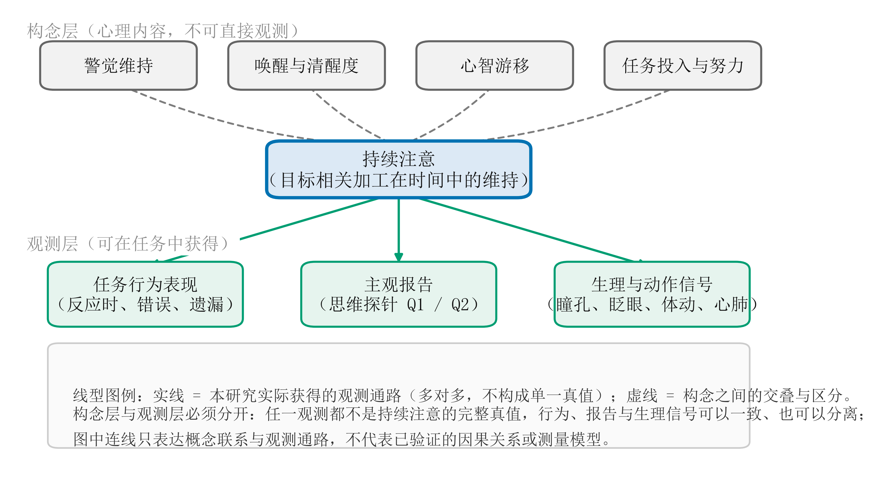

# 2.1 持续注意的构念边界与动态特征

持续注意强调在一段时间内保持对当前目标的加工，而其具体表现取决于任务的感知、记忆和反应要求。经典警觉研究主要关注长时间监控中对少见目标的检测，连续表现任务则进一步考察反应稳定性、错误以及目标维持。两类传统共同关注注意的时间维持，但任务中需要执行的心理过程并不完全相同（Sarter et al., 2001; Fortenbaugh et al., 2017）。因此，对持续注意的操作化既需要保留时间维度，也需要说明个体究竟在持续完成什么活动。

持续表现的变化有多种理论解释。唤醒观点关注总体激活与反应准备，资源分配和控制观点关注有限加工如何在任务与其他内容之间分配，努力与动机观点则强调个体维持投入的意愿及调节过程。这些解释对同一种行为下降可能作出不同判断，也提示相近的错误表现可以具有不同来源（Esterman & Rothlein, 2019）。警觉递减研究发现，事件率、辨别要求和任务结构会改变表现随时间下降的程度（Parasuraman, 1979; See et al., 1995）。任务时间效应因此需要结合任务条件解释，单凭平均表现下降难以确定具体机制。

除缓慢的时间进程外，持续注意还表现为短时波动。Esterman 等（2013）及后续重复研究根据连续反应的稳定程度区分任务中的不同表现状态，显示整场平均值会掩盖局部变化（Fortenbaugh et al., 2018）。与此同时，个体在平均表现和注意一致性上也存在相对稳定的差异（Unsworth & Miller, 2021）。同一个人在某个时段偏离自身通常水平，与某个人整体上比其他人更不稳定，是两个相关但不同的研究问题。状态测评需要关注前者，同时处理后者对观测信号和模型推广的影响。

持续注意与若干邻近概念存在交叠，其区别主要体现在所描述的心理内容与解释层级。

| 概念 | 主要关注 | 与持续注意的关系 |
|---|---|---|
| 警觉维持 | 长时间监控中的目标检测与准备 | 持续注意的重要研究传统，具体含义依任务而定 |
| 唤醒与清醒度 | 生理激活、睡眠—清醒状态和总体反应准备 | 为目标维持提供条件，也可影响行为与生理信号 |
| 心智游移 | 注意转向与当前任务无关的内部内容 | 可伴随任务脱离，但不能涵盖所有持续注意失误 |
| 任务投入与努力 | 对活动的参与和加工资源投入 | 影响持续表现，含义通常超出注意内容本身 |
| 持续注意 | 目标相关加工在时间中的维持 | 通过任务表现、主观体验和其他观测研究其变化 |

上述关系受到任务与定义方式的共同约束（Oken et al., 2006; Unsworth & Miller, 2021; van Schie et al., 2021）。例如，心智游移在总体上与较差任务表现有关，报告频率也常随任务时间增加（Randall et al., 2014; Zanesco et al., 2025）；但清醒的人仍可能思考任务无关内容，主观任务聚焦也不保证每次反应都正确。将这些概念分开，有助于解释不同测量之间的一致与分离。

**图 2 持续注意的构念边界与可观察测量。** 构念层区分持续注意及其邻近概念（警觉维持、唤醒与清醒度、心智游移、任务投入与努力）；观测层列出本研究实际获得的三类观测（任务行为表现、主观报告、生理与动作信号）。**实线**表示观测通路，**虚线**表示构念之间的交叠与区分。连线只表达概念联系与研究中的观测通路，**不代表本研究已验证的因果关系或测量模型**。

构念层面的区别也体现在实证测量中。Welhaf 和 Kane（2024）发现，降低持续注意要求的操纵可以同时改变表现指标和自我报告，但两类测量的协变关系未随任务要求降低而按预期改变。Chidharom 等（2025）进一步发现，客观反应不稳定与主观心智游移可以捕捉不同的注意波动。行为与报告的关联能够为测量解释提供证据，其分离也具有研究意义：不同观测可能反映目标执行、意识内容或总体警觉的不同部分。多源状态测评由此需要明确各项观测的角色，并依据实际关系确定系统输出能够代表的心理范围。

## 本节参考文献

Chidharom, M., Bonnefond, A., Vogel, E. K., & Rosenberg, M. D. (2025). Objective markers of sustained attention fluctuate independently of mind-wandering reports. *Psychonomic Bulletin & Review, 32*(4), 1689–1699. https://doi.org/10.3758/s13423-025-02640-6

Esterman, M., & Rothlein, D. (2019). Models of sustained attention. *Current Opinion in Psychology, 29*, 174–180. https://doi.org/10.1016/j.copsyc.2019.03.005

Esterman, M., Noonan, S. K., Rosenberg, M., & DeGutis, J. (2013). In the zone or zoning out? Tracking behavioral and neural fluctuations during sustained attention. *Cerebral Cortex, 23*(11), 2712–2723. https://doi.org/10.1093/cercor/bhs261

Fortenbaugh, F. C., DeGutis, J., & Esterman, M. (2017). Recent theoretical, neural, and clinical advances in sustained attention research. *Annals of the New York Academy of Sciences, 1396*(1), 70–91. https://doi.org/10.1111/nyas.13318

Fortenbaugh, F. C., Rothlein, D., McGlinchey, R., DeGutis, J., & Esterman, M. (2018). Tracking behavioral and neural fluctuations during sustained attention: A robust replication and extension. *NeuroImage, 171*, 148–164. https://doi.org/10.1016/j.neuroimage.2018.01.002

Oken, B. S., Salinsky, M., & Elsas, S. M. (2006). Vigilance, alertness, or sustained attention: Physiological basis and measurement. *Clinical Neurophysiology, 117*(9), 1885–1901. https://doi.org/10.1016/j.clinph.2006.01.017

Parasuraman, R. (1979). Memory load and event rate control sensitivity decrements in sustained attention. *Science, 205*(4409), 924–927. https://doi.org/10.1126/science.472714

Randall, J. G., Oswald, F. L., & Beier, M. E. (2014). Mind-wandering, cognition, and performance: A theory-driven meta-analysis of attention regulation. *Psychological Bulletin, 140*(6), 1411–1431. https://doi.org/10.1037/a0037428

Sarter, M., Givens, B., & Bruno, J. P. (2001). The cognitive neuroscience of sustained attention: Where top-down meets bottom-up. *Brain Research Reviews, 35*(2), 146–160. https://doi.org/10.1016/S0165-0173(01)00044-3

See, J. E., Howe, S. R., Warm, J. S., & Dember, W. N. (1995). Meta-analysis of the sensitivity decrement in vigilance. *Psychological Bulletin, 117*(2), 230–249. https://doi.org/10.1037/0033-2909.117.2.230

Unsworth, N., & Miller, A. L. (2021). Individual differences in the intensity and consistency of attention. *Current Directions in Psychological Science, 30*(5), 391–400. https://doi.org/10.1177/09637214211030266

van Schie, M. K. M., Lammers, G. J., Fronczek, R., Middelkoop, H. A. M., & van Dijk, J. G. (2021). Vigilance: Discussion of related concepts and proposal for a definition. *Sleep Medicine, 83*, 175–181. https://doi.org/10.1016/j.sleep.2021.04.038

Welhaf, M. S., & Kane, M. J. (2024). A combined experimental–correlational approach to the construct validity of performance-based and self-report-based measures of sustained attention. *Attention, Perception, & Psychophysics, 86*(1), 109–145. https://doi.org/10.3758/s13414-023-02786-2

Zanesco, A. P., Denkova, E., & Jha, A. P. (2025). Mind-wandering increases in frequency over time during task performance: An individual-participant meta-analytic review. *Psychological Bulletin, 151*(2), 217–239. https://doi.org/10.1037/bul0000424
