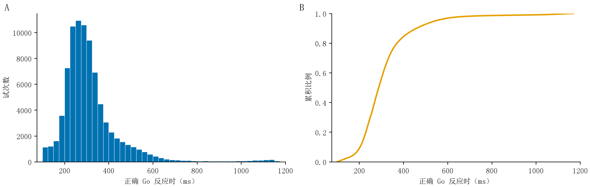
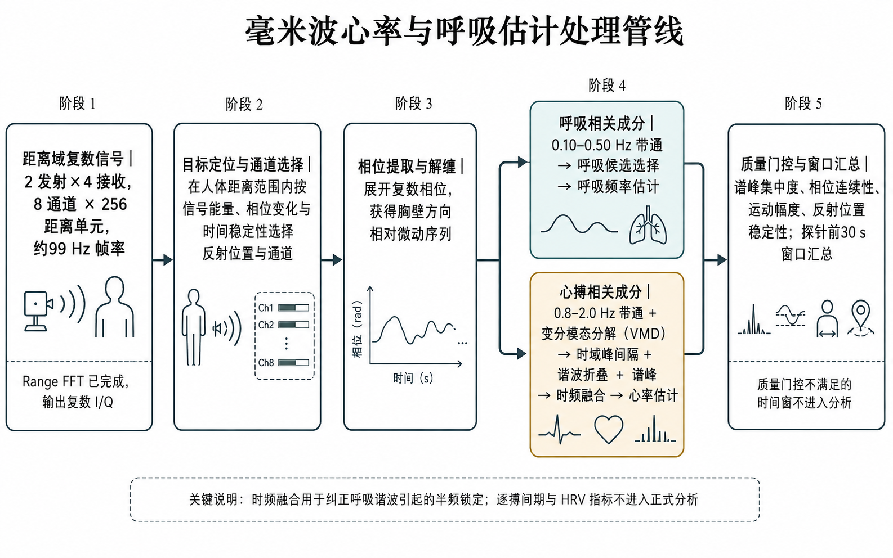
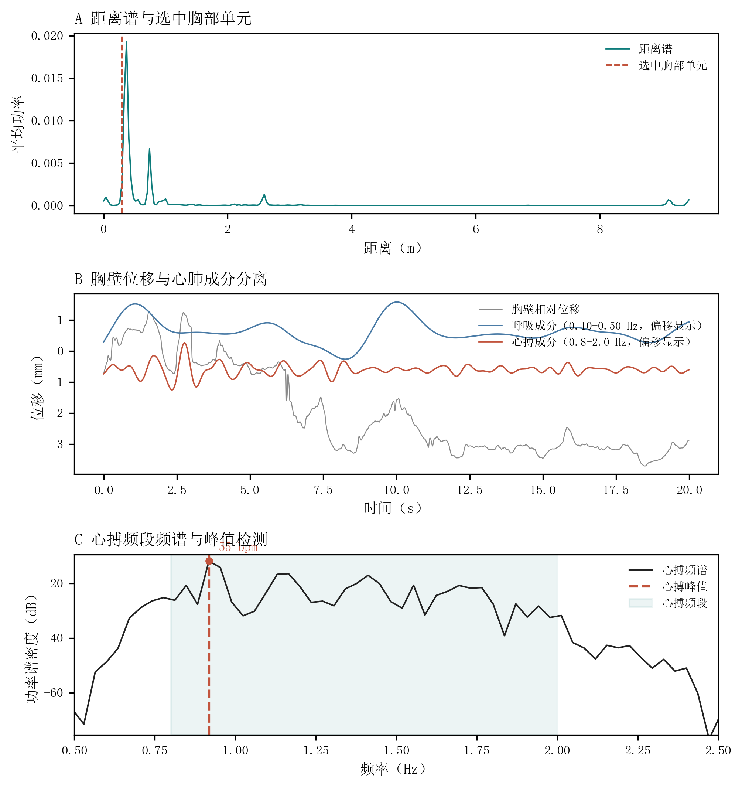

# 4.4 数据分析

各模态以任务事件时间为共同参照，并保留原有时间分辨率。行为数据形成试次、错误事件、Block、Block 内时间段和探针前窗口等分析单位。NIR、毫米波和 RGB 连续记录完成质量评价与特征提取后，对应到相同任务事件和时间窗口。单模态分析考察任务时间变化及其与行为、思维探针的关系，多模态分析在共同探针前窗口上进行增量预测。

## 4.4.1 行为与思维探针

SART 行为指标包括反应速度、反应稳定性、Go 遗漏、No-Go 误按和信号辨别指标。Go 遗漏率以有效 Go 试次为分母，No-Go 误按率以有效 No-Go 试次为分母，两类错误分别分析。

正确 Go 试次的反应时（reaction time, RT）用于描述反应速度，低于 100 ms 的按键作为提前反应单独记录。有效正确 Go RT 同时计算均值和中位数。反应稳定性采用 RT 标准差、四分位距、中位数绝对偏差和反应时变异系数（RT coefficient of variation [RT-CV]）描述。每个窗口包含至少 2 次有效正确 Go 反应时，以样本标准差除以均值计算 RT-CV。窗口内采用 Theil–Sen 稳健斜率描述反应速度随时间的变化方向（Sen, 1968; Theil, 1950）。

图 12 正式实验的正确 Go 反应时分布

注：A 为反应时分布，B 为累积分布。图示包含 116 个实验场次中 83661 次不低于 100 ms 的正确 Go 反应。

信号检测论指标用于综合描述反应辨别能力与反应倾向。Go 正确反应作为命中，No-Go 误按作为虚报。当一个分析时间段至少包含 4 个 Go 和 2 个 No-Go 机会时，命中率和虚报率按对数线性规则进行校正（Hautus, 1995），据此计算辨别力 d′、反应标准 c 和 β（Macmillan & Creelman, 2005）。d′、c 和 β 与反应速度、反应变异、Go 遗漏和 No-Go 误按分别报告。

Go 遗漏率为未作出反应的 Go 试次占全部 Go 试次的比例。为考察按键时序的影响，另将伴有刺激前按键或跨试次按键延续的漏按单独统计；其余漏按占全部 Go 试次的比例记为筛选后遗漏率，用于补充分析。

错误事件分析分别以 Go 遗漏和 No-Go 误按为锚点，提取错误前后相邻正确 Go 试次的参与者内中心化 RT，用于描述错误发生前后的局部反应轨迹。较慢的任务时间变化则在每个 Block 内按顺序划分为 6 个连续时间段，从而把错误发生前的局部变化与 Block 内较长时间尺度的表现变化区分开来。B1 与 B2 的比较先在每个实验场次内形成配对差值，同一参与者的多个场次差值取参与者内平均后，以参与者为重抽样单位进行自助重采样（Efron & Tibshirani, 1994），报告平均差、自助标准误与 95% 百分位置信区间。

思维探针主要对应探针出现前的近期行为状态。主要窗口为探针前 30 s，并以 10 s 和 20 s 窗口评价时间尺度敏感性。窗口止于探针出现前的最后一个完整试次。第一问的四类注意内容作为名义类别变量，第二问的四级警觉程度作为有序变量。各窗口汇总近期反应速度、反应稳定性、Go 遗漏、No-Go 误按及满足机会数要求时的信号检测论指标，用于检验主观状态与近期任务表现之间的关系。

## 4.4.2 近红外瞳孔测量

近红外视频首先使用项目训练的 YOLO26n 检测器定位眼部区域（Ultralytics, 2026），再采用 RITnet 四分类语义分割模型识别背景、巩膜、虹膜和瞳孔（Chaudhary et al., 2019）。本报告主要眼部关联结果及预测模型采用硬分割瞳孔面积占瞳孔与虹膜合计面积的比例，并由此形成水平、波动、线性趋势和二次曲率四项瞳孔指标。几何平均直径由拟合椭圆的长短轴计算，单位为 px，保留为替代表示与测量敏感性分析。两种表示的测量尺度不同，其比较结果见 5.3.1。

瞳孔数据质量综合眼部可见性、瞳孔分割与几何拟合稳定性、有效图像区域、分割不确定性以及连续帧的时间与几何连续性进行评价，左右眼分别保留测量结果。任务过程中的瞳孔变化以该次实验中较稳定的瞳孔水平作为个体内参照。事件相关变化以事件发生前的短时瞳孔水平作为局部参照。任务开始前 3 min 静息阶段仅在眼部具有足够稳定的可用数据时用于探索性比较。

连续瞳孔序列在短时间窗内汇总中位数、离散程度、变化斜率和相邻变化幅度，并形成 Block 内任务进程、行为事件附近和探针前窗口的指标。为控制屏幕刺激引起的瞳孔光反射差异，按照实际呈现规则重建 9 类水果与 3 种尺寸形成的 27 种视觉条件，计算数字相对亮度、RMS 对比度和刺激可见面积。刺激后分析同时考虑当前及前一试次的视觉属性。刺激前窗口则使用此前已经呈现的视觉信息。

## 4.4.3 RGB 可见行为测量

RGB 视频分析聚焦于整体运动、画面亮度变化、姿态辅助信息和眨眼候选事件。整体运动采用相邻帧图像变化形成的运动能量（motion energy）描述，并单独计算画面平均灰度变化，以区分身体运动与曝光或整体亮度变化。基于人体姿态关键点模型（BlazePose；Bazarevsky et al., 2020）提取的姿态关键点用于描述左右和上下方向的可见运动。前后方向则综合深度方向姿态、肩宽变化和人体在画面中的面积变化，判断明显的前后移动趋势。

眼睑活动采用 MediaPipe Face Mesh 面部网格（Lugaresi et al., 2019; Kartynnik et al., 2019）定位眼部关键点，并以眼睛纵横比（eye aspect ratio, EAR）描述眼睑开合程度（Soukupová & Čech, 2016）。左右眼分别计算 EAR，并以各自可观测时段中的较高开放水平作为相对参照。双眼均具有足够可用数据且变化基本一致时识别眨眼候选事件，候选闭眼阶段的持续时间限定为 50–1000 ms。时间序列出现明显间隔、多脸导致主要面孔无法稳定确定或面部追踪发生切换时，事件从该位置重新计算。由此得到眨眼候选次数、持续时间和间隔等指标。

RGB 运动、姿态和眨眼候选按 Block 时间进程和探针前窗口汇总。整体运动用于描述外显体动，并与毫米波身体运动指标相互参照。姿态方向用于辅助解释运动来源，眨眼候选与运动指标分别分析。

## 4.4.4 毫米波心肺相关活动与身体微动

图 13 毫米波信号处理关键步骤

注：从距离域复数信号中提取胸壁微动，经呼吸与心搏频段分离、时域和频域估计后，得到窗口级心率与呼吸率。

毫米波记录胸壁微动中的呼吸和心搏信息，形成与行为、眼部和身体动作相配合的自主生理观测。分析提取窗口级心率与呼吸率，并结合运动幅度、相位连续性和谱峰集中程度控制信号质量。

毫米波帧时间与任务事件时间对应，以每次思维探针前 30 s 为主要分析窗口。窗口内按时间顺序选取信号，并以区块边界限定分析范围，使心肺指标与同期行为及主观报告对应。

呼吸和心搏相关变化分别采用 0.10–0.50 Hz 和 0.8–2.0 Hz 的四阶巴特沃斯带通滤波，并进行双向滤波。心搏信号结合变分模态分解（variational mode decomposition, VMD）提取窄带成分（Dragomiretskiy & Zosso, 2014）；模态数为 3，惩罚参数为 1000，更新步长为 0，采用均匀初始化和 10⁻⁶ 的收敛阈值。心率与呼吸率估计综合时域峰间隔、频域峰值及两者的一致性。

毫米波采集数据为完成距离向快速傅里叶变换后的复数信号，由 2 发射×4 接收形成 8 个通道，每通道含 256 个距离单元。分析综合回波能量、相位变化和时间稳定性选择胸壁微动所在的距离单元及通道，再提取呼吸和心搏成分。

图 14 毫米波距离选择、相位微动与频谱示例

注：A 为距离谱与选中的距离单元；B 为 20 s 相位片段及呼吸、心搏带通成分，后两者作纵向偏移以便观察；C 为心搏频谱，标出的谱峰对应 55 次/min。
