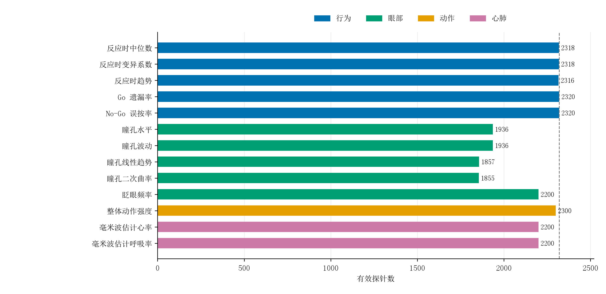

# 5.1 样本构成与模态覆盖

正式实验共纳入 61 名参与者的 116 个实验场次，包含 232 个正式任务区块、100224 个试次和 2320 次思维探针。行为、眼部与动作记录均可对应到这一探针集合，但受设备记录、质量要求及指标可估计条件影响，各指标的有效范围不同。32 名参与者具有重复实验记录，其中 10 名恰有 2 个场次，22 名具有 3 个及以上场次。重复记录在推断中按参与者聚类，预测模型按参与者划分训练集和测试集。

图 15 各模态指标覆盖率
