# 5.10 测评系统的界面与交互设计

测评结果需要以使用者容易理解的方式呈现。FocusWave已完成面向测评准备、实时反馈和历史回顾的交互原型，将状态信息、估计可靠性与信号质量分层展示，并以示例数据呈现完整使用流程。画面采用平静、自然的视觉意象，探索低干扰的注意反馈方式。

5.10.1 测量分析与结果呈现

FocusWave的系统设计包含测量分析与结果呈现两部分。测量分析从任务与同步信号出发，形成科学指标，建立注意内容预测模型，并评价其跨参与者表现。结果呈现围绕一次测评的完整使用过程，将测量信息组织为状态反馈、单次总结和长期记录。两部分围绕同一测评目标展开，测量研究为状态解释提供依据，界面设计则帮助使用者理解结果、回顾自身变化。算法与呈现方式可以分别改进，使测量能力和使用体验持续完善。

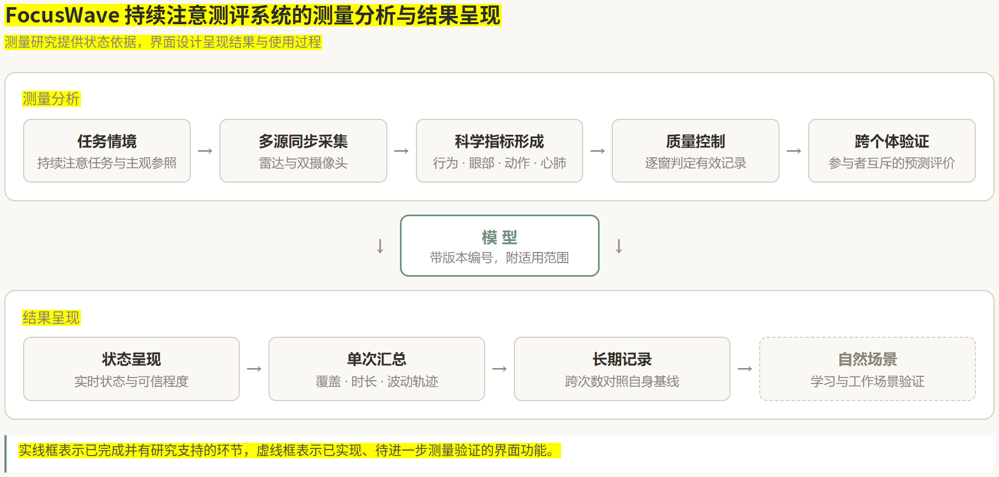

图 35 测量分析与结果呈现的关系

注：上方为任务诱发、多源采集和跨个体预测的研究流程，下方为状态反馈、单次总结和长期记录的交互原型。实线框与虚线框分别表示这两类环节。

5.10.2 测评信息的组织与呈现

界面原型将每次测量组织为时间、状态、可靠性与数据来源四个方面。时间标识对应记录的时刻与范围，状态分量呈现注意状态的不同侧面，0–100 状态指数用于探索直观的汇总表达。估计可信程度与信号质量分别显示，信号不足时标记为暂时无法估计。当前模型提供任务聚焦报告的概率，界面在此基础上探索过程反馈与跨次数回顾的组织方式。

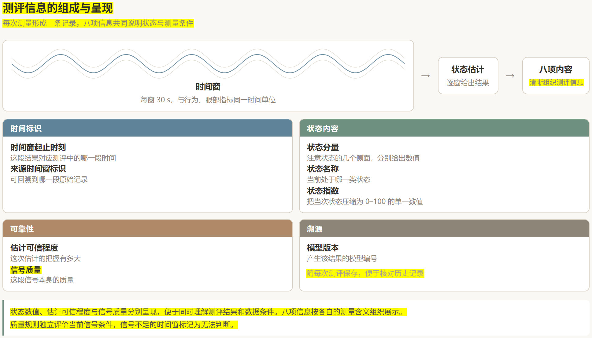

图 36 测评信息的组成与呈现

注：每次测量形成一条记录，包含八项内容，分为时间标识、状态内容、可靠性与数据来源四组。界面按各项信息的测量含义组织展示。

5.10.3 测评流程与界面呈现

一次测评的使用流程分为准备、实时反馈、结束后汇总和跨次数记录四个阶段。以下结合界面原型，依次说明各阶段的操作安排、信息层次与呈现方式。

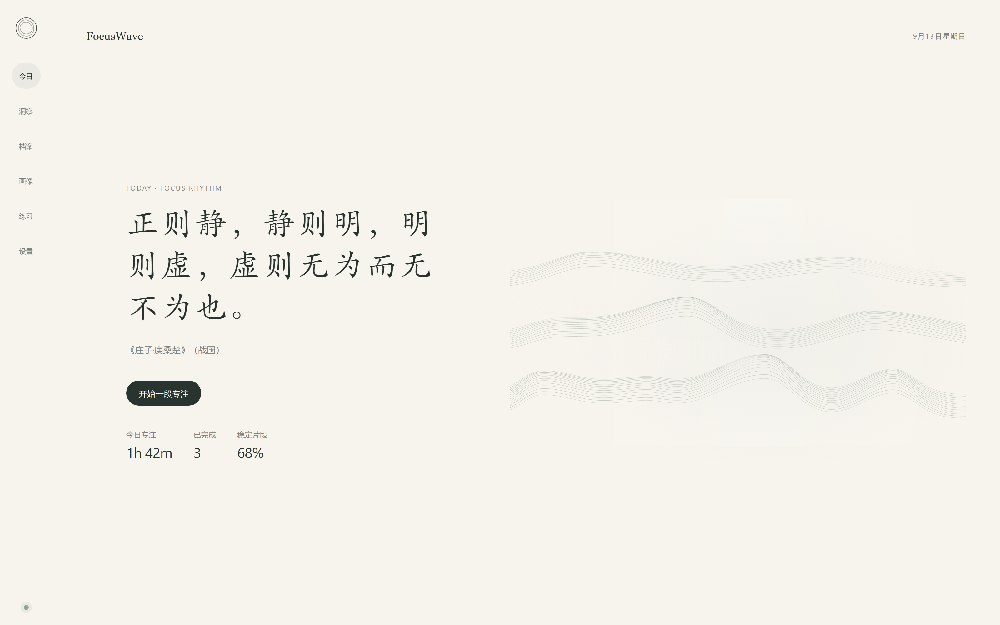

图 37 测评入口界面

注：界面提供测评入口、当日累计专注时长、已完成段数与稳定片段比例，并显示最近一次测评的记录。

入口界面集中显示当日累计时长、已完成段数与稳定片段比例，方便使用者在开始前回顾近期记录。页面优先呈现汇总信息和最近一次测评结果，使测评入口清楚、日常回顾简便。

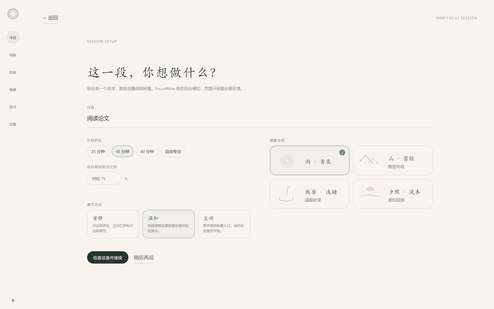

图 38 测评设置界面

注：界面包含任务名称、预计时长、视觉意象与提示偏好四项设置，全部在测评开始前完成。

任务名称、预计时长、视觉意象与提示偏好均在测评开始前设置。测评过程中以状态呈现为主，减少需要主动操作的控件，使使用者能够将注意留在当前活动上，并尽量降低界面操作对测量的干扰。

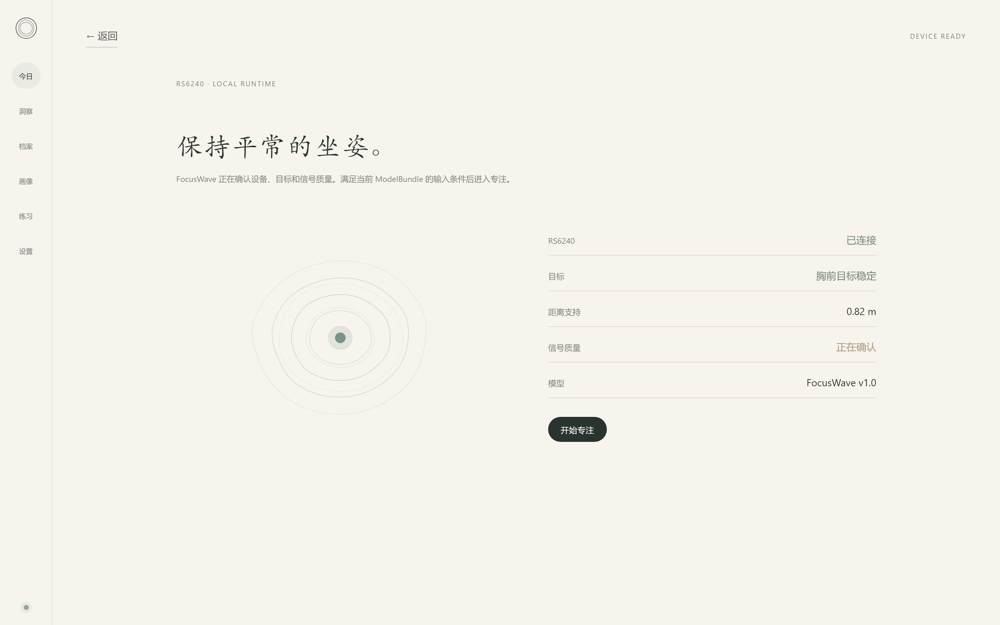

图 39 设备就绪与信号质量界面

注：界面在测评开始前呈现设备连接状态、是否稳定检测到人、距离是否在支持范围内、信号质量是否达标、静息基线是否已建立，以及当前使用的模型版本。

六项状态分别反映设备采集与状态估计的准备情况，使用者可以据此了解本次测量的条件。设备连接、人员检测、测量距离和基线等信息在开始前集中展示，使技术检查转化为直观的准备提示，帮助使用者判断何时适合开始测评。

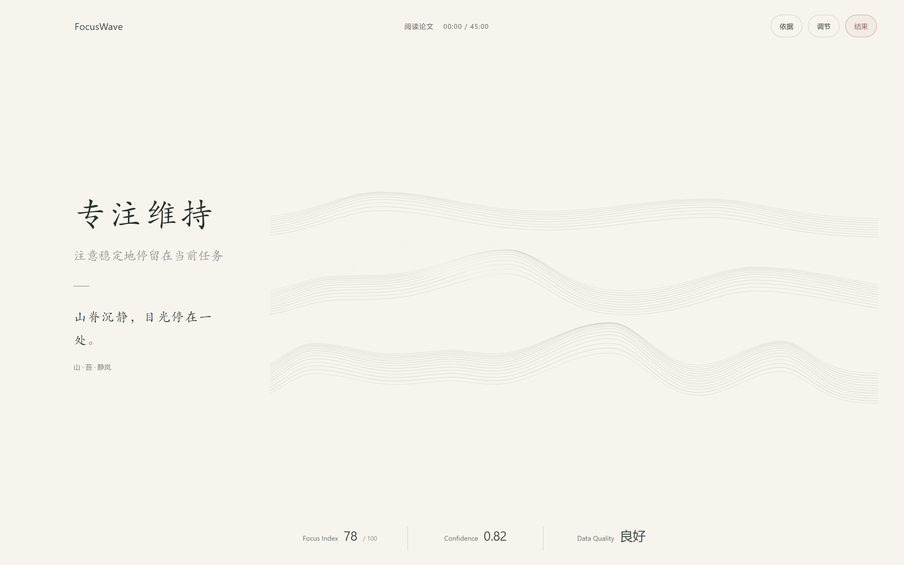

图 40 实时注意状态界面

注：界面以大面积留白呈现状态信息。左侧为当前状态名称、状态说明与辅助文字，右侧画面由信号参数生成，图示采用山景意象。底部三项依次为状态指数、估计可信程度与信号质量。

实时界面以状态名称、简短说明与动态画面呈现测评信息，并同时显示估计可信程度和信号质量。信号不足的时间窗标记为无法判断，使使用者能够清楚区分有效的平稳状态记录和暂时缺少可靠估计的时段。

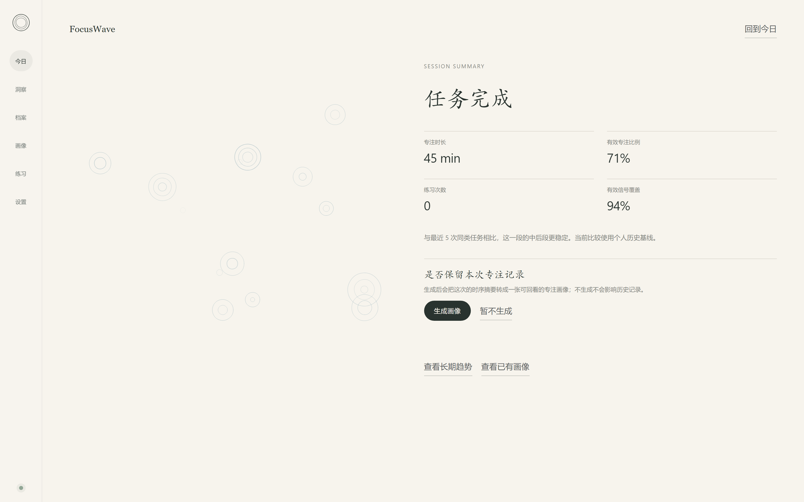

图 41 单次测评结束后的总结界面

注：界面呈现本次测评的总时长、有效记录覆盖比例、稳定片段数与稳定片段占比。对照基准为使用者自身以往的历史记录。

单次总结将状态序列汇总为便于回顾的过程指标，并以使用者自身的历史记录作为比较基准，突出个体相对自身的变化。有效记录覆盖与状态指标并列显示，使用者既能了解本次表现，也能看到形成这一结果的数据条件。

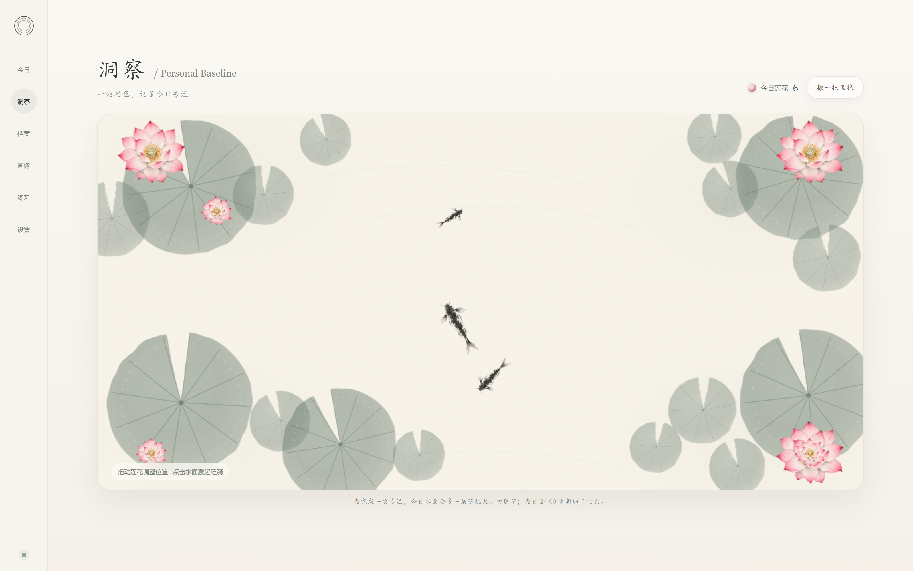

图 42 跨次数记录的墨池莲花界面

注：每完成一段专注，池中增加一朵莲花。花朵位置按预设顺序分配，大小在三个尺寸档中随机选取，界面只显示当日已积累的朵数。

跨次数记录采用墨池莲花与专注档案两种呈现方式。每完成一段专注，墨池中便增加一朵莲花，位置按预设顺序分配，大小在三个尺寸档中随机选取。花朵记录当日已完成的片段，大小与位置作为视觉变化使用，不承担质量评分。页面以自然积累的方式呈现投入过的时间，让使用者看到已经完成的努力。需要进一步比较时段和状态分布时，可以进入专注档案查看分段记录。

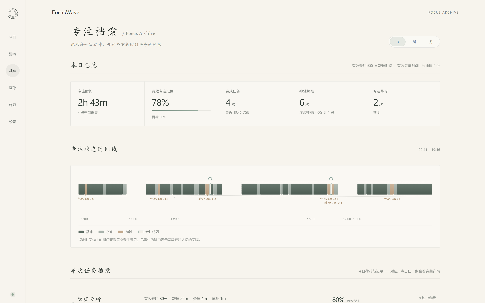

图 43 专注档案界面

注：界面按日、周、月汇总历史记录。图示为日视图，上方为本日总览，包含专注时长、有效专注比例、完成任务数与状态片段数，下方为专注状态时间线，按凝神、分神、神驰与专注练习分段呈现。

专注档案把单次测评扩展为跨次数的纵向记录。时间线按状态分段显示，色带中的空白表示两次专注之间的间隔，短期波动与长期趋势可以分开观察。纵向对照的对象仍是使用者自己的历史记录，系统描述的是个体自身注意节律的变化。

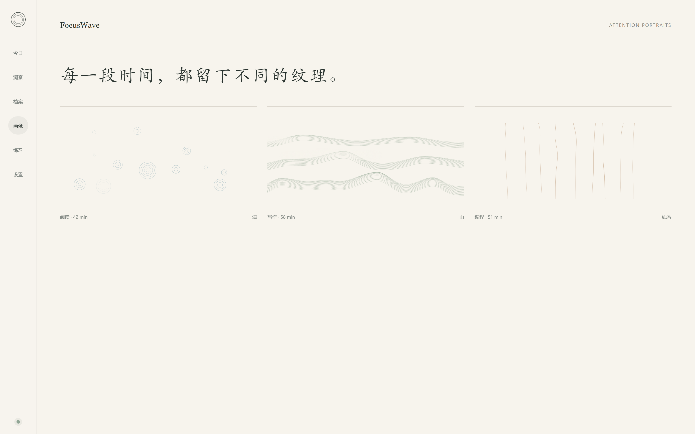

图 44 注意画像界面

注：注意画像由同一次测评的状态序列与信号特征生成，与状态记录来自同一份数据。

注意画像把一次测评的状态过程转换为可保存的视觉记录。画像与状态记录来自同一份数据，画像形态与当次的状态过程一致。不同次测评的画像按同一规则生成，可以直接并置比较。

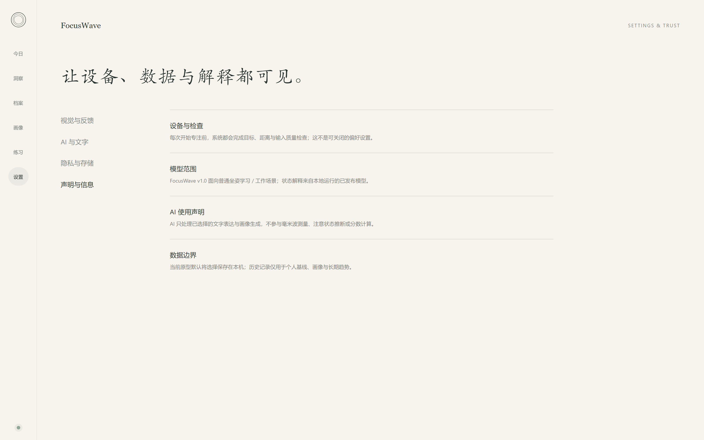

图 45 设置与模型信息界面

注：设置界面集中呈现设备检查、模型范围、人工智能使用说明与数据管理信息。

模型版本与适用范围在界面中清楚展示，每次测评记录均保留对应的模型信息。使用者可以了解结果的来源和适用条件，也便于在回顾历史记录时辨认不同版本下的测评结果。

5.10.4 状态到画面的生成规则

界面画面按照固定规则由信号与状态特征生成。同一视觉意象内部，特征变化调节线条的位移、曲率、细纹、透明度和清晰程度。切换意象时，则改变整体线条形态与配色。相位变化对应主流线位移，呼吸分量对应大尺度曲率与波峰间距，心搏微动形成细纹，体动形成局部偏折。信号覆盖调节透明度与连续范围，估计可信程度调节线条的清晰与稳定。各项规则均保留数据来源和变换方式，同次测评能够复现相同画面，不同测评也可以按统一规则并置比较。

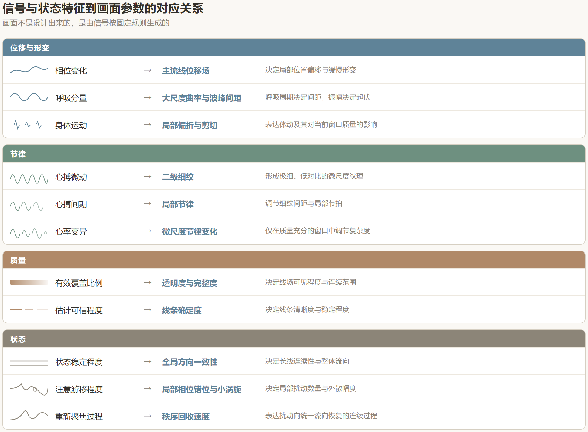

图 46 信号与状态特征到画面参数的对应关系

注：按位移与形变、节律、质量、状态四组，列出每一类信号特征所驱动的画面参数。每组左侧图形为该类特征的示意波形。

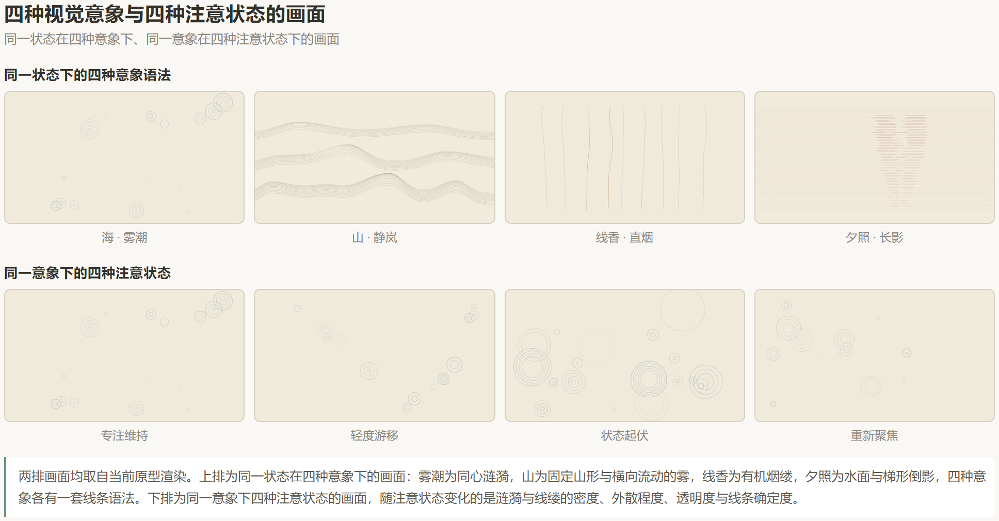

图 47 四种视觉意象与四种注意状态的画面

注：上排展示同一状态在四种视觉意象下的画面，雾潮为同心涟漪，山为固定山形与横向流动的雾，线香为有机烟缕，夕照为水面与梯形倒影。下排为同一意象下四种注意状态的画面，随状态变化的是密度、外散程度、透明度与线条确定度。两排画面均来自当前界面原型。
