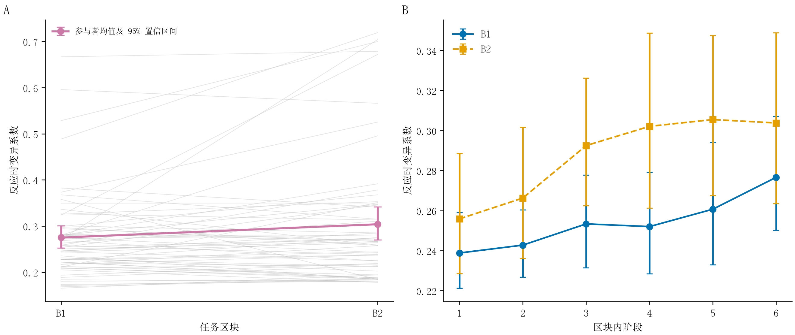
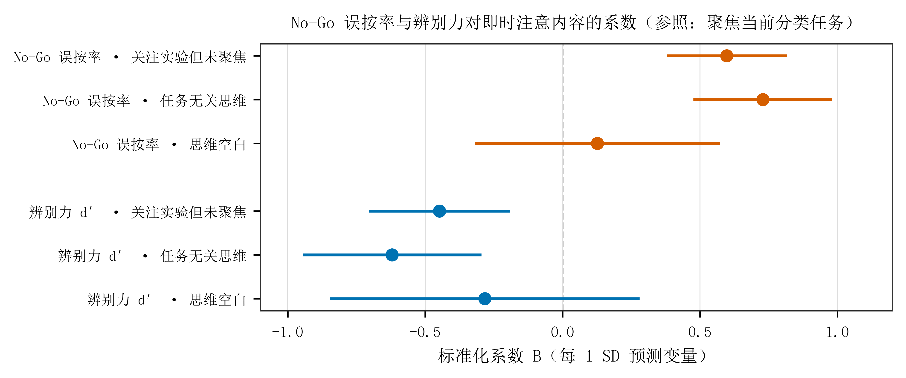
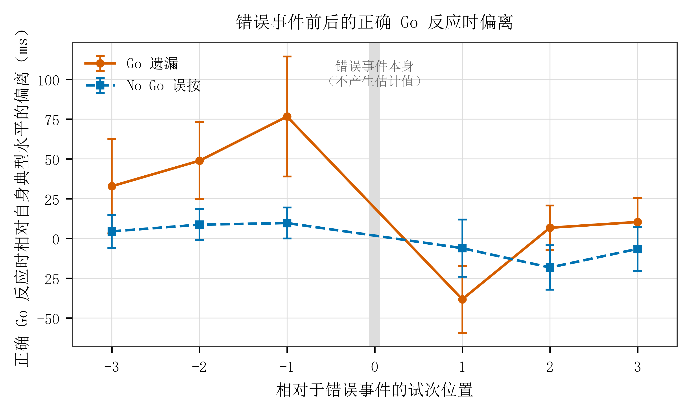

# 5.2 行为表现与主观注意状态

## 5.2.1 主观报告分布与近期行为

2320 次注意内容报告中，任务聚焦占 68.7%，其余三类合计占 31.3%，其中任务无关思维最少，占 4.1%。困倦—清醒报告主要集中于比较清醒和非常清醒，二者合计占 83.9%。

表 9 思维探针 Q1 与 Q2 选择分布

| 探针 | 选项 | n | 比例 |
| --- | --- | --- | --- |
| Q1 此画面出现前一刻，最符合您状态的是 | 1 完全专注于分拣任务 | 1,594 | 68.7% |
| Q1 此画面出现前一刻，最符合您状态的是 | 2 关注实验本身，但没有聚焦于分拣任务 | 467 | 20.1% |
| Q1 此画面出现前一刻，最符合您状态的是 | 3 在想与实验无关的事情 | 95 | 4.1% |
| Q1 此画面出现前一刻，最符合您状态的是 | 4 大脑空白，没有明确想法 | 164 | 7.1% |
| Q2 在过去的几个试次中，您的清醒程度是 | 1 非常困倦 | 39 | 1.7% |
| Q2 在过去的几个试次中，您的清醒程度是 | 2 比较困倦 | 334 | 14.4% |
| Q2 在过去的几个试次中，您的清醒程度是 | 3 比较清醒 | 1,054 | 45.4% |
| Q2 在过去的几个试次中，您的清醒程度是 | 4 非常清醒 | 893 | 38.5% |

探针前 30 s 窗口平均含 19.94 个有效正确反应时。近期行为分布见表 10。反应时变异系数多数低于其均值，趋势的中位数接近零，但两者均存在较长尾部。80.2% 的窗口没有遗漏。每窗口平均包含 2.60 个抑制反应机会，因此误按率具有明显的离散取值。

表 10 探针前 30 s 行为的描述统计

| 指标 | 有效窗口数 | 均值 | 标准差 | 中位数 | 补充分布 |
| --- | --- | --- | --- | --- | --- |
| 反应时变异系数 | 2318 | 0.259 | 0.165 | 0.215 | 第 95 百分位为 0.661 |
| 反应时趋势（ms/s） | 2316 | 0.331 | 4.209 | 0.231 | 第 5—95 百分位为 −4.28—4.82 |
| 遗漏率 | 2320 | 0.0241 | — | — | 80.2% 的窗口为零 |
| 误按率 | 2320 | 0.3228 | — | — | 平均 2.60 个抑制反应机会 |

注：各行按有效窗口汇总，破折号表示该统计量未在表中列出。场次层正确反应时均值的平均值为 318.93 ms，反应时中位数的平均值为 309.31 ms。场次统计与探针窗口统计分别呈现，以区分整场表现和近期行为。

## 5.2.2 任务进程中的行为变化

参与者聚类的区块配对分析显示，第二个区块的反应时变异系数相对第一个区块增加 0.029，95% 置信区间为 [0.007, 0.055]。正确反应时标准差增加 8.9 ms，95% 置信区间为 [1.4, 17.2]。平均及中位反应时、原始遗漏率、误按率和辨别力的区块差异区间均包含零。

区块内六个连续阶段的线性模型中，第一个区块每推进一个阶段，反应时变异系数增加 0.0078，标准误为 0.0023，95% 置信区间为 [0.0033, 0.0122]。第二个区块相对第一个区块的阶段斜率差为 0.0001，95% 置信区间为 [−0.0057, 0.0060]。该模型包含 61 名参与者、116 个场次和 1391 条有效阶段记录。区块间与区块内均观察到反应波动增加。两种时间尺度的结果共同呈现了持续任务中的反应稳定性变化。

图 16  RT-CV 的任务时间进程

注：A 为参与者在 B1、B2 中的配对均值，灰线表示个体，深色线表示组均值；B 为每个区块六个连续阶段的组均值。先在参与者内汇总重复场次，再按参与者进行 20000 次自助抽样，误差线表示 95% 置信区间。每个阶段包含 4 个刺激循环。

## 5.2.3 近期行为与注意内容

以任务聚焦为参照，误按率与关注实验但未聚焦分拣任务、任务无关思维呈正向关联，与思维空白的系数区间包含零。辨别力与前两类报告呈负向关联，反映了抑制反应表现与主观注意内容的对应关系。

图 17  误按率、辨别力与注意内容报告的关系

注：各指标分别进入多项逻辑回归，均包含 61 名参与者、116 个场次、2320 个探针。系数表示指标增加一个标准差时，所列报告相对于任务聚焦的对数优势变化。区间使用参与者聚类稳健标准误。各项系数分别描述相对于任务聚焦的类别对比。

误按率与辨别力共同反映抑制反应信息，结果呈现相互对应的方向。10 s 和 20 s 的嵌套窗口中，误按与前两类报告的关联方向也相同，说明在同一批观测的不同近期时间范围内，可以观察到一致的关联方向。

## 5.2.4 近期行为与困倦—清醒报告

误按率每增加一个标准差，报告较高清醒等级的累积对数优势降低 0.299，95% 置信区间为 [−0.397, −0.201]。辨别力的相应系数为 0.389，95% 置信区间为 [0.287, 0.490]。两项模型均包含 61 名参与者、116 个场次和 2320 个探针，分别表明较高误按与较低主观警觉、较高辨别力与较高主观警觉相联系。

筛选后遗漏率与主观警觉呈负向关联，系数为 −0.404，95% 置信区间为 [−0.564, −0.244]，基于 2320 个探针。这一补充结果与误按率、辨别力的结果相互呼应，呈现了较低警觉状态下任务反应完整性与抑制控制的变化。

## 5.2.5 错误附近的局部反应变化

遗漏之前三个试次位置上的正确反应时均慢于参与者自身中位数，偏离随错误临近而增加，紧邻错误前为 +76.6 ms，错误后一位置转为 −38.3 ms。误按附近也出现小幅变化，但其错误前点估计较小。完整描述见附录 C.2。

图 18 错误前后各试次位置的正确反应时偏离

注：正值表示慢于参与者自身正确反应时中位数。均值与标准误来自参与者层汇总，遗漏涉及 54 人、93 场，误按涉及 61 人、116 场。横轴按全部任务试次标记相对位置。位置 0 为错误本身，其余位置展示相应试次中有效正确反应的反应时。

遗漏前反应逐渐变慢，错误后随即加快，呈现了局部任务执行状态的调整。与整段任务中的波动相比，事件对齐的轨迹进一步展示了注意变化在短时间尺度上的行为表现。
