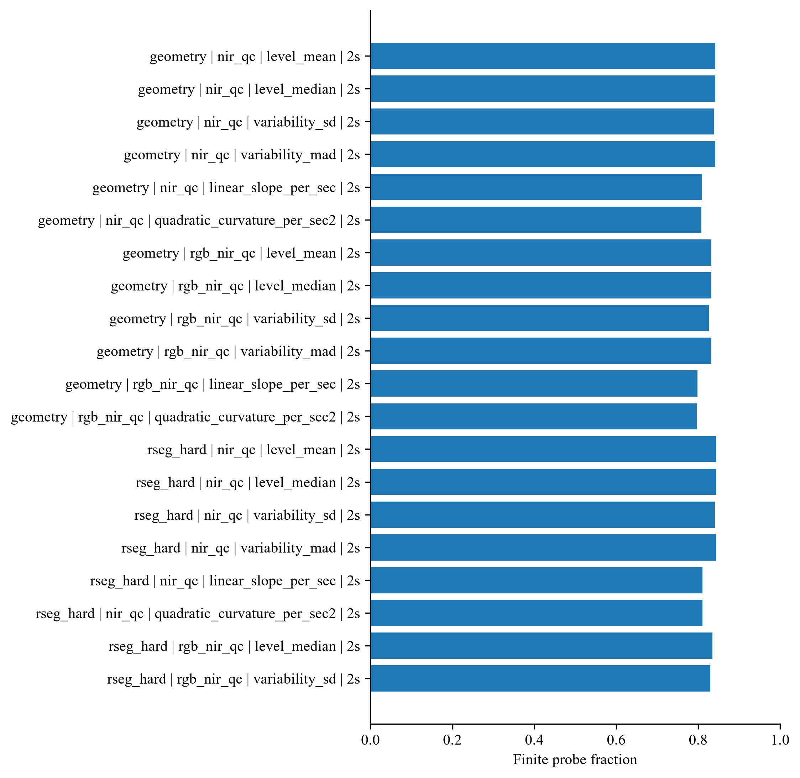
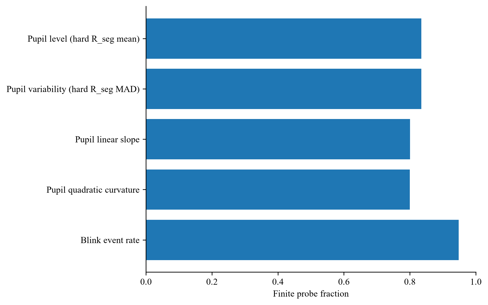
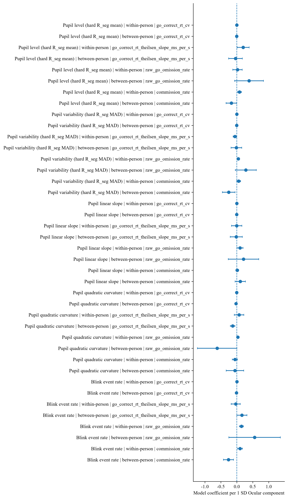

# 5.3 眼部：瞳孔与眨眼

本节先用测量资格结果说明五个冻结眼部维度是怎样形成的，再报告这些维度在任务进程、即时注意内容、主观警觉和近期行为上的正式效应。测量资格结果回答“指标能否稳定形成”，心理效应结果回答“指标与注意状态怎样对应”，两类结果分别呈现，不互相替代。

五个第一轮冻结维度为瞳孔总体水平、瞳孔波动、瞳孔线性时间变化、瞳孔二次时间曲率与眨眼频率。瞳孔总体水平与波动共用同一清洗轨道，瞳孔线性变化与二次曲率额外要求 20 s 最低真实时间支持，眨眼频率来自 RGB 可见光事件检测，其有效样本量与瞳孔指标不同。

## 5.3.1 瞳孔表示与表示一致性

正式分析以瞳孔—虹膜区域内的相对面积比例作为主要瞳孔表示，并以椭圆拟合得到的几何平均直径进行测量方式比较。两种表示在相同窗口中的共同可用率均超过 99.5%，但相关程度为中等。

**表 5.3-1 瞳孔分割比例与几何直径的一致性**

| 瞳孔特征 | 配对有效窗口 | 配对可用率 | 斯皮尔曼秩相关 ρ | 动态方向一致率 |
|---|---:|---:|---:|---:|
| 总体水平（均值） | 1,931 | 99.74% | .664 | — |
| 总体水平（中位数） | 1,931 | 99.74% | .695 | — |
| 标准差 | 1,916 | 99.53% | .720 | — |
| 中位数绝对偏差 | 1,931 | 99.74% | .660 | — |
| 线性变化 | 1,902 | 99.53% | .592 | 74.13% |
| 二次曲率 | 1,892 | 99.79% | .656 | 76.27% |

总体水平的相关系数约为 .66–.70，线性变化约为 .59，二次曲率约为 .66；两种表示对动态方向的判断约有四分之三一致。共同可用率很高而相关程度仅为中等，说明差异主要来自测量表示本身。主要结果采用相对面积比例，几何直径用于检验结论对测量方式的依赖程度。

## 5.3.2 波动指标的确定

瞳孔波动曾同时比较标准差、中位数绝对偏差和四分位距。第一轮正式波动指标采用中位数绝对偏差，原因是它与四分位距的一致性较高，同时比标准差更不易被少量残余极端值支配。标准差保留为敏感性表示，四分位距继续作为测量比较证据，但不再单独承担第一轮预测变量的角色。

**图 5.3-1 替代眼部表示的覆盖率与预先规定角色。** 替代眼部表示的覆盖率与预先规定角色。它们仅用于敏感性、测量资格或设备替代审计，**不因显著性进入第一轮主模型**。来源表 `ocular_sensitivity_role_audit.csv`；分母为 61 名参与者 / 109 个场次 / 2,320 个探针。

## 5.3.3 动态指标的最低时间支持

时间动态比较了 10、15、20 和 25 s 四种最低实际时间跨度。

**表 5.3-2 不同最低时间跨度下瞳孔动态指标的保留率**

| 最低实际跨度 | 线性变化可用率 | 二次曲率可用率 |
|---:|---:|---:|
| 10 s | 86.90% | 86.76% |
| 15 s | 86.71% | 86.57% |
| **20 s** | **85.97%** | **85.88%** |
| 25 s | 84.72% | 84.68% |

采用 20 s 最低时间支持后，仍保留 1,857 个线性变化窗口和 1,855 个二次曲率窗口。相比 10 s，线性变化保留率仅下降约 0.93 个百分点；继续提高到 25 s 则进一步减少可用窗口。低于 20 s 的窗口仍可用于瞳孔总体水平和波动，但不解释其线性变化与二次曲率。

## 5.3.4 来源模式与同步限制

在来源模式审计覆盖的时间点中，约 37.98% 为双眼同时可用，37.26% 为单眼可用，另有约 24.76% 不满足当前瞳孔测量要求。单眼观测占有相当比例，因此正式瞳孔结果同时利用双眼和单眼的有效数据；现有证据不足以估计不同来源模式之间的稳定数值偏移，因此不做来源模式校正，只作为限制条件携带。

具有近红外和 RGB 时间边界证据的 108 个场次中，场次起止边界最大绝对差的中位数为 32 ms，第 95 百分位为 63.6 ms。绝大多数场次的整体时间轴具有较好一致性，少数局部覆盖间断主要影响相应探针窗口的可用性，按窗口级实际可用性处理，不据此整场剔除。

**表 5.3-3 五个冻结眼部维度的有效样本**

| 眼部维度 | 有限值窗口 | 占 2,320 个探针 | 参与者 | 场次 |
|---|---:|---:|---:|---:|
| 瞳孔总体水平 | 1,936 | 83.45% | 61 | 108 |
| 瞳孔波动 | 1,936 | 83.45% | 61 | 108 |
| 瞳孔线性时间变化 | 1,857 | 80.04% | 61 | 107 |
| 瞳孔二次时间曲率 | 1,855 | 79.96% | 61 | 107 |
| 眨眼频率 | 2,200 | 94.83% | 60 | 110 |

表注：分母为全部 2,320 个思维探针。眨眼频率的参与者与场次分母小于瞳孔指标，因此后续模型不得假设二者样本完全相同。所有心理效应模型均按完整观测逐模型配对，不补零、不插补，治理身份保持不变。

**图 5.3-2 五个第一轮冻结眼部特征的探针级有效覆盖率。** 缺失保持为缺失，**不补零、不插补**。来源表 `ocular_feature_analysis_coverage.csv`；分母为 61 名参与者 / 110 个场次 / 2,320 个探针。本图为描述性测量资格证据，不用于模型选择。

**图 5.3-3 冻结眼部特征的有效覆盖情况。** 用于审计结构性缺失与特征级可估性差异；**不将缺失解释为零值**。分母同上。本图为质量控制证据，不参与心理效应推断。

## 5.3.5 任务进程中的眼部动态

任务进程在区块间和区块内两个尺度上考察。区块间效应为同一场次第二个正式区块相对第一个正式区块的差异；区块内进程使用探针在区块中的位置次序，取值范围为 −0.5 至 +0.5（以区块内 10 个探针等距标准化并居中），因此一个单位相当于跨越整个区块。两类效应及其交互由同一个参与者聚类高斯广义估计方程（generalized estimating equations，GEE）估计，模型为 `眼部维度 ~ 区块 + 区块内进程 + 区块 × 进程`，聚类单位为参与者。

**表 5.3-4 五个冻结眼部维度的区块间与区块内任务进程效应**

| 眼部维度 | 单位 | 区块 2 相对区块 1 | 区块内任务进程 | 进程 × 区块交互 |
|---|---|---:|---:|---:|
| 瞳孔总体水平 | 瞳孔面积比例 | +0.0014 [−0.0046, +0.0075] | +0.0052 [−0.0003, +0.0107] | +0.0107 [+0.0024, +0.0190] |
| 瞳孔波动 | 瞳孔面积比例 | +0.0029 [+0.0009, +0.0050] | +0.0035 [+0.0005, +0.0065] | +0.0042 [+0.0004, +0.0081] |
| 瞳孔线性时间变化 | 瞳孔面积比例/s | −0.000029 [−0.000169, +0.000111] | +0.000015 [−0.000146, +0.000175] | +0.000014 [−0.000192, +0.000219] |
| 瞳孔二次时间曲率 | 瞳孔面积比例/s² | −0.000004 [−0.000019, +0.000012] | −0.000010 [−0.000028, +0.000007] | −0.000002 [−0.000038, +0.000034] |
| 眨眼频率 | 次/min | +1.330 [+0.212, +2.449] | +2.772 [+0.625, +4.918] | −1.468 [−3.871, +0.936] |

表注：系数为原生眼部单位，正负号表示变化方向；区块内进程已按区块内 10 个探针位置标准化并居中，一个单位相当于跨越整个区块。样本量与表 5.3-3 一致。同一分析族内以 Benjamini–Hochberg 方法控制错误发现率，族内 *q* 值见本节各表。

瞳孔波动与眨眼频率是最清楚的两个维度。瞳孔波动在区块间（*b* = +0.0029，95% 置信区间（confidence interval [CI]）[+0.0009, +0.0050]）和区块内进程（*b* = +0.0035，95% CI [+0.0005, +0.0065]）上均呈上升，且两者的交互项也为正（*b* = +0.0042，95% CI [+0.0004, +0.0081]），说明第二个区块内的上升幅度更大。眨眼频率同样在区块间（*b* = +1.330 次/min，95% CI [+0.212, +2.449]）与区块内进程（*b* = +2.772 次/min，95% CI [+0.625, +4.918]）上上升，其交互项区间包含 0。

瞳孔总体水平没有可分辨的区块间差异，但存在正向的进程 × 区块交互（*b* = +0.0107，95% CI [+0.0024, +0.0190]）。瞳孔线性时间变化与二次时间曲率的三项系数区间全部包含 0，说明在探针前 30 s 窗口内，瞳孔轨迹的斜率与曲率并不随任务进程发生可分辨的变化。

按同一分析族内的 Benjamini–Hochberg 校正，上述任务进程效应没有任何一项达到 *q* < .05；最小的族内 *q* 值为 .057。因此这些结果应表述为方向一致但未通过族内多重比较校正的观察，而不是已确立的任务进程效应。

**图 5.3-4 冻结眼部特征随区块内任务进程的变化系数及 95% 置信区间。** 交互项表示第二个区块相对第一个区块的进程斜率差异。误差线为参与者聚类稳健 95% 置信区间；**显著性不改变特征冻结状态**。来源表 `ocular_task_progression.csv`；分母为 61 名参与者 / 110 个场次 / 2,200 个探针。图中方向性观察在族内多重比较校正后**没有一项达到 *q* < .05**（最小 *q* = .057），须按未通过的观察报告。

## 5.3.6 即时注意内容与眼部变化：参与者内部效应

即时注意内容（Q1）为四类别名义变量，以“聚焦当前分类任务”为参照类别，比较“关注实验相关内容但未聚焦当前分类任务”“任务无关思维”和“思维空白”。每个眼部维度分别进入参与者聚类稳健的多项逻辑回归，模型同时纳入参与者内部与参与者之间的分量，并把区块和区块内进程作为伴随项；因此本节报告的是**同一参与者在不同注意状态之间**的眼部变化。

**表 5.3-5 Q1 即时注意内容与眼部变化的参与者内部效应**

| 眼部维度 | Q1 对比 | 对数优势 *b* | 95% 置信区间 | 优势比 *OR* | *OR* 的 95% 置信区间 | 族内 BH *q* |
|---|---|---:|---|---:|---|---:|
| 瞳孔总体水平 | 聚焦当前分类任务 vs 关注实验相关内容但未聚焦当前分类任务 | +0.042 | [−0.072, +0.156] | 1.043 | [0.930, 1.169] | .910 |
| 瞳孔总体水平 | 聚焦当前分类任务 vs 任务无关思维 | +0.024 | [−0.128, +0.175] | 1.024 | [0.880, 1.192] | .955 |
| 瞳孔总体水平 | 聚焦当前分类任务 vs 思维空白 | −0.204 | [−0.498, +0.090] | 0.816 | [0.608, 1.095] | .587 |
| 瞳孔波动 | 聚焦当前分类任务 vs 关注实验相关内容但未聚焦当前分类任务 | +0.067 | [−0.020, +0.155] | 1.070 | [0.980, 1.168] | .587 |
| 瞳孔波动 | 聚焦当前分类任务 vs 任务无关思维 | −0.091 | [−0.359, +0.177] | 0.913 | [0.698, 1.194] | .910 |
| 瞳孔波动 | 聚焦当前分类任务 vs 思维空白 | +0.068 | [−0.023, +0.159] | 1.070 | [0.977, 1.172] | .587 |
| 瞳孔线性时间变化 | 聚焦当前分类任务 vs 关注实验相关内容但未聚焦当前分类任务 | −0.029 | [−0.085, +0.027] | 0.972 | [0.918, 1.028] | .723 |
| 瞳孔线性时间变化 | 聚焦当前分类任务 vs 任务无关思维 | +0.065 | [−0.040, +0.169] | 1.067 | [0.961, 1.184] | .645 |
| 瞳孔线性时间变化 | 聚焦当前分类任务 vs 思维空白 | +0.009 | [−0.060, +0.078] | 1.009 | [0.942, 1.081] | .955 |
| 瞳孔二次时间曲率 | 聚焦当前分类任务 vs 关注实验相关内容但未聚焦当前分类任务 | −0.027 | [−0.072, +0.018] | 0.973 | [0.931, 1.018] | .645 |
| 瞳孔二次时间曲率 | 聚焦当前分类任务 vs 任务无关思维 | −0.040 | [−0.112, +0.032] | 0.961 | [0.894, 1.033] | .698 |
| 瞳孔二次时间曲率 | 聚焦当前分类任务 vs 思维空白 | −0.064 | [−0.158, +0.029] | 0.938 | [0.854, 1.029] | .587 |
| 眨眼频率 | 聚焦当前分类任务 vs 关注实验相关内容但未聚焦当前分类任务 | +0.106 | [−0.003, +0.215] | 1.112 | [0.997, 1.240] | .421 |
| 眨眼频率 | 聚焦当前分类任务 vs 任务无关思维 | +0.230 | [+0.092, +0.367] | 1.258 | [1.096, 1.444] | .016 |
| 眨眼频率 | 聚焦当前分类任务 vs 思维空白 | +0.298 | [+0.146, +0.451] | 1.348 | [1.157, 1.570] | .004 |

表注：*b* 为对数优势，*OR* 为优势比；眼部维度按参与者内标准差标准化，因此系数表示该维度升高一个标准差时的变化。参照类别为“聚焦当前分类任务”，正值表示该维度升高对应所列注意内容相对于任务聚焦状态的对数优势更高。族内 *q* 为同一分析族内的 Benjamini–Hochberg 校正值。有效样本见各模型的完整观测数。

在五个维度中，只有眨眼频率显示出明确的参与者内部效应。相对于聚焦当前分类任务，任务无关思维（*b* = +0.230，*OR* = 1.258，95% CI [1.096, 1.444]，族内 *q* = .016）与思维空白（*b* = +0.298，*OR* = 1.348，95% CI [1.157, 1.570]，族内 *q* = .004）都对应更高的眨眼频率，且两项在族内校正后仍然成立。“关注实验相关内容但未聚焦当前分类任务”方向相同但区间略跨 0（*b* = +0.106，*OR* = 1.112，95% CI [0.997, 1.240]，族内 *q* = .421）。

四个瞳孔维度的全部 12 个参与者内部对比区间均包含 0，其族内 *q* 值介于 .587 与 .955 之间。也就是说，在本数据中，瞳孔总体水平、波动、线性变化和二次曲率都不随即时注意内容的变化而变化；与注意内容同步变化的眼部信息是眨眼，而不是瞳孔。

**图 5.3-5 五个冻结眼部特征的参与者内部与参与者之间成分对 Q1 四分类的多项逻辑回归系数及 95% 置信区间。** Q1=1（聚焦当前分类任务）为参照类别。误差线为参与者聚类稳健 95% 置信区间；显著性不改变特征冻结状态。来源表 `ocular_q1_models.csv`；分母为 61 名参与者 / 110 个场次 / 2,200 个探针。对应数值见表 5.3-5。

## 5.3.7 主观警觉与眼部变化：参与者内部效应

主观警觉（Q2）以四级困倦—清醒评分作为有序结果，使用累积 Logit 有序模型配合参与者聚类稳健标准误，同样同时纳入眼部维度的参与者内部与参与者之间分量。

**表 5.3-6 Q2 困倦—清醒程度与眼部变化的参与者内部效应**

| 眼部维度 | 累积对数优势 *b* | 95% 置信区间 | 累积优势比 *OR* | *OR* 的 95% 置信区间 | 族内 BH *q* |
|---|---:|---|---:|---|---:|
| 瞳孔总体水平 | −0.060 | [−0.161, +0.041] | 0.942 | [0.851, 1.042] | .565 |
| 瞳孔波动 | −0.030 | [−0.110, +0.049] | 0.970 | [0.896, 1.051] | .565 |
| 瞳孔线性时间变化 | +0.017 | [−0.033, +0.066] | 1.017 | [0.968, 1.068] | .565 |
| 瞳孔二次时间曲率 | +0.026 | [−0.020, +0.072] | 1.027 | [0.981, 1.075] | .565 |
| 眨眼频率 | −0.121 | [−0.244, +0.002] | 0.886 | [0.784, 1.002] | .539 |

表注：系数为比例优势假设下的累积对数优势，正值表示该维度升高对应更高的困倦—清醒评分方向；*OR* 为累积优势比。眼部维度按参与者内标准差标准化。

五个维度的累积效应区间全部包含 0，族内 *q* 值介于 .539 与 .565 之间。眨眼频率的区间最接近 0 的下限（*b* = −0.121，*OR* = 0.886，95% CI [0.784, 1.002]，族内 *q* = .539），方向为警觉程度越高眨眼频率越低，但按族内校正未达到统计判据。因此在本数据中，眼部的短时变化主要与**注意内容**相关，而没有显示出与**主观警觉程度**的稳定关联。

**图 5.3-6 五个冻结眼部特征的参与者内部与参与者之间成分对 Q2 有序主观状态的累积 logit 系数及 95% 置信区间。** Q2 按**有序变量**建模，系数为比例对数优势。误差线为参与者聚类稳健 95% 置信区间。来源表 `ocular_q2_models.csv`；分母为 61 名参与者 / 110 个场次 / 2,200 个探针。对应数值见表 5.3-6。

## 5.3.8 眼部变化与近期行为在参与者内部的同步

本节以近期行为指标为结果变量，检验其是否随同一探针窗口内的眼部状态而变化。连续行为结果（正确 Go 反应时的变异系数与 Theil–Sen 斜率）使用参与者聚类高斯 GEE，比率结果（Go 遗漏率与 No-Go 误按率）使用由明确分子分母构造的二项 GEE。每个模型只纳入一个眼部维度，不把全部眼部维度同时纳入同一模型。**由于因变量方向与 5.3.6、5.3.7 相反，本节的系数不能与以 Q1、Q2 为结果变量的系数直接比较大小**，也不能据此排列各眼部维度的相对作用。

**表 5.3-7 眼部变化与近期行为的参与者内部同步**

| 近期行为结果 | 眼部维度 | 效应估计 | 95% 置信区间 | 优势比 *OR*（仅比率结果） | 族内 BH *q* |
|---|---|---:|---|---:|---:|
| 正确 Go 反应时变异系数 | 瞳孔总体水平 | −0.0017 | [−0.0081, +0.0047] | — | .830 |
| 正确 Go 反应时变异系数 | 瞳孔波动 | +0.0010 | [−0.0026, +0.0045] | — | .830 |
| 正确 Go 反应时变异系数 | 瞳孔线性时间变化 | +0.0000 | [−0.0055, +0.0055] | — | 1.000 |
| 正确 Go 反应时变异系数 | 瞳孔二次时间曲率 | −0.0029 | [−0.0076, +0.0017] | — | .379 |
| 正确 Go 反应时变异系数 | 眨眼频率 | +0.0048 | [+0.0001, +0.0095] | — | .136 |
| 正确 Go 反应时 Theil–Sen 斜率 | 瞳孔总体水平 | +0.2005 | [+0.0126, +0.3883] | — | .136 |
| 正确 Go 反应时 Theil–Sen 斜率 | 瞳孔波动 | −0.0576 | [−0.1154, +0.0003] | — | .136 |
| 正确 Go 反应时 Theil–Sen 斜率 | 瞳孔线性时间变化 | −0.0024 | [−0.1656, +0.1608] | — | 1.000 |
| 正确 Go 反应时 Theil–Sen 斜率 | 瞳孔二次时间曲率 | +0.0709 | [−0.0785, +0.2203] | — | .563 |
| 正确 Go 反应时 Theil–Sen 斜率 | 眨眼频率 | −0.0338 | [−0.1760, +0.1085] | — | .831 |
| Go 遗漏率（原始） | 瞳孔总体水平 | +0.023 | [−0.127, +0.172] | 1.023 | .876 |
| Go 遗漏率（原始） | 瞳孔波动 | +0.048 | [+0.007, +0.088] | 1.049 | .115 |
| Go 遗漏率（原始） | 瞳孔线性时间变化 | +0.101 | [+0.005, +0.196] | 1.106 | .136 |
| Go 遗漏率（原始） | 瞳孔二次时间曲率 | +0.034 | [−0.004, +0.073] | 1.035 | .194 |
| Go 遗漏率（原始） | 眨眼频率 | +0.143 | [+0.081, +0.205] | 1.154 | < .001 |
| No-Go 误按率 | 瞳孔总体水平 | +0.084 | [+0.025, +0.143] | 1.088 | .051 |
| No-Go 误按率 | 瞳孔波动 | +0.058 | [−0.003, +0.119] | 1.060 | .159 |
| No-Go 误按率 | 瞳孔线性时间变化 | +0.016 | [−0.032, +0.063] | 1.016 | .759 |
| No-Go 误按率 | 瞳孔二次时间曲率 | −0.058 | [−0.139, +0.023] | 0.943 | .321 |
| No-Go 误按率 | 眨眼频率 | +0.101 | [+0.026, +0.177] | 1.107 | .070 |

表注：连续结果使用原生效应单位（变异系数为比值，Theil–Sen 斜率为 ms/s），比率结果使用对数优势并给出优势比；眼部维度按参与者内标准差标准化。正值表示所列近期行为结果随该眼部维度升高而增大的方向。本表只报告关联，不构成因果表述。

近期 Go 遗漏率与眨眼频率的关联最为明确（*b* = +0.143，*OR* = 1.154，95% CI [1.085, 1.228]，族内 *q* = < .001）：同一参与者眨眼频率升高时，其近期 Go 遗漏率也升高。五个维度在该结果上的系数方向**一致为正**，但只有眨眼频率通过族内校正，其余四个瞳孔维度的族内 *q* 值介于 .115 与 .876 之间。

No-Go 误按率方面，瞳孔总体水平（*b* = +0.084，族内 *q* = .051）与眨眼频率（*b* = +0.101，族内 *q* = .070）方向均为正，但均未达到 .05。

反应时方面，眨眼频率与正确 Go 反应时变异系数呈正向关联（*b* = +0.0048，95% CI [+0.0001, +0.0095]，族内 *q* = .136），瞳孔总体水平与反应时 Theil–Sen 斜率呈正向关联（*b* = +0.2005，95% CI [+0.0126, +0.3883]，族内 *q* = .136），瞳孔波动与反应时斜率呈负向关联（*b* = −0.0576，95% CI [−0.1154, +0.0003]，族内 *q* = .136），三者的族内校正 *q* 值均为 .136。其中瞳孔波动与反应时斜率的区间上限为 +0.0003，虽在四位小数下接近 0 但并未包含 0；由于族内校正未通过，仍按未确立的观察报告。

**图 5.3-7 冻结眼部特征与近期行为指标关系的模型系数及 95% 置信区间。** 误差线为参与者聚类稳健 95% 置信区间；显著性不改变特征冻结状态。来源表 `ocular_behavior_links.csv`；分母为 61 名参与者 / 110 个场次 / 2,200 个探针。**反应时均值/中位数因研究者冻结尚未完成，不进入本图。**

## 5.3.9 参与者之间的差异：正式伴随结果

与参与者内部效应相对，参与者之间的分量刻画稳定的个体间差异，即不同参与者的平均水平如何对应其注意状态与行为水平。按 `分析设计/1.16.19` 的裁决，全部人际结果**完整保留为正式伴随结果**（`formal_companion`），进入正文附录；它们**不是**敏感性分析，也不因统计判据而删行。人际结果不与人内结果混合绘制，也不与人内结果并列比较大小。

**表 5.3-8 Q1 即时注意内容的参与者之间效应（正式伴随结果）**

| 眼部维度 | Q1 对比 | 对数优势 *b* | 95% 置信区间 | 优势比 *OR* | *OR* 的 95% 置信区间 | 族内 BH *q* |
|---|---|---:|---|---:|---|---:|
| 瞳孔总体水平 | 聚焦当前分类任务 vs 关注实验相关内容但未聚焦当前分类任务 | −0.025 | [−0.387, +0.338] | 0.976 | [0.679, 1.402] | .955 |
| 瞳孔总体水平 | 聚焦当前分类任务 vs 任务无关思维 | −0.381 | [−0.856, +0.094] | 0.683 | [0.425, 1.099] | .587 |
| 瞳孔总体水平 | 聚焦当前分类任务 vs 思维空白 | +0.134 | [−0.230, +0.498] | 1.143 | [0.794, 1.646] | .910 |
| 瞳孔波动 | 聚焦当前分类任务 vs 关注实验相关内容但未聚焦当前分类任务 | +0.061 | [−0.213, +0.336] | 1.063 | [0.808, 1.400] | .955 |
| 瞳孔波动 | 聚焦当前分类任务 vs 任务无关思维 | −0.179 | [−0.718, +0.360] | 0.836 | [0.488, 1.433] | .910 |
| 瞳孔波动 | 聚焦当前分类任务 vs 思维空白 | +0.005 | [−0.445, +0.454] | 1.005 | [0.641, 1.575] | .983 |
| 瞳孔线性时间变化 | 聚焦当前分类任务 vs 关注实验相关内容但未聚焦当前分类任务 | +0.017 | [−0.322, +0.355] | 1.017 | [0.725, 1.427] | .955 |
| 瞳孔线性时间变化 | 聚焦当前分类任务 vs 任务无关思维 | −0.068 | [−0.613, +0.476] | 0.934 | [0.542, 1.610] | .955 |
| 瞳孔线性时间变化 | 聚焦当前分类任务 vs 思维空白 | −0.145 | [−0.930, +0.640] | 0.865 | [0.395, 1.896] | .955 |
| 瞳孔二次时间曲率 | 聚焦当前分类任务 vs 关注实验相关内容但未聚焦当前分类任务 | +0.188 | [+0.028, +0.348] | 1.207 | [1.029, 1.416] | .210 |
| 瞳孔二次时间曲率 | 聚焦当前分类任务 vs 任务无关思维 | +0.040 | [−0.350, +0.431] | 1.041 | [0.705, 1.539] | .955 |
| 瞳孔二次时间曲率 | 聚焦当前分类任务 vs 思维空白 | −0.145 | [−0.663, +0.372] | 0.865 | [0.515, 1.451] | .955 |
| 眨眼频率 | 聚焦当前分类任务 vs 关注实验相关内容但未聚焦当前分类任务 | +0.020 | [−0.294, +0.335] | 1.021 | [0.745, 1.398] | .955 |
| 眨眼频率 | 聚焦当前分类任务 vs 任务无关思维 | −0.084 | [−0.611, +0.443] | 0.919 | [0.543, 1.557] | .955 |
| 眨眼频率 | 聚焦当前分类任务 vs 思维空白 | +0.089 | [−0.805, +0.983] | 1.093 | [0.447, 2.673] | .955 |

**表 5.3-9 Q2 困倦—清醒程度的参与者之间效应（正式伴随结果）**

| 眼部维度 | 累积对数优势 *b* | 95% 置信区间 | 累积优势比 *OR* | *OR* 的 95% 置信区间 | 族内 BH *q* |
|---|---:|---|---:|---|---:|
| 瞳孔总体水平 | +0.151 | [−0.184, +0.485] | 1.163 | [0.832, 1.624] | .565 |
| 瞳孔波动 | −0.085 | [−0.284, +0.113] | 0.918 | [0.753, 1.120] | .565 |
| 瞳孔线性时间变化 | +0.132 | [−0.207, +0.470] | 1.141 | [0.813, 1.600] | .565 |
| 瞳孔二次时间曲率 | +0.001 | [−0.163, +0.166] | 1.001 | [0.849, 1.180] | .988 |
| 眨眼频率 | −0.165 | [−0.524, +0.194] | 0.848 | [0.592, 1.214] | .565 |

**表 5.3-10 眼部与近期行为的参与者之间关系（正式伴随结果）**

| 近期行为结果 | 眼部维度 | 效应估计 | 95% 置信区间 | 优势比 *OR*（仅比率结果） | 族内 BH *q* |
|---|---|---:|---|---:|---:|
| 正确 Go 反应时变异系数 | 瞳孔总体水平 | −0.0029 | [−0.0292, +0.0233] | — | .919 |
| 正确 Go 反应时变异系数 | 瞳孔波动 | −0.0046 | [−0.0255, +0.0164] | — | .831 |
| 正确 Go 反应时变异系数 | 瞳孔线性时间变化 | −0.0032 | [−0.0200, +0.0135] | — | .831 |
| 正确 Go 反应时变异系数 | 瞳孔二次时间曲率 | −0.0246 | [−0.0465, −0.0027] | — | .136 |
| 正确 Go 反应时变异系数 | 眨眼频率 | −0.0097 | [−0.0265, +0.0071] | — | .432 |
| 正确 Go 反应时 Theil–Sen 斜率 | 瞳孔总体水平 | −0.0415 | [−0.2575, +0.1745] | — | .831 |
| 正确 Go 反应时 Theil–Sen 斜率 | 瞳孔波动 | −0.0130 | [−0.1821, +0.1561] | — | .926 |
| 正确 Go 反应时 Theil–Sen 斜率 | 瞳孔线性时间变化 | −0.0163 | [−0.2073, +0.1746] | — | .926 |
| 正确 Go 反应时 Theil–Sen 斜率 | 瞳孔二次时间曲率 | −0.1302 | [−0.2038, −0.0567] | — | .010 |
| 正确 Go 反应时 Theil–Sen 斜率 | 眨眼频率 | +0.1586 | [−0.0001, +0.3173] | — | .136 |
| Go 遗漏率（原始） | 瞳孔总体水平 | +0.383 | [−0.069, +0.835] | 1.467 | .204 |
| Go 遗漏率（原始） | 瞳孔波动 | +0.282 | [−0.049, +0.612] | 1.325 | .204 |
| Go 遗漏率（原始） | 瞳孔线性时间变化 | +0.210 | [−0.267, +0.687] | 1.234 | .597 |
| Go 遗漏率（原始） | 瞳孔二次时间曲率 | −0.615 | [−1.234, +0.003] | 0.540 | .136 |
| Go 遗漏率（原始） | 眨眼频率 | +0.558 | [−0.248, +1.365] | 1.748 | .333 |
| No-Go 误按率 | 瞳孔总体水平 | −0.171 | [−0.336, −0.005] | 0.843 | .136 |
| No-Go 误按率 | 瞳孔波动 | −0.254 | [−0.452, −0.056] | 0.776 | .080 |
| No-Go 误按率 | 瞳孔线性时间变化 | +0.108 | [−0.056, +0.271] | 1.114 | .356 |
| No-Go 误按率 | 瞳孔二次时间曲率 | −0.058 | [−0.332, +0.217] | 0.944 | .831 |
| No-Go 误按率 | 眨眼频率 | −0.259 | [−0.418, −0.100] | 0.772 | .019 |

人际结果中，Q1 家族的族内 *q* 值介于 .210 与 .983 之间，Q2 家族介于 .565 与 .988 之间，合计 20 个对比中没有任何一项通过族内校正。其中瞳孔二次时间曲率的个体平均水平与“关注实验相关内容但未聚焦当前分类任务”的未校正关系最为明显（*b* = +0.188，*OR* = 1.207，95% CI [1.029, 1.416]），但其族内校正值为 *q* = .210，未通过族内校正。

在眼部与近期行为的人际关系中，两项在族内校正后仍然成立：瞳孔二次时间曲率与正确 Go 反应时 Theil–Sen 斜率（*b* = −0.1302，95% CI [−0.2038, −0.0567]，族内 *q* = .010）以及眨眼频率与 No-Go 误按率（*b* = −0.259，*OR* = 0.772，95% CI [0.658, 0.905]，族内 *q* = .019）。瞳孔波动与 No-Go 误按率的系数方向与眨眼频率同为负（*b* = −0.254），但族内 *q* = .080；瞳孔二次时间曲率与反应时变异系数方向为负（*b* = −0.0246）但族内 *q* = .136。

需要强调两点。第一，人际效应与人内效应回答不同问题：人内效应说明同一个人的眼部状态变化如何随其注意状态变化，人际效应说明哪些参与者的平均水平更高或更低。本数据中两类结果并不总是一致，例如眨眼频率与 No-Go 误按率的人内方向为正而人际方向为负，因此不能把人内结论外推到个体差异，反之亦然。第二，人际效应的区间普遍宽于人内效应，这是参与者数量有限（60–61 人）带来的必然结果，而不是人际关系更弱或不重要的证据。

## 5.3.10 本节小结

当前眼部数据已经能够形成覆盖较广的瞳孔总体水平、短时波动和时间动态指标，五个冻结维度的测量资格与样本量在表 5.3-3 中登记。心理效应方面，本数据呈现出一个清晰而有限的结果：**与即时注意内容和近期行为同步变化的眼部信息是眨眼，而不是瞳孔**。眨眼频率在参与者内部随注意内容偏离任务聚焦而升高，并与近期 Go 遗漏率同步升高；四个瞳孔维度在即时注意内容、主观警觉和任务进程上都没有通过族内多重比较校正的可分辨效应。

任务进程方面，瞳孔波动与眨眼频率在第二个区块及区块内部进程上均呈上升方向，但整个任务进程分析族没有任何一项通过族内校正（最小 *q* = .057），因此只作为方向性观察报告。

本节的所有效应结果均来自冻结后的眼部科学输出，代码版本与输出摘要已在 `完整结果/3-Ocular眼部结果与资产.md` 中登记；本节不重新拟合模型、不改变样本与聚类结构。几何瞳孔直径、瞳孔标准差、仅近红外清洗轨道等替代表示仅用于测量资格与敏感性评价，不进入上述任何效应结论。

## 5.3.11 本节表格与第 5 章总表的对应

本节表 5.3-1、表 5.3-2 与表 5.3-3 对应 `工作表/第5章结果表格模板.md` 中**表 5-6**的测量资格部分及**表 5-1**的眼部覆盖行；表 5.3-4 至表 5.3-7 对应**表 5-6**“分析问题／效应估计／95% 置信区间／有效参与者、场次、窗口”四列的全部内容，按五个冻结维度逐行填入，其中任务进程对应表 5.3-4，即时注意内容对应表 5.3-5，主观警觉对应表 5.3-6，近期行为对应表 5.3-7。表 5.3-8 至表 5.3-10 为人际伴随结果，按 `分析设计/1.16.19` 的裁决作为正文附录，不并入表 5-6 的主行。

表 5-6 的表注“只填入完成正式测量冻结的瞳孔表示；其他表示和眨眼持续特征如作为敏感性分析，单独列入补充表”在本节得到遵守：五个主行全部来自第一轮冻结维度，几何瞳孔、瞳孔标准差、仅近红外清洗轨道等替代表示只出现在测量资格与敏感性材料中。
