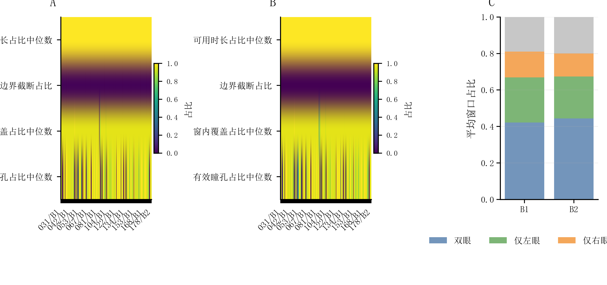
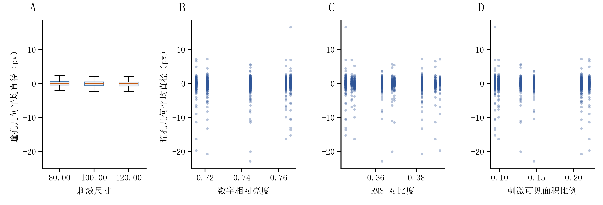
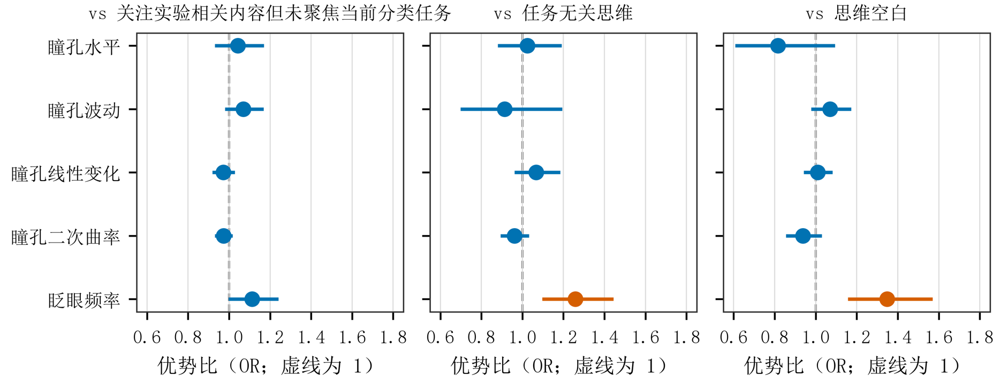
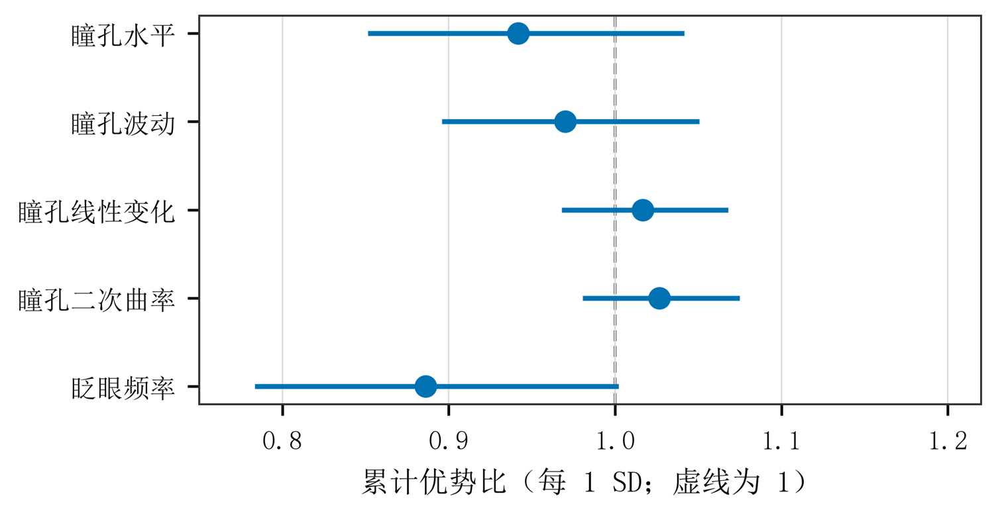
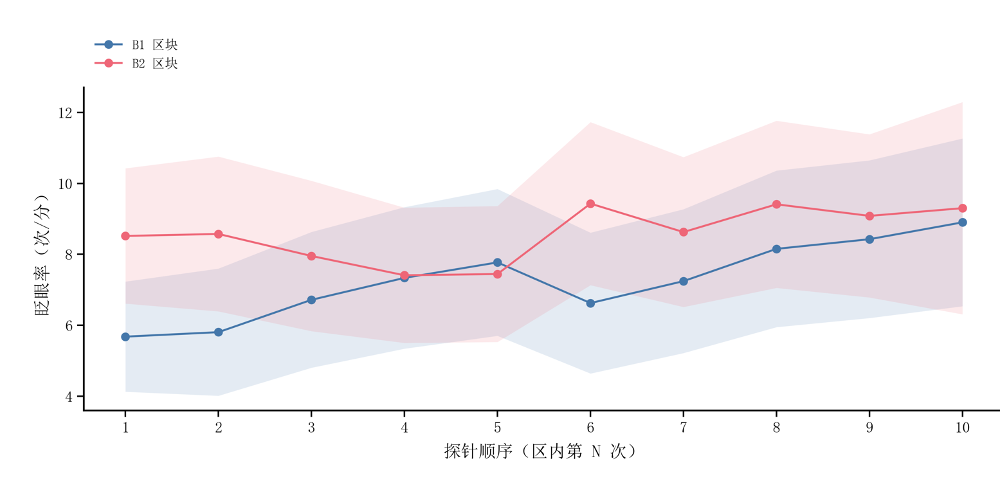
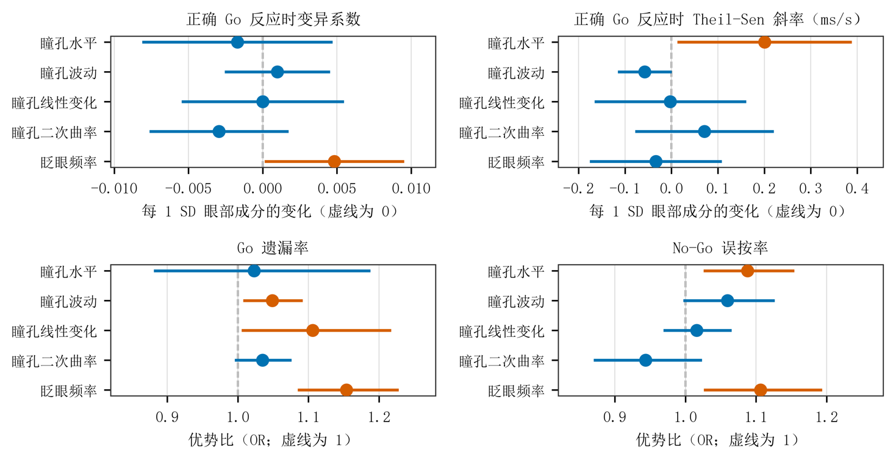

# 5.3 瞳孔、眨眼与注意相关状态

眼部结果以瞳孔面积比例的水平、波动、线性趋势、二次曲率及眨眼频率为主要指标。主要关联分析分别考察参与者平均水平，以及各探针相对个人平均的偏离。个人平均由全部可用场次计算，因此参与者内效应同时涵盖同一场次内部和不同场次之间的变化。

## 5.3.1 测量表示与时间支持

相对面积比例与几何直径的总体水平秩相关为 0.664，波动的秩相关为 0.660。正式分析前的测量比较显示，两种表示的线性与二次动态方向一致率分别约为 74.1% 和 76.3%。两种表示具有一定共同信息，同时在具体数值与方向上有所差异，后续结果按各自的测量定义呈现。

在近红外与可见光联合覆盖的 2160 个潜在窗口中，将动态最低时间跨度从 10 s 提高到 20 s 后，线性趋势可用率由 86.90% 降至 85.97%，二次曲率由 86.76% 降至 85.88%。正式主分析采用 20 s 要求。

图 19 瞳孔数据质量与覆盖

注：A、B 分别展示左眼和右眼在各实验场次及任务区块中的近红外瞳孔数据质量。热图包括可用时长占比中位数、边界完整占比、窗口覆盖占比中位数和有效瞳孔占比中位数，取值范围均为 0～1，数值越高表示相应数据的可用性或完整性越高。横轴为实验场次及其所属任务区块（B1、B2）。C 展示 B1 与 B2 中不同眼别可用状态的平均窗口占比，包括双眼可用、仅左眼可用、仅右眼可用及双眼均不可用；各状态占比之和为 1。

## 5.3.2 视觉条件、任务进程与瞳孔变化

为控制屏幕刺激引起的瞳孔光反射，按 9 类水果与 3 种尺寸组合的 27 种视觉条件计算数字相对亮度、RMS 对比度与刺激可见面积。试次模型同时纳入当前与前一试次的视觉属性以及任务时间、瞳孔有效帧比例、窗口覆盖与双眼帧比例等协变量。瞳孔对刺激尺寸、亮度与对比度的变化关系见图 20。

图 20 视觉刺激属性与瞳孔变化

注：A 为不同刺激大小与任务类型下试次前中心化瞳孔的中位数；B、C、D 分别为瞳孔与当前刺激数字相对亮度、均方根对比度及刺激可见面积的分箱散点。

未经校正的估计中，瞳孔波动和眨眼频率在第二个区块及第一个区块内部呈上升方向。任务进程共进行 15 项检验，分析族内校正后的最小 q 为 .057，各项均未达到 q < .05 的标准。

表 11 主要眼部任务进程估计

| 指标 | 对应变化 | 系数 | 95% 置信区间 |
| --- | --- | --- | --- |
| 瞳孔水平 | 第二区块与第一区块的进程斜率差 | 0.0107 | [0.0024, 0.0190] |
| 瞳孔波动 | 进程中心处第二区块相对第一区块 | 0.0029 | [0.0009, 0.0050] |
| 瞳孔波动 | 第一区块从首个至末个探针的线性变化 | 0.0035 | [0.0005, 0.0065] |
| 瞳孔波动 | 第二区块与第一区块的进程斜率差 | 0.0042 | [0.0004, 0.0081] |
| 眨眼频率 | 进程中心处第二区块相对第一区块 | 1.330 | [0.212, 2.449] |
| 眨眼频率 | 第一区块从首个至末个探针的线性变化 | 2.772 | [0.625, 4.918] |

注：瞳孔系数以面积比例为单位，眨眼以次/min 为单位。区块内进程编码为 −0.5 至 0.5，区块系数表示进程中心处的差异。表中展示未经多重比较校正的 95% 置信区间。所列六项及其余九项均未通过族内校正，完整 15 项估计、q 值与样本量见结果附表B。

瞳孔线性趋势和二次曲率的区块、进程及交互系数区间均包含零。这里分别考察窗口内部的瞳孔变化，以及这一变化指标随整个任务进程的变化，两个时间尺度按各自的模型结果解释。

## 5.3.3 注意内容的参与者内关联

在控制参与者平均水平、区块及探针进程后，眨眼频率相对个人平均升高，与报告任务无关思维和思维空白的优势增加相联系。对应优势比分别为 1.258，95% 置信区间 [1.096, 1.444]，q = .016，以及 1.348，[1.157, 1.570]，q = .004。关注实验但未聚焦分拣任务的系数同样为正，但区间包含零，q = .421。

图 21 注意内容与眼部变化的参与者内关联

四项瞳孔指标的 12 个参与者内类别对比区间均包含零，q 值为 .587—.955，本次测量与模型下的相应关联未达到统计显著性。眨眼结果按各类别相对于任务聚焦的对比分别呈现，类别之间的系数差异属于进一步的比较问题。

## 5.3.4 困倦—清醒报告

五项眼部指标与困倦—清醒等级的参与者内关联区间均包含零。眨眼频率的系数为 −0.121，95% 置信区间为 [−0.244, 0.002]，q = .539。眨眼的点估计呈负向，区间包含零，未达到统计显著性。

图 22 主观警觉与眼部变化的参与者内关联

注：图中点为累积优势比，横线为 95% 置信区间，虚线为无关联值 1；优势比大于 1 对应较高清醒等级。正文报告对数优势系数，图中数值为其指数变换。q 值在参与者内外分量共 10 项检验中校正。

注意内容与清醒等级分别采用对应模型评价。前者描述报告内容的类别差异，后者描述主观警觉的有序变化，两组结果从不同主观维度呈现眼部信息的关联。

图 23 眨眼候选事件率的任务进程

## 5.3.5 同期行为与参与者内、间差异

在参与者内部，眨眼频率增加与近期遗漏率升高相联系。对数优势系数为 0.143，95% 置信区间为 [0.081, 0.205]，优势比为 1.154 [1.085, 1.228]，q < .001，模型包含 60 人、110 场、2200 个探针。其余 19 项参与者内眼部—行为关系均未通过族内校正。瞳孔水平与误按率、眨眼频率与误按率的系数分别为 0.084 和 0.101，对应 q 为 .051 和 .070，均高于校正后的显著性标准。

图 24 眼部–行为参与者内部同步

参与者间关联分析中，眼部指标与注意内容、困倦—清醒报告的 20 项关系均未通过各自分析族校正。眼部—行为关系有两项通过校正。平均瞳孔二次曲率与反应时趋势呈负向关联，系数为 −0.1302，95% 置信区间 [−0.2038, −0.0567]，q = .010，涉及 61 人、107 场、1851 个探针。平均眨眼频率与误按率也呈负向关联，系数为 −0.259，优势比为 0.772 [0.658, 0.905]，q = .019，涉及 60 人、110 场、2200 个探针。

眨眼与误按的参与者内点估计为正，参与者间点估计为负，其中参与者内关联未通过校正。这两类结果分别对应同一人相对自身平均水平的变化，以及不同人的平均差异。全部眼部—行为估计与参与者间关联结果见附表B。
