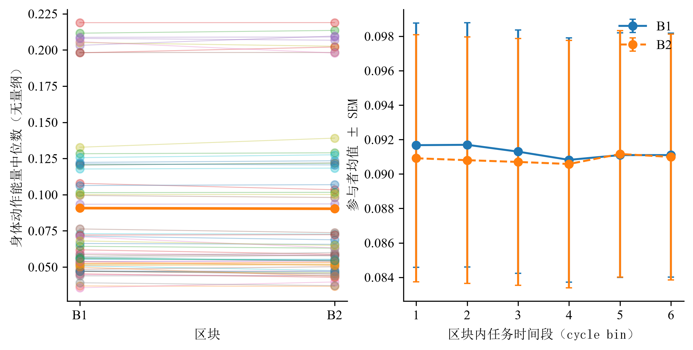

# 5.4 身体动作与注意相关状态

整体身体动作强度覆盖 61 名参与者、115 个场次和 2300 个探针前窗口。该指标以单位时间的整幅灰度画面变化表示，因而其统计关系同时受身体活动和视频成像条件影响。

## 5.4.1 任务进程

第一个区块中，每推进一个连续任务阶段，动作强度降低 0.000164 s⁻¹，95% 置信区间为 [−0.000298, −0.000029]。第二个区块相对第一个区块的阶段斜率差为 0.000167 s⁻¹，95% 置信区间为 [−0.000012, 0.000347]。前一估计显示第一个区块内的小幅下降；后一估计尚不足以确定两个区块的变化斜率不同。

**图 5-1 整体身体动作强度的区块配对与区块内变化。** 左图为参与者层区块配对，右图为六个连续任务阶段的参与者均值与标准误。均值图描述观测分布，线性进程的推断以正文系数及其置信区间为准。

## 5.4.2 即时主观状态

动作强度与三类非任务聚焦报告的系数区间均包含零；与困倦—清醒等级的关系也未检出明确偏离零的证据。

**表 5-9 身体动作强度与即时主观报告的关系**

| 结果变量或类别对比 | 标准化系数 | 95% 置信区间 |
|---|---:|---|
| 关注实验但未聚焦分拣任务，相对于任务聚焦 | 0.013 | [−0.211, 0.236] |
| 任务无关思维，相对于任务聚焦 | −0.392 | [−0.888, 0.103] |
| 思维空白，相对于任务聚焦 | 0.244 | [−0.318, 0.807] |
| 困倦—清醒等级，较高值表示更清醒 | 0.054 | [−0.118, 0.225] |

注：每项模型均包含 61 人、115 场和 2300 个探针。注意内容模型的系数为对数优势，清醒等级模型为有序关联系数；动作强度在入模前标准化。模型按参与者处理重复观测，未进行与眼部相同的分析族多重校正。

任务无关思维的点估计为负，思维空白为正，但区间较宽，不能由这些点估计建立可靠的状态划分，也不能将区间包含零解释为已证明无关系。

## 5.4.3 同期行为及姿态补充结果

动作强度与正确反应时中位数、变异系数、原始遗漏率、误按率和辨别力的关联区间均包含零，当前逐指标模型未检出明确的总体线性对应。该结果不排除更局部的动作事件或其他时间尺度上的关系。

姿态方向的补充分析中，横向方向与“关注实验但未聚焦分拣任务”相对任务聚焦的系数为 −0.119，95% 置信区间为 [−0.219, −0.019]；纵向方向与思维空白相对任务聚焦的系数为 −0.220，区间为 [−0.422, −0.018]。其余注意内容对比及全部清醒等级关系的区间均包含零。这些是不同方向指标的个别关联，未直接检验类别间系数差异，也不改变首轮预测中以整体动作强度作为主要表示的设定。
