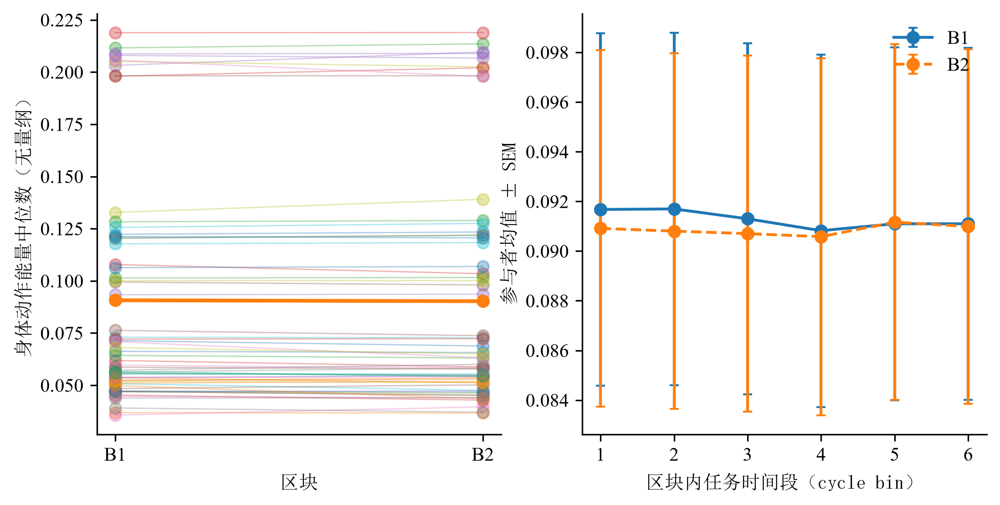

# 5.4 身体动作与注意相关状态

## 5.4.1 任务进程

第一个区块中，每推进一个连续任务阶段，动作强度降低 0.000164 s⁻¹，95% 置信区间为 [−0.000298, −0.000029]。第二个区块相对第一个区块的阶段斜率差为 0.000167 s⁻¹，95% 置信区间为 [−0.000012, 0.000347]。结果显示第一个区块内动作强度小幅下降，两个区块的斜率差区间包含零。 动作强度以相邻画面的归一化灰度差除以帧间隔计算，单位为 s⁻¹；阶段系数表示该指标随任务推进的变化。

图 25 整体身体动作强度的区块配对与区块内变化

注：左图为参与者层区块配对，右图为六个连续任务阶段的参与者均值与标准误。均值图描述观测分布，线性进程的推断以正文系数及其置信区间为准。

## 5.4.2 即时主观状态

动作强度与三类非任务聚焦报告的关联区间均包含零，其与困倦—清醒等级的关系也未达到统计显著性。各项估计及区间如下表所示。

表 12 身体动作强度与即时主观报告的关系

| 结果变量或类别对比 | 标准化系数 | 95% 置信区间 |
| --- | --- | --- |
| 关注实验但未聚焦分拣任务，相对于任务聚焦 | 0.013 | [−0.211, 0.236] |
| 任务无关思维，相对于任务聚焦 | −0.392 | [−0.888, 0.103] |
| 思维空白，相对于任务聚焦 | 0.244 | [−0.318, 0.807] |
| 困倦—清醒等级，较高值表示更清醒 | 0.054 | [−0.118, 0.225] |

注：每项模型均包含 61 人、115 场和 2300 个探针。注意内容模型的系数为对数优势，清醒等级模型为有序关联系数。动作强度在入模前标准化。模型按参与者处理重复观测，区间为单项估计结果。眼部分析另采用分析族多重校正。

任务无关思维的点估计为负，思维空白的点估计为正，两者区间均较宽并包含零。当前结果描述了各类别的估计方向，相应关联的精度仍较有限。

## 5.4.3 同期行为及姿态补充结果

动作强度与正确反应时中位数、变异系数、原始遗漏率、误按率和辨别力的关联区间均包含零。本组逐指标模型评价的是当前时间尺度下的总体线性关系，局部动作事件可通过更细的时间分析进一步考察。

姿态方向的补充分析中，横向方向与关注实验但未聚焦分拣任务相对任务聚焦的系数为 −0.119，95% 置信区间为 [−0.219, −0.019]。纵向方向与思维空白相对任务聚焦的系数为 −0.220，区间为 [−0.422, −0.018]。其余注意内容对比及全部清醒等级关系的区间均包含零。这些补充结果分别描述不同姿态方向与各类报告的关系，主要预测分析仍采用预先确定的整体动作强度。
