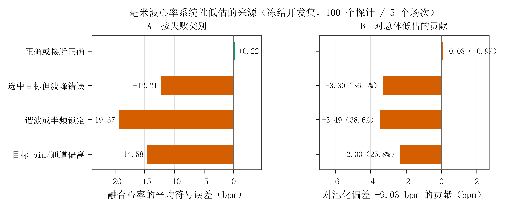

# 5.5 毫米波心肺估计的测量结果

## 5.5.1 有效覆盖与估计分布

毫米波测量评估所用数据中，109 个场次的 2180 个探针窗口同时形成有限的心率和呼吸率估计，占全部 2320 个探针的 93.97%。其余 40 个探针对应来源不可用的 2 场，100 个探针对应来源损坏的 5 场，均保留为缺失。

**表 5-10 毫米波心肺估计及内部质量指标的描述统计**

| 指标 | 中位数 | 第 5—95 百分位 |
|---|---:|---|
| 毫米波估计心率（次/min） | 75.2 | 57.7—93.7 |
| 毫米波估计呼吸率（次/min） | 20.09 | 8.08—24.28 |
| 窗口时间戳覆盖率 | 0.990 | 0.988—0.995 |
| 心率估计平均置信度 | 0.361 | 0.007—0.718 |
| 相位稳定性 | 0.954 | 0.927—0.971 |
| 雷达内部动作代理 | 0.0268 | 0.0131—0.0602 |

注：描述分母为 2180 个可用窗口。置信度、相位稳定性及动作代理均为设备估计器内部指标，其数值不代表经独立参考验证的测量准确性。时间戳覆盖率只描述记录覆盖。

探针记录的窗口终点与探针时间在 2320 条测量记录中一致，未发现探针身份键重复或集合缺失。这项端点检查本身不能证明上游每个估计值所使用的原始时间范围；后续独立完成的生成合同、探针前时间边界和来源追溯核验，才支持心肺估计进入正式预测。两类证据不能互相替代。

## 5.5.2 动作代理与估计质量

雷达内部动作代理与心率估计平均置信度的秩相关为 −.142，与时间戳覆盖率的秩相关为 −.032，与相对个人中位数的绝对心率偏离的秩相关为 .013，均基于 2180 个窗口。较大代理值与较低估计置信度呈弱关联，而与后两项指标的秩相关接近零。

这些相关按窗口描述，未将动作代理视为独立验证的身体动作测量。接近零的相关也不能证明动作不会污染估计，或不会影响真实心肺活动。

## 5.5.3 独立验证与补充分析范围

当前正式队列没有同步心电图参考。已有 5 个带心电或呼吸参考的场次属于估计器开发资料，不能承担与开发相独立的验证。因而本节数值仅作为设备推导估计及其覆盖、内部质量的描述，不报告其已达到生理准确性要求。

心肺估计与任务进程、四类注意内容及清醒等级的正式解释性结果尚未形成。心肺二分类预测已随冻结注册表 v3 **由补充分析转为正式纳入**（见 5.6.4 与 5.7）；该预测使用 110 场、2198 个探针，与本节测量评估的 109 场、2180 个探针属于不同生成批次。**资格变更只解除了合同与来源阻塞，不是生理效度验证**：两组覆盖不能合并，也不以该预测的存在替代未闭合的独立参考证据。

## 5.5.4 系统性低估的来源：冻结开发集的机制归因

在与独立参考配对的**冻结开发集**（5 个场次、100 个探针窗口，100/100 具有合格心电参考）上，毫米波融合心率相对心电参考约低估 9 次/min。为判断这一低估的来源，对该开发集执行了一次只读的机制归因：先复现冻结对照，再按既有的失败类别分组，分解各类别对总体偏差的贡献。

**图 5.5-3 毫米波心率系统性低估的失败类别归因（冻结开发集，100 个探针 / 5 个场次）。** 左图为各类别融合心率的平均符号误差；右图为各类别对总体低估的贡献（类别平均符号误差 × 类别占比）。橙色为偏差较大的类别，绿色为接近无偏的类别。

图 5.5-3 显示，低估**不是估计器在全域上的恒定偏置**，而是集中在可识别的失败模式上：判断正确或接近正确的探针平均偏差仅 **+0.22 次/min**（平均绝对误差 1.54），而总体 −9 次/min 由三类失败共同承担——选中目标但波峰错误（−3.30，占 36.5%）、谐波或半频锁定（−3.49，占 38.6%）、目标通道偏离（−2.33，占 25.8%）。

三项次级观察与之一致：其一，谱估计一路偏得最重（−13.35 次/min），时域一路为 −6.74；其二，融合在 100 个探针中有 57 个把结果拉到低于时域一路，净叠加约 +1.46 次/min，但融合从未同时差于时域与谱两路；其三，**现有的内部质量字段不能解释这一低估**——可用窗口比例在该开发集的 100 个探针中恒为 1.0、无任何方差，相位稳定性与动作代理在各场次间的关联方向彼此矛盾。

**写作边界**：上述归因说明**不宜采用单一的全局偏移校正**来修正毫米波心率，因为低估随判断正确与否而系统性变化；但它**不构成**毫米波心率已达到生理准确性的证据。该 5 场 / 100 探针开发集已被估计器开发反复使用，**不能承担与开发相独立的验证**。心率与呼吸率仍只作为支持性估计（HR/BR `HOLD / SUPPORTING_ONLY`），心率变异性仍不纳入。

<!-- 内部跟进：生成批次、上游时间来源、有效场次差异及全部参考测量审计见完整结果第5项；正式预测及设备资格已取得，但测量描述不升级为正式心理效应或生理效度证据。 -->
