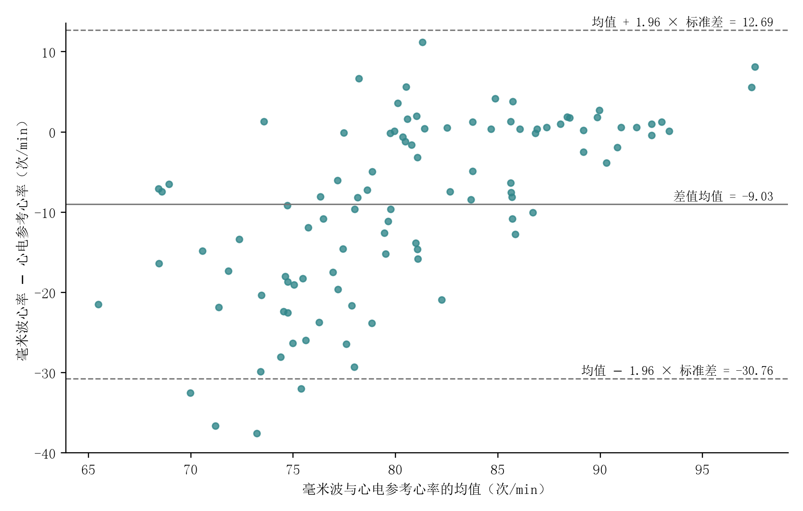

# 5.5 毫米波心肺记录与参考对照

## 5.5.1 记录覆盖与心肺分布

毫米波在 110 个实验场次中获得 2200 个有效心肺窗口，覆盖全部 2320 个思维探针的 94.83%。心率均值为 75.93 次/min，标准差为 10.68 次/min；呼吸率均值为 18.53 次/min，标准差为 4.60 次/min。与思维探针对齐的连续记录，将心肺活动纳入了多模态注意状态分析。

表 13 心率与呼吸率的描述统计

| 指标 | 窗口数 | 均值 | 标准差 | 中位数 | 四分位范围 |
| --- | --- | --- | --- | --- | --- |
| 心率（次/min） | 2200 | 75.93 | 10.68 | 75.80 | [69.23, 82.31] |
| 呼吸率（次/min） | 2200 | 18.53 | 4.60 | 20.09 | [16.18, 22.16] |

注：每项指标均包含 2200 个探针前 30 s 的有效窗口；方括号为第 25 和第 75 百分位数。

## 5.5.2 同步心电参考对照

算法开发阶段采用同一参与者的 5 场同步心电记录，形成 100 个配对窗口。毫米波融合心率的平均绝对误差为 10.46 次/min，平均差值为 −9.03 次/min。进一步将误差分解至谱峰识别、谐波区分和通道选择，明确了影响估计的主要环节；各类误差及估计方法的比较见附录 E。

图 26 毫米波心率与心电参考的差值分布

注：每个点表示一个配对窗口。横轴为两种心率的均值，纵轴为毫米波心率减心电参考心率。实线表示差值均值 −9.03 次/min，虚线表示均值上下各 1.96 个标准差，范围为 −30.76 至 12.69 次/min。
