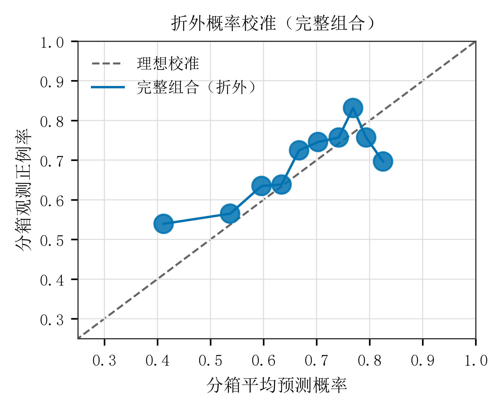
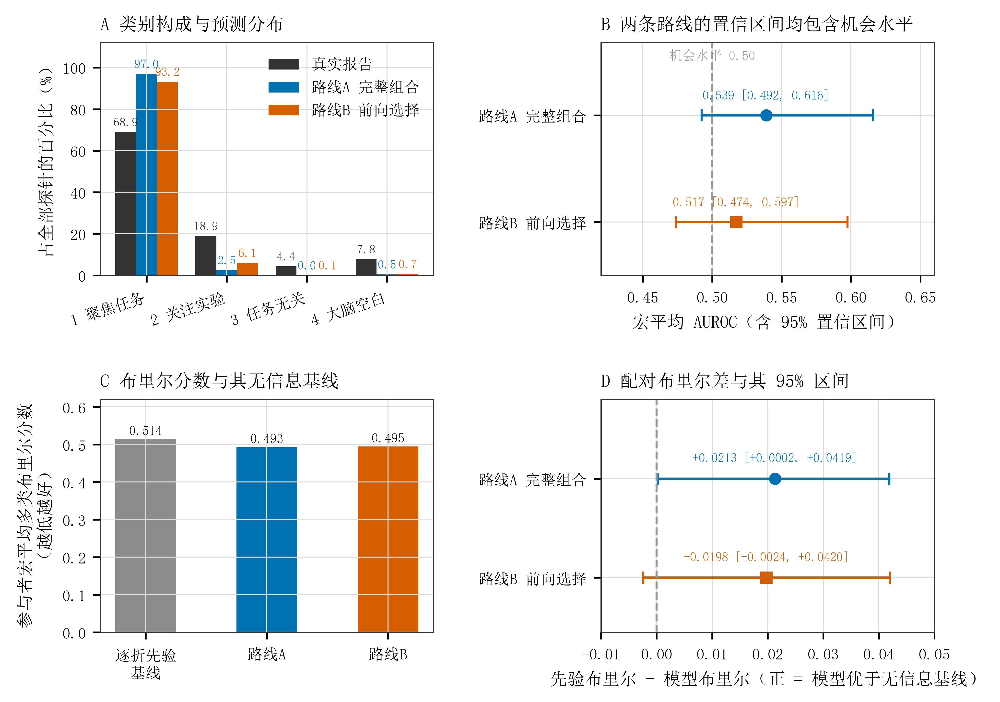
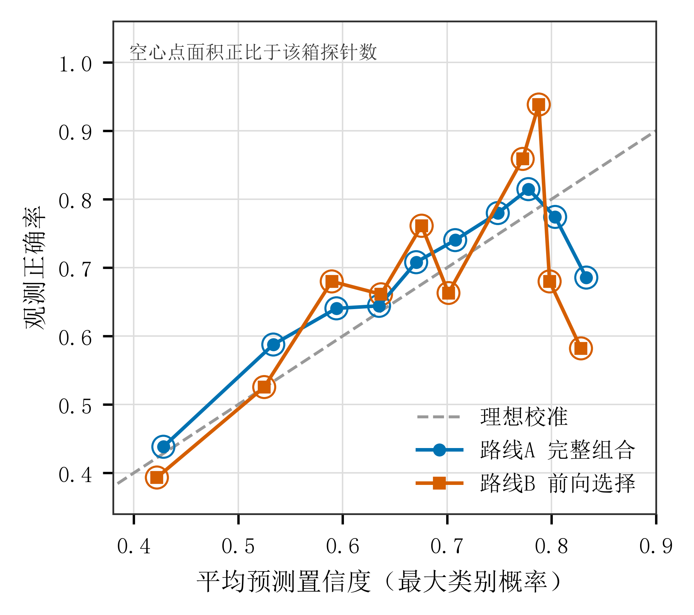

# 5.6 对新参与者注意内容报告的预测

## 5.6.1 单类信息与仅传感信息联合模型

留一参与者验证得到的预测均来自训练中未出现的参与者。二分类目标为任务聚焦相对于其余三类报告，主要指标为参与者宏平均对数损失，数值越低越好；曲线下面积用于补充描述排序区分。

**表 5-11 单类信息及仅传感信息联合模型的折外表现**

| 输入信息 | 对数损失及 95% 置信区间 | 受试者工作特征曲线下面积及 95% 置信区间 | 布里尔分数 | 人/场/探针 | 曲线下面积可估参与者数 |
|---|---|---|---:|---|---:|
| 行为 | 0.6237 [0.5768, 0.6733] | 0.7060 [0.6656, 0.7447] | 0.2160 | 61/116/2316 | 49 |
| 眼部 | 0.6456 [0.5983, 0.6925] | 0.5683 [0.5080, 0.6257] | 0.2253 | 60/103/1775 | 48 |
| 动作 | 0.6465 [0.6015, 0.6950] | 0.4569 [0.4008, 0.5079] | 0.2267 | 61/115/2296 | 49 |
| 仅传感信息联合 | 0.6467 [0.5998, 0.6914] | 0.5560 [0.5003, 0.6081] | 0.2256 | 60/103/1779 | 48 |

注：主要损失、布里尔分数和可估计参与者的曲线下面积均按参与者等权汇总。每行有 12 名参与者仅包含一种二分类标签，不能估计个人曲线下面积，但仍进入损失评价。各行使用不同分析集合，原始分数不能直接用于优劣检验。区间基于固定折外预测的参与者簇重抽样，未包含重新训练全过程的不确定性。

行为模型的曲线下面积区间高于 0.5。眼部与仅传感信息联合模型的区间下限也高于 0.5，但点估计较接近 0.5，其中传感联合下限为 0.5003。两者呈现有限的排序区分证据，动作模型的区间则包含 0.5。仅传感联合模型具有可评价的独立输出，但当前区分幅度不能直接解释为已达到实际部署要求。

新增的无输入参照使用各外层训练折的正例率作为常数概率，并按参与者等权评价。行为模型的损失为 0.6237，低于该参照的 0.6438，点估计改善约 0.0201；眼部、动作和仅传感联合模型的参照分别为 0.6446、0.6447 和 0.6442，对应模型点估计略高。该比较尚未提供相对无输入参照的成对改善区间，因此仅描述点估计，不据此宣布差异显著。原先按全部探针合并计算的描述性基率不用于此比较。

**图 5-2 各类信息的折外预测表现。** 左图比较各模型与对应训练折常数概率参照的对数损失；右图为参与者宏平均曲线下面积及 95% 置信区间，虚线为 0.5。各行的分析样本不同（心肺一行是心肺单独模型，使用其自身可用的 58 人 / 2,198 个探针，数值见 5.6.4），不能横向作优劣检验；无输入参照的改善标注为点估计。

## 5.6.2 场次内区分

行为模型在 83 个同时包含两类报告的场次中，曲线下面积均值为 0.6919，中位数为 0.7262。眼部模型在 72 个可估计场次中的均值为 0.5697，中位数为 0.5656；仅传感联合模型在 72 场中的均值为 0.5631，中位数为 0.5590。

**表 5-12 同一场次内的报告区分**

| 输入信息 | 可估场次数 | 单一类别场次数 | 场次曲线下面积均值 | 中位数 |
|---|---:|---:|---:|---:|
| 行为 | 83 | 33 | 0.6919 | 0.7262 |
| 眼部 | 72 | 31 | 0.5697 | 0.5656 |
| 动作 | 82 | 33 | 0.4914 | 0.5000 |
| 仅传感信息联合 | 72 | 31 | 0.5631 | 0.5590 |

注：仅对同时含任务聚焦与非任务聚焦标签的场次计算。末列是中位数，不是置信区间；不同输入行仍不保证同样本。

这些结果描述同一实验场次内离散报告的排序。每场只有有限探针，单一类别场次也无法估计该指标，因而不将此结果解释为已实现连续注意轨迹追踪。

## 5.6.3 概率校准

行为模型的校准斜率为 0.645，95% 置信区间为 [0.157, 1.234]，包含理想斜率 1。眼部模型斜率为 −0.034，区间为 [−2.180, 0.439]；仅传感联合模型为 −0.214，区间为 [−2.336, 0.373]。后二者估计不稳定，且斜率区间不包含理想值 1。

校准回归按全部探针合并拟合，主要排序指标则先在参与者内计算再等权汇总，二者不是同一统计尺度。因此，有限的参与者内排序能力可以与较差的合并概率校准并存。当前结果尚不能把传感模型输出直接解释为已校准的任务聚焦概率，也不能由负的合并校准点估计推定个人内部的概率关系反向。

完整组合的校准斜率为 0.481，95% 置信区间 [0.102, 1.041]；截距为 0.453，[−0.007, 0.832]。斜率区间包含 1，截距区间包含 0，但范围较宽，不能据此证明概率已校准。参与者等权的平均预测概率与实际正例率之差为 −0.00007，区间 [−0.070, 0.066]；平均差接近零也不保证整个概率范围内校准良好。

**图 5-3 完整组合的折外概率校准。** 横轴为分箱平均预测概率，纵轴为观测任务聚焦比例，点面积表示探针数，虚线为理想校准线。分箱按探针汇总，不用于模型或参数选择。

## 5.6.4 心肺信息的正式纳入

毫米波生成链的合同与来源追溯已闭环（上游仓库主分支合并 M1 修复，生产执行提交与四个源文件哈希已核验、逐探针新旧审计通过），据此心肺的时间合法性由"失败关闭"改为"已验证探针前"，**心肺从补充分析转为正式纳入**：两个心肺特征进入冻结注册表，并获得设备组合资格。**这只解除了合同与来源的阻塞，不是生理效度验证**——心率与呼吸率在生产端仍为支持性使用，该限制随本节所有结果一并成立。

在 58 名参与者、2,198 个探针上：

| 模型 | 参与者宏平均对数损失 |
|---|---:|
| 行为参照 | 0.618974 |
| 行为 + 心肺（心率与呼吸率） | 0.618478 |
| 行为 + 毫米波心率 | 0.616796 |
| 行为 + 毫米波呼吸率 | 0.620634 |
| **心肺单独** | **0.634696** |

**成对增量（行为参照为基线）**

| 对照 | 增量 | 95% 置信区间 | 判定 |
|---|---:|---|---|
| 行为 → 行为 + 心肺 | +0.000496 | [−0.005756, +0.006920] | 包含 0，**无增量** |
| 行为 → 行为 + 毫米波心率 | +0.002178 | [−0.003607, +0.008360] | 包含 0 |
| 行为 → 行为 + 毫米波呼吸率 | −0.001660 | [−0.002844, −0.000624] | **排除 0 且为负** |

**全部正式特征为基线时的条件价值**

| 对照 | 增量 | 95% 置信区间 | 判定 |
|---|---:|---|---|
| 完整组合删去心肺（两条） | −0.001762 | [−0.008493, +0.004052] | 包含 0 |
| 完整组合删去毫米波心率 | −0.000109 | [−0.006755, +0.005715] | 包含 0 |
| 完整组合删去毫米波呼吸率 | −0.001662 | [−0.002972, −0.000525] | **排除 0 且为负** |

**结论**：在已知行为信息之后，加入心肺估计**没有可检出的预测增量**；单独加入毫米波呼吸率反而使损失略微升高（区间排除 0）。这一结果与正式纳入之前的补充比较一致（补充通道的行为→行为+心肺增量为 +0.00050，正式通道为 +0.000496），说明**纳入资格的改变没有改变结论**。

新增的设备组合结果：M2（仅毫米波）0.618478、M6（毫米波+可见光）0.621683、M7（三设备）0.620703，其中 M7 与完整组合逐位相同。心肺的样本（58 人 / 2,198 个探针）与行为、眼部、动作各行**不同**，因此不与它们直接排名；上述所有增量都是**同一分析集合内**的配对比较，可以直接解释。

心肺为**支持性指标**：其生理效度未经验证（上游对心率与呼吸率的判定为支持性使用、心率变异性仍被阻塞），因此本节结果支持"在现有证据下心肺不增加预测信息"，**不等于**毫米波技术无效。

## 5.6.5 行为窗口长度的补充结果

保持五项行为表示及训练评价设置一致，10 s、20 s 和 30 s 窗口的损失见表 5-13。三个区间相互重叠，但窗口变化同时改变有效探针集合，当前没有同样本的窗口差异检验。

**表 5-13 行为模型的窗口长度敏感性**

| 探针前窗口 | 人/场/探针 | 对数损失 | 95% 置信区间 |
|---|---|---:|---|
| 10 s | 61/116/1547 | 0.615656 | [0.565352, 0.666017] |
| 20 s | 61/116/2306 | 0.631840 | [0.584770, 0.679407] |
| 30 s | 61/116/2316 | 0.623733 | [0.576769, 0.673311] |

注：10 s 和 20 s 集合均为 30 s 集合的子集；30 s 使用原正式结果，未重新训练。

10 s 原始窗口中，误按率仅有 1740 个有限值，因为较短窗口经常没有抑制反应机会；五项行为同时有效后仅余 1547 个探针。因此，10 s 的较低损失不能解释为较短窗口更优。区间重叠也不足以证明三个窗口等效或主结论完全不依赖窗口，30 s 仍作为主要窗口。眼部和动作没有对应的 10 s、20 s 冻结特征，本项未评价其窗口敏感性。

## 5.6.6 四分类覆盖与扩展范围

在完整组合的 60 人、1775 个探针中，四类注意内容分别为 1223、336、78 和 138 次。只有 8 人同时出现四类报告，11 人仅有单一类别；任务无关思维来自 26 人。此分布限制少数类别的估计精度，但不意味着多类对数损失在数学上无法计算。

四分类预测方案已按预注册执行完毕，**两条公平对照路线都已报告**。两条路线均通过冻结合同的逐折机械验证（合计 20 个运行、2,656 个外层折全部成功、0 个"外层训练折缺类"折、85,842 行预测；route A 的 19 个分析集合与冻结二分类线 `input_sha256` 逐字节相同）。

| 路线 | 模型 | 参与者宏平均多类对数损失 | 逐折类别先验基线 | 宏平均 AUROC | 平衡准确率 | 宏平均 F1 |
|---|---|---:|---:|---:|---:|---:|
| A | 完整组合（11 个注册特征） | **0.946813** | 0.976803 | 0.5389 | 0.2568 | 0.2032 |
| B | 训练折内前向逐步选择 | **0.953229** | 0.976803 | 0.5174 | 0.2625 | 0.2395 |

两条路线都低于各自的逐折类别先验基线，但**都没有类别判别力**：四类的机会水平是平衡准确率 0.25、宏平均 AUROC 0.50，而两者的宏平均 AUROC 都在 0.52 附近，且分别把 97.0% 与 93.2% 的探针预测为类别 1（真实比例 68.9%），类别 3 几乎从不被预测。因此**只报告"低于基线"会误导**——正确的表述是"概率上略优于常数先验，但不具备类别区分能力"。

路线 B 并不优于路线 A（0.953229 对 0.946813，略差），即**让训练折专门为四分类挑选特征并不能找回信号**；这排除了"四分类无信号是因为沿用了二分类式特征集"这一解释。路线 B 的选择结果本身与路线 A 的结论一致：60 个外层折中 `behavior.nogo_commission.raw.v1` 在 **60/60** 折被选中、`behavior.go_omission.raw.v1` 在 56/60 折，动作特征 22/60，眼部特征 2–7/60；**没有任何一折终止于空集**。

**去掉整个行为模态使损失劣于无信息基线**（0.984118 对 0.976803），单独去掉 No-Go 误按率为全表最差（0.987287）——与二分类线"行为是唯一真正携带信息的来源"同向，且在四分类口径下更强。

**图 5-4 四分类的类别分布、判别力与布里尔分数。** A 为真实报告与两条路线的预测类别构成（四类为无序类别，该面板仅说明模型在预测哪一类）；B 为宏平均受试者工作特征曲线下面积（area under the receiver operating characteristic curve [AUROC]）及 95% 置信区间（confidence interval [CI]），虚线为机会水平 0.50；C 为参与者宏平均多类布里尔分数与其逐折类别先验基线；D 为配对布里尔差（先验减模型），正值表示模型优于无信息基线。

四分类的补充概率诊断已按预注册 §4.2 补做完成。多类布里尔分数（Brier score，逐探针四类平方差之和，取值 0 至 2，越低越好）上，路线 A 为 0.493 [0.425, 0.560]，路线 B 为 0.495 [0.425, 0.562]，对应的逐折类别先验基线为 0.514；布里尔技能分数（Brier skill score [BSS]）分别为 0.041 与 0.038。配对差（先验减模型）路线 A 为 +0.0213 [+0.0002, +0.0419]，**区间排除 0**；路线 B 为 +0.0198 [−0.0024, +0.0420]，区间包含 0。

**这与"低于对数损失基线"是两类不同的证据**。布里尔分数只对概率的平方误差敏感，不涉及真实类别的对数概率；它支持"两条路线的概率整体上优于常数先验"这一较弱的结论，但**不提供任何类别区分能力的证据**——两条路线的宏平均 AUROC 区间（0.539 [0.492, 0.616] 与 0.517 [0.474, 0.597]）都包含机会水平 0.50。

**图 5-5 顶端标签概率的可靠性。** 横轴为分箱平均置信度（最大类别概率），纵轴为观测正确率，虚线为理想校准，空心点面积正比于该箱探针数。

顶端标签口径下，两条路线的平均置信度（0.673 与 0.674）都高于实际正确率（0.656 与 0.652），校准总体偏差为 +0.0125 [−0.0539, +0.0754] 与 +0.0134 [−0.0511, +0.0742]，两个区间均包含 0；期望校准误差（expected calibration error [ECE]）为 0.044 与 0.087。最高置信度分箱明显过度自信：路线 A 在该箱的平均置信度为 0.833 而观测正确率仅 0.685，路线 B 为 0.828 对 0.582。**校准斜率不可解读**：按概率诊断层的可解读性守卫（`分析设计/1.16.22` §4.2），只有判别力区间排除 0.5 时斜率才可解读，四分类的 44 个诊断行中仅 1 行满足该条件，两条公平对照路线均不满足；其斜率点估计与区间虽保留在产物中，**不得**读作"过度自信"或"概率反向"的证据。多类校准使用顶端标签估计量，属预注册 §4.2 指标范围之内的**事后操作化**（登记于 `分析设计/1.16.27`），统一适用于全部行，不参与任何模型或参数选择。

参与者级 AUROC 不报告：有参与者在外层折内只出现单一类别。类别 3 仅 78 个探针，其每类指标抽样波动大，**不对其细小差异作实质解释**。四类为**无序类别**，不得写成"四类注意识别"或"注意水平预测"。

本章其余预测结论仍限于任务聚焦二分类；解释性多项回归的类别关联不能替代四分类预测表现。

**头动协变量敏感性**（已完成头动一半）在同一有效集合的 **1,779 个探针、60 名参与者**上比较两个模型：

| 模型 | 预测变量数 | 参与者宏平均对数损失 | 95% 置信区间 |
|---|---:|---:|---|
| 仅注册眼部变量 | 5 | 0.645425 | [0.597980, 0.692285] |
| 加入头动协变量 | 7 | 0.643318 | [0.594897, 0.690173] |

配对增量为 **+0.002107**，95% 置信区间 **[−0.000849, +0.005116]**，**包含 0**，即眼部首轮结论**对头动调整稳健**。两个模型跑在逐行相同的探针、参与者与折上：限制到眼部特征有限已自动蕴含两个协变量存在，故未损失任何一行，本项**不存在样本构成混杂**。**尺度**代理（虹膜像素、面尺等）在冻结输出中不存在，本项**不声称**覆盖尺度敏感性，也未用头动结果代答。头动臂是被协变量调整后的敏感性臂，不是科学信息类别模型，不得据此陈述动作信息具有贡献。
