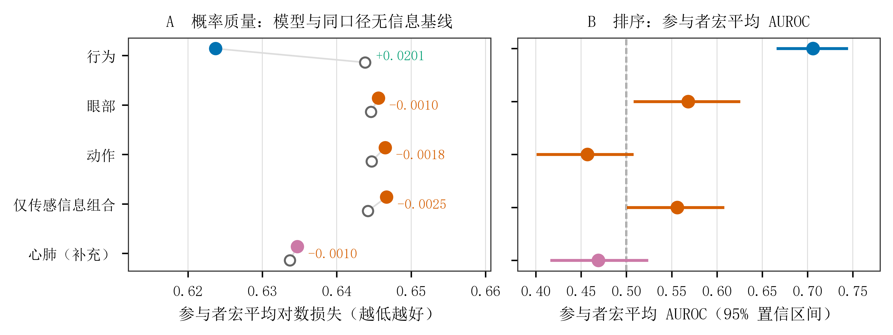

# 5.6 各科学信息类别对新参与者 Q1 的预测能力

本章评价各类科学信息对**新参与者**即时注意内容（Q1）二分类的折外预测能力。预测目标为
"聚焦当前分类任务"相对其余三类注意内容；评价单位为思维探针，聚合方式为参与者内探针等权、
参与者间等权；外层验证为参与者互斥的留一参与者交叉验证（leave-one-out by participant
[LOSO]），参与者内层为按参与者分组的 5 折，预处理只在训练折内拟合，个体校准恒为零。

主指标为参与者宏平均对数损失（participant-macro log loss）。AUROC（area under the receiver
operating characteristic curve，受试者工作特征曲线下面积）、Brier 分数与校准诊断作为补充
描述性指标，**不参与模型或正则化参数选择**。

## 5.6.1 单类科学信息的预测表现

| 输入信息 | 参与者宏平均对数损失 | 95% 置信区间 | AUROC | 95% 置信区间 | Brier | 参与者数 | 场次数 | 探针数 |
|---|---:|---|---:|---|---:|---:|---:|---:|
| 行为 | 0.6237 | [0.5768, 0.6733] | 0.7060 | [0.6656, 0.7447] | 0.2160 | 61 | 116 | 2,316 |
| 眼部 | 0.6456 | [0.5983, 0.6925] | 0.5683 | [0.5080, 0.6257] | 0.2253 | 60 | 103 | 1,775 |
| 动作 | 0.6465 | [0.6015, 0.6950] | 0.4569 | [0.4008, 0.5079] | 0.2267 | 61 | 115 | 2,296 |
| 心肺ᵃ | 0.6347 | [0.5843, 0.6853] | 0.4691 | [0.4159, 0.5240] | 0.2210 | 58 | 110 | 2,198 |
| 仅传感信息组合 | 0.6467 | [0.5998, 0.6914] | 0.5560 | [0.5003, 0.6081] | 0.2256 | 60 | 103 | 1,779 |

表注：ᵃ 心肺行来自**补充比较**，其归属、模型与样本与其余各行不同，见本节 5.6.3。各行按该类信息
自身实际可用的参与者、场次与探针报告分母，因此**分母不同的行不得直接比较优劣**。输出中的基率对数
损失属于**描述性**参照（合并探针口径），尚不能替代按训练折估计、在相同测试探针上评价的无输入常数
概率模型。主表对数损失使用全部列示参与者；AUROC 仅纳入具有两类标签者，行为与动作各为 49 人、
眼部与仅传感组合各为 48 人。

**无信息基线必须与主指标同口径。** 主指标是参与者等权宏平均，因此基线取同一口径的参与者等权
常数预测器（逐外层折使用训练侧正例率）：行为行 0.6438，眼部与完整行 0.6446，动作行 0.6447，仅
传感信息组合行 0.6442。运行产物中的 `descriptive_base_rate_log_loss`（0.6188–0.6215）是**合并
探针**口径的基率，仅作量级参照，**不得**与主指标直接比较。

| 输入信息 | 可估场次数 | 不可估单类场次数 | 场次内 AUROC 均值 | 场次内 AUROC 中位数 |
|---|---:|---:|---:|---:|
| 行为 | 83 | 33 | 0.6919 | 0.7262 |
| 眼部 | 72 | 31 | 0.5697 | 0.5656 |
| 动作 | 82 | 33 | 0.4914 | 0.5000 |
| 心肺ᵃ | 80 | 30 | 0.4615 | 0.4477 |
| 仅传感信息组合 | 72 | 31 | 0.5631 | 0.5590 |

表注：场次内 AUROC 表示同一场次内不同探针之间的 Q1 二分类区分能力，不解释为连续状态追踪。
不可估单类场次指该场次内 Q1 只有一个类别。

## 5.6.2 排序区分与概率评价

行为模型的参与者宏平均 AUROC 为 0.7060，95% 置信区间为 [0.6656, 0.7447]。眼部模型为 0.5683 [0.5080, 0.6257]，仅传感信息组合为 0.5560 [0.5003, 0.6081]，后二者区间下限也高于 0.5，显示有限的排序区分证据，其中传感组合下限非常接近 0.5。因此不能把行为写成唯一具有区分证据的信息来源。动作模型为 0.4569 [0.4008, 0.5079]，区间包含 0.5；点估计低于 0.5 不足以支持反向预测能力，也不直接表示动作与状态在参与者间的关联方向。

上述模型的分析样本不同，这些原始分数不能代替共同样本上的直接比较。眼部及传感组合的排序区分证据，也不意味着概率已足以支持独立部署。

在对数损失上，**没有任何一个传感类别优于其对应的无信息基线**：眼部 0.6456、动作 0.6465、仅传感
信息组合 0.6467，均略高于同口径基线 0.6442–0.6447（增益 −0.0010 至 −0.0024，相对 −0.2% 至
−0.4%）。**行为类模型则确实优于基线**：行为参照 0.6237 对基线 0.6438，增益 +0.0201（相对
+3.1%）；完整组合 0.6180 对基线 0.6446，增益 +0.0266（相对 +4.1%）；仅含 RGB 的 M3 亦为
+0.0175（相对 +2.7%）。因此**概率质量与排序给出不同图景**：在概率质量（对数损失）上只有行为信息
超出"始终预测多数类"，在排序（AUROC）上眼部与仅传感组合存在有限证据。

**动作信息的方向值得单独说明**：其 AUROC 为 0.4569，点估计低于 0.5；但区间包含 0.5，因此只作为
方向性观察记录，不解释为反向预测能力，也不据此推断动作与状态在参与者间的关联方向。

校准方面，行为模型的校准斜率为 0.645，95% 置信区间为 [0.157, 1.234]，区间包含理想斜率 1；眼部
和仅传感组合的斜率分别约为 −0.034 和 −0.214，区间较宽。校准回归按探针合并，而主 AUROC 按可估
参与者等权汇总，两者回答的统计问题不同；**不据校准点估计推断个人内概率反向**。当前输出尚不足以
建立稳定的概率校准结论。

图 5.6-1 汇总本节两个评价口径：左图为各类信息与各自同口径无信息基线的对数损失对照，右图为
参与者宏平均 AUROC 及其 95% 置信区间。

**图 5.6-1 各类科学信息对新参与者 Q1 二分类的折外预测表现。** 左图（A）为参与者宏平均对数
损失：实心点表示模型，空心点表示该行对应的**同口径无信息基线**（逐外层折使用训练侧正例率的参与者
等权常数预测器），两点之间的细线连接同一行的模型与基线，标注为增益（正值表示优于基线）。右图
（B）为参与者宏平均 AUROC 及 95% 置信区间，虚线为 0.5 无区分参考线。误差线为参与者整簇百分位
自助区间（1,000 次，seed 20260830，95%，自助内不重训）。ᵃ 心肺行来自**补充比较**，其归属、模型与
样本与其余各行不同，**分母不同的行不得直接比较优劣**。

## 5.6.3 心肺信息的补充比较及其解释边界

心肺（毫米波估计心率与估计呼吸率）在当前代码线的冻结特征登记表中**没有取得正式预测资格**，
因此表中的心肺行单列为补充结果。为了让报告能够回答"心肺信息能预测多少"，本次追加了一个**补充比较**
（下表以 ᵃ 标记），它与正式比较的关系必须写明：

1. **它是补充结果，不属于冻结的正式主比较。** 该比较在主结果产生之后才声明，声明本身已记录在
   运行 manifest 中（`preregistration = post_hoc_declared_after_primary_results_observed`）。
2. **它不声明任何正式预测资格**，也不声明设备组合资格。运行记录明确写下
   `prediction_eligibility_claimed = false`。
3. **它的样本与正式各行不同**（58 名参与者 / 110 个场次 / 2,198 个探针），因此**不得与行为、眼部、
   动作各行直接比较优劣**。
4. 其数据来源为毫米波 M1 生成链合同线（`01da845e`）。该次运行记录的四份源码 SHA-256
   （adapter、contract、producer、E 批 adapter）已逐一与仓库中该提交下的实际文件比对，**四份全部
   一致**。
5. 队列**没有同步心电图参考**，因此毫米波估计心率与呼吸率只能解释为**设备推导估计**，不能写成
   已验证的生理真值（见 5.5）。

在该边界内，心肺单独模型的参与者宏对数损失为 0.6347；AUROC 为 0.4691，
区间包含 0.5。因此**在本数据中，毫米波心肺估计没有提供可分辨的 Q1 预测信息**。

## 5.6.4 Q1 四分类扩展：已预注册，本报告不报告其数值

Q1 由二分类扩展为**无序四类**（`1` 完全专注于分拣任务、`2` 关注实验本身但未聚焦分拣任务、
`3` 在想与实验无关的事情、`4` 大脑空白没有明确想法）的正式分析已经**冻结预注册**
（`分析设计/1.16.24`，含两条公平对照路线、主指标、无信息基线与失败判定），但**本轮未执行**，
因此本章与 5.7、5.8 均不含任何四分类数值。这是**登记在案的状态，不是缺失的分析**；完整登记见
`完整结果/6` §1.4。

不执行的理由属于**标签分布层面的既知事实**，与任何模型结果无关。在与本章相同的 `AS.full`
（1,775 个探针、60 名参与者）中：类别 1 有 1,223 个探针（68.90%），类别 2 有 336 个（18.93%），
类别 3 仅 **78 个（4.39%）** 且只来自 26 名参与者（每人中位数 2 个探针，其中 11 人只有 1 个），
类别 4 有 138 个（7.77%）来自 18 名参与者。60 名参与者中**四个类别齐全的仅 8 人**，11 人只出现
单一类别。因此受限的是估算精度而非可估性：主指标（参与者宏平均多类对数损失）可以计算，但会由
类别 1 与类别 2 的区分主导，类别 3 的每类指标抽样波动很大；参与者级 AUROC 因单一类别参与者而
不可估，预注册已规定不报告该指标。

有三点必须在写作中守住：

1. **把 `2`、`3`、`4` 合并为二分类负类是预先登记的设计决定**，不是数据驱动的合并；三个非聚焦
   类别**不得**统称为"走神"。
2. 类别之间是否彼此不同，由本章之外的解释性分析回答（见 5.2、5.3），**不由**四分类预测模型回答。
3. 四分类**不得**写成"四类注意识别"或"注意水平预测"；四个类别是无序类别，不存在 `1→4` 的连续
   注意水平。

## 5.6.5 敏感性分析：主窗口长度与瞳孔头动

本节回答两个限定性问题：5.6.1 的结论是否依赖主窗口长度这一选择，以及是否受头动混入影响。两项都按冻结
合同运行（外层参与者互斥留一、内层分组 5 折、预处理仅在外层训练折内拟合、零个体校准、参与者等权、固定
折外参与者簇自助抽样 1,000 次 / 种子 20260830 / 不重训）。

### 5.6.5.1 主窗口长度敏感性（10 秒 / 20 秒 / 30 秒）

首轮主窗口固定为探针前 30 秒，10 秒与 20 秒只作窗口长度敏感性。行为参照特征集在三个窗口上的参与者宏平均
对数损失为：

| 窗口 | 探针数 | 参与者宏平均对数损失 | 95% 置信区间 |
|---|---:|---:|---|
| 10 秒 | 1,547 | 0.615656 | [0.565352, 0.666017] |
| 20 秒 | 2,306 | 0.631840 | [0.584770, 0.679407] |
| 30 秒 | 2,316 | **0.623733** | [0.576769, 0.673311] |

三个臂出自**同一代码提交与同一配置摘要**，即唯一被改变的变量是窗口长度。极差为 0.016185，三个置信区间两两
都与 30 秒区间重叠，且 30 秒的点估计落在每一个臂自身的区间内。因此首轮主结论**不依赖 30 秒这一窗口选择**，
30 秒仍作为主窗口保留。

必须同时声明的限制：其一，窗口之间的差异与**样本构成变化**混在一起——20 秒与 10 秒的可行集合都是 30 秒
集合的子集，探针数为 2,306 与 1,547，因此差异不可解释为纯粹的窗口效应；其二，**10 秒另有构念混杂**，原始
10 秒切片 2,320 条中 No-Go 误按率只有 1,740 条有限值（10 秒窗口内 No-Go 机会常为零），五特征全有限只剩
1,547 条，故 10 秒结果只作方向性参考。敏感性范围**只覆盖行为端**：眼部与动作的冻结生产输出只有探针前 30 秒
特征，无 10/20 秒变体，本报告不声称覆盖这两端。

### 5.6.5.2 瞳孔头动协变量敏感性

预先规定的头动协变量是两个姿势方向速率（横向与纵向），它们在冻结生产端登记为敏感性辅助变量，时间合法性为
``探针前 30 秒、同区组、锚点试次排除、无未来信息``。在一个分析集合上比较仅含 5 个注册眼部预测变量的模型与
加入这两个协变量的模型：

| 模型 | 预测变量数 | 参与者宏平均对数损失 | 95% 置信区间 |
|---|---:|---:|---|
| 仅注册眼部变量 | 5 | 0.645425 | [0.597980, 0.692285] |
| 加入头动协变量 | 7 | 0.643318 | [0.594897, 0.690173] |

配对增量（仅眼部减加入头动）为 **+0.002107**，95% 置信区间 **[−0.000849, +0.005116]**，包含 0。因此加入
预先规定的头动协变量后损失变化不显著，眼部类别的首轮结论**对头动混入稳健**。

两个模型跑在完全相同的探针（1,779）、参与者（60）与折上：限制到眼部特征有限已自动蕴含两个协变量存在，故
该敏感性集合与仅眼部的集合逐行相同、未损失任何行，本项**不存在样本构成混杂**。**尺度**（虹膜像素、面尺等
代理）在冻结输出中不存在，标记为需重算生产端后才能执行，本报告**不声称**覆盖尺度敏感性，也未用头动结果
代答。头动臂是被协变量调整后的敏感性臂，不是科学信息类别模型，不得据此陈述动作信息具有贡献。

## 5.6.6 结果归纳

行为、眼部及仅传感信息组合显示**不同程度的排序区分证据**（行为最强，眼部与仅传感组合区间下限略高于
0.5），动作与补充心肺模型的 AUROC 区间包含 0.5。但在**概率质量**上，只有行为类模型优于同口径无信息
基线（约 3–4%），眼部、动作与仅传感组合均略低于各自基线。传感信息能否补充行为需依据下一节的共同
样本成对比较；能否独立用于系统输出还需结合概率可靠性和覆盖范围，**不能由 AUROC 单独决定**。
两项敏感性分析（5.6.5）进一步显示：主结论不依赖 30 秒这一窗口长度选择，眼部类别的首轮结论对预先规定的
头动协变量调整稳健。
