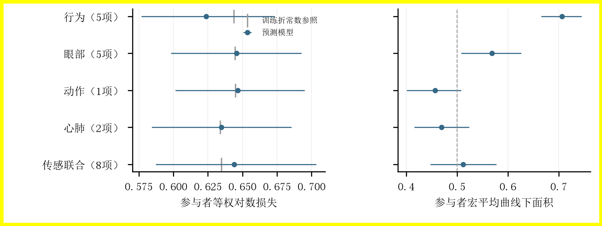
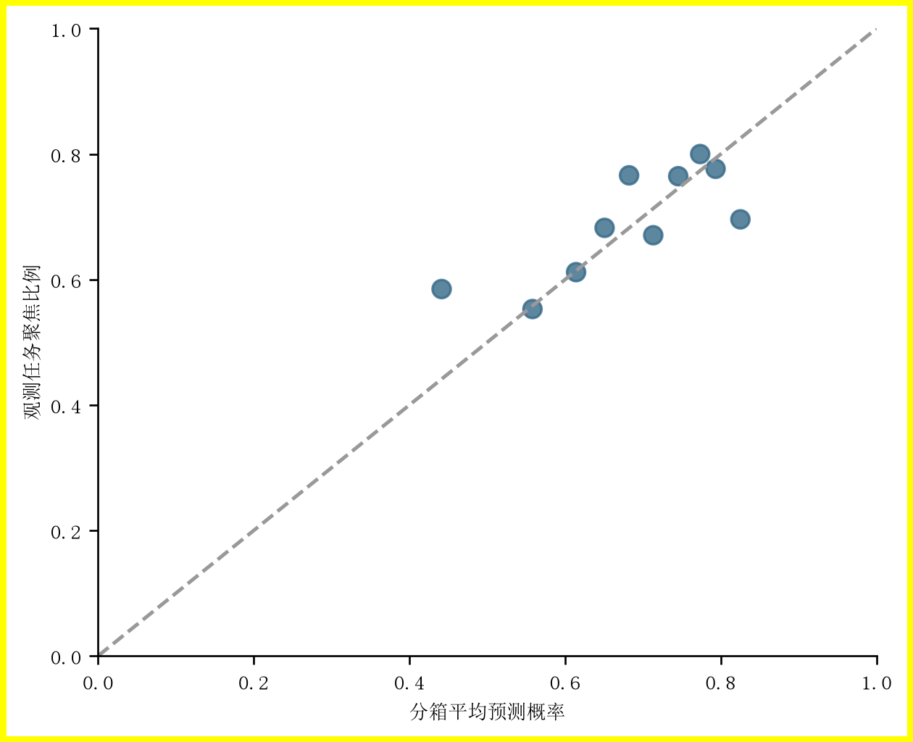
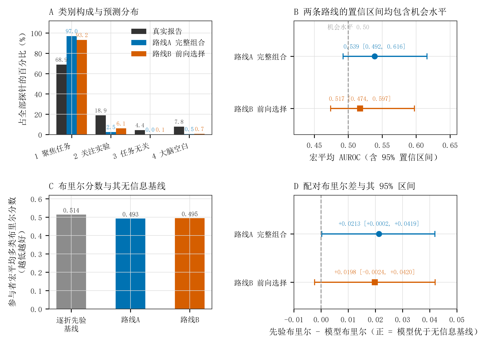
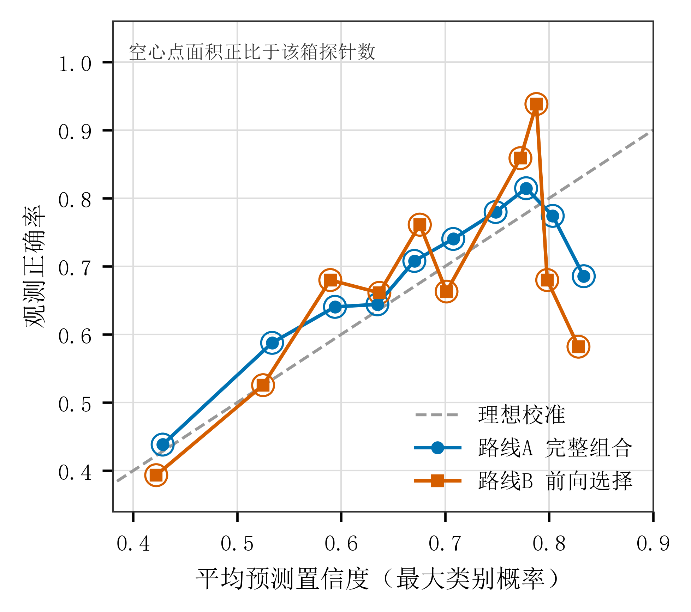

# 5.6 对新参与者注意内容报告的预测

## 5.6.1 单类信息与仅传感信息联合模型

留一参与者验证得到的预测均来自训练中未出现的参与者。二分类目标为任务聚焦相对于其余三类报告，主要指标为参与者宏平均对数损失，数值越低越好。曲线下面积用于补充描述排序区分。

表 14 单类信息及仅传感信息联合模型的折外表现

| 输入信息 | 对数损失及 95% 置信区间 | 受试者工作特征曲线下面积及 95% 置信区间 | 布里尔分数 | 人/场/探针 | 曲线下面积可估参与者数 |
| --- | --- | --- | --- | --- | --- |
| 行为（5项） | 0.6237 [0.5768, 0.6733] | 0.7060 [0.6656, 0.7447] | 0.2160 | 61/116/2316 | 49 |
| 眼部（5项） | 0.6456 [0.5983, 0.6925] | 0.5683 [0.5080, 0.6257] | 0.2253 | 60/103/1775 | 48 |
| 动作（1项） | 0.6465 [0.6015, 0.6950] | 0.4569 [0.4008, 0.5079] | 0.2267 | 61/115/2296 | 49 |
| 心肺（2项） | 0.6347 [0.5843, 0.6853] | 0.4691 [0.4159, 0.5240] | 0.2210 | 58/110/2198 | 46 |
| 传感联合（8项） | 0.6441 [0.5872, 0.7033] | 0.5119 [0.4475, 0.5774] | 0.2246 | 57/98/1705 | 45 |

注：损失、布里尔分数及可估计参与者的曲线下面积按参与者等权汇总。单一类别参与者纳入损失评价，曲线下面积仅由同时具有两类标签者计算。心肺类别采用行为及心肺均有效的 58 人、110 场、2198 个探针；独立传感联合为 57 人、98 场、1705 个探针。区间反映固定折外预测下的参与者抽样不确定性。不同集合的分数不能作为直接性能排名。

行为和眼部模型的曲线下面积区间高于 0.5。8 项独立传感联合的曲线下面积为 0.5119，95% 置信区间为 [0.4475, 0.5774]，包含 0.5；动作与心肺类别的区间也包含 0.5。当前结果未显示传感联合具有明确高于机会水平的跨参与者排序能力。

无输入参照使用各外层训练折的正例率作为常数概率，并按参与者等权评价。行为模型的损失为 0.6237，低于参照的 0.6438。8 项独立传感联合的损失为 0.6441，其对应参照为 0.6348。本项比较呈现各模型相对训练折常数概率的数值变化，成对改善区间尚未估计。

图 28 各类信息的折外预测表现

注：左图为各模型及同一样本训练折常数参照的损失，右图为参与者宏平均曲线下面积及 95% 置信区间。心肺类别为 58 人、2198 个探针；8 项独立传感联合为 57 人、1705 个探针。各行按自身集合解释。

## 5.6.2 场次内区分

行为模型在 83 个同时包含两类报告的场次中，曲线下面积均值为 0.6919，中位数为 0.7262；眼部模型在 72 场中的均值为 0.5697，中位数为 0.5656。8 项独立传感联合在 69 个可估计场次中的均值为 0.5095，中位数为 0.4933。

表 15 同一场次内的报告区分

| 输入信息 | 可估场次数 | 单一类别场次数 | 场次曲线下面积均值 | 中位数 |
| --- | --- | --- | --- | --- |
| 行为（5项） | 83 | 33 | 0.6919 | 0.7262 |
| 眼部（5项） | 72 | 31 | 0.5697 | 0.5656 |
| 动作（1项） | 82 | 33 | 0.4914 | 0.5000 |
| 心肺（2项） | 80 | 30 | 0.4615 | 0.4477 |
| 传感联合（8项） | 69 | 29 | 0.5095 | 0.4933 |

注：仅在同时包含任务聚焦与非任务聚焦报告的场次中计算曲线下面积，末列为场次曲线下面积的中位数。各类输入分别采用自身可用场次。

这些结果描述同一实验场次中离散探针报告的排序表现，计算样本为同时出现两类报告的场次。它们为考察任务内部的注意变化提供了局部依据，连续状态轨迹则需要更密集的时间参照进行评价。

## 5.6.3 概率校准

行为模型的校准斜率为 0.645，95% 置信区间为 [0.157, 1.234]。眼部模型为 −0.034，[−2.180, 0.439]。8 项独立传感联合的斜率原始估计为 −1.100，区间为 [−3.466, 0.180]；其判别力区间包含 0.5，按预先规定的诊断规则不作斜率方向的实质解释。

校准回归描述合并探针上的概率对应关系，参与者宏平均曲线下面积描述参与者内部的排序；两者的汇总尺度不同。校准诊断不参与特征或参数选择。区间由参与者簇自助法形成，每次仅重新拟合校准诊断回归，不重新训练预测模型。

13 项完整组合的校准斜率为 0.473，95% 置信区间为 [0.015, 0.989]；截距为 0.439，区间为 [−0.016, 0.883]。斜率区间上限略低于理想值 1。参与者等权的平均预测概率与实际正例率之差为 −0.00024，区间为 [−0.076, 0.073]。平均偏差与分箱校准分别反映总体及不同概率范围内的对应程度。

图 29 十三项完整组合的折外概率校准

注：横轴为分箱平均预测概率，纵轴为观测任务聚焦比例，点面积表示探针数，虚线为理想校准线。分箱按探针汇总，用于描述完成预测后的概率表现。

## 5.6.4 心肺信息的预测表现

在行为及心肺均有效的 58 人、2198 个探针上，两项心肺估计类别模型的对数损失为 0.6347，95% 置信区间为 [0.5843, 0.6853]，曲线下面积为 0.4691，[0.4159, 0.5240]。在不附加行为完整性条件的 58 人、110 场、2200 个探针上，心率单指标损失为 0.6331 [0.5814, 0.6840]，呼吸率单指标为 0.6346 [0.5858, 0.6843]。类别模型与两个单指标集合的样本条件不同。

在行为基础上加入心肺估计的改善量为 0.00050，95% 置信区间为 [−0.00576, 0.00692]；单独加入呼吸率为 −0.00166，[−0.00284, −0.00062]，单独加入心率为 0.00218，[−0.00361, 0.00836]。这些成对结果采用 2198 个共同探针。含毫米波的设备结果统一列于 5.8。心肺估计已满足本次预测的来源与时间条件，其生理准确性仍需独立同步参考验证；5.5 的测量评估与开发对照保留各自批次和分母。

## 5.6.5 行为窗口长度的补充结果

保持五项行为表示及训练评价设置一致，10 s、20 s 和 30 s 窗口的损失见表 5-13。三个区间相互重叠，各窗口的有效探针集合不同，结果分别描述各自可用样本上的表现。

表 16 行为模型的窗口长度敏感性

| 探针前窗口 | 人/场/探针 | 对数损失 | 95% 置信区间 |
| --- | --- | --- | --- |
| 10 s | 61/116/1547 | 0.615656 | [0.565352, 0.666017] |
| 20 s | 61/116/2306 | 0.631840 | [0.584770, 0.679407] |
| 30 s | 61/116/2316 | 0.623733 | [0.576769, 0.673311] |

注：10 s 和 20 s 的有效样本均为 30 s 样本的子集，30 s 对应主要分析结果。

10 s 原始窗口中，误按率有 1740 个有效值，部分短窗口未包含抑制反应机会。五项行为指标同时有效时，共保留 1547 个探针。较短窗口的损失与其样本构成共同变化，窗口性能的直接比较需采用相同有效样本。本研究保留 30 s 为主要窗口。本项敏感性分析聚焦行为指标，眼部和动作采用 30 s 的主要表示。 另在相同的 61 人、116 场、2306 个探针上完整配对重训 20 s 与 30 s 行为模型，损失差（30 s − 20 s）为 −0.007751，95% 置信区间为 [−0.015151, 0.002301]。未发现明确差异，也不能据此认定两窗口等效或 30 s 最优。

## 5.6.6 四分类预测与补充分析

在不含心肺估计的原十一项组合的 60 人、1775 个探针中，四类注意内容分别为 1223、336、78 和 138 次。只有 8 人同时出现四类报告，11 人仅有单一类别。任务无关思维来自 26 人。

方案 A 沿用原十一项二分类分析的比较样本，采用十一项特征集合。方案 B 在训练折内对预先确定的特征进行前向逐步选择。在该十一项组合的 1775 个探针上，两种方案的参与者宏平均多类对数损失分别为 0.9468 与 0.9532，逐折类别先验基线为 0.9768。平衡准确率分别为 0.2568 与 0.2625，宏平均曲线下面积分别为 0.5389 与 0.5174。

两种方案的对数损失均低于先验基线，类别区分指标则接近机会水平。四类的机会水平为平衡准确率 0.25、宏平均曲线下面积 0.50。方案 A 和 B 分别将 97.0% 与 93.2% 的探针预测为类别 1，其真实比例为 68.9%，类别 3 很少被预测。两种方案在总体概率损失上有所改善，对四类内容的均衡区分仍较弱。前向选择方案未表现出优于完整特征方案的结果。移除全部行为信息后，损失高于先验基线，单独移除 No-Go 误按率后的损失在各项比较中最高，与二分类结果方向一致。

多类布里尔分数为逐探针四类概率误差平方之和，数值越低越好。两种方案的分数分别为 0.493 与 0.495，逐折类别先验基线为 0.514。先验减去模型分数的配对差在方案 A 为 0.0213，区间 [0.0002, 0.0419] 排除零，在方案 B 为 0.0198，区间 [−0.0024, 0.0420] 包含零。完整特征方案的总体概率误差低于常数先验，前向选择方案的改善估计仍有不确定性。类别区分表现另由平衡准确率和曲线下面积评价。

图 30 四分类的类别分布、判别力与布里尔分数

注：A 为真实报告与两种方案的预测类别构成；B 为宏平均曲线下面积及 95% 置信区间，虚线为 0.5 的机会水平；C 为参与者宏平均多类布里尔分数与其逐折类别先验基线；D 为先验减模型的配对差。四类按无序类别处理，A 展示模型的预测类别分布。

图 31 顶端标签概率的可靠性

注：横轴为分箱平均置信度，纵轴为观测正确率，虚线为理想校准，空心点面积正比于该箱探针数。

头动协变量敏感性分析在同一有效样本的 1,779 个探针、60 名参与者上比较眼部模型与加入头动协变量的模型，结果如下表所示。

表 17 眼部、头动模型对比

| 模型 | 预测变量数 | 参与者宏平均对数损失 | 95% 置信区间 |
| --- | --- | --- | --- |
| 仅眼部指标 | 5 | 0.645425 | [0.597980, 0.692285] |
| 加入头动协变量 | 7 | 0.643318 | [0.594897, 0.690173] |

加入头动协变量后的配对增量为 +0.002107，95% 置信区间为 [−0.000849, +0.005116]，包含 0，眼部模型的预测表现与调整前相近。两种模型采用完全相同的探针、参与者和交叉验证划分，头动协变量在该样本中均可获得。本项分析评价头动调整对眼部模型的影响。虹膜像素、面部尺寸等尺度指标未纳入本次分析，其敏感性需另行检验。动作信息的独立预测与增量价值由对应的信息类别模型评价。
