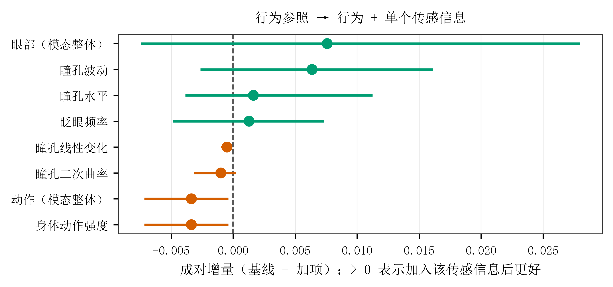
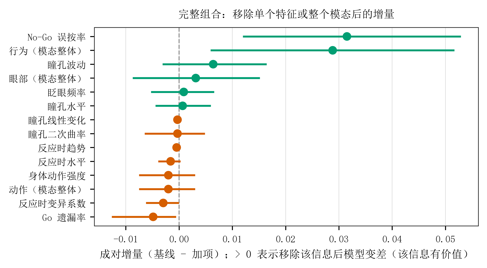

# 5.7 多模态增量与条件预测价值

本章报告在**同一分析集合、同一批参与者、同一批思维探针与同一外层测试划分**上重新训练与评价的
成对比较结果。增量定义为基线模型的对数损失减去加项模型的对数损失：**负值表示加入该信息后表现
更差，正值表示更好**；区间跨 0 即没有可分辨的增量证据。

## 5.7.1 在行为参照上加入传感信息

| 模型比较 | 对数损失改善量 | 95% 置信区间 | 参与者数 | 探针数 |
|---|---:|---|---:|---:|
| 行为 vs 行为 + 眼部 | +0.00758 | [−0.00745, 0.02799] | 60 | 1,775 |
| 行为 vs 行为 + 动作 | −0.00336 | [−0.00716, −0.00038] | 61 | 2,296 |
| 行为 vs 行为 + 心肺ᵃ | +0.00050 | [−0.00576, 0.00692] | 58 | 2,198 |

表注：ᵃ 心肺行为**补充比较**，其分析集合、参与者与探针分母与其余两行不同（58 名参与者 /
2,198 个探针，其余两行分别为 60 名 / 1,775 与 61 名 / 2,296），**不得与其余各行直接比较**。

三项比较中，**只有"行为 → 行为 + 动作"的区间排除 0**，且方向为负（−0.00336，95% 置信区间
[−0.00716, −0.00038]）：在该分析集合中，加入身体动作能量后对数损失**上升**，即表现为轻微有害
而非有益。"行为 → 行为 + 眼部"方向为正但区间跨 0（+0.00758，[−0.00745, +0.02799]），没有可分辨
的增量。补充的"行为 → 行为 + 心肺"为 +0.00050，区间 [−0.00576, +0.00692]，**同样没有增量证据**。

因此本数据**不支持**"传感信息在行为基础上提供互补预测价值"这一结论；相反，唯一区间排除 0 的
增量是负向的。

**图 5.7-1 在行为参照上逐项加入传感信息的成对增量。** 每个点为一个成对比较的增量点估计
（基线对数损失 − 加项对数损失），横线为 95% 置信区间；虚线为 0（加项无增量）。**点位于 0 右侧
表示加入该信息后模型更好，位于左侧表示更差**；绿色为正、橙色为负，颜色不单独承载信息。图中同时
给出**模态级**（眼部整体、动作整体）与**单指标级**（瞳孔水平/波动/线性变化/二次曲率、眨眼频率、
身体动作强度）共 8 项比较，各比较的参与者与探针分母不同，**不得横向排序**。误差线为固定折外预测
的参与者整簇百分位自助区间（1,000 次，seed 20260830，95%，不重训），**未对整组比较实施多重比较
校正**。

## 5.7.2 完整信息组合中的条件预测价值

| 比较 | 对数损失变化 | 95% 置信区间 | 参与者数 | 探针数 |
|---|---:|---|---:|---:|
| 完整组合 vs 移除行为信息 | +0.02883 | [0.00592, 0.05168] | 60 | 1,775 |
| 完整组合 vs 移除眼部信息 | +0.00313 | [−0.00870, 0.01517] | 60 | 1,775 |
| 完整组合 vs 移除动作信息 | −0.00201 | [−0.00752, 0.00301] | 60 | 1,775 |
| 完整组合 + 心肺ᵃ vs 移除心肺 | −0.00176 | [−0.00849, 0.00405] | 57 | 1,703 |

表注：正值表示移除该类信息后对数损失**上升**（该信息有正向贡献）。ᵃ 心肺行来自补充比较，其分母
（57 名参与者 / 1,703 个探针）与其余三行（60 名 / 1,775）不同，且其基线为"完整组合 + 心肺"而非
冻结的完整组合，**不得与其余各行直接比较**。

逐类移除的结果与 5.7.1 一致：**只有移除行为信息造成明确损失**（+0.02883，95% 置信区间
[+0.00592, +0.05168]，区间排除 0）。移除眼部（+0.00313，[−0.00870, +0.01517]）与移除动作
（−0.00201，[−0.00752, +0.00301]）的区间均跨 0。补充比较中从"完整组合 + 心肺"移除心肺为
−0.00176，区间 [−0.00849, +0.00405]，跨 0。

加入动作后的改善量为负，与移除动作后的损失变化为负，在解释上方向一致：前者表示加入后损失增加，后者表示移除后损失降低。第二项区间包含 0，且两项使用不同共同样本，因此不能据此推定动作在所有配置中均降低性能。

**图 5.7-2 完整组合中移除单个特征或整个模态的成对增量。** 每个点为一个成对比较的增量点估计
（移除后的模型对数损失 − 完整组合对数损失），横线为 95% 置信区间；虚线为 0。**点位于 0 右侧表示
移除该信息后模型变差，即该信息对完整组合有正向贡献**；位于左侧表示移除后反而更好（该信息在此
配置中表现为噪声）。图中含**移除单个特征 11 项**与**移除整个模态 3 项**，两类比较层级不同，**不得
混为一谈或横向排序**。误差线为固定折外预测的参与者整簇百分位自助区间（1,000 次，seed 20260830，
95%，不重训），未实施多重比较校正。

## 5.7.3 概率质量与折外校准

除排序与对数损失外，本节补充报告**仅使用折外测试概率**的校准诊断。校准回归按探针合并，与按可估
参与者等权汇总的主 AUROC 回答不同的统计问题。完整组合的校准斜率为 0.481，95% 置信区间
[0.102, 1.041]，区间包含理想斜率 1；校准截距为 0.453（[−0.007, 0.832]），而按参与者宏平均的
校准总体偏倚（calibration-in-the-large）为 −0.00007（[−0.070, 0.066]），接近 0，表示平均预测
水平没有明显系统性偏高或偏低。

**图 5.7-3 完整组合（`full`）的折外概率校准。** 横轴为分箱内的平均预测概率，纵轴为该分箱的观测
正例率，点面积与分箱内探针数成正比；虚线为理想校准线。曲线在低概率端高于对角线、在高概率端低于
对角线，与小于 1 的校准斜率方向一致。

需要写明边界：斜率区间很宽，**当前输出尚不足以建立稳定的概率校准结论**；也不据校准点估计推断
参与者个人内的概率反向。该诊断层为补充描述性证据，**不参与模型或正则化参数选择**。

## 5.7.4 关于"协同""互补"与"不可替代"的表述边界

本节不写"协同效应""互补增益"或"不可替代"等结论性表述。本数据中能够支持的最强陈述是：

- 行为信息在完整组合中具有明确且可分辨的贡献（移除后损失显著上升）；
- 眼部、动作与心肺信息在各自可用的比较中**均未显示区间排除零的正向增量**；
- 单指标层面的条件价值见图 5.7-1 与图 5.7-2，仅在各自层级内描述，不作为跨层级结论。

同时必须说明，来自不同分析集合的增量**不能横向排序**：各比较的参与者、场次与探针分母不同，
因此"哪一类传感信息更有价值"在本数据中不是一个可回答的问题，本节也不回答它。

上述区间为各项固定折外预测的成对区间，未对整组预测比较实施多重比较校正。单指标移除结果与信息类别比较属于不同层级，不把某两项类别比较的结论概括为全部 22 项比较的计数。**22 项成对比较中有 8 项区间排除 0**（模态条件增量 1/2、行为条件增量 2/6、完整删一模态 1/3、完整删一特征 4/11），其中**仅 2 项为正且均属行为信息**，其余 6 项为负。
