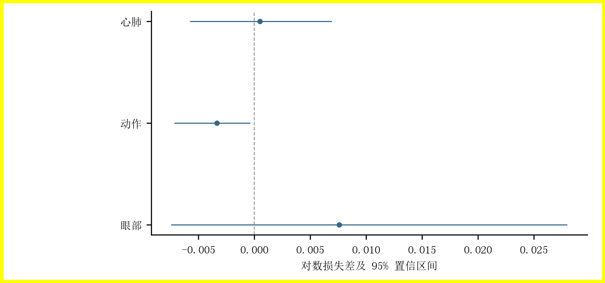
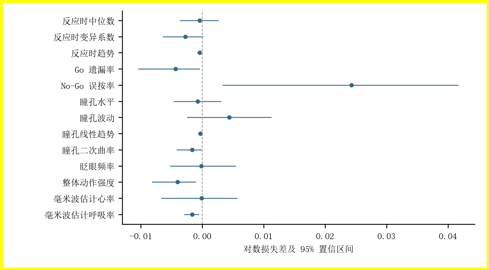

# 5.7 多模态增量与条件预测价值

各项增量均在相同参与者、相同探针及相同外层划分上比较。改善量定义为比较基线的对数损失减去加入相应信息后的对数损失，正值表示损失降低。

## 5.7.1 行为基础上的新增预测价值

加入眼部信息的改善量为 0.00758，95% 置信区间为 [−0.00745, 0.02799]，点估计为正，区间包含零。加入动作信息的改善量为 −0.00336，[−0.00716, −0.00038]，对应小幅损失增加。

表 18 行为基础上的信息增量

| 加入的信息 | 对数损失改善量 | 95% 置信区间 | 参与者数 | 探针数 |
| --- | --- | --- | --- | --- |
| 眼部 | 0.00758 | [−0.00745, 0.02799] | 60 | 1775 |
| 动作 | −0.00336 | [−0.00716, −0.00038] | 61 | 2296 |
| 心肺估计（补充） | 0.00050 | [−0.00576, 0.00692] | 58 | 2198 |

注：每行均在该比较的共同样本上重新训练行为基线与加入相应信息的模型。心肺估计的纳入及结果见 5.6.4。各项改善量按其共同样本解释。

在本次指标表示、线性概率模型与验证设置下，眼部和心肺信息的增量区间均包含零，动作信息对应小幅损失增加。各类传感信息的独立预测表现与状态关联，分别由单类模型和解释性分析呈现。

图 32 行为基础上的成对增量

注：点为基线损失减去加入信息后的损失，横线为 95% 置信区间，虚线为零。正值表示加入后损失较低。类别与单指标分别解释，各项比较采用对应的共同样本。

## 5.7.2 完整组合中的条件预测价值

完整组合包含五项行为、五项眼部、一项动作和两项心肺估计。在相同的 57 人、98 场、1703 个探针上，完整模型损失为 0.620703。移除行为后的损失增加 0.02341，95% 置信区间为 [0.00003, 0.04353]；移除动作后的差值为 −0.00404 [−0.00823, −0.00105]。移除眼部或心肺类别的差值区间包含零。

表 19 从完整组合移除信息后的损失变化

| 移除的信息 | 移除后减去完整组合的对数损失 | 95% 置信区间 | 参与者数 | 探针数 |
| --- | --- | --- | --- | --- |
| 全部行为 | 0.02341 | [0.00003, 0.04353] | 57 | 1703 |
| 全部眼部 | 0.00019 | [−0.00895, 0.01071] | 57 | 1703 |
| 全部动作 | −0.00404 | [−0.00823, −0.00105] | 57 | 1703 |
| 全部心肺 | −0.00176 | [−0.00849, 0.00405] | 57 | 1703 |

注：四行均以同一十三项完整模型及 57 人、1703 个探针为基准。差值为移除后的损失减去完整模型损失，正值表示保留该类信息时损失较低。移除行为后的八项模型仍受完整组合共同样本条件约束，与 1705 个探针的独立传感联合分开报告。

行为在其他传感指标已纳入时仍表现出正向条件预测价值，区间下限接近零。动作类别的移除差值为负且区间不包含零，与行为加入动作比较的方向一致。眼部和心肺类别未显示明确的条件增益。各项区间未作整组多重比较校正。

图 33 完整组合的逐项移除比较

注：点为移除后的模型损失减去完整组合损失，横线为 95% 置信区间。正值表示移除后损失增加。单指标与整类信息属于不同比较层级，区间未作整组多重比较校正。

## 5.7.3 单指标补充结果

完整组合移除误按率后，损失增加 0.02427，95% 置信区间为 [0.00329, 0.04173]。移除原始遗漏率、反应时趋势和变异系数后，损失变化分别为 −0.00434 [−0.01041, −0.00038]、−0.00044 [−0.00086, −0.00013]、−0.00275 [−0.00647, 0.00016]。其中，反应时变异系数的区间包含零。这些结果表明，在当前完整组合和正则化模型中，不同行为指标的条件贡献有所差异。行为类别的总体价值与各单项指标的作用分别呈现。

眼部单指标加入行为的比较中，瞳孔线性趋势改善量为 −0.00049，95% 置信区间 [−0.00097, −0.00010]，其余单项眼部增量区间均包含零。全部 28 条成对结果见附录 B.2。

上述区间均为单项成对比较区间，整组预测比较未作多重校正。部分单指标模型与类别模型采用相同输入，结果对应同一次信息比较。各项损失变化描述预先确定的模型组合中的条件预测表现，为理解具体指标的作用提供依据。 另在原十一项组合的 60 人、1775 个探针上完成预定义精简流程的嵌套验证：完整模型损失为 0.618033，精简流程为 0.618623，差值（完整 − 精简）为 −0.000589，95% 置信区间为 [−0.009133, 0.008061]。该补充分析未显示精简改善，其结果不代表十三项组合已完成同样的精简检验。
