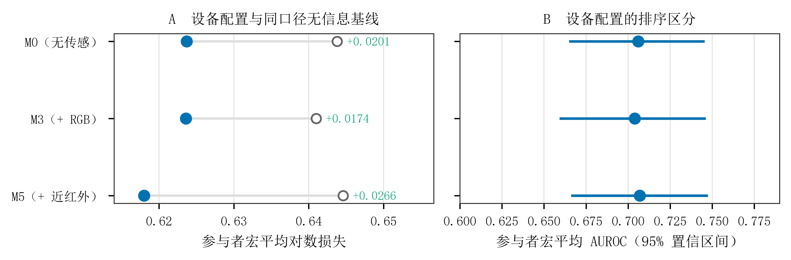

# 5.8 设备组合与系统级输出

设备评价同时考虑某一配置能够形成的指标、有效覆盖及预测表现。当前六种可评价配置均保留任务行为输入。表 5-16 先列首轮的仅行为、行为加可见光信息、行为加近红外与可见光信息三种配置；取得正式预测资格的心肺估计对应另三种含毫米波配置，随后单列说明。

**表 5-16 首轮三种设备配置的覆盖与折外表现**

| 传感设备 | 输入信息 | 参与者数 | 探针数 | 对数损失 | 受试者工作特征曲线下面积 |
|---|---|---:|---:|---:|---:|
| 无 | 五项行为指标 | 61 | 2316 | 0.6237 | 0.7060 |
| 可见光摄像头 | 行为、眨眼、整体动作 | 60 | 2196 | 0.6236 | 0.7040 |
| 近红外与可见光摄像头 | 行为、四项瞳孔、眨眼、整体动作 | 60 | 1775 | 0.6180 | 0.7069 |

注：每行在各自可用样本上评价，不能由分数接近证明等效，也不能将原始分数差异归因于新增设备。完整概率诊断和损失区间见结果附表。

**图 5-8 不同设备配置的折外表现。** 左图给出模型及对应训练折常数概率参照的损失，右图给出曲线下面积及 95% 置信区间。配置均含行为输入，各配置样本不同，图中分数差异不能证明设备增量。

表中三种配置分别保留全部探针的 99.83%、94.66% 和 76.51%。联合摄像头配置需要更多指标同时可用，实际共同样本较小；该覆盖结果同时受采集完整性、指标定义和质量要求影响，不单独表示设备数量的因果作用。

仅近红外配置未形成当前正式模型，因为主要瞳孔指标同时依赖可见光眨眼辅助清理，当前没有独立登记可用于该配置的近红外替代指标。**含毫米波的三个配置（M2 仅毫米波、M6 毫米波与可见光、M7 三设备）已随心肺特征的正式纳入形成正式模型**，其参与者宏平均对数损失分别为 0.618478、0.621683 和 0.620703，样本分别为 58 人 / 2,198 探针、57 人 / 2,098 探针和 57 人 / 1,703 探针，详见 5.6.4 与结果附表。心率的生理效度仍未验证，该限制同样适用于这三个配置。本表不重复列入这三行，以免与 5.6.4 的同批数字出现两套口径。其余限制属于本轮实际输入和资格范围，不表示相应硬件在技术上永远不可用。

仅依靠传感信息的联合模型在 5.6 单列，能够直接评价减少任务行为输入依赖后的表现。当前设备表中的模型仍使用行为，因而回答的是受控任务条件下的配置问题。现有结果已经给出系统的有效覆盖、任务内报告排序和行为条件增量；对于自然场景使用及连续概率输出，还缺少相应验证，不能从本表直接推定。
