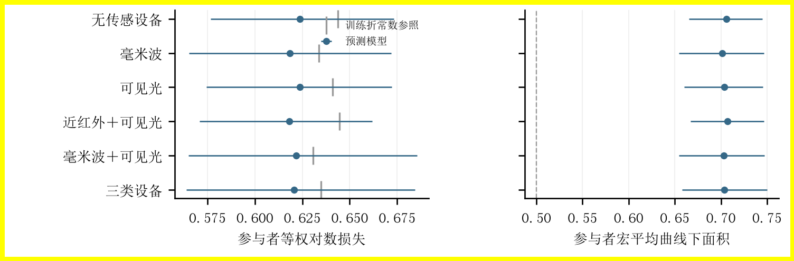

# 5.8 设备组合与系统级输出

设备评价同时考虑可形成的指标、有效覆盖及预测表现。六种配置均保留五项任务行为输入，传感部分分别为无传感设备、毫米波、可见光、近红外与可见光、毫米波与可见光、三类设备联合。相应总输入数为 5、7、7、11、9 和 13 项。

表 20 当前设备配置的覆盖与折外表现

| 传感设备 | 输入信息 | 参与者数 | 探针数 | 对数损失 | 受试者工作特征曲线下面积 |
| --- | --- | --- | --- | --- | --- |
| 无传感设备 | 五项行为（5项） | 61 | 2316 | 0.6237 | 0.7060 |
| 毫米波 | 行为＋心肺（7项） | 58 | 2198 | 0.6185 | 0.7011 |
| 可见光 | 行为＋眨眼＋动作（7项） | 60 | 2196 | 0.6236 | 0.7040 |
| 近红外＋可见光 | 行为＋眼部＋动作（11项） | 60 | 1775 | 0.6180 | 0.7069 |
| 毫米波＋可见光 | 行为＋眨眼＋动作＋心肺（9项） | 57 | 2098 | 0.6217 | 0.7029 |
| 三类设备 | 行为＋眼部＋动作＋心肺（13项） | 57 | 1703 | 0.6207 | 0.7035 |

注：各配置在自身可用样本上评价，分数同时受到输入指标与样本构成的影响。设备增量通过共同样本上的成对比较评价。完整概率诊断和损失区间见结果附表。

图 34  不同设备配置的折外表现

注：左图给出模型及对应训练折常数概率参照的损失，右图展示曲线下面积与 95% 置信区间。各配置均包含行为输入，并采用自身有效样本，反映相应测量条件下的系统表现。

六种配置分别保留全部 2320 个探针的 99.83%、94.74%、94.66%、76.51%、90.43%、73.41%。完整三设备组合为 57 人、98 场、1703 个探针。各配置的分数同时受到输入与样本构成影响，不能据此作设备优劣排名。

主要瞳孔指标结合近红外图像与可见光眨眼时点完成质量处理，因此采用双摄像头配置评价瞳孔信息。独立近红外配置需要替代指标及相应测量验证。六种配置均按实际输入数和各自样本报告；传感信息在行为之上的增量由共同样本成对比较评价。

设备表中的模型均保留行为输入，评价的是受控任务条件下的配置表现。有效覆盖、任务内报告排序和行为条件增量共同描述了系统的当前能力，也明确了不同硬件配置的使用条件。自然场景和连续输出将通过相应的场景验证进一步评价。
