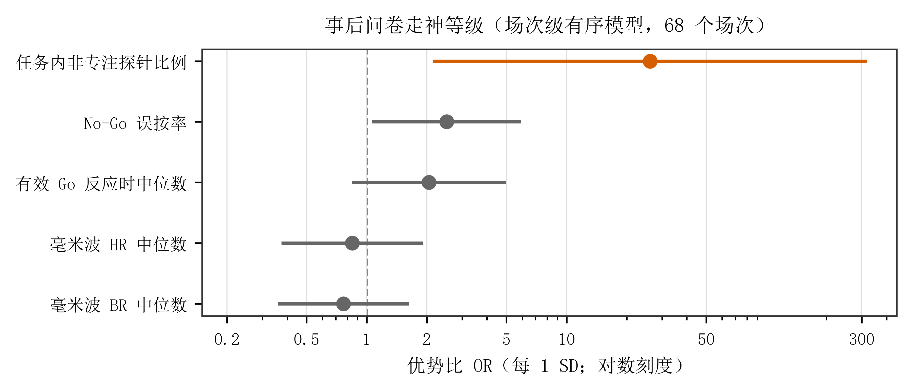

# 5.9 事后问卷与任务内报告的场次级一致性

本节检验两类主观信息在**场次层面**是否一致：整场结束后自评的"走神时间比例"，与任务进行中思维探针报告的"当时注意内容"。它回答的是主观效标之间的一致性，**不是**注意状态的预测，也不把整场自评转写为某个探针或窗口的标签。

## 5.9.1 数据与模型

分析单位为**场次**。纳入北京正式实验中有有效事后问卷的 **68 个场次**，来自 **46 个重复被试编号**（其中 18 个编号有多次场次）。珠海数据不进入本模型——两地探针题目与选项存在版本差异，不能直接合并。

整场自评的走神比例按有序三级处理：几乎没走神（不到 10%）23 场、小部分时间（10%–30%）36 场、相当一部分时间（30%–50%）9 场；没有场次落在 50% 以上。

模型为**累积 logit 有序模型**，以重复被试编号作为随机截距，以处理同一被试多次场次的相关。全部连续预测变量按**场次级标准差**标准化，因此报告的优势比表示预测变量增加 1 个标准差时进入更高走神等级的优势比。三个模型在结果产生前冻结：确认性的效标一致性模型，以及行为与毫米波两个探索性模型。心率变异性未进入模型，因其独立心电留出验证尚不足以支撑确认性使用。

## 5.9.2 结果

**图 5.9-1 事后问卷走神等级（场次级有序模型，68 个场次）。** 点为优势比，横线为 95% 置信区间，虚线为 1（无关联）。橙色表示区间排除 1。

| 模型 | 预测变量 | 优势比（每 1 个标准差） | 95% 置信区间 | *p* |
|---|---|---:|---:|---:|
| **确认性效标一致性** | 任务内非专注探针比例 | **26.16** | 2.15–318.49 | **.011** |
| 探索性行为 | No-Go 误按率 | 2.51 | 1.06–5.92 | .036 |
| 探索性行为 | 有效 Go 反应时中位数 | 2.05 | 0.84–4.97 | .113 |
| 探索性毫米波 | 毫米波估计心率中位数 | 0.85 | 0.37–1.91 | .689 |
| 探索性毫米波 | 毫米波估计呼吸率中位数 | 0.76 | 0.36–1.62 | .484 |

表注：任务内非专注探针比例为三类非聚焦报告（关注实验相关内容但未聚焦当前分类任务、任务无关思维、思维空白）之和占该场次探针的比例。行为与毫米波两组为探索性分析，采用探索性错误发现率校正；校正后误按率的关联不再显著（*q* = .143）。

**确认性结果显示两类主观层级一致**：整场自评走神比例更高的场次，其任务内非专注探针比例也确实更高。该优势比的置信区间很宽（2.15–318.49），因此只支持"存在一致性"这一方向性结论，不能据此估计精确效应量；区间偏宽的主要原因是最高走神等级只有 9 个场次。

行为与毫米波两组只可写作探索性信号。No-Go 误按率在未校正时与更高走神等级相关，但探索性校正后不再显著，不能作为独立确认发现。毫米波估计心率与呼吸率则**未显示出与整场走神等级的稳定关联**。

## 5.9.3 解释边界

- 本节结论限定在**场次级、自评效标、当前样本量与当前汇总尺度**。毫米波两项未显示关联，**不等于**毫米波无效，只表示在该层级的检验中未发现关联。
- 整场自评**不复制**为探针或时间窗口的标签。因此本节不能用于把全场生理窗口统一标记为高走神，也不能替代任务内探针报告。
- 两类主观信息的一致性**不能替代**行为与传感信息的测量资格或预测评价；后者见 5.2 至 5.8。
- 珠海需按其独立探针协议另建模型，不能与北京合并估计。

<!-- 内部跟进：场次级输入、来源清单与模型审计见 11_数据/derived/questionnaire_session_analysis_v1/（provenance_manifest.json、analysis_input_audit.json、ordinal_models_v1/）。数据来源、算法出处与写作边界的完整说明另见云盘 _AI_HANDOFF/2026-09-13_missing-results-questionnaire-mmwave-mechanism/。 -->
