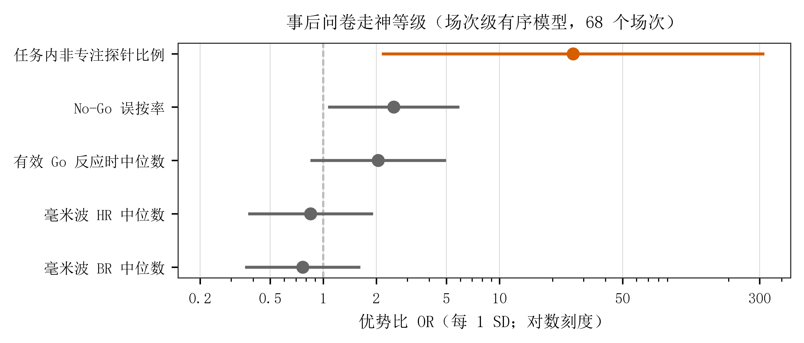

# 5.9 事后问卷与任务内报告的场次级一致性

本节在场次层面比较两类主观信息，即任务结束后自评的走神时间比例，以及任务中思维探针记录的注意内容。整场回顾与即时报告分别描述不同时间尺度的体验，二者的一致性用于评价主观参照之间的联系。逐探针预测则继续采用对应时点的注意内容报告。

## 5.9.1 数据与模型

分析以场次为单位，采用北京正式实验中具有有效事后问卷的 68 个场次，来自 46 个重复被试编号，其中 18 个编号对应多个场次。为保持题目与选项一致，本项模型使用北京样本，珠海数据因探针版本不同而单独保留。

整场自评的走神比例按三级有序变量处理，包括几乎没走神（不到 10%）23 场、小部分时间（10%–30%）36 场、相当一部分时间（30%–50%）9 场，50% 以上为 0 场。

模型为累积 logit 有序模型，以重复被试编号作为随机截距，以处理同一被试多次场次的相关。全部连续预测变量按场次级标准差标准化，因此报告的优势比表示预测变量增加 1 个标准差时进入更高走神等级的优势比。分析前预先确定三个模型，分别为确认性的效标一致性模型，以及行为和毫米波的探索性模型。毫米波分析采用窗口级心率与呼吸率。

## 5.9.2 结果

图 32 事后问卷走神等级（场次级有序模型，68 个场次）

注：点为优势比，横线为 95% 置信区间，虚线为 1。橙色为确认性效标一致性模型，灰色为探索性模型。探索性行为分析中，误按率的多重比较校正结果为 q = .143。

表 21 探索性与确定性优势比分析

| 模型 | 预测变量 | 优势比（每 1 个标准差） | 95% 置信区间 | p |
| --- | --- | --- | --- | --- |
| 确认性效标一致性 | 任务内非专注探针比例 | 26.16 | 2.15–318.49 | .011 |
| 探索性行为分析 | No-Go 误按率 | 2.51 | 1.06–5.92 | .036 |
| 探索性行为分析 | 有效 Go 反应时中位数 | 2.05 | 0.84–4.97 | .113 |
| 探索性毫米波分析 | 毫米波估计心率中位数 | 0.85 | 0.37–1.91 | .689 |
| 探索性毫米波分析 | 毫米波估计呼吸率中位数 | 0.76 | 0.36–1.62 | .484 |

注：任务内非专注探针比例为三类非聚焦报告（关注实验相关内容但未聚焦当前分类任务、任务无关思维、思维空白）之和占该场次探针的比例。行为与毫米波两组为探索性分析，采用探索性错误发现率校正。校正后误按率的关联不再显著（q = .143）。

整场自评走神比例较高的场次，其任务内非专注探针比例也较高，显示两类主观报告在场次层面具有一致性。优势比区间为 2.15–318.49，方向明确而估计范围较宽。最高走神等级包含 9 个场次，较少的观测使效应量的估计精度受到影响。

行为与毫米波模型提供场次层面的探索性结果。No-Go 误按率在未校正分析中与较高走神等级相关，探索性校正后未达到显著性标准。毫米波估计心率与呼吸率的关联区间均包含无关联值，当前场次级分析未检出稳定关系。
