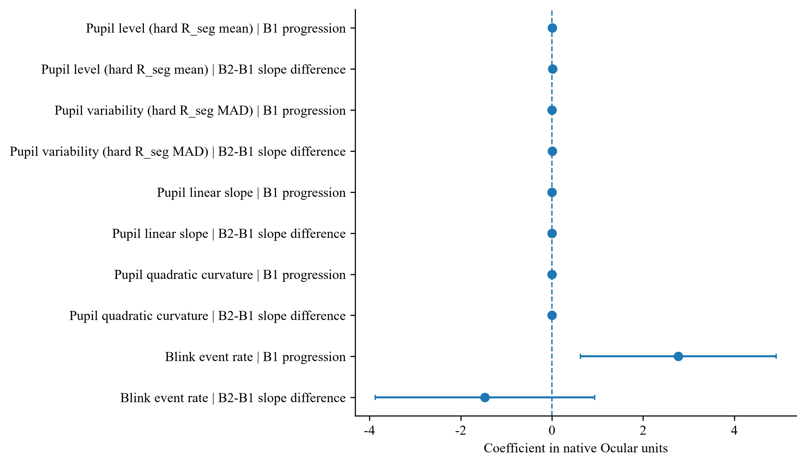
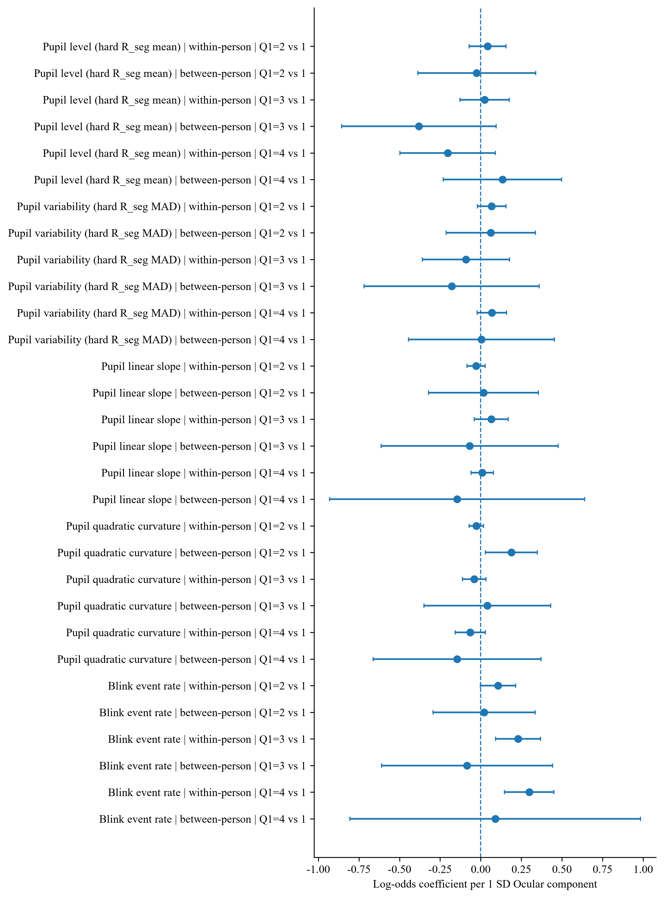
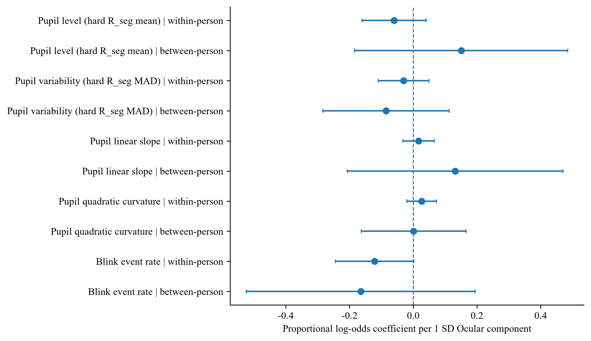

# 附录 B　眼部与预测完整结果附表

本附表保留眼部正式估计、全部正式成对预测比较及模型损失。参与者之间的眼部结果为正式伴随分析，不是敏感性分析。方法见第四章，核心叙述见第五章；各表中的置信区间均为单项区间。

## B.1 眼部任务进程的全部 15 项估计

| 指标 | 进程项 | 系数 | 95% 置信区间 | 校正后 q | 人/场/探针 |
|---|---|---:|---|---:|---|
| 瞳孔水平 | 进程中心处第二区块相对第一区块 | 0.001446 | [-0.004610, 0.007503] | 0.852 | 61/108/1936 |
| 瞳孔水平 | 第一区块首末探针线性变化 | 0.005203 | [-0.000289, 0.010694] | 0.136 | 61/108/1936 |
| 瞳孔水平 | 第二区块与第一区块进程斜率差 | 0.010683 | [0.002401, 0.018964] | 0.057 | 61/108/1936 |
| 瞳孔波动 | 进程中心处第二区块相对第一区块 | 0.002938 | [0.000904, 0.004972] | 0.057 | 61/108/1936 |
| 瞳孔波动 | 第一区块首末探针线性变化 | 0.003498 | [0.000524, 0.006472] | 0.063 | 61/108/1936 |
| 瞳孔波动 | 第二区块与第一区块进程斜率差 | 0.004244 | [0.000384, 0.008105] | 0.078 | 61/108/1936 |
| 瞳孔线性趋势 | 进程中心处第二区块相对第一区块 | -0.000029 | [-0.000169, 0.000111] | 0.852 | 61/107/1857 |
| 瞳孔线性趋势 | 第一区块首末探针线性变化 | 0.000015 | [-0.000146, 0.000175] | 0.907 | 61/107/1857 |
| 瞳孔线性趋势 | 第二区块与第一区块进程斜率差 | 0.000014 | [-0.000192, 0.000219] | 0.907 | 61/107/1857 |
| 瞳孔二次曲率 | 进程中心处第二区块相对第一区块 | -0.000004 | [-0.000019, 0.000012] | 0.852 | 61/107/1855 |
| 瞳孔二次曲率 | 第一区块首末探针线性变化 | -0.000010 | [-0.000028, 0.000007] | 0.419 | 61/107/1855 |
| 瞳孔二次曲率 | 第二区块与第一区块进程斜率差 | -0.000002 | [-0.000038, 0.000034] | 0.907 | 61/107/1855 |
| 眨眼频率 | 进程中心处第二区块相对第一区块 | 1.330138 | [0.211685, 2.448590] | 0.063 | 60/110/2200 |
| 眨眼频率 | 第一区块首末探针线性变化 | 2.771564 | [0.624717, 4.918412] | 0.057 | 60/110/2200 |
| 眨眼频率 | 第二区块与第一区块进程斜率差 | -1.467516 | [-3.870920, 0.935887] | 0.419 | 60/110/2200 |

瞳孔水平与波动单位为比例，线性趋势为比例/s，二次曲率为比例/s²，眨眼为次/min；任务进程跨越首末探针的编码差为 1。q 值在全部 15 项中校正。

## 注意内容：参与者内部

| 眼部指标 | 相对于任务聚焦的报告类别 | 系数 | 95% 置信区间 | 校正后 q | 人/场/探针 |
|---|---|---:|---|---:|---|
| 瞳孔水平 | 关注实验但未聚焦分拣任务 | 0.042 | [-0.072, 0.156] | 0.910 | 61/108/1936 |
| 瞳孔水平 | 任务无关思维 | 0.024 | [-0.128, 0.175] | 0.955 | 61/108/1936 |
| 瞳孔水平 | 思维空白 | -0.204 | [-0.498, 0.090] | 0.587 | 61/108/1936 |
| 瞳孔波动 | 关注实验但未聚焦分拣任务 | 0.067 | [-0.020, 0.155] | 0.587 | 61/108/1936 |
| 瞳孔波动 | 任务无关思维 | -0.091 | [-0.359, 0.177] | 0.910 | 61/108/1936 |
| 瞳孔波动 | 思维空白 | 0.068 | [-0.023, 0.159] | 0.587 | 61/108/1936 |
| 瞳孔线性趋势 | 关注实验但未聚焦分拣任务 | -0.029 | [-0.085, 0.027] | 0.723 | 61/107/1857 |
| 瞳孔线性趋势 | 任务无关思维 | 0.065 | [-0.040, 0.169] | 0.645 | 61/107/1857 |
| 瞳孔线性趋势 | 思维空白 | 0.009 | [-0.060, 0.078] | 0.955 | 61/107/1857 |
| 瞳孔二次曲率 | 关注实验但未聚焦分拣任务 | -0.027 | [-0.072, 0.018] | 0.645 | 61/107/1855 |
| 瞳孔二次曲率 | 任务无关思维 | -0.040 | [-0.112, 0.032] | 0.698 | 61/107/1855 |
| 瞳孔二次曲率 | 思维空白 | -0.064 | [-0.158, 0.029] | 0.587 | 61/107/1855 |
| 眨眼频率 | 关注实验但未聚焦分拣任务 | 0.106 | [-0.003, 0.215] | 0.421 | 60/110/2200 |
| 眨眼频率 | 任务无关思维 | 0.230 | [0.092, 0.367] | 0.016 | 60/110/2200 |
| 眨眼频率 | 思维空白 | 0.298 | [0.146, 0.451] | 0.004 | 60/110/2200 |

## 注意内容：参与者之间

| 眼部指标 | 相对于任务聚焦的报告类别 | 系数 | 95% 置信区间 | 校正后 q | 人/场/探针 |
|---|---|---:|---|---:|---|
| 瞳孔水平 | 关注实验但未聚焦分拣任务 | -0.025 | [-0.387, 0.338] | 0.955 | 61/108/1936 |
| 瞳孔水平 | 任务无关思维 | -0.381 | [-0.856, 0.094] | 0.587 | 61/108/1936 |
| 瞳孔水平 | 思维空白 | 0.134 | [-0.230, 0.498] | 0.910 | 61/108/1936 |
| 瞳孔波动 | 关注实验但未聚焦分拣任务 | 0.061 | [-0.213, 0.336] | 0.955 | 61/108/1936 |
| 瞳孔波动 | 任务无关思维 | -0.179 | [-0.718, 0.360] | 0.910 | 61/108/1936 |
| 瞳孔波动 | 思维空白 | 0.005 | [-0.445, 0.454] | 0.983 | 61/108/1936 |
| 瞳孔线性趋势 | 关注实验但未聚焦分拣任务 | 0.017 | [-0.322, 0.355] | 0.955 | 61/107/1857 |
| 瞳孔线性趋势 | 任务无关思维 | -0.068 | [-0.613, 0.476] | 0.955 | 61/107/1857 |
| 瞳孔线性趋势 | 思维空白 | -0.145 | [-0.930, 0.640] | 0.955 | 61/107/1857 |
| 瞳孔二次曲率 | 关注实验但未聚焦分拣任务 | 0.188 | [0.028, 0.348] | 0.210 | 61/107/1855 |
| 瞳孔二次曲率 | 任务无关思维 | 0.040 | [-0.350, 0.431] | 0.955 | 61/107/1855 |
| 瞳孔二次曲率 | 思维空白 | -0.145 | [-0.663, 0.372] | 0.955 | 61/107/1855 |
| 眨眼频率 | 关注实验但未聚焦分拣任务 | 0.020 | [-0.294, 0.335] | 0.955 | 60/110/2200 |
| 眨眼频率 | 任务无关思维 | -0.084 | [-0.611, 0.443] | 0.955 | 60/110/2200 |
| 眨眼频率 | 思维空白 | 0.089 | [-0.805, 0.983] | 0.955 | 60/110/2200 |

## 困倦—清醒：参与者内部

| 眼部指标 | 系数 | 95% 置信区间 | 校正后 q | 人/场/探针 |
|---|---:|---|---:|---|
| 瞳孔水平 | -0.060 | [-0.161, 0.041] | 0.565 | 61/108/1936 |
| 瞳孔波动 | -0.030 | [-0.110, 0.049] | 0.565 | 61/108/1936 |
| 瞳孔线性趋势 | 0.017 | [-0.033, 0.066] | 0.565 | 61/107/1857 |
| 瞳孔二次曲率 | 0.026 | [-0.020, 0.072] | 0.565 | 61/107/1855 |
| 眨眼频率 | -0.121 | [-0.244, 0.002] | 0.539 | 60/110/2200 |

## 困倦—清醒：参与者之间

| 眼部指标 | 系数 | 95% 置信区间 | 校正后 q | 人/场/探针 |
|---|---:|---|---:|---|
| 瞳孔水平 | 0.151 | [-0.184, 0.485] | 0.565 | 61/108/1936 |
| 瞳孔波动 | -0.085 | [-0.284, 0.113] | 0.565 | 61/108/1936 |
| 瞳孔线性趋势 | 0.132 | [-0.207, 0.470] | 0.565 | 61/107/1857 |
| 瞳孔二次曲率 | 0.001 | [-0.163, 0.166] | 0.988 | 61/107/1855 |
| 眨眼频率 | -0.165 | [-0.524, 0.194] | 0.565 | 60/110/2200 |

## 眼部与同期行为：参与者内部

| 行为结果 | 眼部指标 | 系数 | 95% 置信区间 | 校正后 q | 人/场/探针 |
|---|---|---:|---|---:|---|
| 反应时变异系数 | 瞳孔水平 | -0.0017 | [-0.0081, 0.0047] | 0.830 | 61/108/1934 |
| 反应时趋势 | 瞳孔水平 | 0.2005 | [0.0126, 0.3883] | 0.136 | 61/108/1932 |
| 遗漏率 | 瞳孔水平 | 0.023 | [-0.127, 0.172] | 0.876 | 61/108/1936 |
| 误按率 | 瞳孔水平 | 0.084 | [0.025, 0.143] | 0.051 | 61/108/1936 |
| 反应时变异系数 | 瞳孔波动 | 0.0010 | [-0.0026, 0.0045] | 0.830 | 61/108/1934 |
| 反应时趋势 | 瞳孔波动 | -0.0576 | [-0.1154, 0.0003] | 0.136 | 61/108/1932 |
| 遗漏率 | 瞳孔波动 | 0.048 | [0.007, 0.088] | 0.115 | 61/108/1936 |
| 误按率 | 瞳孔波动 | 0.058 | [-0.003, 0.119] | 0.159 | 61/108/1936 |
| 反应时变异系数 | 瞳孔线性趋势 | 0.0000 | [-0.0055, 0.0055] | 1.000 | 61/107/1855 |
| 反应时趋势 | 瞳孔线性趋势 | -0.0024 | [-0.1656, 0.1608] | 1.000 | 61/107/1853 |
| 遗漏率 | 瞳孔线性趋势 | 0.101 | [0.005, 0.196] | 0.136 | 61/107/1857 |
| 误按率 | 瞳孔线性趋势 | 0.016 | [-0.032, 0.063] | 0.759 | 61/107/1857 |
| 反应时变异系数 | 瞳孔二次曲率 | -0.0029 | [-0.0076, 0.0017] | 0.379 | 61/107/1853 |
| 反应时趋势 | 瞳孔二次曲率 | 0.0709 | [-0.0785, 0.2203] | 0.563 | 61/107/1851 |
| 遗漏率 | 瞳孔二次曲率 | 0.034 | [-0.004, 0.073] | 0.194 | 61/107/1855 |
| 误按率 | 瞳孔二次曲率 | -0.058 | [-0.139, 0.023] | 0.321 | 61/107/1855 |
| 反应时变异系数 | 眨眼频率 | 0.0048 | [0.0001, 0.0095] | 0.136 | 60/110/2198 |
| 反应时趋势 | 眨眼频率 | -0.0338 | [-0.1760, 0.1085] | 0.831 | 60/110/2196 |
| 遗漏率 | 眨眼频率 | 0.143 | [0.081, 0.205] | < .001 | 60/110/2200 |
| 误按率 | 眨眼频率 | 0.101 | [0.026, 0.177] | 0.070 | 60/110/2200 |

## 眼部与同期行为：参与者之间

| 行为结果 | 眼部指标 | 系数 | 95% 置信区间 | 校正后 q | 人/场/探针 |
|---|---|---:|---|---:|---|
| 反应时变异系数 | 瞳孔水平 | -0.0029 | [-0.0292, 0.0233] | 0.919 | 61/108/1934 |
| 反应时趋势 | 瞳孔水平 | -0.0415 | [-0.2575, 0.1745] | 0.831 | 61/108/1932 |
| 遗漏率 | 瞳孔水平 | 0.383 | [-0.069, 0.835] | 0.204 | 61/108/1936 |
| 误按率 | 瞳孔水平 | -0.171 | [-0.336, -0.005] | 0.136 | 61/108/1936 |
| 反应时变异系数 | 瞳孔波动 | -0.0046 | [-0.0255, 0.0164] | 0.831 | 61/108/1934 |
| 反应时趋势 | 瞳孔波动 | -0.0130 | [-0.1821, 0.1561] | 0.926 | 61/108/1932 |
| 遗漏率 | 瞳孔波动 | 0.282 | [-0.049, 0.612] | 0.204 | 61/108/1936 |
| 误按率 | 瞳孔波动 | -0.254 | [-0.452, -0.056] | 0.080 | 61/108/1936 |
| 反应时变异系数 | 瞳孔线性趋势 | -0.0032 | [-0.0200, 0.0135] | 0.831 | 61/107/1855 |
| 反应时趋势 | 瞳孔线性趋势 | -0.0163 | [-0.2073, 0.1746] | 0.926 | 61/107/1853 |
| 遗漏率 | 瞳孔线性趋势 | 0.210 | [-0.267, 0.687] | 0.597 | 61/107/1857 |
| 误按率 | 瞳孔线性趋势 | 0.108 | [-0.056, 0.271] | 0.356 | 61/107/1857 |
| 反应时变异系数 | 瞳孔二次曲率 | -0.0246 | [-0.0465, -0.0027] | 0.136 | 61/107/1853 |
| 反应时趋势 | 瞳孔二次曲率 | -0.1302 | [-0.2038, -0.0567] | 0.010 | 61/107/1851 |
| 遗漏率 | 瞳孔二次曲率 | -0.615 | [-1.234, 0.003] | 0.136 | 61/107/1855 |
| 误按率 | 瞳孔二次曲率 | -0.058 | [-0.332, 0.217] | 0.831 | 61/107/1855 |
| 反应时变异系数 | 眨眼频率 | -0.0097 | [-0.0265, 0.0071] | 0.432 | 60/110/2198 |
| 反应时趋势 | 眨眼频率 | 0.1586 | [-0.0001, 0.3173] | 0.136 | 60/110/2196 |
| 遗漏率 | 眨眼频率 | 0.558 | [-0.248, 1.365] | 0.333 | 60/110/2200 |
| 误按率 | 眨眼频率 | -0.259 | [-0.418, -0.100] | 0.019 | 60/110/2200 |

注：主观报告及比率行为结果的系数为对数优势，连续行为结果的系数分别为变异系数或 ms/s。各眼部内外分量按相应分量标准差标准化；q 值分别在注意内容 30 项、清醒等级 10 项和行为联系 40 项中校正，不按本附表拆分重新校正。人内偏离使用个人全部可用场次均值，包含同一人不同场次之间的变化。

## B.2 全部 22 项正式成对预测比较

| 比较层级 | 加入或保留的信息 | 对数损失改善量 | 95% 置信区间 | 人/探针 |
|---|---|---:|---|---|
| 行为加单指标 | 动作强度 | -0.003365 | [-0.007163, -0.000378] | 61/2296 |
| 行为加单指标 | 眨眼频率 | 0.001286 | [-0.004866, 0.007325] | 60/1775 |
| 行为加单指标 | 瞳孔水平 | 0.001636 | [-0.003850, 0.011238] | 60/1775 |
| 行为加单指标 | 瞳孔线性趋势 | -0.000493 | [-0.000972, -0.000098] | 60/1775 |
| 行为加单指标 | 瞳孔二次曲率 | -0.000992 | [-0.003152, 0.000240] | 60/1775 |
| 行为加单指标 | 瞳孔波动 | 0.006366 | [-0.002640, 0.016115] | 60/1775 |
| 行为加信息类别 | 动作 | -0.003365 | [-0.007163, -0.000378] | 61/2296 |
| 行为加信息类别 | 全部眼部 | 0.007585 | [-0.007448, 0.027987] | 60/1775 |
| 完整组合保留信息类别 | 全部行为 | 0.028831 | [0.005915, 0.051677] | 60/1775 |
| 完整组合保留信息类别 | 动作 | -0.002013 | [-0.007523, 0.003006] | 60/1775 |
| 完整组合保留信息类别 | 全部眼部 | 0.003131 | [-0.008704, 0.015171] | 60/1775 |
| 完整组合保留单指标 | 原始遗漏率 | -0.004867 | [-0.012627, -0.000555] | 60/1775 |
| 完整组合保留单指标 | 误按率 | 0.031511 | [0.011975, 0.052908] | 60/1775 |
| 完整组合保留单指标 | 反应时中位数 | -0.001591 | [-0.003925, 0.000268] | 60/1775 |
| 完整组合保留单指标 | 反应时趋势 | -0.000459 | [-0.000816, -0.000183] | 60/1775 |
| 完整组合保留单指标 | 反应时变异系数 | -0.002971 | [-0.006218, -0.000034] | 60/1775 |
| 完整组合保留单指标 | 动作强度 | -0.002013 | [-0.007523, 0.003006] | 60/1775 |
| 完整组合保留单指标 | 眨眼频率 | 0.000875 | [-0.005282, 0.006575] | 60/1775 |
| 完整组合保留单指标 | 瞳孔水平 | 0.000667 | [-0.004434, 0.005964] | 60/1775 |
| 完整组合保留单指标 | 瞳孔线性趋势 | -0.000299 | [-0.000665, 0.000039] | 60/1775 |
| 完整组合保留单指标 | 瞳孔二次曲率 | -0.000302 | [-0.006477, 0.004859] | 60/1775 |
| 完整组合保留单指标 | 瞳孔波动 | 0.006406 | [-0.003102, 0.016447] | 60/1775 |

正值表示加入或保留所列信息后损失较低。每行仅在其共同样本内解释，不跨样本排名；区间未作整组预测比较的多重校正。动作只有一个主要指标，因此单指标与类别层的对应比较使用相同输入，不构成独立重复。

## B.3 全部正式模型的损失与排序诊断

| 模型 | 参与者/探针 | 对数损失 | 95% 置信区间 | 参与者宏平均曲线下面积 | 95% 置信区间 | 可估人数 |
|---|---|---:|---|---:|---|---:|
| 行为＋动作强度 | 61/2296 | 0.6276 | [0.5806, 0.6799] | 0.7024 | [0.6615, 0.7439] | 49 |
| 行为＋动作 | 61/2296 | 0.6276 | [0.5806, 0.6799] | 0.7024 | [0.6615, 0.7439] | 49 |
| 行为参照 | 61/2296 | 0.6242 | [0.5769, 0.6752] | 0.7054 | [0.6647, 0.7441] | 49 |
| 单类：动作 | 61/2296 | 0.6465 | [0.6015, 0.6950] | 0.4569 | [0.4008, 0.5079] | 49 |
| 行为＋眨眼频率 | 60/1775 | 0.6223 | [0.5712, 0.6680] | 0.7036 | [0.6595, 0.7449] | 48 |
| 行为＋瞳孔水平 | 60/1775 | 0.6220 | [0.5728, 0.6669] | 0.6954 | [0.6497, 0.7385] | 48 |
| 行为＋瞳孔线性趋势 | 60/1775 | 0.6241 | [0.5725, 0.6691] | 0.6991 | [0.6557, 0.7394] | 48 |
| 行为＋瞳孔二次曲率 | 60/1775 | 0.6246 | [0.5728, 0.6699] | 0.7005 | [0.6565, 0.7426] | 48 |
| 行为＋瞳孔波动 | 60/1775 | 0.6172 | [0.5687, 0.6612] | 0.7106 | [0.6686, 0.7504] | 48 |
| 行为＋眼部 | 60/1775 | 0.6160 | [0.5695, 0.6610] | 0.7111 | [0.6692, 0.7502] | 48 |
| 行为参照 | 60/1775 | 0.6236 | [0.5721, 0.6686] | 0.7001 | [0.6563, 0.7420] | 48 |
| 单类：眼部 | 60/1775 | 0.6456 | [0.5983, 0.6925] | 0.5683 | [0.5080, 0.6257] | 48 |
| 行为参照 | 61/2316 | 0.6237 | [0.5768, 0.6733] | 0.7060 | [0.6656, 0.7447] | 49 |
| 无传感设备＋行为 | 61/2316 | 0.6237 | [0.5768, 0.6733] | 0.7060 | [0.6656, 0.7447] | 49 |
| 可见光＋行为 | 60/2196 | 0.6236 | [0.5745, 0.6720] | 0.7040 | [0.6599, 0.7453] | 48 |
| 双摄像头＋行为 | 60/1775 | 0.6180 | [0.5708, 0.6619] | 0.7069 | [0.6668, 0.7467] | 48 |
| 完整组合 | 60/1775 | 0.6180 | [0.5708, 0.6619] | 0.7069 | [0.6668, 0.7467] | 48 |
| 完整移除：原始遗漏率 | 60/1775 | 0.6132 | [0.5673, 0.6589] | 0.7127 | [0.6719, 0.7512] | 48 |
| 完整移除：误按率 | 60/1775 | 0.6495 | [0.6033, 0.6947] | 0.5975 | [0.5512, 0.6446] | 48 |
| 完整移除：反应时中位数 | 60/1775 | 0.6164 | [0.5692, 0.6614] | 0.7064 | [0.6660, 0.7466] | 48 |
| 完整移除：反应时趋势 | 60/1775 | 0.6176 | [0.5703, 0.6613] | 0.7028 | [0.6633, 0.7421] | 48 |
| 完整移除：反应时变异系数 | 60/1775 | 0.6151 | [0.5690, 0.6589] | 0.7098 | [0.6696, 0.7497] | 48 |
| 完整移除：动作强度 | 60/1775 | 0.6160 | [0.5695, 0.6610] | 0.7111 | [0.6692, 0.7502] | 48 |
| 完整移除：眨眼频率 | 60/1775 | 0.6189 | [0.5726, 0.6619] | 0.7063 | [0.6661, 0.7474] | 48 |
| 完整移除：瞳孔水平 | 60/1775 | 0.6187 | [0.5698, 0.6650] | 0.7039 | [0.6614, 0.7439] | 48 |
| 完整移除：瞳孔线性趋势 | 60/1775 | 0.6177 | [0.5704, 0.6614] | 0.7060 | [0.6665, 0.7453] | 48 |
| 完整移除：瞳孔二次曲率 | 60/1775 | 0.6177 | [0.5717, 0.6626] | 0.7054 | [0.6656, 0.7456] | 48 |
| 完整移除：瞳孔波动 | 60/1775 | 0.6244 | [0.5748, 0.6708] | 0.6943 | [0.6485, 0.7379] | 48 |
| 完整移除：行为 | 60/1775 | 0.6469 | [0.6000, 0.6912] | 0.5587 | [0.5025, 0.6116] | 48 |
| 完整移除：动作 | 60/1775 | 0.6160 | [0.5695, 0.6610] | 0.7111 | [0.6692, 0.7502] | 48 |
| 完整移除：眼部 | 60/1775 | 0.6212 | [0.5721, 0.6654] | 0.6997 | [0.6570, 0.7412] | 48 |
| 仅传感联合 | 60/1779 | 0.6467 | [0.5998, 0.6914] | 0.5560 | [0.5003, 0.6081] | 48 |
| 单指标：原始遗漏率 | 61/2320 | 0.6435 | [0.5987, 0.6923] | 0.5466 | [0.5201, 0.5755] | 49 |
| 单指标：误按率 | 61/2320 | 0.6122 | [0.5668, 0.6586] | 0.7039 | [0.6639, 0.7434] | 49 |
| 单指标：反应时中位数 | 61/2318 | 0.6445 | [0.6001, 0.6929] | 0.5739 | [0.5226, 0.6230] | 49 |
| 单指标：反应时趋势 | 61/2316 | 0.6429 | [0.5979, 0.6912] | 0.5285 | [0.4953, 0.5623] | 49 |
| 单指标：反应时变异系数 | 61/2318 | 0.6436 | [0.5990, 0.6919] | 0.5517 | [0.5046, 0.5958] | 49 |
| 单指标：动作强度 | 61/2300 | 0.6461 | [0.6011, 0.6948] | 0.4586 | [0.4034, 0.5103] | 49 |
| 单指标：眨眼频率 | 60/2200 | 0.6404 | [0.5908, 0.6871] | 0.5664 | [0.5251, 0.6096] | 48 |
| 单指标：瞳孔水平 | 61/1936 | 0.6497 | [0.6066, 0.6989] | 0.5157 | [0.4619, 0.5760] | 49 |
| 单指标：瞳孔线性趋势 | 61/1857 | 0.6468 | [0.6034, 0.6956] | 0.5020 | [0.4556, 0.5481] | 49 |
| 单指标：瞳孔二次曲率 | 61/1855 | 0.6478 | [0.6047, 0.6967] | 0.4850 | [0.4469, 0.5235] | 49 |
| 单指标：瞳孔波动 | 61/1936 | 0.6471 | [0.6035, 0.6954] | 0.5925 | [0.5481, 0.6441] | 49 |

重复出现的行为模型在不同共同样本上重新训练。全部 43 行来自 41 个模型身份与对应分析集合。对数损失包含单一标签参与者，曲线下面积只汇总有两类标签者。本表不含主结果后的心肺补充模型。

## B.4 眼部补充图

以下保留已交付的图件，参与者内外效应同时出现的图仅用于补充查阅。各指标的有效样本不同，具体分母与校正结果以本附表逐项记录为准。图件未因本次正文调整重新拟合或重绘。

**补充图 1 替代眼部表示的覆盖。** 本图描述替代表示覆盖与角色，不是替代表示心理效应检验结果。

**补充图 2 主要眼部指标的覆盖。** 分母为全部 2320 个探针，各指标的有限窗口分别见表 5-1。覆盖图不单独识别所有缺失原因。

**补充图 3 眼部任务进程系数。** 误差线为单项 95% 置信区间，整个任务进程族没有检验达到校正后 q < .05。

**补充图 4 眼部与注意内容的内外关联。** 以任务聚焦为参照；图中参与者内外系数分别解释，不把两类效应当作同一种状态变化。

**补充图 5 眼部与清醒等级的内外关联。** 正系数对应较高的清醒等级，参与者内外效应分别解释。

**补充图 6 眼部与同期行为的关系。** 行为指标为结果变量；连续结果与比例结果的系数单位不同，不直接比较系数大小。

## B.5 数据来源

本附表数据来自正式实验的眼部记录与跨参与者监督学习运行结果；方法见第四章，核心叙述见第五章。
