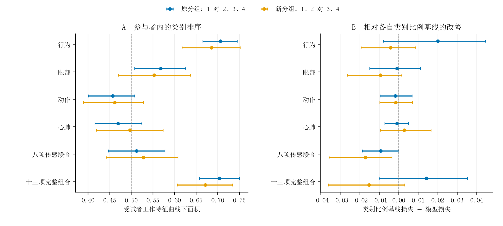

# 两种注意状态二分类目标的真实数据对照

状态：已完成。任务标识：FW-Q1-12VS34-20260929。用户要求查看选项 1、2 对 3、4 的结果；本次按新目标完整训练，原主分析及国赛报告 v6 保持不变。

## 研究问题与判断

原分组区分“完全专注分拣任务”与其余状态；新分组区分“任务或实验相关内容”与“无关思维或思维空白”。正式探针的第二项为“关注实验本身，但没有聚焦于分拣任务”，因此两种划分回答不同问题。新分组适合作为补充分析，当前主问题若仍是任务专注，继续采用原分组。

新分组中，行为模型和十三项完整组合仍包含跨参与者的类别区分信息；独立传感联合的区分区间包含 .50，三类传感器在行为基础上的增量也未稳定改善。当前结果支持保留该补充对照，不据此次观察到的分数更换主标签定义。

## 主要结果

下表为受试者工作特征曲线下面积（area under the receiver operating characteristic curve [AUROC]）及 95% 置信区间（confidence interval [CI]）。先在每位有两类观测的参与者内部计算，再等权平均，.50 为随机排序水平。

| 模型 | 探针数 | 原分组：1 对 2、3、4 | 新分组：1、2 对 3、4 |
|---|---:|---:|---:|
| 行为 | 2316 | .7060 [.6656, .7447] | .6853 [.6175, .7517] |
| 眼部 | 1775 | .5683 [.5080, .6257] | .5529 [.4701, .6362] |
| 动作 | 2296 | .4569 [.4008, .5079] | .4619 [.3890, .5282] |
| 心肺 | 2198 | .4691 [.4159, .5240] | .4968 [.4187, .5732] |
| 八项传感联合 | 1705 | .5119 [.4475, .5774] | .5278 [.4415, .6079] |
| 十三项完整组合 | 1703 | .7035 [.6580, .7500] | .6713 [.6061, .7339] |

同一行两目标使用相同探针和特征，但能计算两类区分指标的参与者随标签而变：行为为 49→38，眼部 48→36，动作 49→38，心肺 46→34，传感联合及完整组合均为 45→32。因此表中跨目标差异属于描述性对照，不是相同结果变量上的优劣检验。眼部、动作、心肺采用各自与行为的共同比较集合，独立传感联合为 1705 个，完整组合为 1703 个。

行为集合共 2316 个探针，原选项 1、2、3、4 分别为 1591、467、94、164；合并后为 2058 对 258，第一类占 88.86%。新目标的行为、传感联合、完整组合对数损失分别为 0.394312、0.401165、0.399305，对应训练类别比例基线分别为 0.390053、0.384009、0.384095。相对各自基线的改善分别为 −0.004259，95% CI [−0.019370, 0.008657]；−0.017156 [−0.035748, −0.003530]；−0.015210 [−0.036182, 0.002990]。三者均未显示概率损失改善，传感联合区间位于零以下。

默认 .50 概率阈值下，新目标的平衡准确率分别为 .4983、.5000、.5023。行为模型正确识别 3、4 类合并观测为 0/258，传感联合为 0/203，完整组合为 1/203。模型具有一定排序信息与默认阈值下少数类识别不足可以同时存在；类别合并后的普通准确率不宜单独作为效果指标。未利用留出数据调整阈值或选择新的类别权重。

在各自共同样本上，向行为模型添加眼部、动作和心肺后，对数损失改善分别为 −0.007341，95% CI [−0.018464, 0.000134]；−0.003557 [−0.010901, 0.001399]；0.001192 [−0.008387, 0.009658]。均未显示稳定增量。完整组合保留眼部相对移除眼部的损失改善为 −0.010689 [−0.021157, −0.003038]；完整的 28 项比较随文保存，不据单项补充比较重新搜索特征。

图中点为参与者等权估计，横线为 95% CI。左图仅纳入可计算两类区分指标的参与者；右图纳入该集合全部参与者，并分别以对应标签的训练类别比例为基线。右图正值表示模型损失低于基线。

## 方法、验证与复现

新目标沿用当前修复后的 25 个分析集合、56 行模型、28 项比较、30 s 窗口、参与者等权训练、逻辑回归和相同正则化候选。外层留一参与者交叉验证（leave-one-subject-out cross-validation [LOSO]），内层五折参与者分组验证。原始四类标签不变，仅改变二分类编码，重新训练全部新目标模型。旧目标仅从冻结折外预测复算用于对照，没有重复训练。缺失处理、标准化和参数选择均限制在训练折。区间采用固定折外预测的参与者整簇自助抽样 1000 次，不含训练过程的再次抽样。

完成 3297 个模型外层折、16485 个内层折，失败预测为 0。逐折核对原始标签、样本键、输入特征、训练测试参与者划分、预处理拟合身份和参数选择；均通过。另以独立指标实现复算 56 行对数损失、布里尔分数、类别比例基线、区分面积和平衡准确率，复算 28 项配对改善及区间。旧目标 56 行损失和区分面积均与冻结总账一致。

运行前完成 15 项核心测试及 4 项流程集成测试；加入外层折分块后完成 16 项核心测试，包含串行与分块的预测和完整逐折审计精确等价。首两集合由代码 85a7b77 运行；其后由 96d9e11 分块执行。六集合完成后的 Windows 文件名冒号问题在 06999e2 修正，尚未开始的其余集合恢复执行；已完整核验的六集合按哈希复用。该修正只影响文件路径，不改变模型或样本。

正式探针文字核验自 FocusWave 的 formaltest 分支提交 f6c0aed944bf6c4ab4daaf5cb2ecb1d715f9df0c，文件 `01-MainProgram/素材/探针1.png`，图像对象校验 76e62d2e605f26669a124c561ca8631c870852d8。方案在新结果生成前登记于正式仓库 e2c60d8；性质为用户要求的事后补充分析。

代码仓库：Attention-Analysis，分支 codex/formal-analysis-v2-portable。入口 `scripts/run_q1_12vs34_sensitivity.py`，复核 `scripts/verify_q1_12vs34_results.py`，配置 `configs/supervised_learning_q1_12vs34_sensitivity.yaml`。代码版本和输入输出校验值详见运行清单。

本机结果：`D:\Project\厚粲杯\11_数据\_FormalAnalysis\SupervisedRunsV5_Q1_12vs34`。输入来自 `SupervisedRunsV4_Cardiopulmonary/repair_20260928/inputs`；每集合保存逐探针预测、逐折审计、运行元数据。逐行数据与参与者身份不提交，仓库只收聚合结果、图件及校验清单。

国赛报告 v6 校验值仍为 379e648b7ba410348d2b46cd18ca7432626b14fbcf5886dcfb6e4c2c1dc040e7。本次交付补充结果，不自动改动报告或恢复已移出的四分类预测。下一决策是依据研究问题决定该补充分析在报告中的位置，现有计算与验证已完成。

## 文件索引

- [model_results.csv](09-29-3-model_results.csv)
- [primary_target_results.csv](09-29-3-primary_target_results.csv)
- [paired_results.csv](09-29-3-paired_results.csv)
- [main_model_comparison.csv](09-29-3-main_model_comparison.csv)
- [label_distribution.csv](09-29-3-label_distribution.csv)
- [independent_verification.json](09-29-3-independent_verification.json)
- [manifest.json](09-29-3-manifest.json)
- [target_comparison.png](09-29-3-target_comparison.png)
